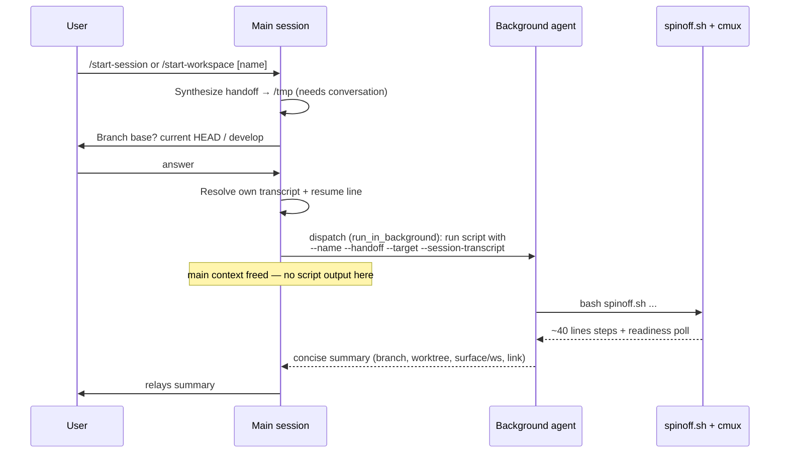

# feat: cmux-spinoff background execution + new-workspace command

**Target repo:** `shrimpshack` (plugin lives at `plugins/cmux-spinoff/`). All paths below are relative to the repo root.

---

## Summary

Two improvements to the `cmux-spinoff` plugin:

1. **Background execution by default.** Today `/start` runs the mechanical worktree+cmux work inline, so ~40 lines of step output plus a 30-iteration readiness-poll loop land in the main session's context. Move that mechanical work into a **background agent**: the main session does only the part that needs the conversation (synthesize the handoff, ask the one branch-base question), then dispatches the script run to a background agent that reports back a short summary.
2. **A new-workspace variant.** Add a second command that spins the work off into a **brand-new cmux workspace** (two panes — briefed Claude on the left, the handoff markdown on the right) instead of a tab in the current workspace. Both behaviors share one skill and one script, selected by a `--target` flag.

Commands end up as `/start-session` (tab in current workspace — today's behavior) and `/start-workspace` (new workspace), with `/start` kept as a back-compat alias for `/start-session`.

---

## Problem Frame

`/start` is a context tax on the session that invokes it. The handoff synthesis genuinely needs the full conversation and must stay in the main session — but everything after it (running `spinoff.sh`, watching its step output, polling cmux for the new Claude's readiness, verifying the kickoff submitted) is mechanical and produces a lot of noise that the main session never needs to retain. That noise is exactly what the user wants out of the main context.

Separately, `/start` only ever opens a **tab** on the current workspace's left agent pane. Sometimes the right move is a clean new workspace for the spun-off stream, not another tab competing for space in the current one.

---

## Scope Boundaries

**In scope:**
- A background-agent execution model for the mechanical half of the spinoff.
- A `--target tab|workspace` option on `spinoff.sh` and the new-workspace launch path (two-pane: agent + handoff viewer).
- Command rename to `/start-session` + new `/start-workspace`, with `/start` aliased.
- Making the source-session link robust under backgrounding (explicit transcript passthrough).
- Updated SKILL.md, README.md, plugin.json.

**Out of scope (not this product's identity):**
- Changing the handoff doc format/sections.
- Changing worktree nesting (`<repo>/worktrees/<name>`) or branch-prefix conventions.
- Auto-triggering the skill from conversational phrasing — it stays command-invoked only.

### Deferred to Follow-Up Work
- A `--target window` mode (whole new cmux window) — natural extension once workspace mode lands.
- Configurable two-pane split ratio / right-pane content. Default fixed for now.

---

## Key Technical Decisions

**KTD1 — Split the flow: synthesis in main, mechanics in a background agent.**
The main session keeps the two steps only it can do: synthesize the handoff (needs the conversation) and ask the single branch-base question (needs an interactive answer — a background agent can't prompt the user). It then dispatches a **background agent** (`Agent` with `run_in_background: true`) whose entire job is: run `spinoff.sh` with the resolved args, watch it complete, and return a tight summary (branch, worktree path, surface/workspace ref, transcript link). The verbose step output and readiness-poll chatter live in the background agent's context, not the main session's. The main session relays the summary when the agent finishes.

**KTD2 — Pass the source-session transcript explicitly (load-bearing).**
`spinoff.sh` currently auto-discovers the originating session via `CLAUDE_SESSION_ID` / newest `*.jsonl` in the project dir. Run from inside a background agent, that heuristic can resolve to the *agent's own* transcript instead of the main session's — silently corrupting the "resume where you left off" link, which is the whole point of the handoff. Fix: the **main session** resolves its own transcript path + `claude -r <uuid>` resume line and passes them to the script via a new `--session-transcript <path>` flag. The script uses the passed value verbatim; existing auto-discovery stays as the fallback when the flag is absent (e.g. manual script runs). This also fixes a latent bug where the script computes the project key from the worktree repo root rather than the invoking session's cwd.

**KTD3 — One script, one skill, two commands via `--target`.**
Add `--target tab|workspace` (default `tab`) to `spinoff.sh`. `/start-session` invokes the skill with tab target (today's behavior, unchanged); `/start-workspace` invokes it with workspace target. Keep `/start` as a thin alias to `/start-session` so existing muscle memory and the published command keep working. (Default chosen for back-compat; flagged here for review since it adds a third command file.)

**KTD4 — Two-pane workspace built from verified cmux primitives.**
`cmux new-workspace --name <n> --cwd <worktree> --focus true` creates the workspace with a left terminal pane; launch+brief Claude there (reusing today's readiness-poll/kickoff logic). Then `cmux new-pane --direction right` adds a right pane and `cmux open <worktree>/docs/handoff.md --pane <right>` renders the handoff in cmux's live-reload markdown viewer. The existing launch+brief block is refactored into a shared shell function so both the tab and workspace paths use the same battle-tested readiness polling.

---

## High-Level Technical Design

The context-saving win comes from where each step runs:

The branch-base question is the one synchronous interaction; it happens **before** dispatch precisely because the background agent has no way to ask it.

---

## Implementation Units

### U1. Add `--session-transcript` and `--target` options to `spinoff.sh`

**Goal:** Make the script accept an explicit source-session transcript and a launch target, without changing default behavior.

**Requirements:** Enables KTD2 (correct link under backgrounding) and KTD3 (one script, two targets).

**Dependencies:** none.

**Files:**
- `plugins/cmux-spinoff/skills/cmux-spinoff/scripts/spinoff.sh`

**Approach:**
- Parse two new flags in the arg loop: `--session-transcript <path>` and `--target <tab|workspace>` (default `tab`). Reject unknown `--target` values with `die`.
- In the transcript-discovery block: if `--session-transcript` was passed and the file exists, derive `UUID` and build `SESSION_LINE` from it directly; skip auto-discovery. Keep the existing env/newest-jsonl discovery as the fallback path when the flag is absent.
- Resolve the resume `cd` directory from the passed transcript's project context rather than `REPO_ROOT` when the flag is used (the invoking session's cwd, not the worktree repo). Keep `REPO_ROOT` for the fallback path.

**Patterns to follow:** mirror the existing `while [ $# -gt 0 ]` arg-parsing and `die`/`step` helper usage already in the script.

**Test scenarios:**
- Passing `--session-transcript /tmp/fake.jsonl` (existing file) produces a `Resume:` line containing that UUID and the correct `cd` dir.
- Omitting the flag falls back to the current auto-discovery and still emits a `Resume:` line (or the "not found" placeholder) — i.e. no behavior change for existing callers.
- `--target bogus` exits non-zero with a clear message; `--target tab` and `--target workspace` are accepted.
- `Covers` the back-compat invariant: an invocation with only the old flags (`--name --handoff`) behaves exactly as before.

**Verification:** Run the script with old-only flags against a throwaway repo and confirm the worktree/handoff output is identical to current `main`; run with `--session-transcript` and confirm the resume line uses the passed path.

---

### U2. Refactor the launch+brief logic into a shared function and add the workspace path

**Goal:** Extract today's "create surface → launch claude → poll readiness → send kickoff → verify submit" sequence into a reusable function, then implement the `--target workspace` two-pane path on top of it.

**Requirements:** KTD4 (two-pane workspace), and the refactor that makes it DRY.

**Dependencies:** U1 (the `--target` flag must exist).

**Files:**
- `plugins/cmux-spinoff/skills/cmux-spinoff/scripts/spinoff.sh`

**Approach:**
- Factor the existing block (lines ~157–213 today: surface creation, `send` launch, the 30× readiness poll, kickoff send, submit-verify) into a function like `launch_and_brief(workspace, surface)` that takes a workspace + surface ref and runs the launch/poll/brief/verify against them. Both targets call it once they have a surface.
- `--target tab` (default): unchanged — identify the left agent pane, `new-surface`, then `launch_and_brief`.
- `--target workspace`:
  1. `cmux new-workspace --name "$NAME" --cwd "$WORKTREE" --focus true`; parse the new `workspace:N` ref from output (grep, same defensive style as today's `surface:` parse).
  2. Find the workspace's terminal surface via `cmux tree --workspace <ws>` (reuse today's awk pattern); `launch_and_brief` against it.
  3. `cmux new-pane --direction right --workspace <ws> --focus false`; parse the new pane ref.
  4. `cmux open "$WORKTREE/docs/handoff.md" --pane <right> --workspace <ws> --no-focus` to render the handoff in the markdown viewer.
- Keep all cmux calls guarded by the existing `CMUX_WORKSPACE_ID` + `-x "$CMUX"` check; on parse failure, fall back and print the manual command (same philosophy as today's tab path).

**Patterns to follow:** the existing surface-ref parsing (`grep -oE 'surface:[0-9]+'`), the `tree | awk` pane discovery, and the readiness-poll loop — all already in the script.

**Execution note:** Refactor first (extract function, confirm tab path still works), then add the workspace branch — so the known-good tab path is never broken mid-change.

**Test scenarios:**
- Tab target after refactor produces the same surface launch + kickoff as before (no regression).
- Workspace target outside cmux (`CMUX_WORKSPACE_ID` unset): script still creates worktree + handoff and prints the manual `cd … && claude`, skipping cmux automation.
- Workspace target with a parseable `new-workspace` ref: a workspace is named after the feature, Claude launches in the left pane, the handoff opens as a markdown tab on the right.
- `new-workspace` output that doesn't yield a ref: script reports the raw cmux output and degrades gracefully (no hard crash).
- Leftover terminal tab in the right pane is acceptable for v1 (see risk); test only asserts the markdown tab is present, not that it's the sole tab.

**Verification:** Live run `/start-workspace` inside a cmux session and confirm a new workspace appears with the two panes and a briefed Claude; live run `/start-session` and confirm the tab behavior is unchanged.

---

### U3. Command files: `/start-session`, `/start-workspace`, and `/start` alias

**Goal:** Expose the two behaviors as discoverable commands and preserve `/start`.

**Requirements:** KTD3.

**Dependencies:** U4 (the skill must describe the background + target model the commands point at — author together; commands are thin pointers to the skill).

**Files:**
- `plugins/cmux-spinoff/commands/start-session.md` (new — current `start.md` content, target = tab)
- `plugins/cmux-spinoff/commands/start-workspace.md` (new — target = workspace)
- `plugins/cmux-spinoff/commands/start.md` (modify — becomes a thin alias that invokes the skill with tab target, noting it's kept for back-compat)

**Approach:**
- Each command's body states which `--target` the skill should use and carries the same `$ARGUMENTS` → feature-name/handoff-focus convention as today.
- `start-workspace.md` description emphasizes "brand-new cmux workspace, two panes" so it's distinguishable in the command list.
- Keep all three descriptions accurate about the background-execution model (so the user knows the main session stays light).

**Patterns to follow:** the existing `commands/start.md` frontmatter + body shape.

**Test scenarios:** `Test expectation: none — these are declarative command markdown files.` Manual check: all three commands appear in the picker with distinct, accurate descriptions, and each routes to the skill with the intended target.

**Verification:** `/start-session`, `/start-workspace`, and `/start` all resolve and trigger the skill; `/start` behaves as `/start-session`.

---

### U4. Update SKILL.md for the background-execution model and dual targets

**Goal:** Rewrite the skill so it instructs the main session to (a) synthesize the handoff, (b) ask branch base, (c) resolve its own transcript, (d) **dispatch a background agent** to run the script, (e) relay the summary — and document the `tab` vs `workspace` target.

**Requirements:** KTD1, KTD2, KTD3, KTD4.

**Dependencies:** U1, U2 (the flags/behaviors the skill describes must exist).

**Files:**
- `plugins/cmux-spinoff/skills/cmux-spinoff/SKILL.md`

**Approach:**
- Update "The workflow at a glance" and the step sections: insert a step where the main session resolves its transcript and passes `--session-transcript`, and a step where it dispatches the background agent instead of running the script inline.
- Specify the background-agent contract precisely: it runs the one `bash spinoff.sh …` invocation, does not re-synthesize anything, and returns only the summary fields. Give the exact flags (`--name`, `--handoff`, `--target`, `--session-transcript`, optional `--base`/`--branch-prefix`).
- Document branch-base resolution staying in the main session (and why — the background agent can't prompt).
- Add a short "Targets" subsection: `tab` = surface in current workspace's left agent pane; `workspace` = new two-pane workspace (agent + handoff viewer).
- Preserve the "command-invoked only / never auto-trigger" guardrail and the "When the script can't do something" degradation notes (extend them with the workspace failure modes from U2).

**Patterns to follow:** the existing step-by-step structure and tone of SKILL.md.

**Test scenarios:** `Test expectation: none — documentation.` Quality check: an agent reading only SKILL.md can run `/start-workspace` correctly, knows to background the script, and knows to pass the transcript explicitly.

**Verification:** Dry-read the skill and confirm it unambiguously directs background dispatch + transcript passthrough + target selection.

---

### U5. Update README.md and plugin.json

**Goal:** Reflect the new commands, background model, and bump the version.

**Requirements:** keeps the published surface accurate.

**Dependencies:** U3, U4.

**Files:**
- `plugins/cmux-spinoff/README.md`
- `plugins/cmux-spinoff/.claude-plugin/plugin.json`

**Approach:**
- README: document `/start-session` and `/start-workspace` (and `/start` alias), the two-pane workspace behavior, and that mechanical work runs in a background agent so the calling session stays light.
- plugin.json: bump `version` (`0.1.0` → `0.2.0`, feature add) and update `description` to mention both targets and the background model. (Commands are auto-discovered from `./commands`; no manifest list to maintain.)

**Patterns to follow:** existing README section structure and the current plugin.json shape.

**Test scenarios:** `Test expectation: none — docs/manifest.` Check: `plugin.json` stays valid JSON and the version bumped; README "Use" section lists both commands accurately.

**Verification:** `plugin-validator` (or a JSON parse) passes on the manifest; README matches actual command behavior.

---

## Risks & Mitigations

- **Background agent can't ask the branch-base question.** Mitigated by KTD1 — the question fires in the main session before dispatch. If the user picked "default to current HEAD silently" later, this constraint disappears; current choice keeps the one question.
- **`new-workspace` output ref format is unverified live.** Parsing is defensive (grep for `workspace:N`), with graceful fallback to the manual command on parse failure — same pattern the tab path already uses for `surface:`.
- **Leftover empty terminal tab in the right pane.** `new-pane` creates a terminal; `cmux open` adds the markdown as a second tab in that pane. Acceptable for v1; a later refinement could close or repurpose the terminal tab. Noted, not blocking.
- **Transcript passthrough drift.** If the main session resolves the wrong transcript, the resume link breaks silently. Mitigation: resolve it the same way the script does today (env first, newest-jsonl fallback) but in the main session where "newest" is unambiguously this conversation; verify the emitted `Resume:` line points at a real file in the background agent's summary.

---

## Sources & Research

- Verified cmux primitives live: `new-workspace` (`--name/--cwd/--command/--layout/--focus`), `new-pane` (`--direction left|right|up|down`, `--type`), `open <md> --pane` (markdown live-reload preview), `new-surface`, `tree`, `send`, `read-screen`, `rename-tab`.
- Current implementation read end-to-end: `commands/start.md`, `skills/cmux-spinoff/SKILL.md`, `skills/cmux-spinoff/scripts/spinoff.sh`, `README.md`, `.claude-plugin/plugin.json`.
- cmux config confirms `openMarkdownInCmuxViewer: true` (native markdown viewer is the right-pane target).
