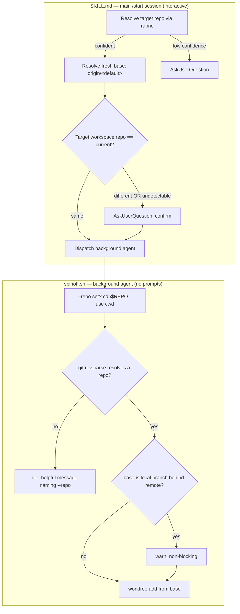

# feat: make spinoff root- and workspace-aware

## Summary

Teach the spinoff plugin to root a new worktree in the **right repo** from a
**fresh base**, and to confirm before a spinoff lands in a **different cmux
workspace** than the one it forked from. The originating `/start` session already
knows the target repo, so the caller resolves repo + base from a rubric and passes
them explicitly; the script gains a `--repo` flag, a helpful failure message, and a
non-blocking stale-base warning as deterministic backstops.

Governing principle (origin): the main session is **engaged in the decision** — it
acts autonomously from a rubric and escalates via `AskUserQuestion` only on low
confidence. Because the mechanical script runs in a **backgrounded agent that cannot
ask the user**, all rubric-driven resolution and escalation lives in the interactive
main session (SKILL.md), before dispatch; the script executes already-resolved,
high-confidence values plus its dumb guards.

---

## Problem Frame

`spinoff.sh:53` does `REPO_ROOT="$(git rev-parse --show-toplevel)" || die "not inside
a git repo"`, assuming the originating session's cwd is inside the target repo. When
`/start` runs from `~/Users/shawnroos` (not a git repo) the script dies; the current
workaround is the background agent manually `cd ~/projects/<repo>` first. Separately,
branching off a stale local `main` reproduced the old plugin layout twice this session.
And a spinoff can silently open a tab in a workspace anchored on a different repo than
the one being forked.

In scope: the `--repo` flag + fail-loud resolution and stale-base warn guard in
`spinoff.sh`; the caller-side rubrics (repo, fresh base, workspace-confirm) and the
HEAD→`origin` base correction in `SKILL.md`; the version bump so the store serves it.

---

## Requirements

| R-ID | Requirement | Units |
| --- | --- | --- |
| R1 | `--repo` flag roots the worktree via `cd "$REPO"` (before line 53); absent → cwd fallback; neither → helpful die naming `--repo` (see origin: `docs/brainstorms/2026-06-26-root-aware-spinoff-requirements.md`) | U1 |
| R2 | Caller (SKILL.md) resolves and passes `--repo` + `--base origin/<default>` from a rubric; escalate only on low confidence | U3 |
| R3 | Fresh base via existing `origin/*` fetch path; script warns (non-blocking) when the resolved base is a local branch behind its remote | U2, U3 |
| R4 | SKILL.md pre-flight: resolve target vs current workspace repo; confirm on mismatch / low confidence before dispatch | U4 |
| — | Version-gated store: bump plugin + marketplace manifests so the change is served (memory `project_shrimpshack_plugin_store_version_gated`) | U5 |

---

## Key Technical Decisions

- **`--repo` redirects all repo-relative git calls via a single `cd "$REPO"`** before
  line 53, rather than threading `git -C "$REPO"` through every call site. `REPO_ROOT`
  (53) feeds `MAIN_ROOT` (56, `git rev-parse --git-common-dir`), `CUR_BRANCH` (63,
  `git rev-parse --abbrev-ref`), `PROJ_KEY` (129), and the carry-over walk (179/185) —
  all currently cwd-relative. `cd` once makes every one correct with the smallest diff;
  downstream code already uses `$REPO_ROOT`/`$MAIN_ROOT`/`git -C "$MAIN_ROOT"`, so no
  further changes are needed. The worktree-vs-main-tree walk (56–61) stays untouched.
- **Backward compatibility is the cwd fallback.** No `--repo` → resolve from cwd exactly
  as today. Only the failure *message* changes (helpful, names `--repo`), not the
  success path — existing in-repo `/start` invocations are unaffected.
- **The `cd` shifts originating-context derivations — canonicalize and pass the session
  flags.** With `--repo`, `REPO_ROOT` becomes the *target* repo (the originating `/start`
  session is outside it — that's the whole point). Two consequences must be handled or the
  resume link (the skill's stated core value) silently breaks:
  1. **Relative file args break across the `cd`.** `--handoff` is validated at
     `spinoff.sh:42` (pre-`cd`) but read by Python at `:161` (post-`cd`); `--session-transcript`
     is likewise read post-`cd`. A relative path passes validation then fails the read.
     Fix: canonicalize `--handoff` and `--session-transcript` to absolute *before* the `cd`.
  2. **The transcript auto-discovery fallback points at the wrong repo.** `PROJ_KEY` (129)
     and `RESUME_CWD` (149) derive from `REPO_ROOT`, so under `--repo` the newest-`.jsonl`
     fallback searches the target repo's project dir (no originating session there) and the
     resume `cd` lands in the target repo. Under `--repo` the caller's explicit
     `--session-transcript`/`--session-cwd` are therefore **load-bearing, not optional** —
     U3 reflects this. (The SKILL.md happy path already passes them absolute; this makes the
     dependency explicit rather than incidental.)
- **Freshness leans on existing code.** The base block (`spinoff.sh:84–92`) already
  fetches when `--base` matches `origin/*`. R3's happy path is the caller passing
  `--base origin/<default>`; the script only *adds* a warn guard for the local-and-behind
  case. No change to the default-base behavior (still current HEAD when `--base` absent) —
  rejected auto-defaulting to origin to avoid surprising someone who wanted local HEAD.
- **Default-branch detection is caller-side and cheap.** SKILL.md resolves
  `git -C "$REPO" symbolic-ref --short refs/remotes/origin/HEAD 2>/dev/null | sed 's@^origin/@@'`
  with a `main` fallback. Keeps the script free of branch-detection logic.
- **Workspace-repo detection is deferred to execution, with a fail-safe default.** cmux's
  `tree` exposes surface refs, not cwds (verified against `spinoff.sh:296–299`), so the
  exact "current workspace's repo" query is an execution-time unknown. The rubric is fixed
  now: same repo → proceed silently; different → confirm; **undetectable → treat as low
  confidence → confirm** (do not proceed silently).

---

## High-Level Technical Design

Where each decision lives — caller (interactive, can ask) vs script (backgrounded,
deterministic backstops only):

The diagram is authoritative for *where* each resolution and escalation happens; the
exact cmux query backing the `workspace repo == current?` node is the one deferred
implementation detail (see Risks & Dependencies — "cmux cwd query").

---

## Implementation Units

### U1. `--repo` flag + fail-loud repo resolution

- **Goal:** Root the worktree in an explicitly-passed repo; fall back to cwd; replace the
  bare `die "not inside a git repo"` with a message that names `--repo`.
- **Requirements:** R1
- **Dependencies:** none
- **Files:**
  - `plugins/spinoff/skills/spinoff/scripts/spinoff.sh` (arg block ~22–35; repo block ~52–53)
  - `plugins/spinoff/skills/spinoff/scripts/smoke.sh` (test)
- **Approach:** Add `--repo) REPO="$2"; shift 2 ;;` to the arg `case` and a `REPO=""`
  default. Before line 53: if `[ -n "$REPO" ]`, validate `[ -d "$REPO" ]` (else `die
  "--repo path not found: $REPO"`) and `cd "$REPO"` (else die). Then keep the existing
  `REPO_ROOT="$(git rev-parse --show-toplevel 2>/dev/null)"`, changing only the `die`
  text to name `--repo` and how to pass it. Leave the main-tree walk (56–61) and all
  `$REPO_ROOT`/`$MAIN_ROOT` consumers untouched — the `cd` makes them correct.
  **Before the `cd`, canonicalize `HANDOFF_SRC` and `SESSION_TRANSCRIPT` to absolute**
  (e.g. via a small `abspath` helper or `cd "$(dirname)" && pwd`) so a relative path passed
  by a caller doesn't pass pre-`cd` validation (`:42`) then fail the post-`cd` read (`:161`,
  `:138`). See the KTD "The `cd` shifts originating-context derivations".
- **Patterns to follow:** existing arg `case` and `die` helper (`spinoff.sh:23–38`); the
  smoke harness's `run()` wrapper and `ok`/`bad` assertions (`smoke.sh`).
- **Test scenarios** (`smoke.sh`):
  - Covers R1. `--repo <valid-repo>` from a non-repo cwd → worktree created under that
    repo's `worktrees/`; exit 0.
  - `--repo <nonexistent-path>` → non-zero exit, message names the bad path.
  - No `--repo`, cwd inside a git repo → unchanged behavior, worktree created (back-compat).
  - No `--repo`, cwd NOT a git repo → non-zero exit, message mentions `--repo` (not the
    bare "not inside a git repo").
  - `--repo <valid-repo>` with a **relative** `--handoff` path (cwd outside the repo) →
    handoff body still lands in the worktree (canonicalized before `cd`), not silently
    dropped to the placeholder fallback.
- **Verification:** `bash smoke.sh` passes; a manual `--repo` run from `/tmp` roots the
  worktree in the named repo and writes the real handoff body.

### U2. Stale-base warn guard

- **Goal:** Warn (non-blocking) before `worktree add` when the resolved base is a local
  branch that is behind its upstream.
- **Requirements:** R3 (script half)
- **Dependencies:** U1
- **Files:**
  - `plugins/spinoff/skills/spinoff/scripts/spinoff.sh` (after base resolution ~92, before `worktree add` ~96)
  - `plugins/spinoff/skills/spinoff/scripts/smoke.sh` (test)
- **Approach:** After `BASE_REF` is set, when it is a local branch (not `origin/*`), check
  for an upstream and a behind-count: `git -C "$MAIN_ROOT" rev-list --count
  "$BASE_REF..$BASE_REF@{upstream}"`. If the upstream lookup succeeds and the count > 0,
  print a loud `⚠` warning (count + branch + that it may be stale) to stderr and continue.
  No upstream (lookup fails) → silent skip; never block, never fetch the local branch.
- **Patterns to follow:** the existing `origin/*` base handling and `step`/`echo "⚠"`
  conventions (`spinoff.sh:84–93, 136`).
- **Fixture note (behind-upstream):** `$BASE_REF@{upstream}` only resolves with real
  tracking config, which the current `smoke.sh` (`git init`, no remote) lacks. Build the
  state with local plumbing — no network: create branch `feat`, advance a remote-tracking
  ref directly (`git update-ref refs/remotes/origin/feat <ahead-sha>`), then
  `git config branch.feat.remote origin` + `git config branch.feat.merge refs/heads/feat`
  so `feat@{upstream}` resolves and `rev-list --count` reports >0. Assert the no-upstream
  case explicitly too, so a broken `@{upstream}` lookup isn't mistaken for the intended skip.
- **Test scenarios** (`smoke.sh`):
  - Covers R3. Base = local branch behind a seeded upstream (per fixture note) → warning
    line emitted AND worktree still created (exit 0).
  - Base = local branch with no upstream → no warning, no error, worktree created.
  - Base = `origin/<branch>` → no stale warning (fresh path).
- **Verification:** `bash smoke.sh` passes including the behind-upstream fixture; warning
  text appears on stderr without changing exit status.

### U3. SKILL.md — caller resolves `--repo` + fresh base (rubrics)

- **Goal:** Instruct the main session to resolve the target repo and a fresh base from a
  rubric and pass `--repo` + `--base origin/<default>`; correct the Step 2 recommendation
  from "branch off current HEAD" to the fresh-`origin` default.
- **Requirements:** R2, R3 (caller half); governing principle
- **Dependencies:** none (doc; pairs with U1/U2)
- **Files:** `plugins/spinoff/skills/spinoff/SKILL.md` (Step 2 ~109–119; Step 3–4 ~121–170)
- **Approach:** Rewrite Step 2 to recommend `--base origin/<default-branch>` (fresh) as the
  default, keeping current-HEAD as the deliberate "carry in-progress context" opt-in.
  Add a **repo rubric** (derive from the work / carried docs / `--session-cwd` when it is a
  git repo; confident → pass `--repo`; ambiguous → `AskUserQuestion`) and a **base rubric**
  (default-branch detection one-liner; unsure → ask). Add `--repo` and `--base` to the
  dispatch command block (~160–170). State the engaged-agent / escalate-on-low-confidence
  principle once, near Step 2. **Drop the Step 3 "omit the flags — the script falls back to
  its own discovery" wording for the `--repo` case:** when `--repo` is passed, the
  originating session is outside the target repo, so `--session-transcript` +
  `--session-cwd` are load-bearing for a correct resume link (the `REPO_ROOT`-derived
  fallback would search the wrong repo). Instruct the caller to always pass them — absolute —
  whenever `--repo` is set.
- **Patterns to follow:** existing Step 2/3/4 prose and the dispatch code block style.
- **Test expectation: none -- SKILL.md is procedural guidance with no executable behavior;
  validated by review against U1's flag contract.**
- **Verification:** the dispatch block names `--repo` and `--base origin/<default>`; Step 2
  no longer recommends local HEAD as the default; rubrics name the `AskUserQuestion`
  escape and where it must run (main session, pre-dispatch).

### U4. SKILL.md — workspace-confirm pre-flight

- **Goal:** Add a caller pre-flight that resolves the target vs current cmux workspace repo
  and confirms before dispatch when they differ or detection is uncertain.
- **Requirements:** R4; governing principle
- **Dependencies:** U3
- **Files:** `plugins/spinoff/skills/spinoff/SKILL.md` (new pre-flight step before Step 4 dispatch)
- **Approach:** Add a step: before backgrounding, determine the current workspace's anchor
  repo and compare to the resolved `--repo`. Same → proceed silently; different OR
  undetectable → `AskUserQuestion` to confirm. Specify the rubric and the intended cmux
  query direction (read the current workspace's primary terminal surface cwd, then
  `git -C <cwd> rev-parse --show-toplevel`), and explicitly mark the exact cmux command as
  an execution-time detail with the fail-safe (undetectable → confirm). Note the constraint
  that this MUST live in the main session because the background agent cannot prompt.
- **Patterns to follow:** SKILL.md "Step N" structure; the script's own workspace-detection
  via `CMUX_WORKSPACE_ID` + `cmux tree` (`spinoff.sh:245, 296–299`) as the reference point
  for what cmux exposes.
- **Test expectation: none -- procedural doc guidance; no executable behavior.**
- **Verification:** SKILL.md describes same/different/undetectable handling with the
  undetectable→confirm fail-safe, and states the main-session-only constraint.

### U5. Version bump (plugin + marketplace manifests)

- **Goal:** Bump the spinoff plugin version so the version-gated store serves the change.
- **Requirements:** version-gating dependency
- **Dependencies:** U1, U2, U3, U4 (bump represents the shipped behavior change)
- **Files:**
  - `plugins/spinoff/.claude-plugin/plugin.json` (`"version": "0.5.0"` → `0.6.0`)
  - `.claude-plugin/marketplace.json` (spinoff entry, line ~52: `0.5.0` → `0.6.0`)
- **Approach:** Bump both to `0.6.0` (minor — additive feature, backward-compatible). Per
  memory `project_shrimpshack_plugin_store_version_gated`, both manifests must move together
  and the marketplace is refreshed before updating the plugin.
- **Test expectation: none -- version metadata only.**
- **Verification:** both manifests read `0.6.0`; values match.

---

## Scope Boundaries

**In scope:** R1–R4 and the version bump, as above.

**Outside this product's identity (carried from origin):**
- cmux-workspace *inference* of the repo (caller passes `--repo` instead).
- Auto-fetch-and-change-the-default-base when no `--base` is given (warn, don't override).
- Active workspace↔repo identity verification beyond the different-workspace confirm.

**Deferred to Follow-Up Work:**
- Archiving the stale `docs/plans/2026-06-12-001-feat-cmux-spinoff-background-and-workspace-plan.md`
  so it stops tripping the `/auto` detector (noticed during planning; out of this change's scope).

---

## Risks & Dependencies

- **Concurrent edit — `feature/session-naming`** (`~/projects/shrimpshack/worktrees/session-naming`,
  `1a87867`) also edits `spinoff.sh` (adds `claude --name`). Keep U1/U2 edits localized
  (arg block + repo block + base block — disjoint from the launch block `claude --name`
  touches) and **rebase on `origin/main` before landing**; expect a merge.
- **Base ref:** land from this worktree (`origin/main` @ `77cad7c`, renamed `plugins/spinoff/`
  layout), never stale local `main`.
- **cmux cwd query (open):** the exact command behind U4's workspace-repo detection is an
  execution-time unknown; the fail-safe (undetectable → confirm) bounds the risk.
- **Default-branch generality:** assume `main` for shrimpshack; the `origin/HEAD` resolver
  in U3 covers other repos, with `main` fallback.

---

## Test Strategy

`smoke.sh` is the dependency-free harness (git only, cmux disabled via unset
`CMUX_WORKSPACE_ID`) and is the home for all U1/U2 scenarios. Run `bash
plugins/spinoff/skills/spinoff/scripts/smoke.sh` (exit 0 = pass). Run `shellcheck` on
`spinoff.sh` if available. SKILL.md units (U3/U4) and the manifest bump (U5) are
review-verified — no executable behavior.

---

## Parallelism Analysis

- **Parallel-safe:** U1 and U3 are independent (script flag vs doc rubric); U4 depends on
  U3 (same file, sequential). U2 depends on U1 (same file region, sequential).
- **Sequential tail:** U5 (version bump) lands last, after U1–U4, since it represents the
  shipped change.
- Practical ordering: U1 → U2 (spinoff.sh), U3 → U4 (SKILL.md) — the two file-chains can
  proceed in parallel — then U5.
