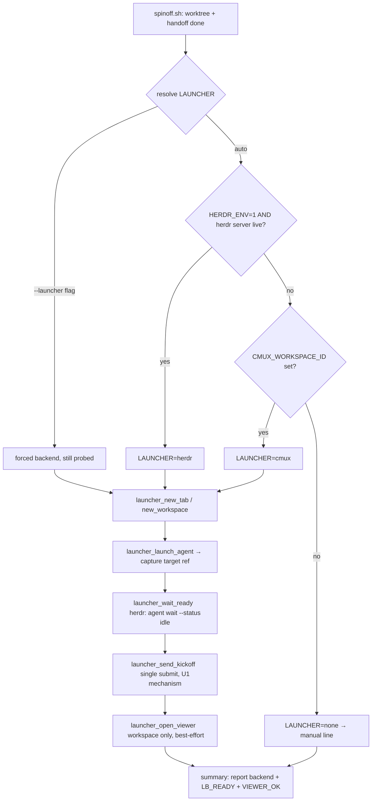

# feat: herdr launch backend for /start (spinoff)

> This plan enriches the directional brief in `docs/handoff.md` with a concrete HOW.
> The code, `herdr`'s live CLI, and the tests are the source of truth.

## Summary

Teach `plugins/spinoff/skills/spinoff/scripts/spinoff.sh` to launch its briefed
Claude session via **herdr** as an alternative backend to cmux, chosen by
auto-detection. Today everything after worktree creation (tab/surface creation,
launch, readiness poll, kickoff send, markdown viewer) is hard-coded to the cmux
CLI; when the session runs under herdr those calls fail (`not_found: Workspace not
found`). We extract a small backend seam with two implementations (cmux, herdr),
pick one at the top from the environment, and route the launch through it. The
herdr path replaces the fragile 30× `read-screen` readiness poll with herdr's
first-class blocking wait. cmux behavior is preserved unchanged when herdr is absent.

---

## Problem Frame

- **Now:** `spinoff.sh` gates all launch automation on `CMUX_WORKSPACE_ID` and calls
  the cmux CLI directly (`launch_and_brief()` ~L322-353; the `CMUX_WORKSPACE_ID`-gated
  block ~L361-435). Under herdr the old cmux workspace id is gone, so the block
  silently no-ops (worktree + handoff still produced, but no launched session).
- **Environment is mixed:** this session has BOTH `HERDR_*` and `CMUX_*` env vars set
  at once (herdr wrapping a cmux-launched shell). Detection cannot key on presence
  alone — it needs a deliberate precedence rule plus a liveness probe.
- **herdr's primitives are strictly better** for the load-bearing step: a real
  blocking readiness wait (`agent wait --status idle` / `wait output --match`) instead
  of scraping the screen 30 times for a `❯` glyph.

**Goal:** add herdr as an additional, auto-detected backend without removing cmux;
retire the screen-scrape readiness poll on the herdr path; keep the worktree+handoff
fallback intact.

---

## Requirements

- **R1** Detect the launch backend and choose one deterministically: herdr when
  `HERDR_ENV=1` AND the herdr server is reachable; else cmux when `CMUX_WORKSPACE_ID`
  is set; else the existing worktree+handoff+manual-line fallback. (Both env sets may
  be present — precedence is explicit.)
- **R2** A `--launcher herdr|cmux|auto` override flag (default `auto`) forces a backend
  or preserves detection.
- **R3** Extract a backend seam so the launch region calls backend-neutral functions,
  with cmux and herdr implementations selected once. cmux implementation is
  behavior-preserving (byte-equivalent CLI calls to today).
- **R4** herdr `--target tab`: create a tab/surface in the current herdr workspace,
  launch `claude` in the worktree, block on readiness, send the kickoff once, verify.
- **R5** herdr `--target workspace`: create a new herdr workspace, launch briefed
  Claude on the left, and render the handoff in a right pane **if** herdr exposes a
  markdown viewer; otherwise degrade to viewer-optional (launch still succeeds).
- **R6** herdr readiness **prefers** a blocking primitive (`agent wait --status idle`,
  then `wait output --match`) over the `read-screen` poll. A bounded `pane read` poll is
  permitted on the herdr path ONLY as a last-resort fallback when U1 finds neither
  blocking primitive fires for a freshly-exec'd interactive `claude` — the herdr path
  must never be left with no readiness signal at all.
- **R7** The kickoff fires with a **single** submit whose exact mechanism is decided by
  a live spike (U1) — no auto-fire-cascade double-send.
- **R8** When herdr is selected but the server probe fails (stale `HERDR_ENV=1`), fall
  back exactly like the cmux block does (don't strand the launch).
- **R9** The summary block and honesty flags (`LB_READY`, `VIEWER_OK`) report the
  backend actually used and its real readiness/viewer state.
- **R10** Test coverage: bats tests for detection/precedence + `bash -n` validity;
  `SKILL.md` prose updated where it hard-codes cmux.

---

## Key Technical Decisions

### KTD-1 — Backend seam is a set of shell functions dispatched by a `$LAUNCHER` variable
Bash has no interfaces; the idiomatic, reviewable shape is a family of
`launcher_<verb>()` functions with cmux/herdr variants and a single resolved
`LAUNCHER` value chosen at the top. The launch region calls the neutral verbs; each
verb dispatches on `$LAUNCHER`. Verbs (from the handoff): `launcher_new_tab`,
`launcher_launch_agent`, `launcher_wait_ready`, `launcher_send_kickoff`,
`launcher_open_viewer` (+ a `launcher_new_workspace` / `launcher_find_left_pane` pair
as the mapping needs). Rationale: keeps the diff localized, lets the cmux path stay
byte-identical, and makes each backend independently testable.

*Dispatch style is directional, not prescriptive* — a `case "$LAUNCHER"` inside each
verb, or two function sets with a name-indirection, are both acceptable; the
implementer picks whichever reads cleanly against the existing script style.

### KTD-2 — Detection precedence: herdr (live) > cmux > fallback
```
if [ "$LAUNCHER" = auto ]; then
  if [ "${HERDR_ENV:-}" = 1 ] && herdr status server (reachable); then LAUNCHER=herdr
  elif [ -n "${CMUX_WORKSPACE_ID:-}" ] && [ -x "$CMUX" ];        then LAUNCHER=cmux
  else                                                                LAUNCHER=none
fi
```
The **liveness probe is mandatory** (R8) — `HERDR_ENV=1` in a stale env must not win.
Probe = `herdr status server` exits 0 / reports `running` (validated live: it prints
`status: running`). `--launcher herdr|cmux` skips detection but STILL probes the
chosen backend and falls back on failure rather than hard-erroring.

**Resolve the `herdr` binary like the script already resolves `CMUX`** — prefer
`command -v herdr`, and only run the probe/backend when a usable binary is found
(mirrors the existing `CMUX="$(command -v cmux)" || app-bundle` fallback at L54-56). A
missing `herdr` binary means the herdr backend is unavailable regardless of `HERDR_ENV`.

### KTD-3 — Readiness via `agent wait --status idle`, `wait output` as fallback
Retire the 30× `read-screen` poll on the herdr path. Primary: `herdr agent wait
<target> --status idle --timeout <ms>`. Fallback if `agent` status tracking isn't
populated for a fresh `claude`: `herdr wait output <pane> --match <ready-marker>
--timeout <ms>` (e.g. match the same `❯` / "shortcuts" markers the cmux poll uses).
U1 confirms which is reliable for a just-launched `claude` and picks the primary.
**Last-resort fallback (R6):** if U1 finds NEITHER blocking primitive fires for a
freshly-exec'd interactive `claude`, `launcher_wait_ready_herdr` uses a bounded
`pane read`/`agent read` poll (same markers, same ~30s budget as the cmux poll) so the
herdr path is never left with no readiness signal — but this is the exception U1 must
explicitly justify, not the default.

### KTD-8 — `claude` must resolve under `agent start`'s exec environment
The cmux path launches via `send "cd … && claude …"` into the surface's **interactive
login shell**, where PATH/shims (nvm, homebrew, cmux wrapper shim) resolve `claude`. The
herdr path uses `agent start … -- claude`, which **execs the binary directly** — if
herdr's agent exec env doesn't source the login profile, `claude` fails
command-not-found and the herdr launch silently produces no session (exactly the
no-session failure this feature exists to fix). U1 MUST verify `claude` resolves under
`agent start`. If it does not, wrap the launch through a login shell to match the cmux
guarantee: `agent start <name> --cwd "$WORKTREE" --workspace W -- "$SHELL" -lc "claude
--name '$LABEL'"` (or pass an absolute `claude` path resolved via `command -v claude` in
the launching env). The chosen form is wired into `launcher_launch_agent_herdr` (U3).

### KTD-4 — Kickoff mechanism is spike-decided (U1), single submit
The handoff/memory say `herdr agent send` auto-submits (queues Enter); herdr 0.7.1's
own `agent` group help says the **opposite** ("agent send writes literal text; use
`pane run` when you want command text plus Enter"). This directly determines how the
kickoff fires. U1 resolves it empirically against the live socket. Decision rule:
- If `agent send` submits → one `agent send <target> "<kickoff>"`, done.
- If `agent send` does NOT submit → `pane send-text <pane> "<kickoff>"` then
  `pane send-keys <pane> Enter` (or `pane run`), i.e. stage-then-submit.
Either way: exactly one submit, no stacked sends (avoids the auto-fire cascade).

### KTD-5 — `agent start` id-capture strategy (spike-decided, U1)
The follow-up `agent wait` / `agent send` need the agent/tab/pane id that
`agent start` produced. `tab create` and `worktree create` advertise `--json`;
`agent start` did not in the group help. U1 determines the capture path:
either `agent start … --json` if supported, or `tab create` first → `agent start
--tab <id>` → derive the pane via `pane list`/`agent get`. The chosen path is wired
into `launcher_launch_agent` returning the target ref the later verbs consume.

### KTD-6 — Markdown viewer is best-effort; launch never depends on it
herdr's group help shows `pane split` but no `open <md>` viewer equivalent (the
`integration` group is unexplored). If no live markdown viewer exists, the
start-workspace right pane degrades: either a static render (`pane run <pane> "glow
docs/handoff.md"` / a pager) or skip the viewer entirely with `VIEWER_OK=0`. The
briefed agent on the left is the deliverable; the viewer is a nicety (R5).

### KTD-7 — herdr has NO per-subcommand `--help`; signatures come from group help
`herdr agent start --help` dumps top-level usage. Authoritative signatures come from
group-level help (`herdr agent`, `herdr tab`, …). Implementation and tests must not
shell out to `herdr <sub> --help` to discover flags.

---

## High-Level Technical Design

Backend selection and the launch flow:



The cmux → herdr verb mapping (validated live against herdr 0.7.1):

| Verb | cmux | herdr |
|---|---|---|
| new tab | `new-surface --type terminal --pane … --focus` | `tab create [--workspace][--cwd][--label][--env][--focus]` |
| new workspace | `new-workspace --name --cwd --focus false` | `workspace create [--cwd][--label][--no-focus]` |
| launch agent | `send "cd … && claude …"` + `send-key enter` | `agent start <name> --cwd P --workspace W [--tab T] -- claude [args]` |
| wait ready | poll `read-screen` 30× | `agent wait <t> --status idle --timeout MS` / `wait output <p> --match … --timeout MS` |
| send kickoff | `send "<k>"` + `send-key enter` | U1: `agent send <t> "<k>"` OR `pane send-text` + `send-keys Enter` |
| find left pane | `tree` + awk | `pane list` / `pane neighbor --direction left` / `workspace get` |
| viewer (right) | `new-pane --direction right` + `open <md>` | `pane split --direction right` (+ best-effort render, KTD-6) |
| read for verify | `read-screen` | `agent read <t>` / `pane read <p>` |

---

## Implementation Units

### U1. Phase-0 live herdr spike (GATE — blocks all herdr wiring)
**Goal:** Resolve the three load-bearing unknowns against the live herdr 0.7.1 socket
BEFORE writing the herdr backend, so KTD-3/4/5/6 are decided by observation, not the
contradictory docs.
**Requirements:** R6, R7 (unblocks R4, R5).
**Dependencies:** none.
**Files:** `docs/plans/2026-07-05-001-feat-herdr-launch-backend-plan.md` (record
findings inline in an appended `## Spike Findings` section); no product code.
**Approach:** In a throwaway herdr tab/workspace (create + tear down), empirically
determine — against the LIVE socket, not the docs:
1. **`agent send` submit semantics** — start a `claude` (or a shell reading a line),
   `agent send <t> "text"`, observe via `agent read`/`pane read` whether it submitted.
   Decide KTD-4's branch.
2. **`agent start` id-capture** — does `agent start … --json` exist / what does it
   print? If not, confirm the `tab create` → `agent start --tab` → `pane list` path.
   Record the exact command sequence that yields a usable target ref.
3. **Readiness primitive** — does `agent wait --status idle` unblock for a fresh
   `claude`, or is `wait output --match` needed? Record the reliable one + a marker. If
   NEITHER fires, record that and select the KTD-3 last-resort bounded-poll fallback.
4. **Markdown viewer** — probe `herdr integration` / `pane` options for a live md
   viewer; if none, record the KTD-6 fallback choice.
5. **`claude` resolves under `agent start` (KTD-8)** — run `agent start … -- claude
   --version` (or `-- "$SHELL" -lc "command -v claude"`) and confirm the binary is found
   in the agent exec env; if not, record the login-shell-wrap form U3 must use.
6. **Exact signature of EVERY verb U3/U4 will wire** — not just the contested unknowns.
   Record the observed, working invocation for each of: `tab create`, `workspace
   create`, `agent start`, `agent wait`/`wait output`, `pane split`, `pane list`/`pane
   neighbor`, `pane read`/`agent read`, and the kickoff submit. This is the anti-tautology
   guard: the bats stubs (U2-U4) are authored to these RECORDED signatures, so a
   mis-transcribed flag can't pass green against a stub that shares the mistake.
**Execution note:** This is a discovery spike whose deliverable is the decision record.
Clean up every tab/workspace it creates. **HARD GATE:** live socket reachability
(`herdr status server` → running) is a precondition — if the socket is unreachable at
execution time, U1 **FAILS and herdr wiring (U3-U5) HALTS** (re-plan / surface a
blocker); do NOT proceed to code the herdr backend against group-help assumptions.
**Test scenarios:** Test expectation: none — discovery spike; its recorded signatures
become the fixtures the U2-U4 bats stubs assert against.
**Verification:** The plan's `## Spike Findings` section records, for all six items
above, the observed live behavior + resulting code decision, INCLUDING the verbatim
working invocation of every verb U3/U4 wires. A live create-and-teardown of one real
herdr tab succeeded and was cleaned up (the smoke gate). If the socket was unreachable,
U1 is marked FAILED and the herdr units are blocked.

### U2. Backend detection + `--launcher` flag + seam scaffolding
**Goal:** Add the `--launcher` arg, the `LAUNCHER` resolution block (KTD-2), and the
empty `launcher_*` verb dispatchers, with the cmux implementations delegating to
today's exact CLI calls (behavior-preserving refactor).
**Requirements:** R1, R2, R3, R8.
**Dependencies:** none (can start in parallel with U1).
**Files:** `plugins/spinoff/skills/spinoff/scripts/spinoff.sh`,
`plugins/spinoff/skills/spinoff/scripts/spinoff.bats` (new).
**Approach:** Parse `--launcher` (validate `herdr|cmux|auto`, default `auto`). Add a
`resolve_launcher()` implementing KTD-2 incl. the `herdr status server` probe and the
forced-but-probed path. Move the existing cmux calls in `launch_and_brief()` and the
`CMUX_WORKSPACE_ID` block into `launcher_*_cmux` functions; the top-level launch region
calls neutral `launcher_*` verbs that dispatch on `$LAUNCHER`. `LAUNCHER=none`
reproduces today's "not inside cmux" manual-line path. No herdr code yet — herdr verbs
are stubs that set a "not implemented" note (superseded by U3-U5).
**Patterns to follow:** the existing arg-parse `while`/`case` (L24-37); the honest
summary block (L437-463); `step`/`die` helpers.
**Test scenarios (bats + `bash -n`):**
- `bash -n spinoff.sh` exits 0.
- `resolve_launcher`: `HERDR_ENV=1` + stubbed-live probe → `herdr`.
- `HERDR_ENV=1` + stubbed-dead probe + `CMUX_WORKSPACE_ID` set → `cmux` (R8).
- both env sets present + live herdr → `herdr` (precedence, R1).
- neither env → `none` (manual line printed).
- `--launcher cmux` with `HERDR_ENV=1` live → `cmux` (override, R2).
- `--launcher herdr` with dead probe → falls back, not hard-error (R8).
- `--launcher bogus` → dies with a clear message.
**Execution note:** Characterize the cmux path first — add a bats assertion that the
cmux branch still emits the same `new-surface`/`send` call shape (via a `cmux` stub on
PATH capturing argv) BEFORE moving code, so the refactor is provably behavior-preserving.
**Verification:** cmux stub captures identical argv to pre-refactor for a `--target tab`
run; all precedence cases pass.

### U3. herdr tab launch (`launcher_*_herdr` for `--target tab`)
**Goal:** Implement the herdr tab path: create tab/surface, `agent start … -- claude`,
capture the target ref (KTD-5), block on readiness (KTD-3), send kickoff once (KTD-4),
verify via `agent read`/`pane read`.
**Requirements:** R4, R6, R7, R9.
**Dependencies:** U1 (spike decisions), U2 (seam + detection).
**Files:** `plugins/spinoff/skills/spinoff/scripts/spinoff.sh`, `…/spinoff.bats`.
**Approach:** `launcher_new_tab_herdr` → `tab create`/`agent start` per U1's id-capture;
`launcher_launch_agent_herdr` launches `claude --name "$LABEL"` in `$WORKTREE` via
`agent start …` using the **KTD-8 exec form U1 verified** (direct `-- claude` if it
resolves, else the `-- "$SHELL" -lc "claude …"` login-shell wrap) and returns the target
ref; `launcher_wait_ready_herdr` uses the U1-chosen blocking primitive (or the KTD-3
last-resort poll), setting `LB_READY`; `launcher_send_kickoff_herdr` fires the
single-submit mechanism from KTD-4. Reuse `$KICKOFF`/`$LABEL` unchanged. All herdr verb
invocations match the exact signatures U1 recorded — the bats stubs assert against those
same recorded signatures (not re-guessed ones).
**Patterns to follow:** `launch_and_brief()` structure (rename-tab → launch → wait →
send → verify), but with blocking wait replacing the poll loop.
**Test scenarios (bats with a `herdr` stub capturing argv):**
- launch path issues `agent start … -- claude` with `--cwd $WORKTREE` and `--workspace`.
- readiness calls `agent wait --status idle` (or the U1 fallback) with a timeout.
- kickoff issues exactly ONE submit (assert no second `agent send`/Enter beyond the
  decided mechanism) — guards the auto-fire cascade (R7).
- `LB_READY=1` only when the stubbed wait returns success; `=0` on timeout.
- verify-submitted reads the pane and does not double-fire when the kickoff already landed.
**Verification:** For a `--launcher herdr --target tab` run against the stub, argv
captures match the KTD mapping and exactly one kickoff submit occurs.

### U4. herdr workspace launch + viewer fallback (`--target workspace`)
**Goal:** Implement `workspace create` + left-pane agent launch + best-effort right-pane
handoff viewer for the herdr path.
**Requirements:** R5, R6, R9.
**Dependencies:** U1, U2, U3 (reuses U3's launch/wait/kickoff verbs).
**Files:** `plugins/spinoff/skills/spinoff/scripts/spinoff.sh`, `…/spinoff.bats`.
**Approach:** `launcher_new_workspace_herdr` → `workspace create --cwd $WORKTREE
--no-focus`, find its terminal pane (`pane list`/`workspace get`), launch + brief via
U3's verbs, then `launcher_open_viewer_herdr` → `pane split --direction right` + the
KTD-6 render (or skip, `VIEWER_OK=0`). Mirror the cmux workspace block's create-unfocused
→ switch-after-surface-exists ordering so a discovery failure never strands the user.
**Test scenarios (bats + herdr stub):**
- workspace path issues `workspace create --cwd $WORKTREE` and launches the agent in its pane.
- viewer present → `VIEWER_OK=1` and `pane split` issued; viewer absent → `VIEWER_OK=0`,
  launch still reports success (R5, KTD-6).
- summary reports workspace + agent refs and the real `SESS_STATE`/`VIEWER_NOTE` (R9).
**Verification:** `--launcher herdr --target workspace` run creates workspace, briefs the
left agent, and the viewer is either rendered or cleanly skipped without failing the launch.

### U5. Summary honesty + SKILL.md prose + fallback wording
**Goal:** Make the summary/`⚠` lines backend-aware, and update `SKILL.md` where it
hard-codes cmux so the skill contract matches the new dual-backend reality.
**Requirements:** R9, R10.
**Dependencies:** U2 (needs `$LAUNCHER`), U3/U4 (final verb shapes).
**Files:** `plugins/spinoff/skills/spinoff/scripts/spinoff.sh`,
`plugins/spinoff/skills/spinoff/SKILL.md`.
**Approach:** Summary block reports the backend actually used ("herdr tab" / "cmux tab"
/ "herdr workspace") and keeps `LB_READY`/`VIEWER_OK` honesty. In `SKILL.md`: generalize
Step 6 ("Launches a briefed Claude") and Step 3.5 / "When the script can't do something"
to say "cmux or herdr (auto-detected)", document the `--launcher` flag, and note the
readiness-wait upgrade. Keep the cmux-specific detail as the cmux branch, not the whole story.
**Test scenarios:** Test expectation: none for SKILL.md (prose). For the summary,
extend U3/U4 bats to assert the backend label appears in the printed summary for each
`$LAUNCHER`.
**Verification:** Summary text names the correct backend for herdr/cmux/none runs;
`SKILL.md` no longer implies cmux is the only launcher.

### U6. Draft PR
**Goal:** Open a draft PR for the branch once U1-U5 land and review is green (P3-only).
**Requirements:** terminal deliverable (handoff).
**Dependencies:** U2-U5 complete and reviewed.
**Files:** none (git/gh operation).
**Approach:** Commit the units, push `feature/spinoff-herdr-backend`, `gh pr create
--draft` with a body per Shawn's PR voice (why + what changed; name the spike-decided
kickoff mechanism and the cmux-preserved guarantee; note the SKILL.md prose update).
Never push main; never merge.
**Test scenarios:** Test expectation: none — release step.
**Verification:** `gh pr view --json isDraft` reports an open draft PR for the branch.

---

## Acceptance Examples

- **AE1** (R1, R8) Running spinoff under herdr (both env sets present, server live)
  launches the briefed session via herdr — no `not_found: Workspace not found`.
  *Covers R1.*
- **AE2** (R8) With `HERDR_ENV=1` but the herdr server down, spinoff falls back to cmux
  (if `CMUX_WORKSPACE_ID`) or the manual line — it never strands on the dead socket.
- **AE3** (R6) The herdr readiness wait blocks on `agent wait --status idle` (or the
  U1 fallback) — the 30× `read-screen` poll is not on the herdr path.
- **AE4** (R7) The kickoff submits exactly once on herdr; no auto-fire-cascade double-send.
- **AE5** (R3) With herdr absent, a `--target tab` run issues byte-identical cmux CLI
  calls to today (behavior-preserving).
- **AE6** (R2) `--launcher cmux` forces the cmux path even when herdr is live.
- **AE7** (R5) `--target workspace` under herdr briefs the left agent even when no live
  markdown viewer exists (viewer-optional).
- **AE8** (KTD-8) The herdr launch produces a running `claude` even when `claude` is a
  shim/PATH-managed binary — U1 verified resolution under `agent start`, and the wired
  launch uses the login-shell wrap if direct exec doesn't resolve it.

---

## Parallelism Analysis

- **U1 (spike)** and **U2 (detection + seam)** are independent — run in parallel. U2's
  cmux refactor and precedence tests need no herdr; U1 is pure discovery.
- **U3** depends on BOTH U1 (decisions) and U2 (seam) — serialize after both.
- **U4** depends on U3 (reuses its verbs) — serialize after U3.
- **U5** depends on U2 + the final verb shapes of U3/U4 — after U4.
- **U6** (PR) is the terminal step after U2-U5 land and review is P3-only.

Critical path: U1‖U2 → U3 → U4 → U5 → U6. Max useful concurrency early is 2 (U1, U2).

---

## Scope Boundaries

**In scope:** herdr backend for both `--target tab` and `--target workspace`; detection
+ precedence + `--launcher` override; readiness-wait upgrade on the herdr path;
behavior-preserving cmux refactor; bats + `bash -n` tests; SKILL.md prose; draft PR.

### Deferred to Follow-Up Work
- Hardening the **cmux** readiness path with a blocking wait (the handoff floats this as
  a separate improvement) — out of this PR.
- `herdr worktree create` replacing spinoff.sh's own `git worktree add` — the git call
  stays; herdr worktree adoption is a separate decision.

### Out of scope
- Rebasing/landing the other in-flight `spinoff.sh` branches (carry/kickoff/handoff,
  directional-handoff, detector-misfire-fix) — coordination, tracked separately.
- A human-watched live end-to-end tab launch in the user's real workspace (manual QA) —
  the tests use a `herdr` stub; live E2E is verified by a person, not this run.

---

## Sources & Research

- `docs/handoff.md` — origin brief + the cmux→herdr mapping table.
- Live validation this session: `herdr 0.7.1`, `herdr status server` → `running`
  (protocol 14); group-level help for `agent`/`tab`/`workspace`/`pane`/`wait` (the
  authoritative signature source — no per-subcommand `--help`); the `agent send`
  submit-semantics contradiction between memory and 0.7.1 help (U1 resolves).
- Memory `reference_herdr_stage_command_pane_send_text` — the send/send-text gotcha
  (treated as *contested* pending U1, not fact).
- `plugins/spinoff/skills/spinoff/scripts/spinoff.sh`, `…/SKILL.md` — the surfaces to change.

---

## Spike Findings

> **U1 — Phase-0 live herdr spike.** Recorded 2026-07-05 against the LIVE herdr **0.7.1**
> socket (protocol 14, `herdr status server` → `running`). The whole spike ran inside one
> throwaway workspace (`wS`, label `spike-throwaway`) which was closed at the end — no
> orphans. Every invocation below was **observed working**, not inferred from group help.
> These signatures are the fixtures the U2–U4 bats stubs must assert against.
>
> **GATE: PASSED** — live socket reachable, one create-and-teardown of real herdr
> tabs/panes/agents (including a real `claude`) succeeded and was cleaned up.

### (a) `agent send` submit semantics → **stages only, does NOT submit** (decides KTD-4)
**Observed:** `herdr agent send <pane> "text"` writes the literal text into the pane's
input line and returns `{"result":{"type":"ok"}}` — it does **not** press Enter. Proven
two ways:
- **bash line-reader** `bash -c 'echo READER_READY; while IFS= read -r l; do echo "GOT:[$l]"; done'`:
  after `agent send <p> 'hello_from_send'` the pane showed `hello_from_send` (terminal echo)
  but **no `GOT:[hello_from_send]`** line — `read` never received a terminated line. A
  subsequent `herdr pane send-keys <p> Enter` then produced `GOT:[hello_from_send]`.
- **real claude TUI:** after `agent send <p> 'SPIKE_KICKOFF_TEXT_marker'`, `agent read`
  showed `❯ SPIKE_KICKOFF_TEXT_marker` sitting **staged** in claude's prompt box
  (with the `─── enter` affordance below), unsubmitted.

This matches the herdr 0.7.1 group help (`agent send writes literal text; use pane run
when you want command text plus Enter`) and **contradicts** the memory
`reference_herdr_stage_command_pane_send_text`'s "auto-fire cascade" note for the
`agent send` verb — that memory is about a different path; for `agent send` there is no
auto-submit.

**CODE DECISION (KTD-4, R7):** `launcher_send_kickoff_herdr` uses **stage-then-submit**,
exactly one Enter:
```
herdr agent send  "$PANE" "$KICKOFF"      # stages literal kickoff text
herdr pane send-keys "$PANE" Enter        # single submit
```
`pane send-keys <pane> Enter` was verified to submit (key token is the word `Enter`).
No stacked sends → no double-fire. (`pane run <pane> "<cmd>"` is the command+Enter
equivalent but is for shell commands, not for typing into an already-running claude TUI —
use it only for the viewer render, item (d).)

### (b) `agent start` id-capture → **it already prints JSON; no `--json` flag exists** (decides KTD-5)
**Observed:** `herdr agent start` has **no** `--json` flag (confirmed via group help), but
it **always** prints a JSON object on stdout whose `.result.agent` carries the ids:
```
$ herdr agent start ktd8direct --cwd "$WT" --workspace wS --no-focus -- claude --version
{"result":{"agent":{"name":"ktd8direct","pane_id":"wS:p2","tab_id":"wS:t1",
  "terminal_id":"term_...","workspace_id":"wS","cwd":"...","agent_status":"unknown"},
  "argv":["claude","--version"],"type":"agent_started"}}
```
**CODE DECISION (KTD-5):** capture the pane ref straight from `agent start` stdout — no
pre-created tab needed:
```
PANE=$(herdr agent start "$LABEL" --cwd "$WORKTREE" --workspace "$WS" --no-focus \
         -- claude … | jq -r '.result.agent.pane_id')
```
(`python3 -c` is a fine jq substitute if jq isn't guaranteed on PATH.) The follow-up
`agent wait` / `agent send` / `pane send-keys` / `agent read` all accept this pane id as
their `<target>`. `tab create` (item f) similarly returns `.result.root_pane.pane_id`
and `.result.tab.tab_id` when the tab-first path is wanted.

**Gotcha for U3/U4 — `agent start` SPLITS a new pane, it does not reuse a root pane.**
`agent start --workspace wS` created panes `p2…p8` as splits and left the workspace's
original **root pane `wS:p1` as a bare idle shell**; `agent start --tab wS:t2` likewise
created `wS:pA` alongside the tab root `wS:p9`. So a naive `tab create` → `agent start
--tab` (or `workspace create` → `agent start --workspace`) yields **two** panes: a leftover
root shell + the agent. U3/U4 must either (i) `agent start` directly with `--workspace`/
`--tab` and then `pane close` the leftover root, or (ii) skip `agent start` and launch
claude into the existing root pane with `pane run <root_pane> "claude …"` (command+Enter,
resolves via the pane's login shell). Recommendation: for `--target tab` use plain
`agent start --workspace "$HERDR_WORKSPACE_ID"` (no pre-created tab → the split lands in a
fresh tab, one agent pane, nothing to clean); for `--target workspace` use `workspace
create` then `pane run <root_pane> "claude …"` so the agent occupies the left/root pane and
the viewer split goes to its right (avoids the orphan root shell).

### (c) Readiness primitive → **`agent wait --status idle` unblocks for a fresh claude** (decides KTD-3)
**Observed:** herdr populates `agent_status` for claude **via a built-in heuristic — the
claude integration hook is NOT installed** (`herdr integration status` → `claude: not
installed`), yet `herdr agent get w1:p3` reported this live session's claude as
`agent_status: working`, and a freshly-launched `claude` was tracked `unknown → idle`.
Timing the blocking wait:
```
$ herdr agent start readyprobe --cwd "$WT" --workspace wS --no-focus -- claude   # → wS:p8
$ herdr agent get wS:p8      # status = unknown  (immediately after launch)
$ herdr agent wait wS:p8 --status idle --timeout 30000
{"event":"pane.agent_status_changed","data":{"pane_id":"wS:p8","agent_status":"idle","agent":"claude"}}
# blocked ~0.6s, then returned as claude finished booting to its prompt
$ herdr agent get wS:p8      # status = idle
```
The blocking primitive **fires reliably** for a just-exec'd interactive `claude`; the
`read-screen`/`❯`-glyph poll is **not needed** on the herdr path.

**CODE DECISION (KTD-3, R6):** primary readiness =
```
herdr agent wait "$PANE" --status idle --timeout "$MS"     # exit 0 + status-change event on ready
```
Set `LB_READY=1` on success, `0` on timeout (non-zero exit / no event). Documented
fallbacks remain but were **not required**: `herdr wait agent-status <pane> --status idle
--timeout MS` (equivalent; also supports `done`), then `herdr wait output <pane> --match
'❯' --timeout MS`, then the KTD-3 last-resort bounded `pane read` poll. The last-resort
poll was **not** triggered — do not default to it.

### (d) Markdown viewer → **no native md viewer; degrade to a split + rendered pager** (decides KTD-6)
**Observed:** the `herdr integration` group is **only** agent-status hook install/uninstall
(`pi/omp/claude/codex/…`) — there is **no** markdown/file viewer verb anywhere under
`integration` or `pane`. `pane split --direction right` works and returns the new pane:
```
$ herdr pane split wS:p9 --direction right --no-focus
{"result":{"pane":{"pane_id":"wS:pB","tab_id":"wS:t2","terminal_id":"term_…", …}}}
```
`glow` and `bat` are on PATH (`/opt/homebrew/bin/glow`, `/opt/homebrew/bin/bat`); `less`
too. `pane run <pane> "<cmd>"` submits a command+Enter into that pane.

**CODE DECISION (KTD-6, R5):** the viewer is best-effort and the launch never depends on
it. `launcher_open_viewer_herdr`:
```
VIEW=$(herdr pane split "$LEFT_PANE" --direction right --no-focus | jq -r '.result.pane.pane_id')
if command -v glow >/dev/null; then herdr pane run "$VIEW" "glow '$HANDOFF'"; VIEWER_OK=1
elif command -v bat  >/dev/null; then herdr pane run "$VIEW" "bat --paging=always '$HANDOFF'"; VIEWER_OK=1
else VIEWER_OK=0; fi   # (or skip the split entirely) — left agent still succeeds
```
Do not gate `LB_READY`/launch success on `VIEWER_OK`.

### (e) `claude` resolves under `agent start` exec env → **YES, direct exec works** (decides KTD-8)
**Observed:** `agent start` execs argv[0] against the environment PATH herdr hands the new
pane, and that PATH **inherits the launching env in full — including the cmux claude
wrapper shim**. Both a non-login probe (`bash -c 'command -v claude'`, which sees the same
PATH a direct `-- claude` exec resolves against) and a login probe (`bash -lc …`) returned:
```
/var/folders/.../cmux-cli-shims/D4492122-149C-40E6-A034-C0B8703CEE0C/claude
```
So `herdr agent start … -- claude` finds `claude` with **no login-shell wrap required** in
this environment (herdr server was itself launched from within the cmux-shimmed shell, so
the shim is on its inherited PATH). Short-lived probe commands also revealed that an
`agent start` whose command **exits** tears its own pane down (both `-- claude --version`
panes were gone on the next read) — fine for a real interactive `claude` (stays alive), but
means transient probes must `sleep` to be observable.

**CODE DECISION (KTD-8):** `launcher_launch_agent_herdr` uses **direct exec**:
```
herdr agent start "$LABEL" --cwd "$WORKTREE" --workspace "$HERDR_WORKSPACE_ID" --no-focus \
  -- claude --name "$LABEL" …
```
Keep the login-shell wrap as a **defensive fallback only** for an env where `claude` is not
on herdr's inherited PATH (e.g. herdr server started outside the shim):
```
-- "$SHELL" -lc "claude --name '$LABEL' …"
```
An implementation may probe `command -v claude` in the launching env and prefer the direct
form when it resolves, else the wrap. Direct exec is the default because it was verified live.

### (f) Verbatim WORKING invocations for every verb U3/U4 wires
All confirmed against the live socket (workspace `wS`, cwd = the worktree). `<WS>` =
`$HERDR_WORKSPACE_ID`, `<P>` = a pane id like `w1:p3`, `<T>` = a tab id like `wS:t2`.

| Verb | Verified command | Returns / notes |
|---|---|---|
| **status probe (gate)** | `herdr status server` | prints `status: running`; exit 0 = live |
| **workspace create** | `herdr workspace create --cwd "$WT" --label spike-throwaway --no-focus` | `.result.root_pane.pane_id`, `.result.workspace.workspace_id`, `.result.tab.tab_id` |
| **tab create** | `herdr tab create --workspace <WS> --cwd "$WT" --label spike-tab --no-focus` | `.result.root_pane.pane_id`, `.result.tab.tab_id` |
| **agent start** (direct) | `herdr agent start "$LABEL" --cwd "$WT" --workspace <WS> --no-focus -- claude --name "$LABEL"` | `.result.agent.pane_id` (splits a NEW pane, see (b) gotcha) |
| **agent start** (login-wrap fallback) | `herdr agent start "$LABEL" --cwd "$WT" --workspace <WS> --no-focus -- "$SHELL" -lc "claude --name '$LABEL'"` | same shape |
| **wait ready** (primary) | `herdr agent wait <P> --status idle --timeout 30000` | blocks; exit 0 + `pane.agent_status_changed` event on ready |
| **wait ready** (fallbacks) | `herdr wait agent-status <P> --status idle --timeout 30000` · `herdr wait output <P> --match '❯' --timeout 30000` | not needed live; keep as fallback |
| **send kickoff** (2-step, exactly one submit) | `herdr agent send <P> "$KICKOFF"` then `herdr pane send-keys <P> Enter` | send stages; send-keys submits |
| **pane list** (find agent pane) | `herdr pane list --workspace <WS>` | `.result.panes[]` each with `pane_id`, `tab_id`, `agent`, `agent_status` → pick the one whose `agent=="claude"` |
| **pane neighbor** | `herdr pane neighbor --direction left --pane <P>` | `.result.neighbor_pane_id` + full layout |
| **workspace get** | `herdr workspace get <WS>` | workspace metadata only (NO pane array — use `pane list` to enumerate panes) |
| **pane split** (viewer) | `herdr pane split <P> --direction right --no-focus` | `.result.pane.pane_id` |
| **pane run** (viewer render / cmd+Enter) | `herdr pane run <VIEW> "glow '$HANDOFF'"` | submits command + Enter into the pane |
| **pane read** (verify) | `herdr pane read <P> --source recent --lines 20` | `.result.read.text` |
| **agent read** (verify) | `herdr agent read <P> --lines 20` | `.result.read.text` |
| **teardown** | `herdr pane close <P>` · `herdr tab close <T>` · `herdr workspace close <WS>` | closing a workspace tears down all its tabs/panes/agents in one call |

**Notes for the bats stubs (U2–U4):** the `herdr` stub must accept these argv shapes and
emit the JSON shown so the argv-capture assertions match reality; in particular
`agent start` output is `{"result":{"agent":{"pane_id":…}}}`, `agent wait` success is a
`{"event":"pane.agent_status_changed",…}` line, and `agent send` is stage-only so a
correct kickoff issues **one** `pane send-keys … Enter` and no second send.
