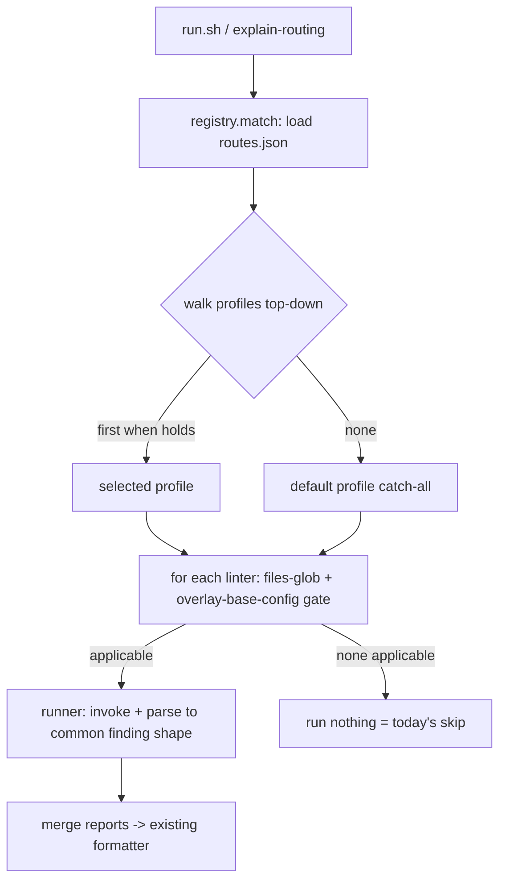

# lint-router registry + skills - Plan

> **Product Contract preservation:** unchanged from the brainstorm (F1–F3, R1–R11,
> AE1–AE5 carried verbatim). This pass adds the Planning Contract only.
> **Depends on PR #20** (the base `lint-router` plugin) landing first — v2 refactors
> the `run.sh` and state-dir it introduces.

## Goal Capsule

- **Objective:** Grow `lint-router` from a hardcoded two-profile unicorn tool into a
  config-driven, multi-linter **personal linting manager** — route to the right
  linters based on *who the work is for*, managed through skills, not bash edits.
- **Product authority:** Shawn (personal plugin; agents run it on his behalf).
- **Open blocker:** land PR #20 first.

---

## Problem Frame

`run.sh` routes by a hardcoded `classify_profile()` (`slate|personal|skip`). It can't
be extended without editing shell, and there's no way to see why a linter fired. This
plan makes routing **data-driven** (a `routes.json` registry) and manages it through
five skills, preserving the tool's invariants: personal, local, per-repo, **zero
footprint on any repo's committed config/deps/CI**.

---

## Product Contract

*(carried from brainstorm — unchanged)*

### Actors
- **A1 — Shawn / the agent working on his behalf.**

### Features / decisions
- **F1 — Profile registry.** Single personal+global registry in the state dir replaces the classifier.
- **F2 — A route is a profile that bundles linters.** Matched by signals; carries an ordered set of linters (each: mode `overlay|standalone`, config, file globs). First matching profile wins.
- **F3 — Seed profiles at install (no regression):** `personal` (full unicorn, standalone) + `work` (conservative, composes; ships pre-configured with today's Slate overlay + hands-off behavior, named generally).

### Requirements
- **R1** Routing read from the registry, not hardcoded; `run.sh` consumes it.
- **R2** A profile bundles ≥1 linter; first match wins; a profile may resolve to "run nothing".
- **R3** Install seeds `personal`+`work` reproducing today's behavior exactly (no regression).
- **R4** **discover-linters** — inventory machine + repo-local configs; adopt-to-register folded in.
- **R5** **add-linter** — install/register + when-to-use flow → writes a route.
- **R6** **configure-linter** — edit a registered linter/profile.
- **R7** **remove-linter** — remove/disable a route.
- **R8** **explain-routing** — dry-run: which linters run here and why.
- **R9** Existing run-the-lint skill reads the registry; hooks still `--setup-only`.
- **R10** Zero-footprint invariant preserved (gitignored overlays or state dir only).
- **R11** Adding a linter/profile requires no shell edits — registry CRUD via skills.

### Acceptance Examples
- **AE1** (R3) Fresh install on a Slate web-app → same curated overlay as today; personal repo → same full unicorn.
- **AE2** (R4,R5) `discover` finds `ruff`; `add-linter` registers it into `personal` for `*.py` with no shell edit; a later run lints changed Python.
- **AE3** (R8) `explain-routing` reports matched profile + linters + the matching signal.
- **AE4** (R4) `discover` sees a repo's own `eslint.config.mjs` and offers to adopt it as `work`'s eslint (overlay).
- **AE5** (R11) Adding a second employer's profile is done entirely through the skills; `run.sh` untouched.

---

## Key Technical Decisions

### KTD-1 — Registry shape: ordered profile array, first match wins
`routes.json` (in the state dir) is an **ordered list of profiles**. Each profile:
`{ name, when, linters[] }`. `when` is a predicate set (all must hold): `origin`
(glob on `git remote get-url origin`), `has_file` (a marker path, optionally a
content grep), `path` (glob on the repo root), or `default: true` (always matches —
the catch-all, placed last). The engine walks the list top-to-bottom; **first profile
whose `when` holds wins.** Ordering IS precedence — no separate priority field.
*Directional shape (not a spec):*
```
[ { "name": "work", "when": { "origin": "*slateteams/*" , /* or */ "has_file": {"path":"eslint.config.mjs","contains":"@angular-eslint"} },
    "linters": [ {"linter":"eslint","mode":"overlay","config":"configs/work-eslint.mjs","files":"^src/.*\\.ts$"} ] },
  { "name": "personal", "when": { "default": true },
    "linters": [ {"linter":"eslint","mode":"standalone","config":"configs/personal-eslint.mjs","files":"\\.(ts|tsx|js|jsx|mjs|cjs)$"} ] } ]
```

### KTD-2 — "Skip" emerges from linter-level gating, not a profile type
A profile matches on a broad audience signal; **each linter self-gates** on its
`files` glob AND (for `overlay` mode) the presence of the base config it layers on.
So today's `skip` case (a Slate team repo that isn't web-app: matches `work` by
origin, but the eslint-overlay linter needs an `@angular-eslint` `eslint.config.mjs`
that isn't there) resolves to **"work matched, no applicable linter → nothing runs"**
— no dedicated skip profile needed. This keeps the model to two concepts (profiles,
linters) and makes "run nothing" a natural outcome (R2).

### KTD-3 — Per-linter runner abstraction (the multi-linter core)
Each linter is a small descriptor the engine knows how to **invoke** and whose output
it **parses into one common finding shape** `{file, line, severity, rule, msg}`, then
formats with the existing reporter. v1 ships two built-in runners — `eslint-overlay`
and `eslint-standalone` (today's two behaviors). A registered non-eslint linter
(e.g. `ruff`) supplies its invoke command + a parser (JSON format preferred). This is
where "a profile bundles several linters" becomes real: the engine runs each
applicable linter through its runner and merges the reports.

### KTD-4 — State-dir layout + install/register model
The stable state dir (`LINT_ROUTER_STATE_DIR`, default `${XDG_STATE_HOME:-~/.claude/state}/lint-router`) holds:
`routes.json`, `configs/` (per-linter config files), and `node_modules/` (npm deps).
`add-linter` (R5): **npm/node linters auto-install** into `node_modules` (today's
`ensure_deps`, generalized to a package set); **non-npm linters** (ruff, clippy,
shellcheck…) are **registered if `discover` already found them**, and if missing,
`add-linter` prints the ecosystem's install command rather than shelling a fragile
multi-package-manager installer. A linter descriptor carries `install: {kind: npm|preinstalled, ...}`.

### KTD-5 — Migration preserves today's behavior exactly (R3)
Install/first-run seeds `routes.json` (personal + work) and migrates the current
config files: `overlay-rules.mjs` → `configs/work-eslint.mjs` (work's overlay);
`personal-config.mjs` → `configs/personal-eslint.mjs` (personal's standalone). The
seed `work` profile's `when` + the overlay linter's config-presence gate reproduce
the exact slate/skip behavior; `personal` (default) reproduces the full-unicorn path.

### KTD-6 — Skills are thin CRUD over the registry via a shared helper
The five skills don't each re-implement JSON editing. A small validated
`registry` helper (read / add-profile / add-linter / remove / match) is the single
writer; every skill's `SKILL.md` drives the model to call it. `run.sh` and
`explain-routing` share the **match** function so "what runs" and "what would run"
never diverge (the herdr provenance lesson).

---

## High-Level Technical Design


Skills → the `registry` helper (single writer) → `routes.json` + `configs/`.
`discover` feeds `add`/`configure`; `remove` deletes; `explain-routing` calls the same
`match` the engine uses.

---

## Output Structure

```
plugins/lint-router/
  .claude-plugin/plugin.json          # version bump 0.1.0 -> 0.2.0
  hooks/hooks.json                    # unchanged (--setup-only)
  skills/
    lint-router/SKILL.md              # run-the-lint: now reads the registry
    discover-linters/SKILL.md         # new
    add-linter/SKILL.md               # new
    configure-linter/SKILL.md         # new
    remove-linter/SKILL.md            # new
    explain-routing/SKILL.md          # new
  tools/lint-router/
    run.sh                            # registry-driven matcher + runners
    registry.<sh|py>                  # validated read/write/match helper (shared)
    runners/                          # per-linter invoke+parse (eslint-overlay, eslint-standalone)
    seeds/routes.json                 # seed personal + work
    overlay-rules.mjs, personal-config.mjs  # migrated into configs/ on setup
    package.json, package-lock.json
  tools/lint-router/spinoff.bats … -> tests/lint-router.bats
```
*(Layout is a scope declaration; the implementer may adjust.)*

---

## Implementation Units

### Phase A — Registry engine

### U1. routes.json schema + shared `registry` helper + seeds
**Goal:** Define the registry format and the single validated read/write/match helper,
plus the seed `routes.json` (personal + work). Foundation for everything.
**Requirements:** R1, F1, F2, F3, R11.
**Dependencies:** none (post-#20).
**Files:** `plugins/lint-router/tools/lint-router/registry.sh` (or `.py`),
`plugins/lint-router/tools/lint-router/seeds/routes.json`,
`plugins/lint-router/tools/lint-router/tests/lint-router.bats`.
**Approach:** Implement `registry match <repo>` (walk profiles, first `when` holds,
return profile + applicable linters), `registry add-profile` / `add-linter` /
`remove` / `list` (validated JSON writes to `$STATE_DIR/routes.json`). Predicate
evaluators: `origin` glob, `has_file` (path + optional `contains` grep), `path` glob,
`default`. Seed encodes KTD-1's two profiles.
**Test scenarios:**
- `match` on an `@angular-eslint` repo → `work` + the overlay linter. *Covers AE1 (work half).*
- `match` on a non-Slate repo → `personal` + standalone linter. *Covers AE1 (personal half).*
- `match` on `slateteams/*` non-webapp → `work` matched but **no applicable linter**. *Covers KTD-2 / R2.*
- `add-profile` then `match` picks it by order (new employer profile before default). *Covers AE5.*
- malformed `routes.json` → helper errors clearly, never silently mis-routes.
**Verification:** the helper resolves all three seed cases correctly and round-trips edits.

### U2. State-dir layout + config migration + deps generalization
**Goal:** Establish `$STATE_DIR/{routes.json, configs/, node_modules}`; migrate
`overlay-rules.mjs`→`configs/work-eslint.mjs` and `personal-config.mjs`→
`configs/personal-eslint.mjs`; generalize `ensure_deps` to a package set.
**Requirements:** R3, R10, KTD-4, KTD-5.
**Dependencies:** U1.
**Files:** `plugins/lint-router/tools/lint-router/run.sh` (setup path),
`plugins/lint-router/tools/lint-router/tests/lint-router.bats`.
**Approach:** On `--setup-only`, if `routes.json` absent, seed it + copy configs into
`configs/`; keep the existing sync-shipped-files-into-STATE_DIR logic, extended to the
new layout. `ensure_deps` installs the union of npm packages the registered eslint
runners need (currently the unicorn set).
**Test scenarios:**
- fresh setup seeds `routes.json` + `configs/` + installs deps to a temp `LINT_ROUTER_STATE_DIR`.
- re-setup is idempotent; a changed shipped config re-syncs without needless reinstall.
- **Covers AE1**: post-migration, a Slate repo and a personal repo lint identically to pre-migration.
**Verification:** byte-for-byte same findings as the 0.1.x tool on a Slate and a personal fixture.

### U3. run.sh → registry-driven matching
**Goal:** Replace `classify_profile()` with `registry match`; select applicable linters;
keep the eslint invocation + reporter.
**Requirements:** R1, R2, R9.
**Dependencies:** U1, U2.
**Files:** `plugins/lint-router/tools/lint-router/run.sh`, `…/tests/lint-router.bats`.
**Approach:** `run.sh` calls `registry match "$ROOT"` → profile + linter list; for each
linter, apply the `files` filter to the changed-file set and run it. No-applicable-linter
→ the "no personal lint imposed" message (today's skip UX).
**Test scenarios:**
- Slate fixture → overlay findings (unchanged formatter). *Covers AE1.*
- personal fixture → standalone findings. *Covers AE1.*
- skip fixture (work matched, no linter) → silent/no-op. *Covers KTD-2.*
- `--setup-only` still exits 0 everywhere.
**Verification:** the three fixtures behave exactly as 0.1.x.

### U4. Per-linter runner abstraction
**Goal:** Generalize linter invocation so a profile can bundle several linters and a
non-eslint linter actually runs.
**Requirements:** R2, KTD-3, F2.
**Dependencies:** U3.
**Files:** `plugins/lint-router/tools/lint-router/runners/` (eslint-overlay, eslint-standalone),
`…/run.sh`, `…/tests/lint-router.bats`.
**Approach:** A runner = `{invoke(files) → raw, parse(raw) → findings[]}`. Extract
today's eslint paths into `eslint-overlay` + `eslint-standalone` runners emitting the
common shape; `run.sh` merges each applicable linter's findings into one report.
**Test scenarios:**
- a profile with two linters (eslint + a stub second runner) runs both; report merges. *Covers F2.*
- an unknown/unavailable runner is skipped with a clear note, not a crash.
- eslint-family output still parses to the same findings as U3.
**Verification:** a two-linter profile produces a merged report; single-linter parity holds.

### Phase B — Management skills (each: a `SKILL.md` driving the shared `registry` helper)

### U5. discover-linters skill (+ adopt)
**Goal:** Inventory linters (global installs, project `node_modules/.bin`, package
managers) and repo-local existing configs; offer to adopt a found config as a route's linter.
**Requirements:** R4, AE2, AE4.
**Dependencies:** U1.
**Files:** `plugins/lint-router/skills/discover-linters/SKILL.md`, optional
`tools/lint-router/discover.sh`.
**Approach:** Scan `command -v` for a known linter set + `node_modules/.bin` + common
config filenames (`eslint.config.*`, `ruff.toml`, `.prettierrc*`, `biome.json`…);
output an inventory; when a repo-local config is found, offer `add-linter` in adopt mode.
**Test scenarios:** Test expectation: none for the SKILL prose; the discovery helper (if
extracted) gets a bats test: given a fixture with `ruff` on PATH + a repo `eslint.config.mjs`,
the inventory lists both and flags the config as adoptable. *Covers AE2/AE4 (discovery half).*
**Verification:** inventory correctly lists installed linters + adoptable repo configs.

### U6. add-linter skill
**Goal:** Install (npm) or register (pre-installed non-npm) a linter + a when-to-use flow
that writes a route.
**Requirements:** R5, R11, KTD-4, AE2, AE5.
**Dependencies:** U1, U4, U5.
**Files:** `plugins/lint-router/skills/add-linter/SKILL.md`.
**Approach:** Drive: pick linter (from discover or by name) → if npm, `ensure_deps`
adds it; if non-npm+present, register; if missing, print install command → prompt the
"when" (which profile / new profile, origin+marker signals, files, mode) → write via
`registry add-linter`.
**Test scenarios:** Test expectation: none (prose skill); behavior is exercised by U1's
`add-profile`/`add-linter` helper tests. Manual QA: add `ruff` to `personal` for `*.py`.
**Verification:** after the flow, `routes.json` has the new linter and a run lints its files.

### U7. configure-linter skill
**Goal:** Edit a registered linter/profile (rules, severity, mode, files, `when`).
**Requirements:** R6.
**Dependencies:** U1.
**Files:** `plugins/lint-router/skills/configure-linter/SKILL.md`.
**Approach:** Drive edits to the profile/linter entry (and its `configs/*` file for rule
changes) via the `registry` helper; never hand-edit `routes.json` raw.
**Test scenarios:** Test expectation: none (prose); covered by helper write tests (U1).
**Verification:** an edited severity/mode is reflected in the next run.

### U8. remove-linter skill
**Goal:** Remove or disable a linter/route.
**Requirements:** R7.
**Dependencies:** U1.
**Files:** `plugins/lint-router/skills/remove-linter/SKILL.md`.
**Approach:** `registry remove <profile>[.<linter>]`; leaves configs unless orphaned.
**Test scenarios:** helper: removing a linter leaves the profile; removing the last leaves an empty (skip) profile or deletes it per flag. *Covers R7.*
**Verification:** removed linter no longer runs.

### U9. explain-routing skill
**Goal:** Dry-run the registry against the current repo: matched profile, linters that
will run, and the matching signal — make routing legible.
**Requirements:** R8, AE3.
**Dependencies:** U1, U3.
**Files:** `plugins/lint-router/skills/explain-routing/SKILL.md`, `tools/lint-router/run.sh`
(add an `--explain` mode reusing `registry match`).
**Approach:** `run.sh --explain` prints: profile name, why it matched (which predicate),
each linter + whether it's applicable here (+ why not), files it would lint. Shares the
engine's `match` so it can't drift.
**Test scenarios:**
- Slate fixture → "work (matched on @angular-eslint config) → eslint overlay on src/*.ts". *Covers AE3.*
- skip fixture → "work matched, eslint-overlay not applicable (no base config) → nothing runs".
- personal fixture → "personal (default) → eslint standalone".
**Verification:** explanation matches what `run.sh` actually does on each fixture.

### Phase C — Wiring

### U10. Update run-lint skill + hooks + version + marketplace
**Goal:** Point the existing `lint-router` skill at the registry, confirm hooks, bump
version, update the marketplace description.
**Requirements:** R9, R3.
**Dependencies:** U1–U9.
**Files:** `plugins/lint-router/skills/lint-router/SKILL.md`,
`plugins/lint-router/.claude-plugin/plugin.json` (0.1.0→0.2.0),
`.claude-plugin/marketplace.json`.
**Approach:** SKILL.md describes the registry-driven behavior + points at the new skills;
hooks unchanged (`--setup-only` still seeds/migrates); surgical version bump in both manifests.
**Test scenarios:** Test expectation: none — prose + version. `bash -n run.sh` + full bats green.
**Verification:** JSON parses; version consistent; SKILL reflects registry model.

---

## Verification Contract

- `bash -n` clean on `run.sh` and any helper shell.
- `bats plugins/lint-router/tools/lint-router/tests/lint-router.bats` green, including
  the **no-regression parity** cases (U2/U3) proving Slate + personal fixtures lint
  identically to 0.1.x, and the **profile-bundles-multiple-linters** case (U4).
- `explain-routing` output matches actual `run.sh` behavior on all three fixtures (U9).
- All plugin JSON parses; version 0.2.0 consistent across `plugin.json` + `marketplace.json`.
- **Manual QA (human-gated):** on a real Slate web-app + a personal repo, confirm parity;
  add a real `ruff` route and confirm it lints changed Python.

## Definition of Done

The registry drives routing; today's slate/personal behavior is reproduced with zero
regression from the seeds; a new linter+profile can be added/configured/removed without
editing `run.sh`; `explain-routing` answers "what runs here and why"; tests green;
version published 0.2.0.

---

## Scope Boundaries

**In:** the registry + engine (U1–U4), the five skills (U5–U9), wiring/version (U10), tests.

### Deferred to Follow-Up Work
- **guarded-fix** — vetted-safe autofix only (riskiest; after the registry is stable).
- **doctor** — subsumed by `explain-routing`; revisit only if a gap remains.
- **Full multi-ecosystem auto-install** (pip/cargo/brew) — v1 is npm-auto + register-preinstalled (KTD-4).

**Out:** any change to a team repo's committed config/deps/CI; a shared/team lint gate; non-personal registries.

---

## Risks & Dependencies

- **Hard dependency on PR #20** — this refactors its `run.sh`/state dir. Land #20 first.
- **No-regression risk** — the migration (KTD-5) must reproduce `classify_profile` exactly;
  the U2/U3 parity fixtures are the guard. Build them first (characterize current behavior,
  then refactor under green).
- **Runner-parse fragility** — non-eslint linters vary in output; v1 leans on JSON formats
  and skips a linter cleanly if its output won't parse (U4).

**Execution note (U2/U3):** characterize the current slate/personal/skip behavior with the
parity fixtures *before* replacing `classify_profile`, and refactor under green.
