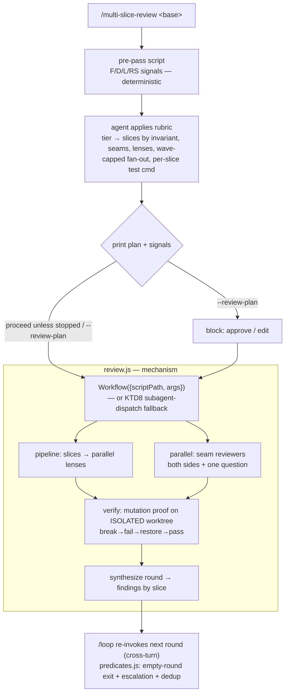
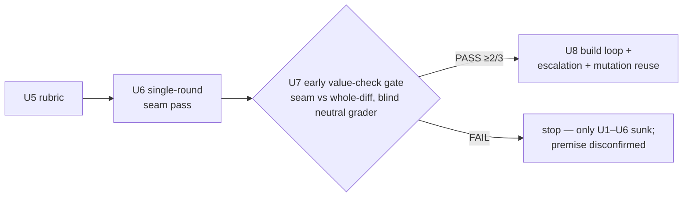
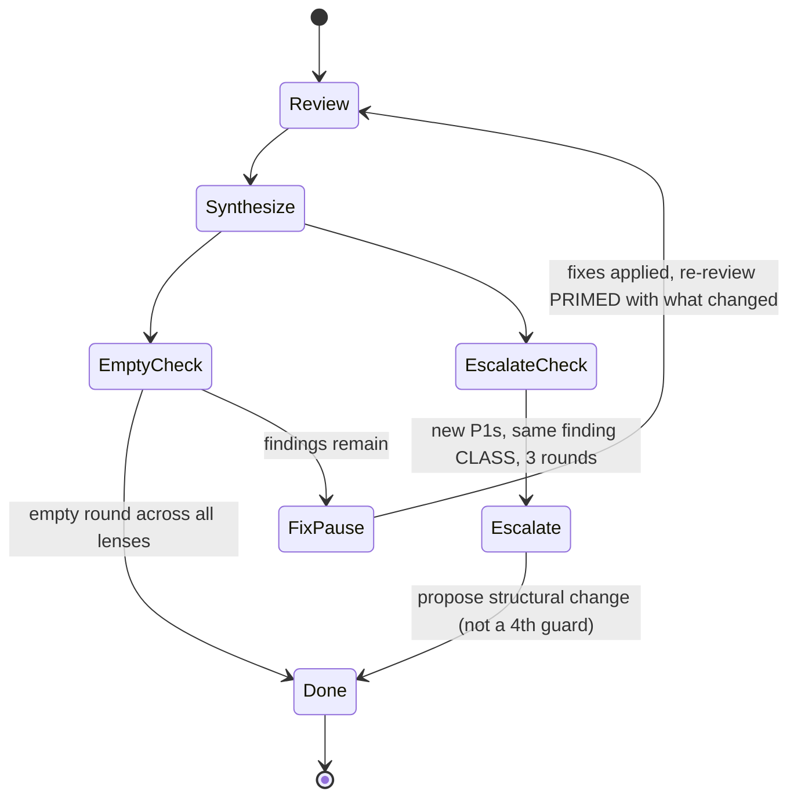

# feat: Multi-Slice Review with Seam Coverage plugin

## Summary

Turn the "Multi-Slice Review with Seam Coverage" methodology into a runnable shrimpshack
plugin: `/multi-slice-review <base>`. A deterministic pre-pass measures the diff, a rubric
the agent applies draws slices/seams/lenses within a capped fan-out budget, the derived plan is
printed and proceeds unless stopped, and a native **Workflow** script mechanically fans out
slices→lenses, staffs seams, runs mutation proofs on an isolated checkout, and loops to an empty
round with a three-rounds-same-class escalation. The plugin *reviews* large changes; fixing stays
the caller's job between rounds, exactly as the method's loop assumes. **The method's value is
proven early:** the build sequences a single-round seam pass, then an early comparative go/no-go gate
(does seam-review beat a whole-diff review?), and only *then* builds the loop/escalation —
so a premise failure costs the scaffold, not the whole machine. (The single round already includes
the mutation proof, so the gate measures it; U8 reuses it.)

**Product Contract preservation:** direct plan (no upstream brainstorm doc); the four product
decisions below were settled in this session's brainstorm and are carried as the Product Contract.

---

## Product Contract

**Primary actor:** an engineer (or driving agent) reviewing a change too large for one
reviewer — many files, several subsystems, or work built incrementally.

**Core outcome:** a synthesized, seam-aware review that surfaces boundary defects single-holistic
or single-per-unit reviews miss, with load-bearing assertions proven by mutation, looped to an
empty round. The premise that boundary defects survive both whole-diff and per-unit review comes
from the methodology (`docs/handoff.md` §6, §8) and its cited defects — existence proofs, not
comparative evidence — so the build tests the premise against a whole-diff baseline *before* the
expensive machinery is built (see the early value-check gate, U7).

**Settled decisions (from brainstorm, 2026-07-21):**
- **R1 — Judgment/mechanism seam.** Slice/seam/lens *judgment* stays in the steerable
  front-door context (so the plan is visible and interruptible); pure fan-out + mutation + loop
  is offloaded to a Workflow script so synthesis can't exhaust the orchestrator's context.
- **R2 — Rubric is signals-in, agent-applies.** A deterministic pre-pass fixes the measurable
  inputs and a sizing target; the invariant-based cut is judgment. Reproducible inputs, judgment
  on the cut — not a pure formula.
- **R3 — Granularity drives fan-out, capped.** Two multipliers (slices × lenses/slice) plus
  seams plus mutation runs; each fan-out wave clamped to the Workflow concurrency budget and the
  total bounded by a hard reviewer ceiling.
- **R4 — Soft plan gate.** Derived plan + signals are printed, then the run proceeds unless the
  user interrupts or passed `--review-plan`.

**Companion, not replacement (R5):** distinct from `/ce-code-review` and `/code-review`; for
large, seam-focused reviews. Does not modify either. Does not auto-fix the code under review.
*Routing:* the pre-pass size signals (large F/D) are the heuristic for when to reach for it; the
README states the rule of thumb. A `/ce-code-review`-emitted suggestion is a deferred enhancement.

**Success signals:**
- Same diff → same pre-pass **signals** (F/D/L/RS) every run. Reproducibility is scoped to the
  signals and the computed tier target — NOT the printed plan's final slice count, which the agent
  may adjust by judgment (KTD3).
- The loop exits on an *empty* round across all lenses, not a shrinking one; the 3-rounds-same-class
  escalation trips when it should.
- **The early value-check gate PASSES** (U7, before the loop is built): on a pre-registered set of
  N=3 diverse multi-subsystem diffs whose slicing an independent agent confirms is sound (every slice
  states one checkable invariant), the plugin's single-round seam review and a whole-diff review of
  the same change are graded by an agent that is **blind to which set is which** and applies a
  **neutral** severity rubric (does the finding name a concrete wrong outcome someone hits → P0/P1,
  vs advisory → P2/P3 — deliberately *not* the method's own KTD4 defect taxonomy, which would tilt
  the result). The method passes if the seam/mutation set's findings land in the top-severity (P0/P1)
  tier on a **majority** (≥2 of 3). This is a go/no-go smell test, not a statistical proof (N=3 is
  low-powered by design); a fail — slicing granted sound — is the disconfirming result.

---

## Scope Boundaries

**In scope:** the plugin (pre-pass, rubric, front-door skill, single-round fan-out, the multi-round
loop, `/multi-slice-review` command, a preflight confirming the live Workflow contract, tests), the
early comparative value-check gate, marketplace registration, README. Full §7 loop in v1 — built
*after* the value-check gate passes (review → fix-pause → re-review-primed → empty-round exit +
escalation). Input is `git diff <base>`.

**Out of scope (true non-goals):** editing `/ce-code-review` or `/code-review`; auto-fixing the
reviewed code; cross-session durability (why we use the native Workflow tool, not auto's engine);
a multi-runner test-command detector (the mutation stage uses a thin sniff + graceful degradation);
a loop-vs-single-round isolation arm in the value check (the gate proves the seam approach; the loop
ships as a proven-method-consistent additive — see the accepted risk in Risks).

### Deferred to Follow-Up Work
- PR-number convenience wrapper (`/multi-slice-review #123` → resolve base). v1 takes a base ref.
- A `--lens`/`--slices` manual override to bypass the rubric.
- Config file for rubric thresholds (v1 ships thresholds in-script).
- A `/ce-code-review` size-based suggestion to route users here.

---

## Key Technical Decisions

**KTD1 — Orchestration substrate is the native `Workflow` tool.** The front-door skill invokes it
(inline `script`, or `scriptPath` to a shipped `plugins/multi-slice-review/workflows/review.js`)
with the confirmed slice-plan as `args`. Contract, per the native tool's own documented spec: a
script begins with `export const meta` and drives `agent()` / `pipeline()` / `parallel()` /
`phase()`; structured returns via a per-agent `schema`; `isolation: 'worktree'` for agents that
mutate files; concurrency `min(16, cores-2)` with a 1000-agent lifetime backstop; explicit
multi-agent **opt-in**, satisfied by "a skill or slash command whose instructions tell you to call
Workflow" — exactly the `/multi-slice-review` command. Availability is **runtime-gated** (an emerging
harness feature), so U1 confirms it in the target runtime before U6 builds on it; KTD8 names the
fallback if it is unusable. *Why not auto's engine:* auto rolls its own Python state machine for a
durable cross-session ledger; a single review run needs none of that.

**KTD2 — Signals deterministic, rubric agent-applied.** A standalone pre-pass emits F/D/L/RS as
fixed numbers; the agent reads the diff + signals and picks the tier and draws the cut. Splits the
fuzzy classification (which files form a coherent invariant) from the crisp sizing (tier target,
lens set, fan-out budget). *What is reproducible:* only the F/D/L/RS signals and the computed tier
**target** — regression-tested, making the printed signals stable. The printed plan's **final slice
count is NOT reproducible** across runs (the agent may exceed the target by judgment, KTD3), so the
stability claim is scoped to signals + target, not the whole plan.

**KTD3 — Fan-out budget: wave-clamped, total-ceilinged, sourced from the tool's contract.**
(1) *Concurrency* — at most `min(16, cores-2)` agents at once (8 on this 10-core box); the rubric
sizes each fan-out **wave** to this (figure computed from `cores` at runtime, never a hardcoded 8)
and lets the total exceed it across waves (why KTD5 matters). (2) *Total* — the 1000-agent lifetime
backstop is the tool's; because slice count is a soft target the agent may exceed, the rubric also
enforces a hard `MAX_REVIEWERS` ceiling (e.g. 64) on total reviewers per run, so staying under the
backstop is *enforced, not assumed* (kept a single tested constant, not a tunable subsystem). The
**slice count** the tier suggests is a *soft target*: the agent may draw more slices for more
invariants (logging the override, up to `MAX_REVIEWERS`), so a low-signal-but-many-invariant diff is
never forced to under-slice. The concurrency figure and 1000 backstop come from the Workflow tool's
**documented contract** (authoritative); U1 confirms they hold in the target runtime before U5
asserts on them. Tests assert clamp/ceiling **behavior**, never a literal constant (§8 false-green).

**KTD4 — The across-rounds loop is `/loop`-driven; per-round decisions are crisp, mutation-proven
predicates over a state file.** The §7 loop is **cross-turn**: a round reviews, the *caller* applies
fixes (reviewing-not-fixing is a non-goal), then the next round re-reviews — an external human action
of unbounded duration between rounds. A single Workflow run executes within one turn and cannot pause
for that, so the loop is **not** an in-Workflow `while`; it is Claude's native **`/loop`** re-invoking
`/multi-slice-review-round` across turns (self-paced via `ScheduleWakeup`, which naturally waits for
the between-round fixes). Each round is one Workflow run (KTD1); `review.js` is therefore strictly a
**single round**, never a multi-round sequencer. State that must survive between `/loop` iterations —
the `seen` set, the round number, the history-by-class, the prior round's applied-fix priming — lives
in `docs/round-state.json` (the way `auto` uses a run-record ledger). The crisp per-round decisions are
pure predicates in `workflows/predicates.js` (native-primitive-free, so `predicates.bats` can `import()`
them under bare `node`): `isEmptyRound(findings)` (exit = an *empty* round across all lenses, not a
shrinking one), `escalates(historyByClass)` (new P1s in the same **class** for 3 consecutive rounds →
emit a structural-change proposal, not a fourth guard), and `dedupeVsSeen(fresh, seen)` (dedup vs
`seen`, not vs confirmed). *Class* = the normalized tuple `(slice, lens, defect-category)`, where
`defect-category` is a fixed enumerated taxonomy the reviewer schema requires — `correctness`,
`contract-mismatch`, `resource-safety`, `concurrency`, `security`, `missing-validation`, `ordering`.
The round command reads `round-state.json`, runs the Workflow round, calls the predicates, writes the
new state, and signals STOP (empty or escalate) or lets `/loop` continue. No fuzzy loop control lives
in the model — `/loop` schedules, the predicates decide.

**KTD5 — Reviewer output contract.** Each reviewer returns capped (~8) structured findings via a
Workflow `schema` (including the `defect-category` enum from KTD4); full detail to per-reviewer
artifact files. Total reviewers exceed the concurrency wave (KTD3), so full returns would exhaust
the orchestrator before synthesis (§4.4).

**KTD6 — Script language: bash, bats-tested.** The pre-pass and the rubric arithmetic ship as bash,
matching token-bridge's testable-bash + bats convention. The `predicates.js` functions
are exercised from bats by shelling to `node` (importing the ESM exports of the
native-primitive-free `predicates.js`, per KTD4's import-safety constraint), as
`plugins/token-bridge/tests/unit/harvest.bats` runs extracted JS — no JS test runner is introduced.

**KTD7 — Mutation proof runs on an isolated checkout, never your working tree.** The
break→fail→restore→pass cycle operates on a temporary git worktree (or copy) of the reviewed diff —
the Workflow tool's native `isolation: 'worktree'` per mutating agent — with guaranteed teardown even
on agent failure. The per-slice assertion command is surfaced **in the printed slice-plan** (steerable
at R4), resolved by a **thin** ordered sniff — `package.json` `test`, then a Makefile `test` target,
then a `tests/`/bats dir — deliberately *not* a multi-runner detector (kept thin per scope). When
neither yields a command for a slice, the stage reports "no executable assertion to mutate" rather
than passing silently. Mutation is **expected-partial** on large diffs; the value-check gate measures
net effect including that partial coverage, so the mutation pillar is not assumed universal.

**KTD8 — Named fallback if the Workflow substrate is unusable.** If U1 finds the live Workflow tool
absent from the target runtime, or rejecting hand-authored `.js` (auto ships compiled recipes, so
this is live), the fallback is **direct native subagent/Task dispatch driven by the skill** — auto's
actual executable path (see `plugins/auto/lib/dispatcher.py`'s `dispatch_batch` wave-cap dispatch and
`auto-spawn.py`/`_bootstrap.py` worktree management for precedent that it is buildable). **Cost, stated
honestly:** the fallback re-implements the correctness-critical part the Workflow tool gave natively —
bounded wave concurrency and worktree isolation with **guaranteed teardown** (KTD7). So on the
fallback branch those degrade from mechanical to skill-driven, and the fan-out unit (U6) carries a
**scope delta** with its own test scenarios for hand-rolled teardown-on-failure. `predicates.js`
and the `/loop` driver are substrate-agnostic and carry over unchanged; U2–U5 (scaffold, harness,
pre-pass, rubric) survive the pivot. So the substrate decision has a specified — and *sized* — escape.

---

## High-Level Technical Design

Runtime flow — front door (steerable) hands a confirmed slice-plan to the Workflow (mechanism):



Build sequence — prove the premise before building the expensive machinery:



Round loop and escalation (the §7 teeth, built in U8):



---

## Output Structure

```
plugins/multi-slice-review/
  .claude-plugin/
    plugin.json
  skills/
    multi-slice-review/
      SKILL.md                # front door: pre-pass → rubric → gate → Workflow/fallback → synthesis; §1–§8 verbatim
      scripts/
        prepass.sh            # F/D/L/RS signals from `git diff <base>` (deterministic)
        rubric.sh             # signals → tier → slice target / lenses / seams / wave-capped count / MAX_REVIEWERS
  workflows/
    review.js                 # native Workflow entry: ONE review round (pipeline/parallel/verify)
    predicates.js             # native-primitive-free: isEmptyRound / escalates / dedupeVsSeen
  commands/
    multi-slice-review.md         # front door: pre-pass → rubric → gate → start the /loop
    multi-slice-review-round.md   # one round; /loop invokes it each iteration (reads/writes round-state.json)
  docs/
    workflow-contract.md      # U1: recorded live Workflow contract (or fallback verdict)
    value-check.md            # U7: recorded value-check protocol definitions + PASS/FAIL results
    round-state.json          # loop state across /loop iterations: seen set, round #, history-by-class, fix-priming
  tests/
    unit/
      prepass.bats
      rubric.bats
      predicates.bats         # imports predicates.js under node; mutation-proven
    fixtures/                 # golden fixture diff/repo + expected signals; stubbed multi-round reviewer outputs
    run-tests.sh              # driver (unit|all), deliberate-fail self-check
  README.md
```

**Unit IDs are in execution order** (consolidated at plan finalization). Build them in order:
U1 (preflight) → U2 → U3 → U4 → U5 → U6 (single-round) → **U7 (value-check gate — go/no-go)** →
U8 (loop, only if U7 passes) → U9 (command) → U10 (wire-up/publish).

---

## Implementation Units

### U1. Workflow-contract preflight (runs first; gates the build)

**Goal:** confirm the live native `Workflow` tool is present and behaves as KTD1 assumes, before any
code builds on it.
**Requirements:** R1; KTD1; KTD3 (cap figures); KTD8 (fallback branch).
**Dependencies:** none. Gates U6 (and U5's cap assertion).
**Files:** `plugins/multi-slice-review/docs/workflow-contract.md`.
**Approach:** in order — (1) **Availability probe:** confirm the tool is present/invokable in the
target runtime; if absent → go/no-go to the KTD8 fallback, record, stop Workflow-specific work.
(2) **Contract confirmation from the schema/docs** (authoritative for values a tiny run can't reach):
hand-authored `.js` beginning with `export const meta` accepted via `scriptPath` (vs compiled-recipe);
`agent()`/`pipeline()`/`parallel()`/`phase()` + per-agent `schema` + loop primitives; the concurrency
figure + 1000 backstop; `isolation: 'worktree'`; and **whether the pipeline/parallel graph is built
at module load or lazily inside an invoked entry function** (determines review.js's import-safety
shape, KTD4). If hand-authored `.js` is rejected → re-scope U6 to compiled recipes, or KTD8.
(3) **Wiring check by execution:** a tiny 2-slice/1-seam fan-out to confirm wiring (validates wiring,
not the cap — the cap value comes from step 2).
**Execution note:** a spike, **novel work with no worked precedent** — auto's substrate spike
(`2026-05-29-003`) was superseded and never run. Prove by execution.
**Patterns to follow:** the native Workflow tool's documented contract; `plugins/auto/` as context only.
**Test scenarios:** `Test expectation: none — investigative spike; output is the recorded contract/verdict + (when applicable) a working tiny fan-out.`
**Verification:** `workflow-contract.md` records one of (a) confirmed contract + tiny fan-out → proceed on Workflow; (b) surface differs → U6 re-scoped; (c) absent → KTD8 fallback.

### U2. Plugin scaffold & registration

**Goal:** create the plugin skeleton and register it so it loads.
**Requirements:** R5.
**Dependencies:** none.
**Files:** `plugins/multi-slice-review/.claude-plugin/plugin.json`, `.claude-plugin/marketplace.json` (add entry). (README authored in U10.)
**Approach:** `plugin.json` matches siblings — `name`, `description`, `version` ("0.1.0"), `author` object (`name` "Shawn Roos" + `email`), `keywords`. Marketplace entry in uniform order: `name`, `description`, `version`, `author` {name}, `source: "./plugins/multi-slice-review"`, `category: "development"`. Keep marketplace `description`/`version` synced with `plugin.json`.
**Patterns to follow:** `plugins/token-bridge/.claude-plugin/plugin.json`, `plugins/spinoff/.claude-plugin/plugin.json`, existing `marketplace.json` entries.
**Test scenarios:** `Test expectation: none — scaffolding; validated by U10's plugin-validate smoke.`
**Verification:** plugin appears in `claude plugin list`; marketplace.json valid with the new entry.

### U3. Test harness & fixture diff corpus

**Goal:** the shared apparatus later units test against — driver, golden fixtures, and a self-check that the harness fails when an assertion is broken.
**Requirements:** supports R2, R3.
**Dependencies:** U2.
**Files:** `plugins/multi-slice-review/tests/run-tests.sh`, `plugins/multi-slice-review/tests/fixtures/` (a small committed fixture repo/diff with a known subsystem spread and known risk surfaces; plus stubbed multi-round reviewer outputs for U8's loop test), `plugins/multi-slice-review/tests/unit/`.
**Approach:** `run-tests.sh` mirrors `plugins/token-bridge/tests/run-tests.sh` (`set -euo pipefail`, `[unit|all]`, colorized, `--tap`). Fixtures are an immutable vendored diff, **not** resolved from `HEAD` (§8 baseline rot). Include a `--self-check` that mutates one harness assertion → suite exits non-zero → restore.
**Execution note:** build the fixtures + self-check first; later tests are only trustworthy once the harness is proven to fail.
**Patterns to follow:** `plugins/token-bridge/tests/run-tests.sh` + `tests/fixtures/`; `plugins/spinoff/skills/spinoff/scripts/smoke.sh`.
**Test scenarios:**
- `run-tests.sh unit` with a passing dummy `.bats` → exits 0.
- `--self-check`: mutated assertion → non-zero; restored → 0.
- Baseline pinned: a test asserting the expected-signals file does not resolve from `HEAD`.
**Verification:** `bash tests/run-tests.sh unit` green; `--self-check` demonstrably red-then-green.

### U4. Deterministic pre-pass (F/D/L/RS signals)

**Goal:** reproducible measurement of the diff — the fixed inputs the rubric consumes.
**Requirements:** R2, R3.
**Dependencies:** U2, U3.
**Files:** `plugins/multi-slice-review/skills/multi-slice-review/scripts/prepass.sh`, `plugins/multi-slice-review/tests/unit/prepass.bats`.
**Approach:** from `git diff <base>` compute — `F` files changed; `D` distinct subsystems (top-1/2 path segments); `L` lines changed; `RS` risk-surface set from grep patterns (destructive ops, auth/credentials, locks/concurrency, network/IO, untrusted-input parsing). Emit a stable machine-readable blob. **Prove by execution** (§4.3): resolve the base ref concretely; fail loudly on empty diff / unknown base rather than emitting zeroes.
**Execution note:** deterministic pure function — start with a failing bats test pinning exact F/D/L/RS for the U3 fixture, then implement to green.
**Patterns to follow:** `plugins/lint-router/tools/lint-router/` git-scoped scripts; token-bridge bats style.
**Test scenarios:**
- Fixture diff → exact expected `F`, `D`, `L`, `RS` (golden).
- Empty diff / unknown base → non-zero exit with a clear message.
- Single-file, single-subsystem → `D=1`.
- Destructive op + lock → `RS` contains both triggers; benign → `RS` empty.
- Same diff twice → byte-identical output.
- Renamed/moved files counted once; binaries handled without crashing.
**Verification:** `prepass.bats` green; two fixture runs identical.

### U5. Granularity rubric

**Goal:** map signals → tier → slice *target*, lens rules, seam derivation, per-slice test-command sniff, and a *wave-capped, total-ceilinged* agent count.
**Requirements:** R2, R3.
**Dependencies:** U4; U3 (tests); U1 (confirmed cap figures).
**Files:** `plugins/multi-slice-review/skills/multi-slice-review/scripts/rubric.sh`, `plugins/multi-slice-review/tests/unit/rubric.bats`.
**Approach:** tier thresholds (small `D≤2,F≤~8` → 3 slices; medium → 4–5; large `D≥5 or F≥~30` → 6–7) emitted as a **target** (KTD3: agent may exceed, up to `MAX_REVIEWERS`); base 2 lenses (correctness + adversarial) + one per `RS` trigger (destructive/untrusted → security; changed public signature → api-contract; locks/IO/background → reliability); seam count from slice adjacency; the thin per-slice test-command sniff (KTD7); `agent_count = Σ(lenses) + seams + mutation_runs`, wave-clamped to the runtime-`cores` concurrency figure and total-clamped to `MAX_REVIEWERS`, logging any clamp. Single-slice diff → zero seams (seam stage skipped). Semantic slicing is the agent's (U6), not here.
**Execution note:** pure arithmetic over U4's signals — test-first against tabulated cases.
**Patterns to follow:** U4's signal blob; token-bridge bats fixtures.
**Test scenarios:**
- Tabulated signal sets → expected tier + slice target (each boundary, just-below/just-above).
- `RS` triggers → correct lens additions; no triggers → base 2 only.
- Over-budget wave → clamped to the runtime-computed figure + a notice (assert the notice AND that the figure derives from `cores`).
- Over-ceiling total → capped at `MAX_REVIEWERS` + a notice.
- Skip-with-reason: an un-added lens carries a stated reason (§3).
- Seam count matches adjacency; single-slice → zero seams.
**Verification:** `rubric.bats` green including tier boundaries, wave-clamp + runtime-cap + `MAX_REVIEWERS` assertions, zero-seam case.

### U6. Front-door skill + single-round seam fan-out

**Goal:** the steerable front door and the single-round mechanism — one seam-aware review pass (no loop yet). This is the "minimal single-round seam pass" the value-check gate measures.
**Requirements:** R1, R4, R5.
**Dependencies:** U4, U5, **U1** (contract/verdict).
**Files:** `plugins/multi-slice-review/skills/multi-slice-review/SKILL.md`, `plugins/multi-slice-review/workflows/review.js`. (The crisp predicates + their tests are U8; U6 is the single round, whose live stages are verified by hand, not unit-tested.)
**Approach:**
- **SKILL.md** (front door): frontmatter `name` + `description` (+ `allowed-tools: Bash`). Body: run `prepass.sh` → `rubric.sh` → agent draws slices by invariant + enumerates seams (§2) + assigns lenses (§3) + records each slice's test command → **print plan + signals, proceed unless stopped / `--review-plan`** (R4) → invoke `Workflow({scriptPath: workflows/review.js, args})` (or the KTD8 fallback per U1) for **one round** → present the synthesized round output (findings by slice, for the U7 gate and, later, the U8 loop). Carries §1–§8: the four-part reviewer brief (§4), mutation proof (§5, isolated worktree per KTD7), sentinel P0/P1 reproduction (§6), apparatus re-validation (§8). Documents the command as the Workflow opt-in. (The `/loop` wiring is added in U8, once the premise passes.)
- **review.js** (single-round mechanism): `export const meta` + `pipeline(slices, review, verifyMutation)`, `parallel(seam reviewers)`, schema-capped returns to artifact files (KTD5), mutation via `isolation: 'worktree'` (KTD7). Emits one round's findings; it never loops (KTD4 — the loop is `/loop`, U8). **Import-safety (KTD4):** native primitives are referenced only inside functions the engine invokes, so U8's `predicates.js` and its tests import cleanly under bare node.
- **KTD8 scope delta:** if U1 selected the fallback, this unit hand-rolls bounded-concurrency dispatch + worktree lifecycle with guaranteed teardown (covered by U8's fallback teardown test scenario).
**Execution note:** live-agent stages aren't unit-testable; prove the single round on a real diff by hand — its output feeds the U7 gate.
**Patterns to follow:** native Workflow contract; `plugins/spinoff/skills/spinoff/SKILL.md`; `plugins/token-bridge/tests/unit/harvest.bats`; `plugins/auto/lib/dispatcher.py` (fallback dispatch).
**Test scenarios:** `Test expectation: none — review.js's stages are live Workflow agents, verified by a manual single-round run (below), not unit-tested. The crisp decisions it feeds are tested in U8.`
**Verification:** a manual single-round fan-out on a real diff produces a seam-aware synthesized round output (findings by slice), ready for the U7 gate.

### U7. Early comparative value-check gate (go/no-go)

**Goal:** prove the premise — seam-review beats whole-diff — before the loop/escalation machinery is built (the single round in U6 already includes the mutation proof, so the gate grades it). A gate, not a follow-up.
**Requirements:** the value-check success signal.
**Dependencies:** U6 (its single-round output).
**Files:** `plugins/multi-slice-review/docs/value-check.md` (recorded protocol definitions + results).
**Approach:** on a **pre-registered** set of N=3 diverse multi-subsystem diffs — each whose slicing an **independent agent** confirms sound against the one-checkable-invariant-per-slice rule — run U6's single-round seam review AND a single whole-diff review of the same change. A **grader agent, blind to provenance** (both finding sets stripped of origin labels, uniform formatting), scores every finding on a **neutral severity rubric** (names a concrete wrong outcome someone hits → P0/P1; advisory → P2/P3) — explicitly **not** the KTD4 defect taxonomy (that would tilt toward the method). **PASS** = the seam/mutation set's findings land in the P0/P1 tier on ≥2 of 3 diffs. Record the three definitions (soundness bar, grader rubric, majority threshold) and the results in `value-check.md`.
**Execution note:** a one-time manual gate run before U8. On FAIL — slicing granted sound — stop and report the disconfirmation; only U1–U6 are sunk. Disposition of a FAIL is a stop, not a shelve-behind-flag (the method didn't clear the bar).
**Patterns to follow:** the method's §6 (independent reproduction) for the soundness/grader discipline.
**Test scenarios:** `Test expectation: none — a manual comparative protocol; its output is the recorded PASS/FAIL verdict, not a unit test.`
**Verification:** `value-check.md` records the pre-registered definitions and a PASS on ≥2/3; blind-grader + neutral-rubric + independent-soundness discipline documented.

### U8. The `/loop` driver: round command + round-state + crisp predicates (built only after U7 passes)

**Goal:** turn U6's single round into the §7 across-rounds loop — `/loop`-driven, re-review-primed,
empty-round exit, 3-rounds-same-class escalation — without an in-Workflow while-loop (which can't pause
for the caller's between-round fixes). The riskiest machinery, on a proven-premise foundation.
**Requirements:** R1, and the loop/escalation success signals.
**Dependencies:** U6, **U7 (PASS)**.
**Files:** `plugins/multi-slice-review/workflows/predicates.js` (`isEmptyRound`, `escalates`,
`dedupeVsSeen`), `plugins/multi-slice-review/commands/multi-slice-review-round.md` (the per-round
command `/loop` invokes), `plugins/multi-slice-review/docs/round-state.json` (schema/example),
`plugins/multi-slice-review/tests/unit/predicates.bats`. SKILL.md gains the `/loop` wiring.
**Approach:** the front door starts the loop with Claude's native **`/loop /multi-slice-review-round
<base>`** (self-paced; `ScheduleWakeup` waits between rounds for the caller's fixes). Each iteration,
`multi-slice-review-round` reads `round-state.json` (seen set, round #, history-by-class, prior applied
fixes), runs **one** U6 Workflow round primed with what changed, then calls the pure `predicates.js`:
`dedupeVsSeen` drops already-seen findings, `isEmptyRound` decides exit (empty across all lenses, not
shrinking), `escalates` trips on 3-rounds-same-class → emit a structural-change proposal. It writes the
updated `round-state.json` and signals STOP (empty/escalate) or lets `/loop` continue. `predicates.js`
is native-primitive-free so `predicates.bats` imports it under bare `node` — no live tool needed.
**Execution note:** the predicates are the load-bearing crisp decisions; mutation-prove each. `/loop`
only schedules re-entry — it must not carry loop-exit judgment.
**Patterns to follow:** `plugins/auto/` run-record ledger (state across iterations);
`plugins/token-bridge/tests/unit/harvest.bats` (bats→node); the `loop` skill / `ScheduleWakeup`.
**Test scenarios (predicates.bats):**
- `isEmptyRound`: zero findings across all lenses → true; one on any lens → false (keys on all lenses, not a shrinking count).
- `escalates`: same class 3 rounds → true; identical finding repeated → doesn't trip; different classes → false; `defect-category` validated against the closed enum.
- `dedupeVsSeen`: a finding in `seen` → dropped; dedup vs `seen`, not confirmed (a judge-rejected finding doesn't resurface → converges).
- **Mutation proof:** mutate `isEmptyRound` to accept a shrinking round → its test must fail; restore → pass. Same for `escalates`.
- **State round-trip:** a fixture `round-state.json` read → round appended → written is parseable and preserves the `seen` set and history-by-class.
**Verification:** `predicates.bats` green + mutation-proven; a manual `/loop`-driven run across ≥2 rounds (fixes applied between) exits on an empty round and persists state.

### U9. `/multi-slice-review` command

**Goal:** the command surface that invokes the skill.
**Requirements:** R4, R5.
**Dependencies:** U6 (skill exists); full loop behavior after U8.
**Files:** `plugins/multi-slice-review/commands/multi-slice-review.md`.
**Approach:** frontmatter `description` + `argument-hint: "<base-ref> [--review-plan]"`. Body invokes the skill (spinoff `$ARGUMENTS` idiom or token-bridge "Use the Skill tool to invoke" idiom — match the skill's arg handling). State the base ref is required and `--review-plan` forces the hard confirm.
**Patterns to follow:** `plugins/spinoff/commands/start-session.md`, `plugins/token-bridge/commands/connect.md`.
**Test scenarios:** `Test expectation: none — thin command file; covered by U10's plugin-validate smoke.`
**Verification:** `/multi-slice-review` in the command list; `--review-plan` in the argument hint.

### U10. Wire-up smoke, README, and publish prep

**Goal:** prove the whole plugin loads and runs its deterministic path end-to-end, document it, ready it for publish.
**Requirements:** R5.
**Dependencies:** U1–U9.
**Files:** `plugins/multi-slice-review/README.md`, `plugins/multi-slice-review/tests/run-tests.sh` (add `all`/`smoke`), `.claude-plugin/marketplace.json` (final version sync).
**Approach:** README covers what it is, when to use it (vs `/ce-code-review` and `/code-review`, incl. the size heuristic), the rubric/signals, the soft plan gate, the early value-check gate, and the publish note (version bump + push). Add a wire-up smoke: `claude plugin validate multi-slice-review` + a dry run of `prepass.sh` → `rubric.sh` on the U3 fixture asserting a capped plan (deterministic path only, no agents). Confirm `plugin.json`/marketplace `version` match.
**Execution note:** the deterministic smoke is CI-able; the value check (U7) and live fan-out (U6/U8) are manual.
**Patterns to follow:** sibling READMEs; `plugins/token-bridge/tests/run-tests.sh`.
**Test scenarios:**
- `claude plugin validate multi-slice-review` → passes.
- Fixture piped `prepass.sh` → `rubric.sh` → a capped plan whose per-wave agent count ≤ the runtime concurrency figure and total ≤ `MAX_REVIEWERS`.
- `plugin.json.version` == marketplace entry version.
**Verification:** `bash tests/run-tests.sh all` green; plugin validates; README renders the usage.

---

## Verification Contract

- **Deterministic spine (CI-able):** `bash plugins/multi-slice-review/tests/run-tests.sh all` green —
  pre-pass signals, rubric tiers/wave-caps/`MAX_REVIEWERS`, the `predicates.js` functions
  (empty-round / escalation / dedup) each mutation-proven + the round-state round-trip, plus the harness `--self-check`.
- **Contract preflight (U1):** live Workflow contract recorded (or KTD8 fallback selected) + a tiny real fan-out when usable.
- **Early value-check gate (U7):** the pre-registered N=3 protocol run, blind-graded on a neutral rubric, recorded PASS on ≥2/3 — before U8 is built.
- **Live path (manual):** one real `/multi-slice-review <base>` on a multi-subsystem diff produces a seam-aware synthesized report and the loop exits on an empty round.
- **Reproducibility:** two pre-pass runs on the same diff are byte-identical (signals + tier target).

## Definition of Done

- All units landed in order (U1 first, U8 only after U7 passed); `run-tests.sh all` green including every mutation-proof, the `predicates.js` tests + round-state round-trip, and the self-check.
- **Early value-check gate PASSED** (`docs/value-check.md`): blind neutral grader, seam/mutation findings in the P0/P1 tier on ≥2 of 3 pre-registered sound-sliced diffs. The plugin does not proceed past U7 — and does not ship — if the method can't beat the baseline.
- `/multi-slice-review <base>` runs end-to-end: prints plan+signals, proceeds unless stopped, fans out via the native Workflow tool (or KTD8 fallback per U1), mutates on an isolated worktree, loops to an empty round, escalates on 3-rounds-same-class.
- Plugin validates and is registered in `marketplace.json` with synced version.
- README documents usage, the routing heuristic, and the companion relationship to the two existing review commands.
- One manual live run on a real diff confirmed by hand.

---

## Risks & Dependencies

- **Workflow contract/availability is assumed until U1 confirms it.** Runtime-gated; auto ships compiled recipes. Mitigation: U1 gating preflight; **KTD8 names — and sizes — the fallback** (native subagent dispatch), with U6 carrying the hand-rolled-teardown scope delta and tests, so a no-go has a specified, bounded escape.
- **Value premise unproven until U7.** Mitigation: U7 is an **early go/no-go gate** run on the single-round pass *before* U8 builds the loop — a premise failure sinks U1–U6, not the whole machine. The gate is blind-graded on a neutral rubric to avoid the method grading itself.
- **Accepted: the loop/escalation ship not-comparatively-validated.** U7 proves the *seam approach* beats whole-diff on a single round; it does not isolate the multi-round loop's marginal value (a loop-isolation arm was deliberately left out of scope). The loop implements a well-established method step on a proven-seam foundation — an accepted, stated tradeoff, not hidden assurance.
- **Slicing quality is the crux.** Mitigation: the soft plan gate (R4) surfaces the cut; `--review-plan` hard-blocks; soft slice target avoids forced under-slicing (KTD3).
- **Cap constants going stale / false-green.** Mitigation: figures from the documented contract, concurrency from `cores` at runtime, `MAX_REVIEWERS` enforced, tests assert clamp/ceiling *behavior* (KTD3); U1 confirms.
- **Mutation could corrupt the working tree; teeth are partial.** Mitigation: isolated worktree with guaranteed teardown (KTD7; hand-rolled + tested on the KTD8 branch); expected-partial where a slice has no runnable assertion — U7 measures net effect.
- **Loop testability.** Mitigation: the crisp decisions live in native-primitive-free `predicates.js` (KTD4), unit-tested and mutation-proven under bare node; `/loop` only schedules cross-turn re-entry and carries no loop-exit judgment. review.js stays a single round with nothing to loop-test.
- **Dependency:** the native `Workflow` tool in the target runtime (else KTD8 fallback).

---

## Sources & Research

- Methodology spec §1–§8: `docs/handoff.md` (verbatim, the skill's content; §6/§8 discipline reused for U7's soundness/grader design).
- Sibling conventions: `plugins/token-bridge/` (tests + plugin.json + bats→node in `tests/unit/harvest.bats`), `plugins/spinoff/` (command idiom, skill wiring), `plugins/lint-router/` (git-scoped scripts), `.claude-plugin/marketplace.json`.
- Orchestration precedent + KTD8 fallback: `plugins/auto/lib/dispatcher.py` (`dispatch_batch` wave-cap dispatch), `auto-spawn.py`/`_bootstrap.py` (worktree mgmt), `skills/auto-translate/SKILL.md`, and the superseded/never-run substrate spike `plugins/auto/docs/plans/2026-05-29-003-spike-workflow-primitive-surface.md`.
- The native `Workflow` tool contract (inline `script`/`scriptPath`, `export const meta`, agent/pipeline/parallel/phase, per-agent `schema`, `isolation: 'worktree'`, concurrency `min(16, cores-2)`, 1000-agent lifetime cap, explicit opt-in) — authoritative for the cap figures.
- Memories: `consume_extend_dont_rebuild`, `right_size_orchestration`, `diverse_review_lenses_find_different_classes`, `split_fuzzy_judgment_from_crisp_decision`, `review_loop_clean_bar_is_empty_round_not_shrinking_findings`, `three_rounds_same_machinery_means_redesign`, `round2_review_catches_fix_induced_regressions`, `mutation_test_not_inject_fail_proves_assertions`, `new_tests_need_deliberate_fail_smoke_check`, `false_green_traps_this_box`, `reproduce_before_you_plan`, `citation_density_is_not_evidence_quality`.
