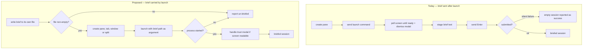
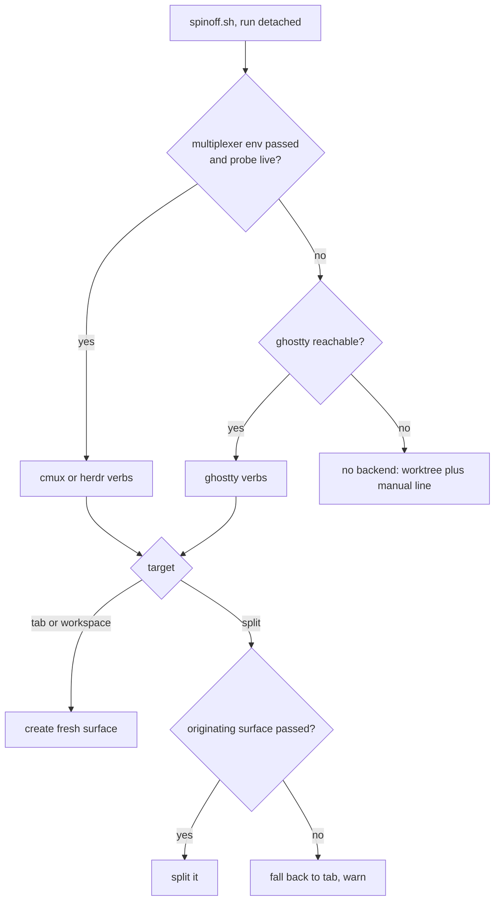

# Terminal-Agnostic Spinoff Launch - Plan

## Goal Capsule

- **Objective:** Let spinoff open a briefed session in the user's own terminal, not only inside cmux or herdr — by handing the brief to `claude` at launch instead of typing it into a session that is already running. Adds ghostty as a third backend and a `split` target. Ships as spinoff 0.9.0.
- **Product authority:** This plan owns brief delivery, the ghostty backend, and the `split` target. The dangling-handoff-reference fix and the shared `/tmp` handoff path fix are not active scope — see How This Work Fits Together.
- **Authority hierarchy:** An R wins on product behavior. A KTD wins on implementation mechanism within its cited R. A unit overrides neither.
- **Stop conditions:** Stop and surface rather than guess if (a) removing the staged send loses a signal not named in R12, or (b) a backend cannot return a handle for a target the plan claims it supports.
- **Product Contract preservation:** changed — R5 split into R5 + R12 after runtime evidence that the readiness path also dismisses the MCP trust modal; R7 and R8 refined to the user's stated split semantics; R13–R15 added to define what R2 detects. Requirements R1–R4, R6, R9–R11 unchanged.

---

## Product Contract

### Summary

Spinoff delivers the brief as part of launching the session rather than sending it afterward, and gains ghostty as a full third backend through ghostty's scripting interface. A `split` target opens the briefed session beside the active pane in the current tab. The post-launch staged-send path is removed; the modal handling it was entangled with stays.

### Problem Frame

Spinoff can only launch a session inside cmux or herdr. Anywhere else it degrades to printing a command for the user to run by hand, so the tool's core promise — one command and a briefed session appears — does not hold in the user's preferred terminal.

The reason for that coupling is how the brief is delivered. Spinoff sends the brief *after* launch, by typing into a Claude session already running inside a pane it controls. That demands a multiplexer: something that can create a pane, hand back a handle, watch it until the app is ready, and then inject text. Any terminal that cannot do all four is unreachable.

That delivery path is also fragile. It stages the brief with one call and submits it with a second, and the sequence has its output discarded. When one of those calls stopped existing, nothing reported it — sessions kept opening, correctly branched and unbriefed, and the run kept reporting success. The cost lands every time: the user arrives at a session that does not know why it exists.

### Key Decisions

- KD1. **The brief travels as a launch argument.** `claude` accepts a prompt positionally and submits it, so launching and briefing become one act. (session-settled: user-directed — chosen over repairing the post-launch send path: it removes the class of failure rather than this instance.) Governs R1, R2.
- KD2. **Ghostty is a full peer backend, not a degraded generic-terminal shim.** Its scripting interface creates windows, tabs, and splits and returns a handle for each. (session-settled: user-directed — chosen over a best-effort keystroke-driven backend: keystroke driving was assumed necessary and proved unnecessary.) Governs R4, R7, R8.
- KD3. **The workspace target maps to a new ghostty window.** Ghostty has no workspace concept. (session-settled: user-directed — chosen over leaving the workspace target unsupported on ghostty.) Governs R4.
- KD4. **Launcher calls stop discarding their own error output.** Blanket suppression is why a deleted subcommand went unnoticed. (session-settled: user-directed — chosen over keeping suppression and adding a separate check.) Governs R3, R10.
- KD5. **Split opens beside the active pane in the current tab, right by default.** (session-settled: user-directed — chosen over splitting into a named existing tab: that case is already served by a post-launch pane move.) Governs R7, R8.
- KD6. **The modal-handling path is retained.** Briefing no longer depends on it, but it is what gets MCP servers enabled for a session opened on a new project path. Governs R12.

<!-- ce-section: work-relationships -->
### How This Work Fits Together

This plan owns one of four outcomes bundled into spinoff 0.9.0. The breakdown is the current understanding of that release, not a committed roadmap.

- **Brief delivery, ghostty backend, and the split target** — this plan.
  - `Shares` the launch region of the spinoff script with the kickoff fix below, and supersedes it.
- **Kickoff never fires** — the originally-settled repair of the post-launch send path.
  - `Superseded by` this plan: the code that needed repairing is deleted. The regression test that motivated it survives as R10.
- **Handoff doc references dangle** — referenced documents are not carried into the worktree and references are not rewritten.
  - `Can proceed independently of` this plan.
- **Shared `/tmp` handoff path** — concurrent spinoffs overwrite one another's handoff file.
  - `Shares` the session-unique-path requirement with R15, which applies the same discipline to the brief file. `Still to decide` whether the handoff half rides along in 0.9.0.

### Requirements

**Brief delivery**

- R1. The brief is delivered as part of launching the session, not sent after launch.
- R2. When the brief cannot be delivered, the run reports the session as un-briefed rather than reporting success.
- R3. A launcher command that fails surfaces its failure; no launcher invocation discards its own error output.
- R13. The run refuses to launch when the brief file is missing or empty, and reports that as un-briefed.
- R15. The brief file is unique per run, and any manual-recovery command the run prints references a path that still exists afterward.

**Ghostty backend**

- R4. Ghostty is a full backend: every launch target produces a session briefed the same way as under cmux or herdr.
- R5. Ghostty confirms the session started from the process the terminal reports, not from rendered screen text.
- R6. Backend selection prefers an active multiplexer when spinoff runs inside one, and falls back to the terminal backend otherwise; an explicit backend choice overrides detection.
- R12. Trust-modal handling is retained for every backend that can read its session's screen. Briefing does not depend on it.

**Split target**

- R7. A `split` target opens the briefed session beside the active pane in the current tab, to its right by default and to its left when asked.
- R8. The split target is available on every backend that returns a handle to the pane it creates.
- R9. The split target is reachable through its own command, matching how the existing targets are exposed.
- R14. The originating surface is passed to the script explicitly, not inherited from the environment.

**Release hygiene**

- R10. A regression test fails when the script invokes a backend subcommand or flag the installed CLI does not expose.
- R11. Tests that assert the staged-send sequence are rewritten to assert brief-at-launch.

Target availability per backend:

| Target | cmux | herdr | ghostty |
|---|---|---|---|
| tab | new tab | new tab | new tab |
| workspace | new workspace | new workspace | new window (KD3) |
| split right | native | native | native |
| split left | native | split right, then swap | native |
| handoff viewer pane | yes | yes | yes |
| started-signal | screen text | screen text | process (R5) |

### Key Flows

- F1. Briefed session launch
  - **Trigger:** The user runs a spinoff command from any supported terminal or multiplexer.
  - **Steps:** Resolve the backend; create the pane, tab, or window for the target; write the brief to its own file; launch the session with the brief carried in the launch; confirm the process started.
  - **Outcome:** A session opens in the new worktree with the brief already submitted.
  - **Covered by:** R1, R4, R5, R6, R13

- F2. Split launch
  - **Trigger:** The user asks for the briefed session beside the one they are in.
  - **Steps:** Resolve the originating surface from the argument the skill passed; split it in the requested direction; launch the briefed session into the returned handle.
  - **Outcome:** The new session sits beside the active pane in the same tab.
  - **Covered by:** R7, R8, R9, R14

- F3. Launch that cannot be briefed
  - **Trigger:** No backend is available, the brief file is unusable, or a launcher command fails.
  - **Steps:** Still create the worktree and handoff; surface the failure and a command the user can run themselves.
  - **Outcome:** The run reports an un-briefed session and why, never a success.
  - **Covered by:** R2, R3, R13, R15

### Acceptance Examples

- AE1. **Covers R1.** Given a fresh worktree never opened before, when spinoff launches the session, then the brief is already submitted and the session has begun acting on it with no typing.
- AE2. **Covers R2, R3.** Given a launcher command that fails mid-launch, when the run finishes, then it names the session un-briefed and shows the underlying failure.
- AE3. **Covers R13.** Given a brief file that is empty, when the run reaches launch, then it does not launch and reports un-briefed.
- AE4. **Covers R10.** Given the script calls a backend subcommand or flag the installed CLI does not expose, when the suite runs, then a test fails and names the missing subcommand.
- AE5. **Covers R4, R6.** Given a plain ghostty window with no multiplexer active, when the workspace target is used, then a new ghostty window opens with a briefed session.
- AE6. **Covers R7, R9.** Given the user asks for a split with no direction, when the session opens, then it sits to the right of the pane they ran the command from, in the same tab.
- AE7. **Covers R7.** Given the user asks for a left split on herdr, when the session opens, then it sits to the left of the originating pane.
- AE8. **Covers R12.** Given a worktree of a repo containing `.mcp.json`, when the session opens, then the trust modal is handled and the run discloses it.
- AE9. **Covers R14.** Given the script runs detached with no terminal environment inherited, when a split is requested, then it uses the surface passed as an argument rather than failing to find one.

### Scope Boundaries

**Deferred for later**

- Generalizing process-based started-signals to cmux and herdr. Those paths work; ghostty proves the shape first.
- The shared `/tmp` handoff path fix.

**Outside this work**

- Splitting into a named existing tab. Already served by launching a tab and moving the pane.
- Terminals with no scripting surface. The existing no-backend path stays as-is.
- The dangling handoff reference fix.
- The screen readiness markers themselves — checked and working.

### Dependencies / Assumptions

- Ghostty exposes a scripting interface creating windows, tabs, and splits that each return a handle, and can launch a terminal with a given command, working directory, and environment. Verified against Ghostty 1.3.2.
- `claude` accepts a prompt as a positional argument and submits it on launch, including in a directory containing `.mcp.json`. Verified by direct observation.
- Passing the brief by file path survives AppleScript and shell quoting intact. Verified byte-identical against hostile input.
- The ghostty backend is macOS-only, because its scripting interface is.
- Controlling ghostty needs macOS Automation permission. Already granted on this machine; a machine without it raises a system dialog and `osascript` fails with `-1743` until granted.

### Outstanding Questions

**Deferred to Planning** — none remain; all three are resolved in the Planning Contract.

---

## Planning Contract

### Key Technical Decisions

- KTD1. **The brief is passed by file path, never inline.** The launch command reads the file, so no brief text crosses an AppleScript or shell quoting boundary. Verified byte-identical with input containing apostrophes, double quotes, backticks, `$`, backslashes and a newline. Cites R1, R13, R15.
- KTD2. **The originating surface arrives as a script argument.** The skill runs the script through a background agent, which loses `HERDR_PANE_ID` and `GHOSTTY_SURFACE_ID`; the script already receives `--session-cwd` and `--session-transcript` for exactly this class of main-session fact, so the surface follows that pattern. Cites R14.
- KTD3. **Ghostty is driven through its AppleScript dictionary**, with the command carried in a surface configuration. Cites R4, R7. (session-settled: user-directed — chosen over keystroke driving: the dictionary returns handles and keystrokes do not.)
- KTD4. **The modal-handling path stays; only the staged send is removed.** Reading the screen after launch is still what enables MCP servers on a new project path. Cites R12. This reverses an earlier intent to reduce that path.
- KTD5. **Left split is per-backend.** Native on cmux and ghostty; on herdr, split right then swap, because `herdr pane split --direction` accepts only `right` and `down`. Cites R7, R8.
- KTD6. **The drift test compares script-invoked subcommands against the installed CLI's own help output**, and fails rather than skips when that CLI is present. A stub cannot catch drift — the current stub implements `agent send`, which is why the suite is green today against a call that does not exist. Cites R10.
- KTD7. **Ghostty's started-signal is the process id the terminal reports.** Cites R5.

### High-Level Technical Design

How the brief reaches the session, before and after:

Backend selection, and why the split path needs the passed-in surface:

### Assumptions

- Triaging the two pre-existing `spinoff.bats` failures will not require design changes. If it does, that is a stop condition.

### Sequencing

U1 first — the suite is not a usable gate until its existing failures are understood. U2 and U4 then proceed in parallel with U5. U6 depends on U2 and U5. U7 last.

---

## Implementation Units

### U1. Triage the pre-existing test failures

**Goal:** Establish a trustworthy baseline so later breakage is attributable.
**Requirements:** Enables verification of all others.
**Dependencies:** none.
**Files:** `plugins/spinoff/skills/spinoff/scripts/spinoff.bats`
**Approach:**
1. Run the suite to completion and record every failure.
2. For each, determine whether the script or the test is wrong.
3. Fix or document. Do not change behavior this plan will replace anyway — note those and move on.

**Execution note:** Record the full baseline before touching anything; the suite takes minutes, so run it once and keep the output.
**Test scenarios:**
- The suite runs to completion and the pass/fail counts are recorded.
- Each failure is classified as pre-existing-and-fixed, pre-existing-and-superseded-by-this-plan, or environment-dependent.
**Verification:** A recorded baseline naming every failing test and its disposition.

### U2. Carry the brief in the launch command (cmux + herdr)

**Goal:** Deliver the brief as `claude`'s positional argument; delete the staged send.
**Requirements:** R1, R2, R3, R13, R15. Implements KD1 via KTD1.
**Dependencies:** U1.
**Files:** `plugins/spinoff/skills/spinoff/scripts/spinoff.sh`
**Approach:**
1. Write the brief to a per-run file; keep it after the run so the recovery line stays runnable (R15).
2. Refuse to launch when that file is missing or empty (R13).
3. Extend the launch command to read the brief from that path.
4. Delete `launcher_send_kickoff_*` and its dispatcher.
5. Keep the screen-reading path for modal handling (KTD4); it no longer gates briefing.
6. Stop discarding launcher stderr; a non-zero exit marks the session un-briefed (R3).

**Patterns to follow:** `abspath` for path pinning; the root-anchored `info/exclude` write used for carried dotfiles, if the brief file lands inside the worktree; `die`/`step` for messaging.
**Test scenarios:**
- Covers AE1. A launch command is emitted that carries the brief path, and no staged-send call is made.
- Covers AE3. An empty brief file blocks launch and the run reports un-briefed.
- A missing brief file blocks launch and reports un-briefed.
- Covers AE2. A launcher command exiting non-zero marks the session un-briefed and surfaces the failure.
- A brief containing apostrophes, double quotes and backticks reaches the launch command unaltered.
- Covers AE8. With the screen showing the MCP modal, the modal is handled and disclosed.
- The worktree, branch and handoff still land when the launch fails.
**Verification:** `kickoff-gate.test.sh` passes against the new shape, and no `agent send` call appears in any argv log.

### U3. Rewrite the tests that encode the staged send

**Goal:** Make the suite assert brief-at-launch.
**Requirements:** R11.
**Dependencies:** U2.
**Files:** `plugins/spinoff/skills/spinoff/scripts/spinoff.bats`, `plugins/spinoff/skills/spinoff/scripts/kickoff-gate.test.sh`, `plugins/spinoff/skills/spinoff/scripts/smoke.sh`
**Approach:**
1. Rewrite the three `kickoff-gate.test.sh` scenarios to assert the brief rides the launch.
2. Rewrite `spinoff.bats` tests 14, 16 and 17 (the exactly-one-submit and resubmit-guard tests).
3. Update the cmux behavior-preservation test, whose ordered verb list includes the kickoff send — it is not a kickoff test and would otherwise break unexplained.
4. Update `smoke.sh`'s static brief-shape check.

**Execution note:** Change one assertion to expect the new shape and watch it fail against the old code before implementing, so each rewritten test is known to be load-bearing.
**Test scenarios:**
- Each rewritten test fails against the pre-U2 script and passes after.
- No test asserts a subcommand absent from the installed CLI.
**Verification:** All three harnesses pass, and the U1 baseline's failure set has not grown.

### U4. CLI-drift regression test

**Goal:** Fail when the script calls a backend subcommand that does not exist.
**Requirements:** R10. Implements KD4.
**Dependencies:** U1.
**Files:** `plugins/spinoff/skills/spinoff/scripts/cli-drift.test.sh` (new)
**Approach:**
1. Extract the backend subcommands the script invokes by reading the script, not by running it.
2. Compare each against the installed CLI's own help output.
3. Fail when a subcommand is absent. Report explicitly skipped — never passed — when the CLI itself is absent.

**Execution note:** Prove it by pointing it at the pre-U2 script; it must fail on `agent send`. A drift test that cannot fail on the known-bad input is not a test.
**Test scenarios:**
- Covers AE4. Against the pre-U2 script with herdr installed, the test fails and names `agent send`.
- Against the post-U2 script, it passes.
- With the CLI absent, it reports skipped and does not report a pass.
- A subcommand appearing only in a comment is not treated as invoked.
**Verification:** The test fails on the old script and passes on the new one, demonstrated in both directions.

### U5. Ghostty backend

**Goal:** Implement all seven launcher verbs for ghostty.
**Requirements:** R4, R5, R6, R12. Implements KD2, KD3 via KTD3, KTD7.
**Dependencies:** U1.
**Files:** `plugins/spinoff/skills/spinoff/scripts/spinoff.sh`, `plugins/spinoff/skills/spinoff/scripts/spinoff.bats`
**Approach:**
1. Add a `ghostty` arm to each of the seven dispatchers and to the `--launcher` validation.
2. Drive ghostty through its scripting dictionary, passing the launch command and working directory in a surface configuration.
3. Take window, tab, split and terminal handles from the values those calls return.
4. Detect ghostty only after the multiplexer probes fail (R6) — its environment variables are present even when a multiplexer owns the session.
5. Treat a missing Automation permission as a terminal, named failure with the remedy, not a retry.

**Technical design (directional, not specification):** verbs map onto the dictionary as new-window → workspace, new-tab → tab, split → split, and the started-signal reads the terminal's reported process id.
**Test scenarios:**
- Covers AE5. With no multiplexer environment, the workspace target opens a new window and reports briefed.
- With multiplexer environment present, ghostty is not selected.
- Forcing ghostty explicitly overrides detection.
- The tab target creates a tab in an existing window and returns its handle.
- A launch whose process never appears reports un-briefed.
- An Automation-permission failure is reported with its remedy and does not retry.
- Covers AE8. Modal handling still runs where the screen is readable.
**Verification:** A real spinoff into a plain ghostty window opens a briefed session; the suite covers the detection precedence.

### U6. Split target

**Goal:** Add `split`, beside the active pane, right by default and left on request.
**Requirements:** R7, R8, R9, R14. Implements KD5 via KTD2, KTD5.
**Dependencies:** U2, U5.
**Files:** `plugins/spinoff/skills/spinoff/scripts/spinoff.sh`, `plugins/spinoff/commands/start-split.md` (new), `plugins/spinoff/skills/spinoff/scripts/spinoff.bats`, `plugins/spinoff/skills/spinoff/scripts/smoke.sh`
**Approach:**
1. Add `split` to the `--target` validation and a direction flag defaulting to right.
2. Add an argument carrying the originating surface (KTD2); the skill supplies it.
3. Add a `launcher_new_split` verb with all three backend arms; on herdr, split right then swap for left (KTD5).
4. Fall back to the tab target with a warning when no originating surface was passed.
5. Create the new pane unfocused, matching how the existing targets avoid disturbing the user before success.

**Test scenarios:**
- Covers AE6. A split with no direction places the session to the right of the passed surface.
- Covers AE7. A left split on herdr issues a right split followed by a swap.
- Covers AE9. With no surface passed, the run falls back to the tab target and warns.
- An invalid direction is rejected with a clear message.
- `--target split` is accepted by validation; an unknown target is still rejected.
- The new pane is not focused before the launch is confirmed.
- The summary names the split target rather than reporting a tab.
**Verification:** A real spinoff with the split target lands beside the originating pane on herdr and on ghostty.

### U7. Docs, command surface, and version

**Goal:** Make the user-facing surface describe three backends and three targets.
**Requirements:** R9.
**Dependencies:** U2, U5, U6.
**Files:** `plugins/spinoff/skills/spinoff/SKILL.md`, `plugins/spinoff/commands/start-session.md`, `plugins/spinoff/commands/start-workspace.md`, `plugins/spinoff/commands/start.md`, `plugins/spinoff/commands/start-split.md`, `plugins/spinoff/README.md`, `plugins/spinoff/.claude-plugin/plugin.json`, `.claude-plugin/marketplace.json`
**Approach:**
1. Update every place enumerating targets or backends — the skill frontmatter, its commands table, its backends section, its script-invocation block and behavior narrative, its no-backend note, each command file, the README, and both manifests.
2. Add the skill instruction to pass the originating surface, since a background agent cannot inherit it.
3. Bump the version in `plugin.json` and `.claude-plugin/marketplace.json` together to 0.9.0.

**Test scenarios:** `Test expectation: none -- documentation and packaging only; correctness is covered by U2 through U6.`
**Verification:** No user-facing file describes only two backends or two targets, and both manifests read 0.9.0.

---

## Verification Contract

There is no CI in this repository — no `.github/workflows` and no `package.json`. Every gate below is run locally and its result reported honestly.

| Gate | Command | Applies to | Done signal |
|---|---|---|---|
| Syntax | `bash -n plugins/spinoff/skills/spinoff/scripts/spinoff.sh` | all units | exit 0 |
| Unit suite | `bats plugins/spinoff/skills/spinoff/scripts/spinoff.bats` | U1, U3, U5, U6 | no failures beyond the U1 baseline; takes minutes |
| Kickoff gate | `bash plugins/spinoff/skills/spinoff/scripts/kickoff-gate.test.sh` | U2, U3 | all checks pass |
| Smoke | `bash plugins/spinoff/skills/spinoff/scripts/smoke.sh` | U2, U3, U6, U7 | all checks pass |
| Drift | `bash plugins/spinoff/skills/spinoff/scripts/cli-drift.test.sh` | U4 | passes on new script, fails on old |
| Manual launch | a real spinoff per backend and target | U2, U5, U6 | a session opens already briefed |

`shellcheck` is not installed and is not a gate.

Manual verification is required, not optional — the tests stub the launcher CLIs, and a stub is what hid the current bug. Cover: herdr tab, herdr split right, herdr split left, ghostty window, ghostty tab, ghostty split, and one no-backend run. cmux is installed but this session runs under herdr; if cmux cannot be exercised, say so rather than implying it was.

---

## Definition of Done

- Every requirement R1–R15 is either satisfied or explicitly deferred in Scope Boundaries.
- All gates in the Verification Contract pass, with the manual matrix actually run and its results stated per row.
- The drift test is demonstrated failing against the pre-change script.
- No test asserts a backend subcommand absent from the installed CLI.
- The U1 baseline is recorded, and any failure still present at the end is named and explained.
- No user-facing file describes only two backends or two targets; both manifests read 0.9.0.
- Abandoned experimental code from approaches that did not work is removed, not left in the diff.
- Code review returns no P0, P1 or P2 findings.
