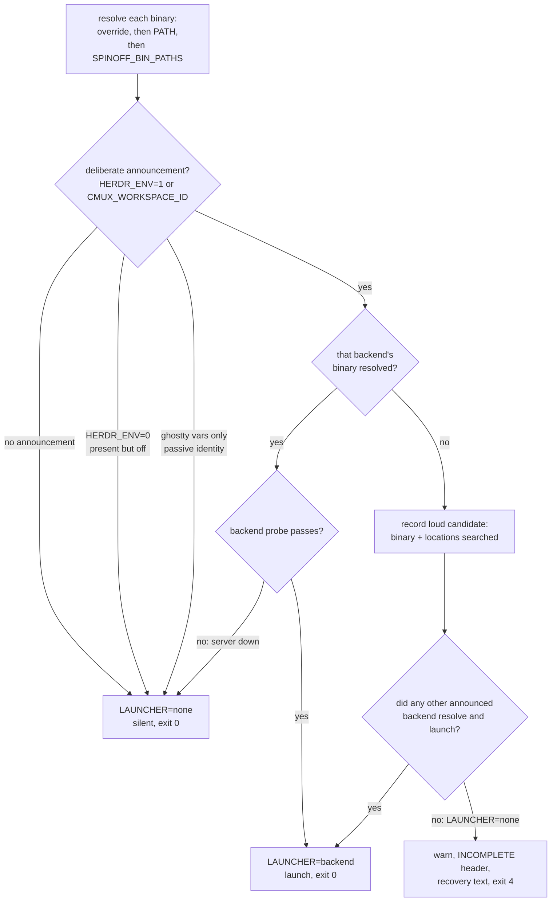

# Launcher Binary Resolution and Honest Launch Diagnostics - Plan

## Goal Capsule

- **Objective:** `spinoff.sh` resolves `herdr`, `cmux`, and `osascript` to absolute paths without depending on the caller's inherited `PATH`, and a run whose environment deliberately announces a backend it cannot resolve reports incomplete with a non-zero exit instead of a silent skip.
- **Authority hierarchy:** R-IDs win on behavior. KTDs win on mechanism within their cited Rs. The in-file comments at `plugins/spinoff/skills/spinoff/scripts/spinoff.sh:30-77` record prior decisions that R8, R9, R10, and R14 preserve — read them before changing the resolver.
- **Execution profile:** One shell script, its bats suite, one test file's binary lookup, the skill doc, and the two version manifests. No new dependencies and no new files.
- **Stop conditions:** Stop and surface a blocker if the loud path cannot be made to fire without also firing on `HERDR_ENV=0` (R8), a resolvable-but-server-down herdr (R9), a ghostty-only session (R14), or a run that successfully launched through a different announced backend (R17). Those four silent paths are load-bearing.
- **Tail ownership:** The caller owns commit, PR, and CI.

---

## Product Contract

### Summary

Replace the bare `command -v` launcher lookups in `spinoff.sh` with a resolver that honors an explicit override, then `PATH`, then an overridable list of known install locations, and split the single `LAUNCHER=none` message into two outcomes: a benign silent skip, and a loud non-zero-exit failure when a deliberately-announced backend's binary is unresolvable and nothing else launched.

### Problem Frame

A `/start` spinoff created its branch, worktree, and handoff correctly, then skipped the launch and printed `▸ not inside cmux/herdr (or the CLI is missing) — skipping launch automation` with exit code 0 and no warning. The session was inside a live herdr and `HERDR_ENV=1` had been exported into the background agent explicitly. It read as a clean worktree-only run.

The cause is `spinoff.sh:1027`: `HERDR="$(command -v herdr 2>/dev/null)"`, with no fallback. `herdr` lives at `/opt/homebrew/bin/herdr`. A background agent does not inherit the login shell's `PATH`, so when that directory is absent `HERDR` is empty, `_herdr_probe` short-circuits on `[ -n "${HERDR:-}" ]`, and `resolve_launcher` falls through to `none`. The same command from the same session succeeded an hour earlier under a different inherited `PATH`, which is what made it read as flaky rather than broken.

The message is the second defect and arguably the worse one. It conflates a benign state with a broken one. `HERDR_ENV=1` and no resolvable `herdr` is never a legitimate steady state, and reporting it at exit 0 is what let a failed launch reach the user as success.

### Requirements

**Resolution**

- R1. Launcher binaries resolve to an absolute path without depending on the caller's inherited `PATH`.
- R2. An explicit override, when set, wins over every other resolution source.
- R3. Resolution order is override, then `command -v`, then a list of known install locations.
- R4. The `osascript` the ghostty probe depends on resolves through the same path, and the probe still asks `osascript` nothing.
- R15. A candidate is accepted only when it is a regular file and executable. A *set* override that fails that test resolves to empty rather than falling through to `PATH`, and its diagnostic names the override variable and the rejected value.
- R16. The known-install-location list is overridable, so a test can guarantee no real install location satisfies a lookup.

**Diagnostics**

- R5. A deliberately-announced backend whose binary cannot be resolved emits a warning naming the binary, every location searched, and the override variable that fixes it.
- R6. When resolution ends in `LAUNCHER=none` because a deliberately-announced backend's binary was unresolvable, the run reports incomplete and exits 4 — a code distinct from the existing failure codes.
- R17. The loud path fires only when no announced backend resolved. A run that launched successfully through another announced backend stays silent and exits 0.
- R7. A session in no multiplexer stays silent and exits 0.
- R8. `HERDR_ENV=0` keeps its existing silent fallback to `none`. (see origin: `docs/handoff.md`; rationale at `spinoff.sh:70-77`)
- R9. A resolvable `herdr` whose server is not running keeps its existing silent fallback.
- R10. A forced `--launcher` keeps its never-hard-error fallback to auto-detection.
- R14. Ghostty's environment variables are passive terminal identity, not a launch request. An unresolvable `osascript` never triggers the loud path.

**Compatibility**

- R11. The scalar `HERDR=` / `CMUX=` variable spelling survives, so `cli-drift.test.sh`'s static extraction keeps finding the CLI call sites.
- R12. The resolver is reachable through the existing `SPINOFF_TEST_SOURCE` hook.
- R13. `resolve_launcher` remains callable with `HERDR` and `CMUX` pre-injected, so the six existing resolver tests keep exercising what they exercise today.

### Key Decisions

- **Degrade loudly, never hard-fail early.** (session-settled: user-approved — chosen over hard-failing before the branch/worktree/handoff exist: the worktree is still valuable output, but the run must not report success.) Governs R6, R7, R17.
- **Blast radius is the launcher binaries only.** (session-settled: user-approved — chosen over a wider PATH-robustness audit of `git`, `glow`, `bat`, and `python3`: keeps the fix bounded to the live bug, and `glow`/`bat` are already best-effort.) Governs R1, R4.
- **The loud path fires only on an unresolvable binary.** (session-settled: user-approved — chosen over warning on both the unresolvable-binary and server-down cases: the silent fallback for a present-but-switched-off announcement is deliberate existing behavior, and only a deliberate announcement with no resolvable binary is never a legitimate steady state.) Governs R5, R8, R9, R14.

### Scope Boundaries

- The launcher seam and the three backends' CLI verbs are untouched. This changes how binaries are found, not how they are driven.
- Ghostty's `GHOSTTY_APP` bundle resolution (`spinoff.sh:1034-1043`) is already filesystem-based and needs no change. Only its `osascript` lookup does, and only for resolution — never for the loud path (R14).
- The plugin cache at `~/.claude/plugins/cache/shrimpshack/spinoff/` is not a target. `plugins/spinoff/` is the source of truth.

#### Deferred to Follow-Up Work

- A PATH-robustness audit of the other tools the script shells out to (`git`, `glow`, `bat`, `python3`). `git` in particular stays PATH-dependent by design, which is why the regression test keeps the system directories on `PATH` (see U2).
- A `--launcher-bin <path>` flag. The env override covers the testing need; see KTD7.
- `smoke.sh:17`'s stale comment claiming it passes `--launcher none`, which is not a valid `--launcher` value. Harmless, unrelated to this fix.

---

## Planning Contract

### Key Technical Decisions

- KTD1. **Override names are `HERDR_BIN` and `CMUX_BIN`.** Both are already this repo's vocabulary for "path to that binary" — `spinoff.bats:108-109` and `cli-drift.test.sh:139-141` both use them as local variable names. Verified safe today: the bats assignments are not exported, so existing full-script runs do not begin honoring them as overrides. The collision is latent rather than absent — the moment a test moves `HERDR_BIN` into a `run env …` block, every full-script test would start honoring a production override and the loud-path tests would stop being able to fail. U3 therefore keeps the loud-path tests explicitly unsetting it. Governs R2.
- KTD2. **Resolution lives in a helper function defined above the `SPINOFF_TEST_SOURCE` guard, and is called from the existing resolution region.** The guard at `spinoff.sh:949-953` returns before line 1021, so anything written as top-level code in the current resolution block is unreachable when sourced. A function above the guard satisfies R12. Keeping the *call* in the 1021 region — rather than moving resolution inside `resolve_launcher` — is what satisfies R13: `run_resolve` injects `HERDR`/`CMUX` by hand, and a `resolve_launcher` that re-resolved internally would overwrite the injection and break all six existing resolver tests. Governs R12, R13.
- KTD3. **The announced-but-unresolvable check reads the resolved variable, not the resolution attempt.** `resolve_launcher` records the loud candidate from the announcement plus an empty `HERDR`/`CMUX`. Under the source hook the injected value is non-empty, so the check is inert there — which is why R13 holds. Governs R5.
- KTD8. **Recording the loud candidate and acting on it are separate steps.** Resolution records *which* announced backend was unresolvable; the warning, the incomplete state, and exit 4 fire only once `resolve_launcher` has settled on `none`. Without that split, a session announcing both herdr and cmux where only cmux resolves would launch successfully and still exit 4 — `spinoff.sh:60-61` falls through to cmux, and `spinoff.bats:203` pins that fallback as correct. Governs R17.
- KTD9. **The loud path covers `HERDR_ENV=1` and `CMUX_WORKSPACE_ID` only.** Those are deliberate announcements: a process sets them to say a multiplexer owns this session. Ghostty's `TERM_PROGRAM` / `GHOSTTY_RESOURCES_DIR` / `GHOSTTY_SURFACE_ID` are set for every Ghostty window whether or not a launch is wanted, and `osascript` does not exist off macOS at all — so keying a loud failure on them would turn ordinary sessions into exit-4 failures, including the plan's own "no announcement, stripped `PATH`" case. Ghostty keeps today's silent `none`. Governs R14.
- KTD10. **The candidate directory list is read from `SPINOFF_BIN_PATHS`, defaulting to `/opt/homebrew/bin:/usr/local/bin:$HOME/.local/bin`.** Without this the regression test cannot fail on the machine that runs it: `/opt/homebrew/bin/herdr` exists here, so a stripped-`PATH` run would still resolve `herdr`, never reach the loud path, and pass for the wrong reason — and with no CI in this repo, that box is the only place the gate ever runs. `SPINOFF_READY_TIMEOUT_MS` (`spinoff.sh:1298`) is the in-file precedent for an env knob that exists to make otherwise-untestable behavior testable. Governs R16.
- KTD4. **Exit code 4.** The script already uses 1 (`die`), 2 (unknown arg), and 3 (launched but not briefed). Codes 3 and 4 are mutually exclusive by construction: 3 requires `BRIEF_ATTEMPTED=1`, which requires `LAUNCHER != none`, while 4 requires `LAUNCHER = none`. Governs R6.
- KTD5. **The loud path reuses the existing incomplete-run machinery at the summary tail.** `spinoff.sh:1372-1448` already implements this contract for the unbriefed-session case: `BRIEF_ATTEMPTED` set at `:1378`, the `⚠ … INCOMPLETE` header at `:1386-1390`, the recovery text outside the block, and a non-zero exit. Both the header condition and the tail condition must learn the new flag — in the loud case `LAUNCHER=none` so `BRIEF_ATTEMPTED` stays 0, and editing only the tail would print `✓ Spinoff complete` alongside exit 4. Governs R6.
- KTD6. **Keep the scalar `HERDR="…"` / `CMUX="…"` assignment spelling; no arrays.** `cli-drift.test.sh:40-69` extracts call sites by grepping for the literal `"$HERDR"` and `"$CMUX"` spellings. Array-ifying silently zeroes that extraction — a known trap already recorded in the `f0b5d35` commit message, where moving `--workspace` into an array dropped the drift check from 59 to 55 verified calls. Governs R11.
- KTD7. **No `--launcher-bin` flag.** `HERDR_BIN`/`CMUX_BIN` already give the test suite absolute-path injection, and a flag would add a fourth precedence layer to R3 for no new capability.

### High-Level Technical Design

The resolve gate is where the two defects meet: the same fallthrough serves a benign state and a broken one. The decision shape, with the record-then-act split from KTD8:

The full state matrix. Only the last two rows change behavior:

| Announcement | Binary resolves | Probe passes | Outcome | Exit | Changed |
|---|---|---|---|---|---|
| none | — | — | silent `none` | 0 | no |
| `HERDR_ENV=0` | — | — | silent `none` | 0 | no (R8) |
| ghostty vars only | no (`osascript`) | — | silent `none` | 0 | no (R14, KTD9) |
| ghostty vars only, no `.app` | — | — | silent `none` | 0 | no |
| `HERDR_ENV=1` | yes | yes | `herdr` | 0 | no |
| `HERDR_ENV=1` | yes | no (server down) | silent fallthrough | 0 | no (R9) |
| forced `--launcher X` | no | — | warn, fall back to auto-detect | per resolved | no (R10) |
| `HERDR_ENV=1` no + `CMUX_WORKSPACE_ID` yes | mixed | — | launch via cmux | 0 | **yes (R17, KTD8)** |
| `HERDR_ENV=1` and/or `CMUX_WORKSPACE_ID`, none resolve | **no** | — | **loud `⚠`, INCOMPLETE** | **4** | **yes (R5, R6)** |

The forced-`--launcher` row stays non-fatal per R10: a forced launcher whose binary is missing still falls through to auto-detection. If auto-detection then lands on `none` with a deliberate announcement outstanding, the loud path fires from *that* evaluation.

### Assumptions

These are agent bets, not user-confirmed decisions. Each is cheap to correct at implementation time.

- The default candidate list is `/opt/homebrew/bin`, `/usr/local/bin`, `$HOME/.local/bin` for `herdr` and `cmux`, and `/usr/bin` for `osascript`. It is homebrew/macOS-shaped; every backend the script drives is macOS-only, so the exposure is narrow, but a non-brew install (cargo, nix, `~/bin`, a dev build) still reaches the loud path rather than launching. That is a better outcome than today's silent skip, and `HERDR_BIN` is the documented escape.
- cmux keeps its existing `/Applications/cmux.app/Contents/Resources/bin/cmux` fallback as an additional candidate rather than losing it to the generic list.
- No CI runs these suites — there is no `.github/` directory in the repo. Verification is the five manual gates in the Verification Contract.
- A version bump is expected in both `plugins/spinoff/.claude-plugin/plugin.json` and `.claude-plugin/marketplace.json`, matching how `f0b5d35` and `48ce78d` shipped. There is no CHANGELOG to update.

### Sequencing

U1 establishes the resolver and must land before U2, which consumes the resolved-or-empty state and owns the loud-path regression test. U3 adds the remaining resolver-level and silent-path coverage. U4 has no content dependency and is sequenced last so the bump ships with the fix.

---

## Implementation Units

### U1. Resolve launcher binaries to absolute paths

**Goal:** `herdr`, `cmux`, and `osascript` resolve through override → `PATH` → `SPINOFF_BIN_PATHS`, producing a validated absolute path or an empty string.

**Requirements:** R1, R2, R3, R4, R11, R12, R13, R15, R16 · KTD1, KTD2, KTD6, KTD10

**Dependencies:** none

**Files:**
- `plugins/spinoff/skills/spinoff/scripts/spinoff.sh`
- `plugins/spinoff/skills/spinoff/scripts/cli-drift.test.sh`

**Approach:**
1. Add a resolver helper above the `SPINOFF_TEST_SOURCE` guard at `spinoff.sh:949-953`, in the launcher-seam region where the probes live. It takes a binary name and an override value, and echoes a validated absolute path or nothing. Per KTD2 the placement above the guard is what makes it reachable when sourced.
2. Validate every candidate — including the override — with a regular-file-and-executable test, per R15. A set-but-invalid override resolves to empty and never falls through to `PATH`; carry the rejected value so the diagnostic can name it. This closes the case where `HERDR_BIN` pointing at a directory passes a bare executable test and silently reproduces the original bug.
3. Read the candidate directories from `SPINOFF_BIN_PATHS` (colon-separated) with the KTD10 default.
4. Rewrite the three resolution sites in the `spinoff.sh:1021-1043` region to call it: `CMUX` (keeping its app-bundle path as a candidate), `HERDR`, and a new `OSASCRIPT`. Keep the scalar assignment spelling per KTD6.
5. Point `_ghostty_probe` at the resolved `osascript` instead of `command -v osascript`, and the `osascript` invocation at `spinoff.sh:774` at the resolved value. Those are the only two `osascript` call sites. The probe must still pass no verb — the comment at `spinoff.sh:40-42` records that a probe raising the macOS Automation dialog is the failure mode being avoided.
6. Use the file's existing `${VAR:-}` convention for every new read. The script runs under `set -u` (`spinoff.sh:12`) and the resolution region never executes under the source hook, so a bare `$OSASCRIPT` inside `_ghostty_probe` would abort the six sourced resolver tests.
7. Make `cli-drift.test.sh`'s two lookups honor an inherited override before falling back to `command -v`. Today `cli-drift.test.sh:139-141` overwrites any inherited `HERDR_BIN`, so the gate cannot be steered and skips — exiting 2, which the Verification Contract counts as a failure — in exactly the PATH-less environment where this bug lives.
8. Extend the resolution-region comments with the reason: a background agent does not inherit the login shell's `PATH`, so any tool the plugin runs from a subagent resolves absolutely. Note the mirror-image relationship to the existing R8 comment at `spinoff.sh:38` — that one keeps a stale `HERDR_ENV=1` from winning; this one keeps a live `HERDR_ENV=1` from losing to an unfindable binary.

**Patterns to follow:** The ghostty `GHOSTTY_APP` resolution at `spinoff.sh:1034-1043` is the in-file precedent for "prefer the location the environment points at, then walk a list of standard ones, then leave it empty." `SPINOFF_READY_TIMEOUT_MS` at `spinoff.sh:1298` is the precedent for a test-facing env knob. Match the comment density and prior-decision-rationale style throughout the script.

**Test scenarios:**
- Override wins: `HERDR_BIN` set to an existing executable with a different `herdr` on `PATH` resolves to the override.
- Override wins under a stripped `PATH`: same, with `PATH` carrying no `herdr`.
- PATH resolution: no override, a `herdr` stub on `PATH`, resolves to the stub's absolute path.
- Known-location fallback: no override, no `herdr` on `PATH`, a `herdr` in a `SPINOFF_BIN_PATHS` directory resolves to that absolute path.
- Unresolvable: no override, no `herdr` on `PATH`, `SPINOFF_BIN_PATHS` pointing at an empty directory resolves to empty without erroring.
- Override pointing at a directory resolves to empty, and does not fall through to a `herdr` that is on `PATH`.
- Override pointing at a nonexistent path resolves to empty.
- Override pointing at a non-executable regular file resolves to empty.
- Ghostty probe stays silent: the probe with a resolved `osascript` passes without invoking `osascript`.
- Sourced-mode safety: the six existing resolver tests still pass, proving no new bare `$VAR` read aborts under `set -u`.
- Drift gate steerable: `cli-drift.test.sh` with a stripped `PATH` and `HERDR_BIN` set verifies its calls instead of skipping.

**Verification:** `bash -n` passes. All six existing resolver tests in `spinoff.bats` pass unchanged, proving R13 held. `cli-drift.test.sh` reports the same verified-call count as before the change, and reports it under a stripped `PATH` with the override set.

### U2. Split the launch diagnostics and the exit contract

**Goal:** A deliberately-announced backend that resolves nowhere, with nothing else launched, warns loudly and exits 4. The four silent paths stay silent at exit 0.

**Requirements:** R5, R6, R7, R8, R9, R10, R14, R17 · KTD3, KTD4, KTD5, KTD8, KTD9

**Dependencies:** U1

**Files:**
- `plugins/spinoff/skills/spinoff/scripts/spinoff.sh`
- `plugins/spinoff/skills/spinoff/scripts/spinoff.bats`
- `plugins/spinoff/skills/spinoff/SKILL.md`

**Approach:**
1. Write the stripped-`PATH` loud-path regression test first and watch it fail — see the Execution note. It lives in this unit, not U3, because the deliberate-fail observation has to happen before the behavior change.
2. In `resolve_launcher`, record the announced-but-unresolvable candidate per KTD3 — the deliberate announcement is present and the corresponding resolved variable is empty — capturing the binary name, the locations searched, and the override variable. Cover `HERDR_ENV=1` and `CMUX_WORKSPACE_ID` only, per KTD9. Do not record for `HERDR_ENV=0` (R8), a resolved binary whose probe failed (R9), or ghostty vars (R14).
3. Act on the record only once `resolve_launcher` has settled on `none`, per KTD8. Emit the `⚠` to stderr naming the binary, the locations searched, and the override that fixes it (R5).
4. Replace the single `step "not inside cmux/herdr (or the CLI is missing) — skipping launch automation"` at `spinoff.sh:1339` with the benign wording for a genuinely unannounced session; the loud case has already spoken via the `⚠`.
5. Teach both the header condition at `spinoff.sh:1386` and the tail condition at `spinoff.sh:1440` the new flag, per KTD5, so the block header reads `INCOMPLETE` rather than `✓ Spinoff complete` and the run exits 4. Leave the unbriefed-session branch and its exit 3 intact; KTD4 records why the two cannot both fire.
6. Correct the `launch: not automated (not inside cmux/herdr)` line in the summary's `LAUNCHER = none` branch so it does not claim "not inside cmux/herdr" when the real cause was an unresolvable binary.
7. Add an exit-code table to `SKILL.md` (1 die, 2 bad argument, 3 launched-not-briefed, 4 announced backend unresolvable) and document `HERDR_BIN` / `CMUX_BIN`. The background agent relays this script's outcome to a user; an undocumented non-zero exit reproduces the unactionable-message problem this plan exists to remove.

**Execution note:** Author the loud-path test before step 2 and record its pre-fix output. The observation to look for is `▸ … skipping launch automation` at exit 0 — not merely a non-zero exit. Build its `PATH` as a `herdr`-free stub directory plus `/usr/bin:/bin`, with `HERDR_BIN` unset and `SPINOFF_BIN_PATHS` pointing at an empty temp directory. A `PATH` containing only the stub directory dies at `git rev-parse` (`spinoff.sh:1064`) long before the launch gate, which would read as the bug and confirm nothing.

**Patterns to follow:** `spinoff.sh:1372-1448` is the template — `BRIEF_ATTEMPTED` gate, header inside the block, recovery outside it, non-zero exit, and the comment explaining why a caller that only checks status must not read it as success. `spinoff.sh:1015-1019` is the in-file precedent for a `⚠` written to stderr while the run continues.

**Test scenarios:**
- Loud on unresolvable herdr: full-script run with `HERDR_ENV=1`, a `herdr`-free `PATH`, `HERDR_BIN` unset, `SPINOFF_BIN_PATHS` empty. Warning names `herdr`, the locations searched, and `HERDR_BIN`; exit is 4; branch, worktree, and `docs/handoff.md` all exist afterward.
- Loud on unresolvable cmux: same shape with `CMUX_WORKSPACE_ID` set and no resolvable `cmux`.
- No `✓` in the loud case: the block header reads `INCOMPLETE` and `✓ Spinoff complete` appears nowhere in the output.
- Silent when another announced backend launches: `HERDR_ENV=1` with unresolvable `herdr` plus `CMUX_WORKSPACE_ID` with a resolvable cmux stub launches via cmux at exit 0 with no `⚠`.
- Silent on no announcement: `HERDR_ENV` and `CMUX_WORKSPACE_ID` both empty, `PATH` stripped to the stub plus system directories. No `⚠`, exit 0, `LAUNCHER=none`, worktree created.
- Silent on `HERDR_ENV=0`: exit 0, no `⚠`, `LAUNCHER=none`.
- Silent on server down: resolvable `herdr` stub with `HERDR_STUB_LIVE=0` and no cmux announcement. No `⚠`, exit 0.
- Silent on ghostty-only vars: `TERM_PROGRAM=ghostty` with `HERDR_ENV` and `CMUX_WORKSPACE_ID` empty and an unresolvable `osascript`. No `⚠`, exit 0.
- Forced launcher stays non-fatal: `--launcher herdr` with an unresolvable `herdr` and a resolvable announced cmux falls back rather than dying, per R10.
- Exit codes stay distinct: the unbriefed-session path still exits 3.

**Verification:** All five gates pass. `smoke.sh` in particular passes unchanged — it sets `HERDR_ENV=0` globally and asserts exit 0 across most of its checks, so it is the guard that the loud path did not over-fire.

### U3. Resolver-level and silent-path coverage

**Goal:** The resolver's own precedence and validation rules, and the silent fallbacks, are pinned by tests.

**Requirements:** R1, R2, R3, R4, R7, R8, R9, R10, R12, R14, R15, R16

**Dependencies:** U1, U2

**Files:**
- `plugins/spinoff/skills/spinoff/scripts/spinoff.bats`

**Approach:**
1. Add resolver-level tests that source the script under `SPINOFF_TEST_SOURCE=1` and call the U1 helper directly, covering override / PATH / known-location / unresolvable and the three invalid-override shapes. The existing `run_resolve` helper cannot serve these — it pre-injects `HERDR` and `CMUX` at `spinoff.bats:185`, bypassing resolution entirely, which is why the current suite is blind to this bug.
2. Where a sourced test needs `OSASCRIPT` or `GHOSTTY_APP`, inject them by hand the way `run_resolve` injects `HERDR`/`CMUX` — those assignments live below the `SPINOFF_TEST_SOURCE` guard and never run when sourced.
3. Add the silent-path counterparts so the test names record which fallbacks are deliberate: no announcement, `HERDR_ENV=0`, server-down, and ghostty-only vars.
4. Have every loud-path-adjacent test explicitly unset `HERDR_BIN` and `CMUX_BIN`, so a future change that exports them in `setup()` cannot silently disarm the tests (KTD1).
5. Leave the six existing resolver tests untouched. They are the R13 proof.

**Test scenarios:** This unit makes U1's and U2's enumerated scenarios executable; it adds no behavior of its own.

**Verification:** Each new test fails against the pre-U1/U2 script for the right reason and passes after. The six original resolver tests are byte-unchanged.

### U4. Version bump

**Goal:** The plugin version reflects the fix in both places that carry it.

**Requirements:** none — release mechanics

**Dependencies:** none (content); sequenced last so the bump lands with the fix

**Files:**
- `plugins/spinoff/.claude-plugin/plugin.json`
- `.claude-plugin/marketplace.json`

**Approach:** Bump the patch version from `0.9.0` to `0.9.1` in both files. They must stay in sync; `f0b5d35` and `48ce78d` both touched both.

**Test scenarios:** Test expectation: none — version metadata, no behavioral change.

**Verification:** Both files carry the same new version string. No other JSON field changed.

---

## Verification Contract

| Gate | Command | Applies to | Done signal |
|---|---|---|---|
| Syntax | `bash -n plugins/spinoff/skills/spinoff/scripts/spinoff.sh` | U1, U2 | exit 0 |
| Unit + resolver | `bats plugins/spinoff/skills/spinoff/scripts/spinoff.bats` | U1, U2, U3 | all checks pass, six existing resolver tests unmodified |
| Kickoff gate | `bash plugins/spinoff/skills/spinoff/scripts/kickoff-gate.test.sh` | U2 | all checks pass |
| CLI drift | `bash plugins/spinoff/skills/spinoff/scripts/cli-drift.test.sh` | U1 | same verified-call count as before the change; exit 2 (nothing verified) is a failure, not a pass |
| Smoke | `bash plugins/spinoff/skills/spinoff/scripts/smoke.sh` | U2 | all checks pass — the guard that the loud path does not fire on `HERDR_ENV=0` |

There is no CI in this repo. All five gates are run manually, and the commit message records the counts, matching the convention in `f0b5d35`.

Two gate-specific notes. `cli-drift.test.sh` deliberately uses no stub and skips rather than passes when a real binary is absent — a skip must not be read as a pass, which is why U1 makes it steerable by the override. And the drift count is the only thing guarding KTD6's array trap, so a dropped count is a regression even when every other gate is green.

---

## Definition of Done

**Global**

- All five Verification Contract gates pass.
- The loud-path regression test was observed failing against the pre-fix script showing `▸ … skipping launch automation` at exit 0 — not merely a non-zero exit — before it passed.
- The six pre-existing resolver tests in `spinoff.bats` are byte-unchanged.
- `smoke.sh` passes with no change to its `HERDR_ENV=0` setup.
- No ordinary session becomes a failure: a ghostty-only session and a no-announcement session both still exit 0.
- The resolution region carries a comment explaining why absolute resolution is required, in the script's existing prior-decision-rationale style.
- No abandoned or experimental code remains in the diff.

**Per unit**

| Unit | Done when |
|---|---|
| U1 | Three binaries resolve through override → PATH → `SPINOFF_BIN_PATHS`; invalid overrides resolve empty; `cli-drift.test.sh` count unchanged and steerable; ghostty probe still asks `osascript` nothing |
| U2 | A deliberately-announced unresolvable backend warns and exits 4 with no `✓` in the block; the four silent paths stay silent at exit 0; a successful launch through another announced backend exits 0; `SKILL.md` documents exit 4 and the overrides |
| U3 | Resolver precedence, the three invalid-override shapes, and the four silent paths are each pinned by a test |
| U4 | Both version files carry `0.9.1` |

---

## Sources & Research

- `plugins/spinoff/skills/spinoff/scripts/spinoff.sh:1027` — the unguarded `command -v herdr`, the root cause.
- `plugins/spinoff/skills/spinoff/scripts/spinoff.sh:949-953` — the `SPINOFF_TEST_SOURCE` guard, which sits above the resolution region and dictates KTD2's placement.
- `plugins/spinoff/skills/spinoff/scripts/spinoff.sh:60-61` — the herdr→cmux fallthrough that makes KTD8's record-then-act split necessary.
- `plugins/spinoff/skills/spinoff/scripts/spinoff.sh:1372-1448` — the existing degrade-loudly machinery KTD5 extends, including the `BRIEF_ATTEMPTED` gate and header this plan must also touch.
- `plugins/spinoff/skills/spinoff/scripts/spinoff.sh:38` and `:70-77` — the two prior decisions R8 and R9 preserve.
- `plugins/spinoff/skills/spinoff/scripts/spinoff.sh:1064` — the `git rev-parse` that a fully-stripped `PATH` would kill before the launch gate.
- `plugins/spinoff/skills/spinoff/scripts/spinoff.sh:1298` — `SPINOFF_READY_TIMEOUT_MS`, the precedent for KTD10's test-facing env knob.
- `plugins/spinoff/skills/spinoff/scripts/spinoff.bats:185` — `run_resolve`'s hand-injection, which is why the current suite cannot see this bug.
- `plugins/spinoff/skills/spinoff/scripts/spinoff.bats:203` — the test pinning herdr→cmux fallback as correct behavior.
- `plugins/spinoff/skills/spinoff/scripts/spinoff.bats:338-369` — the non-zero-exit-plus-surviving-worktree test that models U2's regression test.
- `plugins/spinoff/skills/spinoff/scripts/smoke.sh:18-19` — the global `HERDR_ENV=0`, the reason R8 is load-bearing rather than cosmetic.
- `plugins/spinoff/skills/spinoff/scripts/cli-drift.test.sh:40-69` — the static extractors behind KTD6; `:139-141` — the lookups U1 makes override-aware.
- `docs/handoff.md` — the originating brief.
