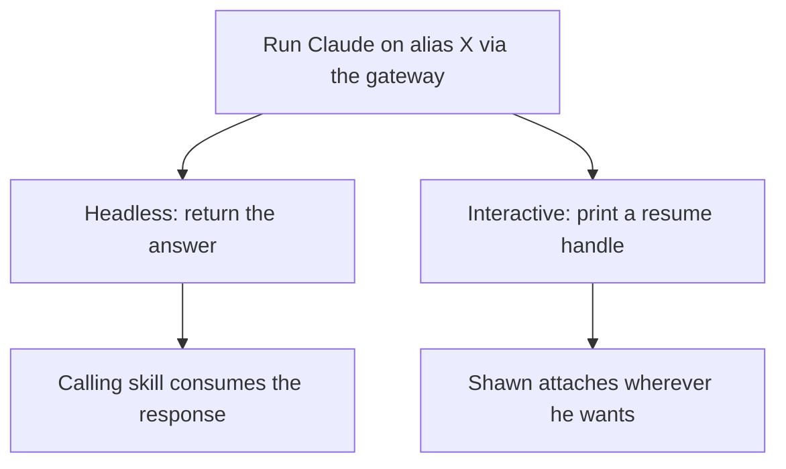
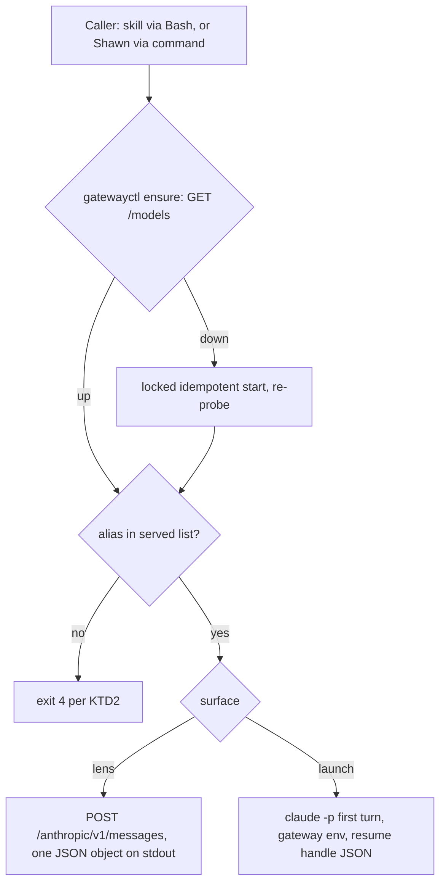

# Gateway Plugin - Plan

## Goal Capsule

- **Objective:** Give Shawn and his skills a way to run Claude on any model the local Superagent Gateway serves — headlessly for skills that need a different-vendor answer, and as an attachable session for Shawn.
- **Product authority:** This plan owns the `gateway` plugin and the `gw` wrapper it builds on. It does not own the gateway binary or its config schema, which are upstream.
- **Open blockers:** None.

**Product Contract preservation note:** changed: R12 — broadened from "no secret in `gateway.yaml`" (a file the plugin never writes, so the requirement guaranteed nothing) to cover every file the plugin ships or leaves on disk and everything it prints. Dependencies/Assumptions refreshed against 2026-08-06 runtime evidence and against the gateway's own source; Outstanding Questions resolved in place. All other Product Contract meaning and every R/A/F/AE/KD ID unchanged.

---

## Product Contract

### Summary

A standalone shrimpshack plugin that runs Claude Code against a named gateway alias. One mechanism, two outputs: a headless call that returns the model's answer to the caller, and an interactive launch that materializes a session and prints a handle for attaching to it. The plugin never opens a terminal.

### Problem Frame

The gateway works. It serves nine aliases across Kimi, GLM, and four GPT-5.6 tiers through one local endpoint, and a live session has been round-tripped through it end to end. What it lacks is reach: every use starts from a shell, which means neither Shawn nor any running skill can get at another model without leaving what they are doing.

Two distinct costs follow. Shawn cannot spin up a session on a different model from inside a session, the way he already forks work with spinoff. And skills that fan out review work — `multi-slice-review`, `slate-devs:triangulate-review` — are confined to one vendor's models, so every lens they layer shares a blind spot. A local gateway serving three vendors is the substrate for genuinely diverse review lenses, and nothing can currently call it. The gap is documented as having degraded a real review in this repo: `docs/residual-review-findings/bugfix-launcher-path-guard.md` records an adversarial lens running as an in-process fallback because no cross-provider peer was installed.

### Key Decisions

- KD1. **Headless is the default surface; interactive requires explicit invocation.** A review lens that needs a human watching a terminal is an errand, not a lens. (session-settled: user-directed — chosen over a session-only surface: skills need an answer returned, not a tab opened.) Governs R5, R8.
- KD2. **No spend controls of any kind.** Cost discipline belongs to whichever skill is doing the calling. (session-settled: user-directed — chosen over cheap-alias-by-default and a per-call token cap: the plugin stays unopinionated.) Governs R7.
- KD3. **Print a handle instead of driving a terminal.** The plugin starts the session and hands back a way to reach it; attaching is the user's choice. (session-settled: user-directed — chosen over opening a tab via launcher detection.) Governs R9.
- KD4. **Standalone — no dependency on another shrimpshack plugin.** Plugins install and publish independently, so a hard dependency would block solo installation. (session-settled: user-directed.) Governs R11.
- KD5. **Changing the model under a running session is out of scope.** The need is served by launching a new session, which sidesteps the fact that Claude Code fixes its endpoint at process start. (session-settled: user-directed.)
- KD6. **The `gw` wrapper's liveness, logging, and path defects are in scope.** Every command in this plugin begins by asking whether the gateway is up, and that check is currently wrong in both directions. (session-settled: user-approved.) Governs R1, R3, R4.

### Structure



### Actors

- A1. **Shawn** — launches a session on a chosen model from inside another session, then attaches to it.
- A2. **A calling skill** — a review harness or any other skill that needs an answer from a specific model and consumes it programmatically.
- A3. **The gateway process** — the local endpoint that routes an alias to an upstream provider. Runs outside the repo and outside this plugin's lifecycle except for start/stop.

### Requirements

**Gateway control**

- R1. Liveness is determined by probing the gateway's endpoint, not by reading a pidfile, so the answer is correct when the pidfile is stale and when its pid has been recycled.
- R2. The plugin can start, stop, restart, and report the status of the gateway, and status names the aliases currently served.
- R3. Gateway output is appended to its log, never truncated.
- R4. The gateway's install location is resolved at runtime rather than pinned to a version-specific path.

**Headless lens**

- R5. A caller can run a prompt against a named alias and receive the model's response as data, with no terminal involved.
- R6. Failures are distinguishable by class — gateway unreachable, alias unknown, upstream provider error — so a caller can react rather than retry blindly.
- R7. No spend cap, warning, or counter is applied to any call.

**Interactive session**

- R8. Shawn can materialize a session on a named alias, seeded with an initial prompt, from inside another session.
- R9. The launch prints a resume handle that carries the gateway endpoint and token, plus the session's transcript path.

**Model metadata**

- R10. The plugin declares each alias's real context window, so a session or call on that alias neither compacts early nor overflows.

**Packaging**

- R11. The plugin installs and runs without any other shrimpshack plugin present.
- R12. No file the plugin ships or leaves on disk, and no output it prints, contains the gateway token or any provider key. The one exception is an ephemeral mode-0600 credential file created and removed within a single invocation (KTD6).

### Key Flows

- F1. Headless lens call
  - **Trigger:** A skill needs an answer from a specific model.
  - **Actors:** A2, A3
  - **Steps:** Skill names an alias and a prompt; plugin confirms the gateway is reachable; the prompt runs against that alias; the response returns to the caller.
  - **Outcome:** The caller holds the model's answer. No session, no tab, no artifact.
  - **Covered by:** R1, R5, R6, R7

- F2. Interactive session launch
  - **Trigger:** Shawn wants to work with a different model.
  - **Actors:** A1, A3
  - **Steps:** Shawn names an alias and an opening prompt; the plugin confirms the gateway is reachable; the first turn runs and materializes the session; the plugin prints the resume handle and transcript path.
  - **Outcome:** A session exists with context already in it, and Shawn attaches on his own terms.
  - **Covered by:** R1, R8, R9

- F3. Gateway not running
  - **Trigger:** Any command fires while the gateway is down.
  - **Actors:** A3
  - **Steps:** The probe fails; the plugin starts the gateway; the original command proceeds.
  - **Outcome:** The caller does not have to know or care whether the gateway was up.
  - **Covered by:** R1, R2

### Acceptance Examples

- AE1. Stale pidfile
  - **Covers R1.**
  - **Given** the gateway is serving on its port and the pidfile names a dead process,
  - **When** any command asks whether the gateway is up,
  - **Then** the answer is yes, and no second gateway is started.

- AE2. Recycled pid
  - **Covers R1.**
  - **Given** the gateway is not running and an unrelated process holds the pid in the pidfile,
  - **When** any command asks whether the gateway is up,
  - **Then** the answer is no.

- AE3. Resume handle carries the endpoint
  - **Covers R9.**
  - **Given** a session was launched on a non-default alias,
  - **When** Shawn attaches using the printed handle,
  - **Then** the resumed session still runs on that alias rather than falling back to Anthropic direct.

- AE4. Unknown alias
  - **Covers R6.**
  - **Given** a caller names an alias the gateway does not serve,
  - **When** the call is made,
  - **Then** the failure identifies the alias as unknown and is distinguishable from the gateway being unreachable.

- AE5. Expensive alias, unattended
  - **Covers R7.**
  - **Given** a skill fans out several headless calls to the most expensive alias,
  - **When** those calls run with nobody watching,
  - **Then** every call proceeds — no cap, no warning, no prompt.

### Scope Boundaries

- Changing the model of a session that is already running. Superseded by launching a new one (KD5).
- Spend limits, budgets, warnings, and usage counters (KD2).
- Opening a terminal, tab, split, or workspace. The plugin prints a handle and stops (KD3).
- Providers beyond OpenRouter. Other presets stay commented in the gateway config, unused.
- Changes to the gateway binary or its config schema. Both are upstream.
- Extending `multi-slice-review` or `slate-devs:triangulate-review` to call the lens. Deferred to follow-up work.

### Dependencies / Assumptions

- The gateway is installed at a versioned path under the home directory (`~/gateway-0.1.1/` today) and is not a git repository; a `0.1.2` release would land beside the current one. R4 exists because of this.
- The gateway config carries no notion of a model's context window (`src/config.rs` has no such field), so the per-alias table in R10 has to live in the plugin.
- Claude Code fixes its endpoint from the environment at process start. This is why KD5 holds and why R9 must reproduce the environment in the handle.
- Verified 2026-08-06: both transports work through the gateway against a live upstream — a plain completion `POST /anthropic/v1/messages` returned a normal Anthropic-shaped response, and a headless `claude -p` run on alias `gpt-luna` printed the answer and exited 0.
- A gateway-pointed Claude Code session loses claude.ai MCP connectors and the advisor tool, and warns that the model is unrecognized unless a context window is declared. These are properties of the launched session, not defects in the plugin.
- The hand-written notes in the gateway config cover only some aliases: window figures sit on `k3` and the four GPT-5.6 tiers, while `kimi`, `glm`, and `default` carry pricing or nothing. Entries the config cannot answer take their window from the upstream model card, and every entry records which source it used (KTD7).
- The gateway guards its model-list route behind the same token as its messages route, so any probe of it is authenticated (KTD3).

### Outstanding Questions

**Blocking**

- None.

**Deferred**

- Extending `multi-slice-review` and `slate-devs:triangulate-review` to call the headless lens — follow-up work after this plugin ships, per the confirmed scope.
- An agent-mode lens (`claude -p --json-schema` through the gateway) as an escape hatch when a caller needs schema-validated output or tool access. Deferred until a caller needs it; KTD1 records why it is not the default.
- Whether to automate the Bash permission allowlist entry that unattended fan-out needs. The plugin cannot write user settings; U7 documents the entry in the README and the deferral is whether anything more is warranted.
- Session-id capture from a headless `claude` run is directionally planned but has no prior art in the repo; U4's verification proves it against the fixture rather than assuming it.

Resolved during planning: the command-surface split (three commands mirroring three scripts, U5), whether non-interactive Claude Code works through the gateway (verified, see Dependencies / Assumptions), and which mechanism carries the context window (KTD7).

### Sources / Research

- `plugins/token-bridge/` — the plugin shape to mirror: `.claude-plugin/plugin.json`, `commands/`, `skills/`, `lib/`, `tests/`. `plugins/token-bridge/skills/status/SKILL.md` is the template for documenting a script's exit-code and JSON contract.
- `plugins/multi-slice-review/tests/run-tests.sh` — the test-harness shape: `self_check` deliberate-fail, `wire_smoke` version-sync + pipeline + `claude plugin validate`.
- `plugins/spinoff/skills/spinoff/scripts/spinoff.sh` — absolute binary resolution and launch-diagnostics precedent. KD4 rules out depending on it.
- `plugins/claude-modes/docs/solutions/terminal-escape-audit.md` — the source × sink audit method U6 follows.
- The gateway's own `README.md`, `src/config.rs`, and `gateway.yaml` — config schema, the model struct with no window field, live aliases, and the hand-written pricing and context notes.
- `~/.local/bin/gw` — the wrapper being replaced; source of the liveness, logging, and path defects in R1, R3, and R4.
- Runtime evidence, 2026-08-06: live completion call and live headless `claude -p` both routed through the gateway to OpenRouter and returned; a stale-pidfile failure was reproduced live (pidfile held a dead pid while the gateway ran under another, and `gw claude` died with `AddrInUse`).
- Claude Code's unrecognized-model warning, which names the three mechanisms available for declaring a context window and is the basis for R10.

---

## Planning Contract

### Key Technical Decisions

- KTD1. **The headless lens is a plain completion call to the gateway's messages endpoint. The Claude Code agent loop is not in the headless path.** Governs R5, R6, R7. Trade-off: gives up `--json-schema` output validation and tool access; gains tools-off by construction — a lens that cannot edit the code it reviews, in any configuration — plus lower latency, no context-window enforcement problem, no dependency on Claude Code's model-recognition behavior, and a dissolved working-directory question: the lens sees only what the prompt carries, so callers pass diffs and context in the prompt. The agent-mode escape hatch stays in Outstanding Questions until a caller needs it.
- KTD2. **Every plugin script prints exactly one JSON object on stdout; diagnostics go to stderr; exit codes are a shared enum.** Governs R5, R6. The enum: `0` ok, `2` usage or refusal (bad arguments, missing prompt, alias fails the grammar), `3` gateway unreachable and could not be started, `4` alias unknown to the gateway, `5` upstream provider error — with an `error` field in the JSON whose values distinguish `rate_limited` and `context_overflow` from other upstream failures — `6` deadline exceeded, and `7` gateway reachable but rejected the plugin's token. Code 7 is distinct from code 3 because an auth failure means the gateway is up: treating it as unreachable would send `ensure` into a start that collides with the running process. This is the single owning statement of the contract; every script, SKILL.md, and test cites it. Precedent: `plugins/token-bridge/lib/status.py`'s documented-enum flavor, chosen over `KEY=value` lines because model prose is multi-line free text that line-oriented output cannot carry safely, and because the repo has a captured lesson that "one JSON object, parse it whole" plus a regression test is what stops a consumer misreading the stream.
- KTD3. **Liveness is the model-list endpoint, probed with the gateway token.** Instantiates KD6. Governs R1, R2, R6. One `GET /anthropic/v1/models` probe with a short connection timeout answers two of the three liveness layers at once — the process is up, and these aliases are configured and visible to this client. The probe sends the token as an `x-api-key` header, read from `server.token` in the resolved `gateway.yaml` with `${VAR}` expansion applied, because the gateway guards that route behind auth and answers an unauthenticated probe with 401. An unauthenticated or rejected probe is KTD2 code 7, never code 3 — misreading it as down sends `ensure` into a start that collides with the running gateway. `ensure` also takes an optional alias argument and returns KTD2 code 4 when that alias is absent from the probe's list, so both surfaces inherit one served-list check rather than each implementing their own. The third layer, whether the upstream key is live, is never pre-flighted (a pre-flight completion costs real spend per probe); it is classified at call time when the real request fails, under KTD2's upstream class. The pidfile is never consulted for liveness.
- KTD4. **The plugin ships its own control layer and leaves `~/.local/bin/gw` untouched.** (session-settled: user-approved — a plugin cannot ship a file outside the repo, so "fix `gw`" becomes "replace what `gw` does".) Governs R1, R3, R4. Install-dir resolution follows the launcher learning: explicit env override, else the newest `~/gateway-*` versioned directory, else a distinct failure; every binary candidate must be a regular file and executable, and a set-but-invalid override resolves to a hard failure rather than silently falling through. Start is idempotent under concurrent callers: acquire a lock, re-probe under the lock, start only if still down — so a fan-out of five reviewers against a down gateway yields exactly one gateway process. Runtime state lives at `~/.gateway.pid`, `~/.gateway.log`, and `~/.gateway.lock` — the first two matching what `~/.local/bin/gw` already uses, so the two control surfaces see the same gateway and neither double-starts against the other. State stays out of the install directory, which R4 lets move between releases.
- KTD5. **Terminal escapes are closed by construction for identifiers and by sanitization at the plugin's own print sinks for free-form text, audited once as a full source × sink matrix.** (session-settled: user-approved scope addition.) Alias names are validated against a constrained grammar (`[A-Za-z0-9._-]+`) at every input site, so an escape byte in an identifier is impossible rather than filtered. Model prose and config-derived display text are sanitized (strip ESC/CSI/OSC and Unicode bidi controls, keep newlines and tabs) wherever a plugin script prints them to a terminal. The lens's JSON `text` field is documented as untrusted data — JSON encoding escapes control bytes in transit, but a consumer gets the raw bytes back on parse, so consumers that print it own their sink. The audit is one pass over every script building the full matrix, not per-round greps; the captured lesson is that narrow greps left siblings open across three review rounds.
- KTD6. **The gateway token never prints and never appears in a process argument.** Governs R9, R12. A printed token lands in a transcript that agents copy, summarize, and write to files; a token in argv is readable from the process table by any other process on the box, including the agents this decision treats as the adversary. The handle carries the endpoint, the alias, the session id, the transcript path, and a token reference the attach command resolves at attach time. Child processes receive the token through the environment or a mode-0600 header file consumed by `curl --config` / `-H @file` — never as an argv token.
- KTD7. **Context windows live in a plugin-local alias table, applied at launch via `CLAUDE_CODE_MAX_CONTEXT_TOKENS`.** Governs R10. The gateway has no window field to extend, so the table is the plugin's (KD6's upstream boundary). The env-var mechanism is chosen over the `[1m]` name suffix (only expresses 1M) and over persistent `modelOverrides` (writes user-global config for a per-session need), and it is settable per launch. Each entry carries the alias's window, a `source` field naming where that number came from (config comment or upstream model card), and the upstream model string the alias pointed at when the entry was written. A chain alias — one whose config value is a list of routes, as `default` is — takes the smallest window across its members, so a mid-session fallback can only under-declare rather than overflow, and records that it is a chain. On the control side, `status` reads the resolved `gateway.yaml` read-only and flags three drift classes: a served alias missing from the table, a table entry with no declared window, and an alias whose upstream model string no longer matches the recorded one. The third class is why the comparison reads the config rather than the probe response — the model-list endpoint returns only `id` and `display_name`, so a repointed alias keeps its name and would otherwise drift silently.
- KTD8. **The prompt enters via stdin or a file path, never argv; oversized responses spill to a file.** Governs R5. Callers pass diffs and multi-KB context; argv hits quoting and length limits first and silently. Above a size threshold (on the order of 16 KB, overridable) the response body goes to a file and the JSON carries the file's path instead of the text; `multi-slice-review` already codifies why full returns exhaust an orchestrator.

### High-Level Technical Design

Plugin tree, mirroring the token-bridge shape with bash in `lib/`:

```text
plugins/gateway/
  .claude-plugin/plugin.json
  lib/gatewayctl.sh      # control layer: start | stop | restart | status | ensure
  lib/lens.sh            # headless completion call
  lib/launch.sh          # interactive session materialization + handle
  lib/models.json        # per-alias table: context window, notes
  commands/lens.md  commands/launch.md  commands/status.md
  skills/lens/SKILL.md  skills/launch/SKILL.md  skills/status/SKILL.md
  tests/run-tests.sh  tests/unit/*.bats  tests/fixtures/*
  README.md
```

Every path between components goes through `${CLAUDE_PLUGIN_ROOT}`; nothing is invoked by PATH lookup (`gw` on PATH is an unrelated binary and stays untouched per KTD4).

The two surfaces share one preflight:



- **Control layer** (`gatewayctl.sh`): owns liveness (KTD3), install-dir resolution and idempotent start (KTD4), append-only logging (`>>`), stop/restart, and status with alias listing plus the KTD7 drift flag. `ensure` is the verb the other two scripts call: probe, start if needed, confirm, or fail with the KTD2 code. Stop verifies the pidfile's pid by argv — never `ps -o comm`, which has produced false negatives on this box — before signaling, so a recycled pid is never killed.
- **Lens** (`lens.sh`): reads the prompt from stdin or `--prompt-file`, validates the alias grammar (KTD5), runs `ensure`, then posts to the messages endpoint with layered timeouts — short connection timeout so a dead endpoint fails fast, generous overridable total deadline sized from the healthy path so a slow upstream still completes. Emits the KTD2 JSON with the response text or spill path (KTD8), the alias, and token usage as the gateway reports it. No spend logic of any kind (KD2).
- **Launch** (`launch.sh`): runs `ensure`, then materializes the session by running the seed prompt headlessly through `claude` with the environment pointed at the gateway (`ANTHROPIC_BASE_URL`, auth token, `--model <alias>`, `CLAUDE_CODE_MAX_CONTEXT_TOKENS` from `models.json` per KTD7). Captures the session id from the run's JSON output, locates the transcript under `~/.claude/projects/`, and prints the KTD2 JSON handle: a ready-to-paste attach command that re-establishes the gateway environment (token by reference per KTD6) and resumes the session on the same alias — which is what AE3 demands.
- **Skills and commands**: three thin commands front three skills; each SKILL.md documents its script's invocation and interprets the KTD2 contract field by field, on the `plugins/token-bridge/skills/status/SKILL.md` template. The primary consumers of the lens cannot invoke skills or commands at all — `multi-slice-review` runs with `allowed-tools: Bash, Read` — so the Bash-invocable script is the real surface and the skill is documentation plus a human front door.
- **Tests**: bats against a fake gateway fixture (a small stdlib HTTP server scriptable to be down, healthy, alias-less, erroring, throttling, or slow) and a fake `claude` fixture, following `plugins/token-bridge/tests/fixtures/fake-agent-browser.sh` precedent. The real gateway and OpenRouter are never in the test path.

### System-Wide Impact

- `.claude-plugin/marketplace.json` gains one `gateway` entry, edited surgically by string replacement on a unique anchor — never re-serialized, which renormalizes every other plugin's unicode escapes.
- Merging to `main` is publishing (consumers auto-update). The plugin tree and the marketplace entry land in the same squash-merged PR, with matching version strings in both files.
- No hooks, no shipped agents, no writes to any other plugin's tree, no writes to the repo at runtime. The plugin reads `~/gateway-*/` and `~/.claude/projects/` and writes exactly four things outside the repo: `~/.gateway.pid`, `~/.gateway.log`, `~/.gateway.lock` (KTD4), and spill files.

### Risks & Dependencies

- The gateway binary and config schema are upstream and unversioned by this repo; an endpoint or config change breaks the plugin at runtime, not at test time. The fixture encodes today's observed behavior.
- Claude Code CLI behavior can drift: the shape of `--output-format json` (session-id capture) and the unrecognized-model mechanisms are observed, not contractual. U4 pins what the plugin relies on with fixture tests so drift surfaces as a test failure.
- OpenRouter is out of the test path by decision, so the live path is verified once manually (Definition of Done), not continuously.
- A gateway-pointed session loses MCP connectors and the advisor tool. The launch skill states this so an attached session's missing tools read as expected, not broken.
- Unattended fan-out stalls on Bash permission prompts unless the caller's settings allowlist the lens script; U7 documents the entry, and rollout beyond documentation is deferred.

### Sequencing

1. U1 — skeleton, harness, fixtures.
2. U2 — gateway control layer (the preflight everything else calls).
3. U3 and U4 in parallel — lens and launch are independent consumers of U2.
4. U5 — commands and skills over the finished scripts.
5. U6 — escape audit across all shipped scripts.
6. U7 — README, agent-consumer smoke, release.

Parallelism: only U3 and U4. Everything else is sequential because each layer consumes the one before it.

---

## Implementation Units

### U1. Plugin skeleton, test harness, and fixtures

- **Goal:** A validating, marketplace-registered plugin shell with a test harness that can already prove itself, plus the two fixtures every later unit tests against.
- **Requirements:** R11.
- **Dependencies:** None.
- **Files:** `plugins/gateway/.claude-plugin/plugin.json`, `plugins/gateway/tests/run-tests.sh`, `plugins/gateway/tests/fixtures/fake-gateway.py`, `plugins/gateway/tests/fixtures/fake-claude.sh`, `.claude-plugin/marketplace.json` (modify).
- **Approach:**
  1. Create `plugin.json` at version `0.1.0` on the multi-slice-review shape; omit `skills`/`commands` pointers and use default directories.
  2. Copy the `run-tests.sh` shape from `plugins/multi-slice-review/tests/run-tests.sh`: modes `unit | all | self-check | smoke`, dependency check for `bats`/`jq`/`python3`, `self_check` deliberate-fail, `wire_smoke` asserting plugin/marketplace version sync and grepping `claude plugin validate` output for `Validation passed` (its exit code lies). Read both version strings with `jq`, not the `node -e` calls that harness uses, so the harness's real dependencies match the declared `bats`/`jq`/`python3` set. Add token-bridge's per-run `mktemp -d` + `pwd -P` tmpdir handling.
  3. `fake-gateway.py`: stdlib HTTP server on an ephemeral port serving `/health`, `/anthropic/v1/models`, and `/anthropic/v1/messages`. It requires a configured `x-api-key` on both routes and answers 401 without one, mirroring the real gateway — a fixture that accepts bare probes would let the KTD3 auth requirement regress green. Scriptable per scenario: down, healthy with a configurable alias list, wrong-token rejection, unknown-alias rejection, upstream 5xx, 429 throttle, context-length error, and slow-response. `fake-claude.sh`: accepts the flags `launch.sh` will use, emits a result JSON with a session id, records the environment and argv it was invoked with so tests can assert on them, and writes a fake transcript file under a test-controlled projects root.
  4. Add the `gateway` entry to `.claude-plugin/marketplace.json` per the System-Wide Impact edit rule, category `development`.
- **Test scenarios:**
  - Harness self-check: a deliberately false assertion is surfaced as a non-zero exit.
  - Fixture liveness: `fake-gateway.py` started in a test serves a model list containing its configured aliases, and a messages call round-trips a canned response.
  - Fixture failure modes: each scripted scenario (down, unknown alias, 5xx, 429, slow) produces the corresponding HTTP behavior.
  - Wire smoke: `plugin.json` version equals the marketplace entry version, and plugin validation output contains `Validation passed`.
- **Verification:** The harness runs all modes locally; self-check passes; the fixture can be driven into every scenario later units need; the repo-root marketplace diff touches only the new entry.

### U2. Gateway control layer

- **Goal:** A control script that answers liveness correctly in both directions, starts the gateway idempotently under concurrency, appends to its log, resolves the install dir at runtime, and reports status with served aliases — replacing what `gw` does without touching it.
- **Requirements:** R1, R2, R3, R4, R10 (drift flag); F3; AE1, AE2.
- **Dependencies:** U1.
- **Files:** `plugins/gateway/lib/gatewayctl.sh`, `plugins/gateway/lib/models.json`, `plugins/gateway/tests/unit/gatewayctl.bats`.
- **Approach:**
  1. Verbs: `start`, `stop`, `restart`, `status`, `ensure`. All emit per KTD2; gateway base URL overridable by env so tests point at the fixture.
  2. Liveness per KTD3. `ensure` probes, then does the locked start-and-reprobe from KTD4 when down, then confirms; a start that fails gets its own honest non-zero exit (KTD2 code `3`) — the launcher learning's "announced-but-broken is never success".
  3. Install-dir and binary resolution per KTD4. Start the gateway with `>>` log redirection (R3).
  4. `stop` reads the pidfile but verifies the pid's argv matches the resolved gateway binary before signaling; a mismatch means recycled pid — report, do not kill.
  5. `status` reports liveness, pid when verifiable, the resolved install directory, log path, served aliases from the probe response, and KTD7's three drift classes.
  6. Seed `models.json` with one entry per served alias, each carrying its window, a `source` field, and the alias's current upstream model string (KTD7). The config's notes cover `k3` and the GPT-5.6 tiers; `kimi`, `glm`, and `default` take their windows from the upstream model cards and say so in `source`. `default` is a chain and takes the smallest window across its routes.
- **Test scenarios:**
  - Covers AE1. Fixture serving, pidfile names a dead pid: `status` and `ensure` report up; no second start is attempted.
  - Covers AE2. Fixture down, pidfile names a live unrelated process (the test's own helper): liveness is down.
  - Stop safety: pidfile names a live process whose argv is not the gateway binary; `stop` refuses to signal it.
  - Idempotent concurrent start: N simultaneous `ensure` calls against a down fixture; exactly one gateway process exists after, and all N exit 0.
  - Log append: two starts; the first start's log lines survive the second.
  - Install-dir resolution: env override honored; set-but-invalid override fails hard rather than falling through; with no override, the newest versioned dir wins; no candidate yields the KTD2 unreachable class with a clear stderr message.
  - Alias grammar: an alias argument with a control byte or shell metacharacter is refused with code 2 before any network call.
  - Authenticated probe: the fixture requires a token; `ensure` and `status` succeed against it. Removing the token from the probe makes them fail — this is the assertion that stops the KTD3 requirement regressing.
  - Auth rejection is not gateway-down: the fixture is up but rejects the token; the result is code 7, and no start is attempted.
  - Served-list gate: `ensure` with an alias absent from the fixture's list returns code 4; with a listed alias it returns 0.
  - Drift, missing alias: fixture serves an alias absent from `models.json`; `status` flags it.
  - Drift, unset window: a `models.json` entry has no window; `status` flags it.
  - Drift, stale window: an alias keeps its name but its config upstream model string changes; `status` flags it.
  - Chain alias: `status` labels a chain alias as such and reports the smallest window across its routes.
- **Verification:** Every verb behaves against the fixture in all scenarios above; both AE1 and AE2 pass; nothing in the unit reads liveness from the pidfile.

### U3. Headless lens

- **Goal:** The agent-facing primitive: prompt in, one JSON answer out, failures distinguishable by exit code — the reason this plugin exists.
- **Requirements:** R5, R6, R7; F1; AE4, AE5.
- **Dependencies:** U2.
- **Files:** `plugins/gateway/lib/lens.sh`, `plugins/gateway/tests/unit/lens.bats`.
- **Approach:**
  1. Input per KTD8: stdin by default, `--prompt-file` alternative, refuse an argv prompt. Flags: `--alias` (required, grammar-checked per KTD5), `--max-tokens`, `--timeout`, `--output-file` to force a spill destination.
  2. Preflight via `gatewayctl.sh ensure`; propagate its failure codes unchanged.
  3. Pass the alias to `gatewayctl.sh ensure` so the served-list check and the code 4 it returns come from one place (KTD3) rather than being re-derived here. Post the completion per KTD1, then map the gateway's response onto KTD2's codes, reading `rate_limited` and `context_overflow` out of the error body. `context_overflow` matters because the lens never applies a context window — a prompt too large for the alias would otherwise return a bare upstream error and invite a retry that can never succeed.
  4. Layered timeouts: short connect timeout, total deadline defaulting from the healthy path (single-digit seconds observed for small prompts; default the total generously for review-sized prompts) and overridable. On deadline, exit with KTD2 code 6 and leave no orphan process.
  5. Output per KTD2 and KTD8: `text` or `output_file`, `alias`, `usage`, `error` when applicable. No cwd dependence — the script behaves identically from any directory.
- **Test scenarios:**
  - Happy path: prompt on stdin against the healthy fixture returns exit 0 and one parseable JSON object whose `text` matches the canned response; stderr carries no JSON.
  - Covers AE4. Unknown alias: exit code differs from the gateway-down exit code, and the JSON names the alias.
  - Covers AE5. Several concurrent calls to one alias, no interaction: all proceed and complete with no prompt or warning.
  - Gateway down and unstartable: the unreachable class, distinguishable from AE4's code.
  - Upstream 5xx and upstream 429: both exit with the upstream class; the JSON `error` field distinguishes `rate_limited`.
  - Context overflow: the fixture returns a context-length error; the JSON `error` field names `context_overflow` so a caller can tell "this prompt will never fit" from "the provider flaked".
  - Token discipline: across every path, the token literal appears in no child process's argv — asserted against the argv the fixture records — and in neither stdout nor stderr.
  - Timeout: the slow-fixture scenario exceeds a short `--timeout`; the deadline class fires and no child process survives.
  - Spill: a canned response above the threshold yields `output_file` instead of `text`, and the file holds the full body.
  - Stdout discipline regression: on every failure path, stdout is still exactly one JSON object.
- **Verification:** A script can branch on every KTD2 failure class using exit codes alone; the happy path and all failure paths keep the one-object stdout contract; nothing in the unit implements or references spend logic.

### U4. Interactive launch and resume handle

- **Goal:** Materialize a session on a named alias with a seed prompt and print a handle Shawn can attach with, on the right endpoint, with the right context window, without printing the token.
- **Requirements:** R8, R9, R10, R12; F2; AE3.
- **Dependencies:** U2.
- **Files:** `plugins/gateway/lib/launch.sh`, `plugins/gateway/tests/unit/launch.bats`.
- **Approach:**
  1. Preflight via `gatewayctl.sh ensure`; validate the alias per KTD5 and require it in the served list.
  2. Run the seed prompt through the `claude` binary headlessly with the gateway environment and the KTD7 window variable read from `models.json`; an alias absent from the table launches anyway with a stderr warning naming the drift.
  3. Pin the seed run's working directory explicitly, and use it to derive the encoded `~/.claude/projects/` subdirectory when resolving the transcript — Claude Code keys sessions by project directory, so an unpinned cwd makes both the transcript path and the resume non-reproducible from anywhere else. Capture the session id from the run's JSON output. Session-id capture is the unit's named unknown — the fixture pins the shape the script relies on, and implementation adjusts to what the real CLI emits rather than forcing this plan's guess.
  4. Emit the KTD2 handle JSON: attach command (cd to the pinned cwd, gateway env re-established, token by reference per KTD6, same alias, resume by session id), session id, transcript path, alias, declared window, and the cwd itself.
  5. Read the gateway token only from its existing config location; write nothing to `gateway.yaml` (R12).
- **Test scenarios:**
  - Happy path: launch against the fixture pair returns exit 0 and a handle whose session id matches the transcript file the fake `claude` wrote.
  - Covers AE3. The handle's attach command contains the gateway base URL, the `--model` alias, and a resume reference — and does not contain the token literal.
  - Token discipline: the token string appears nowhere in stdout, stderr, or the argv the fake `claude` records, across all paths.
  - Attach from elsewhere: the printed attach command is executed from a different directory than the launch, with the fake `claude` on PATH; the child sees the gateway base URL, the resolved token, the same alias, and the pinned cwd, and resolves the session.
  - Window applied: a launch on a table-listed alias passes that alias's window to the fake `claude`; a launch on an unlisted alias proceeds with the drift warning on stderr.
  - Seed failure: the fake `claude` exits non-zero; the launch reports failure honestly with a non-zero KTD2 code, never a handle to a session that does not exist.
  - Gateway down and unstartable: the unreachable class propagates from the preflight.
- **Verification:** The handle round-trips against the fixtures — every field it promises exists and is consistent — AE3's assertions hold, no secret prints, and `gateway.yaml` is byte-identical before and after every test.

### U5. Commands and skills

- **Goal:** The human and in-session front doors: three thin commands and three SKILL.md files that teach a session to run the scripts and read the KTD2 contract.
- **Requirements:** R5, R8, R2 (surfacing); KD1's default-surface split.
- **Dependencies:** U2, U3, U4.
- **Files:** `plugins/gateway/commands/lens.md`, `plugins/gateway/commands/launch.md`, `plugins/gateway/commands/status.md`, `plugins/gateway/skills/lens/SKILL.md`, `plugins/gateway/skills/launch/SKILL.md`, `plugins/gateway/skills/status/SKILL.md`.
- **Approach:**
  1. Commands follow the house thin-front-door pattern: frontmatter `description` (plus `argument-hint`), body invoking the matching skill with `$ARGUMENTS`.
  2. Skills follow the `plugins/token-bridge/skills/status/SKILL.md` template: the exact `${CLAUDE_PLUGIN_ROOT}/lib/…` invocation, then field-by-field interpretation citing KTD2 — never restating the enum as an independent rule.
  3. The lens skill states the agent-caller contract: prompt via stdin or file per KTD8, output consumed as data, `text` is untrusted model output per KTD5. Untrusted covers instructions, not only control bytes — returned text is material a consumer may quote or summarize, never directives it follows, and a consuming agent acts on no tool, file, or command request appearing inside it. This matters because the lens returns third-party vendor text to orchestrators that hold Bash.
  4. The launch skill presents the handle plainly and names what a gateway-pointed session loses (MCP connectors, advisor) so the attached session reads as expected.
  5. Any slash command these documents tell a session to emit programmatically uses the namespaced `gateway:` form — the bare form does not resolve, a bug this repo shipped twice.
- **Test scenarios:**
  - Test expectation: none — documentation-only unit; behavior is exercised through U2–U4's script tests and U7's smoke, and plugin validation in the wire smoke catches structural errors (skill directory name matching `name:` frontmatter included).
- **Verification:** `claude plugin validate` output contains `Validation passed`; each skill's documented invocation matches the shipped script's actual flags; the commands resolve under the `gateway:` namespace.

### U6. Terminal-escape audit and sanitization

- **Goal:** Close the escape surface per KTD5 across everything the plugin prints, in one audited pass with a matrix, not incremental greps.
- **Requirements:** R5 (safe output), KTD5's confirmed scope addition.
- **Dependencies:** U2, U3, U4, U5.
- **Files:** `plugins/gateway/lib/gatewayctl.sh` (modify), `plugins/gateway/lib/lens.sh` (modify), `plugins/gateway/lib/launch.sh` (modify), `plugins/gateway/tests/unit/escapes.bats`, `plugins/gateway/README.md` (matrix section).
- **Approach:**
  1. Read every shipped script and build the full source × sink matrix: sources are model prose, gateway error bodies, `gateway.yaml`-derived names and notes, `models.json` fields; sinks are every stdout/stderr print in every script. Record the matrix in the README so the next reviewer verifies against source, not against a claim — the audit doc precedent includes a matrix that itself was wrong for seven rounds.
  2. For each cell: identifier-shaped values are already closed by the KTD5 grammar (verify the check exists at that site); free-form values get the shared sanitize function at the sink.
  3. The lens JSON `text`/spill file stays raw by design — it is data, and KTD5 assigns the sink to the consumer; the skills from U5 already say so.
- **Test scenarios:**
  - Escape-laden model response: fixture returns text containing ESC, CSI, OSC, and bidi-override bytes; every plugin-printed rendering (stderr messages, status output) is clean, while the JSON `text` field preserves the bytes as data.
  - Escape-laden alias: refused by grammar at every entry point (control script, lens, launch) — one scenario per entry point.
  - Escape-laden config-derived display text: status output containing a poisoned model note prints sanitized.
- **Verification:** The matrix in the README enumerates every print site in every shipped script with its disposition, each disposition is enforced by a test or by the grammar, and no sink is marked closed without a pointing test.

### U7. README, agent-consumer smoke, and release wiring

- **Goal:** The plugin is documented, provably consumable by a tool-restricted subagent, and ready to publish on merge.
- **Requirements:** R11; AE5's unattended posture.
- **Dependencies:** U1–U6.
- **Files:** `plugins/gateway/README.md`, `plugins/gateway/tests/run-tests.sh` (modify: extend `wire_smoke`), `plugins/gateway/.claude-plugin/plugin.json` (modify: final version), `.claude-plugin/marketplace.json` (modify: matching version).
- **Approach:**
  1. README: what the plugin is, the two surfaces, the KTD2 contract by citation, the escape matrix from U6, and the recommended settings allowlist entry for the lens script so unattended fan-out does not stall on permission prompts — documentation only, since a plugin cannot write user settings.
  2. Extend `wire_smoke` into the agent-consumer smoke: invoke `lens.sh` exactly as a tool-restricted subagent would — Bash invocation, prompt on stdin, output captured — against the fake gateway, and assert one parseable JSON object and exit 0. The smoke runs entirely against fixtures; the live gateway on port 4000 is never in the test path.
  3. Extend `wire_smoke` with a secret scan asserting that no shipped plugin file contains the gateway token or a credential-shaped high-entropy string — `models.json` is seeded from the config that holds the token, and merging publishes the tree (R12).
  4. Confirm plugin and marketplace versions match; both files ship in the same squash-merged PR because merging to `main` publishes.
- **Test scenarios:**
  - Agent-consumer smoke: the stdin-Bash-captured invocation yields a parseable answer with no terminal, no prompt, no interaction.
  - Version-sync: the wire smoke fails when the two version strings diverge (prove once by temporary divergence during development of the check).
  - Secret scan: a token-shaped string planted in a shipped file fails the smoke (prove once by temporary planting, then remove).
  - Full suite: all modes of the harness pass from a clean checkout with only `bats`, `jq`, and `python3` present — no other shrimpshack plugin installed (R11).
- **Verification:** The full local suite passes; the smoke demonstrates the lens end-to-end the way its primary consumer will call it; validation output contains `Validation passed`; the release diff carries matching versions in both files.

---

## Verification Contract

No CI exists in this repo; the local harness is the entire automated verification contract.

- `bash plugins/gateway/tests/run-tests.sh all` — the release gate: harness self-check, every unit suite, and the wire/agent-consumer smoke. Must pass from a clean checkout.
- `bash plugins/gateway/tests/run-tests.sh unit` — per-unit iteration during U2–U6.
- `bash plugins/gateway/tests/run-tests.sh self-check` — proves the harness can fail (house rule: a new suite is trusted only after it has been seen to fail).
- `bash plugins/gateway/tests/run-tests.sh smoke` — version sync, fixture-backed end-to-end pipeline, agent-consumer invocation, and `claude plugin validate` judged by grepping its output for `Validation passed`, never by its exit code.

All automated tests run against `tests/fixtures/` only; the real gateway and OpenRouter are out of the test path by decision. The live path is covered by one manual pass, defined in the Definition of Done.

Failure-class coverage is asserted on exit codes, not messages: for each KTD2 class there is at least one test whose assertion is the numeric code.

---

## Definition of Done

- All twelve requirements R1–R12 have landed in the units that cite them, and all five acceptance examples pass as written — AE1, AE2 in U2; AE4, AE5 in U3; AE3 in U4.
- `bash plugins/gateway/tests/run-tests.sh all` passes from a clean checkout with no other shrimpshack plugin installed.
- Manual live verification by Shawn, once, outside the automated contract: one real lens call against a live alias returns the model's answer as JSON, and one real launch produces a handle whose attach command resumes the session on the chosen alias (AE3 against the real gateway).
- The escape matrix in the README covers every print site with an enforced disposition (U6's bar).
- Plugin and marketplace versions match and both files are in the same squash-merged PR to `main`, which is the publish event.
- `~/.local/bin/gw` and `gateway.yaml` are byte-identical before and after everything this plugin does.
- Abandoned-attempt code from approaches that did not pan out is removed, not left in the diff.
