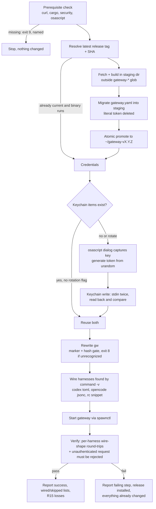
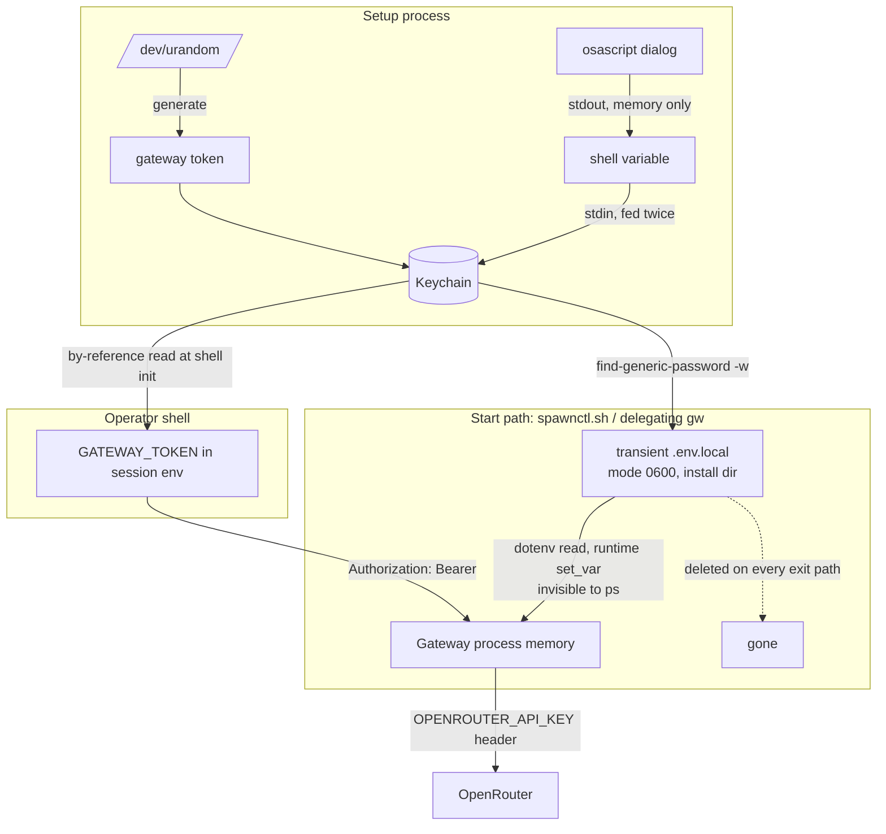

# Gateway Setup - Plan

## Goal Capsule

- **Objective:** One command takes a Mac from nothing to a working gateway-backed agent session — the gateway acquired and running, credentials captured into Keychain, Claude Code / Codex / opencode wired, and a real model round-trip proving it before success is reported.
- **Product authority:** This plan owns the setup path. It does not own the gateway's own behavior, config schema, or routes — those are upstream in `superagent-ai/gateway`. It does not own the runtime behavior of the existing `launch` / `status` / `lens` commands, which are covered by `docs/plans/2026-08-06-001-feat-gateway-plugin-plan.md`.
- **Open blockers:** None.

---

## Product Contract

Product Contract preservation — two rounds, both recorded:

1. R5 and R7 were reworded because verification this session showed exec-time environment injection is readable by any same-user process via `ps -Eww` — both now describe the transient mode-0600 delivery-file mechanism (R7 carries the mechanism; R5 gained a cross-cite to R7 in place of its blanket "never written to a file"; no other qualifier was dropped).
2. Cross-model document review then changed four requirements. **R7** gained the unset clause: an inherited `OPENROUTER_API_KEY` would otherwise ride into the gateway's exec-time environment, which R7's own first sentence forbids. **R8 narrowed** — a process cannot modify its parent's environment, so its former promise about "the operator's shell session" was unachievable; the current-shell half split out as new **R24**. **R11** now fails rather than skips when an installed harness cannot be wired. **R16** narrowed to what setup can actually prove, with new **R25** carrying per-harness config validation.

No `Governs`/`Covers` citation needed re-pointing: KD3 still governs R7 and R8, and R24/R25 are new IDs rather than splits of a cited one. AE2 and AE4 were updated in place to match R7 and R11.

### Summary

Add a `/spawn:setup` command, backed by `lib/setup.sh`, that acquires and builds the gateway, captures an OpenRouter key into the macOS Keychain, generates its own gateway token, wires whichever agent harnesses are present, and verifies the whole path with a live completion call before claiming success.

### Problem Frame

The gateway plugin assumes a gateway already serving on `127.0.0.1:4000` with a config that already holds a token. Nothing in the repo gets a machine to that state — no setup command, skill, or script exists.

What filled the gap was a hand-written `~/.local/bin/gw` wrapper with a short, word-shaped auth token as a literal on line 17, passed to `curl` in argv on line 43. That token also reached `docs/handoff.md` in a public repo by the most ordinary route available: someone writing down how to test the thing. It was never committed, and it has since been replaced with a variable reference. It got there anyway.

The cost shape is not "a secret leaked once." It is that every path to a working gateway currently runs through a human handling a credential by hand — typing it, pasting it, writing it into a note so the next person can reproduce the test. The plugin's own secret scan could not see the leak because it was scoped one directory away, and no entropy or prefix heuristic would have flagged a 15-character word-shaped string either. A process that asks a person to place a secret produces this outcome on a long enough timeline.

Two properties of the gateway raise the stakes. Its auth check returns success immediately when the token list is empty (upstream `src/http.rs:65-68` at v0.1.1) — a gateway configured without a token is not locked down, it is an open proxy to a paid account, reachable by anything on the box. And the plugin's config expander resolves an unset variable to an empty string (`plugins/spawn/lib/common.sh`) while the gateway's own expander hard-errors on the same input (upstream `src/schema.rs:845-847`), so plugin-side tooling can report a healthy-looking credential for a config the gateway would refuse to boot on.

### Key Decisions

- KD1. **Setup owns the whole path, including acquiring the gateway binary.** (session-settled: user-directed — chosen over credential-and-config only: one command should take a bare machine to a working session rather than assuming the hardest prerequisite.) Governs R1, R2, R3, R4.
- KD2. **Both secrets live in the macOS Keychain; neither is written to disk.** (session-settled: user-directed — chosen over a mode-0600 env file and over splitting the two secrets across stores: one mechanism, nothing sensitive at rest, and no plaintext riding into Time Machine or dotfile backups.) Governs R5, R6.
- KD3. **The two secrets have different blast radii and are handled differently in flight.** The OpenRouter key reaches only the gateway process. The gateway token, worthless off `127.0.0.1:4000` and cheap to replace, reaches the shell session so harnesses launched directly still authenticate. (session-settled: user-directed — chosen over wrapper-injecting both, which breaks bare `codex`, and over session-exporting both, which puts the money-bearing key in every process the user starts.) Governs R7, R8.
- KD4. **Setup generates the gateway token rather than asking for one.** A value no human types has no shell history, no paste buffer, and no reason to be written into a note. Governs R6.
- KD5. **The gateway token is delivered by environment variable, not by a config-file reference.** The gateway merges a `GATEWAY_TOKEN` environment variable into its auth list at startup (upstream `src/main.rs:54-56`), so no `${...}` reference needs to be written into a config file at all. Governs R8, R10.
- KD6. **Setup tracks the latest published release rather than a version this plugin pins.** (session-settled: user-directed — chosen over pinning: upstream fixes arrive without plugin churn. The accepted cost is that an upstream change can break setup, which R16 catches at setup time rather than silently.) Governs R1, R2.
- KD7. **The gateway source is fetched, never redistributed.** `superagent-ai/gateway` publishes no license, so copying its source into this repo is not available regardless of convenience. Governs R1.
- KD8. **Setup rewrites the existing `gw` wrapper rather than retiring it.** (session-settled: user-directed — chosen over replacing it with a plugin-owned launcher: the wrapper's command surface is in muscle memory and its shared pidfile is a deliberate coupling.) Governs R19, R20.
- KD9. **Setup lives as one self-sufficient command plus `lib/setup.sh`, and ships no same-named skill.** (session-settled: user-directed — chosen over a standalone `install.sh`: a script outside the plugin cannot reuse `plugins/spawn/lib/common.sh` and would grow a second config parser. A second parser has already caused one defect in this plugin.) A command and a skill sharing a name collide, and the command wins — proven on the installed plugin, so the existing `SKILL.md` files never load. `docs/plans/2026-08-07-001-feat-spawn-surfaces-plan.md` KD1 settles the rule that command names diverge from skill names; a `setup` command beside a `setup` skill is exactly the shape that rule forbids. Setup therefore states its own contract in `commands/setup.md` and instructs no caller to reach another surface. Governs R17, R26.
- KD10. **Success is proven by a live model round-trip, never by writing files.** The plugin's own expander disagrees with the gateway's on unset variables, so plugin-side parsing cannot establish that a credential works. Governs R16, R17.
- KD11. **Solo macOS is the supported environment.** (session-settled: user-directed — chosen over designing for public marketplace distribution: Keychain is a floor rather than an optional upgrade, and no portable secret backend is built.) Governs R5, R6.
- KD12. **Stored credentials are reused by default; replacing either one is opt-in.** (session-settled: user-directed — chosen over rotating the gateway token on every run: re-runs are routine under KD6's unpinned upstream, and a re-run that silently breaks every open shell trains the operator not to re-run.) Governs R21, R22.

### Actors

- A1. Operator — the person running setup on their own Mac.
- A2. Setup — the `/spawn:setup` command and `lib/setup.sh`.
- A3. Gateway process — the running gateway, the only holder of the OpenRouter key.
- A4. Agent harnesses — Claude Code, Codex, opencode.
- A5. Keychain — the macOS credential store.

### Requirements

**Acquiring and building the gateway**

- R1. Setup obtains the gateway by fetching the latest published release of `superagent-ai/gateway` and building it from source. No gateway source is committed to this repository.
- R2. Setup unpacks each release into its own version-named directory so the plugin's existing highest-version install-dir resolution continues to select correctly.
- R3. Setup skips fetching and building when the resolved install already matches the latest release and its binary runs.
- R4. When a build prerequisite is missing, setup stops and names the missing prerequisite rather than proceeding to later steps.

**Credential handling**

- R5. Setup captures the OpenRouter API key without echoing it and stores it in the Keychain. The key is never passed as a command argument, never reproduced in output or error text, and never written to any file other than the start-time delivery file R7 defines.
- R6. Setup generates the gateway token itself. The operator never types, pastes, or is asked to record a token value.
- R7. The OpenRouter key reaches the gateway process and no other, through a mode-0600 delivery file that exists only for the duration of gateway startup and is removed on every exit path. The key is never placed in any process's exec-time environment and never exported into the operator's shell.
- R8. Shells started after setup resolve the gateway token automatically, so harnesses launched directly in them authenticate with no wrapper.
- R24. Setup cannot change the environment of the shell that invoked it, so it prints the single activation line for that shell and states that later shells need nothing.
- R9. Setup never leaves the gateway configured with an empty auth token list.
- R10. Every file setup writes passes the secret scan in `plugins/spawn/tests/run-tests.sh` in a clean checkout.

**Wiring the agent harnesses**

- R11. Setup wires every supported harness it finds installed. An installed harness it cannot wire is a setup failure, not a skip; `skipped` is reserved for harnesses that are not installed.
- R12. Emitted harness config references the credential by environment-variable name. No config file setup writes contains a credential value.
- R13. The opencode config uses the Anthropic-shaped provider path against the gateway's `/anthropic` routes, not the OpenAI-compatible provider that opencode's documentation suggests by default.
- R14. Setup declares each alias's context and output window to harnesses that need them, sourced from `plugins/spawn/lib/models.json` rather than hand-entered.
- R15. Setup states what a gateway-pointed session loses before the operator discovers it mid-task.

**Proving it works**

- R16. Setup does not report success until a live completion round-trip through the gateway has succeeded in each wired harness's wire shape.
- R17. Verification exercises the gateway's HTTP surface directly. Setup does not treat its own config parsing as evidence that a credential is valid.
- R25. Every config setup writes is validated by the owning harness's own loader before success is reported, and setup states which harnesses that check cannot fully cover.
- R26. Setup's command is complete on its own. It carries its own exit-code meanings and consent handling, shares its name with no skill, and instructs no caller to invoke another surface.
- R27. Every plugin command that authenticates to the gateway resolves its token from the stored credential when the config carries none, so the post-setup steady state works for `status`, `lens` and `launch` and not only for `start`.
- R18. On failure, setup names the step that failed and what it had already changed, so the operator knows the machine's state.

**Re-running and coexisting**

- R19. Setup rewrites `~/.local/bin/gw` to source both secrets from the Keychain, preserving its existing command surface and its shared pidfile.
- R20. Setup does not overwrite a `gw` whose contents it does not recognize without confirmation.
- R21. Re-running setup on a configured machine is safe and reuses the stored OpenRouter key unless the operator asks to replace it.
- R22. Setup reuses the stored gateway token on a re-run and rotates it only when explicitly asked. Rotation states, before it happens, that authentication breaks in every already-open shell.
- R23. Setup retires the hardcoded token currently living in `~/.local/bin/gw` rather than carrying it forward.

### Key Flows

- F1. First run on a machine with no gateway
  - **Trigger:** A1 runs `/spawn:setup` with no gateway installed.
  - **Actors:** A1, A2, A3, A4, A5
  - **Steps:** A2 checks prerequisites and stops if any are missing. A2 fetches the latest release, unpacks it to a version-named directory, and builds it. A2 prompts A1 for the OpenRouter key without echo and stores it in A5. A2 generates a gateway token and stores it in A5. A2 rewrites `gw`. A2 detects which of A4 are installed and writes their config. A2 starts A3 and runs a live completion through each wired harness.
  - **Outcome:** A working session, or a named failure with the machine's state reported.
  - **Covered by:** R1, R2, R4, R5, R6, R7, R8, R11, R16, R18, R19

- F2. Re-run on a configured machine
  - **Trigger:** A1 runs `/spawn:setup` again, typically after an upstream release.
  - **Actors:** A1, A2, A3, A5
  - **Steps:** A2 compares the resolved install against the latest release and rebuilds only on a difference. A2 reuses the stored OpenRouter key without prompting. A2 re-verifies the round-trip.
  - **Outcome:** Either an unchanged working setup, or an upgraded one proven by the same round-trip.
  - **Covered by:** R3, R16, R21

- F3. Upstream release breaks the setup path
  - **Trigger:** A newer gateway release changes a route or config shape R11's emitted config depends on.
  - **Actors:** A1, A2, A3
  - **Steps:** A2 fetches and builds the new release. Verification fails at the round-trip. A2 names the failing step and the release it just installed.
  - **Outcome:** A1 learns at setup time which release broke, rather than discovering it mid-session.
  - **Covered by:** R16, R18

### Acceptance Examples

- AE1. **Covers R9.** Given setup is configuring the gateway, when it would produce a config whose auth token list is empty, then setup treats that as a failure and does not start or report success — an unauthenticated gateway is an open proxy, not a convenience.
- AE2. **Covers R7.** Given a configured machine, when the operator inspects their own shell environment, then the OpenRouter key is absent and only the gateway token is present.
- AE3. **Covers R16, R17.** Given setup has written every config file correctly but the stored credential is wrong, then setup reports failure — writing files is not evidence, and the plugin's own parser would resolve the unset case to an empty string rather than an error.
- AE4. **Covers R11.** Given a machine with Claude Code and opencode installed but not Codex, when setup runs, then it wires two harnesses, verifies two round-trips, and names Codex as skipped rather than silently omitting it.
- AE5. **Covers R18.** Given the build succeeds and the credential is stored but the round-trip fails, then setup reports which step failed and that the gateway is installed and the key is stored, so the operator can re-run without redoing that work.
- AE6. **Covers R20.** Given `~/.local/bin/gw` has been hand-edited since setup last wrote it, when setup runs again, then it asks before overwriting rather than discarding the operator's changes.
- AE7. **Covers R5.** Given the OpenRouter key is rejected by the provider, when setup surfaces the error, then the error text does not contain the key.
- AE8. **Covers R21, R22.** Given a configured machine, when setup is re-run without asking for rotation, then both stored credentials are reused and shells that were already open keep authenticating. When rotation is asked for, setup states that open shells will stop authenticating before it replaces the token.
- AE9. **Covers R7.** Given `OPENROUTER_API_KEY` is already exported in the shell that starts the gateway, when the gateway is launched, then it does not inherit that value — the start path clears it so the Keychain-derived delivery file is what the gateway reads, and says the inherited value was ignored.
- AE10. **Covers R11.** Given opencode is installed but its existing config cannot be loaded, when setup runs, then setup fails naming opencode and the reason, leaves the file byte-identical, and does not report success with opencode marked skipped.
- AE11. **Covers R24.** Given a first run in a fresh terminal, when setup finishes, then it prints the one activation line for that terminal and states that terminals opened later need nothing — and a harness launched in that same terminal without activating fails on authentication rather than appearing to work.

### Scope Boundaries

- Vendoring or redistributing the gateway source. It publishes no license.
- Adding routes to the gateway. All three harnesses work against the routes it already serves, so no gateway change is needed.
- Linux, or any secret store other than the macOS Keychain.
- Creating or managing the OpenRouter account and its keys. Setup captures a key the operator already has.
- Changing the runtime behavior of the existing `launch`, `status`, and `lens` commands beyond what credential sourcing requires.

#### Deferred to Follow-Up Work

- `plugins/spawn/lib/models.json` and `gateway.yaml`'s `models:` block duplicate the alias list. That predates this work and stays as-is; note that R14's window emission makes the duplication load-bearing, so a future consolidation must keep `models.json` authoritative for windows.
- Closing the Keychain's same-user read hole with a code-signed reader binary plus a partition list (KTD9 documents the limitation instead).

### Dependencies / Assumptions

- The gateway's `GATEWAY_TOKEN` environment variable merges into its auth token list at startup (upstream `src/main.rs:54-56`), verified against the v0.1.1 source. A future release that drops this would force the token back into a config-file reference. The merge is a push, not a substitution — a literal token already in `gateway.yaml` stays valid until the file is edited, which is why KTD3 exists.
- The gateway auto-loads `./.env.local` then `./.env` relative to its CWD and assigns values via runtime `set_var`, setting only variables that are currently unset (upstream `src/main.rs:26-45`). Runtime-assigned values are invisible to `ps` (verified); process env wins over the file.
- `do_start_locked` already runs the gateway with the install directory as CWD (`plugins/spawn/lib/spawnctl.sh`), so the CWD-relative dotenv load needs no start-path restructuring.
- The gateway's config expander hard-errors on an unset variable reference, while `plugins/spawn/lib/common.sh` resolves the same input to an empty string. This divergence is why R17 exists; it is not fixed by this plan.
- `CLAUDE_CODE_MAX_CONTEXT_TOKENS` applies directly to unrecognized model names only on Claude Code v2.1.193 and later. `CLAUDE_CODE_MAX_OUTPUT_TOKENS` defaults to 32000 for gateway-style model names, which R14 must account for alongside the context window.
- Codex posts to a `/responses/compact` path during auto-compaction that the gateway does not serve. Whether this degrades gracefully is unverified; it is an upstream gap this plan surfaces rather than closes.
- The token currently in `~/.local/bin/gw` has been read into at least one agent transcript. R23 treats its replacement as remediation, not hygiene.
- Building requires a Rust toolchain. Upstream ships no prebuilt binaries, only source archives, and GitHub source tarballs are generated on demand and not byte-stable — a checksum cannot be pinned, only the tag and its commit SHA.
- Depends on the plugin rename in `21f4d56`, merged under this branch. The plugin is `spawn`; the process it controls is still the gateway. `GATEWAY_TOKEN` and `GATEWAY_BIND` are the gateway binary's own names and were deliberately not renamed; `~/gateway-*` install directories and the shared `~/.gateway.pid` / `.log` / `.lock` values are likewise unchanged.
- Aligns with `docs/plans/2026-08-07-001-feat-spawn-surfaces-plan.md` KD1 — command names diverge from skill names — which is why KD9 ships setup as a command with no same-named skill. That plan is `requirements-only` with four blocking open questions, so this plan consumes its settled naming rule and depends on none of its implementation.
- The two plans touch different surfaces of one plugin and will land close together. That plan re-cuts `lens`/`launch`/`status` into `agent`/`bg-agent`/`session`; this one adds `setup`. Neither renames the other's files, but both edit `README.md`, `plugin.json` and `.claude-plugin/marketplace.json`, so whichever lands second rebases and re-checks the version-parity gate.

### Outstanding Questions

**Resolved in this plan's Planning Contract**

- How setup detects a `gw` it previously wrote → KTD11 (marker plus content hash).
- How harnesses are detected → KTD12 (executable lookup).
- How the live round-trip is performed per harness → KTD13 (two layers: wire-shape probe plus KTD20 config validation).
- Whether each harness exposes a non-interactive config validator → KTD20 (opencode does and it is used; Codex does not, and the `doctor --json` check plus its named gap is the substitute).
- Whether first-run success covers the invoking shell → R24 (it does not; setup prints the activation line and says so).

**Open — carried, not blocking**

- Whether Codex's `/responses/compact` 404 degrades gracefully or breaks long sessions. Unverified upstream gap; setup surfaces it in the R15 losses list rather than fixing it.
- Behavior on a locked login keychain — a read may raise a GUI unlock prompt and block a non-interactive caller. The live smoke run (gate G4) probes this before the work is called done.
- Whether `codex doctor` performs auth or network I/O that fails on a machine with no Codex credentials. Source-inferred only, since Codex is not installed here; U6's fixture pins the intended behavior and G4 confirms it on a machine that has Codex.
- **Unowned across two plans: the stable allowlist entry point.** `docs/plans/2026-08-07-001-feat-spawn-surfaces-plan.md` R16 requires a narrowly-scoped path a user can allowlist that survives a version upgrade, and records that its owner is "either the install flow owned by `feature/gateway-setup` or by this plan claiming that one slice — settled at planning, and it is a single owner either way." Both plans are now at planning and neither has claimed it. This plan does not claim it, so it stays open by name rather than by omission. It blocks no unit here.

### Sources / Research

- `docs/plans/2026-08-06-001-feat-gateway-plugin-plan.md` — the plugin's own requirements and its statement that it does not own the gateway binary or config schema.
- `docs/residual-review-findings/feature-gateway-plugin.md` — open review findings on the branch this work builds on.
- `plugins/spawn/lib/common.sh`, `plugins/spawn/lib/spawnctl.sh` — the config expander, curl-config escaper, mode-0600 credential builder, and install-dir resolution to reuse rather than re-derive.
- `plugins/spawn/lib/models.json` — nine aliases with context windows and provenance, the source for R14.
- `plugins/spawn/tests/run-tests.sh` — the secret scan any generated config must pass, including its credential-prefix layer that fails on any hit without git triage.
- `plugins/spawn/skills/launch/SKILL.md` — what a gateway-pointed session loses, the source for R15.
- [Claude Code environment variables](https://code.claude.com/docs/en/env-vars) and [LLM gateway protocol](https://code.claude.com/docs/en/llm-gateway-protocol).
- [Codex configuration reference](https://learn.chatgpt.com/docs/config-file/config-reference) — `model_providers`, `base_url`, `env_key`; `wire_api` accepts only `responses`.
- [opencode providers](https://github.com/sst/opencode/blob/dev/packages/web/src/content/docs/providers.mdx) — custom provider schema, and the package choice that determines which wire protocol is used.

---

## Planning Contract

### Key Technical Decisions

- KTD1. **The OpenRouter key travels Keychain → transient delivery file → gateway memory.** Immediately before exec, the start path writes a mode-0600 `.env.local` in the install directory holding `OPENROUTER_API_KEY` and `GATEWAY_TOKEN`, starts the gateway, and deletes the file on every exit path behind the existing trap discipline. (session-settled: user-directed — chosen over exec-time env injection, which any same-user process reads via `ps -Eww` (verified this session), and over a permanent plaintext env file, which has no encryption at rest and rides into backups.) The gateway loads the file CWD-relative and assigns values with runtime `set_var` (upstream `src/main.rs:26-45`), which is invisible to `ps` (verified); `do_start_locked` already sets the CWD (`plugins/spawn/lib/spawnctl.sh`). The file is in-flight delivery during startup, not storage at rest, so KD2's rule holds: nothing sensitive rests on disk. Governs R5, R7; instantiates KD2 and KD3.
- KTD2. **The key is captured through a macOS password dialog: `osascript` with a hidden answer, value returned on stdout.** (session-settled: user-directed — chosen over reading `/dev/tty` and over asking the operator to run a command themselves: every `lib/*.sh` is non-interactive by construction, the Bash tool provides no TTY, and `AskUserQuestion` would put the key in the transcript, which R5 forbids.) The value moves dialog → shell variable → Keychain, touching no argv and no file. Accepts the macOS-only constraint KD11 already made. Governs R5.
- KTD3. **Setup is the sanctioned writer of `gateway.yaml`; the no-write lint's stated scope narrows from "repo-wide" to "runtime scripts".** (session-settled: user-directed — forced, not preferred: `GATEWAY_TOKEN` is pushed onto the auth list rather than substituted (upstream `src/main.rs:54-56`), so the literal token in the live config stays valid until deleted from the file, and R23 is unreachable without a config edit.) The `config_write_lint` assertions over `launch.sh`, `lens.sh` and `spawnctl.sh` stay; `setup.sh` is exempted by name in the lint's comment and self-test, never by accident. Governs R9, R23.
- KTD4. **Fetch and build happen in a staging directory outside the `gateway-*` glob, then move in atomically.** (session-settled: user-directed — forced by `resolve_install_dir` (`plugins/spawn/lib/spawnctl.sh`) having no fallback past the newest version directory: a half-built newest directory bricks every concurrent `status`/`lens`/`launch` with exit 3, and a directory holding a binary but no config makes the probe read an empty token and misreport exit 7.) Promotion is refused unless staging holds both the binary and the config. Governs R2, R3.
- KTD5. **Rotation is first-class, and the two secrets rotate on different paths.** Rotating the OpenRouter key re-prompts through the KTD2 dialog, updates the Keychain item in place, and restarts the gateway. Rotating the gateway token regenerates it, restarts, and warns first that already-open shells stop authenticating. A plain re-run reuses both without prompting. (session-settled: user-directed.) Governs R21, R22; instantiates KD12.
- KTD6. **Implementation rebases onto `origin/feature/gateway-plugin` before anything else.** (session-settled: user-directed — that branch is 9 commits ahead of this worktree's base and those commits add the lints setup must satisfy, including the extended `config_write_lint` and terminal-sink coverage.) Sequencing constraint; owns no requirement.
- KTD7. **The five shipped statements that the plugin "leaves `gw` untouched" are corrected in the same change that rewrites `gw`.** (session-settled: user-directed — not optional cleanup: rewriting `gw` makes shipped text false.) The files: `plugins/spawn/.claude-plugin/plugin.json` (description), `plugins/spawn/README.md`, and one line each in `plugins/spawn/skills/launch/SKILL.md`, `skills/status/SKILL.md`, `skills/lens/SKILL.md`. Governs R19.
- KTD8. **Every external entry point sits behind a `SPAWN_*_BIN` env seam, and the live round-trip is the one thing no fake covers.** (session-settled: user-directed — the agreed test scope: `curl`, `cargo`, `security` and `osascript` are all fakeable behind seams following the `SPAWN_CLAUDE_BIN` precedent (`plugins/spawn/lib/launch.sh`); the live completion is not fakeable and is proven by the smoke path only.) Owns the fakery story for every unit below.
- KTD9. **The Keychain's limitation is documented, not solved.** (session-settled: user-directed.) The default ACL authenticates the binary `/usr/bin/security`, not the caller, so any same-user process reads the secret silently — roughly a mode-0600 file against same-user agents. Its real wins are encryption at rest, protection while the keychain is locked, cross-user isolation, and staying out of dotfile backups. A code-signed reader binary plus a partition list would close the hole and is out of scope. Setup's docs state this plainly.
- KTD10. **Keychain writes feed the secret twice on stdin to a trailing bare `-w`, and every write is read back and byte-compared.** `-w <value>` puts the secret in argv (verified via `ps -o args=`), and bare `-w` with insufficient stdin stores an empty password while exiting 0 (verified) — exit status is worthless, so read-back comparison is the only proof of a write. Reads use `find-generic-password -w`; `-g` is forbidden because it prints the value to stderr. Deletes loop until exit 44 because duplicate items are possible. Governs R5, R6.
- KTD11. **Setup recognizes its own `gw` by a marker line plus a hash of the file body.** The generator embeds a marker comment and a content hash; marker present with matching hash → rewrite freely; marker with mismatched hash (hand-edited) or no marker at all → operator confirmation required before overwrite. The current wrapper carries no marker, so the first run takes the confirmation path exactly once. Governs R20; the mechanism behind AE6.
- KTD12. **Harness detection is by executable lookup, not config presence and not asking.** `command -v` for `claude`, `codex`, `opencode`. A harness's config file may not exist before its first run, and asking is interaction the lib layer cannot do (KTD2's reasoning). Governs R11.
- KTD13. **Verification has two layers, because the HTTP probe alone proves the gateway rather than the wiring.** Layer one is the round-trip: one request per wired harness in that harness's wire shape — Claude Code and opencode hit `POST /anthropic/v1/messages` with a Bearer header, Codex hits `POST /v1/responses` — plus one unauthenticated request that must be rejected, which enforces R9 against the live process rather than the config. The test alias is chosen from the gateway's served list at runtime, since a bare-machine install from the upstream template does not serve this machine's nine aliases, and requests are bounded to a minimal `max_tokens`. Layer two is KTD20's config validation. Neither layer alone is sufficient: the probe can pass over a config written to the wrong path, and validation can pass over a gateway that is down. Governs R16, R17.
- KTD20. **Each emitted config is validated by the harness that owns it, and the one gap is named rather than hidden.** (session-settled: user-directed — chosen over narrowing R16's claim and over a setup-side parse-back: the owning loader is the only thing whose acceptance actually predicts the harness working.) opencode exposes a real validator — `opencode debug config` exits 0 on a valid config and 1 with field-level errors on an invalid one, needs no network, and enforces its schema itself rather than relying on the `$schema` key. Because `OPENCODE_CONFIG` validates the *merged* layer stack rather than one file, isolated validation in tests also sets `XDG_CONFIG_HOME` to an empty directory and `OPENCODE_DISABLE_PROJECT_CONFIG=1`; validating the merged stack is the correct check against the operator's real machine. Codex exposes no config subcommand: `codex doctor --json` carries a `config.load` check but its process exit is contaminated by network reachability failures, so setup reads that check's status from the JSON and ignores the exit code. **The gap:** Codex's `strict_config` defaults false, so a typo'd key name is silently ignored by every available check — setup states this rather than implying full coverage. Claude Code has no setup-written config file to validate; its wiring is the env token plus the plugin's own launch path, so the round-trip is the whole proof. Governs R25.
- KTD14. **The rewritten `gw` delegates `start|stop|restart|status` to `spawnctl.sh` and keeps `log` and `claude` local.** Duplicated control logic is a named defect class in this repo (three `server.token` parsers already exist and a fourth is forbidden), and `gw`'s own liveness, truncating-log, and racing-start defects are already fixed in `spawnctl.sh` — delegation retires them instead of reimplementing them. The plugin lib path is baked absolute at write time; a setup re-run re-bakes it. The `claude` verb sources both env values by Keychain reference at run time; no value appears in the file. Governs R19, R23.
- KTD15. **R8's shell export is a by-reference sourced snippet, not a stored value, and it reaches new shells only.** Setup writes `~/.gateway/env.sh` containing a Keychain read (`export GATEWAY_TOKEN="$(security find-generic-password … -w)"` — a reference, not a value) and appends one marker-guarded `source` line to the operator's shell rc, confirmation-gated through KTD17. New shells resolve the token at init, so rotation reaches them automatically and R22's warning is scoped to already-open ones. A process cannot modify its parent's environment, so the invoking shell is reached by printing its activation line, never by setup exporting into it (R24) — and setup's success message says which shells work now and which need the line. Governs R8, R12, R24.
- KTD16. **Release resolution and fetch use `curl` against the public GitHub API, pinning the tag and recording the commit SHA — never a tarball checksum.** GitHub source tarballs are generated on demand and are not byte-stable (verified), so a checksum pin would break spuriously; the tag plus its commit SHA is the reproducible identity. Setup already requires `curl`, so no `gh` dependency is added. Governs R1, R3.
- KTD17. **Interactive confirmations live in the command, not the script and not a skill.** `setup.sh` stays non-interactive: when consent is needed (unrecognized `gw`, rc-line addition) it exits with a dedicated code 8 and JSON naming exactly what needs consent; `commands/setup.md` instructs the model to ask the operator once and re-invoke with explicit `--consent-*` flags. Two codes join the plugin's exit enum: 8 = operator confirmation required, 9 = missing prerequisite. A skill would have been the sibling-consistent home, but skills are shadowed by same-named commands and never load (KD9), so the command carries the exit-code table and the consent loop itself. Governs R4, R20, R26.
- KTD18. **Config moves forward by migration, not regeneration.** On upgrade, the previous install's `gateway.yaml` is copied into staging with the `server.token`/`server.tokens` entry removed by line-level edit; a bare machine gets the upstream template as shipped. Setup never extracts the old literal's value — retirement is deletion, and no fourth `server.token` parser is written. Governs R2, R23.
- KTD19. **`models.json` gains a per-alias `output_window` field with provenance strings in the existing style.** R14 requires declaring output windows and the table currently records only `context_window`; without the field the requirement is unsatisfiable. The schema `version` field bumps; the change is additive, so the status drift logic is untouched. Governs R14.

### High-Level Technical Design

The work has one lifecycle with three cooperating processes. Setup captures and stores; the start path (shared by `spawnctl.sh` and the delegating `gw`) delivers; the gateway holds the key in memory and no one else ever does.

The credential flow, across processes:

New code lands as `plugins/spawn/lib/setup.sh` (orchestration and generation) plus `plugins/spawn/lib/secrets.sh` (every touch of `security` and `osascript`, shared with `spawnctl.sh`'s start path). `secrets.sh` follows `common.sh`'s pure-helper shape: it prints nothing to stderr and carries an annotated carve-out for the terminal-sink lint, which globs all of `lib/*.sh`. `setup.sh` takes the full treatment: sources `sanitize.sh`, defines `say()` byte-for-byte, routes every diagnostic through the sanitizers.

### Assumptions

- The Product Contract's Dependencies / Assumptions hold; the source-verified ones (dotenv precedence, CWD at exec, push-not-substitute) are restated there, not here.
- Because the gateway's dotenv assigns only unset variables, a variable already exported in the start path's environment silently overrides the delivery file. `GATEWAY_TOKEN` in the shell is the same value by construction (KTD15); a stray `OPENROUTER_API_KEY` export is not, so the start path warns when it finds one already set.
- Unauthenticated `api.github.com` allows 60 requests per hour per IP — ample for setup's cadence; the error path names the limit if hit.

### Implementation Constraints

- `set -uo pipefail`, never `set -e`, in every lib script, with the in-file comment explaining why (classified exits survive; the repo convention).
- Exactly one JSON object on stdout on every path including failure; diagnostics on stderr; every object carries `ok`, `error`, `exit_code`. Reuse `emit` (`plugins/spawn/lib/common.sh`), `esc`, `expand_env_refs`; per-script `EX_*` constants, `EMITTED`, `emit_error()` with jq and pure-bash fallback, `tmpwork()`, and the full trap set (EXIT plus INT/TERM/HUP) per the sibling scripts.
- Hand-rolled argument parsing in the `lens.sh:210-237` shape: `--flag value` and `--flag=value`, `*)` dies exit 2, heredoc usage on stderr.
- No fourth `server.token` parser (KTD18). No PATH lookups for plugin scripts — always `bash "${CLAUDE_PLUGIN_ROOT}/lib/X.sh"` from the skill; residual finding R9 (foreign-plugin `${CLAUDE_PLUGIN_ROOT}` resolution) means the form must not be propagated into anything a foreign plugin calls.
- Shell builtin `printf` only for secret-bearing pipes — `/usr/bin/printf` execs and lands in the process table. Any `set -x` region near a secret is guarded off.
- Commands contain no bash; skills contain invocation and interpretation only; all behavior in `lib/`.
- Version bump in both `plugins/spawn/.claude-plugin/plugin.json` and the `gateway` entry of `.claude-plugin/marketplace.json` in the same commit as the new command (wire smoke red-fails on mismatch).

### Sequencing

KTD6 first: rebase onto `origin/feature/gateway-plugin`. Then U1 and U2 in parallel (independent); U3 (after U1) and U4 (after U2) in parallel; U5 and U6 in parallel (U5 after U1 and U3); U7 after all of U1–U6; U8 last.

---

## Implementation Units

### U1. Keychain and dialog primitives behind fakeable seams

- **Goal:** One shared library owns every touch of `security` and `osascript`, closed against the argv and silent-empty traps before anything consumes it.
- **Requirements:** R5, R6; A5.
- **Dependencies:** None.
- **Files:** `plugins/spawn/lib/secrets.sh`, `plugins/spawn/tests/unit/secrets.bats`, `plugins/spawn/tests/fixtures/fake-security.sh`, `plugins/spawn/tests/fixtures/fake-osascript.sh`.
- **Approach:**
  1. Functions: a Keychain write per KTD10 (stdin twice, trailing bare `-w`, read-back compare), a read (`find-generic-password -w`), an existence probe that never touches the value, a delete that loops to exit 44, the KTD2 dialog prompt, and token generation from `/dev/urandom`.
  2. Binaries resolve through `SPAWN_SECURITY_BIN` and `SPAWN_OSASCRIPT_BIN` seams (KTD8).
  3. `fake-security.sh` is a stateful stand-in: stores items in a directory under the test's `TMPDIR`, records every argv line append-only, and has a failure mode that stores empty on a single-fed write to reproduce the real trap.
- **Patterns to follow:** `plugins/spawn/lib/common.sh` — the no-stderr pure-helper shape with an annotated carve-out for the terminal-sink lint; `plugins/spawn/tests/fixtures/fake-claude.sh` — append-only argv/env recording driven by env flags.
- **Test scenarios:**
  - A secret containing `$(whoami)`, backticks, `;` and spaces is written and read back byte-exact, and the fixture's argv record contains no fragment of the value.
  - The fixture's silent-empty mode makes a write store empty with exit 0; the write function reports failure, not success.
  - The existence probe answers yes/no without the fixture ever emitting the stored value.
  - Delete against a fixture holding duplicate items removes all of them and stops at not-found.
  - The fake dialog returns a canned key; the prompt function yields it with nothing written to stderr. The fake simulates Cancel; the function fails distinctly with an empty-safe result.
  - Two generated tokens differ, match the expected length and charset, and appear in no recorded argv.
  - Self-test: plant a fixture mode that leaks the secret into its argv record and assert the "no secret in argv" assertion goes red (the detector has been seen failing).
- **Verification:** Gates G1 and G3.

### U2. Fetch and build in a staging directory

- **Goal:** The latest release is resolved, fetched, built, and promoted atomically; the install-dir resolver never sees a half-made directory.
- **Requirements:** R1, R2, R3, R4; F1, F2.
- **Dependencies:** None.
- **Files:** `plugins/spawn/lib/setup.sh`, `plugins/spawn/tests/unit/setup-acquire.bats`, `plugins/spawn/tests/fixtures/fake-curl.sh`, `plugins/spawn/tests/fixtures/fake-cargo.sh`.
- **Approach:**
  1. Resolve the latest tag and its commit SHA per KTD16; both are recorded in the output JSON.
  2. Prerequisite check per R4 before any change: each seam-resolved binary must exist, else exit 9 naming it (KTD17's code).
  3. Skip per R3: resolved install version equals the latest tag and its binary executes; a present-but-broken binary rebuilds instead of skipping.
  4. Fetch and build in a staging directory that the `gateway-*` glob cannot match (KTD4), clean it by trap on failure, and promote with a single move only after U4's config lands in staging — promotion refuses a staging dir missing either binary or config.
- **Patterns to follow:** `tmpwork()` and trap discipline from the sibling lib scripts; seam shape from `SPAWN_CLAUDE_BIN` (KTD8).
- **Test scenarios:**
  - Fake curl serves a tag lookup and a fixture tarball; fake cargo drops a stub executable; acquire ends with `gateway-<tag>` holding an executable binary and a config, and the staging directory gone.
  - While staging exists mid-build (fake cargo paused on a control file), `resolve_install_dir` from `spawnctl.sh` still selects the pre-existing older install — the glob never matches staging.
  - Promotion with a staging dir lacking `gateway.yaml` is refused with a named error and creates no version directory.
  - Fake cargo exits nonzero: acquire fails, the trap removes staging, no version directory appears.
  - Cargo seam pointing at a missing binary: exit 9 names cargo, and the fake curl record shows zero network calls.
  - Installed version equals latest and the binary runs: skip path, fake curl records only the tag lookup, fake cargo records nothing.
  - Installed version equals latest but the binary fails to execute: full rebuild path taken.
- **Verification:** Gates G1 and G3.

### U3. Start-time secret delivery in spawnctl

- **Goal:** `start` delivers both secrets through the transient delivery file and refuses to boot an open proxy.
- **Requirements:** R7, R9; F1.
- **Dependencies:** U1.
- **Files:** `plugins/spawn/lib/spawnctl.sh`, `plugins/spawn/tests/unit/spawnctl.bats`, `plugins/spawn/tests/fixtures/fake-gateway-bin.sh` (a stub binary the resolver finds: records its exec-time environment and the delivery file's presence, mode, and names, then serves like `fake-gateway.py`).
- **Approach:**
  1. In `do_start_locked`, before exec: when both Keychain items exist (via `secrets.sh` and its seams), write `$INSTALL_DIR/.env.local` mode 0600 with `OPENROUTER_API_KEY` and `GATEWAY_TOKEN` (KTD1); the existing `cd "$INSTALL_DIR"` makes the dotenv load find it.
  2. Delete the file after the start probe settles, on success and on failure, via the existing trap set; replace any stale delivery file found on entry.
  3. R9 guard: a resolved config with no token and no deliverable `GATEWAY_TOKEN` refuses to start with a named error.
  4. Degrade: no Keychain items and a config that carries its own token starts exactly as today — pre-setup machines and the existing test suite are untouched.
  5. Clear `OPENROUTER_API_KEY` from the gateway child's environment before exec, then say the inherited value was ignored. The gateway's dotenv sets only unset variables, so an inherited export would both suppress the delivered value and put the key in the child's exec-time environment — the exposure R7 forbids. Warning alone does not prevent it.
- **Patterns to follow:** existing `spawnctl.bats` `setup()`/`teardown()` isolation (env overrides, `pgrep -f "$WORK"` reaping); `make_config`/`make_install` helpers.
- **Test scenarios:**
  - Covers AE2. The stub binary's record shows `OPENROUTER_API_KEY` absent from its exec-time environment while the delivery file existed at exec with mode 0600 and both variable names present.
  - After a healthy start the delivery file is gone; after a failed start (stub exits 1) it is also gone.
  - Covers AE1. Config without a token and an empty fake Keychain: start refuses with a named error and the stub records zero executions.
  - Config without a token and both items in the fake Keychain: start succeeds and the probe authenticates with the delivered token.
  - No Keychain items, config with a literal token: today's behavior, asserted by the existing 33 spawnctl tests still passing unmodified.
  - A stale delivery file left by a crashed prior start is replaced, not appended to.
  - Covers AE9. With `OPENROUTER_API_KEY` exported to a canary value before start, the stub binary's exec-time environment record contains neither the canary nor any `OPENROUTER_API_KEY` entry, the delivered value is what the gateway read, and the ignored-inheritance notice appears on stderr through the sanitizer.
- **Verification:** Gates G1 and G3.

### U4. Config migration and token retirement

- **Goal:** The promoted install's `gateway.yaml` carries no token entry of any shape, and setup is its only sanctioned writer.
- **Requirements:** R9, R10, R23, R27; F1, F2.
- **Dependencies:** U2, U3.
- **Files:** `plugins/spawn/lib/setup.sh`, `plugins/spawn/tests/unit/setup-config.bats`, `plugins/spawn/tests/unit/launch.bats` (the `config_write_lint` scope change and its self-test).
- **Approach:**
  1. Forward-migrate per KTD18: copy the previous install's `gateway.yaml` into staging with the `server.token`/`server.tokens` entry removed by line edit; never read the literal's value.
  2. Bare machine: emit the upstream template as shipped.
  3. Static R9 half: the migrated config now has no token, so token delivery becomes mandatory — checked before promotion; the live half is U3's start guard.
  4. Narrow the `config_write_lint`'s stated invariant per KTD3; its assertions over the three runtime scripts and its seven-shape self-test stay.
  5. Close the steady-state gap this unit creates (R27). Stripping the token from the config leaves `SPAWN_TOKEN_VALUE` empty for every command that is not `start`, because it is populated from the config alone and U3's Keychain fallback lives only inside `do_start_locked`. Move the fallback to the shared token-resolution path so `status`, `lens` and `launch` authenticate against an already-running gateway: prefer an inherited `GATEWAY_TOKEN` from the environment when present, else read the stored credential. Without this, a successful setup leaves every other plugin command exiting 7 against the gateway it just configured.
- **Patterns to follow:** the lint's existing comment style (states whose invariant it enforces); secret-scan expectations from `plugins/spawn/tests/run-tests.sh`.
- **Test scenarios:**
  - A fixture config with `server.token: "<literal>"` migrates to a copy with no token line and every other line byte-identical.
  - The `server.tokens:` list form is removed the same way.
  - A `server.token: "${GATEWAY_TOKEN}"` reference is also removed — KD5 forbids the reference shape, delivery replaces it.
  - The retired literal appears nowhere under staging or the promoted directory (grep over the tree).
  - The `config_write_lint` self-test still goes red on each planted violation in the runtime scripts, and the lint does not flag `setup.sh`'s sanctioned write sites.
  - Bare-machine path emits a template config containing no token line and no `${VAR}` auth reference.
- **Verification:** Gates G1, G2 (secret scan) and G3.

### U5. The gw rewrite

- **Goal:** `gw` becomes a Keychain-sourced, plugin-delegating wrapper with its hardcoded token gone, and the plugin stops claiming it leaves `gw` alone.
- **Requirements:** R19, R20, R23; F1.
- **Dependencies:** U1, U3.
- **Files:** `plugins/spawn/lib/setup.sh`, `plugins/spawn/tests/unit/setup-gw.bats`, `plugins/spawn/README.md`, `plugins/spawn/.claude-plugin/plugin.json` (description only), `plugins/spawn/skills/launch/SKILL.md`, `plugins/spawn/skills/status/SKILL.md`, `plugins/spawn/skills/lens/SKILL.md`.
- **Approach:**
  1. The generator emits a wrapper preserving all six verbs (`start|stop|restart|status|log|claude`) and the three shared paths (`~/.gateway.pid`, `~/.gateway.log`, `~/.gateway.lock`): control verbs delegate per KTD14, `log` stays local, `claude` exports `ANTHROPIC_BASE_URL` and `ANTHROPIC_AUTH_TOKEN` by Keychain reference resolved at run time.
  2. Recognition per KTD11; the unrecognized path exits 8 per KTD17 and touches nothing.
  3. The emitted file contains no literal credential; the old token is retired by the overwrite (R23's other half is U4).
  4. Correct the five "leaves `gw` untouched" statements in this same commit (KTD7).
- **Patterns to follow:** `launch.sh`'s printed-command discipline — values carried by reference, never resolved into emitted text.
- **Test scenarios:**
  - Covers AE6. A fixture `gw` with the marker but an altered body exits 8 naming `gw`, and the file is byte-unchanged.
  - A markerless fixture `gw` (the real machine's current shape) exits 8; a re-run with the consent flag rewrites it with marker and matching hash, and the old token literal is absent from the new file.
  - Marker with matching hash rewrites without consent and without exit 8.
  - The generated `gw`'s `start` invokes the seam-faked spawnctl path; `log` does not; the `claude` verb's text contains a `security` read and no token value.
  - The generator's in-repo template and an emitted sample both pass the secret scan's credential-prefix layer.
  - A grep across `plugins/spawn/` finds no remaining claim that `gw` is left untouched.
- **Verification:** Gates G1, G2 and G3.

### U6. Harness wiring emission

- **Goal:** Every harness found gets a working, credential-free config, validated by that harness's own loader before setup moves on.
- **Requirements:** R8, R11, R12, R13, R14, R15, R24, R25; F1.
- **Dependencies:** U1.
- **Files:** `plugins/spawn/lib/setup.sh`, `plugins/spawn/lib/models.json`, `plugins/spawn/tests/unit/setup-wiring.bats`, `plugins/spawn/tests/fixtures/fake-opencode.sh`, `plugins/spawn/tests/fixtures/fake-codex.sh` (each stands in for its harness at both the detection and validation seams, with modes for valid, invalid, and — for codex — a `doctor --json` payload whose process exit is non-zero for network reasons while `config.load` passes).
- **Approach:**
  1. Detect per KTD12; report wired and skipped by name (R11).
  2. Extend `models.json` per KTD19.
  3. Codex: a marker-delimited managed block in `~/.codex/config.toml` — provider with `base_url` ending `/v1`, `env_key = "GATEWAY_TOKEN"`, default `responses` wire API, per-alias windows where Codex accepts them. Idempotent on re-run.
  4. opencode: provider on `@ai-sdk/anthropic` against the `/anthropic/v1` base (R13), `apiKey` by env interpolation, per-model `limit` context and output from `models.json` (R14). An existing config that cannot be loaded leaves the file byte-identical and **fails** setup naming opencode and the loader's error (R11) — the file is never rewritten on a parse failure, because setup cannot know what it would be discarding.
  5. Claude Code: wiring is the plugin's own launch path plus the shell token; setup emits the KTD15 snippet and rc line (consent via KTD17), then prints R24's activation line for the invoking shell.
  6. Emitted model entries are the intersection of the gateway's configured aliases and `models.json`.
  7. The R15 losses statement is carried in setup's own output JSON as data, not by pointing at prose. Its content is sourced once at authoring time from the verified list in `plugins/spawn/skills/launch/SKILL.md` plus the Codex `/responses/compact` gap — that `SKILL.md` never loads at runtime (KD9), so referencing it instead of copying its content would reproduce the exact gap that bit during the surface drive.
  8. Validate each written config through its owning loader per KTD20 before setup proceeds: opencode by `debug config` exit status, Codex by the `config.load` check inside `doctor --json`. A validation failure is a setup failure (R11), reported with the loader's own message rather than a paraphrase.
- **Patterns to follow:** provenance-string style of existing `models.json` entries; `emit`-funneled JSON output.
- **Test scenarios:**
  - Covers AE4. A PATH fixture holding `claude` and `opencode` but no `codex` yields two wired entries and Codex named as skipped.
  - The emitted Codex block contains `GATEWAY_TOKEN` as a name, no credential value, and a base URL ending `/v1`; a second run leaves the file byte-identical.
  - The emitted opencode provider uses `@ai-sdk/anthropic`, a base URL containing `/anthropic/v1`, and every model entry carries `limit.context` and `limit.output` equal to the `models.json` values.
  - Covers AE10. An existing unloadable opencode config makes setup fail naming opencode and carrying the loader's error; the file is byte-identical afterwards and opencode is absent from `skipped`.
  - A validator fixture reporting invalid on a config setup just wrote fails the run rather than proceeding to the round-trip.
  - Covers AE11. The success output names which shells authenticate now and prints exactly one activation line for the invoking shell.
  - The env snippet contains a `security` invocation and no token value; the rc source line appears exactly once after two consecutive runs.
  - The codex fixture exits non-zero for a network reason while its `doctor --json` payload reports `config.load` passing: setup treats the config as valid, proving it reads the check rather than the exit code.
  - Every `models.json` alias now has `output_window`, and the existing status/drift suites pass unmodified.
  - All emitted files pass the secret scan's credential-prefix layer.
- **Verification:** Gates G1, G2 and G3.

### U7. Orchestration, rotation, and the round-trip proof

- **Goal:** One entry point runs first-run, re-run, and rotation end to end, and refuses unearned success.
- **Requirements:** R5, R6, R16, R17, R18, R21, R22, R25; F1, F2, F3.
- **Dependencies:** U1, U2, U3, U4, U5, U6.
- **Files:** `plugins/spawn/lib/setup.sh`, `plugins/spawn/tests/unit/setup.bats`.
- **Approach:**
  1. Flag surface: bare run (first run or re-run), `--rotate-openrouter-key`, `--rotate-gateway-token` (KTD5), and the `--consent-*` flags (KTD17); unknown arguments die exit 2.
  2. Steps run in F1 order; each records what it changed into the output JSON as it goes, so R18's state report is a property of structure rather than of error handling.
  3. Re-run reuses both stored secrets without prompting; token rotation prints the open-shells warning before acting (R22).
  4. Verification per KTD13 after a start through `spawnctl.sh` — both layers, config validation and round-trip, each attributable in the output; on failure the JSON names the failing step and the release just installed (F3).
  5. Output per the plugin's one-JSON-object contract, with `steps`, `changed`, `wired`, `skipped`, and `losses` fields; exit codes 8 and 9 join the enum.
- **Patterns to follow:** exit-code and JSON conventions from `lens.sh`; `fake-gateway.py`'s scenario and request-log flags as the round-trip target.
- **Test scenarios:**
  - Covers AE3. Every file written correctly but the fake gateway returns 401: setup fails with the auth class, emits no success, and `changed` names each written file.
  - Covers AE5. Fake gateway down at verification: the failure JSON names the verify step and reports the install and key-storage steps as already done.
  - Covers AE7. The fake gateway's 401 body echoes the presented credential; setup's stderr and JSON contain no key bytes.
  - Covers AE8. With both fixtures stored, a bare re-run invokes the fake dialog zero times and re-verifies; `--rotate-gateway-token` emits the open-shells warning before the fixture records a restart, and the stored token differs afterward.
  - `--rotate-openrouter-key` invokes the fake dialog once, updates the item in place, and restarts the gateway.
  - The fake gateway in an accept-without-auth mode makes setup fail naming the R9 invariant — the reject probe is load-bearing.
  - With all three harnesses "installed", the fake gateway's request log shows the two Anthropic-shaped calls and one `/v1/responses` call, each carrying a Bearer header.
  - A run interrupted mid-build re-runs to completion without re-prompting for the key.
- **Verification:** Gates G1, G3 and G4.

### U8. Command, skill, docs, and release parity

- **Goal:** Setup ships as one self-sufficient command and the release gate is green end to end.
- **Requirements:** R15, R18, R26; release-completeness for all units.
- **Dependencies:** U7.
- **Files:** `plugins/spawn/commands/setup.md`, `plugins/spawn/README.md`, `plugins/spawn/.claude-plugin/plugin.json`, `.claude-plugin/marketplace.json`. No `skills/setup/SKILL.md` — a skill sharing the command's name never loads (KD9).
- **Approach:**
  1. `commands/setup.md` is complete on its own: `description` and `argument-hint` frontmatter, the full flag list, the exit-code table including 8 (ask the operator, re-invoke with the named consent flags) and 9, how to read each JSON field, the R15 losses relay, and a bare `$ARGUMENTS` last. It contains no bash and instructs the caller to invoke no other surface (R26).
  2. README: a setup section, the KTD9 Keychain-limitation statement, new rows in the source × sink matrix for every new print site, the tests section updated for the new suites and fixtures, and a note that setup deliberately ships no skill with its own reason.
  3. Version bump in both manifests in this same commit.
- **Patterns to follow:** `commands/status.md` for frontmatter and length discipline; `skills/status/SKILL.md` for the exit-code-table and field-reading *content* now folded into the command — the shape is borrowed, the file is not created.
- **Test scenarios:**
  - A grep asserts no skill directory shares a name with any command in this plugin, so the collision cannot be reintroduced silently.
  - `commands/setup.md` contains no instruction to invoke a skill or another command (R26).
  - The command's exit-code table lists every code `setup.sh` can return, checked against the script's `EX_*` constants.
- **Verification:** Gate G2.

---

## Verification Contract

`plugins/spawn/tests/run-tests.sh` is the entire automated verification contract; there is no CI.

- **G1 — unit gate:** `bash plugins/spawn/tests/run-tests.sh unit`. Runs every bats suite in `plugins/spawn/tests/unit/`, including the new `secrets.bats`, `setup-acquire.bats`, `setup-config.bats`, `setup-gw.bats`, `setup-wiring.bats`, `setup.bats`. Suites isolate by env override only (`SPAWN_STATE_HOME`, `SPAWN_SEARCH_ROOT`, the `SPAWN_*_BIN` seams) and inherit the harness's physical-path `TMPDIR` handling.
- **G2 — release gate:** `bash plugins/spawn/tests/run-tests.sh all`. Everything in G1 plus: the self-check (a deliberately false bats file must fail), the wire smoke (version parity across both manifests; `claude plugin validate` judged by grepping for `Validation passed`, never by exit code), the agent-consumer smoke, and the two-layer secret scan from the repo root — layer 2's credential-prefix regex includes the OpenRouter `sk-or-v1-` prefix and fails on any hit without git triage, which is what R10 means concretely.
- **G3 — detector proof:** every new detector, lint change, and fixture-backed assertion ships with a deliberate-fail self-test in the `escapes.bats:618` pattern: plant the defect, assert red. New suites are trusted only after being seen to fail once against mutated code — mutating the code under test, not flipping a test flag.
- **G4 — live smoke (manual, this machine, the only proof R16 accepts):** run `/spawn:setup` for real. Expected observations: the dialog prompts exactly once; the gateway starts; every wired harness's config validates through its own loader and its round-trip passes, and the unauthenticated probe is rejected; `ps -Eww` output for the gateway contains no `OPENROUTER_API_KEY` value, including when one was exported beforehand; the delivery file is absent after start; the activation line works in the invoking shell and a newly opened terminal needs nothing; a second bare run prompts for nothing and re-verifies; `~/.local/bin/gw` no longer contains the old token. G4 is also where three unverified behaviors get probed: the first `osascript` call may raise a macOS Automation permission prompt; a locked login keychain may raise an unlock prompt at read time; and `codex` is not installed on this machine, so its validation path is exercised only by fixtures until it is.

Fakery summary (KTD8): `fake-security.sh` and `fake-osascript.sh` (U1) stand in for the credential store and the dialog; `fake-curl.sh` and `fake-cargo.sh` (U2) stand in for fetch and build; `fake-gateway-bin.sh` (U3) stands in for the built binary at exec time; the existing `fake-gateway.py` is the round-trip target with its auth check and request log. Nothing fakes the live completion; G4 owns it.

---

## Definition of Done

**Global**

- Every requirement R1–R23 traces to at least one unit and at least one G1/G2 scenario or a named G4 observation.
- G2 passes from a clean checkout.
- G4 has been executed on the real machine and its observations recorded, including the two probes (Automation permission, locked keychain).
- Version parity holds across both manifests; no file under `plugins/spawn/` still claims the plugin leaves `gw` untouched.
- The retired token appears in no repo file (secret scan) and, after G4, no longer in `~/.local/bin/gw`.
- Cleanup criterion: abandoned-attempt code is removed, not left in the diff — no dead flags, no unused fixtures or fixture modes, no commented-out paths, no stray staging or temp artifacts.

**Honest limits — stated, not waved away**

- The live round-trip is not fakeable; G4 is the only proof of R16 and it spends real money.
- The Keychain does not defend against same-user processes (KTD9); this plan documents that, it does not fix it.
- **Codex config validation has a hole no available check closes.** Its `strict_config` defaults false, so a typo'd key name in `~/.codex/config.toml` is silently ignored — KTD20's check catches syntax and type errors, not misspelled option names. Setup states this rather than implying full coverage.
- **The delivery file survives an untrappable death.** SIGKILL or power loss during startup leaves the mode-0600 file on disk until a later start replaces it. The trap covers every path the shell can see; nothing covers SIGKILL.
- Codex is not installed on this machine, so its detection and validation paths ship fixture-proven only.
- Three upstream behaviors remain unverified: Codex's `/responses/compact` 404 handling, reads against a locked login keychain, and whether `codex doctor` performs auth I/O on a machine with no credentials. All are carried open and probed or surfaced rather than closed.

**Per-unit**

- U1 done when every secrets primitive round-trips through the fakes, the silent-empty and argv traps each have a red-proven detector, and `secrets.bats` is green.
- U2 done when acquire produces a promoted versioned install through the fakes, staging is invisible to the resolver mid-build, and every failure path leaves no version directory behind.
- U3 done when the delivery file's lifecycle (present at exec, mode 0600, gone on every exit) is asserted by the stub binary's record, the R9 refusal fires, and the pre-existing spawnctl suite passes unmodified.
- U4 done when migration strips every token shape with the rest byte-identical, and the narrowed lint still red-fails its seven planted violations.
- U5 done when the recognition matrix (marker+hash / marker+mismatch / markerless) behaves per KTD11, the emitted `gw` is credential-free, and no shipped text contradicts the rewrite.
- U6 done when each harness config asserts its wire shape, windows match `models.json` including the new `output_window`, and re-runs are idempotent.
- U7 done when all eight scenarios pass including the four AE-covering ones, and the output JSON carries the full state report on every failure path.
- U8 done when G2 is green end to end and the skill's exit-code table covers every code `setup.sh` can produce.
