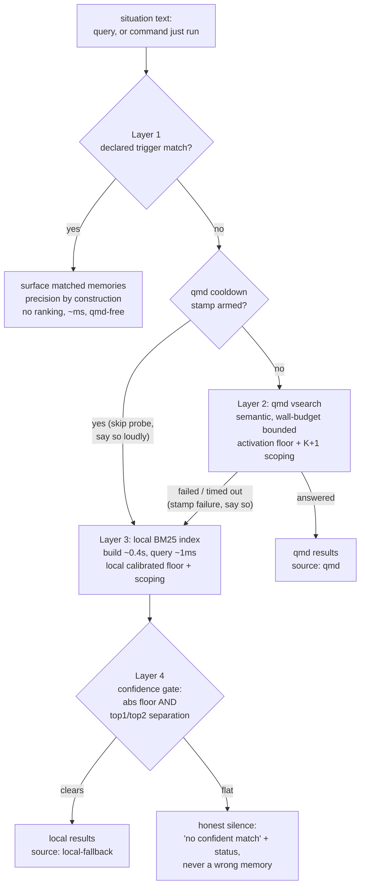
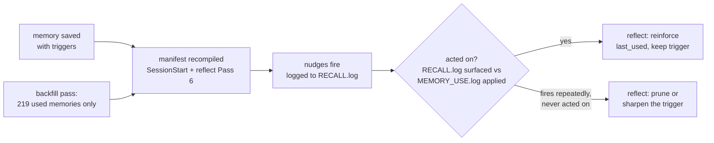

# Mid-Session Memory Recall - Plan

## Goal Capsule

**Objective.** Make the central memory store usable during a session, not just at session start. Recall must be fast (one call, ~1ms–6s depending on layer), reliable (a wedged qmd fails over instead of failing to silence), and quiet unless confident. Add two explicitly-invoked commands: `/memories <topic>` for deliberate study of a subject, and `/reflect regroup` — no argument — for a human-triggered stop that makes the agent ground itself in memory against what it is doing right now. Everything else is friction reduction so agents actually reach for memory the way they already reach for Bash.

**Product authority.** Five decisions settled by the user in the 2026-08-07 brainstorm (SD1–SD5, carried below as KTD1 (nudge + agent-initiated) through KTD5 (approach C)). They are answered input; nothing in this plan re-opens them.

**Open blockers.** None. One flag: task-aware subagent injection is gated behind U8 (SubagentStart task-visibility spike) — no unit in this plan depends on it. Application failure (Case 3) was the other flag and is now decided out of scope permanently (Open Questions 1).

---

## Summary

Memory today is touched only during `/reflect` consolidation. In the motivating session (4,796 lines), the seeded-recall hook fired zero times, and three covered-by-memory failures cost 56 minutes, 14h46m, and 8h24m. The corpus is 866 files / 2.88 MB (579 flat + 287 under `_scope/**`); 60% of logged memories were touched on exactly one day — written and never applied.

This plan builds the shape the user chose: a layered retrieval path where memories can declare the situations they apply to (machine-readable triggers → precision by construction), qmd stays primary for semantic matching, a local in-process index (~397ms build, 1–2ms query, measured) is the always-available fallback, and anything below a measured confidence gate stays silent — a wrong memory costs more than no memory. Ambient recall surfaces as a nudge the agent can act on, never as bodies dumped into context mid-session. A `/memories` command handles deliberate memory work. A wedged qmd becomes loud instead of invisible. A telemetry split makes it possible to answer, later, whether any of this worked.

All of it lands in `plugins/reflect/` (v0.4.0) in this repo, extending the existing machinery: `scripts/memory_activation.py` (activation scoring + recall floor), `scripts/scoped-memory/scope.py` (repo scoping + K+1 selection), `hooks/seeded-recall.sh` (budget/cooldown/injection patterns), and `tests/harness.sh` (stubbed-qmd test patterns). Nothing is rebuilt in parallel.

---

## Problem Frame

**The unit of failure is any moment an agent acts wrongly while a memory covers it.** The user's framing: "This session wasn't a once off... I'm consistently having experiences where an agent is doing something incorrectly and there's a memory they aren't accessing." The 327 write-and-forget memories (60% of 546 logged) measure the problem better than the three named cases.

Three measured failure cases from one session:

- **Case 1 (retrieval, 56 min)** — `gh pr view --json statusCheckRollup` returned thin output; root cause (`mergeable=CONFLICTING`) took 56 minutes to find. Three near-duplicate memories covering exactly this were on disk; one's description literally reads "Check `gh pr view --json mergeable` before diagnosing missing CI." The trigger exists in prose — it isn't machine-readable. BM25 misses this query (vocabulary gap: `CONFLICTING`/`mergeable` absent from the observed output); only semantic search or a declared trigger reaches it.
- **Case 2 (retrieval, 14h46m)** — six failing E2E shards misjudged as "not ours." `reference_e2e_flake_vs_regression_triage` covered it and ranked first in the local-index test with a decisive score gap (38.44 vs 25.44 runner-up).
- **Case 3 (application, 8h24m)** — the agent HAD the memory (`feedback_user_bang_command_may_not_execute`), stated its lesson verbatim, and still repeated the anti-pattern. Retrieval cannot fix this; see Open Questions.

**Why agents don't recall today (measured this session):** `qmd vsearch` hung past 25s while `qmd --version` answered fine; the failure cooldown was already armed and nothing surfaced it; the on-demand CLI path is drifted and half-built (below); and no doc anywhere tells an agent *when* to search memory mid-session.

**Root cause found during deepening — seeded recall is disabled by configuration, not only by the wedge.** `~/.claude/settings.json` sets `SEEDED_RECALL_TIMEOUT: "0.05"` in its `env` block. That value is the *total wall budget* (`plugins/reflect/hooks/seeded-recall.sh:92`), and `run()` returns `None` immediately whenever remaining ≤ 0.05 (`seeded-recall.sh:207`). So no qmd call is ever made, `note_failure()` fires on every prompt, and the cooldown arms after two prompts. This is an independent and sufficient cause of the motivating session's zero recall — it would hold with qmd perfectly healthy, and it is almost certainly a leftover from debugging the 2026-07 per-prompt-tax incident.

Two consequences for this plan. **First, a one-line fix restores recall today**, ahead of everything else here; it belongs in U0 below. **Second, it invalidates two verification assumptions:** Acceptance Example 4 (loud wedge at session start) and U4's "healthy-qmd path byte-equivalent" regression lock both inherit this env var on this machine and would misattribute the resulting silence to qmd. Acceptance runs must unset it or fix it first.

### Corrections to the originating brief (`docs/handoff.md`)

The repo-root handoff is directional author intent; measurement overturned it on five points. Stated plainly:

1. **"The capability is done; only the trigger is missing" is false for the on-demand path.** `recall --here` is documented (`plugins/reflect/skills/reflect/SKILL.md`) but unimplemented — `cmd_recall` in `plugins/reflect/scripts/scoped-memory/reflect_cli.py` has no `--here` branch (it exists only in `cmd_list`); the CLI prints titles with no bodies; and it uses `qmd search` (BM25) while the hook uses `qmd vsearch` (vector) — materially different recall regimes per the plugin's own spike (`plugins/reflect/scripts/spikes/RESULTS.md`: recall@3 of 0.25 vs 0.75).
2. **The brief's #1 candidate (SubagentStart top-K injection) is unproven** — the only working SubagentStart precedent on this machine never reads stdin. It is a bounded spike here (U8), not a deliverable.
3. **The brief's #2 candidate (PostToolUseFailure) is demoted** — it would have caught only Case 3, the cheapest miss. Cases 1 and 2 followed *successful* commands with surprising output. A failure-only trigger misses the expensive misses by construction.
4. **The brief's 861 was approximately right; an earlier "correction" to 577 was itself wrong.** Measured: 579 flat root bodies (1.83 MB) + 287 under `_scope/**` (1.05 MB) = **866 files, 2.88 MB**. The 577 figure counted the flat root only. This matters beyond arithmetic: `memory_activation.score_dir` (`plugins/reflect/scripts/memory_activation.py:176`) and `plugins/reflect/scripts/memory-index-render.py:105` both use `os.listdir` — **flat, non-recursive** — so 287 scoped memories (33% of the corpus) are invisible to every existing scoring path, and would be invisible to the new ones if they inherit that walk. The measured 397ms build was over 64% of the corpus.
5. **The brief's "relevance floor" open question is largely answered** — an activation-scaled floor exists (base 0.45 / span 0.15 / ref 1.3 in `scripts/memory_activation.py` `recall_floor`), and plan 003 (repo-scoped memory recall) KTD2 settled additive K+1 with a distinct repo floor, globals never displaced. New retrieval paths inherit that machinery.

---

## Requirements

- **R1 — One-call mid-session recall.** An agent gets relevant memory bodies (or an honest "nothing confident") from a single CLI invocation, in bounded time, in every qmd health state.
- **R2 — Fail-over, not fail-to-silence.** qmd stays primary (semantic reach); when it is wedged, absent, or in cooldown, retrieval falls over to the local index. Today's exit-0-no-output on failure is replaced everywhere a query runs.
- **R3 — Declared triggers.** A memory can carry a machine-readable statement of the situations it applies to; a matching situation surfaces that memory with precision by construction, no ranking involved.
- **R4 — Silence unless confident.** Undeclared cases fall to ranked search gated on score separation (measured basis: the one true hit had a 38.44-vs-25.44 gap; both misses were flat). Below the gate, recall says nothing.
- **R5 — Nudge, not bodies.** Ambient (non-agent-initiated) recall surfaces as a short pointer the agent can choose to act on. Bodies are only delivered when the agent asks (CLI/command) — plus the settled session-start injection, which predates this plan.
- **R6 — A deliberate-memory-work command.** An explicitly invoked command walks the agent through the memories on a topic: retrieve, read, apply, record use.
- **R6b — A grounding interrupt.** A command taking **no topic argument** stops the agent's current task, derives the situation from recent context, retrieves against it, and reports the corrected course forward. The human invokes it on noticing the agent hasn't consulted memory; the agent — not the human — works out what to search for.
- **R7 — Loud wedged qmd.** A qmd health failure or armed cooldown is visibly surfaced (once per session) instead of silently suppressing recall.
- **R8 — Trigger lifecycle.** `/reflect` writes triggers for new memories, backfills memories with real use history, and prunes triggers that fire without being acted on. The field must not decay into an unpopulated aspiration.
- **R9 — Honest measurement.** Surfacing events (recall offered something) are recorded separately from use events (memory actually applied), so "surfaced and helped" is distinguishable from "logged after the cost was paid." `MEMORY_USE.log` stops conflating writes with uses.
- **R10 — Subagent gap spike.** Prove or kill whether a `SubagentStart` hook can see the subagent's task text. Finding only; no dependent deliverables in this plan.

---

## Key Decisions

The five session-settled decisions are authored as KTD1–KTD5 below and are binding. Product-level scope calls: fixing qmd itself is out of scope (separate codebase, wedge has recurred twice); making its failure loud and falling over locally is in scope. Application failure (Case 3) is treated as out of ambient scope per the recorded assumption — flagged, not decided (see Open Questions).

---

## Scope Boundaries

**In scope:** the reflect plugin (`plugins/reflect/`), its hooks, scripts, skill docs, command files, and tests; the memory store's frontmatter conventions and log conventions (store lives outside the repo at `~/.claude/projects/-Users-shawnroos/memory/`); a read-only spike on SubagentStart payload visibility.

**Out of scope:** fixing qmd's wedge (separate codebase); task-aware subagent injection as a deliverable (gated on U8 — SubagentStart spike); any enforcement mechanism for application failure (unsettled — Open Questions); the stale standalone copy at `~/projects/reflect` (0.3.0 — never a target); MCP tool surfaces (the qmd MCP routes agents to the slow search mode and disconnected mid-session; CLI is the delivery vehicle per the user's global tool-selection preference).

---

## Acceptance Examples

1. **Case 1 replay (declared trigger).** An agent runs `gh pr view 5159 --json statusCheckRollup`. The trigger manifest contains a pattern from `reference_gh_conflicting_blocks_ci_silently` matching that command shape. Within the hook's timeout, a one-line nudge surfaces naming the memory and its hook line. No body is injected. This works with qmd fully wedged.
2. **Case 2 replay (ranked fallback).** qmd is wedged (cooldown armed). An agent invokes recall with a query about a failing E2E shard and `sprout.spec.ts`. The local index answers in well under a second; `reference_e2e_flake_vs_regression_triage` clears the separation gate (38.44 vs 25.44) and its body is returned, with an honest status line saying the source was the local fallback and why.
3. **Silence over wrongness.** The same wedged-qmd recall is invoked with Case 1's command-output vocabulary (`statusCheckRollup`, `CodeRabbit SUCCESS`). Local scores are flat; the gate holds; the CLI reports "no confident match" and names the next move (broaden the query, or wait for qmd). It does not return `reference_slate_webapp_nonrequired_ci_gates` (the measured wrong top hit).
4. **Loud wedge.** A session starts while the qmd cooldown stamp is armed. The first prompt receives a visible one-line degradation notice (qmd wedged, cooldown armed, local fallback active) plus local-fallback seeded results — instead of today's silence. The notice appears once per session, not per prompt.

---

## Key Technical Decisions

**KTD1 — Nudge + agent-initiated recall; never silent body injection mid-session.** *(session-settled: user-directed — chosen over top-K bodies silently injected into context and over surfacing a line to the human: a nudge is cheap when wrong, and the precision measurement independently killed body-dumping — 2 of 3 test queries would have injected a wrong memory.)* Ambient surfaces are pointer lines the agent can act on; bodies flow only through agent-initiated calls. The existing session-start injection by `hooks/seeded-recall.sh` is settled prior art (plan 003, repo-scoped memory recall) and is not a violation of this decision — KTD1 governs mid-session behavior.

**KTD2 — Ship the literal path AND make the qmd failure loud; both, in that order.** *(session-settled: user-directed — chosen over "route around qmd only" and "fix qmd first": qmd's search path hung >25s during the brainstorm itself with the failure cooldown already armed, and nothing surfaced it — a silent wedge is how the motivating session ran 4,796 lines with zero recall.)*

**KTD19 — `/reflect regroup` derives its own query from context; it takes no topic argument, and that is the mechanism.** The human invokes it precisely when they cannot name the memory — they see the agent going wrong and know only that it never looked. Requiring a topic would push the hard half of the work back onto the person interrupting. So the agent reads back over its own recent turns and extracts the searchable situation itself: commands just run, the error being chased, a tool that returned something thin, a decision just made, an external system just touched. That extraction step is a different cognitive act from search, and it is the one that failed in the first place — noticing that what you are doing *is* a situation memory might cover.

Consequences: it runs several queries rather than one, and the confidence gate (KTD11/KTD12) is relaxed because a human explicitly asked — the cost of a marginal hit is a line the agent reads and discards, not a wrong memory injected unbidden. It reports **forward**: the corrected course, one line per change, not a summary of what it read. Then it continues without a confirmation gate. The human just interrupted once; interrupting again is cheaper than a gate on every invocation. A null result ("searched X, Y, Z; nothing covers this") is a valid and useful outcome, stated plainly rather than padded.

**KTD3 — One command for deliberate memory work; everything else is Agent Experience.** *(session-settled: user-directed — chosen over adding more rules or enforcement: agents skip recall because it is expensive and unreliable, not because they lack a rule. Make it fast, reliable, and one call, and agents will use it the way they already make 453 Bash calls a session.)*

**KTD4 — qmd stays primary; the local index is a real fail-over, never fail-to-silence.** *(session-settled: user-directed — chosen over local-only and over qmd-only: only semantic search reaches Case 1's vocabulary gap; only the local index answers in ~1ms when qmd is down. Target behavior is fail-over; today's is fail-off.)*

**KTD5 — Declared triggers AND ranked-gated search, built together (approach C).** *(session-settled: user-directed — chosen over sequencing "B then A", "A only", and "B only": building both as one unit means "less chance the second half never happens.")*

**KTD6 — The local index is built in-process per query; no persisted index artifact.** Measured: 397ms to load-and-build over 64% of the corpus (the flat root only — the walk missed `_scope/**`), 1–2ms per query; the real bound is re-derived over all 866 bodies in U10. Building fresh from disk every call eliminates the entire staleness class (a memory saved ten seconds ago is immediately findable — which qmd, with its embedding lag, cannot do) and avoids a second write path to keep honest. If the corpus grows an order of magnitude, an mtime-keyed cache is the escape hatch; not built now.

**KTD7 — The ambient hook matches declared triggers only; ranked search runs only on explicit calls.** The nudge hook fires on every Bash call (~453/session in the motivating session). Trigger matching against a compiled manifest is a few milliseconds; a per-call 400ms index build is not. Precision by construction also keeps ambient noise near zero — the hook can only surface what a memory explicitly declared. Ranked-and-gated search belongs to the recall CLI and the `/memories` command, where the agent chose to pay for it.

**KTD13 — The ambient path still filters by scope, even though it skips ranking.** Skipping `select_scoped` to stay fast would leak memories across repos: 287 of 866 bodies live under `_scope/<slug>/`, and `scope.classify` (`plugins/reflect/scripts/scoped-memory/scope.py:132`) exists precisely to suppress siblings. Without a filter, one Slate web-app memory declaring a `gh pr view --json` trigger nudges in shrimpshack, in brand-foundry, in every repo — which is the concrete answer to "what happens where the memory store is irrelevant to the work": you get another project's memories.

The filter runs at **match time, not compile time** — the manifest is one shared artifact read from every repo, so it cannot be pre-filtered for a cwd it doesn't know. Each manifest entry carries its memory's scope slug; the matcher drops entries that `classify()` against the current repo as `sibling`. Global (unscoped) memories always pass. This costs a repo-slug resolution per hook invocation, which folds into KTD7's per-call budget rather than sitting outside it.

**KTD14 — Any automated write to a memory file is an activation event and must preserve mtime.** Activation weights `mtime` at 0.3 with a 60-day half-life, explicitly as "last reinforcement" (`plugins/reflect/scripts/memory_activation.py:17`). KTD10's backfill writes a `triggers:` field into ~219 files in one pass; left alone, that resets 219 mtimes to today, spikes those memories' activation, reshuffles the whole `MEMORY.md` hot/cold cut, and lowers their recall floor — surfacing them more. That is the same surfacing→activation→more-surfacing loop KTD9 closes at the telemetry door, arriving through a second door KTD9 does not guard.

So the backfill writer restores the original `st_mtime` after writing, and this rule generalizes to every future bulk frontmatter edit. Second-order effect to plan for: 219 changed files queue 219 re-embeds in the `claude-memory` collection, and `seeded-recall.sh:382` will emit its pending-embeddings staleness note on every session until that backlog drains — against a qmd that is currently wedged. The Definition of Done names how that backlog is drained.

**KTD8 — Both recall paths converge on one retrieval module and one health state.** The documented drift — CLI on `qmd search`/hardcoded 8s/no floors vs hook on `qmd vsearch`/wall budget/activation floor — ends. Both use vector search (the only recall-adequate mechanism per the Phase B spike), the hook's remaining-budget pattern, the shared cooldown stamp (the CLI reads it and skips straight to local fallback with a loud status, rather than re-taxing a wedged qmd), the activation-scaled floor from `scripts/memory_activation.py`, and `scope.py`'s `select_scoped` K+1 (plan 003 KTD2: globals never displaced, distinct repo floor). New paths inherit; nothing re-decides floors.

**KTD9a — The token vocabulary is inert until `use_counts` reads it; without that change KTD9's protection is false.** `use_counts` (`plugins/reflect/scripts/memory_activation.py:148-162`) increments for **every** line carrying a second field and never inspects the token. So introducing `written` and `reflect` tokens while leaving the parser "untouched" means a memory that was merely saved, or merely timestamp-bumped by `/reflect`, still raises its own activation and lowers its own recall floor — the exact loop KTD9 exists to close, arriving through the front door while KTD9 guards the side one.

U7 therefore **changes `use_counts` so only `applied` contributes to activation**, and defines the treatment of historical untagged lines explicitly (field 3 starting with `[` or `(` is annotation, not a token — see the corrected format below; those lines are ambiguous and counted under a stated rule, not silently). The test that matters asserts `written` and `reflect` lines leave activation unchanged while `applied` moves it. Without that test the whole telemetry split is decorative.

Corrected log shape, measured rather than assumed: **1581 of 1596 existing lines already carry a third field**, and it is free-form bracketed prose — the user's own Memory Protocol annotation convention, not drift. An earlier claim that only ~33 lines were annotated was wrong. The format is `<date> <name> <token> [annotation]`, token in field 3, annotation from field 4 on.

**KTD9b — Surfacing and application records must carry a session id, or the measurement claim is unsupportable.** `RECALL.log` as specified holds timestamp, source, memory, layer, and gate data — no session identifier — while the plan claims events can be joined "same-session/day" to answer whether recall worked. With concurrent sessions (explicitly expected), session A's nudge joins to session B's unrelated application and reports success; a nudge before midnight and its real application after reports failure. Both logs stay well-formed and every count-based test passes.

So both records carry `session_id`, and applications carry a full timestamp rather than a date. Where a writer genuinely has no session id, it records that absence explicitly rather than letting the join infer one. U7 gets a two-concurrent-session attribution test.

**KTD9 — Surfacing telemetry is a separate log; `MEMORY_USE.log` stays applied/written only.** `use_counts` in `scripts/memory_activation.py` counts every log line as a use, and use raises activation, which lowers the recall floor, which surfaces the memory more. Logging "surfaced" events into `MEMORY_USE.log` would create a rich-get-richer loop that corrupts the activation signal and the very write-vs-use distinction being fixed. Surfacing events go to a sibling telemetry log (`RECALL.log` in the store); `MEMORY_USE.log` gains a small standardized token vocabulary instead.

**KTD10 — Backfill triggers only where there is real use history.** Of 546 logged memories, 219 were used on 2+ distinct days; those (plus the pinned/hot tier) get triggers backfilled via a `/reflect`-driven judgment pass. The remaining ~327 are not backfilled: an undeclared memory falls to ranked-gated search, which is KTD5's design, not a gap. A big-bang backfill of all 546 would manufacture ~327 low-conviction trigger sets that decay into noise.

**KTD11 — Separation between top1 and top2 is the second of the gate's two conditions.** Measured basis is three data points: the true hit's ratio was 1.51 (38.44/25.44); both misses were flat. Default starts near that boundary (directionally: ratio ≥ ~1.4), env-overridable in the `SEEDED_RECALL_*`/`MEMORY_ACT_*` tradition, with tuning deferred until `RECALL.log` telemetry accumulates — the same posture plan 003 took for `SEEDED_RECALL_REPO_MIN_SCORE`.

Separation applies only after KTD12's calibrated absolute floor has already been cleared — it never substitutes for it. Its virtue is that it is scale-free, so it transfers unchanged between the qmd and local regimes; its limit is that it says nothing about whether the top hit is any good in absolute terms, which is precisely what the floor is for. Because BM25 is unnormalized and corpus-dependent, the floor half must be recalibrated as the store grows; the ratio half need not.

**KTD12 — Scores from qmd and the local index are not comparable; the local path normalizes before any shared floor applies.** Deepening caught this as arithmetic, not opinion. `memory_activation.recall_floor` returns `base + span*(1-norm)` — with shipped defaults, **0.45 to 0.60** — and was tuned for qmd vector scores in [0,1]. Measured BM25 scores on this corpus are **38.44 and 25.44**. Applying the same floor to raw BM25 filters nothing, ever, silently: the activation-scaled floor becomes dead code the moment the local path uses it, and a faded memory gets exactly the same treatment as a fresh one.

The test would have hidden it. U1's floor scenario copies `SEEDED_RECALL_FLOOR_SPAN=2.0` from `plugins/reflect/tests/harness.sh:139`, giving a floor near 1.5 — still ~25x below any BM25 score. It could only go green with a fabricated span around 50, and that green would assert nothing about production behavior. This is exactly the false-green class the repo's own mutation-testing practice exists to catch.

**Resolution — and the resolution that was rejected.** The obvious fix, normalizing each score against the query's own top hit (`score ÷ top1`), is wrong and must not be implemented: it makes top1 exactly `1.0` for every non-empty result set, so the strongest hit clears any 0.45–0.60 floor unconditionally whether its raw score was 38 or 0.08. That converts the floor from dead code into a rubber stamp — a worse failure, because it looks like it is working.

The local path therefore gets its own **calibrated raw-score floor** (`MEMORY_LOCAL_FLOOR_*`, defaults derived from measurements over the full 866-file corpus), never the qmd floor reused on a different scale and never a top1-relative one. Separation (KTD11) is a **second, independent** condition applied on top of it, not a substitute for it.

Two behaviors the implementer must not be left to choose, because either default ships silently:
- **Singleton result** — one candidate, so no top1/top2 ratio exists. It passes on the absolute floor alone; separation is not evaluated. State it, test it.
- **Zero or empty scores** — no candidate clears the floor. Returns the explicit below-gate result, never a best-effort guess.

U1's floor scenario asserts against raw scores with the calibrated floor, and must be shown failing when the floor is reverted to the qmd values.

**KTD15 — The confidence gate runs on a score-ordered list, before `select_scoped` reorders it.** `scope.select_scoped` (`plugins/reflect/scripts/scoped-memory/scope.py:149-173`) deliberately prepends the best current-repo body ahead of higher-scoring ancestors — that is plan 003's K+1 boost working as designed, and `plugins/reflect/tests/scope_select_test.py:16,29-38` pins it with a current-repo score of 0.5 winning position 1 over stronger ancestors.

U1's stated order (activation floor → `select_scoped` → gate) therefore feeds a position-based top1/top2 gate a list whose positions no longer track score. Concretely: current-repo 0.50 with ancestors 0.95 and 0.62 presents as [0.50, 0.95, 0.62]; the gate compares 0.50/0.95 and rejects a query whose real top pair is 0.95/0.62 = 1.53 and should have passed. The inverse produces a false positive just as easily.

Correct order: **filter siblings out first, compute the gate over the score-ordered survivors, then apply the K+1 presentation boost to what survives.** Scoping is a filter and a presentation choice; it must not sit between scoring and the decision that reads scores. U1 gets two fixtures: one where the current-repo hit is not globally top-ranked, one where the raw top hit is a sibling that scoping discards.

**KTD16 — Corpus enumeration is one recursive shared function, consumed by every path that reads the store.** The plan documents that `os.listdir` is flat and that 287 scoped bodies are therefore invisible, but documenting it is not fixing it. Left as is, the likely outcome is worse than the current state: the new local index gets written recursively while `memory_activation.score_dir` (`plugins/reflect/scripts/memory_activation.py:165-196`) and `plugins/reflect/scripts/memory-index-render.py:103-110` stay flat, so scoped memories retrieve with no activation data and never reach the hot tier — or an implementer copies `score_dir` as the plan currently suggests and the local fallback silently searches 579 of 866 bodies.

One `iter_bodies()` in the shared module walks the store recursively, applies the exclusion set once (`MEMORY.md`, logs, dotfiles, `.bak`, the trigger manifest), and is the only enumeration any consumer uses: activation scoring, index rendering, local retrieval, and trigger compilation. Fixtures are **866-file-shaped with nested `_scope/**` bodies** — U1's performance bound is re-derived against that, since the measured 397ms covered 64% of the corpus. This lands as U10 below, ahead of U1.

**KTD17 — Triggers use a typed schema; a bare string is never guessed at.** "A list of case-insensitive patterns (substring or regex)" is not a format — it leaves the compiler free to read `gh pr view --json` either way, and a literal containing `.`, `[`, `(`, `+`, or `?` silently changes meaning under the regex reading. Either interpretation passes the Case 1 test, so the ambiguity ships.

Each trigger is explicitly typed as literal or regex. The schema fixes: which regex engine, whether patterns anchor, the escaping rule for literals, a maximum pattern length, and a **per-pattern evaluation bound**. The last one is load-bearing on the ambient path — one pathological pattern consuming the hook's timeout makes every subsequent match vanish with a clean exit, which is this plan's signature failure mode reproduced inside its own precision mechanism. Validation rejects patterns containing `description:` (they would be lifted into the index as a memory's hook by `memory-index-render.orphan_hook`'s pre-frontmatter scan). Tests cover a metacharacter-bearing literal and a pathological regex, not only a syntactically invalid one.

**KTD18 — Shared-store writes use unique temp files, and manifest compilation is a sibling of index rendering, not a passenger.** The repo's established tmp-then-`os.replace` idiom (11 sites, e.g. `plugins/reflect/scripts/memory-index-render.py:150-157`, `plugins/reflect/hooks/seeded-recall.sh:133-145`) uses a **fixed** sibling name. That gives readers atomicity — nobody sees a half-written file — and gives concurrent *writers* nothing: two sessions compiling the manifest both open the same `.tmp`, and the survivor is valid JSON assembled from the wrong run. The hook then quietly matches against stale or partial triggers. Writes to shared-store artifacts therefore use a unique temp file in the destination directory plus atomic replace, with a concurrent-compiler test asserting the final manifest is complete and neither writer falsely reports success.

Separately, compilation must not ride inside the renderer. `memory-index-render.py:138-148` returns early when the rendered index is byte-identical — the common case, and the reason it is cheap enough for SessionStart. Behind that return, compilation never runs on an unchanged store; ahead of it, it adds a frontmatter read of 866 files to every session start and defeats the optimization the file's own comment calls out. Compilation gets its own script and its own hook entry with its own timeout and its own mtime-based skip, invoked *alongside* render rather than within it.

---

## High-Level Technical Design

### Retrieval layering

One retrieval module (`scripts/scoped-memory/` alongside `scope.py`) serves the recall CLI, the `/memories` command, and the seeded-recall failover. Layer order, per query:

Key properties: Layer 1 works with qmd dead (Case 1's cover). Layer 2 is the only layer that reaches vocabulary gaps (semantic). Layer 3 answers when 2 can't and is where the gate matters most (BM25 misses are flat, so the gate holds — measured). Layer 4 encodes "a wrong memory costs more than no memory." Every layer reports which one answered and why, so degradation is visible, not silent.

### Two consumption surfaces, one module

- **Ambient (hook):** `PostToolUse` on Bash runs the trigger matcher only (KTD7 — ambient hook is triggers-only). Match → emit a nudge line (memory title + its one-line hook + how to fetch it) through the hook output contract; the in-repo precedent for command-text matching is the existing `PostToolUse` Bash matcher in `.claude/hooks/hooks.json` (the `gh pr (create|merge)` grep), and context injection back to the agent uses the `hookSpecificOutput.additionalContext` shape, **confirmed real for PostToolUse** from the running build — not `seeded-recall.sh`'s raw-stdout idiom, which is proven as an injection channel for `UserPromptSubmit` only. Dedupe: a given memory nudges at most once per session (flag-dir pattern borrowed from `seeded-recall.sh`); cap ~2 nudges per event.
- **Deliberate (CLI + command):** `reflect_cli.py recall` runs the full layering and returns bodies (truncated per the hook's max-body pattern, wrapped with the existing closing-tag neutralization). The `/memories` command drives a work-through loop on top of it.

### Trigger declaration and manifest

- A memory declares triggers in frontmatter: a `triggers:` list whose every entry is **explicitly typed literal or regex** (KTD17 — a bare string is never guessed at, since `gh pr view --json` read as a regex silently changes meaning). Matched case-insensitively against situation text — the command an agent just ran, or a recall query. Case 1's memory would carry literal patterns `gh pr view --json` and `statusCheckRollup`.
- The hook never scans 866 files. A compiled manifest (name → patterns → scope slug, one small non-`.md` file beside `MEMORY.md` in the store) is built by its own script with its own hook entry, invoked **alongside** the index render at SessionStart and in `/reflect` Pass 6 — not inside it (KTD18: the renderer's byte-identical early return would skip compilation on an unchanged store, and putting it ahead of that return adds a frontmatter read of 866 files to every session start). Freshness still rides the existing recompile points. Staleness window: at worst, a trigger declared mid-session activates next render; the recall CLI reads frontmatter live, so the deliberate path never lags.

### Trigger lifecycle (kept honest)

`/reflect` owns the loop: Pass 2 (memory update) gains "declare triggers for memories saved/reinforced this session"; a new lifecycle check prunes triggers that surface without ever being applied. Undeclared memories are served by ranked search — absence of a trigger is a supported state, not debt.

### Measurement split

- `RECALL.log` (new, in the store): one line per surfacing event — timestamp, source (`seeded` / `nudge` / `cli` / `memories-cmd` / `regroup`), memory name, layer + gate data. Written by machines only. Never read by `use_counts` (KTD9 — telemetry separated from activation).
- `MEMORY_USE.log` (format `<date> <name> <token> [annotation]` — the token takes field 3, where 1581 of 1596 existing lines already carry free-form bracketed prose, so annotation moves to field 4+). **The parser changes** (KTD9a): `use_counts` today increments on any line with a second field and never reads the token, so leaving it alone would let a merely-saved memory raise its own activation. Standardized tokens `applied` (agent used it in reasoning), `written` (saved), `reflect` (batch timestamp update). The Memory Protocol doc and `SKILL.md` Pass 2 wording are updated to make `applied` the only agent-written token.
- The question "did this work?" becomes answerable: join surfaced events with **same-`session_id`** applied events (KTD9b — a date-only join credits one session's nudge to another session's unrelated application, and this store sees concurrent sessions); track the write-and-forget rate (baseline: 60%) over time.

---

## Alternative Approaches Considered

Product shape was settled upstream (KTD1–KTD5); these vary only on HOW.

1. **Where the index lives.** *(chosen: in-process, built per query — KTD6)* vs a persisted index file rebuilt by `/reflect` (fast reads, but introduces a staleness class and a second write path to keep honest — and 400ms doesn't need amortizing) vs SQLite FTS5 (real infrastructure for a 2.88 MB corpus; another artifact to reconcile) vs teaching qmd a fast lexical mode (out of scope by user decision — the wedge lives there).
2. **How triggers are declared and kept fresh.** *(chosen: frontmatter `triggers:` compiled to a manifest at existing render points)* vs a central trigger registry file (drifts from the bodies it describes; concurrent-session merge hazard on one hot file) vs parsing trigger-like prose at match time (the Case 1 memory shows the prose exists, but heuristic parsing is imprecise exactly where precision is the point) vs qmd metadata fields (couples the qmd-free layer to the wedge-prone component).
3. **How the fallback is sequenced.** *(chosen: qmd-first under the wall budget, cooldown skips straight to local, every hop reported)* vs racing qmd and local in parallel and taking the first answer (wastes a qmd probe per call while wedged, complicates the cooldown semantics, and the two regimes rank differently so "first" is not "better") vs local-first with a qmd upgrade pass (fastest first answer, but mid-interaction result replacement is confusing, and it demotes the semantic layer that alone reaches Case 1's vocabulary gap — against KTD4's qmd-primary).
4. **Nudge transport.** *(chosen: PostToolUse Bash matcher + manifest grep, the plugin's existing hook idiom)* vs a UserPromptSubmit ranked-recall hook on every prompt (the originating brief itself warns against this; latency budget per prompt is unforgiving) vs PostToolUseFailure (measured: catches only the cheapest miss — demoted upstream to one-input-among-several, and triggers on successful-but-surprising output are what Cases 1–2 needed).

---

## Risk Analysis

- **Nudge noise erodes trust.** Mitigated by construction: ambient surfaces only declared triggers (KTD7), deduped per memory per session, capped per event. `RECALL.log` telemetry (U7) plus the reflect pruning loop (U6) retire triggers that fire without being acted on. If noise still emerges, the manifest is one file to edit.
- **Per-Bash-call hook cost.** 453 calls/session in the motivating session. The hook reads one small manifest and pattern-matches one command string; no Python interpreter spin-up is required for the match path if kept in shell, and the hook carries a hard timeout like its siblings. Verified by a latency scenario in U3.
- **Silence gate calibrated on three data points.** Named openly (KTD11 — measured basis, deferred tuning). Thresholds are env-tunable; telemetry accumulates the tuning corpus; the failure mode of a too-strict gate is silence, which is the chosen failure mode.
- **BM25 vocabulary gap in the fallback.** Accepted and designed around: declared triggers cover the known gap class (Case 1), qmd covers it semantically when healthy, and the gate keeps the local layer from answering wrongly when it can't answer rightly.
- **Cooldown interplay.** A naive CLI would probe a wedged qmd on every deliberate call, re-paying the 25s hang. KTD8 (one retrieval module, shared health state): the CLI reads the shared stamp, skips the probe, and says so. Conversely, CLI successes clear the stamp (self-heal), matching the hook's existing contract.
- **Drift recurrence between hook and CLI.** The original sin being fixed. Mitigation is structural: one shared retrieval module (the `scope.py` anti-divergence discipline), plus a harness assertion that both paths agree on subcommand and floors.
- **Trigger field decays unpopulated.** R8's whole point: authorship is wired into reflect Pass 2 where memory writes already happen, backfill is scoped to memories with proven use (KTD10 — backfill only used memories), and undeclared remains a first-class served state.
- **Injection safety.** Local-fallback bodies flow through the existing `<recalled-memories>` wrapper and closing-tag neutralization; nudge lines carry titles/hooks only. No new injection surface class.
- **Concurrent sessions.** Logs are append-only; the manifest is atomic-replace. But the repo's fixed-`.tmp` idiom gives readers atomicity and concurrent *writers* nothing — two sessions compiling at once both open the same temp name and the survivor is valid JSON assembled from the wrong run (KTD18). Shared-store writes therefore use a **unique** temp file in the destination directory, asserted by a concurrent-compiler test. Two sessions nudging the same memory remains duplicate noise, not corruption.
- **Machine constraints.** No `timeout` binary exists here (a check assuming it silently passes); the harness's background-and-kill and stub-qmd patterns are the required idiom. qmd is currently wedged, so no verification may depend on it being healthy — the stubbed blocks carry the load.

---

## Implementation Units

Sequencing, revised after deepening. Three units now precede the original batch 1, because each removes a defect the later units would otherwise build on.

- **Batch 0 (parallel-safe, with one ordering constraint):** U0 (restore recall + repair the hook input contract), U10 (shared recursive corpus enumeration), U7 (measurement split), U8 (SubagentStart spike). U0 and U8 touch nothing the others need; U10 and U7 are independent of each other.

  **Constraint: U0 and U10 both edit `plugins/reflect/tests/harness.sh` — land U0's harness edit first, then U10's.** Separate worktrees appending separate blocks to one append-only file merge *cleanly* and silently produce a file neither author reviewed; a clean auto-merge on a shared append-only file is the dangerous case, not the safe one. Either sequence the two harness edits or have one agent own the file for the batch. The same applies to every later unit adding a harness block.

  **U0's `~/.claude/settings.json` edit runs in the main loop, not a worker.** It is outside the repo and global to this machine, and gated/global edits dispatched to subagents have paused unattended runs before. One line, done inline.
- **Batch 1:** U9 (extract the retrieval engine) after U10. U1 (local index) after U10. U3 (declared triggers) after U10 and after U0's hook-contract repair — U3 must not be written against the dead `$TOOL_INPUT` idiom.
- **Batch 2:** U2 (recall CLI) after U9, U1, U3, U7. U4 (seeded-recall fail-over) after U9, U1, U7. U6 (trigger lifecycle) after U3.
- **Batch 3 (parallel-safe):** U5 (deliberate command + guidance) and U11 (`/reflect regroup` grounding interrupt), both after U2. They share a scope boundary stated in each, so land them together and read them against each other.

U-IDs are stable and reflect authorship order, not execution order: U9 and U10 were added during deepening and run early despite their numbers; U11 was added after the plan was first written. Do not renumber them into sequence. KTD-IDs follow the same rule — KTD13/KTD14 sit between KTD7 and KTD8, KTD9a/9b precede KTD9, and KTD19 was added last.

### U0. Restore recall and repair the broken hook input contract

**Goal:** Two live defects found during deepening, both independent of everything else here, both cheap. Land first — U0 restores memory recall on this machine today and fixes the hook idiom every later unit copies.

**Requirements:** R2 (fail-over), R7 (loud wedge) — both are unobservable until recall runs at all.

**Dependencies:** none. **Blocks U3** — the trigger-nudge hook must be written against the repaired stdin idiom, not the dead `$TOOL_INPUT` one. Landing it first also makes every later verification honest.

**Files:** `~/.claude/settings.json` (outside repo — the `env` block), `plugins/reflect/.claude/hooks/hooks.json`, `plugins/reflect/tests/harness.sh`.

**Approach:** Two independent fixes.

1. **Restore the seeded-recall budget.** `SEEDED_RECALL_TIMEOUT: "0.05"` in the settings `env` block starves the hook below its own guard threshold, so no qmd call is ever attempted and the cooldown arms after two prompts. Remove the override so the shipped default (6s, tuned from the measured healthy path) applies. Do not substitute another small value — the 2026-07 plan (`plugins/reflect/docs/plans/2026-07-17-001-fix-recall-wedged-qmd-guard-plan.md:158`) records explicitly that the breach was kill latency, not budget, and that a short budget starves the median query.

2. **Fix the dead `$TOOL_INPUT` greps.** `plugins/reflect/.claude/hooks/hooks.json` gates its PR-event trigger and its TodoWrite trigger on `$TOOL_INPUT`, which **does not exist** — hook input arrives as JSON on stdin, and the running build injects no `CLAUDE_TOOL*` env vars at all. Both matchers grep an empty string, so `/reflect`'s auto-triggers on PR create/merge and all-todos-done have never fired (corroborated: 174 `manual` entries in `REFLECT.log`, zero `PR_event`). Rework both to read stdin and extract the field (`.tool_input.command` for the Bash matcher), guarding for `jq`'s absence with exit 0 the way `inject-server-context.sh` does. This is the exact idiom U3 depends on, so fixing it here gives U3 a working precedent instead of a broken one.

**Test scenarios:**
- Given a hooks.json Bash entry fed a stdin payload whose `.tool_input.command` contains `gh pr merge`, when the matcher runs, then the reflect-pending flag is created.
- Given the same entry fed a payload with a non-matching command, when the matcher runs, then no flag is created and exit is 0.
- Given `jq` absent from PATH, when the matcher runs, then it exits 0 with no side effect (fail-open).
- Given the settings override removed, when the seeded-recall hook runs against the healthy stub qmd, then it completes a qmd call rather than returning immediately — asserted by the stub's marker token appearing in output.
- Given a mutated `run()` that ignores the budget, when the budget-starvation assertion runs, then it fails — proving the existing starvation test is load-bearing rather than passing vacuously.

**Verification:** seeded recall visibly fires on a real session's first prompt; `REFLECT.log` gains a non-`manual` entry after a PR event; existing harness assertions stay green.

---

### U10. Shared recursive corpus enumeration

**Goal:** One `iter_bodies()` that every store reader uses, so the 287 scoped memories stop being invisible and no consumer can quietly enumerate a different corpus than its siblings (KTD16 — one recursive shared function).

**Requirements:** R1 (one-call recall), R4 (silence unless confident) — a gate over 64% of the corpus is not the gate the plan describes.

**Dependencies:** none. Blocks U1 (local ranked index), U3 (declared triggers), U6 (trigger lifecycle).

**Files:** `plugins/reflect/scripts/scoped-memory/corpus.py` (new), `plugins/reflect/scripts/memory_activation.py` (consume it in `score_dir`), `plugins/reflect/scripts/memory-index-render.py` (consume it), `plugins/reflect/tests/corpus_test.py` (new), `plugins/reflect/tests/harness.sh` (866-shaped fixture helper).

**Approach:** `iter_bodies(store_dir)` walks recursively, yields body paths with their scope slug already resolved (parsed from the `_scope/<slug>/` path segment, free — no extra read), and applies the exclusion set once: `MEMORY.md`, `*.log`, dotfiles, `*.bak`, and the trigger manifest. Repoint `score_dir` and the index renderer at it. Changing the renderer's input set changes `MEMORY.md`'s contents — 287 previously-invisible memories become eligible for the hot tier — so this unit owns that consequence and states the expected index delta rather than letting a later unit discover it.

**Execution note:** the activation and rendering repoint changes existing behavior on a live store. Take a copy of `MEMORY.md` before the first run and diff the rendered output, so the hot-tier shift is inspected rather than assumed.

**Test scenarios:**
- Given a fixture store with flat bodies and nested `_scope/<slug>/` bodies, when `iter_bodies` runs, then every body from both locations is yielded exactly once with its correct scope slug.
- Given a store containing `MEMORY.md`, `MEMORY_USE.log`, `RECALL.log`, a `.bak` file, a dotfile, and the trigger manifest, when `iter_bodies` runs, then none of them are yielded.
- Given the same fixture, when `score_dir` runs through `iter_bodies`, then scoped bodies receive activation scores (today they receive none).
- Given an 866-file-shaped fixture with nested scope dirs, when the index renders, then wall time stays within the SessionStart budget and the run is reported — this is the number U1's performance bound is re-derived from.
- Given a body under a scope dir whose slug contains characters needing escaping, when enumerated, then the slug parses correctly rather than truncating.

**Verification:** `tests/corpus_test.py` green; a grep-level guard that no code under `plugins/reflect/` calls `os.listdir` on the store directly; the `MEMORY.md` diff from the execution note reviewed and its hot-tier shift recorded.

---

### U9. Extract the retrieval engine from the hook heredoc

**Goal:** Make KTD8's "one retrieval module" real rather than aspirational. Today the entire retrieval engine — qmd process runner, wall budget, group-kill, cooldown read/stamp/clear, result parsing, floors, body fetch — lives inside a bash heredoc spanning `plugins/reflect/hooks/seeded-recall.sh:47-403`. Nothing can import it, so U2 would copy it, which is exactly how the drift this plan exists to fix was created.

**Requirements:** R1 (one call), R2 (fail-over), R7 (loud wedge) — all three are claims about behavior shared between hook and CLI, unverifiable while the behavior exists twice.

**Dependencies:** U10 (shared recursive corpus enumeration). Blocks U2 (recall CLI), U4 (seeded-recall fail-over).

**Files:** `plugins/reflect/scripts/scoped-memory/retrieval.py` (new — the extracted engine), `plugins/reflect/hooks/seeded-recall.sh` (reduced to a thin stdin-reading caller), `plugins/reflect/tests/retrieval_test.py` (new), `plugins/reflect/tests/harness.sh` (existing seeded-recall block becomes the regression contract).

**Approach:** Both sides are already Python — the bash file is a wrapper around a heredoc — so this is a move, not a rewrite. Lift the engine into an importable module exposing one entry point that takes a query, a budget, and a health-state handle, and returns structured results carrying source layer, gate verdict, and status. The hook becomes: read stdin, call it, format output. Preserve every current contract exactly — once-per-session guard, remaining-budget accounting, process-group kill, the one-genuine-health-signal stamping discipline, self-heal on success.

Move the cooldown stamp off `$TMPDIR` while here. The hook runs in the hook executor and the CLI runs inside the Bash tool; those are not guaranteed the same `TMPDIR`, and this session has an overridden scratch path proving it. Divergent paths mean the CLI reads a nonexistent stamp, fail-opens, and probes a wedged qmd for the full 25s — the exact hang KTD8 exists to prevent, failing silently. Use a fixed store-adjacent path, keeping `SEEDED_RECALL_FLAG_DIR` as a test override.

Settle one asymmetry explicitly: hook and CLI will run different budgets (6s vs. a longer deliberate one) against one shared failure counter, so a CLI timeout under a different definition of "too slow" can black out session-start recall for every session for ten minutes. Record which path is allowed to stamp, or stamp with the budget that produced it.

**Test scenarios:**
- Given the healthy stub qmd, when the extracted engine is called directly, then it returns results with source and gate verdict populated — the engine is testable without going through a hook.
- Given the wedged stub, when the engine is called with a 6s budget, then it returns a failure status within the budget and no orphaned processes survive.
- Given a cleared environment, when the hook and the CLI each derive the cooldown stamp path, then the two paths are byte-identical — the parity assertion that replaces the grep-level guard.
- Given a stamp armed by one path, when the other path runs, then it observes the armed state and skips its qmd probe.
- Given the extracted engine mutated to ignore the remaining-budget check, when the existing seeded-recall harness block runs, then it fails — proving the block is a real regression contract, not a passing shell.

**Verification:** every pre-existing seeded-recall harness assertion green against the refactored hook; `tests/retrieval_test.py` green; `seeded-recall.sh` reduced to a caller with no retrieval logic left in the heredoc.

---

### U1. Local ranked index with confidence gate

**Goal:** A qmd-free retrieval primitive: build-per-query BM25 over the store, scored through the existing activation floor and scope selection, returning either confident hits or an explicit below-gate result — never a flat guess.

**Requirements:** R2 (fail-over), R4 (silence unless confident).

**Dependencies:** U10 (shared recursive corpus enumeration) — `iter_bodies()` is this unit's enumeration source. Blocks U2 (recall CLI), U4 (seeded-recall fail-over).

**Files:** `plugins/reflect/scripts/scoped-memory/local_index.py` (new), `plugins/reflect/tests/local_index_test.py` (new), `plugins/reflect/tests/harness.sh` (new block; also fix the stale repo-root assertion — see Verification Contract).

**Approach:** Enumerate bodies via `corpus.iter_bodies()` from U10 — **not** `memory_activation.score_dir`, whose flat `os.listdir` would silently search 579 of 866 bodies (KTD16). Tokenize and score BM25 with the parameters the measurement used, then apply, in this order (KTD15 — the gate reads score order, and `select_scoped` destroys it):

1. **Filter siblings out** — drop bodies `scope.classify()` rates `sibling` against the current repo.
2. **Apply the local calibrated raw-score floor** (`MEMORY_LOCAL_FLOOR_*`, KTD12). Do **not** call `memory_activation.recall_floor` here and do **not** normalize against top1 — the qmd floor is arithmetically inert on BM25 scores, and top1-relative normalization makes the top hit clear any floor unconditionally.
3. **Evaluate separation** over the score-ordered survivors (KTD11 — top1/top2 ratio, the second of two conditions). A singleton passes on the floor alone; separation is not evaluated.
4. **Apply the K+1 current-repo presentation boost** via `scope.select_scoped` — after the gate has decided, because this deliberately reorders by scope rather than score.

Return structured results carrying raw score, gate verdict, and file path so callers can distinguish "hits," "below gate," and "empty corpus." Pure module + small CLI entry for tests; no persisted artifact (KTD6 — build per query).

**Files (amended):** add `plugins/reflect/scripts/scoped-memory/corpus.py` (consumed from U10).

**Test scenarios:**
- Given a fixture store containing the Case 2-shaped memory and distractors, when queried with the Case 2 query, then it ranks first and clears the gate.
- Given the same store, when queried with flat-scoring vocabulary (Case 1-shaped), then the gate reports below-threshold and returns no hits.
- Given a single candidate clearing the local floor, when the gate runs, then it passes on the floor alone and separation is not evaluated (the singleton case KTD12 requires be specified rather than left to the implementer).
- Given a query where no candidate clears the local floor, when the gate runs, then the explicit below-gate result is returned — never a best-effort top hit.
- Given the local floor reverted to the qmd `recall_floor` values, when the flat-score scenario runs, then it FAILS — proving the calibrated floor is load-bearing and not decorative (KTD12).
- Given a current-repo hit scoring below two ancestors, when the gate runs, then it evaluates the ancestors' ratio and not the scope-boosted position-1 entry (KTD15).
- Given the raw top-scoring hit is a sibling that scoping discards, when the gate runs, then separation is computed over the surviving candidates only, not against the discarded sibling.
- Given a store with a `_scope/<other-repo>/` body matching the query, when queried from an unrelated cwd, then the sibling-scoped body is suppressed per `select_scoped`.
- Given an empty or unreadable store dir, when queried, then the module returns an empty result with a non-crashing status (fail-open).
- Given the full live-sized corpus shape (866-file-shaped, fixture-generated, with nested `_scope/**` bodies), when built and queried, then wall time stays under a bound derived from U10's measured render — not from the 397ms figure, which covered 64% of the corpus.

**Verification:** `tests/local_index_test.py` green; harness block green with qmd absent from PATH (this unit must not shell qmd at all).

---

### U2. One-call recall CLI — fix the drift, wire the layering

**Goal:** `reflect_cli.py recall` becomes the single, honest, mid-session recall call: implements the documented-but-missing `--here`, returns bodies (not bare titles), converges on the hook's retrieval regime (KTD8 — vsearch, shared budget, shared cooldown stamp, shared floors), and lays qmd-then-local fail-over with a loud status line.

**Requirements:** R1 (one call), R2 (fail-over), R7 (loud wedge, on-demand path).

**Dependencies:** U9 (extracted retrieval engine), U1 (local ranked index), U3 (declared triggers — Layer 1 of the retrieval order), U7 (measurement split — surfaced-event logging convention).

**Files:** `plugins/reflect/scripts/scoped-memory/reflect_cli.py`, `plugins/reflect/scripts/scoped-memory/local_index.py` (consumed), `plugins/reflect/tests/harness.sh` (extend the scoped-CLI block), `plugins/reflect/tests/recall_cli_test.py` (new).

**Approach:** Rework `cmd_recall`: parse `--here` (repo-scope restriction via `scope.resolve_repo_slug`, mirroring `cmd_list`); run Layer 1 trigger matching on the query; then qmd `vsearch` under the hook's remaining-budget pattern — but first read the shared cooldown stamp and, if armed, skip the probe and print the degradation reason (KTD8's health-state sharing; the stamp's default location derivation must match the hook's flag-dir logic). On qmd failure, stamp toward the cooldown (same one-genuine-health-signal discipline as the hook) and fall to the local index. Apply the activation floor and `select_scoped` identically to the hook. Fetch and print bodies (truncated per the hook's max-body convention, closing-tag-neutralized), each headed by title, scope, and source layer. Always end with a status line: which layer answered, or why nothing did. Log each surfaced memory to `RECALL.log` with source `cli` (KTD9 — telemetry, not use log).

**Test scenarios:**
- Given a healthy stub qmd (harness `qmd-healthy` pattern extended to answer `vsearch`), when `recall --query <q>` runs, then output contains the stub body text, a source line naming qmd, and a `RECALL.log` line appears.
- Given the wedged stub qmd with an armed cooldown stamp, when `recall` runs, then it returns local-index results without waiting on qmd, and the output names the cooldown as the reason.
- Given no qmd on PATH and a fixture store, when `recall` runs with a Case 2-shaped query, then local results with bodies are returned and the status names the local fallback.
- Given no qmd and a flat-scoring query, when `recall` runs, then output is an explicit "no confident match" with next-step guidance — and exit status is still success (fail-open contract).
- Given `--here` inside a git repo fixture, when `recall --here` runs, then only current-repo plus ancestor-scoped results appear (no siblings) — and `--here` is no longer swallowed as a positional query token.
- Given a query whose text matches a declared trigger in the fixture manifest, when `recall` runs, then the declared memory surfaces first, marked as a trigger match, regardless of its BM25 rank.

**Verification:** harness scoped-CLI block green under both stub regimes; a grep-level guard that hook and CLI use the same qmd subcommand. Stamp-path parity is **not** re-asserted here — U9 proves it by deriving both paths under a cleared environment, which a grep cannot do.

---

### U3. Declared triggers — field, matcher, manifest, nudge hook

**Goal:** Memories can declare the situations they apply to; a matching Bash command surfaces a nudge mid-session. Precision by construction, qmd-free, milliseconds.

**Requirements:** R3 (declared triggers), R5 (nudge not bodies).

**Dependencies:** U10 (shared recursive corpus enumeration — otherwise scoped memories can never declare a trigger), U0 (the repaired stdin hook idiom this unit is written against). U7's log convention is consumed when both land; logging from the hook is additive.

**Files:** `plugins/reflect/scripts/scoped-memory/triggers.py` (new: frontmatter parse, pattern validation, manifest compile, match), `plugins/reflect/scripts/memory-index-render.py` (invoke manifest compile at its existing render points), `plugins/reflect/hooks/trigger-nudge.sh` (new), `plugins/reflect/.claude/hooks/hooks.json` (register the PostToolUse Bash entry), `plugins/reflect/tests/trigger_test.py` (new), `plugins/reflect/tests/harness.sh` (nudge-hook block).

**Approach:** Frontmatter contract: `triggers:` is a **typed** list — each entry declares itself literal or regex (KTD17). A bare string is never guessed at: `gh pr view --json` read as regex silently changes meaning, and either reading passes the Case 1 test, so the ambiguity would ship. The schema fixes the regex engine, whether patterns anchor, the escaping rule for literals, a maximum pattern length, and a per-pattern evaluation bound. Validation rejects any pattern containing `description:` — `memory-index-render.orphan_hook`'s pre-frontmatter scan would otherwise lift it into the index as that memory's hook. A malformed pattern is skipped with the memory named on stderr, never fatal.

`triggers.py` enumerates via `corpus.iter_bodies()` (U10 — otherwise scoped memories can never declare a trigger) and compiles the store-wide manifest to a **non-`.md` filename** (e.g. `TRIGGERS.json`) so `score_dir` doesn't score it, the renderer doesn't give it an index pointer, and qmd doesn't embed it. Writes use a **unique temp file in the destination directory plus atomic replace** (KTD18) — the repo's fixed-`.tmp` idiom protects readers and gives concurrent writers nothing, and two sessions compiling at once would leave valid JSON assembled from the wrong run.

**Compilation is its own script and its own hook entry** (KTD18), invoked alongside the index render rather than inside it, with its own timeout and its own mtime-based skip. Placed within `memory-index-render.py` it would either never run (behind the byte-identical early return) or add a frontmatter read of 866 files to every session start.

The hook reads **stdin JSON** — `$TOOL_INPUT` does not exist, which is the U0 repair — extracting `.tool_input.command`, and guards for `jq`'s absence with exit 0. It emits the nudge as the **JSON `hookSpecificOutput` shape**, not `seeded-recall.sh`'s raw-stdout idiom: raw stdout is proven as an injection channel for `UserPromptSubmit` only, while PostToolUse stdout goes to the transcript rather than the model. `additionalContext` is confirmed real for PostToolUse from the running build, so this is no longer directional.

**Scope-filter at match time** (KTD13): each manifest entry carries its memory's scope slug, and the matcher drops entries `classify()` rates `sibling` against the current repo. Compile time is the wrong place — one shared manifest is read from every repo and cannot be pre-filtered for a cwd it doesn't know. Global memories always pass. Without this, one Slate memory's `gh pr view` trigger nudges in every repo you work in.

Nudge content is title, one-line hook, and the fetch affordance. Session-scoped dedupe per memory via the flag-dir pattern; cap nudges per event; hard hook timeout in line with siblings; fail-open exit 0 always. Log each nudge to `RECALL.log` with source `nudge` and the session id.

**Files (amended):** add `plugins/reflect/scripts/compile-triggers.py` (new, its own script) and `plugins/reflect/scripts/scoped-memory/corpus.py` (consumed); **remove** `plugins/reflect/scripts/memory-index-render.py` — compilation no longer rides inside it.

**Test scenarios:**
- Given a fixture memory declaring a trigger matching `gh pr view --json`, when the manifest is compiled and the hook receives that command text, then exactly one nudge line naming that memory is emitted.
- Given the same setup, when the hook fires twice in one session for the same memory, then the second event emits nothing (dedupe).
- Given a command matching no trigger, when the hook runs, then it emits nothing and exits 0.
- Given a memory with a syntactically invalid regex trigger, when the manifest compiles, then the bad pattern is skipped, other memories' triggers survive, and compile exits 0.
- Given a literal trigger containing regex metacharacters (`.`, `[`, `(`, `+`, `?`), when it is matched, then it matches literally and does not silently change meaning (KTD17).
- Given a pathological regex trigger, when the hook matches, then the per-pattern evaluation bound stops it and subsequent patterns still evaluate — one bad pattern must not consume the timeout and make every later match vanish with a clean exit.
- Given a trigger pattern containing `description:`, when the manifest compiles, then it is rejected with the memory named.
- Given a `_scope/<other-repo>/` memory whose trigger matches the command, when the hook fires from an unrelated cwd, then it emits nothing (KTD13 — the cross-repo leak).
- Given two sessions compiling the manifest concurrently, when both complete, then the surviving manifest is complete and neither writer reports false success (KTD18).
- Given a nudge is emitted, when the agent's context is inspected, then the nudge text is actually present — a live smoke test, since no third-party PostToolUse context injection exists on this machine to copy.
- Given a missing or unreadable manifest, when the hook fires, then it exits 0 with no output (fail-open) within its timeout.
- Given five memories matching one command, when the hook fires, then output respects the per-event cap and states how to see the rest.
- Given the Case 1 acceptance shape end-to-end (real store fixture, compiled manifest, hook invoked with the Case 1 command), when measured, then the hook completes within its registered timeout with qmd absent.

**Verification:** `tests/trigger_test.py` green; harness nudge block green with no qmd on PATH; hooks.json parses and the new entry follows the existing `${CLAUDE_PLUGIN_ROOT}` + fail-open conventions.

---

### U4. Seeded-recall fail-over + loud wedged qmd

**Goal:** Session-start recall stops failing to silence: on qmd failure or armed cooldown it falls over to the local index, and the degradation is stated visibly, once per session. (Body injection at session start is settled prior art — plan 003; KTD1 governs mid-session.)

**Requirements:** R2 (fail-over), R7 (loud wedge).

**Dependencies:** U9 (extracted retrieval engine), U1 (local ranked index), U7 (measurement split — logging convention).

**Files:** `plugins/reflect/hooks/seeded-recall.sh`, `plugins/reflect/tests/harness.sh` (extend the wedged/healthy stub block).

**Approach:** Two changes at the existing decision points, preserving every current contract (once-per-session guard, budget, group-kill, stamp semantics, self-heal). First: where vsearch failure currently goes straight to exit-0-no-output, it now stamps the failure (unchanged) and then runs the local index over the prompt query, applying the **local calibrated floor** (`MEMORY_LOCAL_FLOOR_*`, KTD12 — never the qmd `recall_floor`, which is arithmetically inert on BM25 scores) and the same scoping, and injects results marked `source="local-fallback"` inside the existing wrapper. Second: where an armed cooldown currently short-circuits to nothing, it now emits the fallback results plus a one-line degradation notice (qmd wedged, cooldown armed, local fallback active — and the one manual remedy line). Loudness self-bounds: emitting output writes the session flag, so the notice appears once per session by the existing guard's own mechanics. Local-fallback results below the confidence gate inject nothing but may still carry the degradation notice (loud about state, silent about low-confidence content). Injected memories are logged to `RECALL.log` with source `seeded`.

**Test scenarios:**
- Given the wedged stub qmd and a fixture store with a matching memory, when the hook runs past the failure threshold, then output contains the degradation notice, the local-fallback marker, and the memory body — instead of today's empty output.
- Given an armed cooldown stamp and a healthy store, when a new session's first prompt fires, then the notice + fallback inject once, and a second prompt in the same session emits nothing.
- Given the wedged stub and a prompt whose local scores are flat, when the hook runs, then no memory bodies inject (gate holds) and the hook still exits 0.
- Given the healthy stub qmd, when the hook runs, then behavior is byte-equivalent to today's (qmd results, no fallback, no notice) — regression lock on the primary path.
- Given the wedged stub, when the hook times out, then no orphaned processes survive (existing group-kill assertions still pass with the new code in place).

**Verification:** all existing seeded-recall harness assertions still green (the block is a regression contract); new assertions green under stubs; no test depends on live qmd health.

---

### U5. `/memories` — the deliberate memory-work command

**Goal:** The explicitly-invoked command (KTD3 — deliberate work is a command) for working through memories on a **named topic**: retrieve broadly, read, apply, record honestly. Its counterpart U11 (`/reflect regroup`) takes no topic and stops the current task; this one takes a topic and stops nothing. Each command file states the split and links the other.

**Requirements:** R6 (deliberate command), R1 (one-call recall underneath), R9 (honest recording).

**Dependencies:** U2 (one-call recall CLI).

**Files:** `plugins/reflect/commands/memories.md` (new), `plugins/reflect/skills/reflect/SKILL.md` (cross-reference + corrected `recall --here` docs), `plugins/reflect/docs/memory-protocol-update.md` (**created by U7**, which lands first; this unit extends it with the mid-session "when to recall" guidance).

**Approach:** The command file (following `commands/reflect-setup.md`'s shape) instructs the invoked agent to: take the topic argument; run the recall CLI (deliberate mode — wider K, gate relaxed since a human asked); read the returned bodies plus, when relevant, follow index pointers for cold memories; state what applies and act on it; append `applied` lines to `MEMORY_USE.log` and update `last_used:` for memories genuinely used (the existing reflect Pass 2 discipline, done inline); and propose trigger declarations for memories that clearly should have surfaced ambiently but had none — feeding U6's lifecycle. Alongside, write the missing "when to recall" guidance: a short block in `docs/memory-protocol-update.md` and `SKILL.md` naming the mid-session cues (a surprising or thin result from a *successful* command, an unfamiliar external system, a denied action, before re-deriving anything that smells previously solved) and the single call to make — closing the measured gap that no doc tells an agent when to search mid-session. Fix `SKILL.md`'s `recall --here` claim to match the now-real behavior.

**Test scenarios:**
- Given the command file, when linted against the plugin's command conventions (frontmatter, name), then it parses and the marketplace packaging check passes.
- Given a fixture store and the U2 (one-call recall CLI) machinery, when the command's retrieval step is exercised as written (the exact CLI invocation the doc specifies), then it returns bodies — a guard against the doc drifting from the CLI again, which is this plan's origin story.
- Test expectation for the prose guidance itself: none — agent-behavioral doc; its effect is measured via U7 telemetry, not unit tests.

**Verification:** doc-versus-CLI parity check in the harness (the documented invocation runs successfully); manual read-through against the Case 1–3 cues.

---

### U6. Trigger lifecycle in `/reflect` + used-memory backfill

**Goal:** Triggers get written at save time, backfilled where use history earns it (KTD10 — backfill only used memories), and pruned when they misfire — so the field stays honest instead of decaying.

**Requirements:** R8 (trigger lifecycle).

**Dependencies:** U3 (declared triggers).

**Files:** `plugins/reflect/skills/reflect/SKILL.md` (Pass 2 extension + lifecycle check), `plugins/reflect/scripts/scoped-memory/triggers.py` (a report mode listing backfill candidates and never-acted-on triggers), `plugins/reflect/tests/trigger_test.py` (extend).

**Approach:** Three lifecycle points. **Authoring:** reflect Pass 2 (memory update) gains an instruction — for each memory saved or reinforced this session, declare `triggers:` when the applying situation is machine-recognizable (a command shape, an error string, a tool name); skip when it isn't; never force one. **Backfill:** a one-time reflect-driven judgment pass over the candidates `triggers.py` reports — memories with 2+ distinct use days (~219 of 546 logged) plus pinned/hot-tier ones — reading each body and writing triggers only where the situation is crisply recognizable (the Case 1 memory's prose trigger is the template). Deliberately not a deterministic script: trigger authorship is a judgment task, and the undeclared remainder is served by ranked search by design. Executed once as part of landing this plan; the candidate report keeps it re-runnable. **The backfill writer preserves each file's original `st_mtime`** (KTD14): activation weights mtime at 0.3 with a 60-day half-life as "last reinforcement", so writing `triggers:` into ~219 files would otherwise reset 219 mtimes to today, spike those memories' activation, reshuffle the `MEMORY.md` hot/cold cut, and lower their recall floors — surfacing them more for no reason but the write. This rule generalizes to every future bulk frontmatter edit. **Pruning:** the lifecycle check joins `RECALL.log` nudges against `MEMORY_USE.log` applies **on `session_id`** (KTD9b); a trigger that has fired several times with zero applications is surfaced in the reflect tally for prune-or-sharpen (deterministic report, model judgment on the fix — matching reflect's silent-but-rule-driven posture).

**Test scenarios:**
- Given a fixture store with use logs marking two memories multi-day-used and one single-day, when the backfill candidate report runs, then exactly the two multi-day memories are listed.
- Given a fixture `RECALL.log` with five nudges for one memory and a `MEMORY_USE.log` with no `applied` line for it, when the lifecycle report runs, then that memory's trigger is flagged never-acted-on.
- Given a memory whose nudges are followed by `applied` lines carrying the **same `session_id`**, when the lifecycle report runs, then it is not flagged.
- Given a memory file with a `triggers:` field added, when the manifest recompiles, then the new patterns appear in the manifest (write-to-manifest freshness path).

**Verification:** `tests/trigger_test.py` extensions green; a test asserting the backfill writer leaves `st_mtime` unchanged on a fixture file (KTD14); SKILL.md pass text reviewed against reflect's existing tally/exception format; post-landing, the backfill's output (count of memories given triggers) recorded in REFLECT.log.

---

### U7. Measurement split — RECALL.log telemetry + use-log discipline

**Goal:** Make "surfaced and helped" distinguishable from "logged after the cost was paid," without corrupting the activation signal (KTD9 — telemetry separated from the use log).

**Requirements:** R9 (honest measurement).

**Dependencies:** none (lands first; U2/U3/U4 write to it).

**Files:** `plugins/reflect/scripts/scoped-memory/telemetry.py` (new: append + parse helpers, atomic, fail-open), `plugins/reflect/docs/memory-protocol-update.md` (**new — this unit creates it**; token vocabulary for `MEMORY_USE.log`, later extended by U5), `plugins/reflect/skills/reflect/SKILL.md` (Pass 2 token wording), `plugins/reflect/tests/telemetry_test.py` (new). The logs themselves live outside the repo in the store (`~/.claude/projects/-Users-shawnroos/memory/RECALL.log` beside `MEMORY_USE.log`).

**Approach:** `RECALL.log` line: timestamp, **`session_id`**, source (`seeded`/`nudge`/`cli`/`memories-cmd`/`regroup`), memory name, layer, and gate/score data — machine-written only, never read by `memory_activation.use_counts`. `MEMORY_USE.log` keeps field 2 as the memory name but its shape is stated correctly as `<date> <name> <token> [annotation]`: **1581 of 1596 existing lines already carry a free-form bracketed third field** (the user's Memory Protocol annotation convention, not drift), so the token takes field 3 and annotation moves to field 4+. An earlier claim that only ~33 lines were annotated was wrong.

**The parser changes — this is the unit's load-bearing edit.** `use_counts` (`plugins/reflect/scripts/memory_activation.py:148-162`) currently increments for every line with a second field and never reads the token, so introducing `written` and `reflect` while leaving it alone would let a merely-saved memory raise its own activation and lower its own recall floor (KTD9a). `use_counts` is changed so **only `applied` contributes to activation**, with an explicit stated rule for historical lines whose field 3 starts with `[` or `(` (annotation, not token — ambiguous, counted under the stated rule rather than silently).

Applications also carry a full timestamp and `session_id` (KTD9b), because a date-only join credits one session's nudge to another session's unrelated application under the concurrency this store already sees. Where a writer genuinely has no session id, it records that absence rather than letting the join infer one. Success metric for the later check-in: the fraction of surfaced memories with a **same-session** `applied`, and movement in the 60% write-and-forget baseline.

**Files (amended):** add `plugins/reflect/scripts/memory_activation.py` — without it an implementer working from this unit's file list cannot satisfy KTD9a or its Definition of Done item.

**Test scenarios:**
- Given concurrent appends from two processes (harness-driven), when both write `RECALL.log`, then no line is interleaved/corrupt (append atomicity at line granularity).
- Given a `RECALL.log` with mixed sources, when parsed, then per-source and per-memory counts are correct.
- Given surfaced events in `RECALL.log` only, when `memory_activation.use_counts` runs over the store, then counts are unchanged (the isolation property, asserted directly).
- Given an unwritable log path, when a recall path attempts telemetry, then the recall itself still succeeds (fail-open — telemetry never breaks retrieval).
- Given `MEMORY_USE.log` lines tokened `written` and `reflect` for a memory, when activation is computed, then it is unchanged; given an `applied` line for the same memory, then activation moves. **This is the test that makes KTD9's protection real** — without it the token vocabulary is decorative.
- Given historical lines whose field 3 starts with `[` or `(`, when `use_counts` runs, then they are handled by the stated historical rule, and that rule is asserted rather than assumed.
- Given session A nudges memory X and session B applies X the same day, when the surfaced→applied join runs, then A's nudge is NOT credited as successful (KTD9b — the two-concurrent-session attribution test).

**Verification:** `tests/telemetry_test.py` green; grep-level guard that nothing under `plugins/reflect/` feeds `RECALL.log` into `use_counts`.

---

### U8. Spike — can a SubagentStart hook see the subagent's task?

**Goal:** Prove or kill the capability. The only working precedent on this machine takes the event name as an argument and never reads stdin; whether the hook payload carries the subagent's task text is unproven. Finding only.

**Requirements:** R10 (subagent gap spike).

**Dependencies:** none. **No unit in this plan depends on this spike.** Any future task-aware subagent injection (the originating brief's candidate #1) is gated on this finding and planned separately.

**Files:** `plugins/reflect/docs/spikes/2026-08-subagentstart-payload.md` (new — method + verbatim finding), plus a throwaway logging hook wired in a scratch settings scope during the spike (not shipped in `hooks.json`).

**Approach:** Register a temporary SubagentStart hook that dumps its full stdin and argument vector to a scratch file, dispatch a trivially identifiable subagent task, and read what arrived. Record verbatim: does stdin carry JSON, does any field contain the task/prompt text, what else is present (session id, agent type). Timebox: this is a one-session bounded probe. Outcome is a written GO (task text is visible — a follow-up plan may build seeded subagent recall on it) or NO-GO (it isn't — the subagent gap is served by the recall CLI being available to subagents, plus whatever the harness later exposes).

**Test scenarios:**
- Test expectation: none — read-only capability probe; its deliverable is the finding document with the captured payload quoted verbatim.

**Verification:** the spike doc exists, quotes the actual captured payload, and states GO/NO-GO in one line at the top.

---

### U11. `/reflect regroup` — the grounding interrupt

**Goal:** A human-invoked stop that makes an agent ground itself in memory against what it is doing *right now*, with no topic supplied. `/memories <topic>` is for deliberate work the agent chose to do; `regroup` is for the moment someone else decides it should stop and look (KTD19 — context-derived query, report forward).

**Requirements:** R6b (grounding interrupt), R1 (one-call recall underneath), R9 (honest recording).

**Dependencies:** U2 (one-call recall CLI). Runs in batch 3 alongside U5.

**Files:** `plugins/reflect/commands/reflect-regroup.md` (new), `plugins/reflect/skills/reflect/SKILL.md` (cross-reference — `/reflect` writes memory, `/reflect regroup` reads it), `plugins/reflect/tests/harness.sh` (doc-versus-CLI parity block, extending U5's).

**Approach:** The command file instructs the invoked agent to:

1. **Stop.** Abandon the in-flight action — do not finish the edit, do not run the queued command. The interrupt is the point; completing the action first defeats it.
2. **Derive the situation from recent context, and say what it derived.** Extract 3–5 searchable situations from the last several turns: commands just run, the error being chased, a tool whose output was thin or surprising, a decision just made, an external system just touched. Naming them makes a bad derivation visible to the human rather than producing a mysteriously empty result.
3. **Retrieve wide.** Run each situation through the U2 CLI in deliberate mode — wider K, gate relaxed per KTD19. Read bodies, not titles. Follow index pointers for cold memories where a hook line looks relevant.
4. **Report forward.** Not a summary of what was read. One line per *change of course*, each naming the memory that caused it, plus one line for what is unchanged. A null result is stated plainly and is a valid outcome.
5. **Continue** on the corrected course without waiting for confirmation.
6. **Record honestly.** `applied` lines with `session_id` (U7) only for memories that actually changed the approach — never for memories merely read. Where a memory clearly should have surfaced ambiently but carried no trigger, propose one, feeding U6's lifecycle.

**Scope split from U5, so the two commands do not overlap:** `/memories <topic>` takes an argument, is agent- or human-initiated for deliberate study of a subject, and does not stop anything. `/reflect regroup` takes no argument, is human-initiated mid-task, and its first instruction is to stop. U5's command file states the distinction and links here.

**Not an answer to application failure.** Case 3 — the agent that had the memory, stated its lesson, and violated it anyway — is a model behavior and is explicitly not in this unit's remit (see Open Questions 1, now decided). `regroup` addresses the agent that never looked, not the agent that looked and ignored.

**Test scenarios:**
- Given the command file, when linted against the plugin's command conventions (frontmatter, name), then it parses and the marketplace packaging check passes.
- Given a fixture store and the U2 machinery, when the command's retrieval step is exercised exactly as the doc specifies it, then it returns bodies — the same doc-versus-CLI drift guard U5 carries, since drift between doc and CLI is this plan's origin story.
- Given the documented deliberate-mode invocation, when run against a fixture where the gate would reject under ambient thresholds, then results are returned — asserting the relaxed gate is actually wired and not just described.
- Test expectation for the derivation and reporting steps: none — agent-behavioral prose; effect is measured via U7 telemetry (`applied` lines carrying source `regroup`), not unit tests.

**Verification:** harness parity block green; manual read-through against the Case 1 and Case 2 shapes — invoked at the moment each went wrong, does the derivation step produce a query that reaches the covering memory.

---

## Verification Contract

- **Harness is the backbone.** All new behavior gets blocks in `plugins/reflect/tests/harness.sh` following its existing shapes: stubbed-qmd blocks for anything touching qmd (wedged stub, healthy stub extended to `vsearch`), isolated flag dirs per assertion, no reliance on a live/healthy qmd anywhere — qmd is currently wedged on this machine and the conventions forbid depending on it.
- **Machine constraints honored.** No use of a `timeout` binary (it does not exist here — a check assuming it silently passes); the hook's own remaining-budget/group-kill pattern and the harness's elapsed-time probes are the timing idiom. No restore-from-backup steps via bare `cp`/`mv` (aliased interactive).
- **Pre-existing failure to fix:** the harness assertion that the resolver folds "this worktree to its parent repo (reflect)" expects a repo root ending in `projects/reflect` — stale in this shrimpshack worktree, where the fold lands on the marketplace repo root. **U0**, the first unit to touch `tests/harness.sh`, fixes the assertion to derive the expected root instead of hardcoding it.
- **Regression locks:** the healthy-qmd seeded-recall path must remain behaviorally identical (U4 scenario); each existing harness assertion is a contract, not a suggestion.
- **New-test honesty:** per the user's standing practice, each new assertion is shown failing once against mutated code (not a flag) before it counts — the mutation, not a deliberate-fail switch, proves the assertion is load-bearing.
- **Functional acceptance:** the four Acceptance Examples run end-to-end on the real store (read-only where possible) before this is called done — Case 1 nudge, Case 2 wedged-qmd recall, silence-over-wrongness, loud wedge at session start.
- **Lint:** run the lint-router check over changed files before commit, per repo convention.

---

## Definition of Done

- All four Acceptance Examples demonstrably work on this machine, including with qmd in its current wedged state — run with `SEEDED_RECALL_TIMEOUT` unset, per U0, or the results are meaningless.
- Seeded recall visibly fires again (U0), and `/reflect`'s PR and all-todos-done auto-triggers fire for the first time.
- Every store reader goes through the shared recursive enumeration (U10): no `os.listdir` on the store survives anywhere under `plugins/reflect/`, and all 866 bodies — including the 287 scoped ones — are eligible for activation, rendering, retrieval, and triggers. The `MEMORY.md` hot-tier delta from that change is reviewed, not discovered.
- The retrieval engine is importable (U9): `seeded-recall.sh` holds no retrieval logic, hook and CLI derive a byte-identical cooldown stamp path under a cleared environment, and that parity is asserted by a test rather than a grep.
- `use_counts` counts only `applied` (KTD9a): `written` and `reflect` lines provably leave activation unchanged, and the historical-line rule is stated and tested.
- Confidence gating runs on score-ordered candidates before `select_scoped` reorders them (KTD15), with fixtures covering a non-top-ranked current-repo hit and a sibling raw top hit.
- The local floor is calibrated on raw scores over the full 866-file corpus (KTD12) — never the qmd floor, never top1-relative — with singleton and zero-score behavior specified and tested.
- Surfacing and application records carry `session_id` (KTD9b), proven by a two-concurrent-session attribution test.
- Triggers are typed literal-or-regex with a per-pattern evaluation bound (KTD17), tested against a metacharacter-bearing literal and a pathological regex.
- Shared-store artifacts are written via unique temp files (KTD18), proven by a concurrent-compiler test; manifest compilation runs as a sibling of index rendering, not behind its early return.
- `recall --here` documented behavior and actual behavior match; the CLI returns bodies; hook and CLI share subcommand, budget pattern, cooldown stamp, and floors (KTD8 — one retrieval module).
- A wedged qmd is loud: the on-demand path names the cooldown; the session-start path emits the degradation notice once per session and injects local-fallback results.
- Declared triggers exist end-to-end: field → manifest → nudge, with the backfill executed over the used-memory candidates and its count logged.
- The backfill preserved mtimes (KTD14), and the ~219 changed files' re-embed backlog in `claude-memory` is drained — or, while qmd stays wedged, `seeded-recall.sh:382`'s pending-embeddings staleness note is knowingly accepted with the drain scheduled, not left to surface on every session as an unexplained warning.
- `/memories` command shipped; "when to recall" guidance present in the skill and protocol docs.
- `/reflect regroup` shipped (U11): takes no argument, its first instruction is to stop, its deliberate-mode gate relaxation is asserted by a test rather than only described, and its scope split from `/memories` is stated in both command files.
- `RECALL.log` receiving events from every source in its vocabulary (`seeded`, `nudge`, `cli`, `memories-cmd`, `regroup`); `MEMORY_USE.log` token discipline documented; the isolation property (telemetry never feeds activation) asserted by a test.
- U8 (SubagentStart spike) finding doc written with a one-line GO/NO-GO.
- Harness fully green, including the repaired worktree-fold assertion; every new feature-bearing unit's tests present at the paths listed in its Files.
- Application failure is recorded as decided-and-rejected (Open Questions 1), not as deferred work.

---

## Open Questions

1. ~~**Is application failure in scope?**~~ **Decided 2026-08-07 — permanently out of scope.** Case 3 is a memory the agent HAD, whose lesson it stated verbatim mid-session, and still violated twice more. The user's ruling: *"Case 3 is a model issue, we can't legislate for that."* No retrieval, gating, telemetry, or command in this plan addresses it, and none should be added later on the theory that it might — an enforcement-shaped follow-up is not a deferred item, it is a rejected one. U11 (`/reflect regroup`) is explicitly **not** a mitigation for this: it serves the agent that never looked, not the agent that looked and ignored what it found.
2. **Silence-gate thresholds.** Calibrated on three data points (KTD11 — measured basis, deferred tuning); revisit once `RECALL.log` has a few weeks of events. What ratio/floor keeps Case-1-style flat queries silent without starving true hits?
3. **Nudge coverage beyond the command string — mechanism resolved, scope call open.** ~~whether the grep idiom can read tool output~~ — it can. Deepening confirmed from the running build that the PostToolUse payload carries `tool_response` alongside `tool_name` and `tool_input`, and that `hookSpecificOutput.additionalContext` is a real PostToolUse output field ("text injected into model context"). Both were unverified assumptions when this plan was written.

This matters more than a mechanism detail: **Cases 1 and 2 — the two expensive misses — had their signal in the tool OUTPUT, not the command.** Case 1's tell was `statusCheckRollup` returning one line; Case 2's was the failing shard names. Matching `.tool_response` is available at no extra cost and is where the highest-value triggers live. The open question is now scope and noise, not capability: matching output text on every Bash call is a much larger match surface than matching commands, so it needs its own budget and precision treatment.

Two corrections this forces on U3: the nudge must emit the **JSON `hookSpecificOutput` shape**, not `seeded-recall.sh`'s raw-stdout idiom (raw stdout is proven for `UserPromptSubmit` only; for PostToolUse it goes to the transcript, not the model), and U3's first test scenario must be a **live smoke test that a nudge actually reaches the agent** — there is no third-party PostToolUse context injection anywhere on this machine to copy.
4. **SubagentStart GO case.** If U8 (SubagentStart spike) finds the task text is visible, seeded subagent recall becomes plannable — separate plan, inheriting this one's retrieval module.

---

## Document Cleanups — applied 2026-08-07

The coherence review's mechanical fixes have been applied: corpus figures corrected to 866 / 2.88 MB throughout (with the superseded 577 measurement annotated rather than erased in Sources); KTD11 reframed as the second of two gate conditions; "same floors" replaced with the local calibrated floor in the layering diagram and U4; the High-Level Technical Design brought up to KTD9a, KTD9b, KTD17 and KTD18; U0-U4's dependency lists reconciled with the sequencing paragraph; KTD14 given its landing site in U6 plus a mtime-preservation test and the re-embed drain named in the Definition of Done; the stale worktree-fold assertion repair moved from U1 to U0; U2's stamp-path grep deferred to U9's parity test; `docs/memory-protocol-update.md` ownership split (U7 creates, U5 extends); Acceptance Example 3's measured wrong top hit recorded in Sources; SD-era citations renamed to KTD; and stable-ID notes added for both U- and KTD-IDs.

No decision changed in this pass — every edit propagated a decision a KTD had already made into prose still carrying the superseded version.

---

## Sources & Research

- Session decisions and dialogue: brainstorm of 2026-08-07 (SD1–SD5, corrections to the brief, scope boundary) — carried in the elevation handoff.
- Measurements (this session, this machine): corpus **577 files / 4.5MB / 243,994 words — superseded: this counted the flat root only; the corrected figure is 866 files / 2.88 MB (Problem Frame correction 4)**; local BM25 build 397ms, query 1.1–1.6ms; Case 1 BM25 miss (vocabulary gap), Case 2 hit 38.44 vs 25.44, Case 3 arguably-correct top1; `qmd vsearch` hung >25s with binary healthy and cooldown armed; `MEMORY_USE.log` 1,588 lines / 546 memories / 60% single-day.
- Precision measurement behind Acceptance Example 3: querying the local index with Case 1's command-output vocabulary (`statusCheckRollup`, `CodeRabbit SUCCESS`) returned `reference_slate_webapp_nonrequired_ci_gates` as a flat-scoring top hit — the wrong memory that body-dumping would have injected, and the concrete thing the confidence gate must suppress. 2 of 3 test queries produced a wrong top hit this way.
- Transcript forensics: motivating session — zero `recalled-memories` occurrences in 4,796 lines; all memory touches inside `/reflect`; failure-only trigger would have caught only the cheapest miss.
- Repo evidence (verified against source this session): `plugins/reflect/hooks/seeded-recall.sh` (budget/cooldown/floor/injection contracts), `plugins/reflect/scripts/scoped-memory/reflect_cli.py` (drift: `qmd search`, no `--here` in recall, titles only, no floors), `plugins/reflect/scripts/scoped-memory/scope.py` (K+1 `select_scoped`, worktree fold), `plugins/reflect/scripts/memory_activation.py` (activation + `recall_floor` + `use_counts`), `plugins/reflect/.claude/hooks/hooks.json` (registered events; PostToolUse Bash grep precedent), `plugins/reflect/tests/harness.sh` (stub patterns; stale fold assertion), `plugins/reflect/scripts/spikes/RESULTS.md` (vsearch 0.75 vs BM25 0.25 recall@3; per-process cold load).
- Prior plans inherited from: `plugins/reflect/docs/plans/2026-06-26-003-feat-repo-scoped-memory-recall-plan.md` (KTD2 — additive K+1, distinct repo floor), `plugins/reflect/docs/plans/2026-07-17-001-fix-recall-wedged-qmd-guard-plan.md` (budget tuned from the healthy path; what does and doesn't stamp the cooldown).
- Originating brief: `docs/handoff.md` (directional; corrected on five points in Problem Frame).
