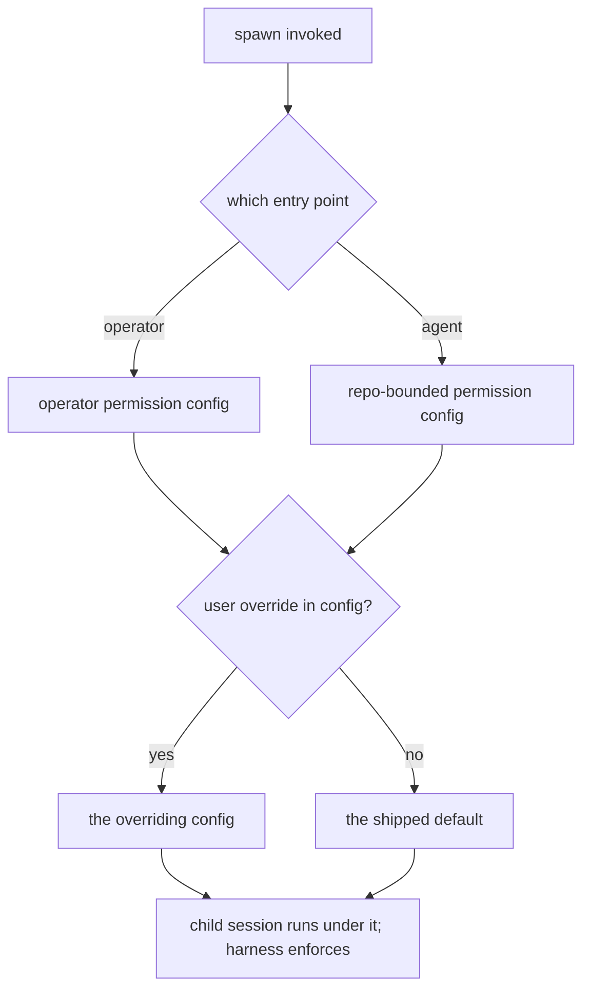
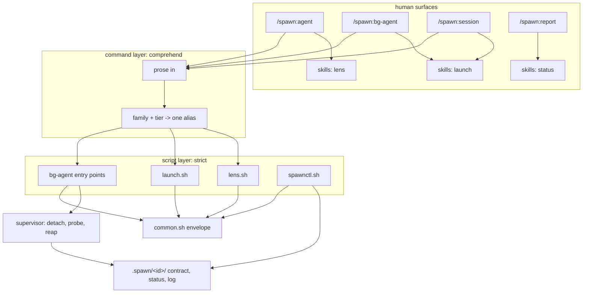

# Spawn Surfaces - Plan

## Goal Capsule

- **Objective:** Re-cut the `spawn` plugin's front door around four verbs — `agent`, `bg-agent`, `session`, `report` — add an unattended background agent, move the plugin's contract into the data where a Bash-only caller can reach it, keep the scripts reachable without a version-pinned path, and keep the report surface honest.
- **Product authority:** This plan owns the surfaces and the new background capability. It does not own the plugin rename (landed in `21f4d56` on `feature/gateway-plugin`) or the install flow (`feature/gateway-setup`).
- **Open blockers:** none. Every question that gated planning is answered: the ceiling mechanism is measured (`docs/spike-bg-agent-mechanism.md`), detachment costs no new dependency (KTD5), concurrency is settled at one job per worktree (KTD2), and the family→tier table is declared rather than inferred (KTD3). OQ2, OQ6 and OQ7 are deferred and named.

---

## Product Contract

### Summary

Replace the `lens`/`launch`/`status` command names with `/spawn:agent`, `/spawn:bg-agent`, `/spawn:session` and `/spawn:report`, each taking prose the reading agent resolves to one alias. Add `bg-agent`: a real agent loop with tools that works unattended against a contract, with a permission ceiling set by who invoked it and enforced by the harness. Move the plugin's machine-readable contract into its JSON output so a caller that cannot load a skill or a command can still discover it.

### Problem Frame

The plugin's six surfaces were shipped without ever being invoked. Driving them exposed a structural fault: commands and skills shared all three names, and the command won every time. The `SKILL.md` files — carrying the exit-code table, the untrusted-output rules and the spill handling — never loaded. Each command body then instructed the caller to "use the Skill tool to invoke `spawn:<name>`", which resolved back to the command, so an agent following the instruction literally went in a circle. It only ever appeared to work because each command also named the script path, and that was enough to finish the job.

The fault is not a gateway mistake. `token-bridge` — the template these skills were built from — collides on all five of its names, and `multi-slice-review` collides on its front door. Only `spinoff` avoids it, by naming commands for verbs (`start-session`, `start-split`) and the skill for the thing (`spinoff`).

Underneath the naming, the plugin's real consumer cannot read prose at all. A calling skill runs with `allowed-tools: Bash, Read`; it cannot invoke a skill or a slash command. Every affordance written into markdown is invisible to it. One fix already proved the shape: the untrusted-output rule was moved out of `SKILL.md` and into constant `content_trust` / `content_notice` fields on the lens's JSON, and a Bash-only subagent then derived the whole trust boundary from the JSON alone.

The plugin also has exactly one silent failure. A wrong Bash-allowlist rule does not error — the call parks on a permission prompt until someone notices. Today a human is watching. An unattended background agent removes the human — and unattended, the same wrong rule may not even park: a denied call can simply be skipped and the job finish as a hollow success. Either way nothing errors, so the job needs its own way to say it could not act, and that account cannot come from the model whose calls were denied.

### Key Decisions

- KD1. **Command names diverge from skill names.** Structural separation removes the shadowing rather than relying on name resolution that already behaved unexpectedly once. (session-settled: user-directed — chosen over renaming only the skills or deleting one layer: the user wants both layers and a new verb set.) Governs R1, R2, R3.
- KD2. **The machine-readable contract lives in the data, not the markdown.** The only consumer that matters cannot load either markdown surface; the `content_trust` precedent already proved a Bash-only caller will derive a contract from JSON. Reachability is part of the same contract: the JSON is useless to a consumer that cannot resolve and run the scripts in the first place. Governs R10, R11, R12, R13, R15, R16, R23.
- KD3. **Every surface stands alone.** No surface instructs a caller to reach another; each is complete for its own audience, which means each states what its verb actually does rather than pointing at whatever does it. (session-settled: user-directed — approach C + A chosen over keeping thin redirects that would now resolve.) Governs R3, R14, R20.
- KD4. **The permission ceiling is set by the caller, not the command.** A person typing a slash command is present and accountable; an agent spawning one autonomously is not, so absence of a human is what tightens the ceiling. (session-settled: user-directed.) Governs R7, R8.
- KD10. **The ceiling is a permission config the spawned session runs under, not a rule the plugin polices.** A spawned session is itself a Claude Code session with its own permission settings, so the harness enforces the bound and the plugin only chooses which config to hand down. The plugin ships defaults; a user overrides them in config, through the harness's own agent defaults, or by editing the file. (session-settled: user-directed — chosen over the plugin inventing its own sandbox.) Governs R7, R8, R25.
- KD5. **A background agent works in a scratchpad inside the current worktree.** (session-settled: user-directed — chosen over a separate git worktree and over inheriting the caller's full permissions unchanged.) Governs R6, R7.
- KD6. **The command layer comprehends; the script layer parses.** Everything after the command is prose. The agent reading the command works out the family and tier from it and hands the script exactly one resolved alias, so the scripts keep their strict single-alias interface and no argument grammar has to distinguish a tier from the first word of a task. (session-settled: user-directed — chosen over a positional or flag grammar.) Governs R4, R5.
- KD11. **A background job is given a contract before it starts.** Definition of done and deliverables are stated up front, so completion is checked against something rather than accepted on the model's account of itself. Pairs with KD9: the supervisor checks the deliverables, the model narrates. (session-settled: user-directed.) Governs R6, R21, R22, R26.
- KD7. **The allowlist fix (R15, R16) ships before or with `bg-agent`.** An unattended job that hits a wrong rule fails with nobody watching, and the absent result is the only symptom. Governs R9.
- KD8. **The status surface must not cry wolf.** The first drive produced drift false alarms a human had to debunk (F4 in the surface-drive findings); a status surface that over-reports gets ignored, so it reports only genuine drift and answers in prose a human can read. Governs R17, R18.
- KD9. **What the plugin knows, the plugin says; what the model says is quoted.** Job lifecycle, permission denials and observed effects are facts the plugin can establish itself; only narrative is model-authored. A model whose calls were denied cannot be the witness to its own denial. Governs R19, R21.
- KD13. **A background job edits the working tree; the scratchpad holds its own artifacts.** The contract, the log, the supervisor's record and any produced deliverables live in the job directory; the work itself lands in the repository where it is useful. (session-settled: user-directed — chosen over writing only to a scratchpad and over giving each job its own git worktree: the motivating example, fixing failing tests, is not expressible under scratchpad-only.) Governs R7.

### Actors

- A1. **Operator** — the person typing a slash command. Present, accountable, can answer a permission prompt.
- A2. **Calling agent** — a skill or subagent that shells out to `lib/*.sh`. Runs with `Bash, Read`; cannot load a skill or a command.
- A3. **Spawned model** — the third-party model on the far side of the gateway. Answers only (`agent`), or holds tools and acts (`bg-agent`, `session`).
- A4. **Superagent Gateway** — the local process serving the aliases. Not renamed, not owned by this plan.

### Requirements

**Command surface**

- R1. The plugin exposes commands named `agent`, `bg-agent`, `session` and `report`, none of which matches any skill name.
- R2. The skills keep the names `lens`, `launch` and `status`, and remain reachable by those names.
- R3. No command body instructs the caller to invoke a skill or another command; each body is sufficient on its own.
- R4. Everything after the command is prose. The agent reading the command derives the model family and tier from it — including hyphenated tiers such as `gpt sol-pro` — and invokes the script with exactly one resolved alias; the scripts keep their one-alias, no-fan-out interface. Prose naming no family runs against the default alias. Prose naming a family or tier the gateway does not serve fails with a message naming the aliases available, rather than silently falling back.
- R5. Prose that names a model but asks for nothing, or asks for something but names no model, is answerable: the command states what it does in each case rather than leaving the caller to infer it.
- R20. Each verb's behavior is stated normatively: `agent` runs one tool-less turn and returns the answer as data; `session` creates and seeds a resumable session and returns a handle; `bg-agent` starts a supervised asynchronous loop against a contract and returns a job handle; `report` answers whether the gateway is up and what it serves.
- R24. Whatever prose the agent passes on reaches the model byte-for-byte. It travels by stdin or a file, never argv; arguments are passed as an array without `eval`; and quotes, newlines, leading dashes and shell metacharacters survive intact.

**Background agent**

- R6. `bg-agent` runs a full agent loop with tools against a named alias and a contract (R26), returns control immediately with a job handle, and notifies on completion. The executable that provides it is named in the plan's implementation, and appears in the `--describe` contract alongside the existing scripts.
- R7. A `bg-agent` job writes inside a scratchpad directory in the current worktree. The plan states the scratchpad's location, which roots the job may write to, whether its output is applied to the repository or staged for review, and when it is cleaned up.
- R8. The permission ceiling for a spawn is set by its caller: an operator-invoked spawn gets the operator's full permissions by default; an agent-invoked spawn gets the repo-bounded ceiling. The two ceilings are reached through separately permissioned entry points, so the distinction is one the harness can enforce, not a flag the caller asserts about itself.
- R25. A ceiling is expressed as the permission configuration the spawned session runs under, and the harness enforces it. The plugin ships a default configuration per ceiling and does not police the bound itself. A user overrides the defaults in configuration, through the harness's agent defaults, or by editing the file directly; the plugin never edits a user's own settings to do it. The repo-bounded default denies the paths that are inside a repository yet outside any sane ceiling — version-control internals and hooks, agent configuration, and symlinks resolving outside the tree.
- R26. A `bg-agent` job is given a contract before it starts: what done means, and what it must hand back. The supervisor checks the deliverables against that contract, and a job whose deliverables are absent is not reported as done however the model describes its own work.
- R9. A `bg-agent` job never waits on a permission decision nobody is there to make: it runs in a mode where a prompt cannot silently park it. A job whose tool calls are denied by its ceiling is reported degraded rather than finishing as a silent success — measured, a fully-denied child returns success and exit 0, so the child's own exit status is never evidence that work happened. What counts as degraded is defined observably: the signals watched, the thresholds applied, and which component classifies them. A tool removed by a deny rule is never attempted and leaves no denial to observe; a tool present but refused does. Both must be covered.
- R19. Narrative a `bg-agent` job hands back — the model's account of what it did or wants — is model-authored and carries the same untrusted-content marking the lens's response already carries (`content_trust`); it is never relayed as an instruction. This holds for the completion notification as well as the result, which means the notification travels in a structured envelope rather than as bare text.
- R21. Job lifecycle and observed effect are established by the supervisor, not the model: start and end time, terminal state, exit status, permission denials, which files changed, and which of the contract's deliverables are present. These are trusted fields alongside the untrusted narrative of R19.
- R22. A job handle is usable. The plan defines the operations a holder can perform on it — at least query state, await completion, retrieve the result against its contract, and cancel — including terminal states and the behavior for an unknown or expired handle.

**Agent-facing contract**

- R10. Each script answers `--describe` on stdout at exit 0 with its flags, the exit enum and the fields of its response.
- R11. `--help` is distinguishable from a usage error by a machine, without parsing prose and without a new exit code — the frozen enum stays frozen, so the discriminator is a field in the response.
- R12. Every error names its remedy, extending the existing `no_text_truncated` standard.
- R13. The lens's response states that the model saw only the caller's single message and had no ability to fetch anything.
- R14. One canonical source states the contract, and every surface projects from it. A test asserts the projections agree on named fields — not that their prose matches.
- R23. Every response shares one envelope: a schema version, whether the call succeeded, the error and its remedy when it did not, the trust marking, and an operation-specific payload. Success, error, help, describe, handle and job-state responses are all shapes of it.

**Invocation path**

- R15. A consumer in another plugin can resolve and run the plugin's scripts without hard-coding a version-pinned path.
- R16. The allowlist entry a user must add names a stable, narrowly scoped entry point that survives a version upgrade. Solving the version problem by wildcarding a cache directory is not acceptable — it would authorize whatever else lands under that path. No such stable path exists today (see Dependencies and Assumptions).

**Human-facing report**

- R17. `/spawn:report` reports only genuine drift. Whether two aliases are the same thing is decided from what the gateway says they resolve to, not from one name being a prefix of another — a new model served under a prefixed name is real drift and must still be reported.
- R18. `/spawn:report` answers in prose a human can read, and keeps the machine-readable response intact underneath it. The prose is a rendering of the data, not a replacement for it.

### Key Flows

- F1. Operator runs a background agent
  - **Trigger:** A1 types `/spawn:bg-agent have kimi k3 fix the failing tests in lib/ and leave the suite green`.
  - **Actors:** A1, A3, A4
  - **Steps:** The agent reads the prose, resolves `kimi k3` to one alias and the rest to a contract; a scratchpad is prepared in the current worktree; the job starts at A1's ceiling through the operator entry point, under that ceiling's permission configuration; a job handle returns immediately; A1 is notified on completion.
  - **Outcome:** A1 holds a handle, a supervisor-authored account of what changed and which deliverables are present, and the model's own narrative marked as untrusted.
  - **Covered by:** R1, R4, R6, R7, R8, R19, R21, R22, R25, R26

- F2. A skill spawns an agent autonomously
  - **Trigger:** A2 shells out to the background-agent entry point during its own run.
  - **Actors:** A2, A3
  - **Steps:** The script runs the job at the repo-bounded ceiling, because A2 reached it through the agent entry point and that entry point hands the child the repo-bounded permission configuration; a job handle returns in the standard envelope.
  - **Outcome:** A2 holds a handle it can query, await, or cancel, and the harness holds the job to the repo-bounded ceiling.
  - **Covered by:** R6, R7, R8, R22, R23, R25

- F3. A Bash-only caller learns the contract
  - **Trigger:** A2 needs to know what exit 5 means and which response fields exist.
  - **Actors:** A2
  - **Steps:** A2 runs the script with `--describe`, reads flags, the exit enum and the response fields from stdout, and branches on them.
  - **Outcome:** A2 reconciles against the running version instead of a hard-coded copy.
  - **Covered by:** R10, R11, R23

### Acceptance Examples

- AE1. **Covers R4.** Given the gateway serves `kimi` and `k3` as peers, when prose names `kimi k3`, then the request goes to the `k3` alias.
- AE2. **Covers R4.** Given prose naming `kimi` and no tier, then the request goes to the family's default alias, not to an error.
- AE3. **Covers R4.** Given prose naming a family the gateway does not serve, then the call fails with a message listing the served aliases rather than falling back to the default.
- AE8. **Covers R4, R24.** Given prose whose task text happens to contain a tier name (`review the sol-pro migration`), then the alias is taken from what the prose asks for, not from the token matching; given prose containing quotes, newlines and a leading dash, then the model receives it unchanged.
- AE4. **Covers R8, R25.** Given a spawn reaching the operator entry point, then the child runs under the operator's permission configuration; given a spawn reaching the agent entry point, then the child runs under the repo-bounded configuration.
- AE10. **Covers R25.** Given a job at the repo-bounded ceiling attempting to write a version-control hook, an agent-configuration file, or through a symlink resolving outside the tree, then the harness denies it.
- AE5. **Covers R9.** Given a background job that reaches a tool call needing permission, then it does not wait on a prompt; given a job whose tool calls are denied by its ceiling, then it is reported degraded rather than completing as a clean success.
- AE9. **Covers R19, R21, R26.** Given a completed job, then the changed-file list, terminal state and which deliverables are present come from the supervisor and are marked trusted, while the model's account of its own work is marked untrusted; given a job whose contract names a deliverable that is absent, then it is not reported done however the model describes it.
- AE6. **Covers R11.** Given a caller runs `--help` and separately makes a usage error, then the two are distinguishable by a response field, both still exiting 2.
- AE7. **Covers R17.** Given the gateway serves `claude-gpt` and `gpt` resolving to the same model and the table carries `gpt`, then `claude-gpt` is not reported as drift; given a `claude-gpt` that resolves to a different model, then it is reported.

### Permission resolution

### Scope Boundaries

- The plugin rename from `gateway` to `spawn` — landed in `21f4d56` on `feature/gateway-plugin`. This plan consumes it.
- The install flow, token capture and per-harness config, including any `setup` command — owned by `feature/gateway-setup`.
- The Superagent Gateway itself. Its binary, config, alias definitions and shared state paths are unchanged.
- Fixing the same command-and-skill name collision in `plugins/token-bridge` and `plugins/multi-slice-review` — see OQ2.

### Dependencies and Assumptions

- Depends on the rename in `21f4d56` being merged or rebased under this work.
- R25's mechanism is proven, not assumed — see `docs/spike-bg-agent-mechanism.md`. A child launched from a session that broadly allows shell access could not run a shell command once `user` was dropped from `--setting-sources`, and the control arm with the same prompt did run it. `--settings` carries the ceiling, `--setting-sources` minus `user` strips the operator's own, and `--permission-mode` supplies the no-prompt guarantee. Which exact combination expresses each ceiling is a planning choice; that the mechanism bites is now measured.
- The caller-derived ceiling is only as strong as the mechanism that derives it. R8 routes the two ceilings through separately permissioned entry points precisely so the harness decides which one a caller may reach, rather than the caller asserting its own identity in argv — a flag would be self-declared and any agent able to run the script could claim to be the operator.
- The caller is only one of two parties. A2 invoking the script is a self-shoot risk; A3, the spawned model, is a third party by definition. R25 is what covers the second party: the bound on A3 is a permission configuration the harness enforces, not a rule the plugin asks the model to respect. Within that bound the model still reads whatever the worktree contains, secrets included — R25 denies execution-bearing paths, not readable ones.
- No stable install path exists yet: installed plugin files live under version-embedded cache directories, and the plugin cannot write outside its own tree (the README says as much about the allowlist entry). R16 is therefore satisfied either by the install flow owned by `feature/gateway-setup` or by this plan claiming that one slice of the install surface; which, is settled at planning, and it is a single owner either way.
- Prose comprehension at the command layer (R4) is judgement, not parsing. Naming a family the gateway does not serve fails loudly rather than falling back, which keeps the failure visible; but a caller whose prose is ambiguous between two served aliases gets whichever the reading agent picked. The determinism lives one layer down, where the script takes one resolved alias and nothing else.

### Outstanding Questions

**Resolve before planning**

- OQ4. Whether concurrent jobs in one worktree are permitted, how each job's changes are attributed, and what happens when two of them — or a job and the operator — reach the same file. KD13 makes this load-bearing: jobs edit the working tree, so they can collide. The rest of OQ4 is settled — a job carries a contract (R26), what it returns is measured against that contract by the supervisor (R21), and process ownership is answered in `docs/spike-bg-agent-mechanism.md`: `set -m` plus `nohup` detaches into the job's own process group in pure bash, liveness is probed rather than read from a file, and reaping escalates TERM to KILL behind an argv identity check.

**Deferred to planning**

- OQ2. Does the surface-naming rule in KD1 become a repo-wide convention, and do `token-bridge` and `multi-slice-review` get fixed to match? Answering it does not block this plan; leaving it unanswered leaves two siblings with the same fault.
- OQ6. What bounds an unattended job: maximum runtime, resource ceilings, how long results and scratchpads are retained, and what collects an abandoned job.
- OQ7. Where a user's ceiling override lives and what it can express (R25) — a file the plugin reads, the harness's own agent defaults, or both — and what happens when an override widens a ceiling the plugin shipped narrow.

### Sources

- `docs/surface-drive-findings.md` — the first invocation of the surfaces; F1 (the shadowing, with its `$ARGUMENTS` proof), F2 (script modes), F3 (`--help` exit 2, no `--describe`), F4 (the drift false alarms).
- `docs/residual-review-findings/feature-gateway-plugin.md` — the same shadowing finding reached independently in a second worktree, plus the spill-file and argv-seed residuals.
- `docs/plans/2026-08-06-001-feat-gateway-plugin-plan.md` — KD1, KD3, KTD2 (the frozen exit enum), and U5, which specified the command-fronts-skill shape this plan replaces.
- `plugins/spawn/README.md` — the allowlist section, including the version-in-path stall and the note that the plugin cannot write the entry for the user.
- `plugins/spinoff/` — the sibling that avoids the name collision; `plugins/token-bridge/` — the template that carries it.
- `docs/spike-bg-agent-mechanism.md` — measured evidence for R25 and the detachment mechanism; also the record that a fully-denied child returns success.

**Product Contract preservation:** unchanged in meaning. Requirements added this session by user direction (R19–R26 and the caller-aware ceiling), no requirement weakened or removed, all stable IDs intact.

---

## Planning Contract

### Key Technical Decisions

- KTD1. **Two stages, independently landable.** The command re-cut, the contract-into-data work, the invocation path and the report surface ship first; `bg-agent` follows. The first group is evidenced and low-risk, `bg-agent` carries every remaining unknown, and coupling them delays all of it. Governs the unit ordering, not a requirement.
- KTD2. **One `bg-agent` job at a time per worktree, enforced by a lock.** A second spawn is refused and returns the running job's handle. Answers OQ4's concurrency half deterministically instead of building path leases against a hypothesis, and makes attribution free — only one job could have made the changes. Different worktrees hold different locks and run freely. Reuses `spawnctl.sh`'s idempotent-locked-start idiom. Governs R7, R22.
- KTD3. **Families and tiers are declared in `lib/models.json`, not inferred.** Today the table is flat and `k3` is only relatable to `kimi` through the upstream model string `moonshotai/kimi-k3`; `gpt` matching `gpt-sol` is coincidence. A new declared block names each family, its tiers and its default. Resolves OQ5. Governs R4.
- KTD4. **`bg-agent` refuses a chain alias.** `default` is a chain, so a long-running job could change model on fallback, and the table deliberately under-declares a chain's context window to its smallest route. Acceptable for one turn, not for an hour holding tools. Governs R4, R6.
- KTD5. **Detach with `set -m` plus `nohup`; no new runtime interpreter.** Job control gives the job its own process group in pure bash, verified under `/bin/bash` 3.2. `setsid(1)` is absent on macOS and the alternative needs python or perl at runtime, which the project has already rejected for Node. Governs R6.
- KTD6. **Liveness is probed; the status file is a claim.** After a kill the file still read `running`, because the writer was what died. State is established by `kill -0` plus an argv identity check, the same way `spawnctl.sh` probes the gateway rather than trusting its pidfile. Governs R21, R22.
- KTD7. **The envelope lives in `lib/common.sh` and covers all three encoder tiers.** Each script currently hand-rolls its own field set in `emit_error`, plus a jq-less pure-bash fallback, plus a hardcoded string inside `need_jq`. Any envelope missing a tier drifts. Governs R23.
- KTD8. **Terminal states are a closed set:** `done`, `degraded`, `failed`, `cancelled`. `done` requires the contract's deliverables present; a job that ran clean but produced nothing named is `degraded`, not `done`. Governs R9, R21, R22, R26.
- KTD9. **A contract's deliverables are file-shaped, plus an optional verification command the supervisor runs itself.** The supervisor can check a path exists; it cannot judge "the suite is green" without running something, and KD9 bars the model from witnessing it. Deliverables are captured against a pre-job baseline so a pre-existing file cannot satisfy a contract. Governs R21, R26.
- KTD10. **Every new script joins the existing computed-scope lints.** The terminal-sink lint iterates `lib/*.sh`, so a new entry point is covered automatically; the no-spend and no-write lints are enumerated and must be extended by hand. Governs R14.

### High-Level Technical Design

The two entry points for `bg-agent` are the whole of R8: one is allowlisted for a
person, one for an agent, and each hands its child a different permission
configuration. Nothing downstream asks who called.

---

## Implementation Units

### Stage 1 — the evidenced work

### U1. Re-cut the command surface

- **Goal:** four commands, none sharing a skill name, each carrying its own instructions.
- **Requirements:** R1, R2, R3, R20. Covers KD1, KD3.
- **Dependencies:** none.
- **Files:** create `plugins/spawn/commands/{agent,bg-agent,session,report}.md`; delete `plugins/spawn/commands/{lens,launch,status}.md`; edit `plugins/spawn/skills/spinoff`-style guard into `plugins/spawn/skills/{lens,launch,status}/SKILL.md`; `plugins/spawn/tests/unit/surfaces.bats` (new).
- **Approach:**
  1. Each command body states what its verb does, names the script it runs, and names its branch conditions — the shape of `plugins/multi-slice-review/commands/multi-slice-review-round.md`, not a redirect.
  2. Delete every `Use the Skill tool to invoke:` line.
  3. Add the `plugins/spinoff/skills/spinoff/SKILL.md` command-invoked-only clause to each SKILL.md so the skills stay reachable by name without re-colliding.
- **Patterns to follow:** `plugins/multi-slice-review/commands/multi-slice-review-round.md` for an inline body; `plugins/spinoff/skills/spinoff/SKILL.md:2-5` for the guard clause.
- **Test scenarios:**
  - No command filename matches any skill directory name.
  - No command body contains the string `Use the Skill tool to invoke`.
  - Each command's frontmatter carries a `description`, and each body names the script it runs.
  - `claude plugin validate` output contains `Validation passed` (its exit code lies).
- **Verification:** the four commands resolve under the `spawn:` namespace and the three skills still resolve by their own names.

### U2. Declare families and tiers; comprehend prose

- **Goal:** prose in, one alias out, with families and tiers declared rather than inferred.
- **Requirements:** R4, R5, R24. Covers KD6, KTD3, KTD4.
- **Dependencies:** U1.
- **Files:** `plugins/spawn/lib/models.json`, `plugins/spawn/lib/spawnctl.sh` (table normalization), `plugins/spawn/commands/*.md`, `plugins/spawn/tests/unit/models.bats` (new).
- **Approach:**
  1. Add a declared families block to `models.json` naming each family, its tiers and its default alias. Keep the existing flat `aliases` map as the metadata table it already is.
  2. `table_json()` normalizes the new block's shape the way it already normalizes `aliases` — a malformed block collapses to empty rather than erroring inside a downstream jq program.
  3. Command bodies instruct the reading agent to resolve prose to one alias and to fail loudly, naming the served aliases, when a family or tier is unserved.
  4. `bg-agent` refuses a chain alias.
- **Patterns to follow:** `plugins/spawn/lib/spawnctl.sh:759-768` (`table_json` shape normalization); `plugins/spawn/lib/launch.sh:368-385` (reading the table, warning rather than failing when metadata is absent).
- **Test scenarios:**
  - Covers AE1. `kimi k3` resolves to the `k3` alias.
  - Covers AE2. A bare family resolves to its declared default.
  - Covers AE3. An unserved family fails with the served aliases named, and does not fall back to the default.
  - Covers AE8. Task text containing a tier name does not change the resolved alias, and prose containing quotes, newlines and a leading dash reaches the model unchanged.
  - A malformed families block leaves the drift computation working rather than erroring.
  - A chain alias passed to `bg-agent` is refused; the same alias to `agent` is accepted.
- **Verification:** every alias the gateway serves is reachable through the declared grammar, hyphenated tiers included.

### U3. One envelope in `common.sh`

- **Goal:** every response from every script shares one shape.
- **Requirements:** R23. Covers KD2, KTD7.
- **Dependencies:** none (can land before or after U1).
- **Files:** `plugins/spawn/lib/common.sh`, `plugins/spawn/lib/{lens,launch,spawnctl}.sh`, `plugins/spawn/tests/unit/envelope.bats` (new).
- **Approach:**
  1. Add the envelope to `common.sh` alongside `emit()`: schema version, `ok`, `error`, `remedy`, trust marking, and an operation payload.
  2. Convert all three tiers in each script — the jq success emit, the jq `emit_error`, and the pure-bash fallback — plus the hardcoded string in `need_jq`.
  3. Reconcile `spawnctl.sh`'s prose `error` field to the enum shape lens and launch use, and re-check the preflight rewrapping at `lens.sh:312-335` and `launch.sh:299-320` now that forwarding is safe.
- **Patterns to follow:** `plugins/spawn/lib/common.sh:47-53` (`emit` and its empty-payload guard); the three-tier encoders at `lens.sh:97-119`, `:117`, `:175-181`.
- **Execution note:** the pure-bash fallback exists for the no-jq case; test it by making `jq` unavailable rather than by reading the code.
- **Test scenarios:**
  - Every script's success, error, help and describe responses parse and carry the same required fields.
  - With `jq` absent, the fallback still emits one parseable object with the envelope's required fields.
  - `EMITTED` is honoured — no script emits twice.
  - A preflight failure surfaces one enum value the caller can switch on, not prose.
- **Verification:** a Bash-only consumer can branch on the same field names regardless of which script it called.

### U4. Make the contract answerable at runtime

- **Goal:** a caller can ask the script what it supports instead of hard-coding it.
- **Requirements:** R10, R11, R12, R13, R14. Covers KD2, KTD10.
- **Dependencies:** U3.
- **Files:** `plugins/spawn/lib/{lens,launch,spawnctl}.sh`, `plugins/spawn/tests/unit/describe.bats` (new), `plugins/spawn/tests/unit/lens.bats`.
- **Approach:**
  1. Add a `--describe` arm to each parser emitting flags, the exit enum and the response fields at exit 0.
  2. Give help its own discriminator field so it is distinguishable from a usage error without changing either exit code — the enum stays frozen.
  3. Audit every `die` site for a remedy, extending the `no_text_truncated` standard, and keep the no-spend vocabulary in mind while wording them.
  4. Add the lens's no-tools, prompt-is-everything statement to its response.
  5. Add the agreement test: `--describe` and the command bodies name the same fields.
- **Patterns to follow:** the `-h|--help` arm at `lens.sh:222` and `launch.sh:237`; the remedy wording at `lens.sh:528-533`, including its comment about bending the wording rather than the lint.
- **Test scenarios:**
  - Covers AE6. `--help` and a usage error are distinguishable by a response field; both still exit 2.
  - `--describe` exits 0 and its declared exit enum matches the constants the script actually defines.
  - `--describe` answers with the gateway down and with no config present.
  - Every error value carries a non-empty remedy.
  - The no-spend lint still passes over the new prose.
  - The agreement test fails when a field is renamed in one surface only — verify by mutating one.
- **Verification:** a caller reconciles against the running version rather than a copied table.

### U5. A stable path to allowlist

- **Goal:** an allowlist rule that survives a version upgrade.
- **Requirements:** R15, R16. Covers KD2, KD7.
- **Dependencies:** none.
- **Files:** `plugins/spawn/README.md`, `plugins/spawn/tests/unit/lens.bats`, plus whatever shim the approach lands on.
- **Approach:**
  1. Provide a stable, narrowly scoped entry point whose path carries no version component, and document deriving the rule from it.
  2. Rewrite the README allowlist section — it still names `gateway` at lines 142, 148 and 154 after the rename.
  3. **Update `tests/unit/lens.bats:674-676` in the same commit.** It asserts the README contains `plugins/cache/*/gateway/*/lib/lens.sh`; rewriting the prose alone turns the suite red for the wrong reason.
  4. Do not solve the version problem by wildcarding a cache directory — that authorizes whatever else lands there.
- **Patterns to follow:** the existing allowlist lint at `plugins/spawn/tests/unit/lens.bats:644-677`, which already forbids any executable reference under `marketplaces/`.
- **Test scenarios:**
  - The README contains no executable reference to a version-pinned path, and none to `marketplaces/`.
  - The documented rule matches the documented invocation byte-for-byte.
  - The lint catches a reintroduced version-pinned rule — verify by planting one.
- **Verification:** the documented rule still matches after a version bump.

### U6. Make the report honest and readable

- **Goal:** drift that is real, in prose a person can read.
- **Requirements:** R17, R18. Covers KD8.
- **Dependencies:** U1, U3.
- **Files:** `plugins/spawn/lib/spawnctl.sh`, `plugins/spawn/commands/report.md`, `plugins/spawn/tests/unit/gatewayctl.bats`.
- **Approach:**
  1. Decide alias equivalence from what the gateway says each alias resolves to. `$cfg[alias].model` is already in scope in the same jq program as the drift computation.
  2. Keep the machine-readable response intact; the command body renders it.
- **Patterns to follow:** `plugins/spawn/lib/spawnctl.sh:1003-1018` (the three drift classes) and `:284-300` (the config-model reducer that fails safe to empty).
- **Test scenarios:**
  - Covers AE7. Two aliases resolving to the same model are not drift; a prefixed alias resolving to a different model is.
  - An alias the gateway serves but whose resolution is unavailable is reported as unknown, not silently as equivalent.
  - The response still parses as one object with the machine-readable fields present.
- **Verification:** against the live gateway's 18 aliases, the drift block is empty.

### Stage 2 — the background agent

### U7. The job record

- **Goal:** a job that outlives the session that started it, and can be found again.
- **Requirements:** R7. Covers KD5, KD13, KTD2, KTD6.
- **Dependencies:** U3.
- **Files:** `plugins/spawn/lib/` (new job-record helpers), `plugins/spawn/tests/unit/jobs.bats` (new).
- **Approach:**
  1. A job directory per job holding the contract, an append-only log, and a status file.
  2. A per-worktree lock; a second spawn is refused and returns the running job's handle.
  3. Liveness by probe — `kill -0` plus an argv identity check — never by reading the status file.
- **Patterns to follow:** `plugins/spawn/lib/spawnctl.sh:601-638` (`pid_is_gateway` argv verification), `:863-938` (stale and recycled-pid refusals), `:692-702` (pidfile beside its binary record).
- **Test scenarios:**
  - A job directory is created 0700 and its log is append-only and readable while the job runs.
  - A second spawn in the same worktree is refused and names the running handle.
  - A spawn in a different worktree is not refused.
  - A status file saying `running` for a dead pid resolves to a terminal state, not `running`.
  - A recycled pid whose argv does not match is not treated as the job.
- **Verification:** a job is discoverable and correctly classified after the launching shell has exited.

### U8. Two entry points, two ceilings

- **Goal:** the ceiling a job runs under is decided by which door it came through.
- **Requirements:** R8, R25. Covers KD4, KD10.
- **Dependencies:** U7.
- **Files:** `plugins/spawn/lib/` (two entry points), shipped permission configs, `plugins/spawn/tests/unit/ceilings.bats` (new), `plugins/spawn/README.md`.
- **Approach:**
  1. Two entry points, separately allowlistable, each handing the child a different permission configuration.
  2. The repo-bounded configuration drops `user` from the child's setting sources and denies version-control hooks, agent configuration and symlinks resolving outside the tree.
  3. The child runs in a mode where a prompt cannot park it.
- **Patterns to follow:** `plugins/spawn/lib/launch.sh:415-423` (the child invocation, and why env is exported inside the subshell rather than prefixed).
- **Execution note:** assert by file side-effect, never on the model's prose — a text assertion passed in both arms during the spike because the model quotes the command back.
- **Test scenarios:**
  - Covers AE4. A job through the operator entry point runs at the operator's ceiling; through the agent entry point, repo-bounded.
  - Covers AE10. Under the repo-bounded ceiling, writing a version-control hook, an agent-configuration file, or through an escaping symlink is denied.
  - A child launched from a session that allows shell access cannot run one when `user` is dropped from its sources — and the control arm, same prompt, can.
  - No permission prompt is ever waited on.
- **Verification:** the denied arm produces no side effect while the control arm does.

### U9. The supervisor

- **Goal:** a job that is detached, watched, classified honestly, and reapable.
- **Requirements:** R6, R9, R21, R26. Covers KD9, KD11, KTD5, KTD8, KTD9.
- **Dependencies:** U7, U8.
- **Files:** `plugins/spawn/lib/` (supervisor), `plugins/spawn/tests/unit/supervisor.bats` (new), `plugins/spawn/tests/fixtures/fake-claude.sh`.
- **Approach:**
  1. Detach with `set -m` plus `nohup` so the job holds its own process group; redirect all three streams.
  2. Capture a pre-job baseline so deliverables are measured against it and a pre-existing file cannot satisfy a contract.
  3. On completion, establish the trusted fields — times, terminal state, exit status, denials, changed files, deliverables present — and classify per the terminal-state set. Never take the child's exit status as evidence of work.
  4. Run the contract's optional verification command and record its exit code.
  5. Reap with TERM, a bounded poll, then KILL.
- **Patterns to follow:** `plugins/spawn/lib/launch.sh:404-437` (the poll-and-reap loop, and why a detached watchdog was rejected — this unit deliberately revisits that, which is why the process group matters), `:148-160` (`reap_child`), `:476-491` (announced-but-broken is never success).
- **Execution note:** `FAKE_CLAUDE_MODE=hang` already writes its pid then sleeps; it is the instrument for the deadline and reap assertions. A new fixture mode needs a test in `tests/unit/fixtures.bats`.
- **Test scenarios:**
  - Covers AE5. A job whose calls are denied is reported degraded, not done; no job waits on a prompt.
  - Covers AE9. Changed files, terminal state and deliverable presence come from the supervisor and are trusted; a job whose contract names an absent deliverable is not done however the model describes it.
  - A job survives a TERM aimed at the launcher's process group.
  - A deliverable that already existed before the job does not satisfy the contract.
  - A job cancelled mid-flight is reaped, reaches `cancelled`, and leaves no orphan.
  - Cancel after a terminal state is a no-op, not an error.
  - A verification command that fails leaves the job not-done, with its exit code recorded.
  - `wait -n` appears nowhere — the harness must run under `/bin/bash` 3.2.
- **Verification:** every terminal state is reachable in tests, and no test leaves a stray process.

### U10. The handle is usable

- **Goal:** a holder can do something with what they were given.
- **Requirements:** R22. Covers KTD2, KTD6, KTD8.
- **Dependencies:** U9.
- **Files:** `plugins/spawn/lib/` (handle operations), `plugins/spawn/tests/unit/handle.bats` (new).
- **Approach:** query state, await completion with a bound, retrieve the result against its contract, cancel. An unknown or expired handle is a named error with a remedy, not a crash.
- **Test scenarios:**
  - Each operation on a running, a finished, and an unknown handle.
  - Await returns on completion and on its own bound, distinguishably.
  - An expired handle is distinguishable from one that never existed.
  - Every operation's response carries the envelope.
- **Verification:** a Bash-only caller can poll a job to completion using only `--describe` and the handle.

### U11. The model narrates; the plugin reports

- **Goal:** nothing a third-party model wrote is presented as fact or followed as instruction.
- **Requirements:** R19. Covers KD9.
- **Dependencies:** U9.
- **Files:** `plugins/spawn/lib/` (job result and notification), `plugins/spawn/tests/unit/supervisor.bats`.
- **Approach:** the model's account carries the same trust marking the lens's response already carries, and the notification travels in the envelope rather than as bare text.
- **Patterns to follow:** `plugins/spawn/lib/lens.sh:566-598` — the trust constants are literals inside the jq program so the far side cannot forge or suppress them.
- **Test scenarios:**
  - The narrative field carries the untrusted marking; the supervisor's fields do not.
  - A narrative containing an instruction is still returned as data, and no consumer path executes it.
  - The completion notification parses as the envelope.
- **Verification:** a consumer can tell, per field, what the plugin established from what the model claimed.

### U12. Jobs appear in the report

- **Goal:** a running job is perceptible without knowing its handle.
- **Requirements:** R18 (extended to jobs). Covers KD8, KD12-in-spirit.
- **Dependencies:** U6, U7.
- **Files:** `plugins/spawn/lib/spawnctl.sh`, `plugins/spawn/commands/report.md`, `plugins/spawn/tests/unit/gatewayctl.bats`.
- **Approach:** the report lists jobs with their alias, age, state and last activity, read from the job records and classified by probe rather than by trusting a status file.
- **Test scenarios:**
  - A running job appears; a finished one appears with its terminal state.
  - A job whose process is gone but whose status file says running is reported by its probed state.
  - With no jobs, the report is unchanged from today's shape.
- **Verification:** `/spawn:report` answers "what is running" without a handle in hand.

---

## Verification Contract

| gate | command | applies to |
|---|---|---|
| unit suites | `plugins/spawn/tests/run-tests.sh unit` | U1–U12 |
| harness self-check | `plugins/spawn/tests/run-tests.sh self-check` | all — proves a suite can fail |
| wire smoke | `plugins/spawn/tests/run-tests.sh smoke` | version sync, `claude plugin validate`, agent-consumer parity, secret scan |
| everything | `plugins/spawn/tests/run-tests.sh all` | before any PR |
| live lens | prose through `/spawn:agent` against a served alias | U2, U4 |
| live job | a `bg-agent` job to a terminal state, then `/spawn:report` | U7–U12 |

There is no CI in this repo — `run-tests.sh` is the whole verification contract.
New suites are auto-discovered by glob, so no registration is needed. Each new
entry point must be added to the enumerated no-spend and no-write lints; the
terminal-sink lint picks it up automatically.

---

## Definition of Done

- All 26 requirements are implemented or explicitly deferred in this document.
- `run-tests.sh all` passes, including the self-check and the secret scan reporting ACTIVE.
- No command filename matches a skill directory name, and no command body redirects to a skill.
- Every script answers `--describe` at exit 0, and its declared enum matches its constants.
- A `bg-agent` job reaches each terminal state in tests, leaves no stray process, and its trusted fields come from the supervisor.
- A repo-bounded job cannot write a version-control hook, agent configuration, or through an escaping symlink — proven by side-effect, with a passing control arm.
- The README's allowlist section and the test that pins it agree, and neither names a version-pinned path.
- `/spawn:report` shows the live gateway with an empty drift block and lists jobs.
