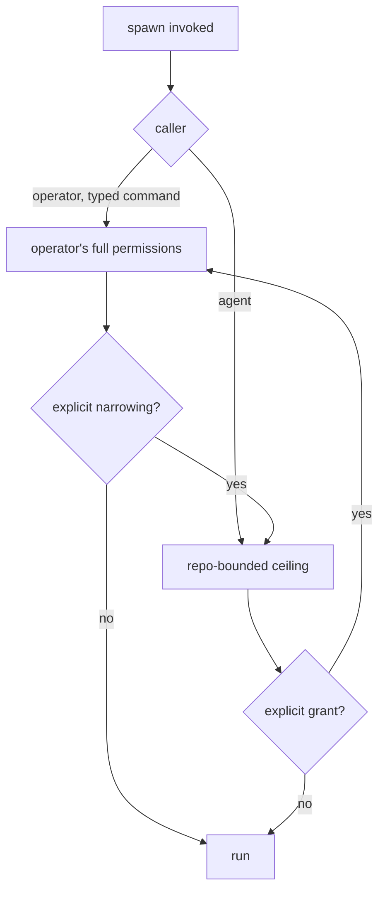

# Spawn Surfaces - Plan

## Goal Capsule

- **Objective:** Re-cut the `spawn` plugin's front door around three verbs — `agent`, `bg-agent`, `session` — add an unattended background agent, and move the plugin's contract into the data where a Bash-only caller can reach it.
- **Product authority:** This plan owns the surfaces and the new background capability. It does not own the plugin rename (landed in `21f4d56` on `feature/gateway-plugin`) or the install flow (`feature/gateway-setup`).
- **Open blockers:** The naming of the status command (OQ1) and whether the surface-naming rule becomes a repo convention (OQ2) are unresolved. Neither blocks the other requirements.

---

## Product Contract

### Summary

Replace the `lens`/`launch`/`status` command names with `/spawn:agent`, `/spawn:bg-agent` and `/spawn:session`, each taking a model family and an optional tier. Add `bg-agent`: a real agent loop with tools that works unattended in a scratchpad, with a permission ceiling set by who invoked it. Move the plugin's machine-readable contract into its JSON output so a caller that cannot load a skill or a command can still discover it.

### Problem Frame

The plugin's six surfaces were shipped without ever being invoked. Driving them exposed a structural fault: commands and skills shared all three names, and the command won every time. The `SKILL.md` files — carrying the exit-code table, the untrusted-output rules and the spill handling — never loaded. Each command body then instructed the caller to "use the Skill tool to invoke `spawn:<name>`", which resolved back to the command, so an agent following the instruction literally went in a circle. It only ever appeared to work because each command also named the script path, and that was enough to finish the job.

The fault is not a gateway mistake. `token-bridge` — the template these skills were built from — collides on all five of its names, and `multi-slice-review` collides on its front door. Only `spinoff` avoids it, by naming commands for verbs (`start-session`, `start-split`) and the skill for the thing (`spinoff`).

Underneath the naming, the plugin's real consumer cannot read prose at all. A calling skill runs with `allowed-tools: Bash, Read`; it cannot invoke a skill or a slash command. Every affordance written into markdown is invisible to it. One fix already proved the shape: the untrusted-output rule was moved out of `SKILL.md` and into constant `content_trust` / `content_notice` fields on the lens's JSON, and a Bash-only subagent then derived the whole trust boundary from the JSON alone.

The plugin also has exactly one silent failure. A wrong Bash-allowlist rule does not error — the call parks on a permission prompt until someone notices. Today a human is watching. An unattended background agent removes the human, which turns the same wrong rule into a job that hangs invisibly.

### Key Decisions

- KD1. **Command names diverge from skill names.** Structural separation removes the shadowing rather than relying on name resolution that already behaved unexpectedly once. (session-settled: user-directed — chosen over renaming only the skills or deleting one layer: the user wants both layers and a new verb set.) Governs R1, R2.
- KD2. **The machine-readable contract lives in the data, not the markdown.** The only consumer that matters cannot load either markdown surface; the `content_trust` precedent already proved a Bash-only caller will derive a contract from JSON. Governs R10, R11, R12, R13.
- KD3. **Every surface stands alone.** No surface instructs a caller to reach another; each is complete for its own audience. (session-settled: user-directed — approach C + A chosen over keeping thin redirects that would now resolve.) Governs R3, R14.
- KD4. **The permission ceiling is set by the caller, not the command.** A person typing a slash command is present and accountable; an agent spawning one autonomously is not, so absence of a human is what tightens the ceiling. (session-settled: user-directed.) Governs R7, R8.
- KD5. **A background agent works in a scratchpad inside the current worktree and is bounded to the repo.** (session-settled: user-directed — chosen over a separate git worktree and over inheriting the caller's full permissions unchanged.) Governs R6, R7.
- KD6. **Family-and-tier is a plugin-side mapping over the gateway's flat aliases.** The gateway keeps `kimi` and `k3` as peers; the plugin resolves `kimi k3` to `k3` and a bare family to that family's default. (session-settled: user-approved — the user chose this knowing the gateway's aliases are flat.) Governs R4.
- KD7. **The allowlist fix ships before or with `bg-agent`.** An unattended job that hits a wrong rule hangs with nobody watching, and the absent notification is the only symptom. Governs R9.

### Actors

- A1. **Operator** — the person typing a slash command. Present, accountable, can answer a permission prompt.
- A2. **Calling agent** — a skill or subagent that shells out to `lib/*.sh`. Runs with `Bash, Read`; cannot load a skill or a command.
- A3. **Spawned model** — the third-party model on the far side of the gateway. Answers only (`agent`), or holds tools and acts (`bg-agent`, `session`).
- A4. **Superagent Gateway** — the local process serving the aliases. Not renamed, not owned by this plan.

### Requirements

**Command surface**

- R1. The plugin exposes commands named `agent`, `bg-agent` and `session`, none of which matches any skill name.
- R2. The skills keep the names `lens`, `launch` and `status`, and remain reachable by those names.
- R3. No command body instructs the caller to invoke a skill or another command; each body is sufficient on its own.
- R4. A command accepts a model family and an optional tier as positional arguments (`kimi k3`), resolving to one gateway alias. A bare family resolves to that family's default. An unknown family or tier fails with a message naming the aliases that are available.
- R5. `/spawn:agent` with no arguments runs against the default alias.

**Background agent**

- R6. `bg-agent` runs a full agent loop with tools against a named alias, returns control immediately with a job handle, and notifies on completion.
- R7. A `bg-agent` job works inside a scratchpad directory in the current worktree and cannot act outside the repository unless the operator grants wider access explicitly.
- R8. The permission ceiling for a spawn is set by its caller: an operator-invoked spawn gets the operator's full permissions by default; an agent-invoked spawn gets the repo-bounded ceiling.
- R9. A `bg-agent` job that stalls on a permission prompt is reported as a stalled job rather than waiting indefinitely.

**Agent-facing contract**

- R10. Each script answers `--describe` on stdout at exit 0 with its flags, the exit enum and the fields of its response.
- R11. `--help` is distinguishable from a usage error without parsing prose.
- R12. Every error names its remedy, extending the existing `no_text_truncated` standard.
- R13. The lens's response states that the model saw only the caller's single message and had no ability to fetch anything.
- R14. A test asserts that the contract stated in the commands, the skills and `--describe` agree.

**Invocation path**

- R15. A consumer in another plugin can resolve and run the plugin's scripts without hard-coding a version-pinned path.
- R16. The allowlist entry a user must add is derivable from a stable path that survives a version upgrade.

**Human-facing status**

- R17. The status surface reports only genuine drift; an alias that is a prefixed twin of an alias already in the table is not drift.
- R18. The status surface presents a human-readable answer to whether the gateway is up and what it serves, without requiring the reader to parse raw JSON.

### Key Flows

- F1. Operator runs a background agent
  - **Trigger:** A1 types `/spawn:bg-agent kimi k3 fix the failing tests in lib/`.
  - **Actors:** A1, A3, A4
  - **Steps:** The family and tier resolve to an alias; a scratchpad is prepared in the current worktree; the job starts with A1's full permissions; a job handle returns immediately; A1 is notified on completion.
  - **Outcome:** A1 holds a handle and a completion notification, and can inspect what changed.
  - **Covered by:** R1, R4, R6, R7, R8

- F2. A skill spawns an agent autonomously
  - **Trigger:** A2 shells out to the background-agent script during its own run.
  - **Actors:** A2, A3
  - **Steps:** The script resolves the alias, applies the repo-bounded ceiling because the caller is not an operator, and returns a job handle as one JSON object.
  - **Outcome:** A2 has a handle it can poll or await, and the spawned agent cannot act outside the repository.
  - **Covered by:** R6, R7, R8

- F3. A Bash-only caller learns the contract
  - **Trigger:** A2 needs to know what exit 5 means and which response fields exist.
  - **Actors:** A2
  - **Steps:** A2 runs the script with `--describe`, reads flags, the exit enum and the response fields from stdout, and branches on them.
  - **Outcome:** A2 reconciles against the running version instead of a hard-coded copy.
  - **Covered by:** R10, R11

### Acceptance Examples

- AE1. **Covers R4.** Given the gateway serves `kimi` and `k3` as peers, when a caller passes `kimi k3`, then the request goes to the `k3` alias.
- AE2. **Covers R4.** Given a caller passes `kimi` alone, then the request goes to the family's default alias, not to an error.
- AE3. **Covers R4.** Given a caller passes a family the gateway does not serve, then the call fails with a message listing the served aliases.
- AE4. **Covers R8.** Given a spawn invoked by an operator, then it runs with the operator's permissions; given the same spawn invoked by a calling agent, then it runs repo-bounded.
- AE5. **Covers R9.** Given a background job blocks on a permission prompt, then the job is reported stalled rather than remaining silently pending.
- AE6. **Covers R11.** Given a caller runs `--help` and separately makes a usage error, then the two are distinguishable without reading prose.
- AE7. **Covers R17.** Given the gateway serves both `gpt` and `claude-gpt` and the table carries `gpt`, then `claude-gpt` is not reported as drift.

### Permission resolution

### Scope Boundaries

- The plugin rename from `gateway` to `spawn` — landed in `21f4d56` on `feature/gateway-plugin`. This plan consumes it.
- The install flow, token capture and per-harness config, including any `setup` command — owned by `feature/gateway-setup`.
- The Superagent Gateway itself. Its binary, config, alias definitions and shared state paths are unchanged.
- Fixing the same command-and-skill name collision in `plugins/token-bridge` and `plugins/multi-slice-review` — see OQ2.

### Dependencies and Assumptions

- Depends on the rename in `21f4d56` being merged or rebased under this work.
- Assumes the status capability survives as a fourth command; the operator's stated command list did not include it, and the naming is open (OQ1).
- Assumes a caller-supplied signal is how a script learns whether its caller was an operator or an agent. That makes the ceiling in R8 a default rather than an enforced boundary — an agent able to run the script is also able to pass the operator signal. The threat model is self-shoot, not a hostile third party, consistent with how the plugin already treats caller-supplied path fields. If enforcement is wanted instead of a default, R8 needs a different mechanism and OQ3 has to resolve first.

### Outstanding Questions

**Resolve before planning**

- OQ1. What is the status command called? `status` under a `spawn` namespace describes something that spawns nothing. Candidates: keep `/spawn:status`, rename toward what it reports (`gateway`, `models`), or drop the command and leave the capability to the `status` skill.
- OQ3. Is the caller-derived permission ceiling (R8) a default or an enforced boundary? The assumption above treats it as a default. Enforcement is cheap to specify now and expensive to retrofit after planning.

**Deferred to planning**

- OQ2. Does the surface-naming rule in KD1 become a repo-wide convention, and do `token-bridge` and `multi-slice-review` get fixed to match? Answering it does not block this plan; leaving it unanswered leaves two siblings with the same fault.
- OQ4. What a background job returns on completion, and how its result is delivered.

### Sources

- `docs/surface-drive-findings.md` — the first invocation of the surfaces; F1 (the shadowing, with its `$ARGUMENTS` proof), F2 (script modes), F3 (`--help` exit 2, no `--describe`), F4 (the drift false alarms).
- `docs/residual-review-findings/feature-gateway-plugin.md` — the same shadowing finding reached independently in a second worktree, plus the spill-file and argv-seed residuals.
- `docs/plans/2026-08-06-001-feat-gateway-plugin-plan.md` — KD1, KD3, KTD2 (the frozen exit enum), and U5, which specified the command-fronts-skill shape this plan replaces.
- `plugins/spawn/README.md` — the allowlist section, including the version-in-path stall and the note that the plugin cannot write the entry for the user.
- `plugins/spinoff/` — the sibling that avoids the name collision; `plugins/token-bridge/` — the template that carries it.
