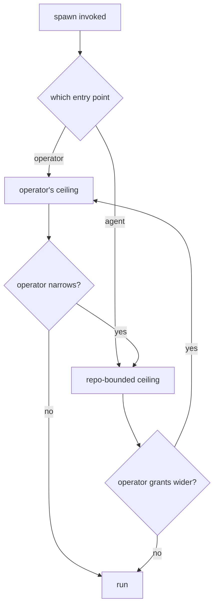

# Spawn Surfaces - Plan

## Goal Capsule

- **Objective:** Re-cut the `spawn` plugin's front door around three verbs — `agent`, `bg-agent`, `session` — add an unattended background agent, move the plugin's contract into the data where a Bash-only caller can reach it, keep the scripts reachable without a version-pinned path, and keep the human-facing status surface honest.
- **Product authority:** This plan owns the surfaces and the new background capability. It does not own the plugin rename (landed in `21f4d56` on `feature/gateway-plugin`) or the install flow (`feature/gateway-setup`).
- **Open blockers:** OQ1 (status command naming), OQ3 (default versus enforced permission ceiling), OQ4 (job lifecycle and result delivery) and OQ5 (the family→tier table) must resolve before planning. OQ3 and OQ4 gate the background agent (R6–R9, R19, R21, R22); OQ1 gates R1 and R2; OQ5 gates R4. OQ2 alone is deferred.

---

## Product Contract

### Summary

Replace the `lens`/`launch`/`status` command names with `/spawn:agent`, `/spawn:bg-agent` and `/spawn:session`, each taking a model family and an optional tier. Add `bg-agent`: a real agent loop with tools that works unattended in a scratchpad, with a permission ceiling set by who invoked it. Move the plugin's machine-readable contract into its JSON output so a caller that cannot load a skill or a command can still discover it.

### Problem Frame

The plugin's six surfaces were shipped without ever being invoked. Driving them exposed a structural fault: commands and skills shared all three names, and the command won every time. The `SKILL.md` files — carrying the exit-code table, the untrusted-output rules and the spill handling — never loaded. Each command body then instructed the caller to "use the Skill tool to invoke `spawn:<name>`", which resolved back to the command, so an agent following the instruction literally went in a circle. It only ever appeared to work because each command also named the script path, and that was enough to finish the job.

The fault is not a gateway mistake. `token-bridge` — the template these skills were built from — collides on all five of its names, and `multi-slice-review` collides on its front door. Only `spinoff` avoids it, by naming commands for verbs (`start-session`, `start-split`) and the skill for the thing (`spinoff`).

Underneath the naming, the plugin's real consumer cannot read prose at all. A calling skill runs with `allowed-tools: Bash, Read`; it cannot invoke a skill or a slash command. Every affordance written into markdown is invisible to it. One fix already proved the shape: the untrusted-output rule was moved out of `SKILL.md` and into constant `content_trust` / `content_notice` fields on the lens's JSON, and a Bash-only subagent then derived the whole trust boundary from the JSON alone.

The plugin also has exactly one silent failure. A wrong Bash-allowlist rule does not error — the call parks on a permission prompt until someone notices. Today a human is watching. An unattended background agent removes the human — and unattended, the same wrong rule may not even park: a denied call can simply be skipped and the job finish as a hollow success. Either way nothing errors, so the job needs its own way to say it could not act, and that account cannot come from the model whose calls were denied.

### Key Decisions

- KD1. **Command names diverge from skill names.** Structural separation removes the shadowing rather than relying on name resolution that already behaved unexpectedly once. (session-settled: user-directed — chosen over renaming only the skills or deleting one layer: the user wants both layers and a new verb set.) Governs R1, R2, R3.
- KD2. **The machine-readable contract lives in the data, not the markdown.** The only consumer that matters cannot load either markdown surface; the `content_trust` precedent already proved a Bash-only caller will derive a contract from JSON. Reachability is part of the same contract: the JSON is useless to a consumer that cannot resolve and run the scripts in the first place. Governs R10, R11, R12, R13, R15, R16, R23.
- KD3. **Every surface stands alone.** No surface instructs a caller to reach another; each is complete for its own audience, which means each states what its verb actually does rather than pointing at whatever does it. (session-settled: user-directed — approach C + A chosen over keeping thin redirects that would now resolve.) Governs R3, R14, R20.
- KD4. **The permission ceiling is set by the caller, not the command.** A person typing a slash command is present and accountable; an agent spawning one autonomously is not, so absence of a human is what tightens the ceiling. (session-settled: user-directed.) Governs R7, R8.
- KD5. **A background agent works in a scratchpad inside the current worktree.** (session-settled: user-directed — chosen over a separate git worktree and over inheriting the caller's full permissions unchanged.) Governs R6, R7.
- KD6. **Family-and-tier is a plugin-side mapping over the gateway's flat aliases.** The gateway keeps `kimi` and `k3` as peers; the plugin resolves `kimi k3` to `k3` and a bare family to that family's default, and hands the scripts one alias. (session-settled: user-approved — the user chose this knowing the gateway's aliases are flat.) Governs R4, R5.
- KD7. **The allowlist fix (R15, R16) ships before or with `bg-agent`.** An unattended job that hits a wrong rule fails with nobody watching, and the absent result is the only symptom. Governs R9.
- KD8. **The status surface must not cry wolf.** The first drive produced drift false alarms a human had to debunk (F4 in the surface-drive findings); a status surface that over-reports gets ignored, so it reports only genuine drift and answers in prose a human can read. Governs R17, R18.
- KD9. **What the plugin knows, the plugin says; what the model says is quoted.** Job lifecycle, permission denials and observed effects are facts the plugin can establish itself; only narrative is model-authored. A model whose calls were denied cannot be the witness to its own denial. Governs R19, R21.

### Actors

- A1. **Operator** — the person typing a slash command. Present, accountable, can answer a permission prompt.
- A2. **Calling agent** — a skill or subagent that shells out to `lib/*.sh`. Runs with `Bash, Read`; cannot load a skill or a command.
- A3. **Spawned model** — the third-party model on the far side of the gateway. Answers only (`agent`), or holds tools and acts (`bg-agent`, `session`).
- A4. **Superagent Gateway** — the local process serving the aliases. Not renamed, not owned by this plan.

### Requirements

**Command surface**

- R1. The plugin exposes commands named `agent`, `bg-agent` and `session`, none of which matches any skill name.
- R2. The skills keep the names `lens`, `launch` and `status`, and remain reachable by those names.
- R3. No command body instructs the caller to invoke a skill or another command; each body is sufficient on its own.
- R4. A command accepts a model family and an optional tier, resolves them to exactly one gateway alias, and passes that single alias to the script — the scripts keep their one-alias, no-fan-out interface. The grammar separates the tier from the task payload unambiguously, so the first word of a task can never be read as a tier, and it covers every served alias including hyphenated tiers (`gpt sol-pro`). An unknown family or tier fails with a message naming the aliases available. The concrete family→tier table is OQ5.
- R5. A command invoked with no family runs against the default alias. Where its prompt comes from is stated in the command's own contract rather than left to the caller to infer.
- R20. Each verb's behavior is stated normatively: `agent` runs one tool-less turn and returns the answer as data; `session` creates and seeds a resumable session and returns a handle; `bg-agent` starts a supervised asynchronous loop and returns a job handle.
- R24. The task payload reaches the model byte-for-byte. Arguments are passed as an array without `eval`, a `--` delimiter ends option parsing, and quotes, newlines, leading dashes and shell metacharacters survive intact.

**Background agent**

- R6. `bg-agent` runs a full agent loop with tools against a named alias, returns control immediately with a job handle, and notifies on completion. The executable that provides it is named in the plan's implementation, and appears in the `--describe` contract alongside the existing scripts.
- R7. A `bg-agent` job writes inside a scratchpad directory in the current worktree. The plan states the scratchpad's location, which roots the job may write to, whether its output is applied to the repository or staged for review, and when it is cleaned up. Under the repo-bounded ceiling — the default for an agent-invoked spawn (R8) — the job is confined to the repository; an operator-invoked job runs at the operator's ceiling per R8. Wider access is granted only by the operator, explicitly. Whether either bound is enforced or merely honored is OQ3; until it resolves, this requirement promises no containment against the spawned model.
- R8. The permission ceiling for a spawn is set by its caller: an operator-invoked spawn gets the operator's full permissions by default; an agent-invoked spawn gets the repo-bounded ceiling. The two ceilings are reached through separately permissioned entry points, so the distinction is one the harness can enforce, not a flag the caller asserts about itself.
- R9. A `bg-agent` job that stops making progress — parked on a permission decision, or running with its tool calls denied by its ceiling — is reported as stalled or degraded, rather than waiting indefinitely or finishing as a silent success. What counts as stalled or degraded is defined observably: the signals watched, the thresholds applied, and which component classifies them (OQ4).
- R19. Narrative a `bg-agent` job hands back — the model's account of what it did or wants — is model-authored and carries the same untrusted-content marking the lens's response already carries (`content_trust`); it is never relayed as an instruction. This holds for the completion notification as well as the result, which means the notification travels in a structured envelope rather than as bare text.
- R21. Job lifecycle and observed effect are established by the supervisor, not the model: start and end time, terminal state, exit status, permission denials, and which files changed. These are trusted fields alongside the untrusted narrative of R19.
- R22. A job handle is usable. The plan defines the operations a holder can perform on it — at least query state, await completion, retrieve the result, and cancel — including terminal states and the behavior for an unknown or expired handle.

**Agent-facing contract**

- R10. Each script answers `--describe` on stdout at exit 0 with its flags, the exit enum and the fields of its response.
- R11. `--help` is distinguishable from a usage error by a machine, without parsing prose and without a new exit code — the frozen enum stays frozen, so the discriminator is a field in the response.
- R12. Every error names its remedy, extending the existing `no_text_truncated` standard.
- R13. The lens's response states that the model saw only the caller's single message and had no ability to fetch anything.
- R14. One canonical source states the contract, and every surface projects from it. A test asserts the projections agree on named fields — not that their prose matches.
- R23. Every response shares one envelope: a schema version, whether the call succeeded, the error and its remedy when it did not, the trust marking, and an operation-specific payload. Success, error, help, describe, handle and job-state responses are all shapes of it.

**Invocation path**

- R15. A consumer in another plugin can resolve and run the plugin's scripts without hard-coding a version-pinned path.
- R16. The allowlist entry a user must add names a stable, narrowly scoped entry point that survives a version upgrade. Solving the version problem by wildcarding a cache directory is not acceptable — it would authorize whatever else lands under that path. No such stable path exists today (see Dependencies and Assumptions).

**Human-facing status**

- R17. The status surface reports only genuine drift. Whether two aliases are the same thing is decided from what the gateway says they resolve to, not from one name being a prefix of another — a new model served under a prefixed name is real drift and must still be reported.
- R18. The status surface answers in prose a human can read, and keeps the machine-readable response intact underneath it. The prose is a rendering of the data, not a replacement for it.

### Key Flows

- F1. Operator runs a background agent
  - **Trigger:** A1 types `/spawn:bg-agent kimi k3 -- fix the failing tests in lib/`.
  - **Actors:** A1, A3, A4
  - **Steps:** The family and tier resolve to one alias; a scratchpad is prepared in the current worktree; the job starts at A1's ceiling through the operator entry point; a job handle returns immediately; A1 is notified on completion.
  - **Outcome:** A1 holds a handle, a supervisor-authored account of what changed, and the model's own narrative marked as untrusted.
  - **Covered by:** R1, R4, R6, R7, R8, R19, R21, R22

- F2. A skill spawns an agent autonomously
  - **Trigger:** A2 shells out to the background-agent entry point during its own run.
  - **Actors:** A2, A3
  - **Steps:** The script resolves the alias, runs at the repo-bounded ceiling because A2 reached it through the agent entry point, and returns a job handle in the standard envelope.
  - **Outcome:** A2 holds a handle it can query, await, or cancel, and the job is held to the repo-bounded ceiling — enforced or honored per OQ3.
  - **Covered by:** R6, R7, R8, R22, R23

- F3. A Bash-only caller learns the contract
  - **Trigger:** A2 needs to know what exit 5 means and which response fields exist.
  - **Actors:** A2
  - **Steps:** A2 runs the script with `--describe`, reads flags, the exit enum and the response fields from stdout, and branches on them.
  - **Outcome:** A2 reconciles against the running version instead of a hard-coded copy.
  - **Covered by:** R10, R11, R23

### Acceptance Examples

- AE1. **Covers R4.** Given the gateway serves `kimi` and `k3` as peers, when a caller passes `kimi k3`, then the request goes to the `k3` alias.
- AE2. **Covers R4.** Given a caller passes `kimi` alone, then the request goes to the family's default alias, not to an error.
- AE3. **Covers R4.** Given a caller passes a family the gateway does not serve, then the call fails with a message listing the served aliases.
- AE8. **Covers R4, R24.** Given a task whose first word matches a tier name, then it is treated as task text and not as a tier; given a task containing quotes, newlines and a leading dash, then the model receives it unchanged.
- AE4. **Covers R8.** Given a spawn reaching the operator entry point, then it runs at the operator's ceiling; given a spawn reaching the agent entry point, then it runs repo-bounded.
- AE5. **Covers R9.** Given a background job that blocks on a permission decision, then it is reported stalled rather than remaining silently pending; given a job whose tool calls are denied by its ceiling, then it is reported degraded rather than completing as a clean success.
- AE9. **Covers R19, R21.** Given a completed job, then the changed-file list and terminal state come from the supervisor and are marked trusted, while the model's account of its own work is marked untrusted; given a job whose calls were all denied, then it is not reported as successful on the model's say-so.
- AE6. **Covers R11.** Given a caller runs `--help` and separately makes a usage error, then the two are distinguishable by a response field, both still exiting 2.
- AE7. **Covers R17.** Given the gateway serves `claude-gpt` and `gpt` resolving to the same model and the table carries `gpt`, then `claude-gpt` is not reported as drift; given a `claude-gpt` that resolves to a different model, then it is reported.

### Permission resolution

### Scope Boundaries

- The plugin rename from `gateway` to `spawn` — landed in `21f4d56` on `feature/gateway-plugin`. This plan consumes it.
- The install flow, token capture and per-harness config, including any `setup` command — owned by `feature/gateway-setup`.
- The Superagent Gateway itself. Its binary, config, alias definitions and shared state paths are unchanged.
- Fixing the same command-and-skill name collision in `plugins/token-bridge` and `plugins/multi-slice-review` — see OQ2.

### Dependencies and Assumptions

- Depends on the rename in `21f4d56` being merged or rebased under this work.
- Assumes the status capability survives as a fourth command; the operator's stated command list did not include it, and the naming is open (OQ1).
- The caller-derived ceiling is only as strong as the mechanism that derives it. R8 routes the two ceilings through separately permissioned entry points precisely so the harness decides which one a caller may reach, rather than the caller asserting its own identity in argv — a flag would be self-declared and any agent able to run the script could claim to be the operator. Whether the entry-point split is sufficient, and what enforces the repo bound against the spawned model, is OQ3.
- The caller is only one of two parties. A2 invoking the script is a self-shoot risk; A3, the spawned model, is a third party by definition. "Self-shoot" therefore covers who invokes the script, not what the model does with tools once it runs — and under the repo-bounded ceiling that model can read whatever the worktree contains, secrets included.
- No stable install path exists yet: installed plugin files live under version-embedded cache directories, and the plugin cannot write outside its own tree (the README says as much about the allowlist entry). R16 is therefore satisfied either by the install flow owned by `feature/gateway-setup` or by this plan claiming that one slice of the install surface; which, is settled at planning, and it is a single owner either way.
- Assumes the R4 family-and-tier mapping is maintained by hand as the gateway's aliases change. R17's drift discipline covers the status table, not this mapping; whether it should extend there is part of OQ5.

### Outstanding Questions

**Resolve before planning**

- OQ1. What is the status command called? Keeping `/spawn:status` is not available — a `status` command alongside the retained `status` skill recreates the exact collision KD1 exists to remove. So either the command is renamed toward what it reports (`gateway`, `models`), or there is no status command and the capability stays with the skill.
- OQ3. Is the permission ceiling enforced or merely honored? Two independent halves. The caller-facing half (which entry point a caller may reach, and who may grant wider access) is plausibly settled by the entry-point split in R8. The model-facing half — what actually confines A3 to the repository — is not, and the party being confined is a third-party model holding tools. Resolving "enforced" for the second half also means saying what repo-bounded excludes: execution-bearing paths like `.git/hooks`, agent-configuration files, symlinks pointing out of the tree, and shell access that reaches around any of it are inside the repository yet outside any sane ceiling. Enforcement is cheap to specify now and expensive to retrofit after planning.
- OQ4. The background job's lifecycle. What a finished job returns and how the result reaches an operator versus a polling Bash-only caller; what owns the child process once the invoking shell exits, and whether a job survives terminal close, plugin reload or a gateway restart; where job state is stored and how it is recovered; what observes a job and classifies it stalled or degraded, on what signals and thresholds; and whether concurrent jobs in one worktree are permitted, how their changes are attributed, and what happens when two of them — or a job and the operator — touch the same file. R6, R9, R21 and R22 cannot be planned until this is answered.
- OQ5. The concrete family→tier table behind R4: how each served alias decomposes, how hyphenated tiers like `sol-pro` are expressed, whether the `default` chain is reachable through the grammar, and whether the R17 drift standard extends to this mapping as the gateway's aliases change. R4's grammar cannot be specified without it.

**Deferred to planning**

- OQ2. Does the surface-naming rule in KD1 become a repo-wide convention, and do `token-bridge` and `multi-slice-review` get fixed to match? Answering it does not block this plan; leaving it unanswered leaves two siblings with the same fault.
- OQ6. What bounds an unattended job: maximum runtime, resource ceilings, how long results and scratchpads are retained, and what collects an abandoned job.

### Sources

- `docs/surface-drive-findings.md` — the first invocation of the surfaces; F1 (the shadowing, with its `$ARGUMENTS` proof), F2 (script modes), F3 (`--help` exit 2, no `--describe`), F4 (the drift false alarms).
- `docs/residual-review-findings/feature-gateway-plugin.md` — the same shadowing finding reached independently in a second worktree, plus the spill-file and argv-seed residuals.
- `docs/plans/2026-08-06-001-feat-gateway-plugin-plan.md` — KD1, KD3, KTD2 (the frozen exit enum), and U5, which specified the command-fronts-skill shape this plan replaces.
- `plugins/spawn/README.md` — the allowlist section, including the version-in-path stall and the note that the plugin cannot write the entry for the user.
- `plugins/spinoff/` — the sibling that avoids the name collision; `plugins/token-bridge/` — the template that carries it.
