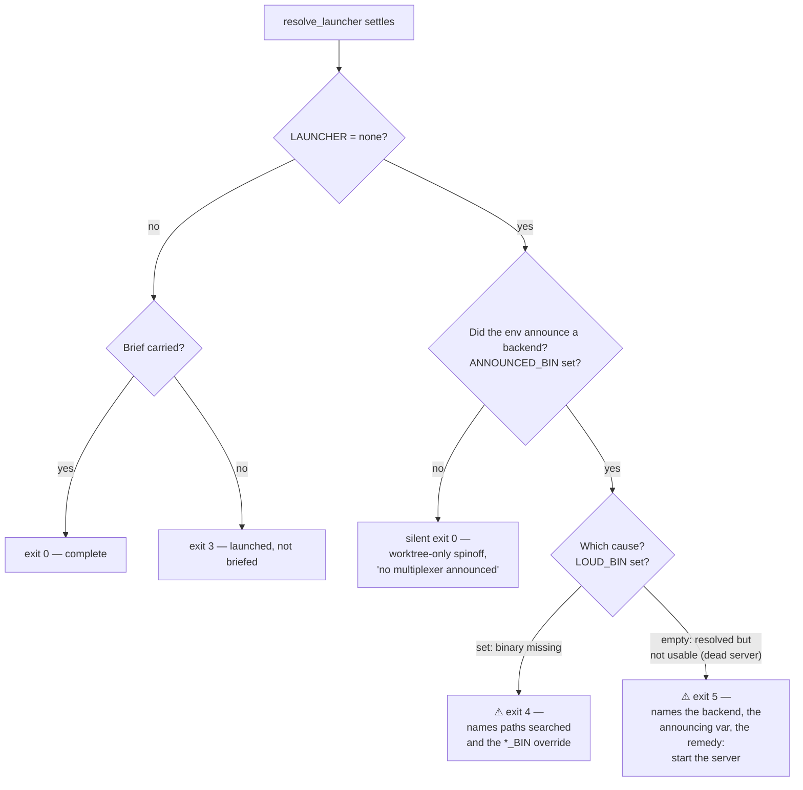

# Make an announced-but-unlaunched spinoff loud - Plan

## Goal Capsule

`spinoff.sh` can finish having launched nothing, print no warning, and exit 0 — while the environment announced a multiplexer whose server is down. A dead herdr server is indistinguishable from "this session is not in a multiplexer", and the background agent that relays the run reports it as success. Invert the script's tail so any announced backend that did not launch is a failure by construction: the cause selects only the wording and the exit code (4 for a missing binary, a new 5 for a backend that resolved but was not usable), never whether the run is loud. Update the skill's exit-code table, prove the new tests discriminate, and ship it through the version-bumped plugin cache.

---

## Product Contract

### Summary

When a spinoff runs in a session that announced herdr (`HERDR_ENV=1`) and the herdr binary resolves but the server probe fails, the script falls through to `LAUNCHER=none` and exits 0. The skill's exit-code table blesses `launcher: none` at exit 0 as a legitimate worktree-only spinoff, so the caller — a background agent that reads status, not prose — relays "done" for a run that launched nothing. The user's remedy (start the herdr server) is never surfaced. This plan makes that state a loud, named failure with its own exit code, the same way PR #29 ("fix(spinoff): resolve launcher binaries absolutely, and stop reporting a failed launch as success") did for the missing-binary case.

### Problem Frame

The silence is a recorded decision, not an oversight. The comment at `plugins/spinoff/skills/spinoff/scripts/spinoff.sh:1541-1549` names "a resolvable herdr whose server is down" as one of four cases that "MUST stay silent at exit 0", and line 1577 calls it "a silent exit 0 by decision". That decision fixed the *wording* — the step line and summary now say "announced … but isn't usable", which is true — but left the *outcome signal* identical to success. A caller that checks exit status, which is exactly how the mandated background agent relays this script, cannot tell a dead server from a plain terminal. Truthful words behind a lying status code is the same false-success class PR #29 removed one cause earlier; this plan finishes the job and rewrites those comment blocks so the code no longer argues for the behavior it no longer has.

The defect is a class, not an instance. This repo's own learning (`docs/solutions/logic-errors/default-allow-regex-projection-gate-silently-drops-nudges.md`) records that enumerating known-bad cases is default-allow and leaks by construction — six violations across four review rounds before that gate was inverted. Adding "probe failed" as one more enumerated branch beside exit 4 would repeat that mistake: the next unforeseen cause of an announced backend not launching would fall through silent again.

### Requirements

**Behavior**

- R1. A run in which the environment announced a backend (`HERDR_ENV=1` or `CMUX_WORKSPACE_ID`) and no launch happened must never exit 0, regardless of cause.
- R2. The announced-resolved-but-unusable case exits 5, with a `⚠` printed outside the summary block. It leads with the cause-neutral statement — a backend was announced and nothing launched — then names the backend, the announcing variable, and the known remedy (start the server; for herdr, check `herdr status server`). The lead line stays cause-neutral so that KTD1's generic-default promise holds: a future cause reaching this gate produces a message that is still true. That block also prints `$MANUAL_CMD`, matching the exit-4 tail block — the run that now reports failure is the one whose relay must not lose its recovery line. It states that the worktree already exists, so a caller does not re-run the same `--name`. It reads as actionable without the skill's exit-code table, because a session can hold an older skill text in context while running a newer script.
- R3. The announced-binary-unresolvable case keeps exit 4 and its existing diagnostics unchanged.
- R4. The summary header prints `⚠ Spinoff INCOMPLETE` — never `✓ Spinoff complete` — for every announced-but-unlaunched run.
- R5. A run that launches through a different announced backend stays exit 0 with no warning (preserves PR #29's R17 behavior, pinned by the existing "another announced backend launches" test).
- R6. Genuinely unannounced sessions, `HERDR_ENV=0` sessions, and ghostty-identity sessions stay silent at exit 0 (preserves PR #29's R7, R8, R14).
- R7. Exit codes 3, 4, and 5 are mutually exclusive by construction, with the argument written in the script comment (KTD3 states the construction).

**Documentation**

- R8. `plugins/spinoff/skills/spinoff/SKILL.md`'s exit-code table gains row 5, re-scopes row 0 so `launcher: none` at exit 0 means only "nothing announced", and extends the mutual-exclusivity note to cover 5.
- R9. Every comment in `spinoff.sh` that argues the probe-failed case stays silent is rewritten in place. Five are known: the four-cases block above the loud gate, the three-way split above the step line, the summary's launch-line split, the record-machinery header (which states the probe-failed case "stays a silent exit 0"), and `_record_loud`'s own doc comment (which calls `$ANNOUNCED_*` the driver of "the wording of the SILENT fallback"). The requirement is the class, not the list — a sweep for comments asserting the old behavior is part of the work, because the last two sites are far from the gate and an implementer working only from the tail will miss them.
- R13. Every other place in `SKILL.md` that describes the announced-but-unusable run as benign is corrected. The "No live backend … **Exit 0.**" bullet is the flat contradiction, and it currently conflates a dead herdr server with `HERDR_ENV=0` — those diverge after this change and the bullet splits in two. The `auto`-precedence description, the ghostty-suppression note, and the "falls back to auto-detection rather than hard-erroring" line each describe a route that now ends at exit 5.
- R14. The skill's relay instruction keys on the summary block whatever its header, not on `✓ Spinoff complete`. The tick block does not exist on exit 4 or exit 5, so the relay contract is currently undefined for exactly the runs that matter.

**Tests**

- R10. Each new bats assertion is shown to fail against the unfixed script, and asserts the specific exit code and specific stderr text, never merely non-zero.
- R11. The existing test "silent: resolvable herdr whose server is down falls back quietly (R9)" flips to assert the new loud behavior; all other existing loud and silent tests stay green unmodified.

**Release**

- R12. The version is bumped in both `plugins/spinoff/.claude-plugin/plugin.json` and `.claude-plugin/marketplace.json` (they must match), and the fix is verified against the installed copy at `~/.claude/plugins/cache/shrimpshack/spinoff/<version>/`, not the source tree.

### Scope Boundaries

- **The user's original unlogged `launcher: none` run is not investigated** (session-settled: user-directed — no output or version was captured; this fix makes the same failure self-reporting next time). The handoff's env-passing theory was disproven during orientation and was already fixed in 0.8.1 by PR #17 ("fix: spinoff herdr tab regressions (split→tab, bg-agent) — publish 0.8.1"); no work targets it.
- **Forced `--launcher` in a bare environment stays exit 0.** The ordering matters and is easy to get wrong: `resolve_launcher`'s forced-`--launcher` block runs *before* the `_record_loud` calls and returns early on a **successful** probe, so on that path the record never fires at all. A forced launcher whose probe *fails* falls through to the record and re-runs detection — so in an announced session it can reach the gate, which is correct (the user asked for a backend, one was announced, nothing launched). In an environment that announced nothing, the record cannot fire and the run stays exit 0, having already printed a visible `⚠ … falling back to auto-detection`. Do not "fix" the ordering by hoisting the record above the forced block: that early return is what keeps a forced launcher usable inside an announced session, and no test pins it. PR #29's KTD-9 defines announcements as env-keyed; this plan keeps that definition.
- **No opt-out is added.** `--launcher` accepts only `herdr|cmux|ghostty|auto`; there is no `--launcher none` and no `--no-launch`. After this change a user sitting in a session that announced herdr with a deliberately stopped server has no invocation that yields exit 0 without actually launching something — a forced `--launcher` whose own probe succeeds still launches and still exits 0 (see Risks) — even when the worktree is all they wanted. This follows from R1 and is accepted, not overlooked. Adding an opt-out flag is deferred; if it becomes a real irritation the shape is a flag, not a weakening of the gate.
- **The ghostty suppression at `spinoff.sh:250` is untouched** (KTD4 records it as a known risk).
- **No CI work.** This repo has no CI; the bats suite runs locally and the Verification Contract is written for that.

---

## Planning Contract

### Key Technical Decisions

- KTD1. **Invert the tail to default-deny; do not enumerate the probe-failed case.** The gate becomes: announced backend and `LAUNCHER=none` → failure, always. Inside that single gate, the recorded cause selects only the wording and the exit code — `$LOUD_BIN` set means the binary was missing (exit 4), otherwise the backend resolved but was not usable (exit 5). The shape matters as much as the outcome: two sibling `if` blocks, one per cause, would still be enumeration, and a future third cause would fall through silent. One gate with a reason-selector inside means an unknown future cause defaults to loud with generic wording. This is the repo's own recorded learning (`docs/solutions/logic-errors/default-allow-regex-projection-gate-silently-drops-nudges.md`) applied directly, and it covers cmux by construction: `_cmux_probe` is a binary-only check today, so cmux cannot currently reach the probe-failed state — an argument for the structural gate, not for a second branch cmux cannot trigger. If cmux ever grows a liveness probe, the gate already handles it.
- KTD2. **Probe-failure gets its own exit code, 5 — the next free — not a widening of exit 4** (session-settled: user-directed — chosen over widening exit 4: the remedies differ — start the server versus set the binary path — and one code cannot carry both fixes).
- KTD3. **Mutual exclusivity of 3, 4, 5 is argued by construction, matching the existing argument at `spinoff.sh:1721-1723`.** Exit 3 requires `BRIEF_ATTEMPTED=1`, which requires `LAUNCHER != none`. Exits 4 and 5 both require `LAUNCHER = none`, so neither can co-occur with 3. Between 4 and 5, the selector is `$LOUD_BIN`: 4 requires it non-empty, 5 requires it empty, and one variable cannot be both. This paragraph goes into the script comment per R7.

  The selector carries an asymmetry the implementer must know: `$ANNOUNCED_*` is first-*announced*-wins while `$LOUD_*` is first-*unresolved*-wins, so the two can name **different** backends. Concretely — herdr announced and resolved with a dead server, plus cmux announced with a missing binary — yields `ANNOUNCED_BIN=herdr` and `LOUD_BIN=cmux`. Exit 4 fires, which is the right code (fixing `CMUX_BIN` genuinely restores a launch, since a resolved cmux always wins detection), but only cmux is named and the dead herdr server goes unmentioned. Accept that, and take **all** wording in the loud path from `$LOUD_BIN` when it is set, so the two records can never describe different backends in the same run. The existing suppression that silences the step line whenever the loud block spoke is what preserves this today; U1 keeps it.
- KTD4. **The ghostty-suppression inversion at `spinoff.sh:250` is left alone** (session-settled: user-directed — chosen over hardening it now: the suppression is correct while `HERDR_ENV` is present, and the inversion is only reachable in a state never observed; hardening would be speculative). Recorded under Risks.
- KTD5. **The summary header keys on the same generalized flag as the exit, not on `LAUNCH_UNRESOLVED` alone.** PR #29's KTD-5 lesson: teaching only the tail exit printed "✓ Spinoff complete" alongside exit 4 in a block the skill relays verbatim. The same regression is live today for the probe-failed case — the header currently prints the tick. One flag ("announced and unlaunched"), read by the header, the loud `⚠` block, and the exit.

### High-Level Technical Design

The record machinery from PR #29 already captures everything needed: `_record_loud` sets `$ANNOUNCED_*` unconditionally on any announcement and `$LOUD_*` only when the binary did not resolve. No changes to `resolve_launcher` or the probes. The whole fix lives in the tail's read sites: replace the `LAUNCH_UNRESOLVED`-only gate with a single announced-and-unlaunched gate.

The left spine (exit 0 / exit 3) is unchanged. The change is the right side: today the "resolved but not usable" leaf merges into the silent exit-0 leaf; after the fix, every announced leaf is loud, and only the unannounced leaf is silent.

Three comment blocks are rewritten in place, not appended to (R9): the "four cases MUST stay silent" block above the gate becomes "three cases stay silent" (HERDR_ENV=0, ghostty-only, nothing announced) plus the construction argument for the loud gate; the three-way split above the step line loses its "silent by decision" middle arm — that wording now lives inside the loud path; the summary's `launcher = none` arm keeps its honest "announced but not usable" text but is reached only en route to a non-zero exit. Stale reasoning standing beside the new branch is the documented anti-pattern this repo already paid for once.

### Risks

- **The ghostty suppression at `spinoff.sh:250` remains inverted-looking** (`-z "$HERDR_ENV"` guards, so `HERDR_ENV=0` suppresses ghostty). Correct as written today; recorded as a known risk per KTD4, not fixed here.
- **The plan's R-IDs collide with the script's legacy numbering.** `spinoff.sh` comments and bats test names carry PR #29's R7/R8/R9/R14/R17. Every reference to those in this plan is qualified as "PR #29's Rn"; implementers must not read this plan's R9 (comment rewrite) as the script's R9 (probe-failed silence).
- **A forced `--launcher ghostty` in a herdr-announced session with a dead herdr server now exits 5, and the remedy text contradicts the flag the user passed** — it says "start the herdr server" to someone who explicitly asked for ghostty. The exit code is defensible (nothing launched), the wording is not. The escape hatch survives only while ghostty's own probe succeeds, because that path returns before the record fires. Left as-is; revisit if it is hit in practice.
- **A caller that retries on non-zero makes things worse.** Re-running the identical command after exit 5 hits the "worktree path already exists" / "branch already exists" preconditions and dies at exit 1 — a recoverable failure turned into a confusing one. R2's text is the mitigation; nothing enforces it.
- **The gate makes `herdr status server`'s output string load-bearing.** The probe greps its output for `running`. After this change, drift in that string turns every herdr spinoff into a hard exit 5 while herdr is perfectly live; today the same drift degrades quietly to a worktree-only success. `cli-drift.test.sh` catches a renamed subcommand but not a changed output string, and this repo has been bitten by herdr CLI drift twice already.
- **Skill text and script ship in one version but need not be loaded together.** A session holding the older skill text in context while running the newer script relays an exit 5 with no matching table row — the "unactionable something went wrong" the skill itself warns about. R2's self-describing requirement is the mitigation.
- **The fix is invisible until the cache re-installs.** Claude Code executes `~/.claude/plugins/cache/shrimpshack/spinoff/<version>/`, not the source tree. A merged fix with no version bump changes nothing live. U4 exists solely to close this gap.

---

## Implementation Units

### U1. Invert the tail: announced-and-unlaunched is loud by construction

- **Goal:** Any announced backend that did not launch exits non-zero with a `⚠` outside the summary block; the cause selects wording and code only.
- **Requirements:** R1, R2, R3, R4, R7, R9
- **Dependencies:** none
- **Files:** `plugins/spinoff/skills/spinoff/scripts/spinoff.sh`
- **Approach:** Replace the `LAUNCH_UNRESOLVED` gate with one announced-and-unlaunched flag (`LAUNCHER=none` and `$ANNOUNCED_BIN` non-empty), per KTD1's single-gate shape. Inside it, `$LOUD_BIN` selects the existing exit-4 diagnostics unchanged, else the new exit-5 diagnostics, which carry every element R2 lists — the cause-neutral lead, backend name, announcing variable, the remedy, `$MANUAL_CMD`, and the worktree-already-exists note — printed outside the summary block so a relay survives it, mirroring the existing exit-4 tail block's contract. The summary header reads the same flag (KTD5) so `✓ Spinoff complete` cannot co-print with either exit. Rewrite the three superseded comment blocks in place (the four-cases block, the three-way step split, the summary launch-line split) and write KTD3's construction argument where the exit-4 comment argues 3-vs-4 today.

  Two sites need an explicit decision, not just a comment rewrite. First, the step line that today prints "announced this session … but isn't usable — **skipping launch automation**" now precedes a non-zero exit; "skipping" is the exact skip-versus-failure conflation this plan removes, and it is the first thing the user reads. Either move that line under the loud arm or change its wording — U1 must land one of the two. Second, keep the existing suppression that silences the step line whenever the loud block already spoke, so KTD3's case E cannot print two different backends in one run. The summary's launch line already carries an honest announced-but-not-usable arm; that arm survives the comment rewrite unchanged.
- **Test scenarios:** covered in U3 — the behavioral assertions for this unit live at the end-to-end bats layer, and U3 names them.
- **Verification:** `bash -n` passes; the U3 suite passes; the discrimination protocol in the Verification Contract shows each new assertion failing against this unit's pre-image.

### U2. Re-teach the skill: exit 5 and how to read `launcher: none`

- **Goal:** A caller reading the skill can distinguish a worktree-only spinoff from a failed launch by exit code alone.
- **Requirements:** R8, R13, R14
- **Dependencies:** U1 (the table must describe shipped behavior)
- **Files:** `plugins/spinoff/skills/spinoff/SKILL.md`
- **Approach:** The table is the smaller half of this unit. Correct the four benign-run passages R13 names — the "No live backend … Exit 0." bullet splits in two rather than having a number swapped, because it currently lumps a dead herdr server together with `HERDR_ENV=0` and those diverge after this change. Separately, the relay instruction tells the caller to return the contents of the `✓ Spinoff complete` block — a block that does not exist on exit 4 or 5 — so it is re-pointed at the summary block whatever its header (R14). Then the table itself: add row 5 — announced backend resolved but not usable — nothing launched; worktree survives; remedy is starting the backend's server, then re-run. Re-scope row 0 so `launcher: none` at exit 0 means only "nothing announced a multiplexer"; delete the wording that blesses every `launcher: none` exit 0 as legitimate. Extend the "Codes 3 and 4 can't both apply" note to all three codes using KTD3's construction. Update the relay guidance above the table so the background agent's contract is: exit code decides skip versus failure; the summary text only explains it.
- **Test scenarios:** `Test expectation: none — documentation-only unit; behavior is pinned by U3's suite.`
- **Verification:** rows 2, 3, 4 and 5 each map to a single exit site in `spinoff.sh` and row 1 covers every `die` call; no passage anywhere in `SKILL.md` still describes an announced-but-unusable run as benign or as exit 0.

### U3. Bats coverage that provably discriminates

- **Goal:** The new behavior is pinned at the end-to-end layer, the gate's shape is pinned at the source level where no behavioral test can reach it, and every new assertion is demonstrated to fail against the unfixed script.
- **Requirements:** R5, R6, R10, R11
- **Dependencies:** U1
- **Files:** `plugins/spinoff/skills/spinoff/scripts/spinoff.bats`
- **Approach:** Work at the end-to-end harness (`run_unresolvable`, with `$LOUD_STUBS` / `$LOUD_ARGS`), not the resolver-injection layer — the defect lives in the resolve-then-report path. The probe-failed state is reproduced exactly as the existing PR #29 R9 test does: `LOUD_STUBS=herdr` with `HERDR_STUB_LIVE=0`. No cmux exit-5 test exists because `_cmux_probe` is binary-only and the state is unreachable; cmux coverage is structural, by construction of the U1 gate — do not write a test that cannot be exercised.
- **Test scenarios:**
  - Flip the existing test "silent: resolvable herdr whose server is down falls back quietly (R9)": same setup (herdr announced, binary stubbed, server dead); now asserts exit 5, the new `⚠` stderr text naming herdr and `HERDR_ENV=1`, the start-the-server remedy, the presence of the manual `cd … && claude` recovery line, the worktree-already-exists note, and that the worktree, branch, and handoff still exist on disk. Assert every element R2 requires — an exit-5 block that silently loses its recovery line is the specific regression R2 exists to prevent. The flip itself is discrimination evidence: this test passes today by pinning the defect.
  - New: probe-failed herdr never prints the tick — same setup; asserts `⚠ Spinoff INCOMPLETE` appears and `✓ Spinoff complete` does not (mirrors the existing KTD-5 tick test for exit 4; pins KTD5's header flag).
  - New: reach the gate by a second entry path. Herdr announced with its server dead, herdr binary stubbed, no cmux announced, and `--launcher cmux` forced. The forced probe fails, the run prints the fallback warning, detection re-runs and lands on `none`. Asserts both the `falling back to auto-detection` warning and exit 5. Today it exits 0. This is regression coverage of the forced-launcher route into the gate — it does **not** prove the gate is default-deny, because herdr is still the announced backend and its probe still failed, so an enumerating gate would pass it too.
  - New, structural, and the only thing that actually pins KTD1: assert against the script source that the loud gate's condition reads `$ANNOUNCED_BIN` and names no backend-specific variable or probe. The behavioral state cannot be reached a second way while `_cmux_probe` is binary-only, so no end-to-end test can distinguish a default-deny gate from an enumerating one. Say that plainly in the test's comment, so a later reader knows why a source-level assertion is here and does not delete it as redundant. If cmux ever grows a liveness probe, replace this with the behavioral test that then becomes possible.
  - New: probe-failed herdr does not misreport its cause — same setup; asserts the output does not contain "no multiplexer announced" and does not contain "could not resolve" (exit 5 must not borrow exit 4's wording).
  - Unchanged, re-run as regression: "another announced backend launches → exit 0, no warning" (PR #29's R17 — herdr announced and dead, cmux announced and live, launches through cmux); "no announcement at all → exit 0" (PR #29's R7); "HERDR_ENV=0 stays quiet" (PR #29's R8); "ghostty vars stay quiet" (PR #29's R14); both exit-4 loud tests; the exit-3 distinctness test.
- **Verification:** the discrimination protocol in the Verification Contract — each new or flipped assertion is run against the pre-U1 script and observed to fail with the old exit 0, then against the fixed script and observed to pass; the full suite is green.

### U4. Version bump and cache verification

- **Goal:** The fix reaches live behavior — the installed plugin cache serves the new script.
- **Requirements:** R12
- **Dependencies:** U1, U2, U3
- **Files:** `plugins/spinoff/.claude-plugin/plugin.json`, `.claude-plugin/marketplace.json`
- **Approach:** Bump 0.9.1 → 0.9.2 in both files; they must stay in sync (the prior plan "fix launcher path resolution", U4, records that both `f0b5d35` and `48ce78d` touched both). After the plugin re-installs, verify against `~/.claude/plugins/cache/shrimpshack/spinoff/0.9.2/` — the source tree proves nothing about live behavior.
- **Test scenarios:** `Test expectation: none — manifest-only unit; behavior is pinned by U3's suite.`
- **Verification:** splits in two, because the cache is not populated from the worktree. The **local gate that closes U4**: both manifests read the identical new version and no other field changed. The **post-merge step**, which cannot run before then: the marketplace installs this plugin from GitHub `shawnroos/shrimpshack` with auto-update on, so the `0.9.2` cache directory only appears once the bump reaches the default branch and the marketplace refreshes — today's cache holds published versions only (0.7.0, 0.8.3, 0.9.0, 0.9.1). After merge and re-install, confirm the `0.9.2` cache directory exists, its `spinoff.sh` matches the source tree, and a probe-dead run of the cached script exits 5. Treating the cache check as a local gate would leave U4 unsatisfiable at the moment the plan says to check it.

---

## Verification Contract

All verification is local and this repo has no CI, with one exception: U4's cache check runs only after the version bump reaches the default branch and the marketplace re-installs. Everything below is a required gate — a suite that exits having verified nothing is a failure, not a pass.

- **Syntax:** `bash -n plugins/spinoff/skills/spinoff/scripts/spinoff.sh` after U1.
- **Suite:** `bats plugins/spinoff/skills/spinoff/scripts/spinoff.bats` — all 49 existing tests (one flipped per U3) plus the new ones, green.
- **The other two suites that actually execute the script:** `bash plugins/spinoff/skills/spinoff/scripts/smoke.sh` and `bash plugins/spinoff/skills/spinoff/scripts/kickoff-gate.test.sh`, both green. These are not optional extras — `kickoff-gate.test.sh` is the only check that runs the whole script end-to-end with herdr announced against a stub that answers the liveness probe, and it is where a probe or stub regression surfaces; `smoke.sh` exercises the `HERDR_ENV=0` silent path that R6 promises to preserve. Note that `kickoff-gate.test.sh`'s stub arm answering `status server` is precisely what keeps its four checks off exit 5; if that arm is ever removed, those checks flip to hard failures.
- **Discrimination protocol (R10):** before merging U1 and U3 together, run the U3 assertions against the unfixed script — check out or stash to the pre-U1 state of `spinoff.sh` and run the new/flipped tests. Expected outcome: each fails, specifically because the unfixed script exits 0 and omits the new stderr text. A new test that passes against the unfixed script discriminates nothing and must be rewritten; this repo has already recorded one test "green before and after the fix" and one that asserted a status the script returns on every path. Every assertion names the exact exit code and exact stderr text.
- **Drift check:** `bash plugins/spinoff/skills/spinoff/scripts/cli-drift.test.sh`, with the prior plan's done-signal — the same verified-call count as before the change, and exit 2 (nothing verified) counts as a failure, not a pass. This change raises the stakes on herdr CLI drift rather than lowering them, so running one fewer drift check than the change that introduced the probe would be backwards. It catches a renamed subcommand but not a changed `status server` output string, which is why that risk stays open in Risks.
- **Cache verification (R12), post-merge only:** after the version bump and re-install, confirm `~/.claude/plugins/cache/shrimpshack/spinoff/0.9.2/` exists, its `spinoff.sh` matches the source tree, and a probe-dead run of the cached script exits 5. Existing cached versions (0.7.0–0.9.1) remain untouched.
- **Doc cross-check (R8):** read `SKILL.md`'s exit table against the script's exit sites. Rows 2, 3, 4 and 5 each match a single exit site; row 1 covers every `die` call, which has many callers and no one-to-one site. Each row's remedy matches the remedy the script actually prints.

---

## Definition of Done

- A herdr-announced run with a dead server exits 5 and prints a `⚠` outside the summary block carrying everything R2 requires — the cause-neutral lead, the backend, the announcing variable, the remedy, the manual recovery command, and the worktree-already-exists note — and shows `⚠ Spinoff INCOMPLETE`, never the tick.
- A run announcing nothing, announcing `HERDR_ENV=0`, or carrying only ghostty identity still exits 0 silently; a run that launches through another announced backend still exits 0 with no warning.
- Exits 3, 4, and 5 are mutually exclusive by the construction written into the script comment, and no comment in `spinoff.sh` still argues the probe-failed case stays silent.
- The flipped and new bats tests were each observed failing against the unfixed script and passing against the fixed one; all three suites (`spinoff.bats`, `smoke.sh`, `kickoff-gate.test.sh`) are green locally.
- The gate's condition is asserted at source level to read `$ANNOUNCED_BIN` and name no backend-specific probe. This is the only check that separates KTD1's default-deny gate from an enumerating one, because while `_cmux_probe` is binary-only the behavioral state has exactly one reachable cause and no end-to-end test can tell the two implementations apart.
- `SKILL.md` carries no remaining passage describing an announced-but-unusable run as benign or as exit 0, and its relay instruction no longer keys on the tick block.
- `SKILL.md`'s table carries row 5 and no longer blesses every `launcher: none` exit 0 as legitimate.
- Both manifests read 0.9.2 with no other field changed. Then, after the bump reaches the default branch and the marketplace re-installs, the cache at `~/.claude/plugins/cache/shrimpshack/spinoff/0.9.2/` serves a script whose probe-dead run exits 5. Until that step runs, the fix is real in the repo and absent from live behavior.
