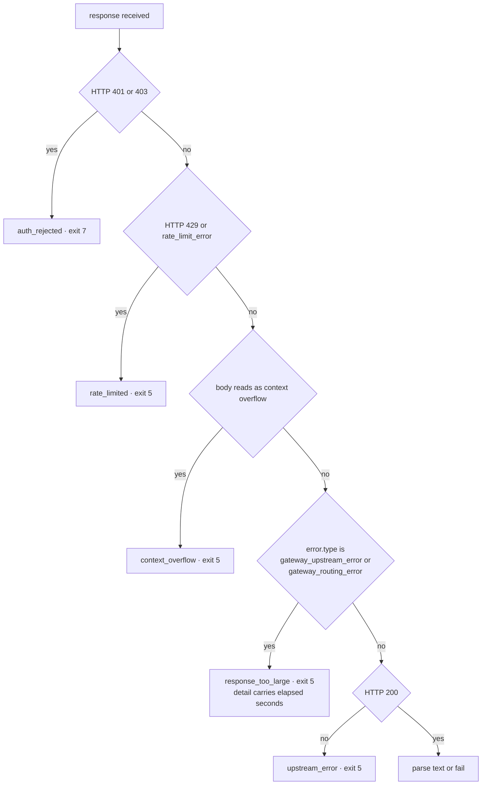

# Lens Size-Ceiling Timeout Lever - Plan

## Goal Capsule

- **Objective:** Extend the shipped `response_too_large` class so its remedy names the route-`timeout_ms` lever alongside `--max-tokens`, carry the measured call duration so the two readings are distinguishable, and fix the ordering defect that let prose relabel the failure. Separately, raise the per-route ceiling.
- **Product authority:** Shawn. Scope is the lens classification fix plus raising the timeout.
- **Open blockers:** None.

---

## Product Contract

### Summary

`response_too_large` (shipped in PR #46) already owns this failure. This work extends it rather than competing with it: the remedy gains the route-`timeout_ms` lever and the non-streamed-path fact alongside its existing `--max-tokens` advice, the failure carries the measured call duration so a caller can tell the two readings apart, and the classifier moves above the prose matcher so a message containing "too long" can no longer be relabelled `context_overflow`.

### Problem Frame

PR #46 gave the undecodable-502 failure its own class, diagnosing it as a ceiling on the product of input and requested output — measured at 185KB in / 8k out succeeding and 35KB in / 24k out failing.

This session measured the same failure from the other side and found a second mechanism the size reading does not explain. Two calls at an **identical** `--max-tokens 24000`: a ~14.6KB prompt returned 200 at 89.4s with 7482 output tokens, while a ~17KB prompt failed at 120.4s and again at 121.7s on repeat. Under a size-product ceiling those two are near-identical and should behave alike. Under a time ceiling they diverge exactly as observed.

The gateway source states that mechanism outright: `quirks()` sets `timeout_ms: 120_000` for any model id containing `gpt` and `300_000` only for kimi (`~/gateway-0.1.1/src/schema.rs:295-336`), and `~/gateway-0.1.1/src/http.rs:280-282` applies the deadline **only on the non-streamed path** — the path the lens uses. `~/gateway-0.1.1/src/error.rs:63-72` maps the gateway's own `Network(_)` failures to 502, which is where "error decoding response body" comes from.

Size correlates because more requested output takes longer to generate, which is why #46's `--max-tokens` remedy genuinely works. But it is a correlate, not the whole mechanism, and the remedy never names the deadline or the streaming path. A caller who cannot lower `--max-tokens` is left without the other lever.

Two defects also surfaced while implementing. The classifier ran *after* the open-ended prose matcher, so an undecodable 502 whose message merely contained "too long" was reported as `context_overflow` — advice that cannot work, since a second vendor was measured failing identically. And `num_or_null` was defined inside `emit_describe()`, making it undefined on the request path that now needs it.

### Requirements

**Classification**

- R1. A 502 the gateway generated for its own failed upstream attempt is reported as `error: "response_too_large"`, distinct from a provider-side failure. The value contains lowercase letters and underscores only — no digits: `plugins/spawn/tests/unit/envelope.bats:452` extracts `die` sites with `"[a-z_]+"`, so a digit makes the publish-parity guard skip the value silently rather than fail.
- R2. The class is decided by the gateway's structural error type, not by the HTTP status alone and not by matching message prose. A 502 carrying a provider-shaped error type stays in the generic upstream class.
- R3. The `detail` carries the measured wall-clock duration of the call.
- R4. The exit code for the class is 5. No new exit code is introduced.
- R5. Every other existing classification keeps its current value and exit code — including the classes not named in this plan.

**Remedy text**

- R6. The remedy reports the elapsed time and names both readings it allows: near the route ceiling means the per-route `timeout_ms` deadline on the non-streamed path; a fast failure means the gateway could not reach the provider at all and no deadline change will help. It asserts neither cause as the only one, and does not tell the caller to try a different alias.
- R7. The remedy states that a blind retry is the wrong move for this class, since a retry runs to the same ceiling and fails identically until the ceiling changes.
- R8. The remedy text has exactly one definition in the script, consumed by both the failure path and `--describe`.
- R9. The remedy prose avoids the words `spend`, `budget`, `cost`, `quota`, `dollar`, `usd`, and `price` — `plugins/spawn/tests/unit/describe.bats:445` fails the suite on any of them, case-insensitively.

**Surface contract**

- R10. `--describe`'s `error_values` lists `response_too_large` with exit code 5 and its remedy.
- R11. `--describe`'s `exit_codes` entry for code 5 stops asserting that the provider failed, and points the reader at `error` for the sub-class.
- R12. Exactly one JSON object reaches stdout on every path including this one; diagnostics go to stderr only.

**The ceiling**

- R13. The `gpt` model entries in the operator's gateway config carry `timeout_ms: 300000` — above the observed generation times, below the lens's own 600s default deadline (`plugins/spawn/lib/lens.sh:99`), and matching the in-source precedent already set for kimi.

---

## Planning Contract

### Key Technical Decisions

- KTD1. **Key the class on the gateway's structural error type, not on bare HTTP 502.** `.error.type` is already parsed into `ERR_TYPE` at `lens.sh:701` and is structural JSON, not prose — so the objection to text-matching does not apply to it. `gateway_upstream_error` and `gateway_routing_error` are gateway-generated; anything else at 502 is a forwarded provider status and belongs in the generic class. Bare-status keying was rejected because the gateway forwards provider statuses unchanged, so it would mislabel real provider failures. Governs R1, R2.
- KTD2. **The remedy names two readings and lets the duration discriminate.** `Network(_)` collapses a fired deadline and a connectivity failure into one status and one error type, and nothing else separates them — but a duration near the route ceiling versus a fast failure does. No threshold is hardcoded, because U4 moves the ceiling. Governs R3, R6.
- KTD3. **Exit 5, not exit 6, on a caller-action distinction.** Exit 6 means the lens's *own* `--timeout` was too small — the caller's knob (`lens.sh:685`, curl rc 28). `response_too_large` at exit 5 means a ceiling on the gateway side was too small — the operator's knob. Backward compatibility is deliberately *not* part of this argument: the callers branching on 5 today were following the remedy this plan declares wrong, so preserving their behaviour is no justification. Governs R4, R7.
- KTD4. **Measure duration with curl's own `time_total`.** `lens.sh:671-673` already uses `-w '%{http_code}'`; the write-out is pinned to exactly `%{http_code} %{time_total}` and the parser validates rather than trusts, since the decimal separator is locale-dependent. Governs R3.
- KTD5. **Raise the ceiling in the operator's config, never in the gateway source.** `timeout_ms` is a documented per-model override (`~/gateway-0.1.1/src/schema.rs:111`) that beats the substring quirk (`schema.rs:398`), and all five `gpt*` entries already use the long form. The gateway checkout is not version-controlled from this repo. Governs R13.
- KTD6. **Streaming is the durable fix and is out of scope.** The gateway applies no deadline on the streamed path, so a streaming lens would have no ceiling to raise. It is a substantial rewrite of response parsing. Recorded in Open Questions.

### High-Level Technical Design

Keying on the error type rather than the status means the existing 502 fixture — which carries an `api_error` body — keeps classifying as `upstream_error`, so no existing test changes meaning.

### Assumptions

- The gateway sets `error.type` to `gateway_upstream_error` or `gateway_routing_error` on every 502 it generates itself, and never on a status it forwards. Confirmed in `~/gateway-0.1.1/src/error.rs:63-72` and `:85-92`.
- The gateway retries 502s internally before surfacing one (`~/gateway-0.1.1/src/config.rs:17` lists 502 among `retryable_statuses`), so the measured duration includes those retries. A duration near the ceiling is therefore suggestive, not proof, which is why R6 names both readings rather than asserting one.

### Scope Boundaries

- The gateway's Rust source is evidence only. Not edited.
- No streaming lens (KTD6).
- No change to the caller-granted-sandbox plan at `docs/plans/2026-08-12-001-feat-spawn-caller-granted-sandbox-plan.md`.
- **Only the `gpt` entries are raised.** `quirks()` gives the same 120s ceiling to the claude branch, the gpt branch, and every unmatched model — so `glm` (`openrouter/z-ai/glm-5.2`) and the `default` chain's glm fallback leg share it and are knowingly left, since no abort was measured on them.
- `spawnctl.sh` classifies HTTP status only for its model-list probe (`spawnctl.sh:595-618`) and has no `upstream_error` path; `bg-agent.sh` has none either. Verified — the sibling surfaces do not share this defect, so there is nothing to defer.

---

## Implementation Units

### U1. Add the `response_too_large` class and its remedy

- **Goal:** a gateway-generated 502 stops being reported as a provider failure.
- **Requirements:** R1, R2, R4, R5, R7, R8, R9, R12.
- **Dependencies:** none.
- **Files:** `plugins/spawn/lib/lens.sh`, `plugins/spawn/tests/unit/lens.bats`, `plugins/spawn/tests/fixtures/fake-gateway.py`
- **Approach:**
  1. Add a `case` arm for `response_too_large` to the `remedy_for()` function at `lens.sh:140-152` — the lens's own vocabulary table, which falls through to `spawn::remedy_for` in `common.sh:186`. Both the `die` path and `emit_describe` read through this one function, which is what makes R8 achievable.
  2. Insert a branch in the ladder at `lens.sh:719-730`, after the overflow check and before the generic fall-through, keyed on `ERR_TYPE` being `gateway_upstream_error` or `gateway_routing_error` (already parsed at `lens.sh:701`).
  3. Add a `gateway-abort` scenario to `fake-gateway.py` — 502 with a `gateway_upstream_error` type — on both the `/v1/messages` and `/v1/responses` handlers and in the `--scenario` choices list.
  4. Leave the existing `upstream-5xx` fixture and its test untouched: it sends 502 with an `api_error` body, which under KTD1 correctly stays `upstream_error`.
- **Execution note:** U1 alone leaves `envelope.bats:433` red — it compares every `die "$EX_*"` enum in the script against the published `error_values`, so a new die site has no matching describe entry until U3 lands. That is a transient window by design; do not land a commit boundary between U1 and U3 expecting green.
- **Patterns to follow:** the `rate_limited` and `context_overflow` branches immediately above — same `die "$EX_UPSTREAM" "<value>" "<detail>"` shape.
- **Test scenarios:**
  - The `gateway-abort` fixture yields `error` equal to `response_too_large` and exits 5.
  - The existing `upstream-5xx` fixture (502 + `api_error`) still yields `upstream_error` and exits 5 — the new branch did not swallow a forwarded provider status.
  - A 401 still yields `auth_rejected` at exit 7, and a 429 still yields `rate_limited` — ladder order preserved.
  - The `response_too_large` response is exactly one JSON object on stdout.
  - The remedy contains none of `spend`, `budget`, `cost`, `quota`, `dollar`, `usd`, `price`.
- **Verification:** `bats plugins/spawn/tests/unit/lens.bats` passes; the new assertions fail when the branch is removed.

### U2. Carry the measured call duration in the failure detail

- **Goal:** the failure shows how long the call ran, so the two readings in R6 can be told apart.
- **Requirements:** R3, R12.
- **Dependencies:** U1.
- **Files:** `plugins/spawn/lib/lens.sh`, `plugins/spawn/tests/unit/lens.bats`
- **Approach:**
  1. Change the curl write-out at `lens.sh:671-673` to exactly `'%{http_code} %{time_total}'` — pinned, not a broader form such as `%{json}`, which would write an unpredictable blob into the file that `$HTTP` is parsed from.
  2. Hoist `num_or_null` out of `emit_describe()` (currently nested at `lens.sh:273`, therefore undefined on the request path) to file scope alongside `remedy_for`, then reuse it.
  3. Parse both fields where `$WORK/http` is read at `lens.sh:678`, **validating** the duration rather than trusting it — `%{time_total}` renders with a locale-dependent decimal separator. An unparseable value degrades to null and must never produce a malformed envelope.
- **Execution note:** the write-out string and its parser must change together; a mismatch corrupts `$HTTP` itself and would misclassify every response. Prove the parse before wiring the detail.
- **Test scenarios:**
  - A `response_too_large` detail contains a duration.
  - A 200 still succeeds end to end with the extended write-out — `$HTTP` is still parsed correctly.
  - A malformed or absent duration still produces one valid JSON object.
- **Verification:** `bats plugins/spawn/tests/unit/lens.bats` passes; the success path is unaffected.

### U3. Publish the class in `--describe` and correct the surface docs

- **Goal:** the self-description and the docs stop asserting the provider failed.
- **Requirements:** R8, R10, R11.
- **Dependencies:** U1.
- **Files:** `plugins/spawn/lib/lens.sh`, `plugins/spawn/commands/agent.md`, `plugins/spawn/skills/lens/SKILL.md`, `plugins/spawn/tests/unit/describe.bats`
- **Approach:**
  1. Add `response_too_large` to the `error_values` array at `lens.sh:295-318`, reading its remedy through `remedy_for` rather than restating it.
  2. Reword the `exit_codes` entry for code 5 at `lens.sh:355-356` — currently `meaning: "the provider failed; error names the sub-class"` — so it points at `error` for the sub-class instead of asserting a provider failure.
  3. Name `response_too_large` in backticks in `commands/agent.md`'s exit-5 guidance (currently line 32). `describe.bats:496` runs an equal-mode `agreement_check` that fails for any exit-5 `error_values` entry that file does not name.
  4. Update the lens skill's exit-code guidance to describe the 502 case as a gateway-side abort with the real levers.
- **Patterns to follow:** the existing `error_values` entries, each `{value, exit_code, remedy}` with the remedy from `remedy_for`.
- **Test scenarios:**
  - `--describe` exits 0 and its `error_values` contains `response_too_large` at exit code 5.
  - The remedy in `--describe` is byte-identical to the one in the failure response.
  - `--describe` still lists every previously present error value.
  - The exit-5 `exit_codes` entry no longer claims the provider failed.
- **Verification:** `bats plugins/spawn/tests/unit/describe.bats` and `bats plugins/spawn/tests/unit/envelope.bats` pass.

---

## Verification Contract

| Gate | Command | Applies to |
|---|---|---|
| Lens unit tests | `bats plugins/spawn/tests/unit/lens.bats` | U1, U2 |
| Describe + envelope parity | `bats plugins/spawn/tests/unit/describe.bats plugins/spawn/tests/unit/envelope.bats` | U3 |
| Fixture contract | `bats plugins/spawn/tests/unit/fixtures.bats` | U1 |
| Full plugin suite | `bats plugins/spawn/tests/unit/` | U1, U2, U3 |
| Mutation proof | revert each source change, confirm the new assertions go red, restore, confirm green | U1, U2, U3 |

**Mutation proof is not optional.** For U1 that means removing the branch and watching the classification test fail; for U3 it means restating the remedy inline and watching the byte-identity test fail.

## Definition of Done

- A gateway-generated 502 reports `response_too_large` at exit 5, with a remedy naming both readings and advising against a blind retry.
- A 502 carrying a forwarded provider error type still reports `upstream_error`.
- The failure detail carries the measured call duration.
- `--describe` publishes the class, shares one remedy string with the failure path, and its exit-5 entry no longer claims the provider failed.
- Every pre-existing classification and exit code is unchanged, proven by tests.
- The full plugin suite passes, and each new assertion has been mutation-verified.

---

## Operator Actions (not in the shipped diff)

These change no repo file and are **not** part of the Definition of Done above. U1–U3 land independently and must not block on them.

### O1. Raise the `gpt` route ceiling

- **Actor:** the human operator, or the implementer only after the operator confirms in this session. This writes outside the repo to a credential-bearing file, so it does not run unattended — surface the exact edit and wait for confirmation before writing.
- **Requirements:** R13.
- **Target:** `~/gateway-0.1.1/gateway.yaml`, entries `gpt-luna`, `gpt-terra`, `gpt-sol`, `gpt-sol-pro`, `gpt`.
- **Steps:**
  1. Back the file up in place under a restrictive umask (`umask 077; cp gateway.yaml gateway.yaml.bak`), and delete the backup once the check below passes. This file is a credential source — `lens.sh:570-599` reads the gateway token from its `server.token` key — so never print its contents or paste any of it into a commit body, PR, or transcript. Any disclosure names the file and the added keys only.
  2. Add `timeout_ms: 300000` to each of the five entries. Above the observed generation times, below the lens's own 600s default so the gateway stops being the binding ceiling, and matching the kimi precedent at `schema.rs:306`. A ceiling *above* the lens's own deadline would migrate the failure from a fast `response_too_large` to a slow `deadline_exceeded` after burning the full lens timeout.
  3. Restart through `spawnctl` — its start path refuses a config that declares no token (`spawnctl.sh:892`) — not via the binary directly.
  4. Re-run the unauthenticated probe that setup already ships (`setup.sh:330-364`): a POST to `/anthropic/v1/messages` with no credential must not return 200, and the listener must still be bound to 127.0.0.1. **A successful lens call proves nothing here** — it carries a valid token, so it cannot distinguish a gateway that still rejects anonymous callers from one that now serves everyone. Adding keys to five sibling entries is exactly the edit that can disturb the `server` block's indentation.
  5. Confirm the served aliases are unchanged.
- **Verification:** the unauthenticated probe is refused, aliases are unchanged, and a call that previously aborted now returns exit 0 with an elapsed time above 120s in its own duration field.
- **Revert note:** rolling back the repo PR does not restore this file. If the change is reverted, restore `gateway.yaml` from the backup separately.

---

## Open Questions

**Deferred to Follow-Up Work**

- Should the lens stream? It is the only change that removes the ceiling rather than raising it (KTD6).
- Should `glm` and the `default` chain's fallback leg get the same raise? They share the 120s ceiling; no abort was measured on them.
- Should a recommended operator `timeout_ms` value be recorded somewhere in the repo, given the edit itself lives outside version control?

## Sources & Research

Verified against the code and measured this session.

| What | Where |
|---|---|
| The classification ladder this plan extends | `plugins/spawn/lib/lens.sh:715-735` |
| The generic fall-through that currently swallows 502 | `plugins/spawn/lib/lens.sh:729` |
| `ERR_TYPE`, already parsed — the discriminator KTD1 uses | `plugins/spawn/lib/lens.sh:701` |
| The remedy table itself — one definition, both consumers | `plugins/spawn/lib/lens.sh:140-152`, falling through to `plugins/spawn/lib/common.sh:186` |
| Where `--describe` consumes that table | `plugins/spawn/lib/lens.sh:295-318` |
| The exit-5 `meaning` string that still claims the provider failed | `plugins/spawn/lib/lens.sh:355-356` |
| curl invocation and write-out to extend | `plugins/spawn/lib/lens.sh:671-673`, read once at `:678` |
| `num_or_null`, nested inside `emit_describe` and undefined on the request path | `plugins/spawn/lib/lens.sh:273` |
| The lens's own deadline (exit 6) and its 600s default | `plugins/spawn/lib/lens.sh:685`, `:99` |
| Gateway token read from the config's `server.token` | `plugins/spawn/lib/lens.sh:570-599` |
| Existing 502 fixture — models a *provider* error, stays `upstream_error` | `plugins/spawn/tests/fixtures/fake-gateway.py:231`, pinned by `fixtures.bats:127` |
| Existing classification tests to follow | `plugins/spawn/tests/unit/lens.bats:425-533` |
| Enum-name extraction that silently skips digits | `plugins/spawn/tests/unit/envelope.bats:452` |
| Publish-parity guard between die sites and `error_values` | `plugins/spawn/tests/unit/envelope.bats:433` |
| Agreement check requiring `commands/agent.md` to name exit-5 values | `plugins/spawn/tests/unit/describe.bats:496`, `:200-205` |
| No-spend lint over remedy prose | `plugins/spawn/tests/unit/describe.bats:445` |
| Unauthenticated-probe guard setup already ships | `plugins/spawn/lib/setup.sh:330-364` |
| Start path that refuses a tokenless config | `plugins/spawn/lib/spawnctl.sh:892` |
| Three producers of HTTP 502 (evidence only) | `~/gateway-0.1.1/src/error.rs:63-72`, `:85-92` |
| 502 among retryable statuses (evidence only) | `~/gateway-0.1.1/src/config.rs:17` |
| Per-route ceiling by model-id substring; kimi at 300_000 (evidence only) | `~/gateway-0.1.1/src/schema.rs:295-336`, `:306` |
| `timeout_ms` as a per-model override beating the quirk (evidence only) | `~/gateway-0.1.1/src/schema.rs:111`, `:398` |
| Deadline applied only when not streaming (evidence only) | `~/gateway-0.1.1/src/http.rs:280-282` |
| Measured: 89.4s succeeded, 120.4s and 121.7s aborted | this session, alias `gpt-sol-pro` |
