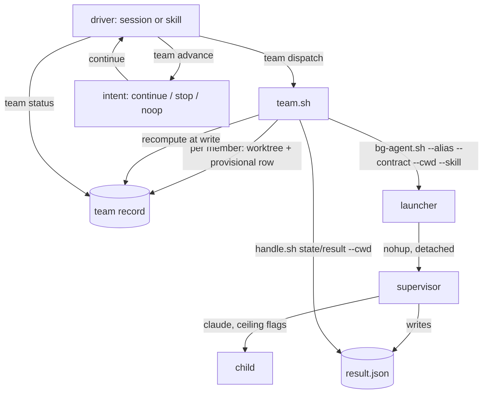
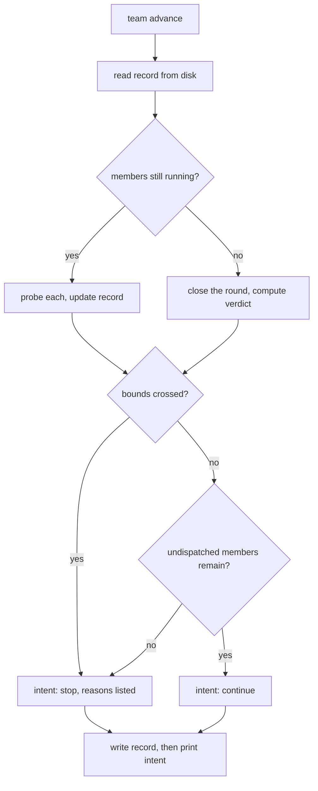

# Spawn Teams - Plan

## Goal Capsule

**Objective.** Give the `spawn` plugin a `team` surface: a few named members, each on its own model with its own contract, dispatched together, judged mechanically, and reported per member. A driver runs rounds and hands control back between them.

**Authority.** `bash plugins/spawn/lib/bg-agent.sh --describe` and `plugins/spawn/lib/jobs.sh --describe` are authoritative over this document. Where this plan and the code disagree, the code wins and this plan is wrong. R11 records the one exception: `--describe` is currently incomplete, and U2 fixes it rather than treating the omission as the contract.

**Execution profile.** Bash 3.2. No CI. `bash plugins/spawn/tests/run-tests.sh all` is the entire gate.

**Stop conditions.** Stop and ask when: a verdict would need to read a model's prose; a new failure class seems to need a new exit code; or the two controls in R9 prove insufficient in practice.

**Tail ownership.** The implementer owns the version bump and the marketplace manifest sync (U9). Merging to main is publishing.

---

## Product Contract

### Summary

Add `team` to the `spawn` plugin. A team is a handful of named members, each with its own alias, contract and skills, dispatched as a round across sibling worktrees. One record holds the roster and every derived fact. A driver — the session — advances rounds and reports per member between them. Three defects in the primitives the team depends on are fixed first.

### Problem Frame

`bg-agent` runs one unattended job per worktree and returns a handle. Everything above one job is manual: a caller wanting three reviewers on three different models must claim three worktrees, track three handles, poll three bounded awaits, and reconcile three records by hand, with nothing telling it when the set finished or how it went.

The one-job-per-worktree lock is not the obstacle it looks like. `jobs.sh` keys the lock on `git rev-parse --show-toplevel`, so N worktrees hold N independent locks. What is missing is somewhere to write down who is on the team and how each one did.

This is a team rather than a swarm, and the distinction is load-bearing. A swarm is interchangeable workers dispatched for throughput. A team is a few differentiated members, each brought in for a lens the others do not have — one model per member, named, and reported individually. Per-member model choice is therefore the defining feature, not an option.

Two things make it worth building now. The single-job path became trustworthy: jobs authenticate, a job cannot forge its own record, and terminal jobs announce themselves. And `--skill` landed, so a member can be given the skill its task names instead of improvising something shaped like one.

### Requirements

**The team**

- R25. A team is a set of named members. Each member carries its own alias, contract and skill list, and every response reports members by name.
- R33. The team is stated in one file the caller writes: the mode, the bounds, and the members with their names, aliases, contract paths and skill lists. Every surface takes a run identifier rather than re-stating the team, so dispatch, advance and status cannot disagree about who is on it. The file's shape appears in `--describe`.
- R1. One command dispatches a round and returns a roster immediately.
- R2. Each member runs in its own git worktree, so the existing one-job-per-worktree lock is untouched.
- R3. The driver never dispatches a member into its own worktree.
- R4. A round dispatches at most a stated number of members concurrently; a roster larger than that dispatches over successive rounds rather than being refused.
- R5. A launch that fails records that member as failed and the round continues.

**Modes**

- R26. Three modes are supported and named in the response. **Attached**: the driver hands control back after each round with a per-member report. **Unattended**: the driver advances rounds on a timer without waiting to be asked. **Single-round**: one round, no loop, no driver — every member runs to a terminal state and records it, whether or not any session survives.
- R31. Single-round mode requires no process beyond the per-member supervisors that `bg-agent` already detaches. It refuses a roster larger than its concurrency maximum before any worktree is created, because it arms no driver and could not otherwise advance the remainder.

**The record**

- R27. One record per team run holds the roster, every member's outcome, the round verdicts, the bounds, and the stop reason. Every derived fact in it is recomputed at the single point where it is written, so no reader can observe a stale one and no reader recomputes it.
- R28. The advance step prints its intent as data — continue, stop, or nothing to do — and never schedules its own next run. Scheduling is the driver's action.

**The round and the verdict**

- R6. A round is not concluded until every member dispatched in it has reached a terminal state or a bound has fired. The driver does not block waiting for that — it re-enters, probes, and concludes the round when the condition holds.
- R32. No member is dispatched while a round is still in flight. The advance step reports a distinct waiting intent for as long as any member of the active round is non-terminal, and the concurrency maximum therefore bounds members in flight rather than members per dispatch call.
- R7. A verdict is computed only from fields the plugin measured. A model's prose never reaches one.
- R8. The verdict is default-deny: a member counts as passing only when its terminal state is `done`; every other state, including an unrecognised one, counts as failing.
- R24. Every failing member's entry distinguishes one that produced nothing from one whose deliverables were satisfied but whose terminal state was not `done`. Measured twice: a job that satisfied every deliverable still lands `degraded` when it attempted a tool that is refused **and recorded** — which is a tool omitted from the allow list, not one on the deny list, since a deny rule records nothing. A compliant member that probes its environment therefore fails R8. The pass rule stays default-deny; the distinction is surfaced, not folded in.
- R9. Two cross-writer channels into a member's worktree are closed while it runs: the driver writes nothing there between that member's launch and its terminal state, and the channels by which the child could have another process write for it are unavailable to it. Any other write into that worktree is credited to the member. Positive attribution is not delivered; see OQ1.

**The loop**

- R10. In attached and unattended modes the driver runs another round while the roster still holds members that have never been dispatched, and stops when it does not. Re-running a member that already ran is out of scope.
- R18. The loop runs at most a stated number of rounds, and stops when that number is reached whether or not members remain undispatched.
- R19. The loop stops when cumulative tokens across the team cross a caller-stated ceiling. There is no default ceiling — absent means no token bound. No ceiling is applied to any individual call.
- R21. Every reason the loop stopped is named in the response, as a list, distinguishably from finishing because the roster was exhausted. Two reasons firing in the same interval are both reported.

**Watching a round**

- R14. A caller can ask at any moment what every member is doing, and get an answer per member covering its resolved state, how long it has been running, which of its deliverables exist so far, its token usage, and the last line of its own job log.
- R15. Every field in that answer is probed or measured when asked. No field is read from a claim the member wrote, and none from its narrative. A member that has not reached a terminal state reports token usage as unknown, never as a number — the child emits usage only when it finishes.
- R30. The response carries a count of members whose token usage is unmeasured, and a team whose usage is wholly unmeasured reports the token ceiling as unenforceable rather than as satisfied.
- R20. Token usage is reported per member and per round, as the child reported it, with no conversion into money.
- R22. The run's position is rendered as a diagram: which rounds are finished, which is running, which are pending, and where each member of the running round stands.
- R23. Deliverables are rendered as a per-path checklist, one line per path the contract names, not as an aggregate count.
- R16. A live run surfaces itself in the session without being asked, on each prompt, for as long as it is running.
- R17. The in-flight surface and the terminal announcement are distinct: the terminal announcement fires once per run and is marked; the in-flight surface is ephemeral and repeats.

**The primitives the team depends on**

- R11. `--skill` is discoverable from `bg-agent.sh --describe`.
- R12. A provisioned skill is readable by the child that was given it, whatever the shape of its source directory.
- R13. A skill that could not be provisioned is named in the job's own record.

### Scope Boundaries

**In scope.** The `team` surface, its record, its rounds, its verdict, its watch surfaces, its driver, and the three primitive defects it depends on.

**Deferred to follow-up work.**

- Re-running a member. A round runs short; running it again is a new round the caller decides on. This covers both retrying a failure and continuing until enough members pass — neither is v1 behaviour.
- Truly headless multi-round running, where no session exists and something must still advance the loop. Single-round mode (R26) covers the unattended cases that matter without a detached driver.
- Narrowing the bare `Glob` and `Grep` entries in the repo-bounded ceiling. There is an in-flight design on `task/spawn-grep-ceiling-scope`; a team multiplies that read surface by N without changing its shape.
- Cross-worktree job enumeration for `/spawn:report`. A team carries its own record; extending the general status view is separate.

**Outside this plugin's identity.**

- A second loop engine. `auto` owns plan-to-work loops. This surface borrows its shape — session as driver, durable record, intent-as-data — and touches none of its code or its locked backend contract.
- Money. No price table, no dollar figure, no dollar ceiling. See KTD15.
- Any per-call spend cap, warning, or counter. See KTD14.

### Assumptions

- Member worktrees are cut from `HEAD`, so uncommitted work in the caller's tree is invisible to every member. A caller who wants a team to see work in progress commits first. Stated because a review team silently reviewing stale committed state looks exactly like a review team working.
- The gateway serves the aliases a caller names. Alias resolution and the chain refusal belong to `bg-agent` and happen before any network call; the driver does not pre-validate them.

### Outstanding Questions

- OQ1 (deferred). Positive writer attribution. R9 closes the two known cross-writer channels; it does not establish that the child was the writer, and no unit here does. A mechanism binding a filesystem change to the process that made it needs a pid-to-effect link that bash 3.2 and the job record do not provide.

  Why deferred rather than blocking: the verdict is **no worse than** today's per-job verdict, which likewise has no attribution. It is **not** more conservative, and the reason matters — a third-party write *inflates* a member's measured effect and can flip its deliverables to a false `done`. Default-deny does not catch that, because default-deny only rejects states that are not `done`. The residual risk is a false pass, and R9's two controls narrow the paths to it without closing the class. The Goal Capsule's stop condition covers the case where they prove insufficient.

  Note the scope: this risk is only live in unattended and single-round modes. In attached mode a bad verdict meets a human reading the report.

### Sources

- `plugins/spawn/lib/bg-agent.sh` — `supervisor_main`, the detach at `:621`, classification at `:999-1010`, the child's poll loop at `:960-964`.
- `plugins/spawn/lib/jobs.sh:271-291` — why the lock has no EXIT trap; `:149-165` — worktree resolution.
- `plugins/spawn/lib/handle.sh:25-34` — why `await` is bounded, and the three distinct answers (`handle_unknown`, `handle_expired`, `state:"failed"`) a reader must not collapse.
- `plugins/spawn/lib/skills.sh:156-188` — `spawn::skill_provision` and the bare `cp -R` at `:183`.
- `plugins/auto/lib/pulse.py:1-40` — one advance per wake-up, all state read from disk, intent emitted as data because `ScheduleWakeup` is a model tool a script cannot call, and persist-before-signal so a crash leaves a consistent record.
- `plugins/auto/lib/dispatcher.py:2-9, 453-455, 63-72` — cap as a per-call argument, never a constant; the per-step launch guard.
- `plugins/auto/lib/run_record_predicate.py:24-29` — derived state recomputed at the write chokepoint, making freshness structural.
- `plugins/spawn/tests/unit/supervisor.bats:4-13` — assert by effect, never on prose.
- `plugins/spawn/tests/unit/lens.bats:866-883` — the enumerated no-spend lint.
- `plugins/spawn/permissions/repo-bounded.settings.json` — the `$comment` recording that a not-allowed call is recorded in `permission_denials[]` while a deny rule leaves no entry.

---

## Planning Contract

### Key Technical Decisions

- KTD1. **The team surface lives in `spawn` and consumes its own surfaces.** It shells out to `bg-agent.sh`, `jobs.sh` and `handle.sh` as any caller would, and adds no execution engine. (session-settled: user-approved — chosen over a sibling plugin and over extending `auto`'s backend contract: that contract is locked and plan-to-work shaped, its fan-out hard-requires cmux, and it has no spawn awareness.)

- KTD17. **The driver is never a background job.** A `bg-agent` child cannot dispatch a team: measured, the ceiling does not reliably gate tools, and a branch is in flight to deny fan-out outright. The driver is the session, or a foreground shell the session runs. Stated because driver-as-job is the obvious wrong reading of KTD1.

- KTD4. **Waiting is re-entry, not blocking.** Governs R6-as-rewritten, R26, R28. The driver does not sit in a loop watching N jobs. It dispatches a round, writes the record, and returns. It is re-entered later — by the caller in attached mode, by a timer in unattended mode — reads the record, and decides. This is `auto`'s pulse shape: one smallest-useful advance per wake-up, all state read from disk, conversation context irrelevant. It replaces an earlier decision to hand-roll a bash barrier over bounded awaits, which the bash 3.2 lint made awkward and which this design makes unnecessary.

- KTD22. **The team travels as a file; every verb takes a run id.** Governs R33. A team is several members each with a name, an alias, a contract path and a skill list — a flag grammar for that is a parser nobody wants in bash, and it would have to be re-stated identically to `dispatch`, `advance` and `status` or they would disagree about the roster. So the caller writes one team file, `dispatch` reads it and returns a run id, and every later verb takes that id. This mirrors `bg-agent`, where the contract travels as a file copied into the job directory so a later edit cannot move the target; the team file is copied into the record for the same reason. The file's shape is declared in `--describe`, since a shape the caller must produce and cannot discover is the same defect as an undiscoverable flag.

- KTD5. **The roster lives in the record, not in shell variables.** Governs R25, R27. Members are named in JSON, where naming is free. Nothing holds a map in bash, so the lint forbidding `declare -A` never binds, and no pair of parallel indexed arrays can drift out of step.

- KTD18. **One write chokepoint recomputes every derived fact.** Governs R27. The verdict, the continuation condition, the bounds and the stop reasons are computed inside the single function that writes the record, immediately before the write. No reader recomputes them, because there is nowhere for a stale value to exist. Copied deliberately from `auto`, where the same discipline makes predicate freshness structural rather than remembered. The write is atomic — temp file then `mv`, the shape `jobs.sh` already uses for status files.

- KTD19. **Advance prints intent; the driver schedules.** Governs R28. `team advance` does one advance and emits `continue`, `stop` or `noop` as one JSON object in the standard envelope. It never schedules its own successor, because `ScheduleWakeup` is a model tool and no script can call it. The judgment stays in testable code; the tool call stays with the model. The record is written before the intent is printed, so a crash between the two leaves a consistent record with a detectably missing successor.

- KTD2. **One git worktree per member.** Governs R2. The lock is keyed on `git rev-parse --show-toplevel`, so N worktrees give N parallel jobs with no change to the record layer. (session-settled: user-approved — chosen over relaxing the one-job-per-worktree rule, which would rewrite the claim, the lock and the argv-marker probe to serve a caller that can just use another worktree.)

- KTD3. **The surface is named `team`.** A new command `commands/team.md`, a new `lib/team.sh`, a new `lib/team-view.sh`, a new `tests/unit/team.bats`. No new skill name: the existing `spawn` router skill gains a section, and a driving skill takes a distinct name. `supervisor` is avoided — `lib/setup-supervisor.sh` is the launchd verb and `tests/unit/supervisor.bats` is bg-agent's suite. A command and a skill sharing a name silently disables the skill. Note the harness has its own agent teams; the two are the same idea at different privilege levels, and the docs should say so rather than pretend the word is unclaimed.

- KTD6. **The verdict is default-deny, and the false-fail is surfaced rather than fixed by widening the pass rule.** Governs R8, R24. `pass` is the single literal `done`. Enumerating failure states is default-allow and leaks — the repo has a logged case where patching cited instances never converged across four review rounds and inverting to default-deny did. Measured cost: a probe job satisfied all three deliverables and still landed `degraded`, because `done` also requires zero `permission_denials` and it had attempted a refused tool. Widening `pass` would mean re-deriving a verdict from the record's parts, which KTD7 forbids, so R24 surfaces the distinction instead.

- KTD7. **Per-member classification is reused, never redone.** Governs R7. `bg-agent`'s supervisor already classifies by effect against a pre-job baseline, runs the contract's `verify` command itself, and marks `narrative.text` untrusted. The team reads `terminal_state` and `deliverables_satisfied` — both already `trusted_fields` — and aggregates. Re-deriving a verdict would create a second definition of done that drifts from the supervisor's.

- KTD9. **Concurrency is a caller-supplied argument with a low default, and a larger roster clamps rather than refuses.** Governs R4. `auto`'s dispatcher takes `cap` per call and never hardcodes a constant. Refusing a large roster would push the caller into hand-batching, which is the work this surface removes. A team is a handful of members, so the cap is a guard rather than a throughput knob.

- KTD14. **The team counts tokens across calls; it never caps a call.** Governs R19, R20. The gateway plugin's KD2 assigns cost discipline to "whichever skill is doing the calling", and its rejected alternative was a per-call token cap; its R7 forbids a cap, warning or counter "applied to any call". The team is that caller, its ceiling governs whether *more* calls happen, nothing is passed down to `bg-agent` per call, and U13 tests that no ceiling value reaches a child's argv. Confirmed against those sources by an independent review rather than assumed. The enumerated no-spend lint keeps passing because the bound is token-denominated and the identifiers avoid `spend`, `budget`, `cost`, `quota`, `dollar`, `usd` and `price`.

- KTD20. **The token ceiling has no default.** Governs R19. R19 says a *stated* ceiling, and a default would be plugin-imposed discipline the caller never asked for — the thing KD2 declines to do. Absent means no token bound. The round cap keeps its default, because a runaway loop with no round bound is a different failure from an unpriced one.

- KTD15. **No money, and no price table.** Governs R20. Tokens are reported as the child reported them and never converted. A per-alias rate table in plugin code is the opinionated thing KD2 rejected and goes stale silently the first time a provider reprices; the rates already live as comments in the operator's own `gateway.yaml`. (session-settled: user-directed — chosen over a dollar ceiling with a bundled price table.)

- KTD16. **Token usage is passthrough of a field `bg-agent` discards.** Governs R20, R30. The child's result JSON carries `usage.input_tokens` and `usage.output_tokens`; `bg-agent.sh` never reads it. U12 captures it as a trusted field, because the supervisor takes it from the CLI's envelope rather than from prose — a team that asked its members how many tokens they used would be asking the untrusted narrator. Verified for the fixture; the real CLI's envelope is only exercised by the live-gated arms, so R30 makes an unmeasured team say so rather than report zero.

- KTD10. **Per-member skills are in v1, and the defects the team would inherit are fixed first.** Governs R11, R12, R13. (session-settled: user-directed — chosen over shipping on the primitive as-is and over cutting per-member skills: the team would otherwise depend on a primitive broken for the common skill layout on this machine.)

- KTD11. **`spawn::skill_provision` dereferences the top-level source only.** Governs R12. `cp -R` preserves symlinks, so a skill whose source is a symlink lands in the worktree as a symlink resolving outside it, and the ceiling refuses the child's read — a path is resolved before it is matched. Dereference the source directory itself, but do not follow nested symlinks that resolve outside the source root, or an unbounded dereference materialises outside-root content as real child-readable files.

- KTD12. **Progress is deliverable presence, not member self-report.** Governs R14, R15. The child returns one object when it finishes, so there is no stream and no honest mid-run self-report. What the driver can do is what the supervisor does at the end: fingerprint the contract's deliverables against the pre-job baseline. Run at any moment, that yields per-path progress without the member's cooperation, and it degrades correctly — a member that produced nothing shows nothing, whatever its narrative claims.

- KTD13. **Two watch surfaces, one record.** Governs R16, R17. `team status` answers on demand; the prompt hook prints a one-line in-flight summary unasked. Both read the same record and both probe live. The terminal announcement keeps its once-and-marked discipline; the in-flight line is never marked, because a run still going is still news on the next prompt.

- KTD21. **The rigor is the price of the unattended modes.** Default-deny, the false-fail distinction, and R9's closed channels earn their keep only where nobody reads the report. In attached mode the human is the backstop. Recorded so a later reader does not mistake these for general belt-and-braces and trim them, and so the cost is understood as buying R26's second and third modes specifically.

### High-Level Technical Design

The driver is a caller with a file. It holds no state of its own between rounds, and every judgment is a count over records other processes wrote.



Rounds advance by re-entry, not by blocking:



The three modes differ only in who re-enters:

| Mode | Who advances | Loop? | Survives session end? |
|---|---|---|---|
| Attached | the caller, between rounds | yes | dispatched members do; the loop does not |
| Unattended | a timer the driver arms | yes | dispatched members do; the loop does not |
| Single-round | nobody — there is nothing to advance | no | yes, fully |

---

## Implementation Units

Units are in build order. U-IDs are stable and were assigned as the plan grew, so the numbering is not sequential — read the order on the page. U5 is absent: the bash barrier it described was removed by KTD4.

| U-ID | Title | Key files | Depends on |
|---|---|---|---|
| U1 | Dereference a provisioned skill's source | `lib/skills.sh` | — |
| U2 | Put `--skill` in the bg-agent contract | `lib/bg-agent.sh` | — |
| U12 | Capture the token usage `bg-agent` discards | `lib/bg-agent.sh` | — |
| U14 | The team record and its write chokepoint | `lib/team-record.sh` | — |
| U3 | Roster: worktrees and provisional rows | `lib/team.sh` | U14 |
| U4 | `team dispatch` — one round, then exit | `lib/team.sh` | U3 |
| U15 | `team advance` — one advance, prints intent | `lib/team.sh` | U4, U14 |
| U13 | Bounds and stop reasons | `lib/team-record.sh`, `lib/team.sh` | U15, U12 |
| U7 | Close the cross-writer channels | `permissions/repo-bounded.settings.json` | U3 |
| U10 | `team status` | `lib/team-view.sh` | U14, U12 |
| U11 | Surface a live run on every prompt | `hooks/job-report.sh` | U10 |
| U8 | Announce a finished run once | `hooks/job-report.sh` | U14 |
| U16 | The driving skill | `skills/team-run/SKILL.md` | U15, U10 |
| U9 | Enrol in the repo-wide gates and publish | `tests/unit/lens.bats`, `.claude-plugin/plugin.json` | all |

### U1. Dereference a provisioned skill's source

**Goal.** A skill whose source directory is a symlink lands in the member's worktree as a real directory the child can read.

**Requirements.** R12, KTD11.

**Dependencies.** None.

**Files.** `plugins/spawn/lib/skills.sh`, `plugins/spawn/tests/unit/skills.bats`.

**Approach.** `spawn::skill_provision` copies with `cp -R` at `skills.sh:183`, which preserves symlinks. Dereference the source directory itself so the destination is a real tree. Do not follow nested symlinks that resolve outside the source root — an unbounded dereference turns outside-root content into real child-readable files inside the worktree, which is a wider hole than the one being closed. Leave the manifest write and the failure branch untouched.

**Patterns to follow.** The existing failure branch in the same function: print a sanitized `skill_copy_failed` line to stderr, set `rc=1`, continue to the next name.

**Test scenarios.**
- A skill whose source is a symlink provisions to a real directory: assert the destination is not a symlink.
- A skill whose source is a real directory still provisions to a real directory with a readable `SKILL.md`.
- A symlinked skill's nested files land as real files, reachable by a path that stays inside the worktree.
- A nested symlink inside the source that resolves outside the source root is not materialised at the destination.
- A nested symlink resolving inside the source root still works.
- The manifest records one line per provisioned skill for both source shapes.
- A source that disappears between resolution and copy leaves `rc=1`, prints `skill_copy_failed`, writes no manifest line.
- Provisioning three skills where the second fails still provisions the third.

**Verification.** `bats plugins/spawn/tests/unit/skills.bats`. Mutation check: restore `cp -R` and confirm the symlink scenario turns red.

### U2. Put `--skill` in the bg-agent contract

**Goal.** A caller reading `bg-agent.sh --describe` as data can discover `--skill`.

**Requirements.** R11, R13.

**Dependencies.** None.

**Files.** `plugins/spawn/lib/bg-agent.sh`, `plugins/spawn/tests/unit/describe.bats`.

**Approach.** Add `--skill` to the `flags` array with its repeatability and provisioning semantics, and a note that a skill which fails to provision is named in the record while the job still runs. `--describe` is answered before `--alias` is required and before preflight; adding an entry must not change that.

**Test scenarios.**
- `--describe` output contains a `flags` entry named `--skill`.
- That entry declares the flag repeatable.
- `--describe` still exits 0 with no gateway reachable and no config present.
- The describe output remains exactly one JSON object on stdout.
- A job launched with an unprovisionable skill still runs, and its record names the skill that did not land.

**Verification.** `bats plugins/spawn/tests/unit/describe.bats`, and `bash plugins/spawn/lib/bg-agent.sh --describe | jq -e '.flags[] | select(.name == "--skill")'` exits 0.

### U12. Capture the token usage `bg-agent` discards

**Goal.** A job's record carries the tokens its child consumed.

**Requirements.** R20, R30, KTD16.

**Dependencies.** None.

**Files.** `plugins/spawn/lib/bg-agent.sh`, `plugins/spawn/tests/unit/supervisor.bats`.

**Approach.** `sup_write_result` already reads `child.json` for denials, narrative and session id. Read `usage.input_tokens` and `usage.output_tokens` in the same pass and record them in the same jq program. Add them to `trusted_fields` in `--describe`. Absent or non-numeric values record as null, never zero — zero is a measurement and null is the absence of one.

**Patterns to follow.** The guarded `child.json` reads at the top of `sup_write_result`; the trusted/untrusted split in `emit_describe`.

**Test scenarios.**
- A completed job's record carries counts matching what the fixture reported.
- A `child.json` with no `usage` object records both counts null and the job still classifies normally.
- A `usage` value that is not numeric records null rather than propagating the string.
- A job whose child never produced a result records null counts and still reaches a terminal state.
- Both counts appear in `--describe`'s `trusted_fields` and neither in `untrusted_fields`.
- Recording usage changes no existing classification: a `degraded` job stays `degraded`, a `done` job stays `done`.

**Verification.** `bats plugins/spawn/tests/unit/supervisor.bats` and `bats plugins/spawn/tests/unit/describe.bats`. Mutation check: drop the usage read and confirm the first scenario turns red.

### U14. The team record and its write chokepoint

**Goal.** One file holds the run, one function writes it, and every derived fact is recomputed there.

**Requirements.** R27, KTD18, KTD5.

**Dependencies.** None.

**Files.** `plugins/spawn/lib/team-record.sh` (create), `plugins/spawn/tests/unit/team-record.bats` (create).

**Approach.** A sourced fragment that declares its own dependencies on `sanitize.sh` and `common.sh` — the sink lint walks source edges transitively, so a fragment inheriting its chokepoints must say so.

The record holds: the run id, the mode, the caller's bounds, a round ledger, and a list of members.

Each **round** entry carries its ordinal, its state (`running`, `finished`), the time it opened, the time it closed, and its verdict once closed.

Each **member** row carries its name, alias, worktree, contract path, skill list, launch state (`pending`, `dispatched`, `launch_failed`), a nullable handle, its round assignment once dispatched, its `started_at`, and once terminal, its outcome and token counts.

Enumerate this schema before implementing the chokepoint, and derive it from what later units read rather than from what dispatch happens to know: U10 needs round membership and `started_at` for the diagram and for elapsed; U13 needs per-round token totals; U15 needs the active round's state to decide whether a dispatch is permitted. A field a later unit reads and this schema omits becomes hidden state or a reader-side recomputation, which is the drift KTD18 exists to prevent.

One function writes the record. Inside it, immediately before the write: recompute the per-round verdict, the continuation condition, the bounds evaluation, and the stop reasons, and store them. Readers read those fields. No reader recomputes them. The write is atomic — temp file then `mv`, the shape `jobs.sh` already uses.

**Patterns to follow.** `plugins/auto/lib/run_record_predicate.py:24-29` for why recomputation lives at the write. `jobs.sh:355-378` for the whole-file temp-then-`mv` write and for treating a truncated read as "says nothing".

**Execution note.** Build this first and make the recompute-on-write property a test before anything else consumes the record. It is the property every later unit leans on, and the cheapest place to get it wrong is at the start.

**Test scenarios.**
- A record written and read back round-trips every member field, including round assignment and `started_at`.
- The round ledger round-trips: ordinal, state, open time, close time, and verdict once closed.
- Every field U10 and U13 read is present in a record written by U14 alone — assert per field, so an omission fails here rather than surfacing as hidden state later.
- The verdict field is present immediately after a write, with no separate compute call.
- Mutating a member's outcome and writing recomputes the verdict; the previous value is not observable.
- A reader that reads twice without an intervening write sees identical derived values.
- A truncated or malformed record reads as "says nothing" rather than as a partial record.
- Two writes in sequence leave no temp file behind.
- A write that fails mid-way leaves the previous record intact and readable.
- Member names are unique within a record; a duplicate name is refused.
- The record holds no map in shell — no `declare -A` or `local -A` anywhere in the file.
- No function body duplicates one in another shipped file.

**Verification.** `bats plugins/spawn/tests/unit/team-record.bats`, and `bash plugins/spawn/tests/run-tests.sh unit` stays green, in particular the duplicate-body scan.

### U3. Roster: worktrees and provisional rows

**Goal.** One worktree per member, one provisional row per member, and teardown that removes exactly what was created.

**Requirements.** R2, R3, R25.

**Dependencies.** U14.

**Files.** `plugins/spawn/lib/team.sh` (create), `plugins/spawn/tests/unit/team.bats` (create).

**Approach.**
1. Call `need_jq` before anything that emits JSON, as `bg-agent.sh` does.
2. Resolve the driver's own worktree and refuse to place a member in it.
3. Create one detached worktree per member, as siblings under the project's `worktrees/` directory in a per-run subdirectory — placement is load-bearing for the driver's own `git status`, for U7's snapshot, and for teardown.
4. Write every member's row as `pending` before any dispatch, with a null handle. A handle does not exist until U4's launcher returns one, and a launch can fail without producing one, so the row cannot wait for it.
5. Add `.git/info/exclude` coverage so created worktrees do not pollute git.

Declare a `worktree_failed` error value with its own remedy, and use it when `git worktree add` fails.

**Patterns to follow.** `spawn::skill_provision`'s manifest-and-teardown pair — write what you created, remove what the record names, never glob the destination. `spawn::skill_git_exclude`.

**Test scenarios.**
- Requesting three members creates three worktrees, each resolving to a distinct `git rev-parse --show-toplevel`.
- The driver's own worktree never holds a member; requesting one there is refused with exit 2 and a named error.
- Every member row is written `pending` with a null handle before any dispatch.
- Teardown removes exactly the worktrees the record names and leaves a sibling worktree created outside the run untouched.
- Teardown after a partial roster removes what was created and does not fail on what was not.
- A worktree path that cannot be created records that member `launch_failed` with `worktree_failed` and leaves the rest of the roster intact.
- `worktree_failed` has a distinct non-empty remedy.
- Absent `jq` produces one JSON-shaped refusal, not a crash.

**Verification.** `bats plugins/spawn/tests/unit/team.bats`.

### U4. `team dispatch` — one round, then exit

**Goal.** Dispatch up to the concurrency maximum, record every handle, and exit. No waiting.

**Requirements.** R1, R4, R5, R25, KTD9, KTD17.

**Dependencies.** U3.

**Files.** `plugins/spawn/lib/team.sh`, `plugins/spawn/tests/unit/team.bats`.

**Approach.** The caller supplies a team file (R33, KTD22) naming the mode, the bounds and the members. Copy it into the record at dispatch so a later edit cannot move the target, exactly as `bg-agent` copies its contract into the job directory. Return a run id; every later verb takes that id rather than the file. Refuse a team file that is not one JSON object, names no members, or gives two members the same name.

Name the bound flags explicitly and put them, and the team file's shape, in `--describe`: the concurrency maximum, the round maximum, and the token ceiling. A flag overrides the file's value for the same bound.

**Dispatch is mode-aware, and enforces R31 here rather than in U16's prose.** A single-round team file whose roster exceeds the concurrency maximum is refused with exit 2 and its own error value, before any worktree is created. Single-round arms no driver, so an accepted oversized roster would strand the remainder `pending` forever with nothing able to advance them. The refusal must live in the script: U16 is a skill, and "exit 2, and no worktree exists afterwards" can only be turned red by code. Dispatch in roster order up to the concurrency maximum, shelling out to `bg-agent.sh` with that member's `--alias`, `--contract`, `--cwd` and its own `--skill` values. Atomically replace each member's `pending` row with `dispatched` plus the handle, or `launch_failed` plus the launcher's own error value. Then return the roster and exit — the round is in flight and nothing is watching it.

Wrap each launch so a non-zero exit records that member and the loop continues to the next.

**Patterns to follow.** `plugins/auto/lib/dispatcher.py:63-72` — the per-step launch guard, and its reason: a raise that propagates abandons every remaining step. `bg-agent.sh:428-438` for the single-call-site shape when shelling out to a sibling surface.

**Execution note.** The two argv scenarios below are the ones that matter. This repo has shipped a flag parsed by a launcher and arriving empty at a detached supervisor with green unit tests either side. Assert on `FAKE_CLAUDE_RECORD_DIR/argv`, which the child appends to — that record crosses the boundary; a launcher-side assertion does not.

**Test scenarios.**
- Four members with a maximum of two dispatch two; the other two stay `pending`.
- A roster larger than the maximum clamps rather than refusing: `ok:true`, and the response names how many remain.
- A launch that exits non-zero records that member `launch_failed` and the next member is still dispatched, proven by the fixture's argv record holding an invocation for the later member.
- Every dispatched member's row carries its handle before the next launch begins.
- A launch refused with `job_already_running` records that member's failure without retrying.
- Each child receives its own alias — assert on the fixture's appended argv record, one entry per member.
- Each child receives the `--skill` values named for its member and no others, on the same record.
- Dispatch returns without waiting for any member to finish: assert the command exits while a `hang`-mode member is still live.
- The three bound flags and the team file's shape appear in `--describe`.
- The team file is copied into the record at dispatch; editing the original afterwards does not change the run.
- A team file that is not one JSON object, names no members, or repeats a member name is refused with exit 2 and a named error.
- A bound given both in the file and as a flag takes the flag's value.
- `dispatch` returns a run id, and `advance` and `status` accept it without re-stating the team.
- A single-round team file whose roster exceeds the concurrency maximum is refused with exit 2 and a named error, and no worktree exists afterwards.
- The same roster in attached or unattended mode is accepted and dispatches its first round.
- That refusal's error value carries a distinct non-empty remedy.

**Verification.** `bats plugins/spawn/tests/unit/team.bats`. Mutation check: drop the per-member `--skill` forwarding and confirm the argv scenario turns red.

### U15. `team advance` — one advance, prints intent

**Goal.** One advance of the run, and an intent the driver can act on.

**Requirements.** R28, R10, R26, KTD4, KTD19.

**Dependencies.** U4, U14.

**Files.** `plugins/spawn/lib/team.sh`, `plugins/spawn/tests/unit/team.bats`.

**Approach.** Take the run lock for the whole read-probe-write-print operation, and release it at the end. Atomic rename prevents a torn file; it does not prevent two re-entries both reading the same record, both computing an advance, and the second overwriting the first. Use the `mkdir` primitive `jobs.sh` already uses, with the same discipline: the holder is the advance, a stale holder is broken by `mv`-then-remove rather than a bare `rm -rf`, and the lock is scoped to the run.

Read the record from disk — never from arguments, never from an environment carried across calls. For each `dispatched` member not yet terminal, resolve its state with `jobs.sh state --cwd <its worktree>`, and for terminal ones read the outcome with `handle.sh result --cwd <its worktree>`. Keep the three distinct answers `handle.sh` gives distinct: `handle_unknown`, `handle_expired`, and a `state` of `failed`, which is a successful answer and not an error.

Write the record — which recomputes the verdict, the bounds and the stop reasons — and then print the intent. The intent is decided from **round state first, roster state second**:

- `waiting` while any member of the active round is non-terminal. No dispatch may follow this intent. Without it, `continue` fires while a round is in flight, the driver dispatches again, and the concurrency maximum bounds members per call rather than members in flight — which is R32, and which R6 forbids. The `waiting` envelope alone carries a `delay` in seconds, clamped to `[60, 3600]`, computed from the active round's age against the child deadline: a round that just started can wait longer than one about to resolve. The driver schedules that value verbatim, so the pacing judgment is testable here rather than living in a skill's prose. No other intent carries a `delay` and no reader should look for one.
- `continue` when the active round has closed, undispatched members remain, and no bound is crossed.
- `stop` when a bound fired or the roster is exhausted, with every reason listed.
- `noop` when the run lock is held by a live advance.

Write before printing, so a crash between the two leaves a consistent record whose missing successor is detectable.

`advance` never dispatches and never schedules. Dispatch belongs to U4; scheduling belongs to the driver.

**Patterns to follow.** `plugins/auto/lib/pulse.py:1-40` for the whole shape — one advance, state from disk, intent as data, persist-before-signal.

**Test scenarios.**
- With the active round closed, undispatched members remaining and no bound crossed, the intent is `continue`.
- With any member of the active round still running, the intent is `waiting` — not `continue` — even when undispatched members remain.
- Repeated advances during a live round never yield `continue`, so no second batch can be dispatched: assert the fixture's argv record gains no entries across three advances.
- Members in flight never exceed the concurrency maximum across a full multi-round run.
- With no undispatched members remaining, the intent is `stop` with the roster-exhausted reason.
- A member still running is probed and left running; the advance returns rather than blocking on it.
- Two advances racing on one record: the second returns `noop` and does not overwrite the first's result — assert the first advance's changes survive.
- A stale run lock whose holder is gone is broken and the advance proceeds.
- A `waiting` intent carries a numeric `delay` within `[60, 3600]`; `continue`, `stop` and `noop` carry none.
- A round that just opened yields a longer `delay` than one whose members are near the child deadline.
- A member whose supervisor pid is gone resolves `failed`, not whatever its status file claims.
- `handle_unknown` for one member does not abort the advance for the others.
- A `state` of `failed` is treated as an answer, not an error.
- Every `jobs.sh` and `handle.sh` call carries `--cwd` for that member's own worktree, with a control arm proving the assertion can fail.
- The record is written before the intent is printed: with the print path made to fail, the record still shows the advance.
- `advance` dispatches nothing — assert the fixture's argv record is unchanged across an advance.
- The intent is exactly one JSON object in the standard envelope.

**Verification.** `bats plugins/spawn/tests/unit/team.bats`. Mutation check: remove `--cwd` from the state call and confirm the probe scenarios turn red rather than silently resolving against the driver's worktree.

### U13. Bounds and stop reasons

**Goal.** The run stops on a round count or a token ceiling, and says which — plural when both fire.

**Requirements.** R18, R19, R21, R30, KTD14, KTD20.

**Dependencies.** U15, U12.

**Files.** `plugins/spawn/lib/team-record.sh`, `plugins/spawn/lib/team.sh`, `plugins/spawn/tests/unit/team.bats`.

**Approach.** Evaluate three independent conditions at the write chokepoint: the roster is exhausted, the round maximum is reached, the cumulative token total crosses the ceiling. Record every condition that fired as a **list** — one scalar cannot carry two reasons, and the plural case is a required scenario. Distinguish roster-exhaustion from a bound: a run that stopped because it ran out of rounds has not finished its work.

The token ceiling is caller-supplied with no default; absent means no token bound. Evaluate it only between rounds — a dispatched round is already committed, so the ceiling can overshoot by nearly a round at high concurrency. That is accepted and documented.

A member whose usage is null contributes nothing to the total and increments an unmeasured count. If any completed member is unmeasured, stop before dispatching another round with a distinct unmeasured reason rather than treating unknown as zero — otherwise the bound is advisory while presenting as active. A wholly unmeasured team reports the ceiling unenforceable.

Name identifiers so the enumerated no-spend lint keeps passing.

**Execution note.** Write the two-conditions-fire-together test before the implementation. The natural bug is an `elif` chain reporting only the first condition checked, which reads as correct whenever exactly one fires.

**Test scenarios.**
- A run whose roster empties before its round maximum stops with the roster-exhausted reason and not the round reason.
- A run reaching its round maximum with members still undispatched stops with the round reason, and the response does not read as success.
- A run whose cumulative tokens cross the ceiling stops with the ceiling reason.
- Two conditions firing in the same interval are both listed.
- The ceiling is evaluated between rounds only: a dispatched round runs to its terminal state even when the ceiling is crossed mid-round.
- A completed member with null counts increments the unmeasured count and stops the loop with the unmeasured reason.
- A wholly unmeasured team reports the ceiling unenforceable rather than satisfied.
- No ceiling given means no token bound and no token stop reason.
- A ceiling of zero is refused at launch with exit 2 rather than dispatching nothing and reporting success.
- No ceiling value reaches `bg-agent` on any launch — assert on the child's recorded argv.
- Neither `team.sh` nor `team-record.sh` contains any of the seven forbidden spend words.

**Verification.** `bats plugins/spawn/tests/unit/team.bats` and the no-spend lint with both files enrolled. Mutation check: collapse the three conditions into an `elif` chain and confirm the two-conditions scenario turns red.

### U7. Close the cross-writer channels

**Goal.** A member cannot recruit another process to satisfy its contract, and the driver cannot contaminate a member's measurement.

**Requirements.** R9.

**Dependencies.** U3.

**Files.** `plugins/spawn/permissions/repo-bounded.settings.json`, `plugins/spawn/lib/team.sh`, `plugins/spawn/tests/unit/team.bats`, `plugins/spawn/tests/unit/ceilings.bats`.

**Approach.** Two halves, both narrow.

First, deny the child the tools that let it ask another process to act for it, naming each concrete tool in an explicit **deny** rule rather than relying on omission from the allow list.

The v1 set, in four groups, so a reader can tell what each entry is for:

- **Shell** — `Bash`. A shell reaches everything else, so this entry is the one that matters most.
- **Fan-out** — `Agent`, `Task`, `Workflow`, `TaskCreate`, `TaskUpdate`, `TaskGet`, `TaskList`, `TaskOutput`, `TaskStop`. A member that can spawn is a member that can delegate its deliverable.
- **Messaging and scheduling** — `SendMessage`, `RemoteTrigger`, `PushNotification`, `ScheduleWakeup`, `CronCreate`, `CronDelete`, `CronList`, `Monitor`. The measured recruitment channel was a message to another session; scheduling is the same thing deferred.
- **Outbound reach** — `WebFetch`.

This set shipped in plugin version 0.2.8, so U7 adopts the shipped ceiling rather than inventing a parallel list, and this plan's job is to test it by effect. **An enumeration cannot close the class** — the ceiling file says so about itself, and a tool added to the harness tomorrow is not on this list. Treat the set as the v1 floor and the effect tests as the check, not the list as a proof.

Measured against that shipped ceiling, with a value the child could not fabricate — a caller-supplied nonce whose SHA-256 it was asked to compute with `Bash`:

- **A deny rule blocks.** The child returned `REFUSED` for both the digest and a `date +%s`. It could not have guessed either.
- **A deny rule leaves no record.** `permission_denials[]` was empty despite two refused attempts, exactly as the ceiling file's `$comment` states.
- **Omission from the allow list also blocks**, but records the attempt. That is the only difference this probe found between the two mechanisms.

Prefer deny regardless: it is directly assertable in the rendered settings file, whereas omission's protection depends on `defaultMode` staying `dontAsk`. The forfeited attempt record is the accepted cost — R9's second control closes a channel rather than watching it.

**Probe design is load-bearing, and this plan got it wrong once.** An earlier probe asked the child to run `id -un` and treated the true username in its output as proof a shell had run. The username is a substring of the worktree path, so the child could produce it with no shell at all — and did, then wrote it with the `Write` tool after its `Bash` attempt was refused. That produced a false "refused yet usable" reading which stood in this plan through a full review round. Any future test of this ceiling must use a value that cannot be derived from what the child can already see. Extend the ceiling file's `$comment`, which narrates three bounds and would otherwise not mention this one.

Second, the driver writes nothing into a member's worktree between that member's launch and its terminal state. Its own record, logs and scratch live under the driver's worktree. `changed_files` unions a `find -newer` sweep with a `git status --porcelain` diff over the member's worktree, so any concurrent write there is attributed to the member.

**Test scenarios.**
- The rendered ceiling includes an explicit deny rule for every tool in the v1 set above — assert per group, so a dropped entry names itself.
- A child attempting a denied call does not achieve its effect: assert the artifact the tool would have produced is absent. Do not assert on a `permission_denials[]` entry — a deny rule leaves none, so that assertion would pass whether or not the rule existed.
- A control arm proves the effect assertion can fail: with the deny rule removed, the same attempt produces its artifact and the test goes red.
- The shell channel specifically: a member contracted to compute the SHA-256 of a **caller-supplied nonce** writes `REFUSED` rather than the digest. The nonce is what makes this a test — a value the child can read off its own path or environment proves nothing, because it can produce that without a shell.
- A denied attempt leaves `permission_denials[]` empty, and the job still classifies `done` when its deliverables are satisfied. Deny and omission differ here: only omission records, which is why R24's false-fail applies to not-allowed tools rather than denied ones.
- The driver writes no file into a member's worktree during its run: snapshot at dispatch and at terminal, and assert the only changes are the member's contracted deliverables plus its job directory.
- A control arm plants a driver write mid-run and the snapshot check catches it.
- The driver's own record and logs are inside the driver's worktree, not any member's.

**Verification.** `bats plugins/spawn/tests/unit/team.bats` and `bats plugins/spawn/tests/unit/ceilings.bats`.

### U10. `team status`

**Goal.** One command renders what every member is doing, probed at the moment of asking.

**Requirements.** R14, R15, R22, R23, R30, KTD12, KTD13.

**Dependencies.** U14, U12.

**Files.** `plugins/spawn/lib/team-view.sh` (create), `plugins/spawn/lib/team.sh`, `plugins/spawn/tests/unit/team-view.bats` (create).

**Approach.** A separate sourced file, following `lib/jobs-view.sh` — rendering is not the dispatch path's concern. Declare the `sanitize.sh` and `common.sh` dependencies explicitly.

Per member, gather five things:

1. **Resolved state** — via `jobs.sh state --cwd <its worktree>`. Never from a status file; a status file is a claim.
2. **Elapsed** — now minus the record's `started_at`.
3. **A deliverable checklist** — one line per path the member's contract names, each marked appeared-and-changed, present-but-unchanged, or absent, by comparing a current fingerprint against that member's `baseline.deliverables`. Present-but-unchanged is not progress and the checklist says so per path.
4. **Token usage** — the counts U12 records for a terminal member; `unknown` for one still running, never a number.
5. **Last lifecycle line** — the final line of the member's job log.

Render newest-first, cap the members shown, report the omitted count. Every interpolated value goes through the shared sanitizer at one sink — including the diagram string, which is built separately and must not bypass it.

**The loop diagram.** A mermaid `flowchart TB`: one node per round marked finished, running or pending, with only the running round expanded to one node per member carrying its resolved state. Generated from the same probed data as the rows — a second view of one set of facts, never a second source. Emitted as a string field so a consumer can print it or ignore it.

**Patterns to follow.** `plugins/spawn/lib/jobs-view.sh` end to end — the sourced-fragment shape, its explicit dependency declaration, the single sanitizer sink, the omitted-count convention. Extract the fingerprint comparison from `bg-agent.sh`'s classification block into `common.sh` and have the supervisor call it too; a second copy turns the duplicate scan red.

**Test scenarios.**
- Three members mid-round render three rows, each with resolved state, elapsed, checklist and usage.
- A member whose supervisor pid is gone renders `failed`, not what its status file claims — plant a `running` claim with a dead pid.
- A member whose argv marker does not match renders `failed` even though its pid is alive.
- A deliverable that existed before the job and was not touched is marked unchanged, not progress.
- A deliverable that appeared during the run is marked progress.
- The checklist has one line per contract path, including paths with nothing to report.
- A running member's usage renders `unknown`; a terminal member's renders its counts.
- The unmeasured count appears in the response.
- A member that produced nothing shows zero progress while its narrative claims completion — assert the narrative text appears nowhere in the output.
- A roster larger than the display cap renders the cap and reports the omitted count.
- A member whose worktree was removed renders unresolvable without aborting the render for the others.
- The diagram marks finished, running and pending rounds distinctly and expands only the running round.
- The diagram's member states match the row states for the same members in one response.
- The diagram string passes through the same sanitizer as the rows.
- Output is exactly one JSON object.
- No function body duplicates one in `jobs-view.sh` or `bg-agent.sh`.

**Verification.** `bats plugins/spawn/tests/unit/team-view.bats`. Mutation check: switch the state source to a direct `status.json` read and confirm the dead-pid and marker-mismatch scenarios turn red.

### U11. Surface a live run on every prompt

**Goal.** While a run is live, the session shows a one-line summary each prompt without being asked.

**Requirements.** R16, R17, KTD13.

**Dependencies.** U10.

**Files.** `plugins/spawn/hooks/job-report.sh`, `plugins/spawn/.claude/hooks/hooks.json`, `plugins/spawn/tests/unit/job-report.bats`.

**Approach.** The hook already runs on `UserPromptSubmit` with the right discipline: raw stdout as the channel, measured fields only, never the narrative, fail-open everywhere, exit 0 always. Add one branch — when the current worktree holds a record whose run is not terminal, print a single line carrying round position, member counts by resolved state, aggregate progress, unmeasured count, and elapsed.

The in-flight line is never marked. A run still going is still news next prompt, and marking it would show it once then go quiet for the hour that matters. U8's terminal announcement keeps its marker.

The hook has a five-second timeout and the render probes N members. Bound the work and print nothing rather than run long; silence is the designed failure mode.

**Test scenarios.**
- A live run prints one in-flight line on prompt submit.
- The same run prints again next prompt — the in-flight line is not marked.
- A terminal run prints the terminal announcement once and no in-flight line thereafter.
- The in-flight line carries no member's narrative text.
- A worktree with no record prints nothing and exits 0.
- A malformed record prints nothing and exits 0.
- A record naming a member whose worktree is gone still prints a line for the rest.
- The hook exits 0 and prints nothing when the probe would exceed its bound.
- Per-job terminal announcements in the driver's own worktree still work unchanged.

**Verification.** `bats plugins/spawn/tests/unit/job-report.bats`. Mutation check: add a marker write to the in-flight branch and confirm the repeat scenario turns red.

### U8. Announce a finished run once

**Goal.** A finished run announces itself once, not once per member.

**Requirements.** R17, KTD13.

**Dependencies.** U14.

**Files.** `plugins/spawn/hooks/job-report.sh`, `plugins/spawn/tests/unit/job-report.bats`.

**Approach.** A team's members live in sibling worktrees, so they never reach the driver's hook individually — the record is what announces. Have the hook recognise a terminal record in its own worktree and print one line with the verdict, the per-state counts and the stop reasons, then mark it, using the same fail-open and mark-after-write ordering the per-job path uses. Measured fields only; the hook must not learn to forward a narrative.

**Test scenarios.**
- A finished run produces exactly one announcement, not one per member.
- The announcement carries the verdict, the counts and the stop reasons.
- A second prompt after the run produces nothing.
- The announcement contains no member's narrative text.
- A malformed record prints nothing and exits 0.
- The marker is written only after the line is printed.

**Verification.** `bats plugins/spawn/tests/unit/job-report.bats`.

### U16. The driving skill

**Goal.** A skill that drives a team run in attached or unattended mode as pure glue over tested verbs — one advance per re-entry, dispatch only on `continue`, scheduling only from the model side — and that knows single-round mode has no driver at all.

**Requirements.** R26, R31, R32, R10, KTD4, KTD17, KTD19, KTD21, KTD9.

**Dependencies.** U15, U10. (U4 for the single-round refusal, which this unit moves into `team.sh` — see Approach.)

**Files.** `plugins/spawn/skills/team-run/SKILL.md` (create), `plugins/spawn/commands/team.md` (create), `plugins/spawn/skills/spawn/SKILL.md` (modify — the router gains a "several models at once → team" row and a short section, per KTD3), `plugins/spawn/lib/team.sh` (the single-round refusal and the intent envelope's `delay` field land here, not in prose), `plugins/spawn/tests/unit/surfaces.bats` (modify), `plugins/spawn/tests/unit/team.bats` (modify).

**Approach.**

The skill is the driver, and the division of labour is `auto`'s prepare/execute split, stated in the skill's own opening: **the scripts judge, the skill executes.** Every judgment that can live in `team.sh` lives there and is tested there; the skill's job is to call the verbs in the right order, act on the intent they print, report between rounds, and — in unattended mode only — issue the one tool call no script can (`ScheduleWakeup`, KTD19). Source of truth is the record on disk; the conversation is advisory. A re-entered session that remembers nothing loses nothing.

**Entry: new run or re-entry.** The command `/spawn:team` fronts both. The skill decides which it is holding from its argument, never from conversation memory:

- **A run id** → re-entry into a live or finished run. Call `team advance <run-id>` first; never dispatch first. The record answers whether the run is live: a terminal record means report the outcome and stop — never restart it, never dispatch into it. A run id the record layer does not know gets the record layer's own distinct answer relayed as-is (the `handle.sh` discipline: unknown, expired, and failed are three different facts).
- **No run id** → a new run. The caller supplies a team file (R33); its shape comes from `team.sh --describe`, not from this skill. Read the **mode** from the file, then branch:

**Single-round mode: dispatch once, arm nothing, done.** One `team dispatch`, report the roster, stop. There is no driver, no advance, no timer — the per-member supervisors own deadlines and records, and U8's terminal announcement reports the outcome whenever the caller returns. The oversized-roster refusal (R31) is **`team.sh` behaviour, not skill prose**: `dispatch` on a single-round team file whose roster exceeds the concurrency maximum refuses with exit 2 and a named error, before any worktree is created. It must live in the script because the skill cannot be mechanically held to it, and the plan's own scenario ("no worktree exists afterwards") can only go red against code. The skill documents the refusal and relays it; it enforces nothing.

**Attached and unattended modes: the per-round loop.** Ordered, per round:

1. **Choose this round's concurrency.** Per-round judgment, never a constant (KTD9, following `auto`'s dispatcher). Inputs: the record's undispatched remainder, last round's `launch_failed` count, the unmeasured-usage count (a team going unmeasured is about to hit U13's unmeasured stop — dispatching wide first wastes a round), and what the machine is doing. Resizable between rounds; passed as the flag U4 defines, which overrides the file's value.
2. **Dispatch:** `team dispatch` (new run: the team file, returns the run id; later rounds: the run id). The response says how many members remain.
3. **Advance:** `team advance <run-id>` — exactly one call, and the only place the skill learns anything about the round.
4. **Act on the intent.** Four intents, four distinct actions, no gaps:

   - **`continue`** — the active round closed, members remain, no bound crossed. This is the **only** intent that ever permits a dispatch. **Attached:** report the closed round's outcome and hand control back — the dispatch happens on the caller's next entry, whose own advance re-yields `continue` and loops to step 1. This is KTD21's human backstop made real: the human sees round N's verdict before round N+1 commits. **Unattended:** go to step 1 now and dispatch the next round.
   - **`waiting`** — the active round is in flight. **No dispatch may follow this intent** (R32 — acting on `waiting` as if it were `continue` is precisely the bug the intent exists to prevent). Report the in-flight state, then: attached → hand control back; unattended → arm the timer (below) and end the turn.
   - **`stop`** — report the verdict and **every** stop reason in the intent's list, distinguishing roster-exhausted from a bound (a run stopped by its round maximum has not finished its work, and the report must not read as success). Arm nothing. The run is over.
   - **`noop`** — another live advance holds the run lock. Do nothing and do **not** re-arm: the holder's initiator acts on the holder's intent, and a second timer here is how two chains end up racing one record.

5. **Report between rounds.** From `team advance`'s envelope and `team status` — probed fields only, never a member's narrative (R15). The report: round position (the U10 diagram is available for it), per member its name, resolved state, deliverable-checklist summary, and token counts or `unknown`; the unmeasured count; and on `stop`, the reason list. The modes differ here: **attached** reports every round and hands back; **unattended** reports only on `stop` and on any refusal it cannot act on — the in-between rounds are U11's job, whose in-flight line repeats on every prompt unasked; **single-round** reports once, at dispatch.

**Unattended arming.** On `waiting`, arm exactly one timer:

```
ScheduleWakeup(delay, "/spawn:team <run-id>")
```

Two mechanics are load-bearing, both learned in `auto`: the prompt must be the **namespaced** `/spawn:team` form — a bare command name fired from `ScheduleWakeup` is "Unknown command" — and delay clamps to `[60, 3600]` seconds. The delay is **data from the intent**: U15's `waiting` envelope carries a `delay` field computed in `team.sh` (from the active round's age against the child deadline — 900s — a fresh round can wait longer, an old one is about to resolve), so the skill executes `ScheduleWakeup(intent.delay, prompt)` verbatim and the pacing judgment is testable in `team.bats` rather than living in prose. Only `waiting` carries `delay` — a `continue` in unattended mode is acted on in the same turn (dispatch, then the follow-up advance yields `waiting`, which carries the delay), so no other intent needs one and nothing else should read one. Never arm on `stop` or `noop`. One timer per run: the re-entry it fires runs one advance and arms its own successor if still waiting.

**Session death, and what the user comes back to.** State this honest boundary in the skill body, plainly: dispatched members and their supervisors are detached and survive; the loop — and in unattended mode the armed wakeup, which lives in the session — does not. Nothing is lost: the record is consistent (U15 writes before it prints), every in-flight member runs to a terminal state and records it. But no new round starts until something re-enters. One deliberate corollary: an unattended re-entry that lands `noop` — a foreground advance holds the lock — arms nothing, so if the lock-holder's initiator never acts on its intent, the chain ends there. That cost is accepted because the alternative, re-arming on `noop`, forks the chain: two timers each arm their own successor and double-advance the run forever, with no dedupe mechanism to collapse them. Either way the failure is visible and cheap: what the user sees on return is U11's in-flight line (run still going) or U8's announcement (run reached terminal by itself), and the resume action is one command: `/spawn:team <run-id>`.

**What the skill must never do.** Explicit, because prose rules are the ones violated silently:

- Never dispatch on any intent but `continue` (R32).
- Never block, poll, or sleep-loop waiting for members. Waiting is re-entry (KTD4).
- Never re-arm on `stop` or `noop`.
- Never re-derive a verdict, widen `done`, or read the record's parts to second-guess its derived fields — **read, never re-derive** (KTD7, KTD18). The verdict is what the record says.
- Never treat a member's narrative as fact or forward it as one; quote or summarize, marked (R7, R15).
- Never write into a member's worktree between its launch and its terminal state (R9).
- Never run the driver as a background job (KTD17) — the driver is this session or a foreground shell it runs.
- Never hardcode a concurrency constant (KTD9).
- Never schedule from a script or expect one to; `advance` prints intent, the skill calls `ScheduleWakeup` (KTD19).
- Never arm anything in single-round mode (R31).

**The command.** `commands/team.md` is self-sufficient (the surfaces suite forbids deferring to a skill): it names `${CLAUDE_PLUGIN_ROOT}/lib/team.sh`, states the run-id-vs-team-file branch and the four intents in brief, and passes `$ARGUMENTS` through. The skill carries the full loop; the command carries enough to act alone. Name disjointness is structural: command `team`, skill `team-run`.

**Patterns to follow.** `plugins/auto/skills/auto/SKILL.md` — the prepare/execute split, the intent-dispatch table, the never-re-arm-on-stop/noop rule, "read, never re-derive". `plugins/auto/lib/pulse.py:1-40` — the model-tool boundary the delay-as-data design mirrors. `plugins/spawn/skills/status/SKILL.md` — frontmatter shape and the do-not-self-trigger clause. `plugins/spawn/commands/bg-agent.md` — the self-sufficient command shape.

**Execution note.** Write the skill **after** U15's envelope is real, and derive the intent list and field names from `team.sh`'s actual output, not from this plan — a skill quoting an envelope shape the code never shipped is this repo's documented failure mode. If U15 lands without the `delay` field, add it there first; do not compensate with a delay constant in the skill.

**Test scenarios.** Three honesty buckets, named as such.

*Mechanically checkable in `surfaces.bats` (static, cannot regress silently):*
- The command name (`team`) and both skill names (`team-run`, and `spawn` as modified) remain disjoint — the existing dynamic R1 loop catches this once the files exist; raise the enumeration guards' minimum counts with them.
- `team-run/SKILL.md`'s frontmatter carries the literal strings `do NOT` and `conversational phrasing` — the globbed do-not-self-trigger test auto-enrols every new skill, so the file goes red the moment it exists without the clause. This skill is invoked by name or via the command, never conversationally; the router (`spawn`) remains the front door.
- `commands/team.md` carries exactly one `description:` and one `argument-hint:` in frontmatter and ends with `$ARGUMENTS` (globbed, free).
- `team:lib/team.sh` is added to the R20 "names the script it runs" pairs array — that gate is a hardcoded enumeration a new command must join or sit uncovered.
- `commands/team.md` and `team-run/SKILL.md` both contain the namespaced string `/spawn:team`, and the arming instruction quotes no bare-name wake prompt.
- `team-run/SKILL.md`'s body names all four intent words — `continue`, `waiting`, `stop`, `noop` — each at least once. A presence check only: it cannot prove correct handling, but it goes red on the omission this plan itself shipped in an earlier draft (a body handling three intents of four).

*Checkable by effect on the record (in `team.bats`, because the behaviour was moved into `team.sh`):*
- Single-round dispatch with a roster over the concurrency maximum exits 2 with a named error and its own distinct remedy, and no worktree exists afterwards.
- Single-round dispatch at or under the maximum dispatches every member; `advance` on that run returns `stop` (roster exhausted) rather than expecting a driver.
- The `waiting` envelope carries a numeric `delay` within `[60, 3600]`; `continue`, `stop` and `noop` carry none.

*Genuinely uncheckable, named rather than papered over:* that a live session follows the loop order, chooses a defensible cap, actually issues the `ScheduleWakeup`, or reports honestly. No harness in this repo runs a model, and a test of the prose would pass regardless of the prose. The mitigation is structural, not asserted: every consequential judgment was moved into a verb this plan tests (`dispatch` refuses, `advance` gates dispatch via `waiting`, `delay` is computed in code), so the skill that remains is glue whose worst silent failure is a stalled loop — which the record survives, U11 surfaces, and one `/spawn:team <run-id>` resumes.

**Verification.** `bats plugins/spawn/tests/unit/surfaces.bats` and `bats plugins/spawn/tests/unit/team.bats`. Mutation check for the presence assertions: delete the `waiting` section from the skill body and confirm the four-intents scenario turns red.

### U9. Enrol in the repo-wide gates and publish

**Goal.** The new files are covered by the gates that do not auto-enrol, and the plugin is publishable.

**Requirements.** All — this unit makes the rest verifiable.

**Dependencies.** All. Runs last.

**Files.** `plugins/spawn/tests/unit/lens.bats`, `plugins/spawn/tests/unit/envelope.bats`, `plugins/spawn/tests/unit/describe.bats`, `plugins/spawn/.claude-plugin/plugin.json`, `.claude-plugin/marketplace.json`.

**Approach.** Three gates enumerate their targets by hand, so a new file joins them or is silently uncovered:

1. The no-spend lint in `lens.bats` iterates a named list. Add `team.sh`, `team-record.sh` and `team-view.sh`.
2. `envelope.bats` and `describe.bats` hardcode their surface list. Either add `team.sh` there or replicate the equivalent assertions in `team.bats`: envelope on success and on refusal, the no-jq tier over a jq-free PATH, `--describe` exit 0, `--help` exit 2 with `help_requested:true`.

Three gates auto-enrol by globbing `lib/*.sh` and need no registration but do constrain the code: the bash 3.2 idiom lint, the token chain lint, and `check-remedies.py`, which requires every declared error class to carry a distinct non-empty remedy.

Bump `plugin.json` from 0.2.5 to 0.2.6 and the root marketplace entry to match — the wire smoke fails when they disagree.

**Test scenarios.**
- All three new libs appear in the no-spend lint's list and the lint passes.
- `team.sh` emits a conforming envelope on success and on refusal.
- `team.sh` emits a conforming envelope with no `jq` on PATH.
- `team.sh --describe` exits 0 with no gateway reachable.
- `team.sh --help` exits 2 with `help_requested:true` and `error` set to `usage`.
- Every error value the new surfaces declare has a distinct non-empty remedy.
- `plugin.json` and the root marketplace entry declare the same version.

**Verification.** `bash plugins/spawn/tests/run-tests.sh all` is green. `claude plugin validate` output contains `Validation passed` — its exit code is 0 even on failure, so grep the output, never branch on the code.

---

## Verification Contract

| Gate | Command | Applies to |
|---|---|---|
| Full release gate | `bash plugins/spawn/tests/run-tests.sh all` | every unit; required before merge |
| Unit iteration | `bash plugins/spawn/tests/run-tests.sh unit` | U1-U16 during development |
| The record | `bats plugins/spawn/tests/unit/team-record.bats` | U14, U13 |
| Dispatch and advance | `bats plugins/spawn/tests/unit/team.bats` | U3, U4, U15, U13, U7 |
| Watch surfaces | `bats plugins/spawn/tests/unit/team-view.bats plugins/spawn/tests/unit/job-report.bats` | U8, U10, U11 |
| Usage capture | `bats plugins/spawn/tests/unit/supervisor.bats` | U12 |
| Skill provisioning | `bats plugins/spawn/tests/unit/skills.bats` | U1 |
| No-spend invariant | `bats plugins/spawn/tests/unit/lens.bats` | U9, U13 — must pass with all three new libs enrolled |
| Harness self-check | `bash plugins/spawn/tests/run-tests.sh self-check` | proves the harness can fail |
| Publish smoke | `bash plugins/spawn/tests/run-tests.sh smoke` | U9 |
| Declared vs passing | `bats --count plugins/spawn/tests/unit/*.bats` against `bats --tap plugins/spawn/tests/unit/*.bats \| grep '^ok' \| grep -vc '# skip'` | every unit |
| Live contract | `bash plugins/spawn/lib/bg-agent.sh --describe \| jq -e '.flags[] \| select(.name == "--skill")'` | U2 |

Declared count is 507 before this plan's work, on a base rebased onto plugin version 0.2.8. Three skips are legitimate: two `LIVE:` arms in `ceilings.bats` gated on `SPAWN_CEILING_LIVE=1`, and one in `surfaces.bats` when the `claude` CLI is off PATH. A fourth skip is a finding. A test count is an arithmetic statement, not a verification statement — subtraction cannot tell a deleted test from one silently skipped, renamed to a no-op, or dropped out of the runner's glob, so compare declared against passing with skips named.

Assert negatives through a helper that fails as a plain command. `! grep …` does **not** fail a bats test — POSIX exempts a pipeline beginning with `!`, and three assertions in this repo passed while the condition they guarded was false.

---

## Definition of Done

**Global.**

- `bash plugins/spawn/tests/run-tests.sh all` is green.
- Declared and passing counts agree, with every skip named.
- Every new assertion has been mutation-verified: the code it guards was reverted, the assertion was seen RED, the code restored, and it went green. Record which assertions were shown red — a prior fix here had four behavioural tests of which exactly one was load-bearing.
- Every test that asserts an absence has a control arm proving it can fail.
- No function body in the new libs is byte-identical to one in another shipped file. The duplicate scan has no length floor.
- Comments in the new libs are why-only: a measured constant at its constant, a non-obvious ordering constraint, a footgun that fails silently, or a deliberate deviation from convention. Nothing else. The existing files in `plugins/spawn/lib/` carry long rationale blocks — match their **structure**, never their comment density, and do not brief an implementer to "match the module's commenting convention". Where a decision needs a paragraph, its home is this plan's KTD, cited by ID from the code.
- The new libs source `sanitize.sh` and `common.sh` and reach no unsanitized terminal print.
- Any file exporting a credential names `spawn::resolve_token` or `spawn::token_fallback`.
- No `wait -n`, `mapfile`, `readarray`, `declare -A` or `local -A` anywhere in `plugins/spawn/lib/`.
- Exactly one JSON object on stdout on every path, including every failure. Diagnostics to stderr only.
- No new exit code. New failure classes are new `error` values inside the frozen enum.
- Abandoned-attempt code is removed, not left in the diff.

**Per unit.**

| Unit | Done when |
|---|---|
| U1 | A symlinked skill provisions to a real directory the child can read, and a nested symlink escaping the source root is not materialised |
| U2 | `--describe` names `--skill` and still answers with no gateway and no config |
| U12 | Token counts are trusted fields; an absent `usage` records null, not zero; no classification changed |
| U14 | Derived facts are recomputed at the write; a stale one is not observable; a truncated record says nothing |
| U3 | N distinct worktrees created and torn down exactly per the record; every row written `pending` before dispatch; the driver's worktree never holds a member |
| U4 | Each child's own argv shows its correct alias and skills; dispatch exits while a member still runs; a failed launch does not abandon the round |
| U15 | The intent is correct for each case, the record is written before it is printed, and `advance` dispatches nothing |
| U13 | Each stop condition is reported when it fires, two firing together are both listed, unknown usage stops rather than counting as zero, and no ceiling reaches `bg-agent` |
| U7 | The deny rule is in the rendered ceiling, the effect assertion has a control arm, and a planted driver write is caught |
| U10 | Every rendered state is probed; a dead-pid `running` claim renders `failed`; a running member's usage renders unknown; the checklist has one line per path; the diagram matches the rows |
| U11 | A live run prints each prompt, a terminal one prints once, and adding a marker to the in-flight branch turns the repeat scenario red |
| U8 | One announcement per run, carrying measured fields only |
| U16 | Command and skill names are disjoint; single-round mode arms nothing |
| U9 | All three new libs are in the enumerated gates; `plugin.json` and the marketplace entry agree at 0.2.6 |
