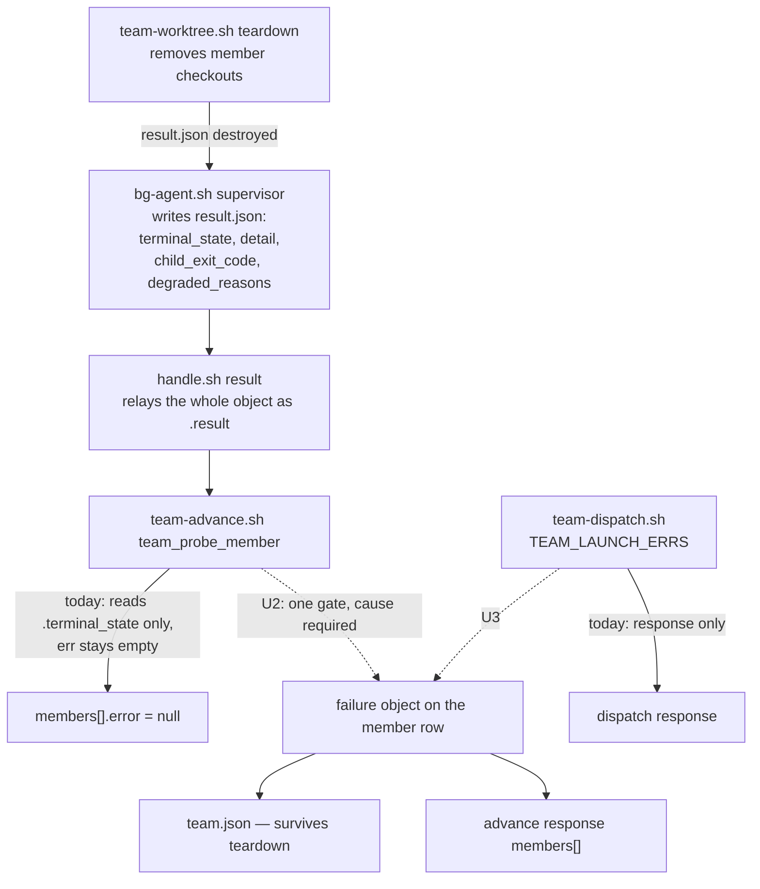
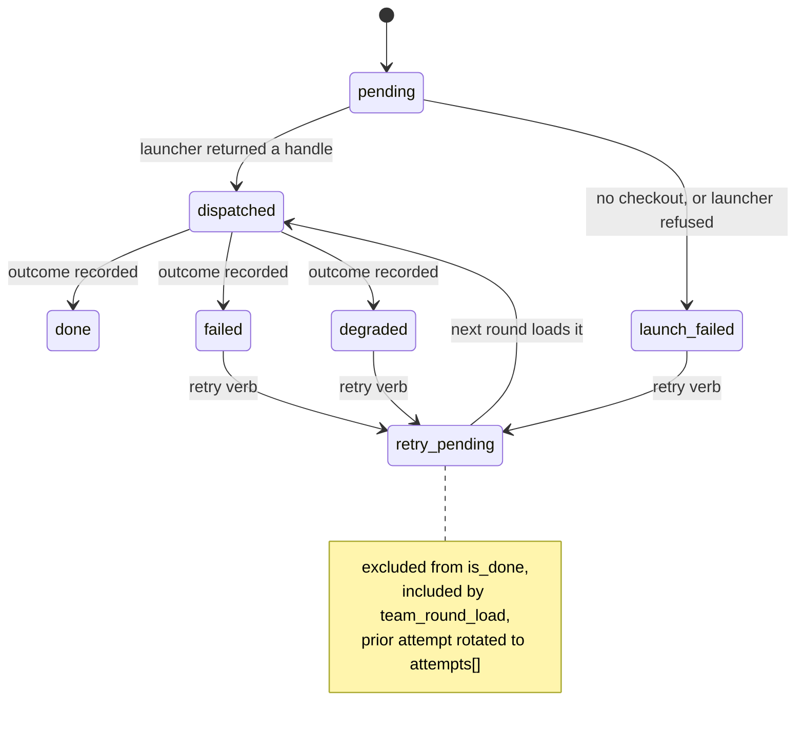

# Spawn Team Failure Reporting - Plan

## Goal Capsule

- **Objective:** An operator reading a `/spawn team` response can name why a member failed, and can act on that member alone.
- **Means:** Relay the supervisor's own recorded cause into the run record and every response, behind one gate that refuses to report a non-success outcome with no cause (KTD1, KTD2).
- **Authority:** The run record is the single source of truth. The supervisor in `plugins/spawn/lib/bg-agent.sh` is the single classifier. The team layer relays; it never re-derives a verdict or invents a cause taxonomy.
- **Stop conditions:** Stop and ask if the fix would require the team layer to classify a failure itself, or if `attempts[]` history turns out to need its own read verb rather than riding the existing record.
- **Execution profile:** Shell and jq. Every new assertion is proved by mutating the production line and watching the test go red.
- **Tail ownership:** This plan owns the code, the tests, the surface contracts in `--describe`, the driver instructions in the team-run skill, and the version bump.

---

## Product Contract

### Summary

Make a failed `/spawn team` member say why it failed, and let the operator retry that one member instead of the whole team. The cause is written into the run record so it survives worktree teardown, every member of a run appears in the advance response with its settled outcome, and a run's empty worktree root is removed with the member checkouts it held.

### Problem Frame

On 2026-08-18 an agent ran the team surface five times against one review task and never got a usable answer. Every failure carried a null cause: `outcome: "failed"` with `error: null`, inside an envelope reporting `ok: true` and `exit_code: 0`. With no cause to act on, the only available move was to change something at random and re-run — contract format, then alias naming, then abandoning the team for a single member. Runs 3 and 4 burned 173,000 output tokens between them.

Two smaller failures come from the same records. An advance response listed one member while reporting three dispatched, so a partial round could not be read at all. And five empty run directories were left in the same namespace as real worktrees, where `wtl` and any triage script that lists that directory will find them.

The cause was never missing. `plugins/spawn/lib/bg-agent.sh:807` writes `terminal_state`, `detail`, `child_exit_code`, `degraded_reasons` and `permission_denials` into the job's `result.json`, and `plugins/spawn/lib/handle.sh` relays that whole object. The team layer reads one field of it and drops the rest. Worse, the only copy lives inside the member's worktree, which teardown removes — so the evidence for those five runs no longer exists.

### Key Decisions

- **The cause is persisted, not just reported.** `spawn::team_teardown` deletes the member worktree that holds `result.json`, so a response-only fix loses the cause the moment a run is cleaned up. Governs R1, R2, R3.
- **Retry is in scope.** Re-running a whole team to retry one member is what cost 173k tokens; the plan adds a per-member retry rather than deferring it. Governs R8, R9, R10.
- **A member's output is attributed to the model that produced it, not the one requested.** Claude Code's SDK validates `--model` itself and can reject an alias the gateway serves, then fall back to a default and still produce output — so a result naming the requested model is a claim nothing checked. Governs R15, R16, R17.
- **The team layer never classifies.** It relays the supervisor's recorded facts. A new cause taxonomy in the team layer would be a second definition of failure, drifting from the supervisor's. Governs R1, R4.

### Requirements

**Carrying the cause**

- R1. A member whose outcome is not `done` carries a non-null cause in the run record.
- R2. A member that fails to launch carries the launcher's own error value in the run record, not only in the dispatch response.
- R3. The cause survives `spawn::team_teardown` removing the member's worktree.
- R4. The cause is composed only of facts the plugin established: the supervisor's `detail`, `child_exit_code` and `degraded_reasons`, or the read refusal's own error value. The model-written `narrative` is excluded.
- R5. A member that has not reached a terminal state carries a null cause, distinct from an empty one.

**Reporting honestly**

- R6. An advance response lists every member of the run, each with its recorded outcome and cause, whether or not this call probed it.
- R7. The advance response's member list and the run's own `derived.verdict` describe the same run — a `mixed` verdict is readable as two successes and one failure from the response alone.

**Retrying one member**

- R8. A member that reached a terminal non-success state can be returned to the dispatch roster without re-dispatching the team.
- R9. A retry never destroys the cause of the attempt it replaces.
- R10. A retry attempt is bounded by the run's existing round maximum, token ceiling and concurrency maximum, on the same terms as a first attempt.

**Cleaning up**

- R11. Teardown removes a run's worktree root when that root is empty and its basename is the run id, under the same path guard that protects the member checkouts.
- R12. A dispatch that creates a run root and places no member removes that root before it returns.

**Attributing the work**

- R15. The run record captures the model that actually served a member, taken from the child's own `modelUsage` receipt, beside the alias that was requested.
- R16. A member whose served model differs from its requested alias is recorded as degraded, and the mismatch is named in its degraded reasons.
- R17. A child that reports no served model leaves the field null, and the member is reported as unattributed rather than as matching.

**Keeping the contract honest**

- R13. Every new member field and every new error value appears in `team.sh`'s `--describe` output.
- R14. The team-run skill instructs the driver to report each member's cause and to report every member, not only the ones the last advance probed.

### Acceptance Examples

- AE1. **A failed member names itself.** Given a member whose child exits 1 under its ceiling, when the driver calls `advance`, then that member's row carries `error` non-null and a `failure.detail` quoting the supervisor's own sentence about the exit code.
- AE2. **A partial round reads honestly.** Given a round of three members that resolves to two `done` and one `failed`, when the driver calls `advance` a second time, then the response lists all three members with their outcomes, and its member list agrees with `derived.verdict` of `mixed`.
- AE3. **A retry does not erase the first attempt.** Given a member that failed with a recorded cause, when the operator retries it, then the record holds the first attempt's cause under `attempts` and the member returns to the dispatch roster.
- AE4. **A launch refusal is recoverable after the fact.** Given a member whose launcher refused with `contract_invalid`, when the record is read minutes later with no dispatch response in hand, then the member's row still names `contract_invalid`.

### Scope Boundaries

**In scope:** the cause's capture, persistence and reporting; the advance response's member list; per-member retry; the empty run root; the surface contracts that describe all of it.

**Deferred to follow-up work:**

- Why one particular model failed twice while its siblings succeeded. It should become answerable from the record once this plan lands.
- Whether a bare alias resolves where a `claude-` prefixed one does. Unverified; it changed at the same time as other variables.
- Automatic teardown when a run reaches a terminal verdict. Teardown stays operator-invoked.

**Outside this work:** any change to how the supervisor classifies a job. `bg-agent.sh` is the classifier and this plan only relays what it already records.

### Sources

- `plugins/spawn/lib/bg-agent.sh:718-835` — the supervisor's result record and the provenance of each cause field.
- `plugins/spawn/lib/team-advance.sh:129-215` — `team_probe_row` and `team_probe_member`, where the cause is dropped.
- `plugins/spawn/lib/team-record.sh:55-133, 193-240` — the derive chokepoint and the member field allow-list.
- `plugins/spawn/lib/team-worktree.sh:147-191` — the default-deny teardown path.
- `docs/plans/2026-08-12-001-fix-spinoff-silent-launch-failure-plan.md` — the same defect class fixed in the spinoff surface; KTD1 there is the gate shape reused here.
- `docs/plans/2026-08-14-001-feat-spawn-swarms-plan.md` — this subsystem's Definition of Done bar, including mutation verification and the null-versus-zero rule.
- `docs/solutions/logic-errors/default-allow-regex-projection-gate-silently-drops-nudges.md` — why an enumerated failure path leaks.
- Run records for the five failed runs: `.spawn/teams/t20260818*/team.json` under the `analytics-observability-audit` worktree. The members' own `result.json` files are gone with their worktrees.

---

## Planning Contract

### Key Technical Decisions

KTD1. **One gate, not a list of fields to copy.** In `team_probe_member`, a member reaching a terminal state that is not `done` must produce a non-null cause, always. The recorded facts select only the cause's content inside that gate. Enumerating the known result fields is what let this through: a future field falls out silently the same way. This is the shape `docs/plans/2026-08-12-001-fix-spinoff-silent-launch-failure-plan.md` KTD1 used for the same defect class. Governs R1.

KTD2. **The cause is one object on the member row, and the response's `error` is a projection of it.** The record gains a `failure` member field holding `{error, detail, child_exit_code, degraded_reasons}`; responses keep their existing `members[].error` string, read from `failure.error`. One owner, so the string and the object cannot drift. Governs R1, R4.
(session-settled: user-directed — chosen over reporting the cause only in the response envelope: teardown deletes the job's own record, so a response-only cause is unrecoverable minutes later.)

KTD3. **`narrative` stays out of the cause.** `detail` and `degraded_reasons` are written by the supervisor; `narrative` is the child model's own text. `plugins/spawn/skills/team-run/SKILL.md` already forbids forwarding a member's narrative as fact, and a cause an operator acts on must be plugin-established. Governs R4.

KTD4. **Null and empty stay distinct.** A member that never reached a terminal state carries `failure: null`. A member that reached one carries an object whose absent sub-fields are null, never `""` or `0`. This matches the token-count convention already set for this record in the spawn-swarms plan. Governs R5.

KTD5. **The advance response projects the record's whole roster.** `do_advance` keeps probing only members with a null outcome — that selection is correct and cheap. The response's `members` array is built from the record after the write, so a settled member appears with its recorded outcome and cause instead of vanishing. Governs R6, R7.

KTD6. **Retry is a new `launch_state`, not a reset to `pending`.** `launch_state` is one-shot today: `is_done` treats `launch_failed` as terminal and `team_round_load` selects only `pending`. A member returning for another attempt takes `retry_pending`, which `is_done` excludes and the round loader includes. Flipping back to `pending` would make a retried member indistinguishable from one never tried. Governs R8.
(session-settled: user-directed — chosen over deferring retry to follow-up work: re-running a whole team to retry one member is the cost this plan exists to remove.)

KTD7. **A retry rotates the failed attempt into `attempts[]`, and the derive chokepoint reads that history.** The member gains an append-only `attempts` field; each entry holds the retired `{round, handle, outcome, failure, tokens}`. The chokepoint recomputes every round's member set, verdict and token totals from live `members[].round` on each write (`team-record.sh:66-79`), so a rotation that clears the live row without teaching the chokepoint about `attempts` deletes the member from its own closed round: a `mixed` round re-reads as `pass`, and a round whose every member was retried flips back to `running` with `closed_at` nulled, which parks `advance` at `waiting` for ever. A round's participants are therefore the union of live members holding that round and attempt entries holding it. Governs R9.

KTD8. **The ceiling counts every attempt, not every live row.** `$used` sums live member rows only (`team-record.sh:80`), so a retry that clears `tokens` would return the ceiling's spent total to zero and let a retry loop spend past the ceiling for ever. The run's token total sums live rows plus every entry in `attempts`. Dispatch of a retried member is otherwise an ordinary round, so the round maximum and concurrency maximum need no retry case. Governs R10.

KTD10. **The served model comes from the child's own receipt, never from the request.** `claude -p --output-format json` carries no top-level `model` field; its `modelUsage` object is **keyed by the served model id**, with `canonicalModel` and `provider` inside each entry. That key is the only attribution the envelope holds. The supervisor already opens `child.json` for denials, result, session id and usage, so this is one more read at the same site. Comparing the requested alias against the gateway's served list is not a substitute — the gateway is not the party that rejects the name. Governs R15, R17.
(session-settled: user-directed — chosen over deferring all model-provenance work to the follow-up plan: a fallback already produced a review carrying a model's byline that model never wrote.)

KTD11. **A model substitution degrades the job; it does not fail it.** The work may still be useful — it is only unattributable. `bg-agent.sh` already degrades a job that ran clean but satisfied nothing named, so an unattributable result takes the same tier rather than a new one. Refusing or resolving the substitution is the follow-up plan's decision. Governs R16.

KTD9. **Empty-run-root removal extends the existing path guard by one level.** `spawn::team_teardown` removes a path only when it resolves to `<something>/<run-id>/<member-name>`; the empty parent is the intended consequence of that default-deny shape, not an oversight. Removal of the parent takes the same shape test — basename equals the run id — plus an emptiness check, and uses `rmdir`, which fails rather than recursing if anything is there. Governs R11, R12.

### High-Level Technical Design

Where the cause is written and read today, and what changes:

The member's launch lifecycle, with the retry state this plan adds:

### Open Questions

- **Alias resolution and the preflight gate are the next plan, not this one.** `bg-agent.sh:474` validates an alias with `spawnctl ensure`, which asks the gateway — but the rejecter is Claude Code's own SDK validation at `:977`, so a gateway-served alias is not evidence the launch will use it. Resolving a requested model to a served neighbour, and moving the preflight to the authority that actually rejects, are follow-up work. This plan only makes the substitution visible.

- **Should the model's own narrative be persisted under its trust marking?** Deferred, not blocking. For the dominant failure shape — the child exits non-zero under its ceiling — the supervisor's `detail` restates the exit code and little more. The account of what the model was actually doing lives in `narrative`, which KTD3 keeps out of the cause on trust grounds and which teardown then destroys with the worktree. The plugin already carries a two-tier trust marking (`content_trust`, `content_notice`) built for exactly this, so persisting the narrative beside the cause under the model tier is available and would not weaken KTD3. It is left open because it widens the record with untrusted text, and the plan is worth landing without it.

### Assumptions

- The five runs' `result.json` files are gone with their worktrees, so the cause fields are confirmed from `bg-agent.sh`'s writer rather than from a recorded failure. U2 opens with a live reproduction that proves which fields a real failure actually carries.
- `derived.verdict` emits `pass`, `mixed`, `fail` or `pending`. R7 is written against those values.
- The observed shape — `outcome: "failed"` with `error: null` — is producible only by `team_probe_member`'s `ok:true` branch, so a cause did exist in the five runs and was dropped. Traced through the branch structure, not read from a surviving record.

### Implementation Constraints

- `plugins/spawn/tests/check-remedies.py` fails the build if a declared error value carries no distinct non-empty remedy. Any new error value must add one.
- `! grep ...` does not fail a bats test. Absence assertions use a helper that fails as a plain command.
- Verification must not use `rm -rf`; it trips the destructive backstop under an armed `/auto` run. Use `git worktree remove` and targeted removal.
- `shrimpshack` is its own marketplace. `plugins/spawn/.claude-plugin/plugin.json` and the root `marketplace.json` are bumped together or the store keeps serving the old code.

### Sequencing

U1 is the schema and everything else writes through it. U2 and U3 are the two cause-capture paths and are independent of each other once U1 lands. U4 depends on U1 only. U5 depends on U1 and U2, and is the largest unit: it changes the derive chokepoint, so land it after U4 rather than beside it. U6 is independent. U7 depends on whatever U1 through U6 actually added. U8 is last.

---

## Implementation Units

### U1. Member fields for the cause and the attempt history

**Goal:** The run record can hold a member's failure cause and its retired attempts.

**Requirements:** R1, R5, R9

**Dependencies:** none

**Files:**
- `plugins/spawn/lib/team-record.sh`
- `plugins/spawn/tests/unit/team-record.bats`

**Approach:**
1. Add `failure` and `attempts` to the writable-field allow-list in `spawn::team_member_set` (`team-record.sh:218`).
2. Give both fields a branch that sets a JSON value rather than a string — the existing `case` coerces numerics for `round` and `tokens_`, and writes everything else as a string.
3. Add both to the initial row literal in `spawn::team_member_add` (`team-record.sh:206`): `failure: null`, `attempts: []`. Per KTD4, absent is null and never an empty string.
4. `failure` does not feed `derived`. `attempts` does — U5 makes that change, and U1 only creates the field.

**Test scenarios:**
- `failure` set to an object round-trips out of the record with every sub-field intact.
- `attempts` set to an array of two entries round-trips with both entries in order.
- A member row created by `spawn::team_member_add` reads `failure` as null and `attempts` as an empty array.
- `failure` set to a JSON `null` reads back as null, not as the string `"null"`.
- A field name still outside the allow-list is refused with `SPAWN_TEAM_ERROR=field_unknown` — the existing test at `team-record.bats:202` must still pass with a name that is not one of the two new fields.

**Verification:** `bash plugins/spawn/tests/run-tests.sh unit` passes, and the new round-trip assertions fail when the allow-list entries are removed.

---

### U2. A terminal non-success outcome always carries a cause

**Goal:** `team_probe_member` records why a member failed, from the supervisor's own facts.

**Requirements:** R1, R3, R4, R5

**Dependencies:** U1

**Files:**
- `plugins/spawn/lib/team-advance.sh`
- `plugins/spawn/tests/unit/team.bats`

**Approach:**
1. Reproduce first. Drive one member to a real `failed` outcome through `handle.sh result`'s success branch and read its `result.json`, to confirm which of `detail`, `child_exit_code` and `degraded_reasons` a real failure carries. No existing test reaches this path (see the Test scenarios note below).
2. Replace the `ok:true` branch's silent `err=""` (`team-advance.sh:199-202`) with the KTD1 gate: after the outcome is known, a terminal outcome that is not `done` must produce a non-null `failure`. The gate is one condition on the outcome, not a branch per known cause.
3. Build the `failure` object from the relayed `.result`: `detail`, `child_exit_code`, `degraded_reasons`. Exclude `narrative` per KTD3. Absent sub-fields are null per KTD4.
4. Set `error` inside `failure` from the read refusal's own value when the result read refused, and otherwise from the supervisor's terminal state. Do not invent a new taxonomy.
5. Write `failure` to the record with `spawn::team_member_set` before the outcome is written, for the reason `team_record_usage` is written before the outcome: a reader catching the run between the two writes must not see a terminal member with no cause.
6. Cover the `worktree_missing` branch (`team-advance.sh:176-179`). It returns after `team_probe_row` and writes nothing to the record, so a member with no checkout reaches a response with a cause and leaves the record with none. Bring it inside the gate: record `failure` with `error: "worktree_missing"` and leave the member's outcome alone, because a missing checkout is not an outcome the supervisor reported.
7. Keep `team_probe_row`'s existing `<error>` parameter and feed it `failure.error`, so the response's string and the record's object have one owner (KTD2).

**Execution note:** Start from the reproduction in step 1. A cause assembled from the writer's source without seeing one real failure is a guess.

**Test scenarios:**
- A member whose child exits non-zero reaches `outcome: "failed"` and its record row carries `failure.detail` quoting the supervisor's sentence and `failure.child_exit_code` equal to the child's exit code. No test in `team.bats` currently drives a member to a real `failed` outcome through the result success branch — this is a new fixture, not an extension of `team.bats:1814`.
- A member that reaches `degraded` carries a non-null `failure` with `degraded_reasons` non-empty.
- A member that reaches `done` carries `failure: null`.
- A member still running carries `failure: null` and `error: null` — the control arm, per the existing pattern at `team.bats:1794`.
- The `handle_unknown` path still sets `error` to `handle_unknown`, and now also records it in `failure.error`. The existing assertion at `team.bats:1787` must still pass.
- `failure` holds no `narrative` key, asserted with a helper that fails as a plain command rather than `! grep`.
- A member whose result read is refused — `handle_expired` or `result_missing` — carries that value in `failure.error` and a null `detail`, and its outcome is the probe's own state.
- A member whose worktree is missing carries `failure.error` of `worktree_missing` in the record, not only in the response. The existing response assertion at `team.bats:1768` must still pass.
- The cause is readable from `team.json` after the member's worktree has been removed.

**Verification:** Each new assertion is shown red by mutating the production line — blank the `failure` assembly, and separately skip the `spawn::team_member_set` write — then green with it restored. Record which assertions were actually red.

---

### U3. The launch error reaches the record

**Goal:** A member that never launched names its refusal in the run record.

**Requirements:** R2, R3

**Dependencies:** U1

**Files:**
- `plugins/spawn/lib/team-dispatch.sh`
- `plugins/spawn/tests/unit/team.bats`

**Approach:**
1. In `team_launch_member`'s failure branch (`team-dispatch.sh:304-322`), write the launcher's error into the member's `failure` object alongside the existing `TEAM_LAUNCH_ERRS` entry, before `launch_state` is set to `launch_failed` — same ordering reason as the `round` write already there.
2. Do the same for the two `worktree_failed` paths, in `team_place_members` (`team-dispatch.sh:86-90`) and `team_revalidate_placements` (`team-dispatch.sh:460-472`). Neither touches `TEAM_LAUNCH_ERRS` today — `do_roster` hardcodes the `worktree_failed` literal into its own response projection (`team-dispatch.sh:307`) — so these two sites gain the record write and that hardcoded literal is then read from the record instead.
3. Leave the dispatch response's projection reading from `launch_state`; add `failure` to it so the record and the response agree.
4. `TEAM_LAUNCH_ERRS` stays as the in-process accumulator for the response's aggregate refusal. It is no longer the only copy.

**Test scenarios:**
- A member whose launcher refuses with `contract_invalid` has that value in its record row, read back from `team.json` with no dispatch response in hand. The existing response assertion at `team.bats:916` must still pass.
- A member whose worktree could not be created carries `worktree_failed` in its record row.
- A member that launched carries `failure: null`.
- A round where one member's launch fails and the next still runs leaves exactly one member with a non-null `failure`.

**Verification:** New assertions shown red against the pre-fix `team-dispatch.sh`, on the specific error value rather than on non-null.

---

### U4. The advance response lists every member

**Goal:** A partial round reads honestly against `dispatched` and the run's verdict.

**Requirements:** R6, R7

**Dependencies:** U1

**Files:**
- `plugins/spawn/lib/team-advance.sh`
- `plugins/spawn/tests/unit/team.bats`

**Approach:**
1. Leave the probe loop's `outcome == null` selection alone (`team-advance.sh:258-263`). It is the correct set to probe.
2. Build `team_emit_intent`'s `members` array from the re-read record rather than from `TEAM_PROBES`, so every member appears with its recorded `launch_state`, `outcome`, tokens, and its whole `failure` object. The response keeps its existing top-level `error` string, projected from `failure.error`; the object rides beside it, because AE1 and the Verification Contract both need `failure.detail` on the operator's screen and an error value alone does not carry it.
3. Keep the probe results as the source for a member's live non-terminal state and for a probe-only answer the record does not hold, so a member still running still reports `running`, and the `worktree_missing` answer that `team.bats:1768` asserts is not lost to a record that has no such state. The record supplies the settled members; the probe supplies this call's answers; the probe wins where both speak.
4. A member's row in the response carries the same fields whether this call probed it or not, so a reader cannot tell "not reported" from "not run" by field shape.

**Test scenarios:**
- A run of three members resolving to two `done` and one `failed` produces an advance response listing three members, on the second advance call.
- The failed member's row in that response carries `failure.detail`, not only `error`.
- That response's member list agrees with `derived.verdict` of `mixed`: two rows with outcome `done`, one with `failed` and a non-null error.
- `dispatched` in the response equals the number of member rows with `launch_state: "dispatched"`.
- A member still in flight appears with its live state and a null outcome.
- A member that failed to launch appears with `launch_failed` and its recorded error.

**Verification:** Reproduce the run-4 shape — three members, one failed, two done — and assert the response no longer lists one member while reporting three dispatched. Shown red against the pre-fix projection.

---

### U5. Retry one failed member in place

**Goal:** A failed member returns to the dispatch roster without re-dispatching the team.

**Requirements:** R8, R9, R10

**Dependencies:** U1, U2

**Files:**
- `plugins/spawn/lib/team-record.sh`
- `plugins/spawn/lib/team-dispatch.sh`
- `plugins/spawn/lib/team-advance.sh`
- `plugins/spawn/lib/team-view.sh`
- `plugins/spawn/lib/team.sh`
- `plugins/spawn/tests/unit/team-record.bats`
- `plugins/spawn/tests/unit/team.bats`
- `plugins/spawn/tests/unit/team-view.bats`

**Approach:**
1. Add `retry_pending` to the `launch_state` vocabulary. `is_done` (`team-record.sh:56`) already excludes it, because a retried member has a null outcome and is not `launch_failed` — no change needed there, and a test pins that.
2. Teach every site that compares `launch_state` to the literal `"pending"` to accept `retry_pending` as well. There are eight, and each was confirmed by reading the source. Missing one of the first three leaves a retried member both roster-exhausted and undispatchable; missing one of the rest makes a run in retry report itself wrongly:
   - `$done_roster`, which produces the `roster_exhausted` stop reason (`team-record.sh:97`)
   - `dispatch_allowed` (`team-record.sh:112`)
   - `team_round_load`'s roster select (`team-dispatch.sh:353`)
   - the four response `pending` counters (`team-advance.sh:232`, `team-dispatch.sh:140`, `team-dispatch.sh:532`, `team.sh:300`), which otherwise report `pending: 0` while a retry waits
   - `team_view_probe`'s state arm (`team-view.sh:78`), which otherwise falls through and shows a retried member as unresolvable
3. Change the derive chokepoint to read `attempts` (KTD7, KTD8). A round's participants become the union of live members holding that round and attempt entries holding it, so a closed round keeps its member list, its verdict and its token totals after a rotation. The run's `$used` total (`team-record.sh:80`) sums live rows plus every attempt, so the ceiling counts a retried attempt's spend.
4. Add a record-layer function that rotates one member: append `{round, handle, outcome, failure, tokens}` to `attempts`, then null `handle`, `outcome`, `started_at`, `round`, `tokens` and `failure`, then set `launch_state` to `retry_pending`. One record read-modify-write, not a sequence of `spawn::team_member_set` calls. A half-applied rotation is visible to a concurrent advance: between the outcome being nulled and `launch_state` flipping, the member matches the probe's own select — `dispatched` with a null outcome — while holding a null handle, so the advance probes it, answers `handle_unknown`, and writes `outcome: failed` into the middle of the rotation. The member then sits at `retry_pending` with a non-null outcome, which reads as done and never closes its round. A transient state where the attempt is appended while the live row still holds its tokens is the same hazard against the ceiling: a concurrent write recomputes `$used` with the spend counted twice and can fire `token_ceiling_reached`.
5. The `retry` verb takes the run's advance lock (`<run-dir>/advance.lock`) for the rotation, the same lock `do_advance` holds while it probes and writes. Without it the single write above is still atomic against itself but not ordered against an advance that probes the member on either side of it.
6. Add a `retry` verb to `team.sh` taking `--run-id` and `--member`. It refuses a member that is not in a terminal non-success state, and refuses a run whose bounds have already fired.
7. The retried member is dispatched by the existing round machinery.
8. Add the verb's refusal error values to `spawn::team_code_for` and the `--describe` block — U7 covers the contract, this unit raises the values.

**Execution note:** Write the rotation function's test first. A half-applied rotation leaves a member that is neither done nor retryable, and that is the failure mode worth pinning before the verb exists.

**Test scenarios:**
- Rotating a failed member appends exactly one entry to `attempts` holding its handle, outcome and cause, and leaves `launch_state` at `retry_pending`.
- After rotation the member's `failure`, `handle` and `outcome` are null.
- A second rotation appends a second entry and keeps the first, in order.
- `derived.complete` is false while a member sits at `retry_pending`.
- `derived.stop_reasons` does not contain `roster_exhausted` while a member sits at `retry_pending`.
- `dispatch_allowed` is true while a member sits at `retry_pending` and no round is running.
- `is_done` is false for a `retry_pending` member without any change to the derive jq's `is_done` definition.
- The next `dispatch` call loads the `retry_pending` member and no other.
- `retry` on a member with outcome `done` is refused, and the record is unchanged.
- `retry` on an unknown member name is refused with the record unchanged.
- `retry` on a run whose round maximum has already fired is refused.
- A retried member's second attempt counts toward the run's round and token bounds — the record's `bounds.rounds_used` increments.
- Rotating the only member of a closed round leaves that round `finished`, keeps its `closed_at`, and keeps its recorded verdict. This is the deadlock case: without it, `advance` answers `waiting` for ever.
- Rotating one member of a `mixed` round leaves that round's verdict `mixed`, not `pass`.
- The run's token total after a rotation is unchanged, so the ceiling still counts the retired attempt's spend.
- A run at its token ceiling refuses a retry rather than admitting an attempt it cannot pay for.
- Every response's `pending` count includes a member sitting at `retry_pending`.
- `team-view.sh` renders a `retry_pending` member as retrying, not as unresolvable or worktree-missing.
- A `retry` issued while an advance holds the run's lock waits for it rather than interleaving, and the member's post-rotation row holds a null outcome.
- A rotation observed by a reader mid-write shows either the pre-rotation row or the post-rotation row, never a row carrying both an appended attempt and the live tokens it retired.

**Verification:** Rotation assertions shown red by removing each write in the function individually. The refusal cases assert the specific error value and the numeric exit code separately, per this repo's convention.

---

### U6. A run's empty worktree root is removed

**Goal:** No empty `t2026*` directory is left beside real worktrees.

**Requirements:** R11, R12

**Dependencies:** none

**Files:**
- `plugins/spawn/lib/team-worktree.sh`
- `plugins/spawn/lib/team-dispatch.sh`
- `plugins/spawn/tests/unit/team.bats`

**Approach:**
1. Resolve the run root first. No record field names it: `spawn::team_teardown` reads only `.members[] | (.name, (.worktree // ""))`, and `do_teardown` never sets a worktree root — it works from `RUN_DIR`, which is the record directory, not the checkout directory. Take the root as the parent of the member worktree paths the record names. When no member has a worktree — the all-unplaced case this unit targets — fall back to the configured worktree root joined with the run id.
2. Remove that root when its basename equals the run id and it is empty. Use `rmdir`, which fails rather than recursing when anything remains — the same default-deny posture as the per-member shape guard (KTD9), and it avoids `rm -rf` under an armed run.
3. Report the removed root on stdout with the member paths, so `do_teardown`'s `removed` array names it.
4. In dispatch, when a fresh run places no member at all, remove the run root it created before returning. This is the runs 1 and 2 shape: every member failed to get a checkout, teardown was never called, and the empty root stayed. Dispatch knows the root it created, so it does not need the record to name it.
5. Do not add automatic teardown on a terminal verdict. Teardown stays operator-invoked, and this unit only stops it leaving litter behind.

**Test scenarios:**
- Teardown of a run whose members were all removed leaves no run root, and names the root in `removed`.
- Teardown of a run root that still holds an unrelated file leaves the root in place and does not fail the teardown.
- Teardown of a run root whose basename does not match the run id leaves it in place.
- Teardown of a run whose members all record an empty worktree still resolves and removes the root, via the configured-root fallback.
- A dispatch where every member fails to get a checkout leaves no run root behind.
- A dispatch where one member gets a checkout leaves the run root in place.

**Verification:** Assert on the filesystem after each case with a helper that fails as a plain command. Shown red against the pre-fix teardown.

---

### U7. The surface contracts describe what changed

**Goal:** `--describe` and the driver skill tell the truth about the new fields, values and verb.

**Requirements:** R13, R14

**Dependencies:** U1, U2, U3, U4, U5, U6, U9

**Files:**
- `plugins/spawn/lib/team.sh`
- `plugins/spawn/skills/team-run/SKILL.md`
- `plugins/spawn/tests/check-remedies.py`
- `plugins/spawn/tests/unit/team.bats`

**Approach:**
1. Add `members[].failure`, `members[].attempts` and `members[].served_model` to `response_fields` in `team.sh`'s describe block, which already documents per-member sub-fields individually.
2. Add the `retry` verb and every error value it raises to `error_values`, each with its exit code and note, and add the matching case to `spawn::team_code_for`. The two are kept in sync by discipline; move them in one commit.
3. Give every new error value a distinct non-empty remedy and run `check-remedies.py` with the library path.
4. Update `skills/team-run/SKILL.md`'s "Reporting between rounds" section. It currently says "probed fields only", which is the instruction that kept the cause off the operator's screen even where one existed. It must say: report every member of the run, and report a failed member's cause. Keep the existing rule that a member's narrative is never forwarded as fact.
5. Add the `retry` verb to the skill's guidance on what to do with a `stop` carrying a mixed verdict.

**Test scenarios:**
- `team.sh --describe` lists `members[].failure` and `members[].attempts` in `response_fields`.
- Every error value in `spawn::team_code_for` appears in `error_values` with the same exit code, and the reverse.
- `check-remedies.py` passes when run with the library path.
- The skill body's reporting section names a member's cause in its per-member reporting list. Assert the presence of the new instruction, not the absence of the old phrase — a passing edit that only deletes "probed fields only" leaves the list with no cause in it.
- The skill body's reporting section no longer says probed fields only.

**Verification:** `python3 plugins/spawn/tests/check-remedies.py plugins/spawn/lib` exits 0, and the describe-consistency assertion fails when one error value is removed from either side.

---

### U9. Attribute a member's output to the model that served it

**Goal:** A member's record names the model that actually answered, and a substitution is visible.

**Requirements:** R15, R16, R17

**Dependencies:** U1

**Files:**
- `plugins/spawn/lib/bg-agent.sh`
- `plugins/spawn/lib/team-record.sh`
- `plugins/spawn/lib/team-advance.sh`
- `plugins/spawn/tests/unit/team-record.bats`
- `plugins/spawn/tests/unit/team.bats`
- `plugins/spawn/tests/fixtures/fake-claude.sh`

**Approach:**
1. Read the served model in `sup_write_result`'s existing `child.json` block (`bg-agent.sh:730-741`), beside the denials, narrative, session-id and usage reads already there. Take the first key of `modelUsage`; prefer that entry's `canonicalModel` when present. Absent or unreadable is null, never the requested alias (KTD4, KTD10).
2. Add `served_model` to the job result record beside `alias`, so the two are readable together.
3. Compare it with `$ALIAS` when both are known. On a difference, add a degraded reason naming both, and take the degraded terminal state (KTD11). Equal, or either unknown, changes nothing.
4. Add `served_model` to the writable member-field allow-list and the initial row literal in `team-record.sh`, following the shape U1 established.
5. Relay it in `team_probe_member` from the job result, on the same path that reads the cause, and project it into the advance response's member rows.
6. Teach `plugins/spawn/tests/fixtures/fake-claude.sh` to emit a `modelUsage` object so a test can drive both the matching and the substituted case. Read the fixture before changing it — its current output shape is what every existing team test depends on, and an unconditional new field could move an assertion that is already passing.

**Execution note:** Write the substitution test first and watch it go red. A member that requested one model and ran on another is the exact case that shipped a review with a byline no model wrote, and it must not be provable by an assertion that only checks the field exists.

**Test scenarios:**
- A child reporting `modelUsage` keyed by the requested alias records that value as `served_model` and adds no degraded reason.
- A child reporting `modelUsage` keyed by a DIFFERENT model records that model, reaches `degraded`, and names both the requested and served model in its degraded reasons.
- A child whose output carries no `modelUsage` records `served_model` as null and adds no substitution reason — null is unknown, not a match.
- A child whose `modelUsage` holds several keys records the first key deterministically rather than a set-order-dependent one.
- `served_model` reaches the member's row in `team.json` and the advance response's member entry.
- `served_model` survives teardown of the member's worktree, like the cause.
- A degraded-by-substitution member still carries its cause per R1, so the two mechanisms do not mask each other.

**Verification:** `bats plugins/spawn/tests/unit/team-record.bats` and `bats plugins/spawn/tests/unit/team.bats` pass. The substitution assertions go red when the comparison in step 3 is removed, and separately when the `modelUsage` read in step 1 is blanked.

---

### U10. The status surface carries the cause and the served model

**Goal:** An operator reading `status` can name why a member failed and on what model it ran.

**Requirements:** the Goal Capsule objective, R15, R17

**Dependencies:** U1, U7, U9

**Note on the label:** `lib/team-view.sh` and `tests/unit/team-view.bats` already say "U10" for the status verb's own unit, which belongs to an earlier plan. This is a different U10. The tests added here are prefixed `U10-cause:` so evidence names which plan it belongs to.

**Why this unit exists:** `status` is the surface an operator actually reads, and its member rows carried an `error` string but no `failure` object and no `served_model`. So the plan's objective was unmet on the most-used surface, and U7's skill body documented that as a limitation rather than closing it.

**Files:**
- `plugins/spawn/lib/team-view.sh`
- `plugins/spawn/lib/team.sh`
- `plugins/spawn/skills/team-run/SKILL.md`
- `plugins/spawn/tests/unit/team-view.bats`
- `plugins/spawn/tests/unit/team.bats`

**Approach:**
1. Project `failure` and `served_model` into the status member row in `team_view_row`. Both are read from the RECORD member object the function already holds — a projection change, not a new source.
2. Read them as `tojson`, never raw. The one-field-per-line block feeding `read` would be shifted by a pretty-printed object, and every field after it would land on the wrong variable.
3. Leave `error` exactly as it is: probe-derived on this surface, unlike the advance response, which projects `failure.error` over it. The two can disagree, and both readings are honest — see the note in the file.
4. Correct the `--describe` notes for `members[].failure` and `members[].served_model`, which said "advance only".
5. Correct the SKILL.md paragraph that told the driver `status` carries neither.

**Test scenarios:**
- A failed member carries `failure.detail` in its `status` member row, not only an `error` string.
- A member that ran on a different model than its alias carries `served_model` in its `status` row.
- A member that succeeded carries `failure: null`, key present.
- A member never dispatched carries `failure: null` and `served_model: null` — absent is null, never the requested alias.
- `--describe` declares both per-member fields AND no longer calls `served_model` advance only.
- The skill body no longer tells the driver that `status` carries no cause.

**Verification:** `bats plugins/spawn/tests/unit/team-view.bats` and `bats plugins/spawn/tests/unit/team.bats` pass. Each assertion reddens against its own line: dropping `failure:$fail` reddens the failed, succeeded and never-dispatched rows; dropping `served_model:$sm` reddens the substitution and never-dispatched rows; replacing `tojson` with a raw read drops the whole member row.

---

### U8. Version bump

**Goal:** The store serves the fixed plugin.

**Requirements:** none

**Dependencies:** U7

**Files:**
- `plugins/spawn/.claude-plugin/plugin.json`
- `marketplace.json`

**Approach:** Bump the spawn plugin's version and the marketplace entry together. A merged fix does not reach a live store until the installed cache regenerates against the new version.

**Test expectation:** none — the repo's existing version-consistency check covers the pairing.

**Verification:** Both files name the same new version.

---

## Verification Contract

- `bash plugins/spawn/tests/run-tests.sh all` passes. Compare declared against passing counts with skips named; do not reconcile by subtracting totals.
- `python3 plugins/spawn/tests/check-remedies.py plugins/spawn/lib` exits 0.
- A member driven through a model substitution reaches `degraded` with both model names in its degraded reasons, and its record names the served model. Run without the library path it exits 2, so the bare form is not a passing check.
- Every new or changed assertion is mutation-verified: revert the production line it pins, watch it go red on the specific field or value, restore, watch it go green. Record which assertions were red. This subsystem has already shipped a fix whose four behavioral tests included exactly one that was load-bearing.
- An end-to-end run reproduces the run-4 shape — three members, one failing — and its advance response names the failing member's cause and lists all three members.
- The cause is read from `team.json` after `teardown` has removed the member worktrees.

## Definition of Done

- Every requirement R1 through R14 is met by a unit and proved by a test.
- No failed member, on any path, can reach a response with a null cause, and no path that reports a cause leaves the record without one. The `worktree_missing` branch counts as a path.
- A retry never reopens a closed round, never rewrites a closed round's verdict, and never returns the run's spent token total to a lower number.
- No test in the suite passes both before and after the production change it claims to pin.
- Absence assertions use a helper that fails as a plain command, never `! grep`.
- `--describe` and `skills/team-run/SKILL.md` describe the shipped behavior, not the previous behavior.
- Dead-end and experimental code from approaches that did not work is removed, not left in the diff.
- No member's record asserts a model that produced its output unless the child's own receipt named that model.
- `plugin.json` and `marketplace.json` carry the same new version.
