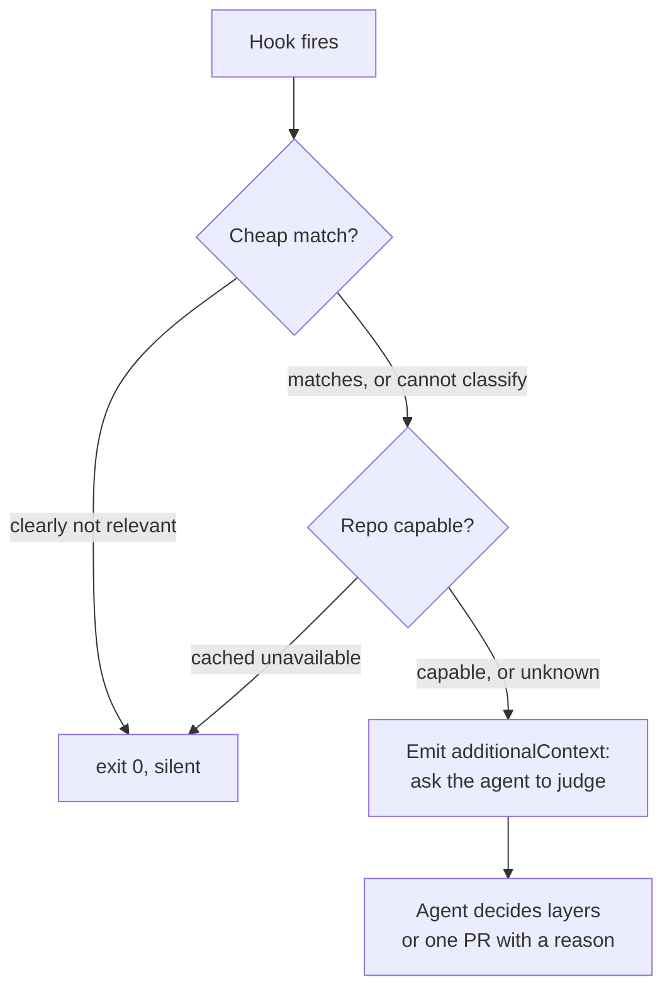
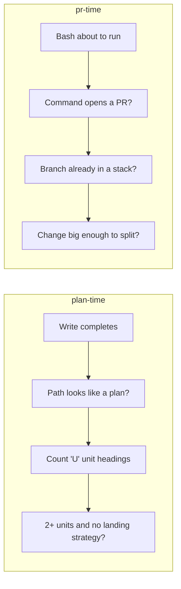

# gh stack Adoption - Plan

**Target repo:** `shrimpshack` — all paths below are relative to that repository root.

## Goal Capsule

**Objective.** Make coding agents reach for `gh stack` on work that splits into
dependent, reviewable steps, without the user asking for it each time.

**Product authority.** Shawn. All key decisions below were settled in the
brainstorm session of 2026-08-19.

**Open blockers.** None.

---

## Product Contract

### Summary

A shrimpshack plugin ships two hooks that ask the agent to judge whether work
warrants stacked pull requests: once after a plan is written, and once before a
pull request opens. Its skill carries the judgement. Both point at the stacking
machinery that already exists in the compound-engineering plugin.

### Problem Frame

`gh stack` is a new GitHub capability. It postdates model training, so agents
carry no precedent for it and no memory of it. Left alone, an agent defaults to
one branch and one pull request per workstream, because that is the only shape
it has ever seen.

The tooling gap is smaller than it appears. The compound-engineering plugin
already implements stacking end to end:

- `ce-commit-push-pr` carries a full stack mode: parent classification,
  retrospective layer construction, and `gh stack submit`.
- `ce-commit-push-pr/references/gh-stack-cli.md` carries verified command
  semantics and exit codes for `gh stack` v0.1.0.
- `ce-babysit-pr` carries stack watch postures, `stack-ready` and `stack-land`.

That machinery is opt-in. Its entry condition is "user intent or standing
preference". No standing preference exists in `CLAUDE.md` today, so the
machinery never runs.

Two gaps remain after a standing preference is declared:

1. Nothing decides at plan time that units are layers. `ce-commit-push-pr`
   slices a stack retrospectively, from a finished change set. Slicing a
   completed multi-file change into clean layers is harder and less honest than
   building it in layers.
2. A prose rule in `CLAUDE.md` is a probabilistic nudge. It competes with more
   than 300 other lines. The agent least likely to read it closely is the agent
   that has never heard of `gh stack`.

### Key Decisions

- **The stacking decision is made at plan time.** The dependency graph is
  already computed there. *(session-settled: user-directed — chosen over
  retrospective slicing at pull-request time only.)* Governs R1, R2, R3.
- **Hooks carry the nudge, not prose alone.** A hook fires on a file event; a
  guideline depends on the agent reading it. *(session-settled: user-directed —
  chosen over a `CLAUDE.md` rule by itself.)* Governs R1, R4.
- **The hook prompts a judgement and never mandates a stack.** A forced stack
  produces artificial slices, which the plugin already refuses.
  *(session-settled: user-directed — chosen over requiring a stack whenever
  multiple units exist.)* Governs R2, R6.
- **The hooks run in every repository, including team repositories.**
  *(session-settled: user-directed — chosen over personal repositories only.)*
  Governs R11.
- **Ship as a shrimpshack plugin, not as loose files in `~/.claude`.**
  A plugin carries its own hooks, is version-gated, and lives in a repository
  with a coherent history. *(session-settled: user-directed — chosen over
  writing hooks into personal `settings.json`.)* Governs R1, R4, R13, R14.
- **Consume the plugin machinery; do not rebuild it.**
  `gh-stack-cli.md` states that it is self-contained on purpose and that no
  separate `gh-stack` skill should be depended on. *(session-settled:
  user-approved — chosen over authoring a standalone `gh-stack` skill.)*
  Governs R12, R14.

### Requirements

**Plan-time trigger**

- **R1.** A `PostToolUse` hook on file writes fires after an agent writes a
  plan file. It identifies a plan by file path and by the count of
  implementation units the file contains. It follows the `nerd` plugin's
  existing `Write|Edit` matcher shape.
- **R2.** The hook asks the agent to decide whether the work warrants stacked
  layers. A decision of "one pull request" is a valid answer when the agent
  states the reason.
- **R3.** The agent records the decision in the plan. The record names the
  layers in order, or states why the work is one pull request.

**Pull-request-time trigger**

- **R4.** A `PreToolUse` hook on shell commands fires before an agent opens a
  pull request from the command line.
- **R5.** The hook stays silent when the branch already belongs to a stack, and
  when the change is too small to decompose.
- **R6.** The hook asks the same judgement question. It does not block the pull
  request.

**Packaging**

- **R13.** The work ships as a plugin under `plugins/<name>` in
  `shawnroos/shrimpshack`, following the existing plugin layout: a
  `.claude-plugin/plugin.json` carrying a version, a `hooks/hooks.json`, and a
  skill carrying the judgement.
- **R14.** The plugin's skill states when work warrants layers and when one
  pull request is correct. It does not restate `gh stack` command syntax.

**Boundaries**

- **R11.** The hooks fire in every repository where the plugin is installed.
  When `gh stack` reports that stacked pull requests are unavailable for a
  repository, the hook stays quiet for that repository afterwards.
- **R12.** No compound-engineering plugin file is modified.

### Key Flows

- **F1. Planned work.** An agent writes a plan with several implementation
  units. The plan-time hook fires. The agent judges the work, names the layers,
  and records them in the plan. Execution builds each layer in order and
  `ce-commit-push-pr` submits the stack.
- **F2. Unplanned work.** An agent finishes a change with no plan and prepares
  a pull request. The pull-request hook fires and asks the same question. The
  agent either splits the work or proceeds with a stated reason.
- **F3. Unsupported repository.** A hook fires. `gh stack` reports the feature
  is unavailable. The hook records that result and stays quiet for that
  repository.

### Acceptance Examples

- **AE1.** A plan with five implementation units is written. The hook fires.
  The agent adds a strategy section that names three layers in dependency
  order. Covers R1, R2, R3.
- **AE2.** A plan with one implementation unit is written. The hook does not
  fire. Covers R1.
- **AE3.** An agent runs a pull-request command on a branch with several
  changed files and no stack. The hook fires. The agent answers "one pull
  request, one logical change" and the pull request opens. Covers R4, R6.
- **AE4.** A repository has stacked pull requests disabled. The hook fires once
  and receives an unavailable result. On the next pull request in that
  repository the hook stays quiet. Covers R11.

### Scope Boundaries

**In scope.** The `stackup` plugin only: two hooks, the shared decision
library, the judgement skill, its tests, and its README.

**Deferred for later.**

- Layer granularity. No evidence exists yet for a correct layer size. Revisit
  after real stacks have been shipped and reviewed.
- Any change to how a stack lands. `gh stack merge` is atomic and accepts a
  merge method, so the existing squash preference needs no change.

**Outside this work.**

- The personal `~/.claude` guidance change — a standing-preference rule in
  `CLAUDE.md` and a `gh stack` cue in `cli-cues.txt`. Both files live in a
  different repository that this branch cannot reach. Tracked as a follow-up;
  until it lands the hooks are the only prompt, which is the intended design.
- Publishing the plugin to the marketplace. The shrimpshack marketplace runs
  with `autoUpdate` enabled, so a version bump and push reaches everyone who
  uses it. That step is an outward publish and needs its own decision.

- A standalone `gh-stack` skill. The plugin reference is self-contained and
  states that no separate skill should be depended on.
- Any edit to a compound-engineering plugin file.

### Success Criteria

- Agents propose a stack on decomposable work without being asked.
- Every multi-unit plan carries a recorded pull-request decision, including the
  decisions that choose one pull request.
- No artificial stacks appear on work that is one logical change.

### Outstanding Questions

- Whether the plan-time hook should fire for plan files written by tools other
  than `ce-plan`. Until this is settled the path test is an allowlist, which is
  the default-allow shape KTD2 warns against, so U3 must state the shape it uses.

Resolved during planning: the storage location (KTD3), the plugin name (KTD4),
and prompt-versus-command hooks (KTD1).

---

## Sources

- `gh stack` v0.1.0, installed as a `gh` extension. Command surface read from
  `gh stack --help` and the per-subcommand help.
- `ce-commit-push-pr/SKILL.md`, stack mode section.
- `ce-commit-push-pr/references/stack-submit.md`, topology and retrospective
  construction.
- `ce-commit-push-pr/references/gh-stack-cli.md`, verified CLI semantics and
  exit codes.
- `ce-babysit-pr/references/stack-commands.md`.
- `~/.claude/settings.json`, existing `PreToolUse` and `PostToolUse` hook
  configuration.
- `shawnroos/shrimpshack` at `~/projects/shrimpshack`: plugin layout,
  `plugins/nerd/hooks/hooks.json` prompt-hook precedent, and
  `plugins/lint-router/hooks/hooks.json` command-hook precedent.

---

## Planning Contract

**Product Contract preservation.** Product Contract unchanged. No requirement was split,
reworded, or re-scoped during enrichment.

**Plan depth.** Deep. The work is small in volume but the failure mode is silent, and the
repository carries a recorded high-severity learning about that exact shape.

### Key Technical Decisions

- **KTD1. Both hooks are command hooks that emit `hookSpecificOutput.additionalContext`,
  not `"type": "prompt"` hooks.** A prompt hook runs the model on every matching event; a
  command hook decides mechanically and spends the model only when the condition holds.
  The verified precedent is `plugins/reflect/hooks/trigger-nudge.sh`, which records
  that `additionalContext` is confirmed real for `PostToolUse` on the running build
  and that raw stdout injects for `UserPromptSubmit` only. `hookEventName` must name
  the firing event. Do not copy `plugins/claude-modes`, whose envelope is
  `UserPromptSubmit`. Resolves the packaging open question. Governs R1, R4.
- **KTD2. The fire-or-suppress gate is default-deny on suppression: anything the gate
  cannot classify fires the ask.** The asymmetry is the reason. An ask that fires when it
  need not costs one line of noise and announces itself; an ask that fails to fire costs
  the whole feature and announces nothing.
  See `docs/solutions/logic-errors/default-allow-regex-projection-gate-silently-drops-nudges.md`,
  where the opposite choice dropped nudges silently through four rounds of fixes.
  The one size condition is therefore stated, not deferred: a change touching a single
  file does not fire. Every other change size fires. Governs R2, R5.
- **KTD3. The per-repository capability result is cached under
  `${XDG_STATE_HOME:-$HOME/.claude/state}/stackup`,** matching the state-directory
  convention in `plugins/lint-router/tools/lint-router/run.sh`. Resolves the persistence
  open question. Governs R11.
- **KTD4. The plugin is named `stackup`.** `Nudge` is already a canonical term in
  `CONCEPTS.md` with an unrelated meaning, so a `stack-nudge` name would collide with the
  glossary. No command may share a name with a skill in this plugin — see
  `docs/solutions/architecture-patterns/command-and-skill-sharing-a-name.md`, where that
  collision stopped the skill loading at all. Governs R13, R14.
- **KTD5. Tests assert the emitted context, never the exit code, and every gate rule is
  proven by mutating the rule.** Both hooks exit 0 on every path by design, so an
  exit-code assertion holds whether or not the ask fired. Governs R1, R4, R5.

---

## High-Level Technical Design

Both hooks share one decision path. Only the trigger and the question differ.



The `cannot classify` and `unknown` edges both route toward emitting, per KTD2.

Trigger-specific detail:



---

## Output Structure

```text
plugins/stackup/
  .claude-plugin/plugin.json
  hooks/hooks.json
  skills/stack-layers/SKILL.md
  tools/stackup/
    run.sh
    capability.sh
    tests/stackup.bats
  README.md
```

---

## Implementation Units

### U1. Plugin scaffold

**Goal:** A loadable `stackup` plugin with no behavior yet.

**Requirements:** R13.

**Dependencies:** none.

**Files:** `plugins/stackup/.claude-plugin/plugin.json`, `plugins/stackup/README.md`.

**Approach:**
1. Mirror the field set in `plugins/lint-router/.claude-plugin/plugin.json` — name,
   description, version, author, keywords, `"skills": "./skills"`.
2. Start the version at `0.1.0`.
3. Do not touch `.claude-plugin/marketplace.json` — publishing is out of scope per the
   Product Contract.

**Patterns to follow:** `plugins/lint-router/.claude-plugin/plugin.json`.

**Test expectation:** none — scaffolding only. Its correctness is proven by U6 loading the
plugin.

**Verification:** the plugin's JSON parses and the directory matches the Output Structure.

### U2. Shared decision library

**Goal:** One place that answers "should the ask fire here?", built default-deny on
suppression per KTD2.

**Requirements:** R5, R11. Implements KTD2, KTD3.

**Dependencies:** U1.

**Files:** `plugins/stackup/tools/stackup/capability.sh`,
`plugins/stackup/tools/stackup/run.sh`,
`plugins/stackup/tools/stackup/tests/stackup.bats`.

**Approach:**
1. Probe whether the repository supports stacked pull requests with a read-only
   command, and cache the result under the KTD3 state directory keyed by remote URL.
   `gh stack checkout` is forbidden as a probe — it moves `HEAD`, which is destructive
   inside a hook.
2. Treat only an explicit unavailable result as suppressing. Any other outcome — probe
   failure, missing CLI, unreadable cache — falls through to firing.
3. Emit the `hookSpecificOutput.additionalContext` envelope when firing; exit 0 silently
   otherwise.
4. Provide an audit switch that makes a suppressed decision fire anyway and record why.
5. Expose a way to record an unavailable result, so the suppression branch in F3 and AE4
   is reachable. Nothing else in the design writes that cache entry.

**Execution note:** the suppression invariant is the whole unit. Write the test that proves
a wrongly-suppressed ask fails the suite before writing the gate.

**Patterns to follow:** `plugins/lint-router/tools/lint-router/run.sh` for the state
directory; `plugins/reflect/hooks/trigger-nudge.sh` for the stdin-to-temp-file input
handling, the staged cheap bails, and the `additionalContext` envelope.

**Test scenarios:**
- A repository with no cached result and no reachable `gh stack` still fires the ask.
- A repository whose cached result is an explicit unavailable does not fire.
- A corrupt or unreadable cache entry fires the ask rather than suppressing it.
- The emitted payload is valid JSON carrying a non-empty `additionalContext`.
- The audit switch turns a suppressed decision into a fired one and records the reason.
- Mutating the suppression rule to always suppress fails the suite.

**Verification:** the suite fails when the gate is mutated to suppress unconditionally.

### U3. Plan-time hook

**Goal:** After a plan file is written, ask the agent to decide the layers.

**Requirements:** R1, R2, R3.

**Dependencies:** U2.

**Files:** `plugins/stackup/hooks/hooks.json`,
`plugins/stackup/tools/stackup/run.sh`.

**Approach:**
1. Register a `PostToolUse` hook with the matcher `Write|Edit|MultiEdit`. Omitting
   `MultiEdit` silently misses every plan written through it.
2. Read the event JSON from stdin into a temp file and take the path from
   `.tool_input.file_path` with `jq`. `$TOOL_INPUT` does not exist for command hooks —
   a matcher written against it greps an empty string and never fires.
2. Identify a plan by path shape, then count implementation-unit headings.
3. Fire only when two or more units exist and no landing strategy is already recorded.
4. Word the emitted context as a question, never an instruction to stack — one pull
   request with a stated reason is a correct answer, per R2.

**Patterns to follow:** `plugins/nerd/hooks/hooks.json` for the `PostToolUse` matcher
shape.

**Test scenarios:**
- Covers AE1. A plan with five unit headings and no landing strategy fires the ask.
- Covers AE2. A plan with one unit heading does not fire.
- A plan that already records a landing strategy does not fire.
- A written file that is not a plan does not fire.
- A plan whose unit headings cannot be parsed fires the ask rather than staying silent.
- The emitted wording admits a one-pull-request answer.

**Verification:** writing a multi-unit plan produces the ask; writing a single-unit plan
produces nothing.

### U4. Pull-request-time hook

**Goal:** Before a pull request opens, ask the same question as a last catch.

**Requirements:** R4, R5, R6.

**Dependencies:** U2.

**Files:** `plugins/stackup/hooks/hooks.json`,
`plugins/stackup/tools/stackup/run.sh`.

**Approach:**
1. Register a `PreToolUse` hook with the matcher `Bash`.
2. Read the event JSON from stdin into a temp file and take the command from
   `.tool_input.command` with `jq`, per the U3 note on `$TOOL_INPUT`.
2. Match pull-request-opening commands permissively; an unrecognised shape falls through
   to firing, per KTD2.
3. Stay silent when the branch already belongs to a stack, or when the change is too small
   to decompose.
4. Emit context only; never block the command, per R6.

**Execution note:** the mechanism is proven. A `PreToolUse` command hook emitting
`hookSpecificOutput.additionalContext` with `hookEventName: "PreToolUse"` does reach the
agent, with no permission decision and no block. Verified 2026-08-19 on Claude Code
2.1.235 by a headless session whose hook injected a random token absent from the prompt;
the session echoed that token back, and a `PostToolUse` control token confirmed the
method. The delivered form is a line reading
`PreToolUse:Bash hook additional context: <text>`. Do not use
`permissionDecisionReason` — it is attached to a decision and would breach R6.

The command match is the same silent-failure surface the recorded
learning describes. Prefer over-matching. No `git` or `gh` subprocess may run until the
command-string match has already passed — this hook runs before every shell command, and
`plugins/reflect/hooks/trigger-nudge.sh` records roughly 89ms per call for a hook that
stages its bails to avoid exactly that.

**Patterns to follow:** `plugins/lint-router/hooks/hooks.json` for a command hook.

**Test scenarios:**
- Covers AE3. A multi-file branch with no stack fires the ask, and the command still runs.
- A branch already in a stack does not fire.
- A single-file change does not fire.
- A multi-line pull-request command still matches.
- A pull-request command with unusual flag ordering still matches.
- The hook never returns a blocking decision.
- Mutating the command match to require an exact string fails the suite.

**Verification:** the pull request opens in every case; the ask appears only on the
qualifying ones.

### U5. Judgement skill

**Goal:** Carry the judgement the hooks ask for.

**Requirements:** R14. Implements KTD4.

**Dependencies:** U1.

**Files:** `plugins/stackup/skills/stack-layers/SKILL.md`.

**Approach:**
1. State when work warrants layers and when one pull request is correct.
2. Point at the compound-engineering machinery rather than restating command syntax, per
   the Product Contract's consume-do-not-rebuild decision.
3. Name the skill differently from any command this plugin ships.

**Test expectation:** none — prose. Its loading is covered by U6.

**Verification:** the skill loads and its description matches the moment the hooks fire.

### U6. Test suite

**Goal:** Prove the gate rules are load-bearing.

**Requirements:** R1, R4, R5. Implements KTD5.

**Dependencies:** U2, U3, U4.

**Files:** `plugins/stackup/tools/stackup/tests/stackup.bats`.

**Approach:**
1. Assert emitted context, never exit status — both hooks exit 0 on every path.
2. For each gate rule, mutate the rule and confirm the suite fails.
3. Cover the multi-line command case explicitly.

**Patterns to follow:** `plugins/lint-router/tools/lint-router/tests/lint-router.bats`.

**Test scenarios:** the scenarios enumerated in U2, U3 and U4, plus one asserting that a
suite run with every gate neutralised fails.

**Verification:** the suite passes, and fails under each documented mutation.

### U7. Documentation

**Goal:** Explain what the plugin does and why it fires.

**Requirements:** R13.

**Dependencies:** U3, U4, U5.

**Files:** `plugins/stackup/README.md`, `CONCEPTS.md`.

**Approach:**
1. State plainly that the plugin asks a question and never forces a stack.
2. Record what happens in a repository without stacked pull requests.
3. Add a `CONCEPTS.md` entry only if the plugin introduces a term with project-specific
   meaning, and never reuse `Nudge`.
4. State that the standing-preference rule in `CLAUDE.md` is a separate follow-up in the
   personal repository, so a reader knows the hooks stand alone today.

**Test expectation:** none — documentation.

**Verification:** a reader can tell when the ask fires and how to answer it.

---

## Verification Contract

- The bats suite passes.
- Each gate rule fails the suite when mutated.
- The plugin loads and both hooks register.
- `.claude-plugin/marketplace.json` is unchanged.
- No file outside `plugins/stackup/`, `CONCEPTS.md`, and `docs/plans/` is modified.

---

## Risks

- **The silent-failure risk is the main one.** Both hooks exit 0 always, so a broken match
  looks identical to a correctly quiet one. KTD2 and KTD5 exist to bound it; the audit
  switch in U2 is the escape hatch when it still goes wrong.
- **Noise leading to the plugin being disabled.** An ask that fires on trivial work trains
  the user to ignore it. The unit-count and change-size conditions are the throttle, and
  they are deliberately conservative.
- **No CI in this repository.** The suite must be run locally; a green pull request proves
  nothing on its own.
- **U4's delivery mechanism was unverified and is now proven** (see its execution note).
  The residual risk is version drift: the proof is against Claude Code 2.1.235, and no
  test in this repository would catch the harness withdrawing `PreToolUse` context
  injection.

---

## Open Questions

- Whether the pull-request hook should also cover pull requests opened through a connector
  rather than a shell command. Deferred: no connector path is in use today.
- The exact change-size threshold below which the pull-request ask stays quiet. Deferred to
  implementation, where real diffs can be measured.

---

## Definition of Done

- U1 through U7 are complete.
- The Verification Contract holds.
- The plugin tree exists under `plugins/stackup/` and nothing is published.
