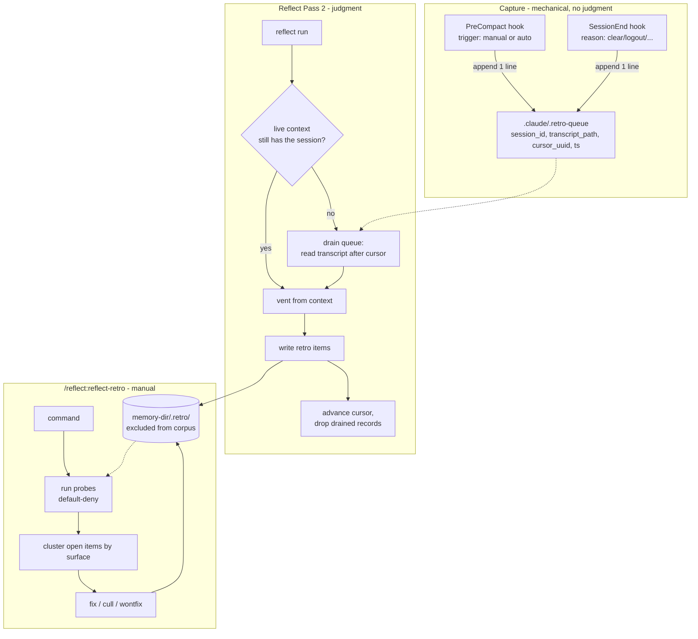
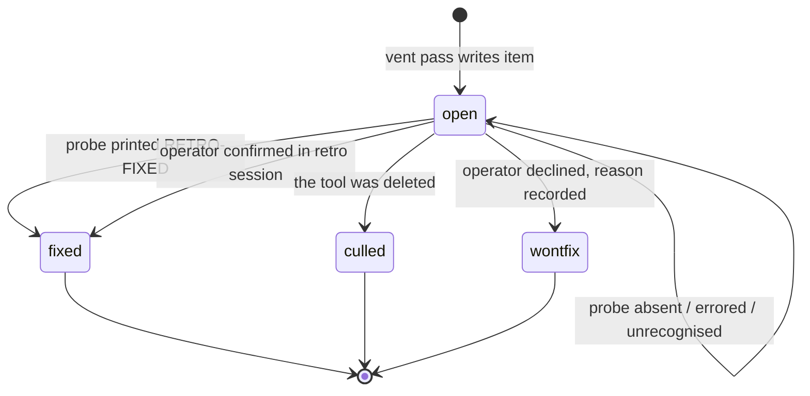

# feat: Reflect retro backlog - Plan

## Goal Capsule

**Objective.** Give agents a durable place to record tool friction - a broken plugin, a skill that documents a file which never existed, a harness footgun - and give Shawn a manual command that works that backlog down by fixing, improving, or culling.

**Means.** Extend the reflect plugin. A retro item is a memory-dir file in a new `.retro/` subdirectory. Capture happens inside the existing reflect run. A `PreCompact` hook preserves session transcripts so material survives compaction. A new manual command `/reflect:reflect-retro` clusters the backlog and drives the work.

**Product authority.** This plan. No upstream requirements document exists; the four settled decisions below came from the invoking conversation.

**The bet, stated.** Reflect stops being only silent memory hygiene and becomes hygiene plus a tool-friction backlog that holds stored executable shell. Five new terms - retro item, backlog, disposition, probe, vent pass - join a vocabulary that already carries memory, scope, activation, trigger and nudge. For a single-operator tool the cost is recall friction at review time rather than adoption, and it is accepted deliberately rather than by drift.

**Open blockers.** None.

---

## Summary

Agents hit friction constantly and that signal has nowhere to go. It gets misfiled as a `feedback` memory, which answers "how should I work" rather than "what should we fix"; or into `docs/solutions/`, which is per-repo and only covers problems already solved; or it is lost. Nothing aggregates it and nothing closes it. This plan adds a retro backlog with a real disposition lifecycle, capture that costs an agent nothing mid-task, and a manual command whose purpose is to empty the backlog rather than report on it.

---

## Problem Frame

Four real items are the acceptance test set. A design that cannot capture and theme these four is wrong. They cover three of the four surfaces - plugin, harness, skill. No seed item is `codebase`; that surface is in the enum because friction from a repo's own code is the obvious fourth kind, but it is unexercised by the test set and should be treated as the least-validated value.

| Item | Surface | Cost paid |
| --- | --- | --- |
| `/spinoff:start-split` exits 5 while `--target tab` succeeds on identical args | plugin | three sessions re-derived it under three different wrong theories |
| `~/.gitignore_global` ignores `data/`, silently dropping a generated JSON layer from a first commit | harness | a whole layer missing from a commit, found later |
| `/spawn team` reports `outcome: "failed"` with `error: null`, `ok: true`, `exit_code: 0` | plugin | 173k output tokens across five runs guessing at a cause the plugin never names |
| `build.py` in the direct-writing skill signs off telling you to run `hooks/build_hook.py`, which has never existed | skill | repeated dead-end on a documented step |

The third item is the shape of the problem: an operator paid five times for a diagnosis the tool could have stated once. The first is the shape of the miss: a memory existed, and the third agent still re-derived it, because a memory says "work around this" and never says "this is still broken."

**And a retro item does not warn the fourth session either.** By KTD2 it is invisible to every recall surface, deliberately. So the re-derivation cost stops only when the item is worked down and the tool is actually fixed - not when the item is written. The feature's claim is that friction gets *closed*, not that the next session gets *told*. Anything stronger than that oversells it.

**What this set does not test.** All four were diagnosed and written up before this plan existed, each with a known cost and, for three, an obvious probe. They validate the *item format* against well-resolved material. They do not test *discovery* - the ambiguous mid-session moment where an agent must decide whether the tool or the work was at fault. Nothing else in the plan covers that gap either; U3's calibration step is the closest thing to a discovery check.

**Why the existing surfaces do not cover this.** Three stores exist and none carries a per-item closed state:

| Surface | Scope | Answers | Closes? |
| --- | --- | --- | --- |
| `feedback` memory | global or `_scope/<repo>` | how should I work | no - reinforced, decays |
| `docs/solutions/` | per-repo | what was the root cause of a solved problem | no - accumulates |
| `REFLECT.log` | global | what did a reflect run do | per-run `retired=N` tally only |

`REFLECT.log` does carry a `retired=N` count, but that is a per-run tally of memories retired, not a per-item disposition. Nothing anywhere records "this is broken, and here is what would prove it fixed."

---

## Requirements

**R1.** A retro item records tool friction as a file: the surface it belongs to, the specific thing, a one-line symptom, the sessions that hit it, and a disposition.

**R2.** Disposition is one of `open`, `fixed`, `culled`, `wontfix`. An item leaves the backlog only by moving out of `open`.

**R3.** A retro item may carry a **probe** - a shell check that proves the thing is fixed. A probe that proves fixed closes its item automatically.

**R4.** Auto-close is default-deny. An item closes only on a positively proven effect. Probe absent, probe errored, probe output unrecognised, or probe binary missing all leave the item `open`.

**R5.** Retro items never reach `MEMORY.md` and never surface in mid-task recall. They are review-time material.

**R6.** Capture costs an agent nothing mid-task. It happens inside the reflect run, which already reviews the session.

**R7.** Material survives context compaction and session end. A hook preserves the transcript reference; the next reflect run drains it.

**R8.** `/reflect:reflect-retro` is manual and works the backlog down: cluster by surface, act, close. Culling - concluding "delete this skill" - is a normal outcome, not a failure.

**R9.** The command works the whole open backlog. Staleness is sort order, never a filter.

**R10.** A retro item may point at a `feedback` memory or a `docs/solutions/` doc without absorbing either.

**R11.** Every hook path is fail-open and exits 0. The queue write is never in the critical path of anything a user waits on.

**R12.** The feature is live only when the published plugin version serves it.

**R13.** Reflect's existing closing summary reports the count of open retro items once it crosses a stated threshold. This is one number in output that already prints - not a nudge mechanism, not a trigger, and it never runs the retro. Without it a retro item is *strictly worse* than the `feedback` memory it replaces: a memory at least surfaces in mid-task recall, while a retro item is excluded from recall by R5, so an unopened backlog closes nothing - the exact failure named in the Problem Frame.

---

## Key Technical Decisions

**KTD1. A retro item is a memory-dir file with `type: retro`.**
*(session-settled: user-directed - chosen over a new append-only log store or a `status:` key on `docs/solutions/` frontmatter: the memory dir already provides frontmatter conventions, a store layout, and a repair-script precedent, so extend that seam rather than build a fourth surface beside the three that exist.)*
Governs R1, R2.

Nothing in the plugin validates or enumerates memory `type:` values - `type: idea` is an existing precedent added the same way. Confirmed by grep across `plugins/reflect/scripts/scoped-memory/*.py`, `memory-index-render.py` and `memory_activation.py`: the only enumeration is `TYPE_PREFIXES` in `memory-index-render.py`, a filename-prefix list used solely to strip a leading token from an index title.

**KTD2. Retro items live in `<memory-dir>/.retro/`, a dot-directory.**
Governs R5.

`corpus.iter_bodies()` in `plugins/reflect/scripts/scoped-memory/corpus.py` prunes dot-directories already (`dirs[:] = sorted(d for d in dirs if not d.startswith("."))`). Corpus is the single enumeration of the store, consumed by activation scoring, index rendering, local BM25, and trigger compilation. Putting retro items in a dot-directory excludes them from all four with **zero code change**.

This is the cheapest correct answer to three separate questions - index exclusion, recall exclusion, trigger exclusion - and it is deliberate rather than incidental: retro items are read at review time, and a growing backlog competing for the recall top-3 would dilute curated memories in unrelated sessions.

Alternative rejected: `_retro/` on the `_scope/` precedent. That keeps items qmd-visible, which is the opposite of what R5 wants.

**KTD3. The probe lives in the item body, not frontmatter.**
Governs R3.

`memory_activation.parse_last_used` and `parse_pinned` read the first 4096 bytes with line-anchored regexes (`^\s*last_used\s*:`, `^\s*pin\s*:\s*true\s*$`), not a YAML parse. A multi-line `probe:` in frontmatter containing a line that looks like either key would be picked up as that key. Retro items are outside the corpus so activation never scores them, but the hazard is structural and the body is free of it.

**KTD4. A probe proves fixed by printing a token, never by exit status.**
Governs R3, R4.

The probe contract: the runner generates a fresh random nonce per execution and exports it as `RETRO_NONCE`. A probe proves fixed by printing a line equal to `RETRO-FIXED $RETRO_NONCE`. Auto-close requires exit 0 **and** that line. Anything else - empty output, a bare `RETRO-FIXED` with no nonce or a stale one, a different token, non-zero exit, no such file - leaves the item `open`.

The nonce is what makes this a closed class rather than an enumerated one. A probe re-runs the broken tool and forwards its output, and that output is shaped by material the operator does not control - the same transcript, repo, and web content the probe was authored from. Requiring the token to own its line stops a probe echoing its own source; it does not stop forwarded output that happens to contain the token. A per-execution nonce cannot be present in anything written before the run.

This is the load-bearing safety decision. On this machine `timeout` does not exist, so `timeout 480 bash foo.sh` fails command-not-found **and the shell reports exit 0**; `cp`, `mv` and `rm` are aliased `-i`, so an overwrite prompts, answers no, does nothing, and exits 0. An exit-code-driven auto-close would silently close unfixed items - the exact false-green class this repo has already shipped three times, including `~/.claude/doc-store/solutions/a-tally-keyed-on-exit-status-reports-work-that-never-happened.md`, which records this very plugin printing `embedded=5 failed=0` over zero indexed documents. Requiring a positive token means a probe that never ran cannot close anything.

**KTD5. The vent pass folds into reflect Pass 2 rather than becoming a new numbered pass.**
*(session-settled: user-directed - chosen over a mid-task capture command: reflect already holds the session context and is already a batch moment; anything costing an agent more than a line mid-task will not happen.)*
Governs R6.

Inserting a new numbered pass renumbers passes 6-10 throughout `plugins/reflect/skills/reflect/SKILL.md` and the section banners in `plugins/reflect/scripts/reflect-run.sh`. Pass 2 is already an agent-owned judgment/write pass, and it runs before Pass 6 (index render), which is required so the same run's write-side passes see anything new. Folding in costs no renumbering.

**KTD6. `PreCompact` and `SessionEnd` hooks append to a pending queue; they never write retro items.**
*(session-settled: user-approved - chosen over having the hook capture items directly: a command hook cannot exercise judgment, and at compaction time no model is available to write items.)*
Governs R7, R11.

Verified against the Claude Code hooks reference: `PreCompact` is a valid event; the common input fields on every hook include `session_id`, `transcript_path`, and `cwd`; the `trigger` matcher distinguishes `manual` from `auto`; `PreCompact` fires for both auto-compaction and `/compact`. `SessionEnd` also exists, with a `reason` matcher (`clear`, `resume`, `logout`, `prompt_input_exit`, `other`), and covers sessions that end without ever compacting.

`PreCompact` is fire-and-forget and non-blocking - a non-zero exit does not stop compaction - which matches the design: stash and exit.

**KTD7. The queue cursor is a transcript record `uuid`, not a byte offset.**
Governs R7.

Empirical inspection of live transcripts confirms each record carries `uuid` (unique per record) and `timestamp` (ISO 8601, sortable). No byte offset or line count exists in the record. The drain records the `uuid` of the last processed record and resumes after it.

**KTD8. Queue records are single-line, appended with one write.**
Governs R11.

Several sessions can compact independently and append to one queue. A prior torn-tail append defect in this repo welded a record onto a fragment. One `printf` of one line per record keeps each append atomic under `PIPE_BUF`.

**KTD9. Probes execute only inside the manual `/reflect:reflect-retro` session.**
Governs R3, R8.

A probe is stored shell, authored by an agent, run later. It never runs from a hook, never from an automatic reflect pass, and never unattended. The boundary is that Shawn is present and invoked the command.

**Enforced mechanically, not by this sentence.** `harness.sh` fails if anything under `plugins/reflect/hooks/` or `plugins/reflect/scripts/reflect-run.sh` references the probe entry point. Without that check a later change wires probes into a hook and nothing fails, silently converting stored agent-authored shell from attended to unattended execution. The plan's other safety invariant is asserted in tests; this one gets the same treatment.

**First execution requires approval.** Before a probe runs for the first time, its text is shown and the operator approves it; the approval and a hash of the probe text are recorded on the item. An edited probe no longer matches its hash and asks again. A probe is authored from transcript material - web pages, repo files, tool output - which is not trusted input, so the authoring step is reachable by content the operator never wrote.

**KTD10. `culled` is not retirement.**
Governs R2.

`CONCEPTS.md` already defines Retirement as "deleting a memory because it is *wrong* - contradicted by a newer one, or a duplicate absorbed into a stronger entry. Capacity is never a reason to delete." A retro `culled` means the tool was deleted, which is a different act. The glossary needs both terms and the distinction recorded under its existing "Flagged ambiguities" section, or the vocabulary collides.

---

## Scope Boundaries

**In scope.** The item format and store; the two capture hooks and the queue; the vent pass; the probe runner; the command; a REFLECT.log tally field; tests; glossary entries; the version bump and publish.

### Deferred to Follow-Up Work

- **Staleness nudge or automatic retro trigger.** No hook nudge, no `additionalContext` injection, no automatic invocation - the command is manual by decision. R13's open-count line in reflect's existing summary is not this: it reports a number, it does not prompt or act.
- **Migrating the four seed items' existing memories.** They stay as they are; the retro items link to them.
- **A retro-aware recall path.** Retro items are outside the corpus by KTD2; giving them their own search surface is separate work.

### Outside this work

- **`docs/solutions/` is untouched.** No new frontmatter key, no status field, no restructuring. A retro item may reference a solution doc.
- **The memory retirement pass is untouched.** Retro items are outside the corpus, so retirement never sees them.

---

## Assumptions

**A1. Resolved - no longer an assumption.** Verified empirically against the live qmd binary during review: a collection with pattern `**/*.md` over a directory containing `vis/a.md` and `.retro/b.md` indexed exactly one file, `vis/a.md`. qmd does not index dot-directories, so KTD2's exclusion holds for the `claude-memory` collection as well as for corpus. U1's fallback exclusion is not needed.

Consequence, and it is the reason U1 grows a list entry point: **no search surface over the backlog exists at all.** Corpus, `MEMORY.md`, local BM25, triggers and qmd all skip `.retro/`, which is what R5 wants - and it means every read of the backlog goes through `retro.py`.

**A2.** `custom_instructions` from `/compact <instructions>` is not in the `PreCompact` payload. Documented as absent from the schema; the design does not use it.

**A3.** `"matcher": ""` on a hook entry is undocumented behaviour. New entries omit the matcher or use `"*"`.

---

## High-Level Technical Design



**Disposition state machine.** Every transition out of `open` records a proof.



The self-loop is the default-deny rule made visible: every ambiguous probe outcome returns to `open`.

---

## Output Structure

```
plugins/reflect/
├── commands/
│   └── reflect-retro.md              # new: the manual command
├── hooks/
│   └── retro-queue.sh                # new: PreCompact + SessionEnd queue writer
├── scripts/
│   └── retro.py                      # new: item read/write, probe runner, queue drain
├── tests/
│   ├── retro_test.py                 # new: item format, disposition, probe default-deny
│   ├── retro_queue_test.sh           # new: hook append, atomicity, fail-open
│   └── fixtures/retro/               # new: sample items + a transcript fixture
└── .claude/hooks/hooks.json          # modified: PreCompact + SessionEnd entries
```

---

## Implementation Units

**Sequencing, and one open question.** Build order is U1 -> U3's live-context branch -> U5 -> U4 -> U2 -> U6 -> U7 -> U8. That front-loads the shortest path to a real closed item: capture from live context, work it down, close it. U2's queue is the most complex unit in the plan - atomic append, cursor, concurrency, three hygiene rules - and it feeds a pass whose output value is unproven until the live branch has run once.

A review pass argued for gating U2, U4 and U6 behind a proven live loop entirely. That is not done here, because the compaction path was explicitly requested and dropping it to a gated phase would reverse that call silently. **Open question for Shawn:** if the live-context vent alone turns out to capture most friction, is the queue worth its complexity? Worth asking again after the first real cycle, not now.

### U1. Retro item format and store location

**Goal.** Define the on-disk shape of a retro item and prove `.retro/` is invisible to every existing consumer.

**Requirements.** R1, R2, R5. Implements KTD1, KTD2, KTD3.

**Dependencies.** None.

**Files.**
- `plugins/reflect/scripts/retro.py` (create - item read/write and the list entry point)
- `plugins/reflect/tests/retro_test.py` (create)
- `plugins/reflect/tests/fixtures/retro/` (create)
- `plugins/reflect/tests/harness.sh` (modify - add the invocation block for `retro_test.py`)

**Approach.**

1. Item file at `<memory-dir>/.retro/<slug>.md`. Create the directory mode 0700 - under the default umask it would be world-readable, and it holds distilled friction bodies plus the probe shell those bodies carry. Frontmatter: `name`, `description`, `disposition`, `surface` (one of plugin/skill/harness/codebase), `thing`, `opened`, `sessions`, `capture` (`live` or `drained`, per U3), and `metadata.type: retro`. No `last_used`, no `pin` - retro items are never activation-scored.

2. **A list entry point, because nothing else can see the backlog.** Per A1 there is no search surface over `.retro/` at all - corpus, the index, local BM25, triggers and qmd all skip it. `retro.py` exposes a list function that enumerates `.retro/`, filters by disposition and surface, and returns item identity plus frontmatter. U3's dedup rule and U5's clustering step are both built on it; without it dedup silently degrades into writing one duplicate item per session, which is the noisy backlog the vent bar exists to prevent.

3. Probe lives in the body under a `## Probe` heading in a fenced `bash` block (KTD3). Body also carries the symptom, the cost paid so far, and `[[links]]` to any related memory or solution doc (R10).
4. Frontmatter parsing follows the house style - hand-rolled and fail-open, matching `triggers.py`'s `read_head` / `frontmatter_lines` / `_unquote`. No YAML library; there is none anywhere in the plugin.

   **This unit owns the only item writer.** `retro.py` exposes one function that moves an item between dispositions, requiring a proof argument naming what closed it - a probe result, or an operator decision with a reason - and one function for non-disposition updates: appending a session to an existing open item, and recording a probe approval and its hash. U3, U4 and U5 all call these; nothing else edits an item file directly. U3's session-list bump is deliberately inside this boundary rather than beside it - an ad-hoc second writer is exactly the duplicate-field defect this unit cites as its own reason for existing. A single writer is what makes the "no item is closed without a recorded proof" invariant testable as an invariant rather than as a convention two callers happen to follow. It also keeps `last_used`-style field duplication impossible, which is the defect that sank 31 memory bodies when three different writers each placed a field their own way.
5. A1 is already resolved - qmd and corpus both skip dot-directories, verified during review. Ship it as a **regression test** rather than a verification step: a fixture item in `.retro/` must stay invisible to a real corpus walk. The exclusion is load-bearing for R5 and currently rests on upstream behaviour nothing in this repo controls, so it needs a test that fails loudly if either walker starts descending dot-directories.

**Patterns to follow.** `plugins/reflect/scripts/scoped-memory/triggers.py` for the frontmatter reader. `plugins/reflect/scripts/scoped-memory/corpus.py` for how the store is walked and what `_excluded()` already covers.

**Test scenarios.**
- A retro item written to `.retro/` does not appear in `corpus.iter_bodies()` output for that store.
- A retro item written to `.retro/` does not appear in rendered `MEMORY.md` when the renderer runs against that store.
- An item with a `## Probe` block round-trips: written, read back, probe text recovered byte-identical.
- An item with no `## Probe` block reads back with probe absent, not empty-string.
- Frontmatter with a stray unterminated `---` fence reads as absent frontmatter rather than raising.
- `disposition` accepts exactly the four values; a fifth value is rejected at write time with a named error.
- A body containing a line reading `last_used: 2020-01-01` inside the probe fence does not become the item's `last_used`.
- Moving an item out of `open` without a proof argument raises rather than writing - the invariant holds at the writer, not at the callers.
- A disposition move records the proof on the item and leaves the rest of the frontmatter byte-identical.
- The list entry point returns only `open` items when filtered by disposition, and only matching items when filtered by surface.
- The list entry point returns an empty list against an empty or absent `.retro/` rather than raising.
- `.retro/` is created mode 0700.
- Appending a session to an existing open item leaves its disposition and proof fields untouched.
- `harness.sh` invokes `retro_test.py` and asserts its tally line.

**Verification.** The exclusion tests pass against a real corpus walk, not a mock. A1 is settled in writing - either confirmed, or an exclusion shipped.

---

### U2. Capture hooks and the pending queue

**Goal.** Preserve the transcript reference when a session compacts or ends, so vent material survives.

**Requirements.** R7, R11. Implements KTD6, KTD7, KTD8.

**Dependencies.** None. U2 shares no code with U1 - the queue lives at `$HOME/.claude/.retro-queue`, outside the memory store, and none of its fields reference the store layout. U2 and U1 can run in parallel; U3 carries the real U1 + U2 dependency.

**Files.**
- `plugins/reflect/hooks/retro-queue.sh` (create)
- `plugins/reflect/.claude/hooks/hooks.json` (modify - add `PreCompact` and `SessionEnd` top-level event keys)
- `plugins/reflect/tests/retro_queue_test.sh` (create)
- `plugins/reflect/tests/harness.sh` (modify - add the invocation block for `retro_queue_test.sh`)

**Approach.**

1. One hook script serving both events. It reads stdin JSON with `jq`, guarded by `command -v jq >/dev/null 2>&1 || exit 0`. Nothing is read from environment variables except `CLAUDE_PLUGIN_ROOT` - `$TOOL_INPUT` and friends do not exist for `type: command` hooks, and two matchers using them shipped in this plugin for months producing zero triggers.
2. Extract `session_id`, `transcript_path`, `hook_event_name`, and the event-specific `trigger` or `reason`.

   **The queue line is exactly:** `session_id`, `transcript_path`, `cursor_uuid`, `event`, `ts` - tab-separated, in that order. The hook always writes `cursor_uuid` **empty**: it stashes and exits, and never reads a transcript. U3 owns that field (KTD7) and stamps the last-processed uuid back onto the record when it drains. An empty cursor means "from the first record."
3. Append exactly one line to `$HOME/.claude/.retro-queue` with a single `printf` (KTD8). Fields separated by tab; no field may contain a tab or newline.
4. `type: command`, never `type: prompt`. A `type: prompt` hook consumes a turn per firing and, in a background subagent, ends the agent permanently.
5. `umask 077` before the append - the queue is a running index of every project path the operator works in, and it should not be world-readable by default.
6. Every path exits 0 (R11). No timeouts in the script body; no `timeout` binary - it does not exist on this machine and fails command-not-found while reporting exit 0.
6. hooks.json entries carry an explicit `timeout` and a `|| true` tail, matching every existing entry. Omit `matcher` rather than using `""` (A3).

**Patterns to follow.** `plugins/reflect/hooks/reflect-trigger.sh` is the closest precedent - a flag file under `$HOME/.claude/`, append-on-coalesce, no locking. Note its `stat -f %m` is BSD syntax with an `|| echo 0` fallback. The `description` field in `hooks.json` is itself a distilled learnings artifact; read it before editing and extend it for the new events.

**Execution note.** Write the hook's test first. The hook exits 0 on every path by design, so a test asserting `rc == 0` passes with the entire body deleted - that exact false-green shipped in this plugin before.

**Test scenarios.**
- A `PreCompact` payload on stdin appends exactly one line to the queue, and that line contains the transcript path from the payload.
- Two concurrent invocations append two complete lines - no line is a fragment of another, and the file has exactly two lines.
- Absent `jq`, the hook exits 0 and the queue file is unchanged (assert file contents, not the exit code).
- Malformed JSON on stdin leaves the queue unchanged and exits 0.
- A `SessionEnd` payload with `reason: clear` appends a record distinguishable from a `PreCompact` one.
- A payload whose `transcript_path` contains spaces round-trips intact through the queue line.
- The written line has exactly five tab-separated fields, and the cursor field is empty.
- The queue file is created mode 0600.
- `harness.sh` invokes `retro_queue_test.sh` and asserts its tally line.
- Mutation check: delete the append and confirm at least one scenario above fails.

**Verification.** Every assertion is on an observed effect - queue contents - never on exit status.

---

### U3. Queue drain and the vent pass

**Goal.** Turn preserved transcripts and live session context into retro items during a reflect run.

**Requirements.** R6, R7. Implements KTD5.

**Dependencies.** U1, U2.

**Files.**
- `plugins/reflect/scripts/retro.py` (modify - add drain and cursor advance)
- `plugins/reflect/skills/reflect/SKILL.md` (modify - Pass 2 gains the vent pass; Pass 10 documents the new tally field)
- `plugins/reflect/tests/retro_test.py` (modify)

**Approach.**

1. Fold the vent pass into Pass 2 (KTD5). Pass 2 is agent-owned and already writes memory-dir files, and it runs before Pass 6 so the same run's render sees the store as it now is.
2. The vent pass asks one question of the session: what got in the way that a tool should have handled? It writes items for what it finds, and writes nothing when the answer is nothing.

   **Calibrate the bar before shipping the prose.** Dry-run the bar over a fixed number of recent real transcripts and record the resulting item count in this plan. That count is the sizing input for U5's clustering and for the expiry bound below - both are currently designed against a volume nobody has measured.

   **Never paste raw material.** An item states the friction in the agent's own words. It never carries raw transcript excerpts, raw command output, environment values, tokens, or file contents, and a probe never embeds a literal credential. The drain reads whole transcripts of sessions nobody reviewed, the hooks fire in every project including work repos, and retro items are precisely what later gets pasted into issues and PRs - so a credential that appeared once in an error message would otherwise become durable and travel.

   **The bar, stated in SKILL.md so it is not re-invented per run.** An item qualifies when all three hold: the friction came from a *tool* - a plugin, skill, hook, script, or harness behaviour - rather than from the work itself; a future session would hit it again unchanged; and it is nameable as a specific thing, not a mood. Explicitly excluded: a mistake the agent made and corrected, a one-off environment hiccup, a task that was simply hard, and anything already `open` in the backlog for the same thing - found via U1's list entry point, which is the only way to see the backlog at all - that case bumps the existing item's session list, through U1's writer, instead of writing a second item. The bar is deliberately narrow: a backlog nobody trusts gets skipped, and the cost of a missed item is one repeat, while the cost of a noisy backlog is the whole feature.
3. Drain: for each queue record whose session is not the live one, read the transcript after `cursor_uuid`, then advance the cursor and drop the record.

   **A drained item is not as good as a vented one, and the item says so.** Every item records capture provenance - `live` or `drained` - in frontmatter. The asymmetry is real: the hooks fire in every session of every project, but reflect runs in only some, so the drain path will author the majority of items while having the least ability to apply the bar, which asks whether a future session would hit it again unchanged. An agent reading a stranger's transcript cold, in an unrelated repo, cannot judge that as well as one that lived the session. So the drain path is held to a narrower rule: **write an item only when the transcript contains an explicit tool failure the agent can name** - a non-zero exit, an error message, a documented path that did not exist - never on general judgment. The retro session can then weight a `drained` item accordingly instead of treating both as equal.

   **Which side judges.** `retro.py` does no extraction - extraction is judgment, and KTD6's whole rationale for queueing rather than capturing is that mechanical code cannot exercise it. `retro.py` returns **bounded candidate material** and the agent decides what qualifies. The bound matters: a drained transcript is a full pre-compaction session, routinely hundreds of KB, arriving inside a reflect run that SKILL.md keeps cheap and silent. Cap what one drained record hands to Pass 2 - errors, non-zero exits, and tool failures in preference to ordinary successful turns, truncated to a stated ceiling - and say in the drain's return how much was dropped, so a silently truncated drain is never mistaken for a quiet session.

   An empty `cursor_uuid` means from the first record. A session that compacts twice gets its existing record's cursor advanced rather than a second record appended (KTD8).
4. **Queue hygiene, all three cases.** The expiry bound below narrows R7's "material survives compaction and session end" to a finite window, and the item three sessions kept re-deriving is exactly the one that expires when reflect does not run soon enough - set the bound from the calibration count, not by guess. A record pointing at a transcript that no longer exists is dropped with a note, not retried - Claude Code prunes transcripts on its own schedule. Repeated compactions in one session collapse to one record by advancing the existing cursor rather than appending a second. Records older than a bounded age are dropped. Without these the queue becomes a second never-closing surface, which is the disease this feature treats.
5. SKILL.md keeps its output contract: exactly two visible units, never a narration of passes. The vent pass adds no visible output of its own.

**Patterns to follow.** SKILL.md Pass 2 for how an agent-owned pass declares its tally. SKILL.md's "Every count means an observed effect, never a step that ran" rule governs the new count.

**Test scenarios.**
- A queue record pointing at a fixture transcript yields at least one retro item written to `.retro/`.
- After a drain, the drained record is gone from the queue and surviving records are untouched.
- A record whose `transcript_path` does not exist is dropped without raising and without writing an item.
- Two records for the same session collapse to one cursor advance, not two items for the same friction.
- A record older than the expiry bound is dropped.
- A drain that finds no friction in the transcript writes zero items and still drops the record.
- Draining the same queue twice is idempotent - the second run writes no duplicate items.
- A transcript fixture containing a token-shaped string yields an item that does not contain it.
- A drain whose candidate material exceeds the cap reports how much it dropped rather than returning silently truncated material.

**Verification.** Items exist on disk with the expected disposition and surface. Queue file state is asserted directly.

---

### U4. Probe runner

**Goal.** Prove an item is fixed, and refuse to close it on anything less.

**Requirements.** R3, R4. Implements KTD4, KTD9.

**Dependencies.** U1.

**Files.**
- `plugins/reflect/scripts/retro.py` (modify - add probe runner)
- `plugins/reflect/tests/retro_test.py` (modify)
- `plugins/reflect/tests/fixtures/retro/` (modify - add passing, failing, and hostile probe fixtures)
- `plugins/reflect/tests/harness.sh` (modify - add the KTD9 boundary check)

**Approach.**

1. Run the probe with a bounded wall-clock budget enforced in Python, not by a `timeout` binary. Kill the process group on expiry - `subprocess.run(timeout=)` alone SIGKILLs the direct child and orphans grandchildren, a defect this plugin has already fixed once in the qmd guard.
2. Generate a fresh nonce per execution, export it as `RETRO_NONCE`, and close on exit 0 **and** a stdout line equal to `RETRO-FIXED $RETRO_NONCE` (KTD4).

2b. Refuse to run a probe that has no recorded approval, or whose recorded hash no longer matches its text (KTD9). Show the text, take the decision, record approval and hash through U1's writer.

2c. Add the `harness.sh` check that fails if any hook or `reflect-run.sh` references the probe entry point (KTD9).

   Every other outcome leaves the item `open`, including a non-zero exit, an empty stdout, an unrecognised or nonce-less token, a timeout, and a probe that could not start.
3. Record the outcome on the item - what ran, what it printed, when - so a later session can see why an item is still open rather than re-deriving it.
4. Probes run only under U5's command (KTD9). `retro.py`'s probe entry point is not called from any hook or automatic pass.

**Execution note.** Build the hostile fixtures first: a probe invoking a non-existent binary, a probe that prints nothing and exits 0, and a probe that prints `RETRO-FIXED` on stderr rather than stdout. Each must leave the item open. These encode the machine's actual false-green traps and are the reason this unit exists.

**Test scenarios.**
- A probe printing `RETRO-FIXED` and exiting 0 moves the item to `fixed`.
- A probe printing `RETRO-FIXED` and exiting 1 leaves the item `open`.
- A probe printing nothing and exiting 0 leaves the item `open`.
- A probe invoking a non-existent binary leaves the item `open` - this is the `timeout`-does-not-exist case.
- A probe printing `RETRO-FIXED` to stderr leaves the item `open`.
- A probe printing `RETRO-FIXED $RETRO_NONCE` as a whole line, among other output lines, closes the item.
- A probe forwarding subprocess output that contains a bare `RETRO-FIXED` line, with no nonce, leaves the item `open` - this is the forged-token case.
- A probe printing `RETRO-FIXED` with a stale nonce from a previous run leaves the item `open`.
- An unapproved probe is not executed at all and the item stays `open`.
- A probe edited after approval is not executed until re-approved.
- The boundary check fails when a hook is made to reference the probe entry point.
- A probe that sleeps past the budget is killed, its process group is gone, and the item stays `open`.
- An item with no probe is never auto-closed by a run over the whole backlog.
- Mutation check: invert the token check and confirm at least three scenarios above fail.

**Verification.** Item dispositions on disk after a run over a mixed fixture set. The default-deny invariant is asserted as an invariant - no item is `fixed` without a recorded proof - not as a check on today's field names.

---

### U5. The `/reflect:reflect-retro` command

**Goal.** The manual session that works the backlog down.

**Requirements.** R8, R9, R10. Implements KTD9.

**Dependencies.** U1. Not U4 - the state machine already closes items on operator confirmation, and one seed item ships probe-less on purpose. Probes optimise closure; they are not a precondition for it, and gating first use behind the highest-risk unit would delay the loop that carries the value.

**Files.**
- `plugins/reflect/commands/reflect-retro.md` (create)
- `plugins/reflect/commands/reflect-regroup.md` (modify - add the cross-reference)
- `plugins/reflect/commands/memories.md` (modify - add the cross-reference)
- `plugins/reflect/tests/harness.sh` (modify - extend the command cross-reference check to the third command)

**Approach.**

1. Frontmatter is one key, `description:`, matching all three existing command files. No `name:`, no `argument-hint:`, no `allowed-tools:`.
2. Structure follows `reflect-regroup.md`: a second-person framing paragraph, then bolded scope-boundary paragraphs naming what the command is **not**, then a `---` rule, then numbered `## N. <Imperative>` sections, then a fenced example of the expected output shape.
3. The scope boundaries to argue explicitly: not `/reflect` (which is silent hygiene and does not stop); not `/memories` (deliberate study of a topic); and the command is **not a report** - its purpose is to leave the backlog smaller than it found it.
4. Steps: run probes over the whole open backlog first when the probe runner exists (closing what is provably fixed), cluster what remains by surface - both reads go through U1's list entry point, the only view of the backlog that exists - pick and act, then record dispositions. Culling is presented as a normal outcome with an example, not an edge case (R8).
5. R9 is stated as the mechanism, in the house voice: the whole open backlog, sorted by staleness, never filtered by it - because a "recent" window would hide exactly the item three sessions kept re-deriving.
6. Name collision check: a command and a skill sharing a name means the command wins and the skill silently never loads. The plugin's skill is `reflect`; commands are `memories`, `reflect-setup`, `reflect-regroup`. `reflect-retro` collides with none - confirm before shipping.
7. The harness enforces that command files cross-reference each other. Extend that check to cover the third command.

**Patterns to follow.** `plugins/reflect/commands/reflect-regroup.md` in full - voice, section shape, and the way it names the failure each step prevents.

**Test scenarios.**
- `plugins/reflect/tests/harness.sh` gains a check that `reflect-retro.md` cross-references its siblings and they reference it.
- The command file's frontmatter has exactly one key.
- The command file names its scope boundary against `/reflect` and `/memories`.
- No skill in the plugin shares the name `reflect-retro`.

**Verification.** Harness checks pass. The command reads as a sibling of `reflect-regroup.md`, not as a different document.

---

### U6. REFLECT.log tally field

**Goal.** Record how many retro items a reflect run actually wrote.

**Requirements.** R6, R13.

**Dependencies.** U3.

**Files.**
- `plugins/reflect/scripts/reflect-run.sh` (modify)
- `plugins/reflect/skills/reflect/SKILL.md` (modify - Pass 10 field list)
- `plugins/reflect/tests/reflect_run_test.sh` (modify)

**Approach.**

1. Add `retro_captured=N` **at the end** of the log line, and report the open-item count in reflect's visible closing summary once it crosses the R13 threshold - named here, sized from U3's calibration count. The two trigger fields currently go last precisely so positional readers keep working; the new field takes that position and they shift left by one. There is no live REFLECT.log parser - only the runner writes it, and only its own test greps its `logged:` output - so the cost is bounded to this unit.
2. The count is an observed effect: files actually present in `.retro/` after the pass, not a flag echoed back. This follows the rule stated in SKILL.md and the defect that produced it, where Pass 8 printed `embedded=5` while zero documents were indexed.
3. The seven mechanical steps a new field needs: a var default, an arg-loop case or an in-script computation, an entry in the numeric-validation loop, the `LOG_LINE` append, the stdout report line, the SKILL.md documentation, and the test assertions.

**Test scenarios.**
- A run that writes two retro items logs `retro_captured=2`.
- A run that writes none logs `retro_captured=0`, and the field is present rather than omitted.
- With open items below the threshold the closing summary says nothing about the backlog; at or above it, the count appears.
- The count reported is the number of `open` items actually on disk, not a running total.
- A non-integer passed to the flag form dies with the named error, matching sibling flags.
- The field is last in the line, and the pre-existing fields keep their relative order.

**Verification.** Assert on the written REFLECT.log line, not on the runner's exit status.

---

### U7. Glossary and vocabulary

**Goal.** Add the new terms and resolve the collision with an existing one.

**Requirements.** R2. Implements KTD10.

**Dependencies.** U1, U4, U5.

**Files.**
- `CONCEPTS.md` (modify)

**Approach.**

1. Add glossary entries for Retro item, Backlog, Disposition, Probe, and Vent pass, following the format of the existing entries.
2. Record the Retirement / Culled distinction under the existing "Flagged ambiguities" section: Retirement deletes a memory because it is *wrong*; Culled records that a *tool* was deleted. Same word family, different acts.
3. Glossary only. No file paths, class names, or implementation decisions - `CONCEPTS.md` states this constraint about itself.

**Test scenarios.** `Test expectation: none` - documentation with no behavioural surface. Correctness is checked in review against the existing entry format.

**Verification.** Each new term is defined, and the ambiguity entry names both senses.

---

### U8. Version bump and publish

**Goal.** Make the feature live. Merging alone does not.

**Requirements.** R12.

**Dependencies.** U1 through U7.

**Files.**
- `plugins/reflect/.claude-plugin/plugin.json` (modify - `0.5.2` to `0.6.0`)
- `.claude-plugin/marketplace.json` (modify - the reflect entry's version, currently `0.5.2` at line 62)

**Approach.**

1. `scripts/check-version-bumped.sh` fails when any file under `plugins/reflect/` other than its own `plugin.json` changed against `origin/main` without a bump, and fails again if the two version strings disagree. Both must move together.
2. Edit `marketplace.json` **surgically** with a string replace on a unique anchor, asserting the match count is exactly 1. Never `json.load` / `json.dump` - it re-encodes every other plugin's description and pollutes the diff. Verify `git diff --numstat` shows exactly two changed lines for this file.
3. Hooks run from the installed cache at `~/.claude/plugins/cache/shrimpshack/reflect/<version>/`, not from the merged repo. Until the marketplace is refreshed and the plugin updated, the live `PreCompact` hook does not exist and no queue is ever written. Shipping new code under an unchanged version string leaves the store reporting "up to date" indefinitely.

**Execution note.** This unit is the difference between a merged PR and a working feature. Do not report the work complete on the merge alone.

**Test scenarios.**
- `bash scripts/check-version-bumped.sh` passes against `origin/main`.
- The two version strings are equal.
- `git diff --numstat .claude-plugin/marketplace.json` shows exactly two changed lines.

**Verification.** After publishing and updating, `grep -c retro-queue ~/.claude/plugins/cache/shrimpshack/reflect/0.6.0/hooks/retro-queue.sh` returns non-zero from the installed cache.

---

## Verification Contract

1. `bash plugins/reflect/tests/harness.sh` exits 0 and reports zero failures. There is no CI in this repo - the harness is run by hand before merge.
2. Every new test file prints `<basename>: N passed, 0 failed` as its last line and exits non-zero on failure. `harness.sh` greps for exactly that shape.

2b. **Every new test file is wired into `harness.sh` by the unit that creates it.** `harness.sh` has no auto-discovery - every one of its twelve test files is invoked by a hand-written block. A test file nobody invokes is a test that never runs, and the Definition of Done below would then pass green having executed zero retro assertions. Each wiring block follows the existing two-check shape: exit code, plus a grep for the tally line. Before declaring the contract met, count the retro assertions actually executed in the harness output and confirm the number moved.
3. New **test files under `plugins/reflect/tests/`** read nothing above `plugins/reflect/`. A test reaching for the repo-root manifest is structurally unable to pass from the installed cache or a plugin-only `git archive`, and fails as a packaging artifact that reads like a regression. U8's publishing checks are exempt by construction: both version strings live outside the plugin, so those checks are hand-run repo-root steps rather than test files, and they intentionally sit outside the plugin-only boundary.
4. Every new assertion is on an observed effect - file contents, disposition state, queue contents - never on an exit code. The hooks exit 0 on every path by design, so an exit-code assertion passes with the body deleted.
5. Each new test file has at least one assertion proven load-bearing by mutating the code it covers and watching that assertion fail. A deliberate-fail flag proves only that the harness can exit 1.
6. Tests that shell out pin which binary they got.

---

## Risks

**A probe closes an unfixed item.** Mitigated by KTD4's positive-token requirement and U4's hostile fixtures. Residual: a probe whose author wrote a check that passes for the wrong reason. This is an authoring risk, not a mechanism risk, and the recorded probe output makes it visible at the next retro.

**The queue grows without bound.** Once installed, the hooks fire in every session of every project - including sessions reflect never runs in. Mitigated by U3's three hygiene rules. Residual: if reflect stops running entirely, the queue grows until expiry drops records. Bounded, and the failure mode is lost signal rather than corruption.

**The vent pass produces noise, and nobody knows the volume.** "The pass writes nothing when the answer is nothing" restates that a bar exists; it does not constrain what the bar admits. The plan also sizes clustering, a staleness sort, and a queue expiry against a volume it never estimated - at one item a month U5's clustering is dead weight, at ten a week a manual-only drain never keeps up. Mitigated by U3's calibration step, which dry-runs the bar over recent real transcripts and records the count before the prose ships. Residual: the bar may still need tuning after real use; it is prose in SKILL.md and cheap to change.

**The backlog is never drained.** Capture is automatic and free; draining is manual and untriggered by decision. Nothing forces the loop to close, so the store can become a fourth accumulating surface - precisely what the Summary accuses the existing three of being. Mitigated by R13's open-count line and by the Definition of Done requiring one real retro session that drives the seed items to a disposition. Residual: if Shawn stops running the command, the feature degrades to a write-only log. That is the feature's core bet and it is observed, not assumed, before the work is called done.

**Renumbering churn.** Avoided entirely by KTD5. If a future change does need a numbered pass, it renumbers 6-10 in both SKILL.md and the runner's banners.

---

## Definition of Done

- All eight units complete, with U8 actually published.
- `bash plugins/reflect/tests/harness.sh` passes with zero failures.
- `bash scripts/check-version-bumped.sh` passes.
- A1 is settled in writing - qmd's dot-directory behaviour confirmed, or an explicit exclusion shipped.
- **One real retro session** that drives all four seed items to a disposition. Expressing them as items is an authoring exercise; driving them to a disposition is the only proof the work-down loop functions.
- **One live end-to-end cycle after publish**: a real session's compaction writes a queue record, a real reflect run drains it into a retro item, and one seed probe runs and moves its item to `fixed`. Every other criterion here can pass with the capture loop dead - the harness runs on fixtures and the version check compares strings. This plugin has already shipped a capture path that produced zero triggers for months with everything green; this is the only line that would have caught it.
- The four seed items can each be expressed as a retro item. Three carry a probe: `spinoff` (run `/spinoff:start-split` in a scratch worktree), `gitignore_global` (`git check-ignore` on a `data/` path), and `build.py` (test for `hooks/build_hook.py`). The `spawn team` item ships with **no** probe - proving it fixed means running a real job and asserting the failure names a cause, which is not a cheap check - so it is the worked example of an item that closes only on explicit disposition.
- The installed plugin cache at `0.6.0` serves the new hook. **The feature is not done at merge.**

---

## Sources

- Repo research: reflect pass structure, runner CLI surface, corpus/render/lint mechanics, hook and command conventions, test harness contract, publishing constraints.
- Institutional learnings: `~/.claude/doc-store/solutions/a-tally-keyed-on-exit-status-reports-work-that-never-happened.md` (central store, not this repo's `docs/solutions/`), `docs/solutions/logic-errors/default-allow-regex-projection-gate-silently-drops-nudges.md`, `~/.claude/doc-store/solutions/command-and-skill-sharing-a-name.md`, and the false-green, mutation-testing, plugin-cache, and duplicate-`last_used` memories.
- Claude Code hooks reference (`code.claude.com/docs/en/hooks.md`, `hooks-guide.md`) for the `PreCompact` and `SessionEnd` payload contracts, plus empirical transcript inspection for the record shape and cursor field.
- Prior reflect plans under `plugins/reflect/docs/plans/` for the store-consolidation, repo-scoped-recall, index-self-heal, and qmd-guard constraints.
