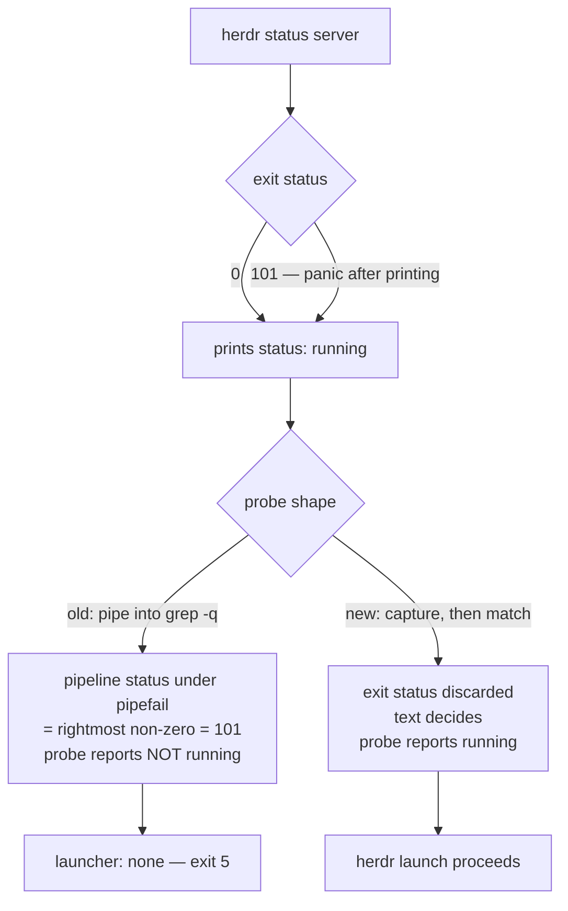

# Herdr Launcher Probe Reliability - Plan

## Goal Capsule

- **Objective:** `spinoff.sh` launches through herdr whenever the herdr server is running, and when it does not launch, its message reports only what it observed.
- **Means:** Replace the probe's pipeline with a capture-then-match test, and rewrite the exit-5 diagnostic to print the captured evidence (KTD1, KTD3).
- **Authority:** Requirements govern behavior. Key Technical Decisions govern mechanism. Units override neither.
- **Execution profile:** Single-file shell change plus a deterministic stub-driven test, closed by one bounded live-herdr run before merge.
- **Stop conditions:** Stop and report if U2 scenarios one and five — herdr prints `status: running` and exits 101, auto-detected and forced — pass against the unfixed probe. That would mean the test does not reach the defect.
- **Tail ownership:** The pull request merge publishes the plugin. The operator's `/plugin marketplace update shrimpshack` and reload are the last mile, outside this plan's verification.

---

## Product Contract

### Summary

Make the herdr liveness probe report the server's real state, and make the failure message state evidence instead of a mechanism. The probe currently reads a pipeline exit status under `pipefail`, so it reports "not running" against a running server whenever herdr exits non-zero after printing. The exit-5 text then asserts a socket-reachability cause that was never established.

### Problem Frame

`spinoff.sh` has failed intermittently for two weeks. Three debugging sessions reached three different conclusions — background agents cannot reach the socket, file redirection breaks it, the split path is broken — and each is contradicted by a run that another session observed. The runs differ only in timing, not in path.

The script's own diagnostic caused most of that lost time. On exit 5 it states the server "did not answer THIS process" and that this "happens when the script runs detached from the session that owns herdr". `herdr status server` returns `running` immediately before and after a failing run, so the message frames its own refutation as confirmation. Every session that read it went looking for a socket problem that does not exist.

The measured cause is narrower. `grep -q` exits the moment it matches and closes the pipe. herdr is a Rust binary, and Rust sets `SIGPIPE` to `SIG_IGN`, so herdr does not die on signal 141 — it receives `EPIPE`, panics with `failed printing to stdout: Broken pipe (os error 32)`, and exits 101. Under `set -o pipefail` that non-zero becomes the pipeline's status, so the probe returns false on a match that succeeded. The prior investigation predicted exit 141, which is why the signature was never recognized.

### Key Decisions

- Fix the probe, not the launch paths. Every observed failure happens at backend resolution, before any launch code runs. (session-settled: user-directed — chosen over patching the launch and backend code paths: the launch code is not on the failure path.) Governs R1, R2, R3.
- Treat the exit-5 diagnostic as equal in weight to the probe fix. (session-settled: user-directed — chosen over a probe-only fix that leaves the message alone: the wrong message cost three sessions more time than the bug.) Governs R4, R5, R6.
- Ship the fix to the installed plugin, not only to the repository. The loaded skill runs from the plugin cache, so a repository-only fix leaves every live invocation broken. Governs R9.

### Requirements

**Probe correctness**

- R1. `_herdr_probe` returns success whenever `herdr status server` reports the server running, regardless of herdr's own exit status.
- R2. `_herdr_probe` returns failure when herdr reports any state other than running. Output containing the phrase `not running` is a failure, not a success.
- R3. No launcher readiness probe in `spinoff.sh` derives its truth value from a pipeline's exit status.

**Diagnostics**

- R4. The exit-5 message states what was observed and does not assert a cause it did not establish.
- R5. The exit-5 message includes what herdr actually returned on either stream, so the reader sees the evidence rather than a theory about it.
- R6. Every description of exit 5 in `plugins/spinoff/skills/spinoff/SKILL.md` matches R4, including the exit-code table.

**Regression protection**

- R7. A test reproduces the defect deterministically, with no dependence on timing, machine load, or an installed herdr.
- R8. That test fails against the unfixed probe.
- R10. One bounded run of `spinoff.sh` against a live herdr server confirms the objective end-to-end before merge.

**Release**

- R9. The plugin version advances in both `plugins/spinoff/.claude-plugin/plugin.json` and the spinoff entry of `.claude-plugin/marketplace.json`, and the two strings match.

### Success Criteria

- One bounded live-herdr run of `spinoff.sh` resolves the herdr launcher on every attempt, against a pre-fix baseline that failed 8 of 200 and 62 of 200 probe calls on the same machine. A stub-only proof cannot distinguish "the bug is fixed" from "one contributor is fixed".
- A reader who hits exit 5 can tell from the message alone what herdr reported, without forming a theory about sockets.

### Scope Boundaries

- The launch paths — tab, split, and workspace creation — are untouched. They are not on the failure path.
- `_cmux_probe` and `_ghostty_probe` are unchanged. Neither pipes, so neither can carry this defect.
- The four `grep -q` sites at `spinoff.sh:1636`, `:1689`, `:1693`, and `:1751` are unchanged. Each reads a file argument directly with no pipeline.
- The four `grep -oE … | head -1` pipelines at `spinoff.sh:344`, `:358`, `:401`, and `:492` are unchanged. Each pipes into an early-exiting reader, which is the same pipe-closing shape, but each assigns to a variable that is then emptiness-checked. None derives a truth value from a pipeline's exit status, so none is in R3's class.

#### Deferred to Follow-Up Work

- **Orphaned worktree recovery.** A failed run leaves a worktree and branch behind, so re-running the same `--name` exits 1 until the operator removes both by hand. The remedy touches the worktree-creation path, outside this plan's scope boundary, and the existing exit-5 text already tells the operator to re-run with a new `--name`.
- **`herdr status server --json` as the probe source.** herdr exposes a `--json` flag on this machine. Structured output would remove the prose dependency. Deferred as a scope choice: the prose match is what this session's measurement covers, and re-measuring a second contract is not what this fix needs. The prose dependency KTD2 introduces is itself unmeasured across herdr versions, so this is a choice between two contracts, not between a measured path and an unknown one.
- **The 0.9.1 to 0.9.2 loudness change.** 0.9.1 failed silently at exit 0 and 0.9.2 fails at exit 5. The prior plan changed the loudness deliberately. Whether the failure rate also moved is unresolved and does not affect this fix.

### Sources

- `plugins/spinoff/skills/spinoff/scripts/spinoff.sh:142` — the probe. `:12` sets `set -uo pipefail`.
- `plugins/spinoff/skills/spinoff/scripts/spinoff.sh:232` and `:288` — the two call sites, forced-launcher and auto-detection.
- `plugins/spinoff/skills/spinoff/scripts/spinoff.sh:1812` — a code comment stating the probe "greps `status server` for 'running'", which U1 makes false.
- `plugins/spinoff/skills/spinoff/scripts/spinoff.sh:1825-1827` and `:2034-2036` — the exit-5 text.
- `plugins/spinoff/skills/spinoff/SKILL.md:70`, `:117`, and `:508` — three descriptions of exit 5. The `:117` row is the exit-code table, the most-read reference in the skill.
- `plugins/spinoff/skills/spinoff/scripts/spinoff.bats:47-53` — the herdr stub. Its `status server` arm prints `status: running` on stdout only when `HERDR_STUB_LIVE=1`, otherwise prints `status: unreachable` on stderr and exits 1. It cannot express a non-zero exit after a successful print, so the existing suite cannot reach this defect.
- `docs/plans/2026-08-12-001-fix-spinoff-silent-launch-failure-plan.md` — introduced exit 5, replacing a silent exit 0. That change was correct; only its message wording is in scope here.
- Measured this session against herdr 0.8.0 and 0.8.2: 8/200 and 62/200 probe failures with `PIPESTATUS=[101 0]`, and herdr stderr `failed printing to stdout: Broken pipe (os error 32)`. A replacement probe then ran 0/300. **That 0/300 run used a loose `*[Rr]unning*` substring match, so it is evidence for KTD1 (capture-then-match) only. KTD2's anchored match is not covered by it and is proved instead by U2's scenarios.**
- Observed on herdr 0.8.2: `herdr status server` prints `status: running` as its first stdout line and exits 0.

---

## Planning Contract

### Key Technical Decisions

- KTD1. **Capture the output, then match it.** Assign `herdr status server` output to a variable with `|| true`, then test the variable. (session-settled: user-directed — chosen over keeping the pipeline with a workaround such as `|| true` on the pipe, a per-call `set +o pipefail`, or `PIPESTATUS` inspection: capture removes the defect class rather than the instance, and measured 0/300 against 62/200.) Instantiates the first Key Decision; governs R1, R3.

- KTD2. **Match an exact `status: running` line, not a `running` substring.** A substring match would accept `status: not running`. The handoff's proposed `*[Rr]unning*` pattern carries that hole. Use shell `case` alternatives anchored to line starts so the test stays free of any pipeline. This is a deliberate tightening from today's `grep -qi 'running'`, and it fails closed — see the Assumptions entry on what that costs. Governs R2.

- KTD3. **The diagnostic reports the observation, not the mechanism.** The probe stores what herdr wrote — stdout and stderr in separate script-level variables — and the exit-5 branch prints them. Naming the `pipefail` race in the runtime message would repeat the original defect in a new costume: after this fix, a fresh exit 5 is not caused by that race, so asserting it would again claim an unestablished cause. The historical mechanism belongs in the code comment and `SKILL.md`, where it explains a past defect rather than diagnosing a present one. Governs R4, R5.

- KTD4. **Reproduce the defect with stub knobs, not with repetition.** Under `pipefail` the old probe fails whenever herdr exits non-zero after printing `running`. No broken-pipe timing is required to produce that state, so a stub that prints `status: running` and exits 101 reproduces it on every run. A repeat-N gate would only re-observe a race and would stay probabilistic. Governs R7, R8.

- KTD5. **Keep stdout as the only match input; capture stderr for the message only.** herdr reports an unreachable server on stderr, which is the state that produces exit 5, so discarding stderr would leave the evidence line empty exactly when the reader needs it. Merging the streams into the match variable would instead let a stderr diagnostic influence a liveness decision. Two variables keep both properties. Governs R5.

### High-Level Technical Design

The defect is that the old shape routes herdr's exit status into a truth value. The new shape routes only herdr's stdout text into it.

### Assumptions

These are agent inferences, not confirmed facts.

- A stopped herdr server does not print a line matching exactly `status: running`. This could not be observed: `herdr status server` ignores `HOME` and `XDG_CONFIG_HOME` overrides and found the live socket regardless, and stopping the user's running server was out of bounds. KTD2's exact-line match is chosen to be safe under any stopped-state wording, including one containing the word `running`.
- **KTD2 adds a real new dependency, and it fails closed.** Today's probe is `grep -qi 'running'` — case-insensitive, a bare substring, surviving almost any wording. KTD2 depends on the literal lowercase token, the `status: ` prefix, and its position at a line start. That exact shape was observed on herdr 0.8.2. If herdr reshapes the line, the probe silently reports the server down. Re-check this when herdr's output changes.
- No continuous integration runs these tests. The repository has no `.github/` directory, so the suites run on demand.

### Sequencing

U1 first — it owns the probe that U2 asserts against and the captured-output variables that U3 consumes. U2 and U3 are independent of each other, and both extend `spinoff.bats`. U4 follows U3 so every description of exit 5 is written against the same wording. U5 last, so the version advances once over a complete change.

---

## Implementation Units

### U1. Capture-then-match herdr probe

**Goal:** `_herdr_probe` decides from herdr's stdout alone, and preserves both streams for the diagnostic.

**Requirements:** R1, R2, R3. Implements KTD1, KTD2, KTD5.

**Dependencies:** none.

**Files:**
- `plugins/spinoff/skills/spinoff/scripts/spinoff.sh` (modify `_herdr_probe` at `:142`; add declarations near the `LOUD_*` block at `:177-183`)

**Approach:**
1. Declare `HERDR_PROBE_OUT=""` and `HERDR_PROBE_ERR=""` at script level, beside the existing `LOUD_*` declarations at `:177-183`. The script runs under `set -u`, so an exit-5 path that reads either variable before the probe assigned it would abort the diagnostic mid-print.
2. Return failure immediately when `$HERDR` is empty, before running anything.
3. Run `"$HERDR" status server` once, capturing stdout into `HERDR_PROBE_OUT` and stderr into `HERDR_PROBE_ERR`, with a trailing `|| true` so a non-zero herdr exit never reaches a conditional.
4. Decide with a `case` on `HERDR_PROBE_OUT` only, matching a `status: running` line at the start of the output or after a newline. Do not match a bare `running` substring, and do not let `HERDR_PROBE_ERR` influence the decision (KTD5).
5. Replace the existing comment with one naming the constraint the code cannot state: herdr exits 101 on a broken pipe because Rust ignores `SIGPIPE`, so this probe must never derive truth from a pipeline exit status.

**Patterns to follow:** `_cmux_probe` and `_ghostty_probe` on the adjacent lines — both test resolved variables directly and run no pipeline. The `LOUD_*` block at `:177-183` for the empty-initializer declaration style.

**Test scenarios:** covered by U2, which owns the harness for this unit.

**Verification:** Both call sites at `:232` and `:288` resolve the herdr launcher against a running server. No `_*_probe` body contains a command pipeline.

---

### U2. Deterministic probe regression gate

**Goal:** A test reproduces the defect without a race and fails against the unfixed probe.

**Requirements:** R7, R8. Implements KTD4.

**Dependencies:** U1.

**Files:**
- `plugins/spinoff/skills/spinoff/scripts/spinoff.bats` (extend the herdr stub at `:47-53`; add cases)

**Approach:**
1. Add two knobs to the stub's `status server` arm, both defaulting to today's behavior so every existing test is unaffected:
   - an exit-code knob, so the stub can exit non-zero after printing;
   - a stdout-text knob, so the stub can print arbitrary text such as `status: not running`, or nothing.
   The current arm prints `status: running` on stdout only when `HERDR_STUB_LIVE=1`, and otherwise writes `status: unreachable` to stderr and exits 1 — so without the text knob, three of the scenarios below cannot be expressed at all.
2. Add the scenarios below as cases.
3. Keep `smoke.sh` dependency-free. It disables launch automation wholesale and has no stub to extend.

**Execution note:** Run scenarios one and five against the pre-U1 probe once and see them fail before keeping them. A regression test that has never failed proves only that it runs. Scenarios two, three, and four assert existing behavior and are expected to pass both before and after.

**Test scenarios:**
1. Stub prints `status: running` and exits 101; the run resolves `LAUNCHER=herdr` and does not exit 5.
2. Stub prints `status: running` and exits 0; the run resolves `LAUNCHER=herdr`. Existing behavior; must not regress.
3. Stub prints `status: not running` and exits 0; the run does not resolve `LAUNCHER=herdr`.
4. Stub prints nothing and exits 0; the run does not resolve `LAUNCHER=herdr`.
5. Stub prints `status: running` and exits 101 while `--launcher herdr` is forced; the forced path at `:232` resolves herdr rather than falling back to auto-detection.

**Verification:** All five pass against the U1 probe. Scenarios one and five fail against the pre-U1 probe.

---

### U3. Evidence-based exit-5 diagnostic

**Goal:** The exit-5 message reports what herdr returned and stops asserting a detached-shell cause.

**Requirements:** R4, R5. Implements KTD3.

**Dependencies:** U1.

**Files:**
- `plugins/spinoff/skills/spinoff/scripts/spinoff.sh` (modify the herdr branches at `:1825-1827` and `:2034-2036`; correct the comment at `:1812`)
- `plugins/spinoff/skills/spinoff/scripts/spinoff.bats` (add the scenarios below)

**Approach:**
1. Delete the claims that the server "did not answer THIS process" and that this is what "happens when the script runs detached from the session that owns herdr". Both assert an unestablished mechanism.
2. Print what the probe captured, from both `HERDR_PROBE_OUT` and `HERDR_PROBE_ERR`. Say herdr printed nothing only when both are empty.
3. Keep `herdr status server` as the suggested next check, but frame it as a check rather than as a test that distinguishes two named causes.
4. Correct the comment at `:1812`, which states the probe "greps `status server` for 'running'". U1 makes that false and no other unit owns the line.
5. Leave the surrounding structure otherwise intact. The cause-neutral first line at `:1818`, the ghostty branch, and the generic branch are all correct as written.

**Patterns to follow:** the ghostty branch immediately below, which names only the component it found missing.

**Test scenarios:**
- Stub prints `status: not running` on stdout and exits 0; the run exits 5 and the message contains that text.
- Stub prints only to stderr and exits 1; the run exits 5 and the message contains the stderr text.
- Stub prints nothing on either stream and exits 1; the run exits 5 and the message says herdr printed nothing.
- The message on any exit-5 path contains neither `detached` nor `did not answer`.

**Verification:** Exit 5 still fires for a genuinely unusable backend, and its text contains only observations.

---

### U4. Align every SKILL.md description of exit 5

**Goal:** All three descriptions of exit 5 match the way U3 now reports it.

**Requirements:** R6.

**Dependencies:** U3.

**Files:**
- `plugins/spinoff/skills/spinoff/SKILL.md` (the exit-5 text at `:70`, the exit-code table row at `:117`, and the entry at `:508`)

**Approach:**
1. Rewrite the exit-code table row for code `5` at `:117`. It currently reads "the server did not answer this process, which means it is stopped **or** running-but-unreachable from a detached shell; `herdr status server` tells the two apart" — verbatim the claim R4 and R6 exist to remove, sitting in the most-read reference in the skill. Replace it with what the probe captured.
2. Rewrite the `:508` entry, which states the remedy is "start the server, not fix a path" as though a stopped server were the only cause.
3. Rewrite `:70`'s remedy clause — "Remedy is starting its server, or `--launcher ghostty`" — which carries the same single-cause framing as `:508`. The surrounding description of exit 5 as an announced multiplexer whose probe failed is accurate and stays.
4. Record the `pipefail` defect as history here. This is the one place where naming the mechanism helps, because it explains a fixed bug rather than diagnosing a live one.

**Test scenarios:** Test expectation: none — documentation text with no behavior.

**Verification:** No sentence in `SKILL.md` states a single cause for exit 5, and none asserts that exit 5 means the calling process could not reach a running server.

---

### U5. Version bump for plugin distribution

**Goal:** The installed plugin can pick up the fix.

**Requirements:** R9.

**Dependencies:** U1, U2, U3, U4.

**Files:**
- `plugins/spinoff/.claude-plugin/plugin.json`
- `.claude-plugin/marketplace.json`

**Approach:**
1. Set the version to `0.10.1` in `plugins/spinoff/.claude-plugin/plugin.json`.
2. Set the spinoff entry's `version` to the same string in `.claude-plugin/marketplace.json`. Edit the raw text on a unique anchor and assert a single match. Do not parse and re-serialize the file — a full re-dump rewrites other plugins' description escaping and pollutes the diff.
3. Confirm `git diff --numstat .claude-plugin/marketplace.json` touches only the spinoff entry's lines.

**Execution note:** Version-gating is the point of this unit. `/plugin update` compares only the version string, so new code under an unchanged version leaves every installed copy reporting up to date.

**Test scenarios:** Test expectation: none — packaging metadata with no behavior. The diff-scope check in step 3 is the guard.

**Verification:** Both files read `0.10.1`, `.claude-plugin/marketplace.json` still parses, and no other plugin entry changed.

---

## Verification Contract

| Gate | Command | Applies to | Signal |
|---|---|---|---|
| Probe regression suite | `bats plugins/spinoff/skills/spinoff/scripts/spinoff.bats` | U1, U2, U3 | All cases pass, including the nine new ones — five from U2, four from U3 |
| Deliberate-fail check | Run U2 scenarios one and five against the pre-U1 probe | U2 | Both fail |
| Live end-to-end run | Run `spinoff.sh` against the live herdr server 20 consecutive times | R10 | Every run resolves `LAUNCHER=herdr` and launches; record the observed failure count beside the 8/200 and 62/200 pre-fix baselines |
| Pre-launch smoke | `bash plugins/spinoff/skills/spinoff/scripts/smoke.sh` | U1, U3 | Exits 0; no regression in arg validation |
| CLI drift | `bash plugins/spinoff/skills/spinoff/scripts/cli-drift.test.sh` | U1 | Exits 0 |
| Kickoff gate | `bash plugins/spinoff/skills/spinoff/scripts/kickoff-gate.test.sh` | U1 | Exits 0 |
| Pipeline-free probes | `sed -n '/^_[a-z]*_probe()/,/^}/p' plugins/spinoff/skills/spinoff/scripts/spinoff.sh` | R3 | No probe body pipes one command into another. A `\|` separating `case` pattern alternatives does not count |
| Manifest parity | Read both version strings | U5 | Both are `0.10.1` |

There is no continuous integration in this repository. Every gate runs on demand.

The live end-to-end run is the only gate that exercises the Goal Capsule objective. Every other gate drives a stub this plan writes, so all of them can pass while `spinoff.sh` still fails to launch. Run it before merge — a failed run leaves an orphaned worktree and branch, whose cleanup this plan defers.

## Definition of Done

**Global**

- R1 through R10 are satisfied.
- The nine new scenarios pass, and U2 scenarios one and five were observed failing against the unfixed probe.
- No exit-5 message, in the script or in `SKILL.md`, asserts a cause the run did not observe.
- No exploratory or dead-end code from this work remains in the diff. Probe experiments belong outside the repository.

**Per unit**

| Unit | Done when |
|---|---|
| U1 | `_herdr_probe` runs no pipeline, matches an exact `status: running` line on stdout, and exposes both captured streams |
| U2 | Five scenarios pass post-fix; scenarios one and five failed pre-fix |
| U3 | Both exit-5 branches print captured evidence, the `:1812` comment is correct, and no detached-shell claim remains |
| U4 | All three `SKILL.md` sites — `:70`, `:117`, `:508` — match R4 |
| U5 | Both manifests read `0.10.1` and the marketplace diff is scoped to spinoff |

**Operational note — outside this plan's verification.** Merging publishes the plugin, because this repository is the marketplace. Serving the new version to a running session additionally needs `/plugin marketplace update shrimpshack` followed by a plugin update and reload. The marketplace must refresh first; a plugin update alone will not pull a marketplace that has not re-fetched.
