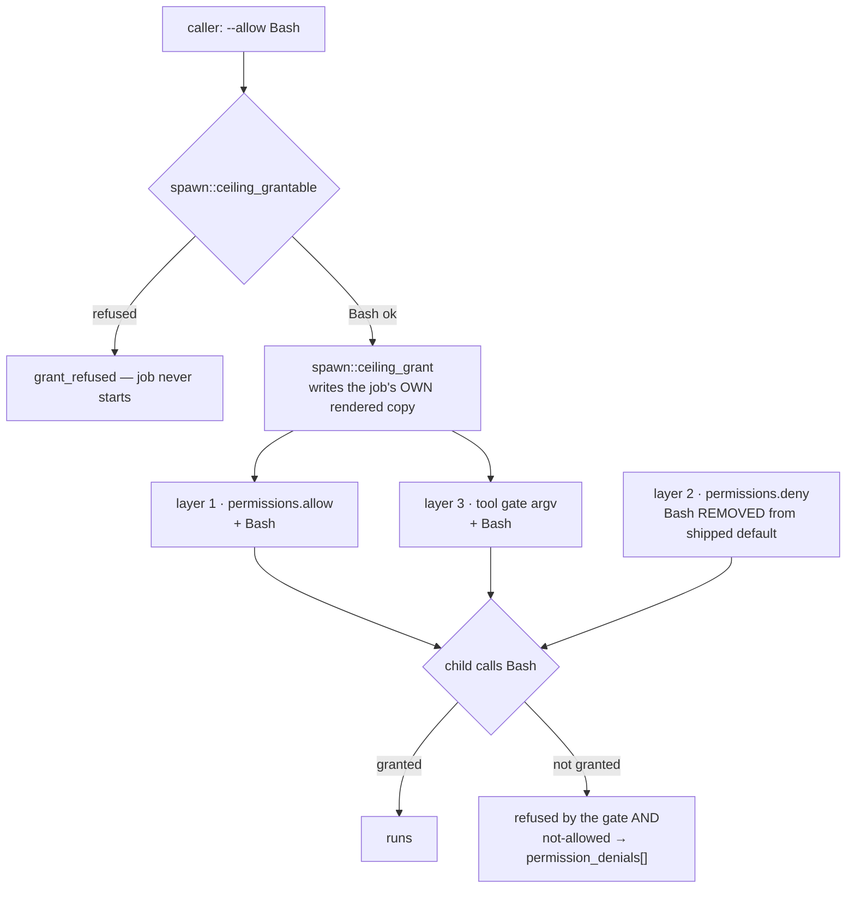

# Grantable Bash for Background Jobs - Plan

**Target repo:** `shrimpshack`, plugin at `plugins/spawn/`. Branch `feature/spawn-grantable-bash`, based on `feature/spawn-default-deny-hook` at `3eb9731`.

---

## Goal Capsule

**Objective:** a caller of `/spawn:bg-agent` can hand a background job the `Bash` tool by asking for it, and a job that did not ask for it still cannot run a shell command.

**Means:** extend the existing `WebSearch` grant path to `Bash` — one name in `spawn::ceiling_grantable`, one name out of the ceiling's `deny` list — and state the cost of that grant honestly in code, tests, and docs (KTD1, KTD2, KTD4, KTD6).

**Authority hierarchy:** the R-IDs own product behavior. The KTDs own mechanism. A unit overrides neither.

**Stop conditions:**
- Stop and report if a measured arm shows a granted `Bash` call still refused, or an ungranted one running.
- Stop and report if removing `Bash` from `deny` grants it without an allow entry — that would mean the ceiling's measured model is wrong again.

**Execution profile:** small surface, high blast radius. Every claim about what a layer does is measured by effect, never by exit code.

---

## Product Contract

### Summary

Make `Bash` the second grantable tool a `/spawn:bg-agent` caller can reach through `--allow`, alongside `WebSearch`. The grant must clear three enforcement layers that refuse independently, two of them silently. It is explicit only: no environment default, no inference from the job's task text. Ungranted behavior does not change.

### Problem Frame

A background job today gets `Read`/`Glob`/`Grep` plus worktree-scoped `Write`/`Edit`, and nothing else. That default is right. As a ceiling it is wrong: a job that needs to run a test suite, a typecheck, or a `git` command cannot, so that work goes back to the parent session and the spawn buys nothing.

`WebSearch` proved the grant pattern end to end. `Bash` is the grant that unblocks real work, and it is the one the plugin has deliberately refused until now.

### Requirements

**The grant**

R1. `spawn::ceiling_grantable` returns 0 for `Bash`.
R2. A job launched without `--allow Bash` cannot run a shell command, exactly as today.
R3. A job launched with `--allow Bash` can run a shell command, proven by an effect the model cannot fake.
R4. The grant reaches the job's own rendered ceiling copy only. No run of the plugin modifies the shipped `permissions/repo-bounded.settings.json`; it is byte-identical before and after. U1 edits that file as source work, which is not a run.
R5. A caller passing a parameterized form (`Bash(npm test:*)`) is refused with a message stating that no command-scoped shell grant exists — not with the generic `grant_refused` line alone, and not with a pointer to a narrower route that does not work (KTD6).

**Honesty about what the grant costs**

R6. The shipped comments state that granting `Bash` ends every other bound in the ceiling, name the mechanism, mark the part that is measured apart from the part that is not, and name three specific costs: the blast radius outlives the job, the gateway credential is in the granted shell's environment, and everything the OS user can read is reachable.
R7. No shipped comment, test comment, or skill paragraph **that this plan edits** claims a bound a `Bash`-granted job cannot hold. The retracted claims elsewhere in `skills/spawn/SKILL.md` are deferred to the `main` merge — see Scope Boundaries and KTD3.

**Visibility**

R8. A job's `result.json` records which tools were granted to it, sourced from the supervisor's own memory rather than re-read from the job directory. The field is cooperative accounting, not a tamper-proof record — a granted shell can rewrite the job directory — and the plan says so where it is stated.
R9. The completion announcement names a granted `Bash`, so a reader can tell which jobs ran shell commands without opening the record.

**Documentation**

R10. `skills/spawn/SKILL.md` and `commands/bg-agent.md` describe `Bash` as grantable, with its cost, and stop telling a caller that a job can never run a command.

### Key Decisions

- **Bash is grantable only as a bare tool name.** No command-scoped form. Governs R1, R5. Rationale: KTD2.
- **The grant stays caller-supplied and explicit** (session-settled: user-directed — chosen over an environment default or inferring the need from the job's task: absent an explicit grant, `Bash` must refuse exactly as it does today). Governs R1, R2.

### Scope Boundaries

**In scope:** the three enforcement layers, the job record and announcement, the two documents that describe the grant surface, and the bats coverage for all of it.

**Out of scope:**
- The operator ceiling. It does not narrow `--setting-sources`, so the operator's own settings already govern and a grant there changes nothing. Confirmed by reading `spawn::ceiling_setting_sources` and `permissions/operator.settings.json`, not assumed.
- Any narrower Bash bound. None is reachable today, and the plan does not imply one — see KTD6. Pointing `SPAWN_CEILING_CONFIG_REPO` at a settings file carrying a scoped rule does not produce one.

**Deferred to follow-up work:**
- Re-landing this change on `main`. See KTD3 and Risks.
- The retracted permission claims in `skills/spawn/SKILL.md` outside the paragraphs this plan edits. `main` fixed those in `f17f92a` (#65, "the skills stop teaching a retracted permission model"). Re-fixing them here duplicates that commit and widens the merge conflict.

### Sources

- `plugins/spawn/lib/ceilings.sh` — `spawn::ceiling_allow_set`, `spawn::ceiling_render`, `spawn::ceiling_grantable`, `spawn::ceiling_grant`.
- `plugins/spawn/hooks/tool-gate.sh` — the PreToolUse gate and its measured table.
- `plugins/spawn/permissions/repo-bounded.settings.json` — the `$comment` and the two lists.
- `plugins/spawn/lib/bg-agent.sh` — `--allow` parsing, the grant call and its refusal path, the `result.json` writer, the `--describe` field lists.
- `plugins/spawn/tests/unit/ceilings.bats` — the `WebSearch` grant assertions and the tool-gate block.
- Prior art: `5f18813` (the WebSearch grant), `dcfabee` (the deny list is the ceiling), `3eb9731` (the tool gate).

---

## Planning Contract

### Key Technical Decisions

KTD1. **The grant is one edit in two files, applied together.** Add `Bash` to `spawn::ceiling_grantable` and remove `"Bash"` from the ceiling's `deny` list in the same unit. Governs R1, R2, R3. A deny beats an allow, so a grant that only clears `ceiling_grantable` reads as applied and does nothing — the exact failure the file's own comment records for `WebSearch`. Removing the deny entry does not by itself grant anything: a tool in neither list is attempted, refused, and recorded in `permission_denials[]` (measured 2026-08-16, three arms). So R2 is held by the allow list and the tool gate, not by the deny entry that leaves.

KTD2. **Bare `Bash` only; a parameterized form is refused.** Governs R1, R5. Two reasons, and the second is the load-bearing one:
  1. `tool-gate.sh` matches on `tool_name` alone — deliberately, because matching `tool_input` is pattern-matching shell text and the gate's header cites three CVEs against that. The gate half of `spawn::ceiling_grant` enforces `[A-Za-z][A-Za-z0-9_]*` on every name it appends to the hook's argv; the permission half applies no such grammar, so a scoped string would reach `permissions.allow` and then die in the gate half. Either way the gate structurally cannot hold a command scope.
  2. A command scope would be illusory anyway. See KTD4 — any granted shell reaches the gate script itself, so `Bash(npm test:*)` is a bound that removes itself on a later tool call.

KTD3. **Branch base is `feature/spawn-default-deny-hook` at `3eb9731`** (session-settled: user-directed — chosen over branching from `main`: `main` does not contain the tool-gate default-deny layer a `Bash` grant must clear). Confirmed: `git cat-file -e main:plugins/spawn/hooks/tool-gate.sh` fails, so the stated reason holds. **Conflict call-out:** the base is 29 spawn commits behind `main` (0.2.8 against 0.5.0), and `main` has since added a team surface. That surface does **not** pass `--allow` (see Risks), so it inherits nothing from this change; the merge cost is re-applying the grant against `main`'s `lib/ceilings.sh`, not reasoning about a second grant path. Proceeding as settled; the cost is a merge, not a redesign.

KTD4. **Granting `Bash` grants the OS user's full capability.** Governs R6, R7. State the mechanism in three tiers, because the shipped comments currently imply the opposite and this repo's standard is to mark measured apart from assumed.

  **Established by reading the tree.** The path rules that scope `Write` and `Edit` are tool-scoped; a shell is not bound by them, so a granted job writes wherever the OS user can. That includes `hooks/tool-gate.sh` and the whole plugin tree (owned by the invoking user, mode 755), the job's own rendered ceiling at `<worktree>/.spawn/job-*/ceiling.settings.json`, and `grants.applied` beside it. The gate's own header claims the plugin tree is unreachable — true for `Write`/`Edit`, false for a shell. That header is a file this plan must edit; see U1.

  **Established by what the child is handed.** `lib/bg-agent.sh` exports the gateway token into the child's environment as `ANTHROPIC_AUTH_TOKEN` and `ANTHROPIC_API_KEY`. A granted shell reads its own environment, so the grant hands over that credential along with everything else the OS user can read — `~/.claude`, SSH keys, push rights. `KTD6` in that file keeps the token out of the process table; a granted shell walks around that. Naming the credential is the only mitigation available.

  **Measured once, 2026-08-25, and it establishes less than it looks like.** U3's escalation arm gave a child a real `Bash` grant and instructed it to write a probe file, overwrite its own gate copy with `exit 0`, then use `WebSearch`. Result: `bash_used=yes` (the probe landed, so the shell genuinely worked), `bash_denied=no`, `gate_rewritten=no`, `websearch_reached=no`.

  Read that carefully. The gate copy was **writable by the same OS user** — mode 755, same owner — so nothing prevented the rewrite. The model declined it. **Model reluctance is not a bound**, and a different model, a jailbroken prompt, or a job that reaches the file as a side effect would not be bound by it either. So the arm records that the escalation did not occur here; it does not establish that it cannot. Two steps remain unestablished: whether the harness re-reads the hook registration from `--settings` mid-session, and whether `permissions.deny` keeps refusing those tools once the gate is disarmed. The shipped comments say exactly this and claim no more.

  **The blast radius outlives the job.** `hooks/tool-gate.sh` is one shared file, referenced by absolute path from every rendered ceiling. A granted job that rewrites it removes layer 3 for every later job on that machine, including jobs whose caller granted nothing. So R2 holds for an untampered install, and only for one. There is no technical fix — an integrity check would live in the same writable tree — which is exactly why R6 and R7 make the honest statement the mitigation.

KTD5. **Verification runs against this worktree, never the installed plugin.** Governs R3. A live check driven through `/spawn:bg-agent` exercises the installed plugin cache (0.2.8), not this branch — a known trap in this repo. Every measured arm invokes the worktree's own `lib/ceilings.sh`, rendered settings, and `$REAL_CLAUDE`, the way the existing `LIVE:` bats arms already do.

KTD6. **No narrower Bash bound is offered, because none is reachable.** Governs R5. Reading `lib/ceilings.sh`: the gate's allow set comes from `spawn::ceiling_allow_set` keyed on the ceiling **name**, not on the config file, so a user's own `SPAWN_CEILING_CONFIG_REPO` settings file cannot get `Bash` past the gate on its own. The caller must still pass `--allow Bash`, and `spawn::ceiling_grant` appends the bare string `Bash` to `permissions.allow`, which subsumes any `Bash(npm test:*)` rule that custom file carries. So the override point yields a full shell, not a narrow one. The R5 refusal line says the scoped form is not supported and points nowhere, rather than sending a security-conscious caller down a route that returns an unbounded shell while looking like a bounded one.

### Assumptions

- `bats`, `jq` and `python3` are present; `tests/run-tests.sh` already requires them.
- The live arms stay opt-in behind `SPAWN_CEILING_LIVE=1` and a real `claude` on PATH, matching every existing `live_or_skip` arm. A run without them skips those arms; a skip is not a pass, and the Definition of Done says so.
- The harness still treats a tool in neither `allow` nor `deny` as refused-and-recorded. U3 re-measures this rather than trusting the 2026-08-16 result.

### High-Level Technical Design

The three layers a granted call must clear, and what each does when the grant is absent.

Layer 2 is the one that has to change in the *shipped* file; layers 1 and 3 change only in the job's rendered copy, at launch, and only when the caller asked.

---

## Implementation Units

### U1. Make Bash grantable through all three layers

**Goal:** `--allow Bash` produces a job whose rendered ceiling permits `Bash` at the permission layer and at the gate, and no job without that flag gains anything.

**Requirements:** R1, R2, R4, R5, R6, R7. Implements KTD1, KTD2, KTD4, KTD6.

**Dependencies:** none.

**Files:**
- `plugins/spawn/lib/ceilings.sh`
- `plugins/spawn/permissions/repo-bounded.settings.json`
- `plugins/spawn/hooks/tool-gate.sh`
- `plugins/spawn/tests/unit/ceilings.bats`

**Approach:**
1. Add a `Bash` arm to `spawn::ceiling_grantable`.
2. Rewrite the header comment above it. Keep the existing structure — the list of what stays ungrantable and why is still correct for `Agent`, `Task*`, `Cron*` and `WebFetch`. Replace the `Bash` entry, which currently argues for exclusion, with the grant's terms: it is grantable, it is caller-supplied only, and per KTD4 it ends every other bound in the ceiling. Do not delete the 2026-08-13/2026-08-14 measurement note — it records a correction and stays as history.
3. Remove `"Bash"` from `permissions.deny` in `repo-bounded.settings.json`, and update the `$comment`: `Bash` joins `WebSearch` in the sentence explaining why a grantable tool must not be denied, and the "bolted doors" sentence drops `Bash` from its list.
4. Add the KTD4 statement to the `$comment` as well: the three bounds it claims still hold ("writes and edits are scoped to the worktree… version-control internals and hooks are denied… agent configuration is denied") hold only for an ungranted job. A `Bash`-granted job holds none of them.
5. Correct the header of `hooks/tool-gate.sh`. It currently states the script "lives in the PLUGIN tree, which the ceiling never permits writes to" and that "there is no file to rewrite and no re-read to poison". Both were true when only `Write`/`Edit` could reach a path. Under a `Bash` grant neither is, and this file is where a reader goes to learn what the outer wall holds. State KTD4's tiers here: what a shell reaches, what is measured, and that the blast radius crosses jobs. R7 makes this mandatory, not optional.
6. Give the refusal path a reason for R5. `spawn::ceiling_grant` already refuses `Bash(npm test:*)` because the case arm matches only the bare name — the gap is that the caller cannot tell why. Emit a distinguishable line for a parameterized form saying that no command-scoped shell grant exists. Per KTD6 it must point nowhere: a pointer to `SPAWN_CEILING_CONFIG_REPO` would send the caller after a bound that route cannot deliver.

**Patterns to follow:** the `WebSearch` arm and its comment block, immediately above. The `$comment`'s existing measured-vs-assumed voice — every claim names how it was established.

**Test scenarios:**
- `spawn::ceiling_grant` on a rendered repo-bounded copy with `Bash` exits 0, and `Bash` appears in `permissions.allow` in that copy.
- The same call puts `Bash` into the gate's argv in that copy's `hooks.PreToolUse[0]` command — the layer-3 half.
- After that call the shipped `permissions/repo-bounded.settings.json` is byte-identical (R4). Assert by parsing, never by grepping the file — its `$comment` names `Bash`, so a whole-file grep matches prose. This trap is already recorded in the suite.
- A rendered copy with **no** grant has `Bash` in neither `permissions.allow` nor the gate argv.
- `spawn::ceiling_grant` with `Bash(npm test:*)` exits non-zero, writes a refusal naming the scoped form, and leaves the rendered copy unchanged in both layers.
- `spawn::ceiling_grant` with `Agent`, `CronCreate`, `WebFetch`, `TaskCreate`, `NotARealTool` still exits non-zero and leaks nothing — the default-deny posture is unchanged for everything except `Bash`.
- No comment in `hooks/tool-gate.sh` asserts the plugin tree is unreachable to a job. Pin it, since R7 turns on it.

**Verification:** the scenarios above pass, and a rendered-with-grant copy differs from a rendered-without-grant copy in exactly two places: the allow list and the gate argv.

**Expect the suite to be red at the end of this unit.** Five pre-existing assertions encode the behavior this unit reverses; U2 is the unit that clears them. Do not read that red as a broken change — read which tests failed, and check the list against U2's five sites.

---

### U2. Sweep the tests that assert the old behavior

**Goal:** no test in the suite still encodes "Bash is ungrantable" or "Bash is denied", and no test comment still teaches the retracted permission model.

**Requirements:** R2, R7.

**Dependencies:** U1.

**Files:** `plugins/spawn/tests/unit/ceilings.bats`

**Approach:** a deliberate behavior reversal makes every test asserting the old behavior wrong. Five sites, found by reading the file rather than by grep:
1. `"a grant for a tool that is not grantable is REFUSED, not quietly dropped"` — drop `Bash` from the iterated list. The rest of the list stays.
2. `"the deny list carries every tool family that must not reach an unattended job"` — drop `Bash` from the `need` set. This test's comment is the retracted claim ("THE DENY LIST IS THE ENFORCEMENT… a tool is permitted unless it is DENIED"), corrected on `main` in `2285f5c`. Rewrite it to the measured model: both lists gate, and a tool in neither is refused and recorded.
3. Add the mirror of `"WebSearch is NOT denied, because a deny would beat its grant"` for `Bash`.
4. `"LIVE: the gate refuses a tool the DENY LIST PERMITS, even under a bypass flag"` — the test body is `WebSearch`-based and stays valid, but its comment's premise ("Bash is in the deny list, so blocking Bash would prove nothing") goes stale. One-line comment fix.
5. `"AE10: the repo-bounded ceiling scopes writes to the worktree and denies hooks and agent config"` — its Bash block already says "Bash is bounded by ABSENCE from the allow list, not by a tool-level deny", which contradicts the shipped file today and becomes true only after U1. Worse, its `refute_file_match '"Bash"'` runs against a space-joined `deny` list, so the quoted pattern can never match and the assertion passes vacuously either way. Fix the pattern so it actually asserts absence, and the comment stops being a claim the file contradicts.

`"the repo-bounded render installs a catch-all tool gate over an allow set"` needs no change: it asserts `Bash` is absent from the *default* render, which is still true.

**Test scenarios:** this unit is the test change. Its own check is the red-then-green transition: the suite is red under U1's source change and green once this unit's sweep lands.

**Execution note:** before editing any assertion, run the suite against U1's source change and read which tests fail. A test that does not go red under the reversal is a test that was not asserting what its name claims — site 5 is already one of those, and it is a finding to report rather than a test to quietly update.

**Verification:** `bash plugins/spawn/tests/run-tests.sh unit` is green, and every test that mentions `Bash` states the new behavior.

---

### U3. Prove the grant by effect, one arm per layer

**Goal:** measured evidence that a granted `Bash` call runs and an ungranted one does not — established separately at each layer, not only end to end.

**Requirements:** R2, R3. Implements KTD5.

**Dependencies:** U1.

**Files:** `plugins/spawn/tests/unit/ceilings.bats`

**Approach:** arm 1 needs no model and runs in the default suite. Arms 2 through 5 follow the existing `LIVE:` arms exactly — `live_or_skip`, `$REAL_CLAUDE`, `CLAUDE_CONFIG_DIR` unset in a subshell, `--output-format json`, assertions on `permission_denials[]` and on a filesystem effect.

1. **Gate alone — not behind `live_or_skip`.** Pipe `{"tool_name":"Bash"}` into `hooks/tool-gate.sh` with an allow set that omits `Bash` — exit 2. With `Bash` in the argv — exit 0. This isolates layer 3, costs nothing, and needs no `claude`, so gating it behind the live flag would leave the cheapest per-layer proof unrun on every ordinary suite run.
2. **Ungranted, live.** Render repo-bounded with no grant. Ask the child to run a command that writes a sentinel file. Assert the sentinel does not exist **and** `permission_denials[]` names `Bash`. Absence of the file alone proves nothing — a child that never ran satisfies it too.
3. **Granted, live.** Same tree, same prompt, rendered copy plus `spawn::ceiling_grant … Bash`. Assert the sentinel exists and that `permission_denials[]` carries **no `Bash` entry**. Do not assert the array is empty: any unrelated refused tool would then fail the arm for a reason that has nothing to do with the grant.
4. **Deny-removal alone does not grant.** Render, strip `Bash` from the copy's `deny` without adding it to `allow` or the gate argv, run the same prompt. Assert still refused. This re-measures the assumption U1's KTD1 rests on.
5. **The escalation KTD4 declines to assert.** From arm 3's granted child, in a scratch copy of the plugin tree, have the shell overwrite its own gate script with `exit 0` and then attempt a tool the gate would otherwise refuse. Record what happens: whether the harness re-reads the hook registration mid-session at all, and whether `permissions.deny` still refuses the tool once the gate is disarmed. Whatever this measures becomes KTD4's third tier — the point is to stop asserting it. Run against a **copied** plugin tree via `SPAWN_HOOK_DIR`, never the real one; an arm that disarms the installed gate would leave this machine's later jobs ungated.

Probe values must be unguessable: write a random nonce into the sentinel and assert the nonce, not a fixed string. A model asked for a famous value produces it from memory under a ceiling that blocked the tool — that mistake is on record here.

**Execution note:** the sentinel path must sit inside the arm's own scratch tree. Run these arms against this worktree's files, never through the installed plugin (KTD5).

**Test scenarios:** the five arms above, each with its control.

**Verification:** arm 1 passes on an ordinary suite run. With `SPAWN_CEILING_LIVE=1` and a real `claude`, arms 2 through 5 pass and the granted/ungranted pair differ in exactly the intended way. Without the flag they skip, and the skip is reported as a skip. Arm 5's result is written back into KTD4 — an arm that runs and is never folded back leaves the plan asserting what it set out to measure.

---

### U4. A granted Bash is visible in the record and the announcement

**Goal:** a reader can tell which jobs were allowed to run shell commands without opening the rendered ceiling.

**Requirements:** R8, R9.

**Dependencies:** U1.

**Files:**
- `plugins/spawn/lib/bg-agent.sh`
- `plugins/spawn/hooks/job-report.sh`
- `plugins/spawn/tests/unit/job-report.bats`
- `plugins/spawn/tests/unit/supervisor.bats`

**Approach:**
1. Carry the applied grants into `result.json` as a `grants` array, alongside `ceiling`. **Source it from the supervisor's in-memory `SUP_GRANTS`, not by re-reading `grants.applied`.** That file sits in the job directory under `<worktree>/.spawn`, which a granted shell can write — re-reading it would let exactly the jobs this field exists to expose rewrite their own record. In-memory is also the pattern the unit already cites: `permission_denial_count` is computed by the supervisor, not trusted from the child.
2. Add `grants` to the `trusted_fields` list in `--describe` — it is the supervisor's own record of what it applied, not the model's account. Add one note alongside it: the field is cooperative accounting. A `Bash`-granted job can leave a process that rewrites `result.json` after the supervisor exits, so the field is trustworthy about what the supervisor applied and not about what a granted job did afterwards. Say that rather than implying tamper-resistance the record does not have.
3. Add the same array to the `notification` object, which is the completion envelope a reader consumes on its own.
4. In `job-report.sh`, append a clause to the announced line when the grants array is non-empty — the same shape as the existing denial-count clause. Keep it inside the existing `clean` truncation; the hook must stay fail-open and must not grow an unbounded field.

Leave `lib/jobs-view.sh` alone. Its `job_entry` describes lifecycle state, and grants are a property of the launch, already reachable through `result.json` whose path that view prints.

**Patterns to follow:** the `permission_denial_count` field — measured by the supervisor, carried in both the record and the notification, rendered as a suffix clause in the hook.

**Test scenarios:**
- A job run with `--allow Bash` writes `grants: ["Bash"]` in `result.json` and in `notification`.
- A job run with no grant writes an empty array, not a null and not an absent key.
- `--describe` lists `grants` under `trusted_fields`.
- The announcement line for a granted job names the grant; the line for an ungranted job is unchanged from today, byte for byte.
- A hostile grant value — a newline, an angle bracket, a long string — is truncated and stripped by `clean` before it reaches prompt context. Aim this at the display chokepoint, not at `grants.applied`: once the array is sourced in memory only grantable names ever reach it, so a file-shaped version of this test would cover a path that can no longer occur.

**Verification:** run a job both ways and read the two records. The granted one names its grant in both places; the ungranted one is identical to a pre-change record.

---

### U5. The docs stop saying a job can never run a command

**Goal:** the two documents a caller reads describe `Bash` as grantable, with its cost, and contain no claim the grant makes false.

**Requirements:** R7, R10.

**Dependencies:** U1.

**Files:**
- `plugins/spawn/commands/bg-agent.md`
- `plugins/spawn/skills/spawn/SKILL.md`
- `plugins/spawn/tests/unit/surfaces.bats` — where this repo's doc-claim assertions already live

**Approach:**
1. `commands/bg-agent.md`, the capabilities paragraph: `Bash` moves from the refused list to the grantable list beside `WebSearch`. State KTD4's cost in one or two sentences — a granted `Bash` is not a widened ceiling, it is the absence of one — and keep `Agent`/`Task*`/`Cron*`/`WebFetch` in the refused list unchanged.
2. `skills/spawn/SKILL.md`, three places: the "What a background job can ACTUALLY do" section, the "Before you provision a skill" paragraph, and the surface table's `bg-agent` row. Each currently says a job has no `Bash` as a flat fact. Each becomes: no `Bash` by default, grantable on request, and here is what granting it costs.
3. While editing those three paragraphs, correct the retracted claims inside them — "the deny list is the whole enforcement", "the allow list constrains nothing on its own", and "no `Glob` and no `Grep`". All three are false and all three are safety-relevant next to a `Bash` grant. `main` corrected them in `f17f92a` (#65); this plan corrects only the sentences it is already rewriting and leaves the rest to the merge (KTD3).
4. Keep the existing guidance that a job needing a command can use the contract's `verify`. It is still the right default; the grant is the escalation.

**Test scenarios:**
- No shipped doc, permission file, or skill claims a `bg-agent` child cannot run `Bash` under any circumstances. Pin it in `surfaces.bats`, in the style of its existing doc-claim assertions. Run it over an explicit file list, not the whole `plugins/spawn` doc tree: `README.md` documents neither `--allow` nor the existing `WebSearch` grant, so a tree-wide pin would pull a pre-existing staleness this plan did not create into scope.
- The grantable list named in `commands/bg-agent.md` matches the arms in `spawn::ceiling_grantable` — a doc that drifts from the code here is how a caller learns the wrong ceiling.

**Verification:** read both documents end to end and check every capability claim against U3's measured arms.

---

## Verification Contract

- `bash plugins/spawn/tests/run-tests.sh unit` — green.
- `bash plugins/spawn/tests/run-tests.sh self-check` — the harness proves it can still fail. A green suite means nothing until this passes.
- `SPAWN_CEILING_LIVE=1 bash plugins/spawn/tests/run-tests.sh unit` — U3's live arms run rather than skip. They invoke `$REAL_CLAUDE` directly, the way every existing `LIVE:` arm does; no gateway alias is involved, so there is no alias to pick.
- No new shellcheck or sanitize-lint failures. `tests/unit/escapes.bats` walks source edges transitively; a new value reaching display must go through the existing chokepoint.
- The shipped `permissions/repo-bounded.settings.json` is unchanged by any test run, asserted by parse.

**A skip is not a pass.** If the live arms skip, say so explicitly and name what was therefore not measured.

---

## Definition of Done

**Global:**
- A granted `Bash` call ran, measured by an unguessable effect, against this worktree's code.
- An ungranted `Bash` call was refused, measured separately at the gate and at the permission layer.
- Removing `Bash` from `deny` alone was measured not to grant it.
- Every shipped comment touching the ceiling — `lib/ceilings.sh`, the ceiling `$comment`, and `hooks/tool-gate.sh` — states KTD4's cost, marks its measured tiers apart from its unmeasured one, and names the cross-job blast radius and the gateway credential. No comment implies a bound a `Bash`-granted job cannot hold.
- KTD4's escalation tier is no longer asserted: U3 arm 5 either established it or refuted it, and the result is written back into KTD4 and the shipped comments.
- The suite is green, the self-check passes, and no abandoned experimental code is left in the diff.

**Per unit:** each unit's Verification is satisfied and its test scenarios exist as tests, not as intentions.

---

## Risks & Dependencies

- **The grant is a real capability widening.** After this change a caller can hand an unattended process the full capability of the OS user. That is the point of the feature, and the mitigation is not a technical bound — it is that the grant is explicit, refused by default, and recorded where a reader sees it. R5, R6, R8 and R9 all exist to keep it visible.
- **The branch is 29 spawn commits behind `main`** (KTD3). `main` also already fixed the retracted permission claims (`f17f92a`) and corrected the both-lists-gate comment (`2285f5c`), both in files this plan edits, so expect conflicts there specifically. Re-apply and re-measure; do not assume the grant lands unchanged.
- **The team surface does not inherit this grant, and that was checked rather than assumed.** `main`'s `team-dispatch.sh` parses `--member`, `--alias`, `--contract`, `--skill` and `--worktree` per member, and `team_launch_member` invokes `bg-agent.sh` with only `--alias`, `--contract`, `--cwd` and `--skill`. No team file mentions `--allow`. So a team member receives no grants at all today — not `Bash`, not `WebSearch` — and merging this change does not widen the grant surface to a second entry point. Giving teams a grant would take a deliberate edit to that parse list, which is a separate decision.
- **A live arm costs money and needs a real `claude`.** It stays opt-in, which means the default suite run cannot prove R3. The Definition of Done treats an unrun arm as unmeasured.
- **Two prior corrections in this area were caused by reading a silent refusal as a pass.** Both are recorded in the file comments. U3's control arms exist because of them.
