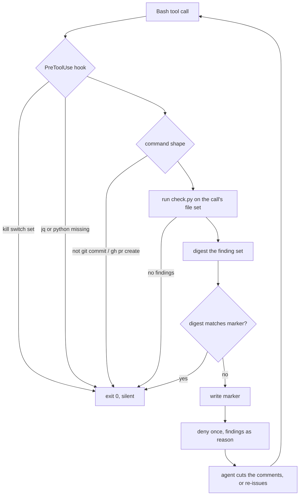

# Comment-cut Plugin Scaffolding - Plan

## Goal Capsule

- **Objective:** `comment-cut` is reachable, proven, and documented to the same standard as `reflect` and `spawn`, and its detector runs at the moments where comment bloat would otherwise ship.
- **Means:** Add a slash command, a deny-once pre-commit / pre-PR hook, a test suite, and a README around the existing skill (KTD1, KTD2, KTD4).
- **Authority hierarchy:** The skill's keep/cut bar is settled and out of scope. Requirements win on behavior; KTDs win on mechanism.
- **Stop conditions:** Stop and ask if the hook's deny path cannot be made fail-open.
- **Execution profile:** Small plugin repo. No CI. Tests run locally by shell.
- **Tail ownership:** The publish in U7 is an outward push to every shrimpshack marketplace user. It runs only on explicit go.

---

## Product Contract

### Summary

Add the four missing plugin surfaces to `comment-cut`: a `/comment-cut:cut` slash command, a `PreToolUse` hook that denies a `git commit` or `gh pr create` once when the detector finds comment bloat, a test suite over `check.py` and the hook, and a README. Fix two plugin-root path references in `SKILL.md` that break the detector when the skill runs in a target repo. Then publish 0.4.0 and repoint the global `~/.claude/tools/comment-bloat` path at the marketplace clone so it stops drifting.

### Problem Frame

`comment-cut` ships a manifest, one skill, and a python checker. Every mature plugin in this repo also ships a command, tests, and a README. The consequences are concrete:

- The skill is reachable only when the model chooses to invoke it. There is no command surface.
- `check.py --self-test` exists and passes 21 of 21, but nothing runs it as part of a suite, and the two `.ts` fixture files next to it are a hand-mirrored copy of the inline lists with no consumer. A copy with no check on it drifts.
- `SKILL.md` calls the detector as `tools/comment-cut/run.sh`, a bare relative path. The skill runs in a target repo, where that path does not exist. Phase 3's mechanical sweep and the self-test instruction are both broken as written.
- The detector runs only when someone remembers it. Comment bloat is easiest to catch at the commit and the PR.
- `~/.claude/tools/comment-bloat/`, cited as a stable path in the user's global CLAUDE.md, is a drifted fork running older code. It lacks the ticket-label detection the plugin gained on 2026-08-20.

### Key Decisions

- **Deny once at the commit and the PR, rather than advise.** (session-settled: user-directed — chosen over advisory context injection: an advisory line is skippable, and the detector's whole value is at the moment bloat would land.) Governs R4, R5, R6.
- **Replace the global copy with a symlink into the marketplace clone.** (session-settled: user-directed — chosen over copying current files over: a copy re-drifts, which is how the current fork happened.) Governs R11, R12.
- **This work ends in a publish.** (session-settled: user-directed — chosen over stopping at a green suite: the surfaces have no value until they are installed, and the symlink target depends on the publish landing.) Governs R13, R14.
- **The work starts on a fresh branch cut from `origin/main`.** (session-settled: user-directed — chosen over rebasing the current branch: comment-cut's content is already identical on main, and rebasing would replay three already-landed commits and drag one unrelated spawn commit across a heavily diverged `plugins/spawn`.) Governs R16.
- **The skill's keep/cut bar is not in scope.** Two rounds of hardening settled it. Path fixes and description guards are scaffolding, not the bar. Governs R3.

### Requirements

**Command surface**

- R1. A slash command invokes the comment-cut pass and passes its arguments through to the skill.
- R2. No command filename matches any skill directory name in this plugin.
- R3. `SKILL.md` resolves the detector through the plugin root, so the call works from any target repo.

**Commit and PR gate**

- R4. A hook runs the detector before a `git commit` or a `gh pr create` issued inside a Claude session, over the file set that call is about to land.
- R5. When the detector reports findings, the hook denies the tool call once and returns the findings as the reason.
- R6. A re-issued call carrying the same findings is allowed through. The gate never blocks the same content twice.
- R7. The hook fails open. A missing `jq`, a missing python, a non-git directory, an unparseable payload, a failed marker write, or any internal error produces silence and exit 0.
- R8. An operator can disable the gate without editing the plugin.
- R17. The gate is off in a repo until that repo opts in. A repo with no enabling marker produces silence and exit 0.
- R18. The gate considers only findings on lines the change adds or modifies. A pre-existing comment the change never touched does not deny.
- R19. The detector gains a machine-readable mode that exits non-zero on findings. Its default invocation keeps exit 0 on every scan.

**Proof**

- R9. A test suite runs the detector's both-directions self-test, the fixture files end to end, the fixture-to-inline-list parity check, the porcelain-versus-default exit contract, the hook's deny path, the hook's allow-on-retry path, the hook's opt-in and fail-open paths, and the command-to-skill name-collision check.
- R10. No test reads a file above `plugins/comment-cut/`.

**Distribution**

- R11. `~/.claude/tools/comment-bloat/check.py` and `run.sh` are symlinks into the marketplace clone's unversioned plugin path.
- R12. The global CLAUDE.md path string is unchanged, so no instruction file needs editing.
- R13. `plugin.json` and the root `marketplace.json` entry both read `0.4.0`.
- R14. The `marketplace.json` edit changes only comment-cut's own lines.

**Documentation**

- R15. A README states what the plugin does, how to reach each surface, what the gate does, how a repo opts in and how to turn it off, and how to run the tests.

**Base**

- R16. The work lands on a branch whose merge-base is `origin/main`, and `feature/comment-cut-plugin` keeps its unlanded spawn commit.

### Success Criteria

- A cold reader installs the plugin, reads the README, and reaches every surface without opening `SKILL.md`.
- A deliberate mutation of any detector rule turns the suite red.
- The gate has denied a real bloated commit once and allowed the retry.

### Scope Boundaries

**In scope:** commands, hook, tests, README, the two plugin-root path fixes in `SKILL.md`, the `--porcelain` mode added to `check.py`, the version bump, the publish, the global symlink.

**Deferred to follow-up work:**

- A second `/comment-cut:check` command for a scan without the full pass. The hook and `run.sh` cover the need today.
- Splitting `SKILL.md` into `docs/`. At 286 lines it is within range for this repo, and a split adds a hop for no gain.
- Cleaning up the `FIXTURES = FIXTURES + [...]` double-append in `check.py`. Cosmetic, and touching the lists while writing tests over them invites a green mutation.
- Registering the detector with `lint-router`. `lint-router` dispatches only eslint today.

**Outside this plugin's identity:** the keep/cut bar itself, and any change that converts the detector from advisory to authoritative. The detector reports mechanically-detectable classes only. A clean run is not evidence the bar was met, and the README must say so. The `--porcelain` mode is not such a change: it is a second read-out of the same scan for a machine caller, and R19 pins the default path at exit 0 so the advisory contract survives.

### Outstanding Questions

- **Deferred:** whether the gate should also fire on `git push`. Left out because a push carries commits the gate already saw.

### Sources

- `docs/solutions/architecture-patterns/command-and-skill-sharing-a-name.md` — a command and a skill sharing a name means the skill never loads. Owns R2.
- `plugins/reflect/.claude/hooks/hooks.json` — the `gh pr create|merge` Bash-matcher precedent, and the `jq` stdin-parsing shape. `$TOOL_INPUT` does not interpolate for `command` hooks.
- `plugins/auto/.claude/hooks/hooks.json` — `PreToolUse` on `Bash|Write` with a fail-closed escalation. The closest existing shape to U4, and the counter-example for posture.
- `plugins/reflect/tests/harness.sh` — the plain-bash harness convention, including its isolation discipline.
- Memory `reference_pretooluse_delivers_additionalcontext` — a `PreToolUse` command hook reaches the agent, proven on Claude Code 2.1.235.
- Memory `feedback_a_test_that_reads_repo_root_cannot_pass_outside_the_repo` — owns R10.
- Memory `project_shrimpshack_marketplace_publish_workflow` — owns the U7 procedure.

---

## Planning Contract

### Key Technical Decisions

KTD1. Name the command `cut`, not `comment-cut`. A command and a skill sharing a name resolve to the command, and the skill becomes unreachable with no error. `commands/cut.md` gives `/comment-cut:cut` against the skill's `comment-cut:comment-cut`. Governs R1, R2.

KTD2. The hook is `PreToolUse` with matcher `Bash`. It reads the hook payload from stdin, extracts `.tool_input.command` with `jq`, and returns early unless the command matches a `git commit` or `gh pr create` shape. Denial is the full envelope — `hookSpecificOutput` carrying `hookEventName: "PreToolUse"`, `permissionDecision: "deny"`, and the findings in `permissionDecisionReason`. `plugins/auto/lib/on-pretooluse-action.py:549` is the working precedent. (session-settled: user-directed — chosen over `additionalContext` injection with no decision: an advisory line does not stop the commit.) Governs R4, R5.

KTD3. Deny-once is keyed on a digest of the finding set, not on a session flag. The hook writes the digest to a marker file under the directory `git rev-parse --git-dir` reports, which is per-worktree and correct when `.git` is a file rather than a directory. A call whose digest matches the marker is allowed through. A call whose digest differs is a new finding set and is denied once. A marker write that fails allows the call through rather than denying, so a non-writable git dir can never wedge a retry. This makes "once" mean once per distinct problem, and it cannot loop: an unchanged retry always matches. The marker holds only the last digest, so a much later commit that reproduces an identical finding set passes silently. That is the deliberate trade for a gate that can never wedge a commit. Governs R6, R7.

KTD9. The detector gains a `--porcelain` mode that prints one finding per line and exits 1 when the count is non-zero. The gate branches on that exit code. `check.py` ends `return 0  # advisory: never blocks a commit`, so the default exit status carries no signal, and greping the human-readable summary line would make the gate depend on prose that was never a contract. The default invocation keeps exit 0 and a test pins it, so the advisory contract is not changed by the back door. (session-settled: user-directed — chosen over parsing the `comment-bloat: N finding(s)` stdout line: a wording change would silently disable the gate.) Governs R19.

KTD10. The gate is opt-in per repository, keyed on a marker file in the repo. `lint-router` already solved this the other way round — it routes by repo and is a silent no-op elsewhere — precisely so a personal ruleset is never imposed on team code. A `PreToolUse` matcher on `Bash` carries no repo scoping of its own, so without this the published hook would deny commits in every repo the user works in. (session-settled: user-directed — chosen over opt-out-by-default and over reusing lint-router's `routes.json`: opt-out denies in team repos until noticed, and the routes.json route couples two plugins for no gain today.) Governs R17.

KTD11. The gate intersects the detector's reported line numbers with the added-line numbers from `git diff -U0` before deciding. `check.py`'s `scan()` walks every line of a file and has no notion of which lines the diff introduced, so an unfiltered run denies on comments the author never touched — and the agent's natural response, cutting what the deny reason names, produces unreviewed edits outside the change. Governs R18.

KTD4. Tests are plain-bash files under `plugins/comment-cut/tests/`, driven by a `harness.sh` in reflect's shape. The checker is python and reflect's suite is python, but the hook is bash reading JSON on stdin, and driving that from python adds a layer for no gain. One harness covers both. `spawn`'s bats suite was rejected because bats is an external dependency this plugin does not otherwise need. Governs R9.

KTD5. The fixture `.ts` files stay, and a parity test binds them to the inline lists. Deleting them loses the only coverage of the file-walking path, which the tempfile-based self-test does not exercise. Keeping them unchecked is what let them drift. The parity test asserts each inline case appears in the matching fixture file and each fixture line appears inline. Governs R9.

KTD6. The kill switch is an environment variable read by the hook script, which turns the gate off for a whole session in every repo at once. It is distinct from KTD10's per-repo opt-in: the marker decides whether a repo is gated at all, and the env var suspends the gate everywhere without editing any repo. Governs R8.

KTD7. Resolve the detector in `SKILL.md` through `${CLAUDE_PLUGIN_ROOT}`. The two current references are bare relative paths that only resolve when the working directory is the plugin root, which it never is during a real pass. Governs R3.

KTD8. Symlink the global path at the marketplace clone (`~/.claude/plugins/marketplaces/shrimpshack/plugins/comment-cut/tools/comment-cut/`), not the installed cache. The cache path carries the version number and would dangle on the next publish. The clone path is unversioned and refreshes on marketplace update. (session-settled: user-directed — chosen over copying files: a copy re-drifts.) Governs R11, R12.

### Assumptions

- The user runs the `/plugin` update themselves after U7. This session cannot install for them.
- `python3` is on PATH wherever the hook runs. The fail-open path covers the case where it is not.
- The hook sees only tool calls made inside a Claude session. A commit typed in a terminal is not gated, and the README says so.

### High-Level Technical Design



### Sequencing

U1 first. U2, U3, U4, U6 are independent of each other. U5 needs U2, U3, and U4 to exist. U7 needs everything, and its symlink step needs the publish to have landed.

---

## Implementation Units

### U1. Establish the branch base

**Goal:** Start the work from a base that already carries comment-cut 0.3.1, so the version bump in U7 is a single step rather than a reconciliation.

**Requirements:** R16. Precondition for R13.

**Dependencies:** none.

**Files:** none — branch operations only.

**Approach:**

1. Fetch, then cut a fresh branch from `origin/main` for this work (see the Key Decision on the base).
2. Leave `feature/comment-cut-plugin` alone. `3eb9731 feat(spawn): default-deny tool gate for background jobs` is another workstream's unlanded work and must not be discarded.
3. Carry this plan document across to the new branch. Nothing else from the old branch is needed — `plugins/comment-cut` is byte-identical on `origin/main` except `plugin.json`, which reads 0.3.1 there.

**Patterns to follow:** memory `feedback_verify_ff_before_pushing_a_publish` — assert the base relationship before acting on it.

**Test expectation:** none — branch setup, no behavior.

**Verification:** the working branch's merge-base equals `origin/main`'s tip, `plugins/comment-cut/.claude-plugin/plugin.json` reads `0.3.1`, and `feature/comment-cut-plugin` still holds `3eb9731`.

---

### U2. Resolve the detector through the plugin root

**Goal:** The detector call in `SKILL.md` works when the skill runs in a target repo.

**Requirements:** R3.

**Dependencies:** U1.

**Files:**
- `plugins/comment-cut/skills/comment-cut/SKILL.md` (modify, two references)

**Approach:**

1. Replace the bare `tools/comment-cut/run.sh` in Phase 3's mechanical sweep with a `${CLAUDE_PLUGIN_ROOT}`-anchored path.
2. Do the same for the Self-test section's reference.
3. Change nothing else. This is a path fix, not a bar change (KTD7).

**Patterns to follow:** every other plugin in this repo anchors scripts on `${CLAUDE_PLUGIN_ROOT}` — see `plugins/lint-router/hooks/hooks.json` and `plugins/reflect/commands/memories.md`.

**Test scenarios:**
- A grep test asserts no bare `tools/comment-cut/` string remains in `SKILL.md`.
- The same test asserts at least one `${CLAUDE_PLUGIN_ROOT}` reference is present, so an empty match cannot pass the check vacuously.

**Verification:** running the sweep command from a directory that is not the plugin root reaches `check.py`.

---

### U3. The `/comment-cut:cut` slash command

**Goal:** A person can start a comment-cut pass by name, with scope arguments.

**Requirements:** R1, R2.

**Dependencies:** U1.

**Files:**
- `plugins/comment-cut/commands/cut.md` (create)
- `plugins/comment-cut/.claude-plugin/plugin.json` (modify — add the `commands` key)
- `plugins/comment-cut/skills/comment-cut/SKILL.md` (modify — description guard only)

**Approach:**

1. Write `commands/cut.md` with frontmatter carrying `argument-hint`, `description`, and `allowed-tools`, following `plugins/reflect/commands/memories.md`.
2. The body states the base ref, scope path, and `--bar` arguments the skill accepts, then invokes the skill by its full name. The name does not collide, so the redirect resolves (KTD1).
3. Add `"commands": "./commands"` to `plugin.json`.
4. Add the invoked-by-name guard to the skill's `description`, in the shape the naming learning prescribes, so the two surfaces do not compete for the same intent.

**Patterns to follow:** `plugins/spawn/commands/agent.md` for a command whose skill has a different name; the guard wording in `docs/solutions/architecture-patterns/command-and-skill-sharing-a-name.md`.

**Test scenarios:**
- No file in `commands/` has a basename matching any directory name in `skills/`, enumerated dynamically, with a floor assertion that both globs found at least one entry.
- `plugin.json` parses and its `commands` value points at a directory that exists.
- The command file has non-empty `description` and `argument-hint` frontmatter fields.

**Verification:** `/comment-cut:cut` is listed, and invoking the skill by name returns the skill body rather than the command body. The naming learning gives the tell: if the returned text ends with the invocation's own arguments, the command shadowed the skill.

---

### U4. Deny-once pre-commit and pre-PR gate

**Goal:** A bloated commit or PR is stopped once, with the findings in front of the agent, and the retry proceeds.

**Requirements:** R4, R5, R6, R7, R8, R17, R18, R19.

**Dependencies:** U1.

**Files:**
- `plugins/comment-cut/hooks/gate.sh` (create)
- `plugins/comment-cut/.claude/hooks/hooks.json` (create)
- `plugins/comment-cut/tools/comment-cut/check.py` (modify — add `--porcelain`)
- `plugins/comment-cut/.claude-plugin/plugin.json` (modify — add the `hooks` key)

**Approach:**

1. Add `--porcelain` to `check.py`: one finding per line as `<file>:<line>:<kind>`, exit 1 when the count is non-zero (KTD9). Leave every other path, including the default exit 0, alone.
2. Register one `PreToolUse` entry with matcher `Bash`, calling `gate.sh` through `${CLAUDE_PLUGIN_ROOT}` with a short timeout, guarded so a missing or non-executable script exits 0.
3. In `gate.sh`, exit 0 immediately when the kill-switch env var is set (KTD6) or when the repo's opt-in marker is absent (KTD10).
4. Exit 0 when `jq` is absent. Read the payload from stdin and extract `.tool_input.command`. `$TOOL_INPUT` does not interpolate for `command` hooks — reflect's hooks.json records this trap.
5. Match the command against a `git commit` or `gh pr create` shape, anchored the way reflect anchors its `gh pr` matcher so a substring inside an unrelated command does not fire. Exit 0 on no match.
6. Resolve the file set from the matched shape, and never invoke `check.py` with no arguments — its argument-less default sweeps untracked scratch files:
   - `git commit` — `git diff --cached --name-only`
   - `git commit -a` — the above plus `git diff --name-only`
   - `gh pr create` — `git diff --name-only $(git merge-base origin/HEAD HEAD)..HEAD`
7. Run `check.py --porcelain` over that set. Exit 0 on exit 0. Intersect the reported line numbers with the added lines from `git diff -U0` and exit 0 when nothing survives (KTD11).
8. Digest the surviving finding set. Compare against the marker file at the path `git rev-parse --git-dir` reports. Exit 0 on a match (KTD3).
9. Otherwise write the marker and emit the deny envelope (KTD2). The reason carries the surviving findings, the advisory caveat that a clean run is not evidence the bar was met, and a closing line saying that re-issuing the same command proceeds whether or not the comments were cut — otherwise the agent cannot tell the deny is one interruption rather than a refusal.
10. Every failure path exits 0 with no output, including a failed marker write. Wrap the whole body so an unexpected error cannot block a commit.

**Execution note:** build the fail-open paths first and prove them, before the deny path exists. A gate that can wedge a commit is the expensive failure here.

**Technical design (directional):**

```
gate.sh:
  kill switch set / repo not opted in  -> exit 0
  jq missing                           -> exit 0
  cmd = jq .tool_input.command  (stdin)
  cmd not commit/pr                    -> exit 0
  files = set for this shape (empty    -> exit 0)
  check.py --porcelain files; exit 0   -> exit 0
  hits = intersect(hits, added lines)  (empty -> exit 0)
  d = digest(hits)
  d == read(marker)                    -> exit 0
  write(marker, d)  (fails             -> exit 0)
  emit deny(reason = hits + caveat + retry line)
```

**Patterns to follow:** `plugins/reflect/.claude/hooks/hooks.json` for the jq-on-stdin shape and the anchored `gh pr` matcher; `plugins/auto/.claude/hooks/hooks.json` for a `PreToolUse` script that makes a decision; `plugins/spawn/.claude/hooks/hooks.json` for the presence-guarded invocation.

**Test scenarios:**
- A payload whose command is `git commit -m "x"`, in an opted-in repo with a known-bad fixture staged, produces a deny decision whose reason names the finding.
- The same payload issued a second time, unchanged, produces exit 0 and no decision.
- A payload with different findings after the first deny produces a second deny.
- A payload whose command is `gh pr create`, in a repo whose bloat is already committed on the branch, produces a deny. This is the case a staged-files-only file set would miss entirely.
- A payload whose command is `git log --grep "commit"` produces exit 0 — the matcher does not fire on a substring.
- A file carrying a pre-existing banner comment, plus a one-line unrelated edit, produces exit 0 — the change did not add the offending line.
- A repo with no opt-in marker produces exit 0 on a payload that would otherwise deny.
- An opted-in repo with no comment findings produces exit 0.
- With the kill-switch env var set, a payload that would otherwise deny produces exit 0.
- Removing the opt-in marker from a repo that was denying turns the gate off for that repo alone, leaving another opted-in repo still gated.
- With `jq` unavailable on PATH, any payload produces exit 0.
- With `check.py` made unreadable, any payload produces exit 0.
- Run inside a linked worktree, where `.git` is a file, the marker resolves and the deny-then-allow sequence still holds.
- With the git dir made non-writable, a payload that would otherwise deny produces exit 0 rather than denying every time.
- Malformed JSON on stdin produces exit 0.
- `check.py --porcelain` over a known-bad fixture exits 1; `check.py` over the same file exits 0. The advisory default must not change.
- Every one of the above asserts an exit code or the expected decision, never an empty output alone. An empty output is not evidence the hook ran.

**Verification:** in an opted-in scratch repo with a bloated file staged, a commit is refused once with the findings visible, and the immediately re-issued commit succeeds. In the same repo without the opt-in marker, the identical commit is never touched.

---

### U5. Test suite

**Goal:** Every load-bearing behavior in the plugin has a test, and each test has been seen to fail.

**Requirements:** R9, R10.

**Dependencies:** U2, U3, U4.

**Files:**
- `plugins/comment-cut/tests/harness.sh` (create)
- `plugins/comment-cut/tests/detector_test.sh` (create)
- `plugins/comment-cut/tests/fixtures_test.sh` (create)
- `plugins/comment-cut/tests/gate_test.sh` (create)
- `plugins/comment-cut/tests/surfaces_test.sh` (create)

**Approach:**

1. `harness.sh` runs each test file, counts pass and fail, exits non-zero on any failure, and prints a total. It asserts a floor on the number of tests run, so an empty or short-circuited run cannot report green.
2. `detector_test.sh` runs `check.py --self-test` and asserts exit 0, then asserts the printed case count matches the inline list lengths. A silently shrinking suite is the failure this catches.
3. `fixtures_test.sh` runs the detector over `fixtures/known-bad.ts` and asserts every expected kind fires, runs it over `fixtures/keepers.ts` and asserts zero findings, then asserts parity in both directions between the fixture files and the inline lists (KTD5).
4. `gate_test.sh` drives `gate.sh` by piping JSON payloads on stdin, inside a temp git repo it creates and removes. It never touches the operator's repo, config, or the real global tools directory.
5. `surfaces_test.sh` carries the U2 grep assertions, the U3 name-collision check, and a `plugin.json` parse-and-key check.
6. No test reads above `plugins/comment-cut/`. The version-sync check between `plugin.json` and the root `marketplace.json` belongs to U7's publish step, not here — a test that reads the repo root cannot pass from the installed cache and reads as a regression when it fails.

**Execution note:** prove each assertion by mutating the code it covers, not by a deliberate-fail flag. A flag proves the harness can exit 1. Only a mutation proves the assertion reaches the behavior. A mutation that stays green is the finding: nothing is checking that rule.

**Patterns to follow:** `plugins/reflect/tests/harness.sh` — the isolation discipline, the `ok`/`bad`/`check` helpers, and the trap-based cleanup.

**Test scenarios:** this unit is the tests. Its own proof is the mutation pass:
- Break one detector regex — `detector_test.sh` and `fixtures_test.sh` go red.
- Delete one line from `fixtures/known-bad.ts` — `fixtures_test.sh` goes red on parity.
- Make the default `check.py` path exit 1 — the advisory-contract test goes red.
- Remove the digest comparison from `gate.sh` — the allow-on-retry test goes red.
- Remove the opt-in marker check from `gate.sh` — the no-marker test goes red.
- Remove the added-line intersection from `gate.sh` — the pre-existing-comment test goes red.
- Remove a fail-open guard from `gate.sh` — the matching fail-open test goes red.
- Rename `commands/cut.md` to `commands/comment-cut.md` — `surfaces_test.sh` goes red.
- Revert one `${CLAUDE_PLUGIN_ROOT}` reference in `SKILL.md` — `surfaces_test.sh` goes red.

**Verification:** the harness reports a pass count above its floor with zero failures, and every mutation above was observed red before being reverted.

---

### U6. README

**Goal:** A cold reader can install, reach every surface, and understand what the detector does and does not prove.

**Requirements:** R15.

**Dependencies:** U1.

**Files:**
- `plugins/comment-cut/README.md` (create)

**Approach:**

1. Follow the shape of `plugins/reflect/README.md`.
2. Cover: what the plugin does, the command, how a repo opts in to the gate and both ways to turn it back off, running the detector directly, running the tests, and where the keep/cut bar is resolved from in the target repo.
3. State plainly that the detector is advisory and mechanical. A clean run is not evidence the bar was met. This sentence is load-bearing — the deny-once gate makes the tool look authoritative, and it is not.
4. State that the hook sees only tool calls made inside a Claude session.

**Patterns to follow:** `plugins/reflect/README.md`, `plugins/spawn/README.md`.

**Test expectation:** none — documentation. `surfaces_test.sh` may assert the file exists and is non-empty.

**Verification:** a reader who has not seen this plan reaches each surface from the README alone.

---

### U7. Publish 0.4.0 and repoint the global path

**Goal:** The new surfaces are installed, and the global `comment-bloat` path stops drifting.

**Requirements:** R11, R12, R13, R14.

**Dependencies:** U2, U3, U4, U5, U6.

**Files:**
- `plugins/comment-cut/.claude-plugin/plugin.json` (modify — version)
- `.claude-plugin/marketplace.json` (modify — comment-cut's version and description only)

**Approach:**

1. Confirm `origin/main` is an ancestor of HEAD before pushing. A stale base turns a small publish into a large revert.
2. Bump `plugin.json` to `0.4.0`.
3. Bump the `marketplace.json` entry with a python `str.replace` on unique anchors, asserting `count == 1` before each. Never `json.load` then `json.dump` — a re-dump normalizes escaping across every other plugin's description and pollutes the diff.
4. Refresh comment-cut's description in `marketplace.json` to mention the command and the gate.
5. Assert `git diff --numstat .claude-plugin/marketplace.json` touches only comment-cut's lines.
6. Commit as `publish: comment-cut 0.3.1 → 0.4.0 (...)` and push. There is no vendoring step: shrimpshack is itself the marketplace repo, so comment-cut is developed in place and publishing is the commit and the push. The `git archive | tar -x` flow in the publish memory belongs to `auto`, which has a separate upstream repo.
7. After the push and a marketplace refresh, replace `~/.claude/tools/comment-bloat/check.py` and `run.sh` with symlinks into `~/.claude/plugins/marketplaces/shrimpshack/plugins/comment-cut/tools/comment-cut/` (KTD8).
8. Verify the symlinks resolve and that `run.sh --self-test` through the global path passes. The global path string in CLAUDE.md is unchanged, so no instruction file is edited.

**Execution note:** the symlink needs the clone's `plugins/comment-cut/tools/comment-cut/` directory to exist — that is the whole precondition. A symlink into the unversioned clone path resolves at read time, so linking early cannot pin a version; the clone updates in place underneath it.

**Test expectation:** none in the suite — R10 forbids a plugin test that reads the repo root. Verification is by effect below.

**Verification:**
- Both version strings read `0.4.0`, and the marketplace diff touches two lines.
- `readlink` on both global files resolves into the marketplace clone.
- The clone's own `plugins/comment-cut/.claude-plugin/plugin.json` reads `0.4.0`. This is the check that proves the refresh landed — the ticket-label self-test would pass against a clone still on 0.3.x, since that detection already shipped in 0.3.0.
- `~/.claude/tools/comment-bloat/run.sh --self-test` exits 0 through the global path.

---

## Verification Contract

- `bash plugins/comment-cut/tests/harness.sh` exits 0 and reports a pass count above its floor.
- `python3 plugins/comment-cut/tools/comment-cut/check.py --self-test` exits 0.
- The mutation pass in U5 was run, and every listed mutation was observed red.
- A scratch-repo run of the gate denied once and allowed the retry.
- `/comment-cut:cut` is listed, and invoking the skill by name returns the skill body.
- After U7, `readlink` on both global files resolves into the marketplace clone and the global self-test passes.

There is no CI in this repo. Every gate above is local and must be run, not assumed. An empty output is not a pass — read the exit code.

---

## Definition of Done

**Global**

- Every requirement R1 through R19 is met or explicitly deferred in writing.
- Each new test was seen to fail once, by mutating the code it covers.
- No test reads a path above `plugins/comment-cut/`.
- The hook fails open on every path listed in U4, proven by test, not by inspection.
- The skill's keep/cut bar is unchanged. `git diff` on `SKILL.md` shows only the two path fixes and the description guard.
- `check.py`'s default invocation still exits 0 on every scan. Only `--porcelain` exits non-zero.
- No scratch files, dead experiments, or abandoned approaches remain in the diff.

**Per unit**

- U1: the working branch's merge-base is `origin/main`, and the spawn commit was not discarded without the user saying so.
- U2: no bare `tools/comment-cut/` reference remains in `SKILL.md`.
- U3: no command basename matches a skill directory name, and the skill loads when invoked by name.
- U4: the deny path fires once, the retry passes, a repo without the opt-in marker is untouched, a pre-existing comment does not deny, the session kill switch works, and removing a repo's marker turns the gate off for that repo alone.
- U5: the harness reports green with zero failures and the mutation pass is recorded.
- U6: the README covers every surface and states the advisory limit.
- U7: both versions read `0.4.0`, the marketplace diff is two lines, and both global symlinks resolve.
