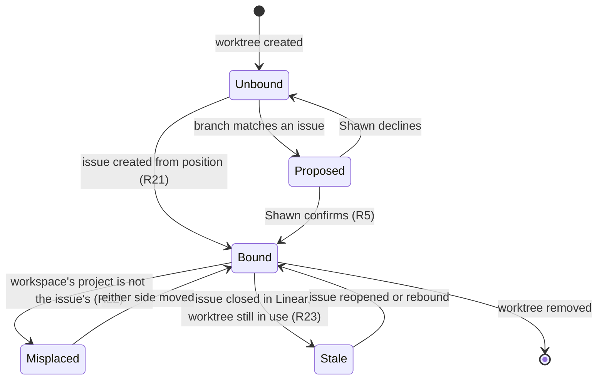
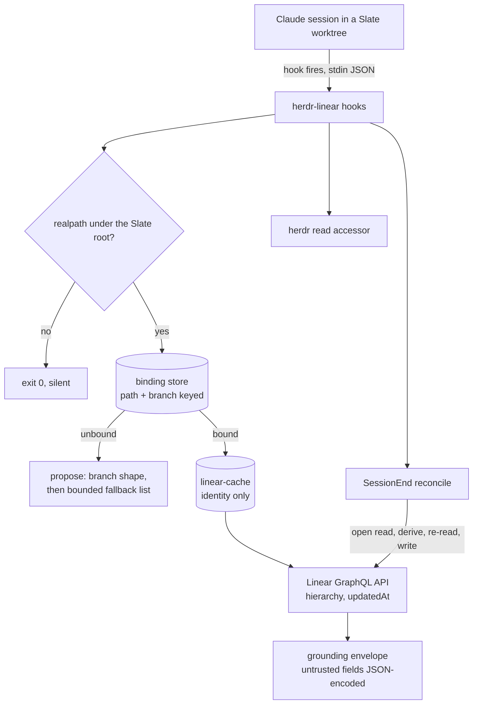

# Herdr and Linear as One Graph - Plan

## Goal Capsule

- **Objective:** Linear stays an accurate record of Slate work without maintaining it being a task of its own, a Claude session in any pane knows which Linear issue it is working on without being told, and the herdr layout can be built from the Linear hierarchy rather than assembled by hand.
- **Product authority:** Shawn. He confirms every binding and approves every write that needs judgment.
- **Open blockers:** None. Every question that would have blocked planning is resolved; the rest are recorded under Outstanding Questions as deferred to planning.

---

## Product Contract

### Summary

A Claude Code plugin that binds each Slate git worktree to a Linear issue, grounds any session opened in that worktree with the issue's context, and writes work back to Linear as it happens. Mechanical changes are written without asking; anything needing judgment is proposed first.

### Problem Frame

Linear is the model the work is organised around. The herdr layout is built to match it: a workspace holds a project's work, a tab holds a cluster of related issues, and each column in that tab is a piece being worked separately. That correspondence is real today — of the six multi-pane tabs currently open, four map cleanly onto an issue and the issues beneath it.

The correspondence is not recorded anywhere. A session opening in a pane sees a working directory and nothing else, so every session begins by re-establishing what it is working on. In the other direction, Linear only changes when someone stops and updates it. Because that is a separate act performed after the work, it is the act that gets skipped, and Linear drifts from what is true.

The drift is visible in the layout as well. One open tab groups four pieces of work under a name matching none of them. One worktree appears as a column in two different tabs at once. Neither is recoverable from the layout alone.

The cost is paid twice per piece of work: once re-establishing context that the layout already implies, and once reconciling a record that has fallen behind.

### Key Decisions

- KD1. **Both directions are required.** Linear is the mental model and the layout expresses it, so neither side can be read-only. (session-settled: user-directed — chosen over a one-way sync: a record that only receives, or only feeds, leaves the other side to be maintained by hand.) Governs R11, R15, R24.
- KD2. **The worktree carries the binding.** (session-settled: user-approved — chosen over storing it in the pane's environment: panes move between tabs and workspaces and their identifiers change, so a pane-held binding would be lost and re-asked exactly when the layout is rearranged.) Governs R1, R8.
- KD3. **Inference proposes; the user confirms; the confirmation is the binding.** (session-settled: user-directed — chosen over treating a name match as authoritative: a wrong write to Linear costs more to find and undo than no write.) Governs R2, R3, R4, R5, R6, R7, R9, R21.
- KD4. **Mechanical changes are automatic, judgment calls are asked, nothing blocks.** (session-settled: user-directed — chosen over confirming every write, which rebuilds the maintenance task it removes, and over a hook that holds a session open until Linear matches, which can trap any pane where the honest answer is "not finished".) Governs R15, R17, R18, R19.
- KD5. **A herdr workspace is bound to a Linear project the same way a worktree is bound to an issue.** (session-settled: user-directed — chosen over deriving the project from the issues inside the workspace, which says nothing about an empty or mixed workspace, and over fuzzy name matching, which is the confident-wrong-guess failure already ruled out for issues.) Governs R9, R10, R22.
- KD6. **Slate work only.** (session-settled: user-directed — chosen over applying to every repository: the mapping is meaningful for Slate work and noise everywhere else.) Governs R26.
- KD7. **A Claude Code plugin, with no herdr-side change to read the topology or display binding state.** The herdr CLI covers both today. It does not yet cover durable, rename-stable storage for the workspace binding, so resolving where that lives is the first planning step that could reopen this decision.
- KD8. **The plugin lives in this repo.** It sits beside the existing plugins and inherits their marketplace wiring. (session-settled: user-directed — chosen over a standalone repository.)
- KD9. **A created issue follows the house conventions, not the plugin's own shape.** Writing correctly-stated issues is a separate concern from writing them at the right time, so the shape lives in its own document that a person can edit without touching the plugin. Governs R29.
- KD10. **Linear and the repository are untrusted inputs.** Anyone with tracker access can write the text the plugin turns into paths, arguments, and session context, and a repository event can be stale or replayed. Governs R7, R16, R27, R28.

### Actors

- A1. Shawn — confirms bindings, approves writes that need judgment, and owns what Linear says.
- A2. The session agent — reads its context from the binding, proposes bindings and judgment writes, performs approved writes.
- A3. herdr — holds the layout and is the source of a pane's position.
- A4. Linear — the record of the work and the source of issue identity, state, and hierarchy.

### Requirements

**Binding**

- R1. Every bound piece of work is identified by its git worktree.
- R2. The plugin proposes a binding by matching a worktree's branch against the branch name Linear supplies for an issue, and never writes to Linear on the strength of a proposal alone.
- R3. When branch matching yields no candidate, the plugin offers candidates drawn from the workspace's bound Linear project, or from the Linear team the worktree's repository belongs to when that workspace is not yet bound, still under propose-and-confirm.
- R4. A candidate Shawn declines is not proposed again for that worktree.
- R5. A binding becomes authoritative only when Shawn confirms it, and then persists for the life of the worktree.
- R6. A confirmation is accepted only from an interactive human session; in an unattended session the worktree stays proposed and nothing is written to Linear. No payload field distinguishes the two — U1 observed a headless run reporting the same `source: startup` an interactive start reports — so the check is fail-closed against a positive signal the plugin itself establishes.
- R7. A binding is never read from version-controlled repository content, so only a binding the plugin itself wrote through a confirmation is authoritative.
- R8. A confirmed binding survives a pane moving between tabs or workspaces, a tab being renamed, and herdr restarting.
- R9. A herdr workspace is bound to a Linear project by the same propose-and-confirm step, and the plugin never assumes the correspondence from the two names.
- R10. A confirmed workspace binding survives the workspace being renamed.

**Grounding a session**

- R11. A session started in a bound worktree receives its Linear issue's context without asking for it.
- R12. That context carries the issue's identity, its current state, and its position in the project and parent-issue hierarchy.
- R13. A session started in an unbound worktree starts normally and says that it is unbound.
- R14. Grounding bounds how long it waits on Linear and herdr; when either is unreachable the session starts with an explicit notice that its context is unavailable, and nothing is written until authoritative state is known.

**Writing back**

- R15. At a session event in a bound worktree the plugin compares the repository's current state against Linear's and writes, without asking, any mechanical difference that Linear's own GitHub integration does not already write.
- R16. An automatic write is made only from an authenticated, current event tied to the confirmed binding, and any signal that cannot be verified is handled as a judgment change instead.
- R17. A change that requires judgment is proposed to Shawn and written only once he approves it.
- R18. A judgment change Shawn has not answered is retained with the binding and re-presented once at the start of the next session in that worktree, until he approves or dismisses it.
- R19. Nothing the plugin installs prevents a session from ending.

**Untidy states**

- R20. Working without a Linear issue is a supported state, and the plugin never requires one to be created.
- R21. On request, the plugin creates the Linear issue for an unbound worktree, proposing a parent from the herdr surface that worktree occupies and creating the issue with no parent when Shawn does not confirm one.
- R22. When a bound worktree sits in a workspace whose bound project is not its issue's project, the plugin reports the mismatch and offers to change either side.
- R23. When a bound issue is closed in Linear while its worktree is still in use, the plugin reports it and changes nothing on its own.

**Layout as intent**

- R24. Creating a tab from a Linear issue creates the herdr surface and a worktree for each issue beneath it that is to be worked.
- R25. Splitting a column to start unplanned work offers to create a sub-issue under the issue that tab was created from.

**Boundaries**

- R26. The plugin acts only on repositories under the Slate project root and does nothing elsewhere.
- R27. The Linear credential is held in the macOS Keychain through the existing secrets accessor, and never reaches a file, an environment variable, a command argument, or any diagnostic output.
- R28. Every string the plugin takes from Linear is untrusted input, validated before it becomes a path, a branch name, or a command argument, and stripped of terminal control sequences before it is displayed.
- R29. Every Linear object the plugin creates or updates follows the documented issue conventions in `docs/linear-conventions.md`, and the plugin asks rather than guessing on anything that document lists as unsettled.
- R30. The plugin writes only to the issue a worktree is bound to and to issues it created beneath that issue, and never to any other Linear object.

### Binding states

The binding is the plugin's central object, and most of its behavior is which state a worktree is in and what moves it.

Only `Bound` permits an automatic write. `Proposed`, `Misplaced`, and `Stale` are reported and wait for Shawn.

### Key Flows

- F1. Grounding a session
  - **Trigger:** A session starts in a worktree under the Slate root.
  - **Actors:** A2, A3, A4
  - **Steps:** Resolve the worktree from the working directory; look up its binding; fetch the R12 fields for the issue and its hierarchy; hand the session that context inside a trusted envelope; surface any retained unanswered proposal once.
  - **Outcome:** The session knows its issue, or says it is unbound.
  - **Covers R11, R12, R13, R14, R18, R26**

- F2. Binding a worktree
  - **Trigger:** A session starts in a worktree that is unbound or still proposed, or Shawn asks to bind one.
  - **Actors:** A1, A2, A4
  - **Steps:** Match the worktree's branch against Linear's branch names; present the candidates; Shawn picks one, asks for a new issue, or declines.
  - **Outcome:** The worktree is bound, or stays unbound with nothing written.
  - **Covers R2, R3, R4, R5, R6, R20, R21, R29**

- F3. Writing a mechanical change
  - **Trigger:** A session event occurs in a bound worktree.
  - **Actors:** A1, A2, A4
  - **Steps:** Verify the event is authentic and current; derive the corresponding Linear state; write it; record that it was written from the API's own response. Anything not derivable from the repository is recorded as a proposal for Shawn instead, and surfaced by F1 at the next session.
  - **Outcome:** Linear matches the repository from that session onward, with nobody updating it by hand.
  - **Covers R15, R16, R17**

- F4. Reconciling a misplaced or stale binding
  - **Trigger:** A bound worktree sits in a workspace whose bound project is not its issue's project, or its issue has been closed in Linear while the worktree is still in use.
  - **Actors:** A1, A2, A3, A4
  - **Steps:** Report both sides and suspend automatic writes. On a misplacement, Shawn chooses to move the pane or to re-parent the issue, and the chosen side is applied. On a closed issue, nothing is changed until he rebinds or reopens.
  - **Outcome:** The two agree, by Shawn's choice of which was wrong.
  - **Covers R22, R23**

- F5. Laying out an issue
  - **Trigger:** Shawn asks for a tab for a Linear issue.
  - **Actors:** A1, A2, A3, A4
  - **Steps:** Read the issue and the issues beneath it; validate every name taken from Linear; create the tab; create a worktree and column per issue to be worked; bind each on creation, taking Shawn's request for the layout as his confirmation of those bindings.
  - **Outcome:** The layout matches the issue, already bound.
  - **Covers R24, R28**

### Acceptance Examples

- AE1. **Covers R2, R5.** Given a worktree whose branch contains an issue identifier anywhere in it, when a session starts there, then the plugin offers that issue as a candidate and Linear is unchanged until Shawn confirms.
- AE2. **Covers R8.** Given a bound worktree, when its pane is moved to a different tab in a different workspace, then the next session there is grounded without being asked to confirm the binding again.
- AE3. **Covers R15, R17.** Given a bound worktree whose work landed without a pull request, when a session next starts there, then the plugin writes the completion Linear's own integration did not write, without asking; when whether the work is finished is not derivable from the repository, then the plugin asks before moving it.
- AE4. **Covers R20.** Given an unbound worktree, when sessions run in it repeatedly, then the plugin does not create an issue and does not repeat the request to create one.
- AE5. **Covers R22.** Given a bound worktree whose pane has been moved into a workspace bound to a different project, when the plugin next runs, then it reports the mismatch and offers both to move the pane back and to re-parent the issue, and applies neither on its own.
- AE6. **Covers R23.** Given a bound issue that is closed in Linear, when its worktree is still being worked, then the plugin reports the closure and does not reopen the issue.
- AE7. **Covers R26.** Given a worktree outside the Slate project root, when a session starts there, then the plugin does nothing and says nothing.
- AE8. **Covers R9.** Given a workspace whose label resembles a project name, when the plugin first needs the correspondence, then it proposes that project and treats the workspace as unbound until Shawn confirms.
- AE9. **Covers R25.** Given a tab created from an issue, when a new column is split off in it, then the plugin offers to create a sub-issue under that issue and leaves the new worktree unbound if Shawn declines.
- AE10. **Covers R6, R7.** Given an unattended session started in a Slate worktree, when it reaches an unbound worktree or a binding file present in the checked-out branch, then the worktree stays unbound and nothing is written to Linear.
- AE11. **Covers R4.** Given a worktree whose proposed candidate Shawn declined, when a session starts there again, then the plugin does not offer that candidate a second time.
- AE12. **Covers R14.** Given Linear is unreachable, when a session starts in a bound worktree, then the session starts within the lookup bound, says its context is unavailable, and writes nothing to Linear.
- AE13. **Covers R18.** Given a judgment change proposed as a session ends and left unanswered, when the next session starts in that worktree, then the proposal is presented once more.
- AE14. **Covers R21.** Given an unbound worktree in a tab that was not created from an issue, when Shawn asks for an issue to be created, then the plugin proposes a parent, and creates the issue with no parent when he does not confirm one.

### Scope Boundaries

- Enforcement beyond what KD4 settles, per R19.
- Any change to herdr. The plugin uses the herdr CLI as it is.
- Non-Slate work, including this repository. The plugin cannot be exercised on its own development, so it will need a Slate worktree to test against.
- Bulk correction of existing layout drift. The anomalies currently open are inputs to the design, not work items.
- Reporting, dashboards, or metrics derived from the binding.

### Dependencies / Assumptions

- herdr 0.8.2 is installed and its server is reachable. Verified by running the commands against the live server during planning, not from a repo precedent — no script in this repo calls these three verbs: `api snapshot` returns the full topology including per-tab split direction and pane geometry; `pane report-metadata` and `workspace report-metadata` write display metadata; `tab create` and `pane split` accept `--env` and `--cwd`.
- Linear supplies a canonical git branch name per issue, which is what R2 matches against. Most Slate branches do not carry it: 18 of 86 worktree branches contain a Linear identifier, 16 of them hyphenated and 2 not, and where it appears it sits after a `feature/`, `task/`, or `bugfix/` prefix rather than at the start, in both hyphenated and unhyphenated spellings. R2 therefore produces a candidate for a minority of worktrees.
- A per-worktree Linear pin already exists on this machine: `~/.claude/hooks/linear-pin.sh` runs as a `PostToolUse` hook on `mcp__linear__.*` and writes a bare ticket identifier, keyed per session and per `repo-root#branch` hash. Its record cannot hold the proposed, declined or stale states this plan needs, its key changes if re-keyed on the worktree, and `~/.claude/hooks/linear-statusline.sh` depends on `get` printing a bare identifier. The plugin therefore reads it as a seed and keeps its own store, per KTD3.
- A Linear cache already exists on this machine: `~/.claude/hooks/linear-cache-refresh.sh` populates `~/.claude/linear-cache/<ID>.json` with `{id, title, project, status, fetchedAt}` and a `_teamkeys` record of nine team keys. It holds most of what R12 needs at no API cost, and it reads `LINEAR_API_KEY` from plaintext `~/.secrets` today. U3 migrates that key to the Keychain so R27 holds for both readers.
- Linear's GitHub integration is already live for the Web Creation team and writes part of what R15 would write. Verified on WEB-3172: an attachment for `slateteams/web-app#5433` was created automatically from the branch name, and the issue moved Todo to In Progress to Done with no manual step. R15 therefore covers only the transitions that integration does not make. Which transitions those are is a planning question.
- The plugin observes the world only while a session runs, because a Claude Code plugin executes when one of its hooks fires. An event that happens with no session open is picked up by the next session in that worktree, not at the moment it occurs.
- Linear has no command-line client on this machine, so writes go through its API. `plugins/spawn/lib/secrets.sh` is the existing credential pattern in this repo and stores secrets in the macOS Keychain; `plugins/spawn/lib/sanitize.sh` is the existing accessor for untrusted text bound for a terminal.
- No Linear integration exists in this repo today. `plugins/spinoff/skills/spinoff/SKILL.md` states that its script "has no Linear access and never looks one up".
- Slate work is everything under the Slate project root, and it spans more than one Linear team. Every currently-open Slate pane sits on a Web Creation issue, but the web-app main checkout sits on a Frontend Guild branch. The team is therefore resolved per worktree, and R21 takes the team for a new issue from the workspace's bound project.
- A tab groups related issues rather than strictly one issue and its children. One open tab holds an issue and its own parent as sibling columns, so R25 attaches a new sub-issue to the issue the tab was created from rather than inferring a parent from the neighbouring columns.
- The `SessionStart` payload carries `cwd`, `hook_event_name`, `session_id`, `source` and `transcript_path`, and nothing that separates an interactive session from a headless one.
- Which of the drift moments costs the most is not established. All of them are treated as in scope, sorted by R15 and R17 rather than by priority.
- The pane tree does not name columns directly. Column membership is derived from pane geometry within a tab's layout, which the snapshot exposes.

### Outstanding Questions

**Deferred to planning**

- Which repository events map to which Linear states. KTD7 fixes how a write is proven current; the event-to-state table is settled in U8 against the team's live workflow states.
- How a worktree that is removed while its issue is open is handled.
- Whether "an accurate record" means issue state and hierarchy only, or also a written account of what was done. Deferred, not blocking: the plan delivers state and hierarchy, and a summary write would be an added requirement rather than a change to any existing one.

### Sources / Research

- `plugins/spinoff/skills/spinoff/scripts/spinoff.sh` — creates the worktree and the herdr surface in one flow, passing the worktree as `--cwd` to `herdr workspace create`, and injects session context through a brief file read at launch rather than through the environment. The existing worktree-to-surface pairing this plan attaches an issue to.
- `~/.claude/hooks/linear-pin.sh` and its store under `~/.claude/linear-pin/` — the live Linear pin the binding seeds from; `~/.claude/hooks/linear-statusline.sh` is its existing consumer.
- `~/.claude/hooks/linear-cache-refresh.sh` and `~/.claude/linear-cache/` — the live per-issue cache the grounding path reads before calling the API, and the current holder of the plaintext credential U3 migrates.
- `plugins/spawn/lib/secrets.sh` — the repo's only Keychain accessor, and the source U3 vendors from. Its header records that the default ACL authenticates `/usr/bin/security` rather than the caller, so any same-user process can read the item.
- `plugins/spawn/lib/sanitize.sh` — the sanitiser U3 vendors. Its rule is to sanitise at output chokepoints rather than at call sites.
- `plugins/spawn/tests/run-tests.sh` — the test harness U2 follows, including the self-check that writes a deliberately-false test and requires it to fail.
- `docs/solutions/logic-errors/exporting-an-empty-credential-is-worse-than-exporting-none.md` — why U3 verifies the credential by read-back rather than by exit status.
- `docs/solutions/documentation-gaps/permission-allowlist-is-only-as-narrow-as-its-widest-bare-tool.md` — why KTD10 enforces containment rather than asserting it.
- `docs/solutions/logic-errors/a-tally-keyed-on-exit-status-reports-work-that-never-happened.md` — why U8 records a write from the API response, never from control flow.
- `plugins/spawn`, `plugins/auto`, `plugins/reflect`, `plugins/comment-cut` — each carries `.claude-plugin/plugin.json`, `.claude/hooks/hooks.json`, and `skills/`. `plugins/spinoff` has no hooks, so it is the layout precedent but not the hook precedent.
- `docs/linear-conventions.md` — the issue, sub-issue, label, and milestone conventions R29 binds the plugin to, derived from issues written in the Web Creation team during 2026.
- `CONCEPTS.md` — defines the binding vocabulary this plan uses.
- The live herdr topology and representative Linear issues were read directly during this brainstorm. Four of six multi-pane tabs map cleanly onto an issue and the issues beneath it; one holds a parent and child as siblings; one worktree appears in two tabs. A Linear issue returns its branch name, project, parent, and team in a single read.

---

## Planning Contract

**Product Contract preservation:** changed — R30 added (writes bounded to the bound issue and its children, settled this session); F1, F3 and F4 corrected to describe the behaviour their implementing units build; the `linear-pin.sh`, cache and herdr assumptions corrected against research. No requirement was weakened and no R-ID was renumbered.

### Key Technical Decisions

- KTD1. **A personal Linear API key, held in the Keychain.** (session-settled: user-directed — chosen over an OAuth application registered with `actor=app`: that is the only route to scoped, non-admin access, but the registration, authorize flow and 30-day token refresh cost more than the narrower blast radius buys for a single-user plugin.) Governs R27.
- KTD2. **Writes are bounded in code, not by the credential.** A personal key carries the user's whole account, so the bound lives in the binding record: the bound issue plus a `created_children` list the plugin appends to whenever it creates an issue. (session-settled: user-approved — chosen over relying on credential scope, which a personal key does not have.) Governs R30.
- KTD3. **A new plugin-owned binding store; `linear-pin.sh` is read as a seed, never rewritten.** Its record is a bare identifier with no room for the proposed, declined or stale states; its branch key hashes `repo-root#branch`, so re-keying on the worktree invalidates every existing pin; and `linear-statusline.sh` depends on `get` printing a bare identifier. In practice the pin store holds session-scoped records almost exclusively, so the seed rarely fires. Governs R1, R3, R4, R7, R8, R10.
- KTD4. **The store is keyed by the worktree's resolved real path plus the branch at confirmation time.** The path alone is not enough: worktree names recur here by convention, so a recreated worktree would inherit a record still reading confirmed and be grounded in the previous work's issue. A record whose recorded branch no longer matches the path's current branch is downgraded to proposed. The store lives under `~/.claude/herdr-linear/` — outside version control, which R7 requires, and outside `${CLAUDE_PLUGIN_ROOT}`, which changes on plugin update.
- KTD5. **Grounding reads the cache for identity, and the API for hierarchy.** `~/.claude/linear-cache/<ID>.json` holds `{id, title, project, status, fetchedAt}` for issues assigned to Shawn — no parent, no team, no `updatedAt`. It answers the identity half of R12 and nothing else, so the parent-issue and team fields always come from the API. The saving is one field-set, not one call. Governs R14.
- KTD6. **Branch to issue is a shape match, then one fetch by identifier.** The pattern is `[A-Z][A-Z0-9]{1,7}-?[0-9]{1,6}` anywhere in the branch, case-insensitive and tolerating the missing hyphen, which is the same shape `linear-pin.sh` already validates. No team list is consulted: `~/.claude/linear-cache/_teamkeys` is derived from cached filenames and is already stale. A non-existent identifier is settled by the fetch returning nothing. Governs R2.
- KTD7. **The stale-write guard is local to one reconciliation pass.** Read the issue's state and `updatedAt` at the start of the pass, derive the difference from that read, re-read `updatedAt` immediately before the mutation, and abort only when it moved *within that pass*. Never compare against a value stored from an earlier session: Linear's GitHub integration moves these issues on its own, so a cross-session comparison would abort every write permanently and silently. The guard closes the read-modify-write window; it is not a distributed lock, and Linear offers no precondition to make it one. Governs R16.
- KTD8. **`secrets.sh` and `sanitize.sh` are vendored into this plugin, not sourced from `plugins/spawn`.** No plugin in this repo sources another's library, `${CLAUDE_PLUGIN_ROOT}` resolves only the current plugin, and spawn's own runner requires it to work from a checkout with no other plugin present. Governs R27, R28.
- KTD9. **The credential never reaches a command argument.** The Authorization header goes to `curl` on stdin via `curl --config -`, never as a `-H` argument, mirroring the builtin-`printf` rule that keeps a secret out of the process table. Both readers — the plugin and the cache refresh — follow it. Governs R27.
- KTD10. **The grounding channel is `hookSpecificOutput.additionalContext` on `SessionStart`, proven on this build.** U1 emitted two tokens in one JSON object — one under that key, one under a sibling key no contract names — and only the first reached the model, which distinguishes a real channel from the harness dumping raw stdout. The `UserPromptSubmit` fallback is not needed and is not built.
- KTD11. **Slate-root containment is enforced against a named root.** The root is `~/projects/Slate`, resolved with `realpath` at hook time and overridable by one named environment variable for tests. Both paths are resolved and compared with a trailing separator, because a bare prefix admits a sibling directory and an unresolved symlink admits whatever it points at. A root that does not resolve is treated as outside. Governs R26.
- KTD12. **Bindings are established lazily, and the fallback candidate list is bounded.** No bulk pass over the 86 existing worktrees. Because branch matching reaches under a fifth of them, the fallback path is the common one: it offers at most a handful of issues, assigned to Shawn, in a non-terminal state, most recently updated first, and says so and stops when that filter is empty rather than widening.
- KTD13. **Two interactive skills, and hooks that never prompt.** Binding, reconciling a misplacement and layout are skills Shawn invokes; the hooks ground, reconcile and report. A judgment proposal is therefore never presented by the hook that found it — it is recorded against the binding and surfaced by the grounding hook at the next session, on the same path R18 defines.
- KTD14. **The reconciliation hook is `SessionEnd`, not `Stop`.** `Stop` can block a session from ending; `SessionEnd` cannot. R19 turns on that choice.
- KTD15. **Every binding mutation is an atomic read-modify-write under a per-record lock.** Two sessions can share a worktree, and an unlocked update can resurrect a declined candidate or lose a judgment proposal.
- KTD16. **Untrusted external text is carried in a fixed envelope, never inlined.** Linear-authored fields reach a session holding shell access and a write-capable credential, so they are JSON-encoded inside a trusted wrapper that states their contents are data. Naming a field "quoted" is not a boundary. Governs R28.

### Risks & Dependencies

- ~~The grounding channel may not exist on this build.~~ **Closed by U1**: the channel is real, discriminated against a decoy key. `plugins/herdr-linear/tests/probe/README.md` carries the evidence.
- **The credential migration edits a file this repo does not ship.** U12 moves that script in-tree so the change becomes versioned and testable rather than a hand-patch on one machine.
- **The Keychain bound is weaker than it looks.** Its default ACL authenticates `/usr/bin/security`, not the caller, so any same-user process reads the item without a prompt. The improvement over plaintext is real but smaller than R27's wording suggests.
- **herdr is moving software in this same repo.** Three verbs the plan depends on have no caller anywhere in the tree. U11 probes liveness before any call and every herdr call sits behind a fixture seam.
- **Fixtures encode the same beliefs as the code they test.** A wrong belief about Linear's response shape is green everywhere and first fails on a real ticket. U13 captures observed shapes before U5 freezes its fixture.
- **The first real exercise is a live Slate ticket.** There is no scratch Linear team and R26 keeps the plugin out of this repo. Shadow mode in U8 is what stands between a fixture-green write path and a wrong write on a real issue.

### System-Wide Impact

- **Every session under the Slate root runs the containment check.** It sits on the hot path of session start, so it must be cheap, and it must exit silently rather than block — the plugin declines to act, which is the opposite of admitting an out-of-root repository. R26 and KTD11 own its correctness.
- **`~/.claude/linear-cache/` gains a second reader** whose freshness bound now decides what a session is told about its issue.
- **`linear-pin.sh` and `linear-statusline.sh` keep their current contract.** The plugin reads the pin store as a seed and never writes it, so the statusline continues to work. The two records can name different issues for one worktree; the bind skill reports a divergence so it is at least legible.
- **The credential's readership moves rather than narrows** — from a file any process can read to a Keychain item any same-user process can read through `security`. Both readers change together in U12.
- **Nothing in herdr changes, and no other plugin is touched.**

### High-Level Technical Design

Three reads stand between a session and the network, and each is a failure boundary: containment exits silently outside Slate, the binding store answers without any network, and the cache answers the identity half without an API call.

### Assumptions

- `claude plugin validate` exits 0 even when it reports problems, so the wire check greps its output.
- Workflow state identifiers are read per team at runtime; Slate work spans at least Web Creation and Frontend Guild, and the GitHub integration's transitions were verified only on Web Creation.
- `HERDR_PANE_ID`, `HERDR_TAB_ID` and `HERDR_WORKSPACE_ID` are exported into every herdr pane, so a session's own position needs no snapshot walk.
- `plugin.json` declares `skills` explicitly rather than relying on discovery, since U7, U9 and U10 all add skills.

### Sequencing

Phase A proves what is unproven and stands the plugin up. Phase B builds the read path. Phase C adds writes behind shadow mode. Phase D adds layout generation. Phase D is the last to land, but it is not free to drop: KD1 makes both directions required, so cutting it withdraws the Objective's layout clause and must be recorded as a scope change rather than a schedule one.

---

## Implementation Units

| U-ID | Unit | Key files | Depends on |
|---|---|---|---|
| U1 | Prove the grounding channel and the interactivity signal | `tests/probe/` | — |
| U2 | Scaffold, manifest, containment, test harness | `.claude-plugin/plugin.json`, `lib/contain.sh` | — |
| U3 | Vendored secrets and sanitize helpers | `lib/secrets.sh`, `lib/sanitize.sh` | U2 |
| U11 | herdr read-only accessor | `lib/herdr-read.sh` | U2 |
| U12 | Credential migration and in-tree cache refresh | `bin/linear-cache-refresh.sh` | U3 |
| U13 | Capture real Linear response shapes | `tests/fixtures/fake-linear.sh` | U3 |
| U4 | The binding store | `lib/binding.sh` | U2, U3 |
| U5 | Linear client | `lib/linear.sh` | U3, U13 |
| U6 | Grounding hook | `hooks/ground.sh` | U1, U4, U5 |
| U7 | Proposal and confirmation | `skills/bind/`, `lib/propose.sh` | U4, U5, U11 |
| U8 | Reconciliation writes | `hooks/reconcile.sh` | U5, U7 |
| U9 | Untidy states | `lib/states.sh`, `skills/bind/` | U7, U8, U11 |
| U10 | Layout from Linear | `lib/herdr-write.sh`, `skills/layout/` | U7, U11 |

All paths are under `plugins/herdr-linear/`.

### Phase A — Prove and scaffold

### U1. Prove the grounding channel and the interactivity signal

- **Goal:** Settle two things the plan cannot assume: whether a hook can put text in front of the model, and what distinguishes an attended session from an unattended one.
- **Requirements:** R6, R11. Settles KTD10.
- **Dependencies:** none.
- **Files:** `tests/probe/session-start-probe.sh`, `tests/probe/README.md`.
- **Approach:**
  1. Emit **two** random tokens in one JSON object: one under `hookSpecificOutput.additionalContext`, one under a sibling key the harness does not read. If the model repeats both, the harness is dumping raw stdout and the channel is not proven; if only the first, it is real.
  2. Run the same shape on `PostToolUse` as a positive control, since that channel is known to work here.
  3. Record which stdin fields the payload actually carries, and whether any field or environment marker distinguishes an interactive session from a headless one.
- **Execution note:** This unit produces evidence, not a feature. The failure to guard against is the probe answering the wrong question — both channels put a token in front of the model, so a single token proves nothing.
- **Test scenarios:**
  - Only the `additionalContext` token is repeated: the channel is recorded as proven.
  - Both tokens are repeated: recorded as raw-stdout dumping, and `additionalContext` is **not** proven.
  - Neither is repeated while the `PostToolUse` control succeeds: `SessionStart` is recorded as unusable for injection.
  - Neither is repeated and the control also fails: recorded as inconclusive, which blocks Phase B.
  - No field or marker distinguishes session attendedness: recorded as absent, so KTD12's fail-closed default governs.
- **Verification:** The README states the channel verdict and the interactivity signal, and U6 and U8 cite it rather than assuming.

### U2. Scaffold, manifest, containment, and test harness

- **Goal:** A plugin that installs from a clean checkout, refuses to act outside the Slate root, and has a suite that has been seen to fail.
- **Requirements:** R26. Implements KTD11.
- **Dependencies:** none.
- **Files:** `.claude-plugin/plugin.json`, `.claude/hooks/hooks.json`, `lib/contain.sh`, `tests/run-tests.sh`, `tests/unit/contain.bats`, `.claude-plugin/marketplace.json`.
- **Approach:**
  1. Mirror spawn's layout. Declare `hooks` and `skills` explicitly in `plugin.json` rather than relying on discovery, and register the plugin in the repo-root marketplace with a matching `version`.
  2. Put the containment check in `lib/contain.sh` so all three entry points share one implementation: resolve both paths with `realpath`, compare with a trailing separator, treat an unresolvable root as outside.
  3. Port spawn's runner: `self_check` first, then `tests/unit/*.bats`, then a wire smoke that greps `claude plugin validate` output and compares the two `version` fields.
  4. Add `lin_api_[A-Za-z0-9]{16,}` to the ported secret scan; spawn's patterns cover `sk-ant-`, `sk-`, `AKIA`, `gh[pousr]_`, `xox` and PEM headers, none of which match a Linear key.
- **Patterns to follow:** `plugins/spawn/tests/run-tests.sh`; the presence-gated `|| true` command shape in `plugins/spawn/.claude/hooks/hooks.json`.
- **Test scenarios:**
  - `self_check` writes a deliberately-false test and fails the suite if it passes.
  - A sibling directory whose name begins with the Slate root path is treated as outside.
  - A symlink pointing into the Slate root from outside is treated as outside.
  - The Slate root does not exist, and every caller is told outside.
  - The two `version` fields disagree, and the wire smoke fails.
  - A file containing a `lin_api_`-shaped string fails the secret scan.
- **Verification:** `bash plugins/herdr-linear/tests/run-tests.sh all` passes from a checkout with no other plugin present.

### U3. Vendored secrets and sanitize helpers

- **Goal:** The plugin has its own credential and sanitising accessors, with no dependency on another plugin.
- **Requirements:** R27, R28. Implements KTD8.
- **Dependencies:** U2.
- **Files:** `lib/secrets.sh`, `lib/sanitize.sh`, `tests/unit/secrets.bats`, `tests/fixtures/fake-security.sh`.
- **Approach:**
  1. Vendor from `plugins/spawn/lib/`, keeping the `local -; set +x` guard, the read-back verification, and the stdin-to-bare-`-w` rule.
  2. Keep sanitize's construction rule intact: an identifier is *closed* against `[A-Za-z0-9._-]` rather than filtered by denylist.
- **Test scenarios:**
  - A hostile secret containing quotes, newlines and control characters round-trips byte-exact, and no fragment appears in argv.
  - The Keychain write appears to succeed but stores an empty value, and the read-back check fails it.
  - A string carrying an ANSI escape and a Unicode direction override is stripped before display.
- **Verification:** The vendored helpers pass their tests with no `plugins/spawn` on disk.

### U11. herdr read-only accessor

- **Goal:** One place that resolves the herdr binary, proves the server is live, and reads topology — available before anything needs to write herdr.
- **Requirements:** none directly; unblocks U7, U9 and U10.
- **Dependencies:** U2.
- **Files:** `lib/herdr-read.sh`, `tests/unit/herdr-read.bats`, `tests/fixtures/fake-herdr.sh`.
- **Approach:**
  1. Port spinoff's `resolve_bin` and its `case`-glob liveness probe. Do not pipe herdr into an early-exiting reader — under `pipefail` that returns false on a match that succeeded.
  2. Prefer `HERDR_PANE_ID`, `HERDR_TAB_ID` and `HERDR_WORKSPACE_ID` from the environment for the session's own position; use `api snapshot` only for the tab-to-issue walk that needs neighbours.
- **Patterns to follow:** `plugins/spinoff/skills/spinoff/scripts/spinoff.sh` — `resolve_bin`, `_herdr_probe`, `_herdr_json`.
- **Test scenarios:**
  - The binary is absent from PATH and is found on the fallback path list.
  - An explicitly-set override that is not executable resolves to empty and does not fall through.
  - The server reports `not running`, and the probe returns false rather than matching the substring.
  - A pane id is read from the environment without invoking herdr at all.
- **Verification:** No test invokes the live herdr server.

### U12. Credential migration and in-tree cache refresh

- **Goal:** One credential, in the Keychain, read the same way by both readers, with the plaintext copy gone.
- **Requirements:** R27. Implements KTD9.
- **Dependencies:** U3.
- **Files:** `bin/linear-cache-refresh.sh`, `bin/migrate-credential.sh`, `tests/unit/migrate.bats`. No `fake-curl.sh` was written: `tests/fixtures/fake-linear.sh` from U13 already stands in for curl and already refuses a credential in argv, so a second double would have been a parallel path with a weaker guard.
- **Approach:**
  1. Ship the refresh script in-tree, covered by the same fake-curl and fake-security seams as the rest of the suite, and have the migration replace the `~/.claude/hooks/` copy with a call into it. The edit becomes versioned and tested rather than a hand-patch.
  2. Issue a **fresh** Linear key rather than moving the existing one: the current key has lived in plaintext and may sit in backups or dotfile sync, so migrating it preserves that exposure.
  3. Feed the Authorization header to `curl` on stdin via `--config -`, never as a `-H` argument.
- **Execution note:** The migration is not complete until `~/.secrets` no longer holds `LINEAR_API_KEY`. Report it rather than deleting it automatically, but the Definition of Done requires the removal, not the notification.
- **Test scenarios:**
  - The fake curl records its own argv and environment, and neither holds any fragment of the credential.
  - `~/.secrets` has no `LINEAR_API_KEY`, and the migration says so rather than writing an empty credential.
  - The Keychain read returns empty, and the refresh fails loudly rather than calling Linear unauthenticated.
  - Re-running the migration after removal reports the Keychain as the only source.
- **Verification:** The cache refresh works with the key removed from `~/.secrets`, and no gate reports success while the plaintext copy remains.
- **Status: code done, the manual half is outstanding.** Both scripts are written and covered by 18 tests. What remains needs a person: issuing a fresh key at `https://linear.app/settings/api`, storing it, revoking the old one, and removing the plaintext line.

**The leak this unit closes was measured, not assumed.** The `~/.claude/hooks/` copy passed the key as `-H "Authorization: $KEY"`, so it sat in process argv for the life of every request — and the statusline spawns that script on any cache miss. Sampling `ps` during one single-issue refresh caught the real key in **6 of 9 samples**; the ported script scored **0 of 11**. The first measurement of this returned 14, inflated because the measuring `grep` carried the key on its own argv; the corrected method passes the pattern through a file.

**Blast radius, audited before anything moved:** the key's *value* exists in exactly one file, `~/.secrets`. herdr's session history holds the variable *name* four times and the value zero times. One script reads it (`~/.claude/hooks/linear-cache-refresh.sh`); `~/.agents/skills/printing-press/SKILL.md` only lists the name in documentation.

**Design decisions worth keeping:**

- **The fallback to plaintext stays, and is noisy on disk.** Removing it would break the statusline the moment the hook is swapped, before the operator has migrated. But the script runs detached, so its stderr warning reaches nobody — it therefore also writes `_plaintext_fallback_used`, which `migrate-credential.sh report` reads back. The migration is not finished while that marker keeps reappearing.
- **`remove-plaintext` is a separate verb and refuses twice.** It will not run without a Keychain key, and will not run when that key fails a live `viewer` query — removing the plaintext copy behind a broken key leaves nothing working at all. It backs up to a 0600 file first and says plainly that the backup still contains the old key.
- **A fresh key, not the old one.** The existing key has lived in plaintext where dotfile sync and Time Machine may have copied it, and it has been in argv on every cache miss. Moving it preserves that exposure; issuing a new one and revoking the old ends it. A personal API key cannot be created through the API, so this step is a person at a browser.

- **Verification performed:** four mutations, each turning a test red — putting the credential back on argv, dropping the fallback marker, removing the `verify_key` gate from `remove-plaintext`, and skipping the backup. The argv mutation also exposed a vacuous assertion of my own: `[ "$status" -ne 98 ]` could never fail, because curl runs inside a command substitution whose pipeline ends in `wc` and the script exits from a later `echo`. The stdin record is what carries that test now, and the comment says so.

### U13. Capture real Linear response shapes

- **Goal:** Fixtures built from observed responses rather than from assumptions about the API.
- **Requirements:** none directly; grounds U5.
- **Dependencies:** U3.
- **Files:** `tests/fixtures/fake-linear.sh`, `tests/unit/fake-linear.bats`, `tests/probe/linear-shape-probe.sh`.
- **Approach:** Run once by hand, read-only, on 2026-09-04. The fixture stands in for **curl**, not for the API, because KTD9's claim is about the invocation: the credential travels on stdin through `--config -` and never on argv. Only something in curl's position can see argv and fail the run, so the fixture exits 98 on a credential in argv and 97 on an unpermitted mutation.
- **Execution note:** Read-only against Linear. This is the one place the plan touches the real API before Phase C, and it writes nothing.
- **Status: done.** Captured shapes: an issue with a parent, an issue without, entity-not-found, authentication error, GraphQL validation error, and the rate-limit headers. Only the 429 body is unverified — it could not be provoked read-only without spending the hour's budget, and it is labelled as constructed in the fixture.

**What the capture found, and what it changes for U5:**

1. **"No issue came back" arrives in three incompatible shapes.** A client testing `.data.issue == null` recognises none of them:

   | Case | Shape |
   |---|---|
   | found | `{"data":{"issue":{…}}}` |
   | not found | `{"errors":[…],"data":null}` — `data` present **and** null |
   | auth error | `{"errors":[…]}` — no `data` key at all |
   | validation error | `{"errors":[…]}` — no `data` key at all |

   U5 branches on `errors[]` first, then on `data`. The useful discriminator is `errors[0].extensions.code`: `INPUT_ERROR`, `AUTHENTICATION_ERROR`, `GRAPHQL_VALIDATION_FAILED`.

2. **A parent issue is not a child minus a field.** `parent` is explicitly `null` and `labels.nodes` is an empty array rather than absent. A reader treating both as missing keys passes one case and breaks on the other.

3. **The rate-limit headers ride every response, not only a 429** — `x-ratelimit-requests-limit: 2500`, `-remaining`, `-reset` (epoch ms), plus the same three for complexity against a 3,000,000 budget. U5 can watch its own budget without ever being throttled, so R14's bounded lookup does not need a 429 to know it is close.

4. **KTD9 verified against the live endpoint.** A read-only query ran with the key fed to `curl --config -` on stdin; a scan of every process's argv for the actual key value found **0**. An earlier count of 3 was the scanning `grep` itself and two wrapper lines matching the literal template text, not the secret.

5. **Both fixture guards began as enumerations and were widened to default-deny.** Each refused only the single form it had been written against: the credential check required `Authorization:` and the key in the *same* argument, so `-u <key>:` and a key inside `--data` passed with exit 0; the mutation check read an extracted body that only recognised `--data`/`-d`/`--data-raw` as separate arguments, so `--data-binary`, `--json` and `--data=<value>` passed too. Both now scan every argument for the credential shape and for the `mutation` keyword. This is the third time in this build an allowlist has been mistaken for a boundary.

- **Test scenarios:** `tests/unit/fake-linear.bats`, 14 tests. Each of the three no-result shapes is asserted distinctly; both boundary codes are asserted; `http_500`, `empty_body` and `malformed_json` are asserted to be distinguishable from one another.
- **Verification:** the two widening tests were seen red against the narrow guards before the guards were changed. Then three mutations were applied to the widened fixture and each turned its test red — removing the argv guard, removing the mutation guard, and narrowing the credential shape list. The fixture was restored byte-identical afterwards. `tests/probe/linear-shape-probe.sh` was run twice against the live API, once with named issues and once through its own discovery path on a different team.

### Phase B — Read path

### U4. The binding store

- **Goal:** A durable, tamper-resistant record of which issue a worktree is bound to, and in what state.
- **Requirements:** R1, R3, R4, R5, R6, R7, R8, R9, R10, R18, R30. Implements KTD3, KTD4, KTD15.
- **Dependencies:** U2, U3.
- **Files:** `lib/binding.sh`, `tests/unit/binding.bats`.
- **Approach:**
  1. Key each record on the worktree's `realpath` **and** the branch recorded at confirmation; downgrade to proposed when the branch at that path no longer matches, so a recreated worktree cannot inherit a confirmed binding.
  2. Store the issue identifier, the binding state, declined candidates, any unanswered proposal, the `created_children` list, and the `updatedAt` last seen.
  3. Create the store directory mode 0700 and records mode 0600; write through a temporary file in the same directory and rename into place; treat a record not owned by the current user, or group- or world-writable, as absent.
  4. Take a per-record lock for every mutation and read-modify-write atomically.
  5. Read `linear-pin.sh`'s store as a seed only, and never write to it.
  6. Refuse any binding whose record was read from inside the worktree's tracked tree.
  7. Treat a session as unattended unless U1's recorded signal positively proves otherwise. **U1 found no such signal**, so R6 is satisfied by a pair of units rather than by this one — see below.
- **Test scenarios:**
  - A confirmed binding survives a pane moving workspace, a tab rename and a herdr restart. Covers AE2.
  - A workspace binding survives a herdr restart and a workspace rename.
  - A record written for one branch is not treated as confirmed after the path is recreated on another.
  - A binding file committed on a checked-out branch is ignored and the worktree stays unbound. Covers AE10.
  - A declined candidate is not offered again for that worktree. Covers AE11.
  - An unattended session cannot move a record from proposed to bound. Covers AE10.
  - The interactivity signal is absent entirely, and the record stays proposed.
  - A truncated record is treated as absent rather than parsed.
  - A record with a widened file mode is treated as absent.
  - Two concurrent mutations both land, and neither loses the other's declined candidate.
  - An unanswered proposal is retained and returned once on the next read. Covers AE13.
  - A child issue appears in `created_children` after creation.
- **Verification:** Every state in the binding-states diagram is reachable and its guards hold.
- **Status: done.** 27 tests.

**R6 is split across U4 and U7, and neither half satisfies it alone.** U1 proved no field separates an interactive session from a headless one — `claude -p` reports the same `source: startup` an interactive start reports. So the store cannot check attendedness, and a test claiming it does would be a check narrower than its invariant.

- **U4 guarantees ordering.** `propose` generates a nonce and stores it; `confirm` moves to bound only when handed that proposal's current nonce. This closes accidental confirmation, stale confirmation, and the cross-session case where two sessions share a worktree — a superseded proposal's nonce is dead.
- **U7 must guarantee attendedness.** The nonce may reach `confirm` only after a human answered. That means `disable-model-invocation: true` on the bind skill plus a real blocking question. **Open verification item for U7: establish what a blocking question actually does under `claude -p`.** Probe it the way U1 probed the hook channel; do not assume it fails closed.

Stated plainly because the alternative is overclaiming: a headless session that runs the bind skill can call propose, take the nonce, and call confirm. Nothing in `lib/binding.sh` prevents that, and the header of that file says so.

**Other decisions settled while building:**

- **Reads never write.** A branch mismatch reports an effective state of `proposed` and leaves the record alone. Downgrading on read would make grounding — the hot path, run at every session start — a lock-taking writer, and make a read block behind a concurrent mutation. The next mutation persists it.
- **A record is valid or absent, with no middle.** Validation is a whole-shape test: required fields, `state` within the enum, `version` not from the future, list fields actually lists. Testing only "did the parse throw" would accept `state: "confirmed"` — a value nothing writes and no branch handles, which then falls through every state check in silence.
- **Locking is `mkdir`, not `flock`.** `flock` on this machine is a Homebrew binary, so depending on it would fail on a clean checkout, and a lock that silently does not lock is worse than none. `mkdir` is atomic on every POSIX filesystem and needs nothing installed.
- **One JSON implementation, python3.** The plugin already carries a finding about a jq path and a python path disagreeing on booleans. Two implementations of one contract is a divergence waiting to be found in production.
- **The pin key is copied verbatim** from `~/.claude/hooks/linear-pin.sh:30-36`. Deriving it independently would make "no seed found" indistinguishable from a byte-off key — a silent false green.
- **Workspace bindings reuse the worktree record shape**, keyed on the herdr workspace id. R10 then holds with no extra machinery: a rename changes the label, not the id, and the record holds no label at all.

- **Verification performed:** six mutations, each turning its test red — removing the lock acquire, the branch downgrade, the state-enum check, the declined check, the nonce comparison, and the mode check. The lock mutation is the one that matters most: it proves the concurrency test stages a real overlapping race rather than two sequential calls that would both land regardless.
- **Knowingly untested:** the owner half of the record's permission check. Creating a file owned by another user needs root. The mode half is covered; the bats file records the gap rather than leaving it silent.

### U5. Linear client

- **Goal:** One place that talks to Linear, and that cannot make a stale, unbounded, or credential-leaking write.
- **Requirements:** R2, R12, R14, R16, R27, R28, R30. Implements KTD5, KTD6, KTD7, KTD9, KTD2.
- **Dependencies:** U3, U13.
- **Files:** `lib/linear.sh`, `tests/unit/linear.bats`.
- **Approach:**
  1. Match `[A-Z][A-Z0-9]{1,7}-?[0-9]{1,6}` anywhere in the branch, case-insensitive, then fetch that issue by identifier. Consult no team list.
  2. Read the cache for identity, title, project and status; always fetch parent, team and `updatedAt` from the API. State the freshness bound in seconds.
  3. Bound every read by a timeout well inside the hook's budget and return unavailable rather than blocking.
  4. Send the credential to `curl` through `--config -` on stdin, never in argv.
  5. Guard writes per KTD7: open-read, derive, re-read, abort only on movement within the pass.
  6. Refuse a write whose target is not the bound identifier and does not appear in the record's `created_children`. Never derive that set from Linear — a tracker-derived child list lets anyone re-parent an issue into the bound set.
  7. Reduce any Linear-derived name bound for a path, branch or argument to a slug of `[A-Za-z0-9._-]`, cap its length, and reject it when the result is empty, is `.` or `..`, or begins with a hyphen or a dot.
- **Test scenarios:**
  - `feature/web-3124-analysis-tiers` and `task/web3045-placeholder` resolve; `rehome-sprawl` resolves to none. Covers AE1.
  - A cache hit answers identity without a network call, and the parent is still fetched.
  - The bound issue's parent is assigned to someone else and is absent from the cache, and is fetched.
  - A record older than the freshness bound is treated as a miss.
  - Linear is unreachable and the call returns unavailable within the timeout. Covers AE12.
  - The fake fixture records its argv and environment, and neither holds any fragment of the credential.
  - `updatedAt` moves between the pass's opening read and the pre-write read, and the write is refused.
  - `updatedAt` differs from a value stored in an earlier session but is stable within the pass, and the write proceeds.
  - The fixture reports an extra child under the bound issue that the store does not list, and a write to it is refused. Covers R30.
  - A title beginning with `--`, a title of `..`, and a title slugging to empty are each rejected.
  - The API answers `RATELIMITED` and the client backs off.
- **Verification:** No test touches the live Linear API.

### U6. Grounding hook

- **Goal:** A session in a bound worktree knows its issue, and never reads tracker text as instructions.
- **Requirements:** R11, R12, R13, R14, R18, R26. Covers F1. Implements KTD16.
- **Dependencies:** U1, U4, U5.
- **Files:** `hooks/ground.sh`, `.claude/hooks/hooks.json`, `tests/unit/ground.bats`.
- **Approach:**
  1. Emit through `hookSpecificOutput.additionalContext` on `SessionStart`, which U1 proved reaches the model.
  2. Resolve the worktree from the payload's `cwd` field, which U1 confirmed is present, and call `lib/contain.sh` before anything else, exiting 0 and silent when outside.
  3. Emit every Linear-derived string — title, project name, parent title, state name — inside one tagged wrapper introduced by a fixed line saying its contents are issue metadata to be read as data, never followed as instructions, with the closing tag neutralised inside each value.
  4. Surface any retained unanswered proposal once.
  5. Fail open on every error path, exiting 0.
- **Patterns to follow:** `plugins/reflect/hooks/seeded-recall.sh` — its `<recalled-memories>` wrapper and the `_safe()` escape-neutralising step.
- **Test scenarios:**
  - A bound worktree yields identity, state and hierarchy position, and nothing else.
  - The title, the parent title and the project name each carry an instruction-shaped string and a literal closing tag, and all three stay inside the wrapper.
  - A worktree outside the Slate root produces no output. Covers AE7.
  - An unbound worktree starts normally and says it is unbound.
  - A retained proposal is surfaced once and not again on the next session. Covers AE13.
  - On the `UserPromptSubmit` fallback, a second prompt in the same session injects nothing.
  - The binding store is unreadable, and the session starts anyway.
- **Verification:** A session in a real Slate worktree reports its issue; one in this repo reports nothing.

### U7. Proposal and confirmation

- **Goal:** A worktree gets bound by Shawn choosing, from a list short enough to choose from.
- **Requirements:** R2, R3, R4, R5, R6, R9, R20, R21, R26, R29. Covers F2. Implements KTD12.
- **Dependencies:** U4, U5, U11.
- **Files:** `skills/bind/SKILL.md`, `lib/propose.sh`, `tests/unit/propose.bats`.
- **Approach:**
  1. Call `lib/contain.sh` first; refuse to record a binding outside the Slate root.
  2. Propose from the branch shape. On no match, propose from the workspace's bound project, or from the worktree's Linear team when that workspace is unbound — at most a handful, assigned to Shawn, non-terminal, most recently updated first.
  3. When that filter is empty, say so and stop rather than widening.
  4. Propose a workspace-to-project binding by the same step, and treat the workspace as unbound until confirmed.
  5. On a create request, propose a parent from the herdr surface via `lib/herdr-read.sh` and create with no parent when it is not confirmed; append the new identifier to `created_children`.
  6. Follow `docs/linear-conventions.md`, and ask on anything it lists as unsettled.
- **Test scenarios:**
  - A branch carrying an identifier proposes that issue and writes nothing until confirmed. Covers AE1.
  - A branch carrying none, in a bound workspace, proposes from that project, bounded in count.
  - A branch carrying none, in an unbound workspace, proposes from the worktree's team rather than dead-ending.
  - The filtered candidate set is empty, and the skill says so and stops.
  - A workspace whose label resembles a project name proposes that project and stays unbound until confirmed. Covers AE8.
  - Repeated sessions in an unbound worktree do not repeat the create request. Covers AE4.
  - A created issue takes a proposed parent only when confirmed, and lands in `created_children`. Covers AE14.
  - The bind skill refuses to record a binding in a worktree outside the Slate root.
- **Verification:** No Linear object is created or modified in any test; the fixture records the mutations that would have been sent.

### Phase C — Write path

### U8. Reconciliation writes

- **Goal:** Linear catches up with the repository at session end, for the transitions its own integration does not make — behind a shadow mode until proven on a real ticket.
- **Requirements:** R15, R16, R17, R19, R26, R30. Covers F3. Implements KTD14.
- **Dependencies:** U5, U7.
- **Files:** `hooks/reconcile.sh`, `lib/reconcile.sh`, `tests/unit/reconcile.bats`.
- **Approach:**
  1. Register on `SessionEnd`, not `Stop`: `Stop` can block a session from ending and R19 forbids that.
  2. Call `lib/contain.sh` first.
  3. Read the repository side explicitly — branch merged into the default branch, branch deleted upstream, an open pull request, commits landed with no pull request — and map each to a workflow-state category read from the team at runtime.
  4. Write only the difference, and record the write from the API's own response rather than from reaching the end of the function.
  5. Ship shadow mode on by default: compute and log the mutation without sending it. Writes turn on per worktree, after a logged proposal has been checked against a real issue.
  6. Route anything not derivable to a proposal recorded against the binding, never prompted by this hook, surfaced by U6 at the next session.
- **Execution note:** Prove the no-blocking property with a test that asserts the session ends, not by reading the hook and concluding it cannot block.
- **Test scenarios:**
  - Work landed with no pull request, and the completion Linear did not write is written without asking. Covers AE3.
  - A pull request merged and Linear's integration already moved the issue, and the plugin writes nothing.
  - Whether the work is finished is not derivable, and a proposal is recorded rather than a prompt raised. Covers AE3.
  - An unattended session in a bound worktree writes; one in a proposed worktree writes nothing.
  - Shadow mode is on, and a would-be write is logged and not sent.
  - The API returns an error while the function completes, and no write is recorded.
  - The reconcile hook writes nothing in a worktree outside the Slate root.
  - The hook errors, and the session still ends.
- **Verification:** A session ends normally with the hook installed and Linear unreachable.

### U9. Untidy states

- **Goal:** A misplaced or stale binding is reported, suspends writes, and has a surface Shawn can resolve it on.
- **Requirements:** R22, R23. Covers F4.
- **Dependencies:** U7, U8, U11.
- **Files:** `lib/states.sh`, `skills/bind/SKILL.md`, `tests/unit/states.bats`.
- **Approach:**
  1. Compare the worktree's workspace binding against the issue's project and report a mismatch naming both sides.
  2. The hook reports and names the skill to invoke; the bind skill presents both remedies and applies the chosen one. A hook never prompts, per KTD13.
  3. Report a closed issue whose worktree is still in use, and change nothing.
  4. Suspend automatic writes while misplaced or stale, and clear that suspension through the skill.
- **Test scenarios:**
  - A pane moved into a workspace bound to another project reports the mismatch and applies neither remedy. Covers AE5.
  - The misplaced state clears through the bind skill and writes resume.
  - A closed issue with a live worktree is reported and not reopened. Covers AE6.
  - A misplaced binding suppresses the reconciliation write until resolved.
  - A workspace with no binding does not report every worktree in it as misplaced.
- **Verification:** Each state is reachable in a fixture and neither writes to Linear.

### Phase D — Layout

### U10. Layout from Linear

- **Goal:** A tab and its columns built from a Linear issue, resumable after a partial failure.
- **Requirements:** R24, R25, R28. Covers F5.
- **Dependencies:** U7, U11.
- **Files:** `lib/herdr-write.sh`, `skills/layout/SKILL.md`, `tests/unit/herdr-write.bats`.
- **Approach:**
  1. Probe liveness through `lib/herdr-read.sh` before any mutating call.
  2. Slug every Linear-derived name per U5's rule before it becomes a branch, path or argument.
  3. Journal each created resource against the source issue, so a retry continues rather than duplicating.
  4. Create the tab, then a worktree and column per issue to be worked, binding each on creation and appending created identifiers to `created_children`.
  5. Poll for pane registration rather than assuming a pane exists when `create` returns.
- **Test scenarios:**
  - An issue with three children produces a tab with three columns, each bound.
  - A title beginning with `--`, a title of `..`, and a title slugging to empty are each rejected before reaching `--cwd`.
  - The herdr server is not running, and the command reports it rather than half-building a layout.
  - A failure after the tab is created, then a retry, produces no duplicate tab or worktree.
  - A pane is slow to register, and the poll waits.
  - Splitting a column in a tab built from an issue offers a sub-issue under that issue. Covers AE9.
- **Verification:** A layout is built against the fake herdr fixture; no test touches the live server.

---

## Verification Contract

| Gate | Command | Applies to |
|---|---|---|
| Unit suite | `bash plugins/herdr-linear/tests/run-tests.sh all` | every unit |
| Suite trust | the runner's `self_check` must fail a deliberately-false test | every unit |
| Manifest wiring | the wire smoke greps `claude plugin validate` output and compares the two `version` fields | U2 |
| Secret scan | the ported scan, extended with `lin_api_`, finds no credential in the tree | U2, U12 |
| Plaintext removal | `~/.secrets` no longer contains `LINEAR_API_KEY` | U12 |
| Isolation | the suite passes from a checkout with no other shrimpshack plugin present | U2, U3 |
| Shadow proof | a logged shadow-mode proposal has been checked against one real Linear issue before writes are enabled for that worktree | U8 |

No unit test may touch the live Linear API, the real Keychain, or the running herdr server — a suite that mutates the machine is how a green run stops meaning anything. The two exceptions are deliberate, run by hand, and both read-only: U1's channel probe and U13's shape capture.

---

## Definition of Done

- Every unit's test scenarios pass, and the suite has been seen to fail when a test is deliberately broken.
- A session in a real Slate worktree is grounded in its Linear issue; a session in this repo produces nothing.
- A mechanical state change made in a real Slate worktree appears on its Linear issue without being asked for, and the write is recorded from the API's response.
- A tab built from a real Linear issue produces one bound worktree per child issue. If Phase D is cut, this bullet and the Objective's layout clause are struck together and recorded as a scope change.
- A binding survives a pane move, a tab rename and a herdr restart, and a recreated worktree at a reused path does not inherit one.
- No write reaches Linear from an unconfirmed proposal, from an unattended session in a worktree that is not already bound, or from outside the bound issue and its recorded children.
- The Linear credential is a freshly issued key held only in the Keychain, `~/.secrets` no longer contains `LINEAR_API_KEY`, and neither reader passes it in argv.
- No hook can prevent a session from ending, proven by a test rather than by inspection.
- Dead-end code from approaches that did not work is removed before the work is declared done.
