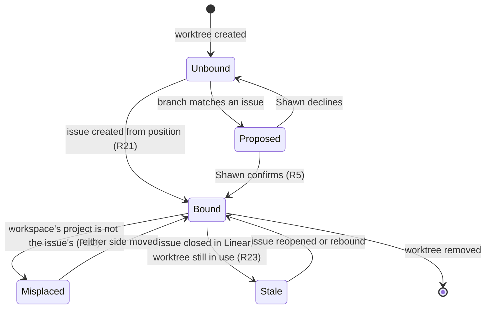

# Herdr and Linear as One Graph - Plan

## Goal Capsule

- **Objective:** Linear stays an accurate record of Slate work without maintaining it being a task of its own, a Claude session in any pane knows which Linear issue it is working on without being told, and the herdr layout can be built from the Linear hierarchy rather than assembled by hand.
- **Product authority:** Shawn. He confirms every binding and approves every write that needs judgment.
- **Open blockers:** None. Every question that would have blocked planning is resolved; the rest are recorded under Outstanding Questions as deferred to planning.

---

## Product Contract

### Summary

A Claude Code plugin that binds each Slate git worktree to a Linear issue, grounds any session opened in that worktree with the issue's context, and writes work back to Linear as it happens. Mechanical changes are written without asking; anything needing judgment is proposed first.

### Problem Frame

Linear is the model the work is organised around. The herdr layout is built to match it: a workspace holds a project's work, a tab holds a cluster of related issues, and each column in that tab is a piece being worked separately. That correspondence is real today — of the six multi-pane tabs currently open, four map cleanly onto an issue and the issues beneath it.

The correspondence is not recorded anywhere. A session opening in a pane sees a working directory and nothing else, so every session begins by re-establishing what it is working on. In the other direction, Linear only changes when someone stops and updates it. Because that is a separate act performed after the work, it is the act that gets skipped, and Linear drifts from what is true.

The drift is visible in the layout as well. One open tab groups four pieces of work under a name matching none of them. One worktree appears as a column in two different tabs at once. Neither is recoverable from the layout alone.

The cost is paid twice per piece of work: once re-establishing context that the layout already implies, and once reconciling a record that has fallen behind.

### Key Decisions

- KD1. **Both directions are required.** Linear is the mental model and the layout expresses it, so neither side can be read-only. (session-settled: user-directed — chosen over a one-way sync: a record that only receives, or only feeds, leaves the other side to be maintained by hand.) Governs R11, R15, R24.
- KD2. **The worktree carries the binding.** (session-settled: user-approved — chosen over storing it in the pane's environment: panes move between tabs and workspaces and their identifiers change, so a pane-held binding would be lost and re-asked exactly when the layout is rearranged.) Governs R1, R8.
- KD3. **Inference proposes; the user confirms; the confirmation is the binding.** (session-settled: user-directed — chosen over treating a name match as authoritative: a wrong write to Linear costs more to find and undo than no write.) Governs R2, R3, R4, R5, R6, R7, R9, R21.
- KD4. **Mechanical changes are automatic, judgment calls are asked, nothing blocks.** (session-settled: user-directed — chosen over confirming every write, which rebuilds the maintenance task it removes, and over a hook that holds a session open until Linear matches, which can trap any pane where the honest answer is "not finished".) Governs R15, R17, R18, R19.
- KD5. **A herdr workspace is bound to a Linear project the same way a worktree is bound to an issue.** (session-settled: user-directed — chosen over deriving the project from the issues inside the workspace, which says nothing about an empty or mixed workspace, and over fuzzy name matching, which is the confident-wrong-guess failure already ruled out for issues.) Governs R9, R10, R22.
- KD6. **Slate work only.** (session-settled: user-directed — chosen over applying to every repository: the mapping is meaningful for Slate work and noise everywhere else.) Governs R26.
- KD7. **A Claude Code plugin, with no herdr-side change to read the topology or display binding state.** The herdr CLI covers both today. It does not yet cover durable, rename-stable storage for the workspace binding, so resolving where that lives is the first planning step that could reopen this decision.
- KD8. **The plugin lives in this repo.** It sits beside the existing plugins and inherits their marketplace wiring. (session-settled: user-directed — chosen over a standalone repository.)
- KD9. **A created issue follows the house conventions, not the plugin's own shape.** Writing correctly-stated issues is a separate concern from writing them at the right time, so the shape lives in its own document that a person can edit without touching the plugin. Governs R29.
- KD10. **Linear and the repository are untrusted inputs.** Anyone with tracker access can write the text the plugin turns into paths, arguments, and session context, and a repository event can be stale or replayed. Governs R7, R16, R27, R28.

### Actors

- A1. Shawn — confirms bindings, approves writes that need judgment, and owns what Linear says.
- A2. The session agent — reads its context from the binding, proposes bindings and judgment writes, performs approved writes.
- A3. herdr — holds the layout and is the source of a pane's position.
- A4. Linear — the record of the work and the source of issue identity, state, and hierarchy.

### Requirements

**Binding**

- R1. Every bound piece of work is identified by its git worktree.
- R2. The plugin proposes a binding by matching a worktree's branch against the branch name Linear supplies for an issue, and never writes to Linear on the strength of a proposal alone.
- R3. When branch matching yields no candidate, the plugin offers candidates drawn from the workspace's bound Linear project, still under propose-and-confirm.
- R4. A candidate Shawn declines is not proposed again for that worktree.
- R5. A binding becomes authoritative only when Shawn confirms it, and then persists for the life of the worktree.
- R6. A confirmation is accepted only from an interactive human session; in an unattended session the worktree stays proposed and nothing is written to Linear.
- R7. A binding is never read from version-controlled repository content, so only a binding the plugin itself wrote through a confirmation is authoritative.
- R8. A confirmed binding survives a pane moving between tabs or workspaces, a tab being renamed, and herdr restarting.
- R9. A herdr workspace is bound to a Linear project by the same propose-and-confirm step, and the plugin never assumes the correspondence from the two names.
- R10. A confirmed workspace binding survives the workspace being renamed.

**Grounding a session**

- R11. A session started in a bound worktree receives its Linear issue's context without asking for it.
- R12. That context carries the issue's identity, its current state, and its position in the project and parent-issue hierarchy.
- R13. A session started in an unbound worktree starts normally and says that it is unbound.
- R14. Grounding bounds how long it waits on Linear and herdr; when either is unreachable the session starts with an explicit notice that its context is unavailable, and nothing is written until authoritative state is known.

**Writing back**

- R15. At a session event in a bound worktree the plugin compares the repository's current state against Linear's and writes, without asking, any mechanical difference that Linear's own GitHub integration does not already write.
- R16. An automatic write is made only from an authenticated, current event tied to the confirmed binding, and any signal that cannot be verified is handled as a judgment change instead.
- R17. A change that requires judgment is proposed to Shawn and written only once he approves it.
- R18. A judgment change Shawn has not answered is retained with the binding and re-presented once at the start of the next session in that worktree, until he approves or dismisses it.
- R19. Nothing the plugin installs prevents a session from ending.

**Untidy states**

- R20. Working without a Linear issue is a supported state, and the plugin never requires one to be created.
- R21. On request, the plugin creates the Linear issue for an unbound worktree, proposing a parent from the herdr surface that worktree occupies and creating the issue with no parent when Shawn does not confirm one.
- R22. When a bound worktree sits in a workspace whose bound project is not its issue's project, the plugin reports the mismatch and offers to change either side.
- R23. When a bound issue is closed in Linear while its worktree is still in use, the plugin reports it and changes nothing on its own.

**Layout as intent**

- R24. Creating a tab from a Linear issue creates the herdr surface and a worktree for each issue beneath it that is to be worked.
- R25. Splitting a column to start unplanned work offers to create a sub-issue under the issue that tab was created from.

**Boundaries**

- R26. The plugin acts only on repositories under the Slate project root and does nothing elsewhere.
- R27. The Linear credential is held in the macOS Keychain through the existing secrets accessor, and never reaches a file, an environment variable, a command argument, or any diagnostic output.
- R28. Every string the plugin takes from Linear is untrusted input, validated before it becomes a path, a branch name, or a command argument, and stripped of terminal control sequences before it is displayed.
- R29. Every Linear object the plugin creates or updates follows the documented issue conventions in `docs/linear-conventions.md`, and the plugin asks rather than guessing on anything that document lists as unsettled.

### Binding states

The binding is the plugin's central object, and most of its behavior is which state a worktree is in and what moves it.

Only `Bound` permits an automatic write. `Proposed`, `Misplaced`, and `Stale` are reported and wait for Shawn.

### Key Flows

- F1. Grounding a session
  - **Trigger:** A session starts in a worktree under the Slate root.
  - **Actors:** A2, A3, A4
  - **Steps:** Resolve the worktree from the working directory; look up its binding; fetch only the R12 fields for the issue and its hierarchy; hand the session that context, with the issue title carried as quoted data rather than as session instructions.
  - **Outcome:** The session knows its issue, or says it is unbound.
  - **Covers R11, R12, R13, R14, R26**

- F2. Binding a worktree
  - **Trigger:** A session starts in an unbound worktree, or Shawn asks to bind one.
  - **Actors:** A1, A2, A4
  - **Steps:** Match the worktree's branch against Linear's branch names; present the candidates; Shawn picks one, asks for a new issue, or declines.
  - **Outcome:** The worktree is bound, or stays unbound with nothing written.
  - **Covers R2, R3, R4, R5, R6, R20, R21, R29**

- F3. Writing a mechanical change
  - **Trigger:** A repository event occurs in a bound worktree.
  - **Actors:** A2, A4
  - **Steps:** Verify the event is authentic and current; derive the corresponding Linear state; write it; record that it was written.
  - **Outcome:** Linear matches the repository without anyone acting.
  - **Covers R15, R16, R18**

- F4. Reconciling a misplacement
  - **Trigger:** A bound worktree sits in a workspace whose bound project is not its issue's project.
  - **Actors:** A1, A2, A3, A4
  - **Steps:** Report both sides; Shawn chooses to move the pane or to re-parent the issue; apply the chosen side.
  - **Outcome:** The two agree, by Shawn's choice of which was wrong.
  - **Covers R22**

- F5. Laying out an issue
  - **Trigger:** Shawn asks for a tab for a Linear issue.
  - **Actors:** A1, A2, A3, A4
  - **Steps:** Read the issue and the issues beneath it; validate every name taken from Linear; create the tab; create a worktree and column per issue to be worked; bind each on creation.
  - **Outcome:** The layout matches the issue, already bound.
  - **Covers R24, R28**

### Acceptance Examples

- AE1. **Covers R2, R5.** Given a worktree whose branch contains an issue identifier anywhere in it, when a session starts there, then the plugin offers that issue as a candidate and Linear is unchanged until Shawn confirms.
- AE2. **Covers R8.** Given a bound worktree, when its pane is moved to a different tab in a different workspace, then the next session there is grounded without being asked to confirm the binding again.
- AE3. **Covers R15, R17.** Given a bound worktree, when its pull request merges, then the issue moves to its completed state without asking; when the work is finished with no pull request, then the plugin asks before moving it.
- AE4. **Covers R20.** Given an unbound worktree, when sessions run in it repeatedly, then the plugin does not create an issue and does not repeat the request to create one.
- AE5. **Covers R22.** Given a bound worktree whose pane has been moved into a workspace bound to a different project, when the plugin next runs, then it reports the mismatch and offers both to move the pane back and to re-parent the issue, and applies neither on its own.
- AE6. **Covers R23.** Given a bound issue that is closed in Linear, when its worktree is still being worked, then the plugin reports the closure and does not reopen the issue.
- AE7. **Covers R26.** Given a worktree outside the Slate project root, when a session starts there, then the plugin does nothing and says nothing.
- AE8. **Covers R9.** Given a workspace whose label resembles a project name, when the plugin first needs the correspondence, then it proposes that project and treats the workspace as unbound until Shawn confirms.
- AE9. **Covers R25.** Given a tab created from an issue, when a new column is split off in it, then the plugin offers to create a sub-issue under that issue and leaves the new worktree unbound if Shawn declines.
- AE10. **Covers R6, R7.** Given an unattended session started in a Slate worktree, when it reaches an unbound worktree or a binding file present in the checked-out branch, then the worktree stays unbound and nothing is written to Linear.
- AE11. **Covers R4.** Given a worktree whose proposed candidate Shawn declined, when a session starts there again, then the plugin does not offer that candidate a second time.
- AE12. **Covers R14.** Given Linear is unreachable, when a session starts in a bound worktree, then the session starts within the lookup bound, says its context is unavailable, and writes nothing to Linear.
- AE13. **Covers R18.** Given a judgment change proposed as a session ends and left unanswered, when the next session starts in that worktree, then the proposal is presented once more.
- AE14. **Covers R21.** Given an unbound worktree in a tab that was not created from an issue, when Shawn asks for an issue to be created, then the plugin proposes a parent, and creates the issue with no parent when he does not confirm one.

### Scope Boundaries

- Enforcement beyond what KD4 settles, per R19.
- Any change to herdr. The plugin uses the herdr CLI as it is.
- Non-Slate work, including this repository. The plugin cannot be exercised on its own development, so it will need a Slate worktree to test against.
- Bulk correction of existing layout drift. The anomalies currently open are inputs to the design, not work items.
- Reporting, dashboards, or metrics derived from the binding.

### Dependencies / Assumptions

- herdr 0.8.2 is installed and its server is reachable. Verified against the running installation: `api snapshot` returns the full topology including per-tab split direction and pane geometry; `pane report-metadata` and `workspace report-metadata` write display metadata; `tab create` and `pane split` accept `--env` and `--cwd`.
- Linear supplies a canonical git branch name per issue, which is what R2 matches against. Most Slate branches do not carry it: 16 of 86 worktree branches contain a Linear identifier, and where it appears it sits after a `feature/`, `task/`, or `bugfix/` prefix rather than at the start, in both hyphenated and unhyphenated spellings. R2 therefore produces a candidate for a minority of worktrees.
- A per-worktree Linear pin already exists on this machine: `~/.claude/hooks/linear-pin.sh` runs as a `PostToolUse` hook on `mcp__linear__.*` and keeps a per-session and per-repository-and-branch record. It covers part of R1, R5, and R8. The plugin's binding store extends that record rather than standing a second one beside it, re-keyed on the worktree so a branch rename does not lose the binding.
- Linear's GitHub integration is already live for the Web Creation team and writes part of what R15 would write. Verified on WEB-3172: an attachment for `slateteams/web-app#5433` was created automatically from the branch name, and the issue moved Todo to In Progress to Done with no manual step. R15 therefore covers only the transitions that integration does not make. Which transitions those are is a planning question.
- The plugin observes the world only while a session runs, because a Claude Code plugin executes when one of its hooks fires. An event that happens with no session open is picked up by the next session in that worktree, not at the moment it occurs.
- Linear has no command-line client on this machine, so writes go through its API. `plugins/spawn/lib/secrets.sh` is the existing credential pattern in this repo and stores secrets in the macOS Keychain; `plugins/spawn/lib/sanitize.sh` is the existing accessor for untrusted text bound for a terminal.
- No Linear integration exists in this repo today. `plugins/spinoff/skills/spinoff/SKILL.md` states that its script "has no Linear access and never looks one up".
- Slate work is everything under the Slate project root, and it spans more than one Linear team. Every currently-open Slate pane sits on a Web Creation issue, but the web-app main checkout sits on a Frontend Guild branch. The team is therefore resolved per worktree, and R21 takes the team for a new issue from the workspace's bound project.
- A tab groups related issues rather than strictly one issue and its children. One open tab holds an issue and its own parent as sibling columns, so R25 attaches a new sub-issue to the issue the tab was created from rather than inferring a parent from the neighbouring columns.
- Which of the drift moments costs the most is not established. All of them are treated as in scope, sorted by R15 and R17 rather than by priority.
- The pane tree does not name columns directly. Column membership is derived from pane geometry within a tab's layout, which the snapshot exposes.

### Outstanding Questions

**Deferred to planning**

- Where a confirmed binding is stored so that it travels with the worktree and satisfies R7, and where a workspace binding is stored so that it survives a herdr restart.
- Which repository events map to which Linear states, and how each is verified as authentic and current under R16.
- Whether the currently-open worktrees are bound by a one-time pass or one at a time as they are next used.
- Whether a session writes a summary of what it did to the issue, and whether that is proposed under R17 or left out of the first version.
- How a worktree that is removed while its issue is open is handled.
- Whether "an accurate record" means issue state and hierarchy only, or also a written account of what was done. The writeback requirements move state; the summary write is undecided, so the objective currently reads broader than the requirements deliver.
- Which requirements constitute the first version. There are 29 with no ordering, so planning has no signal for what to cut if the build runs long.
- How the Slate-root containment of R26 is decided, given that a string prefix admits a sibling directory and an unresolved symlink admits anything it points at.

### Sources / Research

- `plugins/spinoff/skills/spinoff/scripts/spinoff.sh` — creates the worktree and the herdr surface in one flow, passing the worktree as `--cwd` to `herdr workspace create`, and injects session context through a brief file read at launch rather than through the environment. The existing worktree-to-surface pairing this plan attaches an issue to.
- `~/.claude/hooks/linear-pin.sh` and its store under `~/.claude/linear-pin/` — the live per-session and per-branch Linear pin this plugin's binding extends.
- `plugins/spawn/lib/secrets.sh` — the repo's only Keychain accessor; the precedent R27 commits to.
- `plugins/spawn/lib/sanitize.sh` — the existing accessor for untrusted text reaching a terminal; the precedent R28 commits to.
- `plugins/spawn`, `plugins/auto`, `plugins/reflect`, `plugins/comment-cut` — each carries `.claude-plugin/plugin.json`, `.claude/hooks/hooks.json`, and `skills/`. `plugins/spinoff` has no hooks, so it is the layout precedent but not the hook precedent.
- `docs/linear-conventions.md` — the issue, sub-issue, label, and milestone conventions R29 binds the plugin to, derived from issues written in the Web Creation team during 2026.
- `CONCEPTS.md` — defines the binding vocabulary this plan uses.
- The live herdr topology and representative Linear issues were read directly during this brainstorm. Four of six multi-pane tabs map cleanly onto an issue and the issues beneath it; one holds a parent and child as siblings; one worktree appears in two tabs. A Linear issue returns its branch name, project, parent, and team in a single read.
