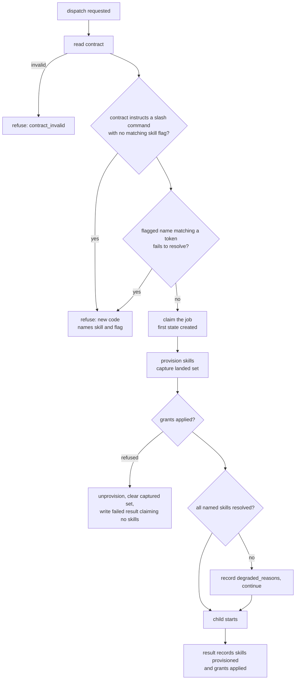

# Spawn Provision Contract Check - Plan

## Goal Capsule

- **Objective:** An operator can never receive a finished spawn job that silently lacked a skill the job was instructed by a literal slash command to run, or a skill it was named and could not resolve.
- **Means:** Refuse the dispatch before the child starts, and record on every result what was actually provisioned (KTD1, KTD4).
- **Product authority:** The `bg-agent` and `team` dispatch surfaces of the `spawn` plugin. `spawn:agent`, `spawn:lens`, and `spawn:session` are not active scope.
- **Stop conditions:** Stop and ask if the refusal cannot be made synchronous before the job is claimed, or if scanning the contract requires reading a field the child never receives.
- **Open blockers:** None.

**Product Contract preservation:** changed — R11 removed (the authoring guidance it asked for already ships at both surfaces and did not prevent the failure); R12 and R13 added (a flagged skill that cannot resolve reaches the same bad ending, and a member refused by this check must not be admitted for a retry that reapplies identically). R3, R7 and R12 were widened during document review; all other requirements unchanged.

---

## Product Contract

### Summary

Refuse a `bg-agent` or team-member dispatch whose contract instructs a slash command the job cannot run — because the skill was never named, or because the name it was given does not resolve — before the child starts. Record on every job result which skills were actually provisioned, the way results already record grants.

### Problem Frame

A `bg-agent` or team child runs under `--setting-sources project` and inherits nothing from its launcher. A skill exists for that child only when the dispatch names it with `--skill`.

The two provisioning outcomes are not equally visible. A named skill that fails to provision is recorded in `degraded_reasons[]` and the job continues (`plugins/spawn/lib/bg-agent.sh`). A skill that was never named produces no signal at all — no error, no reason, no field on the result.

The child does not stop when a skill it was told to use is absent. It improvises something shaped like the missing skill and returns a finished deliverable. The operator's first contact with the failure is reading that deliverable and finding the work was not done the way the contract asked. At that point the evidence points at the model, not at the dispatch, so the operator loses confidence in the child for a defect in how the job was launched.

Nothing pushes the existing diagnostic toward the operator either: the notification envelope carries `terminal_state` and `deliverables_satisfied` but not `degraded_reasons` (`plugins/spawn/lib/bg-agent.sh`), so the record is read only by an operator who already suspects a problem.

Instruction has already been tried. `plugins/spawn/commands/bg-agent.md` warns that a job told to "run ce-code-review" with no such skill "improvises something shaped like a review and files a narrative that reads exactly like the real thing", and `plugins/spawn/skills/team-run/SKILL.md` says the same for members. Both shipped in commit `40df34d`. The failure this plan fixes happened afterwards.

### Actors

- A1. **Operator** — writes the intent and reads the returned deliverable. Does not read the job record unless already suspicious.
- A2. **Authoring agent** — turns the intent into a dispatch: writes the contract text and chooses the `--skill` and `--allow` flags. This is where the flag goes missing.
- A3. **Supervisor** — the dispatch path that provisions skills, applies grants, and writes the job record.
- A4. **Child** — the job itself. Has only what A3 provisioned, and improvises rather than stopping when a named skill is absent.

### Key Decisions

- **Refuse the dispatch rather than warn on the result.** The operator finds this bug by reading a wrong deliverable, so a signal they must connect back to that deliverable does not land. *(session-settled: user-directed — chosen over a non-blocking warning in the returned result: a warning still produces the wrong deliverable and leaves the operator to attribute it.)* Governs R1, R3.
- **Trigger only on a literal slash-command token.** A slash token is text the contract contains; a need expressed in prose is intent the plugin would have to guess. *(session-settled: user-directed — chosen over a matcher that reads contract prose for implied needs: prose inference contradicts the explicit-only precedent in `docs/plans/2026-08-25-1730-feat-grantable-bash-for-background-jobs-plan.md` and `docs/plans/2026-08-12-001-feat-spawn-caller-granted-sandbox-plan.md`.)* Governs R2.
- **No override.** An escape hatch reopens the silent path this work exists to close. *(session-settled: user-directed — chosen over a refuse-with-explicit-opt-out variant: the cost is that a contract mentioning a slash command in prose must be reworded.)* Governs R5.
- **Refuse a named skill that cannot resolve, not only one never named.** A flagged-but-unresolvable name reaches the identical ending — a finished deliverable missing the method it was promised. *(session-settled: user-directed — chosen over leaving that case to the existing degraded path: the degraded path is the one the operator does not read.)* Governs R12.
- **Give skills the manifest that grants already have.** Results already carry applied grants (`plugins/spawn/lib/bg-agent.sh`) and skills have no equivalent field, so this is a symmetry fix. *(session-settled: user-directed — chosen over detection alone and over also detecting missing grants.)* Governs R7, R8.
- **A refused member fails that member; the round continues.** A refused `--allow` grant already fails one member without stopping the round (`plugins/spawn/lib/team-dispatch.sh`), and the refusal is recorded, so a partially dispatched round is not a silent one. Governs R9, R10, R13.
- **`--setting-sources project` stays.** It is the lever that makes a child genuinely narrower than its launcher, and this work closes a diagnostic gap rather than changing the isolation model. *(session-settled: user-directed — chosen over widening what a child inherits: inheritance would remove the isolation the flag exists to provide.)*
- **Do not add authoring guidance.** Both dispatch surfaces already name this exact failure with this exact skill, and the failure still occurred. *(session-settled: user-directed — chosen over sharpening the existing equip sections: more prose in a document that already says this would not change the outcome.)*

### Requirements

**Dispatch refusal**

- R1. A `bg-agent` or team-member dispatch is refused before the child process starts when the job's contract instructs a slash command whose skill was not provisioned to that job.
- R2. The check triggers only on a literal slash-command token in the contract text. A skill need expressed in prose does not trigger it.
- R3. The refusal names the skill the contract instructed, the flag that would have supplied it, and the alternative of removing the literal token when it was not an instruction.
- R4. Matching treats a bare skill name and its namespaced form as the same skill, in both directions.
- R5. No flag, environment variable, or configuration value permits a dispatch to proceed past this refusal.
- R6. The refusal is returned in the shape of the existing dispatch-time refusal taxonomy, so an existing consumer of dispatch errors reads it without changing how it parses them.
- R12. A dispatch is refused on the same terms when any skill named for that job cannot be resolved, whether or not it matches a contract token.

**Provision visibility**

- R7. Every `bg-agent` job result and its notification envelope record the skills the job was actually provisioned with, and record the empty set as a value rather than omitting the field.
- R8. A team member record carries the provisioned-skills fact the same way it already carries applied grants.

**Team behaviour**

- R9. A member refused under R1 or R12 fails as that member. The remaining members of the round still dispatch.
- R10. A member refused under R1 or R12 is distinguishable on the run record from a member that failed for any other cause.
- R13. A member refused under R1 or R12 is not admitted for retry, because the contract text and the skill flags are fixed on the record and the retry would fail identically.

### Acceptance Examples

- AE1. **Covers R1, R3.** Given a contract whose task reads "run `/ce-code-review` over the diff", when it is dispatched with no `--skill`, then the dispatch is refused before any child starts and the error names `ce-code-review` and `--skill`.
- AE2. **Covers R2.** Given a contract that reads "the sort of problem ce-code-review would catch", with no slash token, when it is dispatched with no `--skill`, then the dispatch proceeds.
- AE3. **Covers R2, R5.** Given a contract that reads "do not bother running `/ce-code-review`", when it is dispatched with no `--skill`, then the dispatch is refused and no override permits it to proceed. This is the accepted cost of R5; the contract is reworded or the flag is supplied.
- AE4. **Covers R4.** Given a contract containing `/ce-code-review` dispatched with `--skill compound-engineering:ce-code-review`, then the dispatch proceeds.
- AE5. **Covers R4.** Given a contract containing `/compound-engineering:ce-code-review` dispatched with `--skill ce-code-review`, then the dispatch proceeds.
- AE6. **Covers R12.** Given a contract containing `/ce-code-reviw` dispatched with `--skill ce-code-reviw`, then the dispatch is refused because the name does not resolve, rather than running and degrading.
- AE7. **Covers R7.** Given a job whose contract names no slash command, dispatched with no `--skill`, when it completes, then its result records an empty provisioned-skills set as a value.
- AE8. **Covers R7.** Given a job that is refused a grant and never starts its child, when its failed result is written, then that result does not claim any provisioned skills.
- AE9. **Covers R9, R10.** Given a three-member round in which one member's contract instructs an unprovisioned skill, when the round dispatches, then that member fails carrying the refusal cause and the other two members dispatch normally.
- AE11. **Covers R12.** Given a prose-worded contract naming no slash token, dispatched with `--skill ce-code-reviw`, then the dispatch is refused because the flagged name does not resolve.
- AE12. **Covers R3, R5.** Given a contract instructing `/clear`, when it is dispatched, then it is refused and no `--skill` value can satisfy it, because the flag would itself fail to resolve. The error names removing the token as the remedy.
- AE13. **Covers R4.** Given a contract instructing `/compound-engineering:ce-code-review` dispatched with `--skill other-plugin:ce-code-review`, then the dispatch is refused, because both sides carry a namespace and the namespaces differ.
- AE10. **Covers R13.** Given a member that failed under R1, when an operator retries that member, then the retry is refused with the same treatment `grant_refused` receives rather than admitted and failed again.

### Scope Boundaries

- Inferring a tool or skill need from contract prose. Settled as explicit-only in `docs/plans/2026-08-25-1730-feat-grantable-bash-for-background-jobs-plan.md` and `docs/plans/2026-08-12-001-feat-spawn-caller-granted-sandbox-plan.md`.
- Detecting a missing `--allow` grant. No literal token expresses a tool need, and results already carry an applied-grants manifest.
- Widening what a child inherits, including any change to `--setting-sources project`.
- `spawn:agent` and `spawn:lens`, which have no tools to load a skill into, and `spawn:session`, which already inherits the operator's skills.
- Changing the authoring guidance at either dispatch surface.
- A skill that resolves at dispatch but fails to provision after the claim. It records `degraded_reasons` and the job runs, per the shipped decision at `plugins/spawn/lib/bg-agent.sh` — "a missing skill makes a job worse at its task, while refusing to start makes it impossible". Reversing that is its own change with its own argument.

#### Deferred to Follow-Up Work

- A slash token inside a fenced code block or a quoted path still refuses. The token grammar cannot separate a quoted mention from a live instruction, and R5 leaves no override.
- A slash token that is not a skill at all — a CLI built-in such as `/clear`, or a single-segment absolute path such as `/tmp` — is refused by R1 and cannot be satisfied by any `--skill` value, because R12 then refuses the flag. The contract must be reworded. No contract in this repo currently contains such a token, so the class is prospective.

Track both after landing: compare refusals cleared by adding `--skill` against those cleared by rewording the contract. A rising share of rewords is the erosion signal — deleting the slash is the cheapest way past an unoverridable refusal, and it lands the dispatch on the unequipped path AE2 permits.

### Dependencies / Assumptions

- Assumption: operators and authoring agents write an instructed skill in the literal `/name` form. The reported case does; a contract that names a skill without a slash is not covered.
- Assumption: `plugins/spawn/tests/run-tests.sh` exits non-zero on `main` for a pre-existing secret-scan hit in `plugins/reflect/tests/`. Reported in the source handoff and not confirmed by the learnings corpus — confirm on the first suite run and read the per-file verdict rather than the exit code either way.
- Verified: results already carry applied grants, so R8 extends an existing shape.
- Verified: `bash` 3.2 is the target — no associative arrays and no `mapfile` anywhere in `plugins/spawn/lib/`.

---

## Planning Contract

### Key Technical Decisions

- KTD1. **Place the gate in the launcher, immediately after the contract is read.** `plugins/spawn/lib/team-dispatch.sh` dispatches each member by shelling out to `bg-agent.sh`, so one gate covers both surfaces. Do not copy the `--allow` check as a model: it runs in the detached supervisor (`plugins/spawn/lib/bg-agent.sh`) and would fire after the handle already returned. Copy `contract_invalid` (`plugins/spawn/lib/bg-agent.sh`), which refuses synchronously. Governs R1, R9, R12.
- KTD2. **Scan `task` and `done_means`; exclude `verify`.** Those two become the child's prompt. `verify` is a shell command string the supervisor runs itself, so a slash there is shell syntax rather than an instruction, and scanning it would refuse legitimate commands. `deliverables` is a path list, not instruction text, and is excluded on the same grounds. Governs R2.
- KTD3. **Write a purpose-built token grammar; do not reuse `spawn::skill_name_ok`.** That function is resolver-safety grammar and accepts a trailing `.`, so a naively extracted `/ce-code-review.` would compare as a different skill and false-refuse a correctly flagged job. The scanner needs its own boundary rules and must strip trailing punctuation before comparing. Comparison is namespace-aware: when both the token and the flag carry a plugin prefix, the full `plugin:name` must match, because `spawn::skill_resolve` filters on the plugin key (`plugins/spawn/lib/skills.sh`) and a last-segment match would let another plugin's same-named skill satisfy the gate. Governs R2, R4.
- KTD4. **Capture the provisioned set once, in supervisor memory, on every path.** Mirror `SUP_GRANTS_APPLIED`. The manifest lives under the worktree's `.spawn`, which a Bash-granted child can write, so it is never re-read after the child starts. Clear the captured value on every path that unprovisions before the child starts, or a failed result claims skills that never ran. Governs R7, R8.
- KTD5. **Resolve every flagged name at dispatch, before anything is claimed.** `spawn::skill_resolve` is local and cheap, and nothing is claimed at the gate's position, so a resolution failure can refuse without stranding state. Every `--skill` value is resolved, not only those matching a contract token, because a typo on a prose-worded contract reaches the same ending. *(session-settled: user-directed — chosen over leaving flagged-but-unresolvable names to the existing degraded path: that path produces the same finished-but-unequipped deliverable the Objective forbids.)* Governs R12.
- KTD7. **The refusal's error value is a new entry in the existing taxonomy at exit 2.** It appears in `error_values` (`plugins/spawn/lib/bg-agent.sh`), the `--describe` output, `remedy_for`, and the retry `error_values` table in `plugins/spawn/lib/team.sh`, so a caller reading any surface finds it. Governs R6.
- KTD6. **Add the new code to the retry causes that reapply identically.** `plugins/spawn/lib/team-advance.sh` lists `worktree_failed|worktree_missing|grant_refused`. Contract text and skill flags are fixed on the record exactly as an allow-list is. Governs R13.

### High-Level Technical Design

Both refusals sit before the claim at `plugins/spawn/lib/bg-agent.sh`, so nothing is stranded: no lock, no job directory, no git-exclude entry. The existing provisioning check at `H` asks whether a *named* skill resolved and lets the job run; the new gates ask whether a needed skill was named at all, and whether a name that was given can resolve, and refuse.

### Assumptions

- The error value's name is an implementation choice; where it must appear is owned by KTD7.
- `die` prints to stderr while `emit_error` writes the JSON envelope to stdout, which `team_launch_member` reads and records as `.failure.error` (`plugins/spawn/lib/team-dispatch.sh`). R9 and R10 need no plumbing change beyond the taxonomy entries.

### Open Questions

**Deferred to implementation** — neither blocks the plan.

- Whether the two refusal causes — a skill instructed but never named, and a named skill that cannot resolve — share one error value or take two. R10 requires only that they be distinguishable from other causes, but the remedies differ (supply a flag versus fix a typo) and R3 must name the right one.
- Whether the token grammar should treat a single-segment absolute path differently from a bare skill token, given that rule 4 already rejects multi-segment paths.

### Sequencing

U1 is a pure function and lands first. U2 consumes it. U3 and U5 depend only on U2's error value existing. U4 additionally depends on U3, because it propagates the skills field U3 creates.

---

## Implementation Units

### U1. Slash-command token scanner

- **Goal:** A function that extracts the set of skill names a contract text instructs, and a comparison that treats bare and namespaced forms as one skill.
- **Requirements:** R2, R4
- **Dependencies:** none
- **Files:** `plugins/spawn/lib/skills.sh`, `plugins/spawn/tests/unit/skills.bats`
- **Approach:**
  1. Add an extractor to `skills.sh` beside the existing name helpers. Per KTD3 it is a new grammar, not a call to `spawn::skill_name_ok`.
  2. A token starts at `/` preceded by start-of-string, whitespace, a backtick, a quote, `(` or `[`; the character before `/` must not be alphanumeric, which is what excludes `https://host/name` and `/usr/bin/thing`.
  3. Capture `[A-Za-z0-9][A-Za-z0-9._:-]*`, then strip trailing `.,;:!?)` before the name is used.
  4. Reject a candidate immediately followed by `/`.
  5. Compare per KTD3: the full `plugin:name` when both sides carry a namespace, and the segment after the last `:` only when one side is bare.
  6. Use `[[ =~ ]]` with `BASH_REMATCH` and `case " $list " in *" $x "*)` string containment — bash 3.2 has no associative arrays.
- **Patterns to follow:** the existing helpers in `plugins/spawn/lib/skills.sh`; the string-containment idiom at `plugins/spawn/lib/bg-agent.sh`.
- **Execution note:** Write the scanner test-first. The grammar's whole value is which strings it refuses to match, and those cases are cheaper to state as tests than to reason about in the shell.
- **Test scenarios:**
  - `/ce-code-review` at the start of the text yields `ce-code-review`.
  - `/ce-code-review` mid-sentence after a space yields the same name.
  - A trailing period, comma, or closing paren is stripped from the captured name.
  - `https://example.dev/ce-code-review` yields nothing.
  - `/usr/bin/thing` yields nothing.
  - A token inside a word, such as `x/ce-code-review`, yields nothing.
  - `/compound-engineering:ce-code-review` and `/ce-code-review` compare as the same skill.
  - `--skill compound-engineering:ce-code-review` matches a bare token, and `--skill ce-code-review` matches a namespaced token.
  - Empty text yields the empty set rather than an error.
  - A text with two distinct tokens yields both.
- **Verification:** the scanner's own bats file passes, and each assertion has been proved by breaking the line it guards and seeing that assertion go red.

### U2. The dispatch gate

- **Goal:** A dispatch that instructs a skill it cannot run is refused before anything is claimed.
- **Requirements:** R1, R3, R5, R6, R12; Covers AE1, AE2, AE3, AE4, AE5, AE6, AE11, AE12, AE13
- **Dependencies:** U1
- **Files:** `plugins/spawn/lib/bg-agent.sh`, `plugins/spawn/tests/unit/supervisor.bats`
- **Approach:**
  1. Insert the gate immediately after `read_contract` succeeds (`plugins/spawn/lib/bg-agent.sh`), per KTD1.
  2. Scan `CONTRACT_TASK` and `CONTRACT_DONE` only, per KTD2.
  3. For each token with no matching `--skill`, refuse with `die "$EX_USAGE" "<new-code>" "..."`, naming the skill and the flag per R3.
  4. Resolve every `--skill` value with `spawn::skill_resolve` and refuse the same way on failure, per KTD5 — not only values matching a contract token.
  5. Register the new error value on every surface KTD7 names.
  6. Fail closed: an unreadable contract already refuses as `contract_invalid` upstream; an empty `--skill` value refuses rather than counting as a match.
- **Patterns to follow:** the `contract_invalid` refusal at `plugins/spawn/lib/bg-agent.sh` and `die` in `plugins/spawn/lib/common.sh`. Do **not** follow the grant check at `:996-1007` — it runs in the detached supervisor.
- **Test scenarios:**
  - Covers AE1. A contract instructing `/ce-code-review` with no `--skill` exits 2, and the error names both the skill and the flag.
  - Covers AE6. A contract instructing `/ce-code-reviw` with `--skill ce-code-reviw` exits 2 because the name does not resolve.
  - Covers AE11. A prose-worded contract naming no slash token, dispatched with `--skill ce-code-reviw`, exits 2 because the flagged name does not resolve.
  - Covers AE12. A contract instructing `/clear` cannot be satisfied by any `--skill` value and is refused; the error names the reword remedy.
  - Covers AE4, AE5. A contract instructing a token that matches a passed `--skill` in either namespacing direction dispatches normally.
  - Covers AE13. A contract instructing `/compound-engineering:ce-code-review` dispatched with `--skill other-plugin:ce-code-review` is refused, because both sides carry a namespace and they differ.
  - Covers AE2. A contract mentioning a skill without a slash dispatches normally with no `--skill`.
  - Covers AE3. A contract reading "do not run `/ce-code-review`" is refused; no environment variable or flag lets it through.
  - A refused dispatch leaves no lock and no launch: assert on the job lock path and on the fake claude binary's recorded argv, both absent.
  - A contract with an empty `task` and no tokens dispatches normally.
  - The new error value appears in `--describe` output.
- **Verification:** `bats plugins/spawn/tests/unit/supervisor.bats` passes; a refused dispatch creates no state under the job directory; every new assertion has been mutation-proved.

### U3. Provisioned skills on the job result

- **Goal:** Every job result and notification states which skills actually landed, including none.
- **Requirements:** R7; Covers AE7, AE8
- **Dependencies:** U2
- **Files:** `plugins/spawn/lib/bg-agent.sh`, `plugins/spawn/tests/unit/supervisor.bats`
- **Approach:**
  1. Hoist an unconditional capture of the provisioned set into a supervisor variable mirroring `SUP_GRANTS_APPLIED` (`plugins/spawn/lib/bg-agent.sh`). Today the equivalent value is computed only inside the failure branch at `:976`, so the success path records nothing.
  2. Read it from the manifest once, before the child starts, and never again — per KTD4 the manifest is child-writable.
  3. Thread it into the result object beside `grants` (`plugins/spawn/lib/bg-agent.sh`) AND into the notification envelope beside `grants:$gr` (`plugins/spawn/lib/bg-agent.sh`). The envelope is the surface the operator reads, so a result-only field repeats the defect this plan exists to close.
  4. Clear it per KTD4, on every path that calls `spawn::skill_unprovision` before the child starts.
  5. Emit the empty set as a value, never as an absent key.
- **Patterns to follow:** `SUP_GRANTS_APPLIED` end to end — populated at `plugins/spawn/lib/bg-agent.sh`, assembled at `:824-857`.
- **Test scenarios:**
  - Covers AE7. A job dispatched with no `--skill` and no tokens completes with the skills field present and empty on both the result and the notification envelope.
  - A job dispatched with one resolvable `--skill` completes with that skill named in the field.
  - Covers AE8. A job refused its grant writes a failed result whose skills field is empty, not populated.
  - The field is present on a result whose job failed for an unrelated reason.
  - Reading the field does not depend on the worktree still existing.
- **Verification:** the result JSON carries the field on success and on every failure path; `bats plugins/spawn/tests/unit/supervisor.bats` passes; assertions mutation-proved.

### U4. Team propagation of the manifest and the refusal cause

- **Goal:** A team run reports each member's provisioned skills and distinguishes a member refused by this check.
- **Requirements:** R8, R9, R10; Covers AE9
- **Dependencies:** U2, U3
- **Files:** `plugins/spawn/lib/team-advance.sh`, `plugins/spawn/lib/team-record.sh`, `plugins/spawn/lib/team.sh`, `plugins/spawn/tests/unit/team.bats`
- **Approach:**
  1. Mirror `team_record_grants` (`plugins/spawn/lib/team-advance.sh`, called at `:287`) for the skills field.
  2. Carry the null and passthrough wiring in `team-record.sh` the way grants are wired.
  3. Document the field in the run-record surface in `team.sh` beside `members[].grants`.
  4. No change is needed for the refusal to reach the record: `die` writes to stderr while the JSON envelope goes to stdout, which `team_launch_member` reads and records as `.failure.error` (`plugins/spawn/lib/team-dispatch.sh`).
- **Patterns to follow:** `members[].grants` end to end, including its `--describe` documentation at `plugins/spawn/lib/team.sh`.
- **Test scenarios:**
  - Covers AE9. A three-member round with one member instructing an unprovisioned skill dispatches the other two and fails only that member.
  - The refused member's recorded cause names the new error value and is distinguishable from a member that failed to launch for another reason.
  - A completed member's record carries its provisioned skills.
  - A member provisioned with no skills records the empty set.
- **Verification:** `bats plugins/spawn/tests/unit/team.bats` passes; a mixed round leaves the run record showing one refused member and two dispatched; assertions mutation-proved.

### U5. Retry treats the refusal as reapplying identically

- **Goal:** An operator retrying a member refused by this check is told why the retry cannot help, rather than watching it fail again.
- **Requirements:** R13; Covers AE10
- **Dependencies:** U2
- **Files:** `plugins/spawn/lib/team-advance.sh`, `plugins/spawn/lib/team.sh`, `plugins/spawn/tests/unit/team.bats`
- **Approach:**
  1. Add the new error value to the `retry_check` case listing causes that reapply identically, per KTD6 (`plugins/spawn/lib/team-advance.sh`, currently `worktree_failed|worktree_missing|grant_refused`).
  2. Declare it in the retry `error_values` table (`plugins/spawn/lib/team.sh`) beside `grant_refused`, so the refusal's remedy prose is reachable rather than dead text. Do NOT add it to the `members[].error` enum at `plugins/spawn/lib/team.sh` — that field documents only what the team surface writes itself, and this value is the launcher's.
- **Patterns to follow:** the `grant_refused` arm of that same case statement, including its refusal message shape.
- **Test scenarios:**
  - Covers AE10. Retrying a member that failed under the new code is refused, not admitted.
  - The refusal message names the cause rather than reporting a generic retry failure.
  - Retrying a member that failed for an admissible cause still works, proving the new arm did not widen the guard.
- **Verification:** `bats plugins/spawn/tests/unit/team.bats` passes; assertions mutation-proved, including the last scenario, which must go red if the new arm is written too broadly.

### U6. Correct the shipped claims R12 falsifies

- **Goal:** No shipped document tells a caller that an unresolvable skill name still dispatches.
- **Requirements:** R12
- **Dependencies:** U2
- **Files:** `plugins/spawn/commands/bg-agent.md`, `plugins/spawn/skills/team-run/SKILL.md`, `plugins/spawn/skills/spawn/SKILL.md`, `plugins/spawn/tests/unit/surfaces.bats`
- **Approach:** Three statements become false when R12 lands. Correct each in place to say an unresolvable name now refuses the dispatch, keeping the surrounding warning about what a child cannot do:
  1. `plugins/spawn/commands/bg-agent.md` — "A skill name that does not resolve does not stop the job."
  2. `plugins/spawn/skills/team-run/SKILL.md` — "A skill name that does not resolve still dispatches."
  3. `plugins/spawn/skills/spawn/SKILL.md` — "A name that does not resolve is not provisioned, and the job still runs."
- **Patterns to follow:** commit `40df34d` pinned its documentation claims with tests scoped to the section carrying them, after an unscoped grep passed on a different section's mention of the same field.
- **Execution note:** This is a behaviour reversal, so sweep for the class rather than these three lines — search every surface for any remaining claim that an unresolvable name still runs.
- **Test scenarios:**
  - No file under `plugins/spawn/` states that an unresolvable skill name still dispatches or does not stop the job.
  - The assertion is scoped to the section carrying the claim, so deleting that section reddens it.
  - Mutation: restoring any one of the three original sentences reddens the test by name.
- **Verification:** the sweep finds no remaining stale claim, and the new test goes red when any original sentence is restored.

---

## Verification Contract

| Gate | Command | Applies to |
|---|---|---|
| One test file | `bats plugins/spawn/tests/unit/supervisor.bats` | U2, U3 |
| One test file | `bats plugins/spawn/tests/unit/skills.bats` | U1 |
| One test file | `bats plugins/spawn/tests/unit/team.bats` | U4, U5 |
| Unit suite | `plugins/spawn/tests/run-tests.sh unit` | all units |
| Full suite | `bash ~/.claude/tools/honest-run/run.sh -- bash plugins/spawn/tests/run-tests.sh` | before the PR |

Quality gates beyond a green run:

- **Read the per-file verdict, not the exit code.** The suite prints PASSED or FAILED per file and never a count. A non-zero exit may be the pre-existing `plugins/reflect/tests/` secret-scan hit; confirm which file failed before treating the run as red or green.
- **Prove declared equals passing.** Run with `--tap` and count `^ok` against `^not ok`, excluding lines marked `# skip`. The suite has three legitimate skips: two `LIVE:` arms in `ceilings.bats` gated on `SPAWN_CEILING_LIVE=1` and a real `claude` binary, and one `surfaces.bats` test gated on the `claude` CLI being on PATH. A test-count difference before and after is not evidence.
- **Mutation-prove every new assertion.** Break the production line each assertion guards and confirm that assertion goes red. An assertion that stays green over a broken line is the finding, not reassurance. Two traps this suite has produced before: asserting `status -ne 0` passes vacuously against a function that does not exist yet, because 127 is non-zero — assert `status -eq 2` exactly; and a bare `! grep` inside a bats test does not fail, so route negative assertions through a helper.
- **Scope doc-pinning assertions.** An unscoped grep for a field name can match a different section that mentions the same field and survive deletion of the thing it checks.

---

## Definition of Done

Global:

- Every requirement in the Product Contract is either implemented or named in Scope Boundaries.
- The unit suite passes, with the per-file verdict read rather than the exit code.
- Every new assertion has been mutation-proved red.
- A refused dispatch leaves no lock, no job directory, and no git-exclude entry.
- The new error value is registered on every surface KTD7 names.
- No shipped document still states that an unresolvable skill name lets the job run.
- No abandoned or experimental code from approaches that did not pan out remains in the diff.
- No comment is added that the code already says; the repo bar is why-only.

Per unit:

- U1 — the scanner rejects every negative case listed in its scenarios, and its bats file passes standalone.
- U2 — a dispatch instructing an unprovisioned or unresolvable skill exits 2 and claims nothing.
- U3 — the skills field is present on every result AND notification envelope, on success and on every failure path, and is empty when nothing landed.
- U4 — a mixed round records one refused member with the new cause and dispatches the rest.
- U5 — a retry of a refused member is declined by name, and a retry of an admissible cause still succeeds.
- U6 — the three shipped statements about unresolvable names match what the code now does.

---

## Sources / Research

- `plugins/spawn/lib/bg-agent.sh` `read_contract()` — sets `CONTRACT_TASK`, `CONTRACT_DONE`, `CONTRACT_VERIFY`, `CONTRACT_DELIVERABLES`.
- `plugins/spawn/lib/bg-agent.sh` `launcher_main()`, the `contract_invalid` refusal — the pattern U2 copies, and the gate's insertion point immediately after it.
- `plugins/spawn/lib/bg-agent.sh` — the `bash "$JOBS" claim` call, the first state a dispatch creates; it sits after the gate.
- `plugins/spawn/lib/bg-agent.sh` — `SUP_GRANTS_APPLIED`, from its declaration to the "grants the ceiling APPLIED" assembly in `sup_write_result()`.
- `plugins/spawn/lib/bg-agent.sh` — the `spawn::skill_provision` branch, which before this work computed the landed set only on failure.
- `plugins/spawn/lib/bg-agent.sh` — the `spawn::ceiling_grant` check, which runs in the DETACHED supervisor. Named so it is not copied.
- `plugins/spawn/lib/bg-agent.sh` — the `notification:` envelope in `sup_write_result()`, which omits `degraded_reasons`.
- `plugins/spawn/lib/bg-agent.sh` — the `error_values:[` table in the `--describe` output.
- `plugins/spawn/lib/skills.sh` — `spawn::skill_name_ok` and `spawn::skill_resolve`. The first is resolver-safety grammar and is not a token extractor.
- `plugins/spawn/lib/team-dispatch.sh` — skills and allows become flags with no check against the contract.
- `plugins/spawn/lib/team-dispatch.sh` `team_launch_member()` — the per-member shell-out to `bg-agent`, and where its stdout envelope is read and recorded as `.failure.error`.
- `plugins/spawn/lib/team-advance.sh` — `team_record_grants()`, and the `retry_check()` causes that reapply identically.
- `plugins/spawn/tests/unit/supervisor.bats` — the existing `R26` contract-refusal tests, whose shape U2 mirrors.
- `docs/solutions/logic-errors/a-test-can-pass-because-it-cannot-fail.md` — the exit-127 and `! grep` traps the verification gates guard against.
- `docs/solutions/logic-errors/exporting-an-empty-credential-is-worse-than-exporting-none.md` — a rule stated in a comment is not a gate; test the absent case explicitly.
- `docs/solutions/workflow-issues/test-count-subtraction-reconciliation-is-weaker-than-passing-parity.md` — the runner's shape and the three legitimate skips.
- Commit `40df34d` — the authoring guidance that already names this failure, and the evidence that instruction alone did not prevent it.
- `plugins/spawn/lib/bg-agent.sh` — the notification envelope's `grants:$gr`, the surface U3 must mirror.
- `plugins/spawn/lib/bg-agent.sh` — the comment above `spawn::skill_provision` arguing a provisioning failure degrades rather than aborts, which Scope Boundaries now records.
- `plugins/spawn/lib/skills.sh` — `spawn::skill_resolve` filters on the plugin key, which is why KTD3's comparison is namespace-aware.
- `plugins/spawn/lib/skills.sh` — `spawn::skill_selfcontained`, whose refusal is a post-claim provisioning failure that still runs the job.
- `plugins/spawn/lib/team.sh` — the `members[].error` enum this value must stay out of, and the retry `error_values` table it belongs in.
- `docs/solutions/best-practices/default-deny-for-an-unattended-agent.md` — supports the gate's PLACEMENT before the claim, where the job cannot rewrite it. It does not endorse the trigger: that doc's rule is literal comparison on a closed set, while the token grammar is a text pattern that fails open by design (AE2).
- `CONCEPTS.md` — **Cause** is composed only of facts the plugin established, which is why the trigger is a literal token rather than a prose matcher; **Recall** holds that a degraded lookup is never mistaken for an empty one, the invariant this work restores for provisioning.
