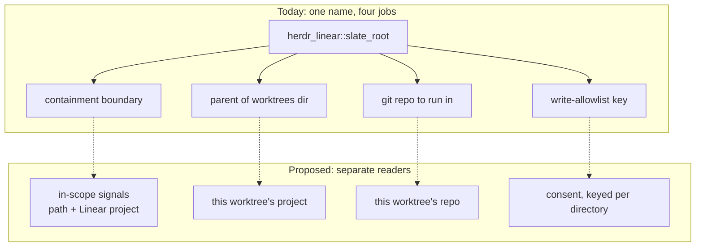
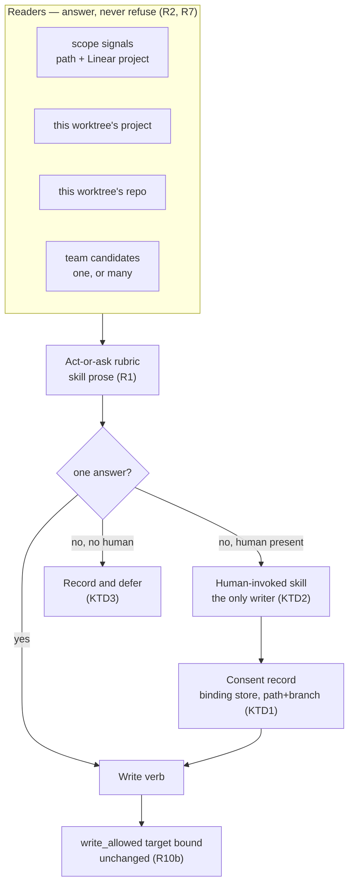

# Work Plugin Act or Ask - Plan

## Goal Capsule

- **Objective:** A session working in any of Shawn's repos can file, describe, and bind a Linear ticket without stopping to negotiate the plugin. The plugin resolves what it can, says what it resolved, and asks a real question only when the answer is a genuine fork.
- **Means:** Adopt the act-or-ask rule already stated in `plugins/auto` and `plugins/spinoff`. Split `plugins/work/lib/` into readers that answer questions and write verbs behind a single ask-once confirmation.
- **Product authority:** Shawn. On product behaviour the R-IDs win; on implementation mechanism the KTDs win within their cited R constraints.
- **Execution profile:** Shell (bash) plugin plus skill prose. No CI exists in this repo — `plugins/work/tests/run-tests.sh` is the whole automated verification contract.
- **Stop conditions:** Stop and report rather than proceeding if any caller under `lib/`, `hooks/` or `commands/` calls the consent-confirm primitive (KTD2), or if the suite's `self_check` phase stops failing on its deliberately-failing fixture.
- **Open blockers:** None.

---

## Product Contract

### Summary

The `work` plugin stops refusing where it could resolve, and stops assuming one project. Facts it can derive it derives and reports; forks it cannot settle it asks about. Writes are gated once per worktree by a question instead of permanently by a hand-edited file.

### Problem Frame

Two full sessions were spent negotiating this plugin rather than filing a ticket, and neither filed one. A third session hit the same wall, parked a partial fix on `fix/work-team-from-project`, and handed it off. Each time the plugin refused, named a rule, and returned a decision the agent could have resolved from data already reachable.

The refusals are not wrong in principle — filing into the wrong Linear team is someone's cleanup. They are wrong in placement. `herdr_linear::current_context` fills `project` from a bound workspace and never fills `team`, so `_create_issue` returns NO_CONTEXT for a fact one query answers. `skills/new/SKILL.md:26` instructs the agent not to pick a team, which is right, but nothing distinguishes "cannot pick" from "did not look."

The deeper cause is that `herdr_linear::slate_root` does four unrelated jobs under one name: the containment boundary (`plugins/work/lib/contain.sh:41`), the parent of the worktrees directory (`plugins/work/lib/start.sh:69`, `plugins/work/lib/herdr-write.sh:170`), a git repo to run commands in (`plugins/work/lib/start.sh:138`), and the key the write allowlist is looked up under (`plugins/work/lib/start.sh:212-217`). The second job encodes one shared worktrees directory under one root. The actual layout is `~/projects/<project>/worktrees/<feature>` — worktrees are per project. So the plugin models one project while the work spans many, and widening the root only made the single wrong model larger.

The gates were never the safety they appear to be. `plugins/work/skills/bind/SKILL.md:37` states it outright: the gate "is not a capability boundary, and nothing in a single-user shell could be one." An agent with shell access can call the confirm verb directly. What the gates actually buy is friction against accidental initiative, and that friction is currently spent stopping derivable work rather than reviewable writes.

### Key Decisions

- **Adopt the act-or-ask rule the sibling plugins already state, rather than authoring a new one.** (session-settled: user-directed — chosen over making the existing gates merely derive better: the rule is already stated twice in this repo, so `work` converges on it instead of growing a sixth private one.) Governs R1, R2, R3.
- **Ask once per worktree, then remember.** (session-settled: user-directed — chosen over the plugin self-authorising writes, dropping the allowlist, and keeping the hard gate: the first write in a worktree stays visible to a human, and the manual file edit disappears.) Governs R9, R10.
- **Containment becomes a signal the rubric weighs, not a gate that blocks.** (session-settled: user-directed — chosen over resolving scope from Linear alone: the path signal still answers when the network does not.) Governs R7.
- **Split `slate_root` rather than widen its default.** (session-settled: user-approved — chosen over widening the existing default: a bigger single root still models one project, and the layout is per project.) Governs R5, R6.
- **R14 and R15 ship with this plan rather than splitting out.** R14 is load-bearing under the new shape: a rubric that cites a conventions document the plugin does not ship points at nothing. R15 rides along as the defect it is. Governs R14, R15.
- **A prose rubric replaces enforceable exit codes.** (session-settled: user-approved — chosen over keeping the gates as exit codes: the act-or-ask rule belongs where the agent reads it.) This is the load-bearing bet of the whole shape; see Dependencies / Assumptions.

The split that decision describes:

### Actors

- A1. The session agent — resolves facts, reports what it resolved, asks when it cannot.
- A2. Shawn — answers the fork questions and the first-write confirmation.
- A3. Linear — holds teams, projects, and issues.
- A4. herdr — holds workspaces and the layout a worktree sits in.

### Requirements

**Deciding: act or ask**

- R1. The skills carry an act-or-ask rubric matching the one in `plugins/auto/skills/auto/SKILL.md` and `plugins/spinoff/skills/spinoff/SKILL.md`: resolve a mechanically-derivable fact autonomously, ask when the answer is a genuine fork, and when unsure which it is, ask.
- R2. A `lib/` verb that today refuses for want of a derivable fact instead returns what it knows and names what it does not. Refusal is reserved for the write gate and for malformed input.
- R3. When a fact has exactly one possible answer, the plugin resolves it. When it has more than one, the plugin asks and names the candidates.
- R4. Every autonomous resolution is stated in the session output before it is acted on, naming the fact, the source it was read from, and the derivation, so a wrong result and its cause are both visible without reading a log.

**Scope and layout**

- R5. The four responsibilities currently served by `herdr_linear::slate_root` — the containment boundary, the parent of the worktrees directory, a git repo to run commands in, and the key the write allowlist is looked up under — become separately named readers. No single value serves them all.
- R6. Scope resolves per project. A worktree under a project's own `worktrees` directory resolves its project from its own path.
- R7. The scope reader reports two signals — whether the path sits under a known projects root, and whether the repo maps to a Linear project — and never blocks on its own.
- R8. The scope-deciding default moves to a configuration surface outside the code, and the `SLATE` token leaves every shipped file. The prohibited class is the organisation and product name this plugin was written for; the tracker's own name is not in it.

**Writes**

- R9. The first write to Linear from a given directory — a worktree, or the checkout a session runs from when no worktree exists yet — asks once, naming the team and project it will write to and the issue, or the title when the write is the creation itself.
- R9a. A question that reaches no person — a hook, a headless run, or a session whose ask is refused — resolves to shadow and reports what it would have written. It never resolves to yes, and the plugin never supplies the answer itself.
- R10. A recorded answer replaces the hand-edited allowlist, so no file edit is required to make a fresh worktree writable. The answer is scoped to the team and project it named and carries the branch current when it was given; a write whose derived team or project differs, or whose branch differs, asks again.
- R10a. Consent is recorded only from a person's answer, never on the agent's own initiative. KTD2 owns how that is enforced.
- R10b. The target bound in `write_allowed` — the bound issue plus the children this plugin created — survives unchanged. R10 replaces the per-worktree enablement only.
- R11. Shadow mode remains available as a deliberate dry run, not as a default state every session must clear.

**Filing from where you are**

- R12. A verb files an issue and binds it to the current worktree without creating a second one.
- R13. Team resolves from the project when the project has exactly one team. When the project has more than one, the plugin asks rather than picking.

**Packaging and validation**

- R14. The title and description conventions the skills instruct the agent to follow ship inside the plugin and are readable at the moment a skill cites them.
- R15. A description composed fresh from the template is validated in strict mode.

**Delegation**

- R16. A work skill delegates a context-heavy step to a subagent and keeps only the result. Heavy means a step whose raw output is large and whose decision-relevant part is small — gathering issue candidates, sweeping state at session end, reading a branch's history to compose a description.
- R17. A delegated step never asks the person. Resolution and every question stay in the main session, because a subagent has no prompt channel and a question handed to one is a decision lost.
- R18. A delegated step returns a path plus a short gist, not its full output. The main session reads the file only when it needs a detail the gist does not carry.

### Key Flows

- F1. File a ticket for the worktree you are already in
  - **Trigger:** A2 asks for a ticket while A1 sits in an unbound worktree.
  - **Actors:** A1, A2, A3, A4
  - **Steps:** A1 reads the scope signals; resolves the project from the worktree path; resolves the team from the project; states both; files the issue; binds it to the current worktree.
  - **Outcome:** One issue, one worktree, one binding.
  - **Covered by:** R3, R4, R6, R12, R13

- F2. First write from a fresh worktree
  - **Trigger:** A1 is about to send its first mutation to A3 from this worktree.
  - **Actors:** A1, A2
  - **Steps:** A1 names the team, project, and issue or title; A2 answers once through a skill A2 invoked, which records the answer; A1 reads it and proceeds; later writes matching that team and project do not ask again.
  - **Outcome:** Writes are enabled for that worktree by a question, not a file edit.
  - **Covered by:** R9, R10

### Acceptance Examples

- AE1. **Covers R13.** Given a project with exactly one team, when A1 files an issue against it, then A1 resolves the team and states which team it resolved, without asking which team. The R9 first-write question still applies when this filing is the directory's first write.
- AE2. **Covers R3, R13.** Given a project spanning three teams, when A1 files an issue against it, then A1 asks A2 which team, naming all three, and files nothing until answered.
- AE3. **Covers R9.** Given a worktree with no recorded write answer, when A1 attempts its first mutation, then A1 asks once naming issue, team, and project, and proceeds only on a yes.
- AE4. **Covers R9, R10.** Given a worktree whose write answer is already recorded, when A1 attempts a further mutation, then A1 does not ask again and no allowlist file is consulted.
- AE5. **Covers R7.** Given Linear is unreachable, when A1 reads the scope signals, then the path signal still answers and A1 reports the Linear signal as unknown rather than treating the worktree as out of scope.
- AE6. **Covers R15.** Given a description with no template headings, when it is composed fresh and submitted, then validation fails and no issue is filed.
- AE8. **Covers F1, R1, R9.** Given a fresh unbound worktree under a project with exactly one team, when A2 asks for a ticket, then A1 files and binds it having asked exactly one question — the R9 first-write confirmation — and having refused nothing.
- AE9. **Covers R9a.** Given a bound worktree with no recorded answer, when the session-end hook wants to move the issue's state, then it writes to the shadow log and sends nothing.
- AE10. **Covers R16, R18.** Given a project with forty candidate issues, when the bind skill gathers them, then a subagent writes the list to a file and returns a gist naming the file and a handful of candidates, and the main session's context never holds all forty.
- AE11. **Covers R17.** Given a delegated gathering step that reaches an ambiguous team, when the subagent finishes, then it reports the ambiguity as data and the main session asks the person; the subagent asks nothing and picks nothing.
- AE7. **Covers R2.** Given a worktree outside every known projects root, when A1 asks for the scope signals, then the reader reports both signals as negative and returns normally rather than refusing.

### Scope Boundaries

- Version bump and marketplace publish. An outward write under `autoUpdate: true`; it needs its own decision.
- The eight `$HOME` state paths in `plugins/work/lib/` — store dir, pin dir, journal, shadow log, description backups, cache, and credentials file. They name no organisation and assume no single project, so R8 does not reach them.
- The description validator's content rules. The diary, placeholder, and empty-section checks stay as written; only the mode the create path selects changes.
- herdr layout and workspace behaviour beyond what binding needs.

### Dependencies / Assumptions

- The load-bearing assumption behind the prose-rubric decision, stated on the axis that actually differs. An exit code was never a *capability* boundary — `plugins/work/skills/bind/SKILL.md:37` says so, and says not to describe it as one — but it was a *control-flow* boundary: it fired for every caller of a `lib/` verb and failed closed. A rubric reaches only a session holding the skill in context, and defaults to acting. The bet is that the callers outside that set — a skill sourcing `lib/` directly, a headless `claude -p`, a subagent, the two hooks — are adequately held by R9a and R10a rather than by the readers.
- The falsification signal for that bet, and its recovery. The bet has failed the first time a write lands on a team, project, or issue the session did not state first. The recovery is a per-target confirmation on the write verb — not the file allowlist R10 replaces, and not a gate across the readers.
- R15 is a worked counterexample to the broad form of the assumption, which is why the narrow form above is the one stated: skill prose already tells the agent not to compose a thin description, and `plugins/work/lib/create.sh:90` files it anyway. Where prose has demonstrably not held, an exit code is the remedy.
- Commit `315c71e` on branch `fix/work-team-from-project` implements the single-team half of R13 as `herdr_linear::project_team`. Its query fetches at most two team ids and prints nothing when there is more than one, so the ask in R3 and AE2 needs a reader that returns every team id and name for the project. That reader is new work.
- Tests asserting "refuses when X" become tests of what a reader reports. The existing suite is reworked alongside `lib/`, not after it.
- A personal Linear key writes to the whole account. Nothing in this work narrows that, which is why R9 keeps a human in front of the first write.

### Outstanding Questions

**Resolve Before Planning**

- None.

**Deferred to Planning**

- Where the per-worktree write answer is recorded, and whether it lives alongside the binding record or separately.
- How a repo maps to a Linear project for R7's second signal, and whether that mapping is derived, cached, or declared.
- ~~Whether the `SLATE` env var name gets a deprecation path or a clean rename.~~ **Resolved: deprecate, do not rename cleanly.** `HERDR_LINEAR_SLATE_ROOT` is set in `~/.claude/settings.json` to `/Users/shawnroos/projects`. A clean rename orphans that silently, and because the new default is `$HOME/projects` it would keep working *by accident* — which hides the orphan instead of surfacing it. U8 reads the old name as a fallback and prints one deprecation line to stderr when it fires.
- ~~What the configuration surface for the scope default is.~~ **Resolved: `HERDR_LINEAR_PROJECTS_ROOT`, defaulting to `$HOME/projects`.** An env var, matching every other seam in `lib/`; no new config file format for one value.
- Which existing refusal exit codes survive as codes and which collapse into reader output.

### Sources / Research

- `plugins/work/lib/contain.sh:32-41` — `slate_root` and the containment check.
- `plugins/work/lib/start.sh:69,131,138` and `plugins/work/lib/herdr-write.sh:170,211` — the worktrees-root and git-root uses of the same value.
- `plugins/work/lib/create.sh:34-55,90,96-99,148` — `current_context`, the lenient validate call, the NO_CONTEXT return, and the unconditional second worktree.
- `plugins/work/lib/linear.sh:304-324` — `write_allowed`, read from the local binding record.
- `plugins/work/lib/reconcile.sh:224-229` — `writes_enabled` and the allowlist file.
- `plugins/work/lib/description.sh:132,144-147,187` — the lenient default and the advisory spine.
- `plugins/work/skills/bind/SKILL.md:37` — the gate is not a capability boundary.
- `plugins/auto/skills/auto/SKILL.md:290-298` — mechanical resolve, fork escalate, unsure escalate.
- `plugins/spinoff/skills/spinoff/SKILL.md:256-257` — backstops are the safety net, not the decision-maker.
- `docs/linear-conventions.md` — referenced by seven files under `plugins/work/skills/`, packaged by none.
- `docs/handoff.md` — the originating brief. Its claim that zsh produces a false green in `description_validate` was tested and refuted; exit codes are identical under both shells, and the real defect is the lenient mode selected at `plugins/work/lib/create.sh:90`.

---

## Planning Contract

**Product Contract preservation:** unchanged. R-IDs R1-R15 keep their meaning and numbering; R9a, R10a and R10b were added during document review as new IDs rather than by rewriting existing ones.

### Key Technical Decisions

- KTD1. **Consent lives in the binding store's record but carries its own fields.** The reused mechanism is the path-hash key alone (`lib/binding.sh:74-90`). Consent is a `consent: {team, project, branch, answered_at}` object, and the consent reader compares all four itself. It cannot reuse `branch_at_confirmation`: that field is compared only when `state == "bound"` (`binding.sh:365-371`), is rewritten by every `confirm` (`binding.sh:245`) including the no-human ones, and is empty for the unbound checkout R9 must cover. Governs R10.
- KTD2. **Consent is written by a nonce-gated pair in `lib/binding.sh`, and exactly one caller invokes the confirm half.** `consent_propose` returns a nonce; `consent_confirm` requires it. The boundary is the one `skills/bind/SKILL.md:9-38` already describes — `disable-model-invocation: true` plus the nonce ordering confirm after propose — not the absence of a lib writer. Writing the record from a skill fence instead would bypass the store's lock (`binding.sh:98-112`) and atomic save (`binding.sh:182-194`), which is the two-implementations divergence `binding.sh:120-124` records as a past defect. The existing no-human pairs at `lib/start.sh:117-118`, `lib/start.sh:141-143`, `lib/herdr-write.sh:203-208` and `lib/create.sh:215-216` are what `consent_confirm` must never acquire. Governs R10a.
- KTD3. **"Nobody to ask" reuses this plugin's existing record-and-defer precedent, not a new mechanism.** `hooks/reconcile.sh:10-13` already states that a hook never prompts; `lib/reconcile.sh:250-257` records the judgment against the binding and `hooks/ground.sh` surfaces it once at the next session start via `binding_take_judgment` (`binding.sh:309-324`). R9a uses a **separate** `pending_consent` field rather than that slot: `set-judgment` replaces its single slot wholesale (`binding.sh:309-311`), and `hooks/reconcile.sh:65-71` already records that slot evicting the squash-merge question. The shadow log carries what would have been written; `pending_consent` is what `ground.sh` surfaces next session. Governs R9a.
- KTD4. **Scope readers keep the reader-with-exit-enum shape `lib/propose.sh:26-29` already uses.** That file returns an enum a skill reads as a sentence (`skills/bind/SKILL.md:74-84`), which is the reader contract R7 wants; only its `OUTSIDE` value is retired. Governs R7.
- KTD5. **The conventions document moves under the plugin and is cited through `${CLAUDE_PLUGIN_ROOT}`; no manifest change.** The installed cache ships the whole source directory — `auto/0.14.1/` already ships a `docs/` tree with no key naming it — so packaging is a move plus a citation fix, not a `plugin.json` edit. Governs R14.
- KTD6. **Adopt `315c71e` for the single-team half of the team reader and write the candidate reader beside it.** `tests/fixtures/fake-linear.sh` routes bodies by content before mode (295-351) and has no `project(` case; the commit adds one. Governs R13.

- KTD7. **R7's second signal derives from what `current_context` already reads, not a new mapping.** `lib/create.sh:37-52` resolves a project from the bound issue, then from the bound herdr workspace. The signal reports that project, `negative` when neither resolves, and `unknown` when Linear is unreachable. A declared repo-to-project mapping is out of scope. Governs R7.
  - **Partially unmet, by construction.** The Linear arm of `unknown` is implemented and tested. The herdr arm is not reachable at this layer: `workspace_state` reads a local store record, so herdr being unreachable never reaches the resolver. It would belong in `herdr_linear::workspace_id` (`lib/herdr-read.sh`), which callers pass in. Recorded rather than closed.
- KTD8. **The ask-and-record fence lives in each write skill, not in a standalone consent skill.** All eight skills are `disable-model-invocation: true`, so `/work:new` cannot invoke a separate consent skill on the person's behalf; a standalone skill would make AE8's "exactly one question" into two commands. Each write skill asks and calls `consent_confirm` in its own fence. Governs R9, R10a.

- KTD9. **Delegation carries the same split `spinoff` states: the subagent gathers, the main session decides.** `plugins/spinoff/skills/spinoff/SKILL.md:256-259` records why — the background agent cannot prompt, so a decision deferred to it is lost. The plugin's own `hooks/reconcile.sh:10-13` already applies the rule to hooks. Delegation extends it to subagents without changing who answers. Governs R16, R17.
- KTD10. **A delegated step writes to disk and returns a path plus a gist.** A subagent's return can be dropped silently, and a large return defeats the purpose. The file is the deliverable; the gist is what enters the session's context. Governs R18.

### High-Level Technical Design

### Assumptions

- The four `lib/` sites that today call propose-then-confirm with no human keep doing so for *bindings*. KTD2 constrains the new consent record only; changing binding-on-creation is out of scope.
- `HERDR_LINEAR_SLATE_ROOT` is read by ten test suites as a seam, `contain.bats` included. Renaming it under R8 is a test-wide edit, not a single-file one.

### Sequencing

U1, U2, U3 and U7 have landed. The rest runs in four waves, shaped by which files each unit owns rather than by the dependency graph alone — U5, U6 and U8 originally all rewrote the same eight skill documents, so that prose is now one unit's to own.

| Wave | Units | Why together, or why alone |
|---|---|---|
| 1 | U4, U6 | Disjoint file sets: U4 owns `lib/create.sh` and `create.bats`; U6 owns the document move and the two lib files that name it. Run in parallel under the shared-workspace contract — neither worker runs the suite, and verification happens once on the integrated tree. |
| 2 | U5 | Alone: it owns every `SKILL.md` and `commands/work.md`, doing the rubric, the citations and the organisation name in one pass over the same paragraphs. |
| 3 | U8 | Alone: the seam rename touches the ten suites that export it, which every earlier wave also edits. |
| 4 | U9 | Alone: it edits skill prose U5 must have finished. |

---

## Implementation Units

### U1. Split the scope readers

- **Goal:** Replace `herdr_linear::slate_root`'s four jobs with separately named readers that answer and never refuse.
- **Requirements:** R5, R6, R7, R8 (partial), R2. Covers AE5, AE7.
- **Dependencies:** none.
- **Files:** `plugins/work/lib/contain.sh`, `plugins/work/lib/start.sh`, `plugins/work/lib/herdr-write.sh`, `plugins/work/lib/create.sh`, `plugins/work/lib/reconcile.sh`, `plugins/work/lib/documents.sh`, `plugins/work/lib/description.sh`, `plugins/work/lib/propose.sh`, `plugins/work/hooks/ground.sh`, and the `HERDR_LINEAR_SLATE_ROOT` seam in `plugins/work/tests/unit/{contain,create,reconcile,start,herdr-write,description,ground,documents,states,propose}.bats`.
- **Approach:**
  1. Add a reader that reports the two signals of R7 as `key=value` lines, following the shape `herdr_linear::current_context` already prints (`lib/create.sh:34-55`).
  2. Add a reader for this worktree's project, derived from the parent of the `worktrees` directory in the resolved path.
  3. Add a reader for this worktree's repo via `git rev-parse --path-format=absolute --git-common-dir`, returning the directory containing it. The bare form prints `.git` at a main checkout, which every test fixture is.
  4. Give `start_from_issue` (`start.sh:74-76`), `start_new` (`start.sh:157-158`) and `new_project` (`create.sh:161-162`) a trailing `<from-dir>` argument defaulting to `$PWD`, since none takes a directory today and all three derive their root from `slate_root`. Leave `_root_writes_enabled` alone — U2 retires it.
  5. Retire `herdr_linear::contains`'s refusal at its eight `lib/` call sites — `create.sh:87,169`, `start.sh:130,215`, `reconcile.sh:240`, `documents.sh:115`, `description.sh:223`, `propose.sh:57` — and at `hooks/ground.sh:50`. The hooks keep their silence: `ground.sh` and `hooks/reconcile.sh` exit 0 on a negative path signal, so the reader's answer replaces the refusal without the plugin announcing itself in someone else's repository. The `skills/bind/SKILL.md:48` and `commands/work.md:18` sentences move with U5. Leave `propose.sh`'s enum otherwise intact per KTD4.
- **Patterns to follow:** `lib/propose.sh:26-29` for the reader-with-enum shape; `lib/create.sh:34-55` for `key=value` reader output.
- **Test scenarios:**
  - Covers AE7. A worktree under no known projects root: both signals report negative and the reader exits 0.
  - Covers AE5. Linear unreachable: the path signal still answers and the Linear signal reports unknown, distinct from negative.
  - A worktree at `<project>/worktrees/<feature>` resolves its project name from its own path.
  - A layout with worktrees beside the project rather than under it yields a negative path signal, not an error.
  - Assert the specific reader output, never a non-zero exit — a refusal assertion cannot distinguish "reported negative" from "crashed".
- **Verification:** `bash plugins/work/tests/run-tests.sh` passes with `contain.bats` asserting reader output rather than `contains` exit status.

### U2. The write-consent record and the skill that writes it

- **Goal:** One ask per directory, recorded only by a skill a person invoked, scoped to what the question named.
- **Requirements:** R9, R9a, R10, R10a, R10b, R11. Covers AE3, AE4, AE9.
- **Dependencies:** U1.
- **Files:** `plugins/work/lib/binding.sh`, `plugins/work/lib/reconcile.sh`, `plugins/work/lib/create.sh`, `plugins/work/lib/description.sh`, `plugins/work/lib/documents.sh`, `plugins/work/lib/start.sh`, the seven write skills' `SKILL.md`, `plugins/work/commands/work.md`, `plugins/work/tests/unit/{binding,create,reconcile,description,documents,states,start}.bats`, `plugins/work/tests/run-tests.sh`.
- **Approach:**
  1. Extend the binding record with a `consent: {team, project, branch, answered_at}` object per KTD1. The path-hash key is the only reused mechanism; consent does not share `branch_at_confirmation`.
  2. Add a reader that reports whether consent exists for this directory, and whether its recorded team, project and branch match the current ones. The reader never writes; the nonce-gated `consent_propose`/`consent_confirm` pair per KTD2 is the only writer.
  3. Put the ask-and-record fence in each write skill per KTD8 — `new`, `new-sub-issue`, `new-project`, `describe`, `doc`, `start`, `layout`. The fence takes no answer as an argument: it presents team, project and issue-or-title through the host's blocking question tool and calls `consent_confirm` only with what that tool returns. A refused or absent prompt records nothing and reports shadow, so a headless `claude -p "/work:new … yes"` cannot record its own consent.
  4. Retire `writes_enabled` and its allowlist file at all six call sites — `lib/create.sh:101`, `lib/create.sh:172` (via `_root_writes_enabled`), `lib/description.sh:258`, `lib/documents.sh:141`, `lib/reconcile.sh:293`, `lib/start.sh:167` — plus `lib/start.sh:212-217` itself, `commands/work.md:41,58`, `skills/new-project/SKILL.md:47-48`, `skills/start/SKILL.md:69-70`. Leaving any caller behind gives it exit 127 inside `if !` and shadows that verb forever while the suite reports "shadow mode works".
  5. The consent reader does not require `state == bound` — `start_new` and `new_project` run from a checkout with no binding. For `new_project` consent is scoped to team only, and the record says so.
  6. Leave `write_allowed` (`lib/linear.sh:304-324`) untouched — R10b.
- **Execution note:** the enforcement point is the thing under test, and one red test proves only one write site. Add a harness phase modelled on `self_check`: copy `lib/` to a temp dir, patch the consent reader to return true, run the suite against the copy, and require one named red test per write verb — `new_issue`, `new_project`, `start_new`, `describe`, `doc publish`, and the reconcile hook. A verb that forgot the check stays green otherwise.
- **Patterns to follow:** the propose/confirm pair in `lib/binding.sh:223-248` and `skills/bind/SKILL.md:86-104` for the human-invoked half. Do **not** copy `lib/start.sh:117-118`, `lib/start.sh:141-143`, `lib/herdr-write.sh:203-208` or `lib/create.sh:215-216`, which pair propose and confirm with no human.
- **Test scenarios:**
  - Covers AE3. A directory with no recorded answer: the first mutation asks and sends nothing until answered.
  - Covers AE4. A directory with an answer recorded for team T and project P: a further mutation to T and P does not ask again.
  - A write whose derived team differs from the recorded one asks again.
  - A recreated worktree at the same path on a different branch reads as having no answer.
  - Covers AE9. A session-end hook with no recorded answer writes to the shadow log and sends nothing.
  - Assert consent-key *presence* separately from its value — an absent key and a recorded "no" must not both read as null.
  - A binding re-confirmed on a new branch by `start_from_issue` does not make prior consent read valid.
  - `describe` and `doc publish` with no consent write to the shadow log and send nothing.
  - Consent recorded from an unbound checkout gates `start_new` and `new_project`.
  - The fence invoked with a trailing `yes` argument records no consent.
  - Mutation: the consent reader forced true turns one named test red per write verb, not just one overall.
- **Verification:** `herdr_linear::consent_confirm` is called from the seven write skills' fences and from nowhere under `lib/`, `hooks/` or `commands/` — provable by grep; the mutation phase names one red test per write verb.

### U3. Team candidates reader

- **Goal:** Resolve a single-team project autonomously and name every candidate when there are several.
- **Requirements:** R3, R13. Covers AE1, AE2.
- **Dependencies:** none.
- **Files:** `plugins/work/lib/create.sh`, `plugins/work/tests/fixtures/fake-linear.sh`, `plugins/work/tests/unit/create.bats`.
- **Approach:**
  1. Adopt `herdr_linear::project_team` from `315c71e` for the single-team half.
  2. Add a reader returning every team id and name for the project; the existing query caps at two ids and prints nothing for more than one.
  3. Add a `project(` route to `fake-linear.sh`, placed above the existing `teams(` arm, which would otherwise answer with the workflow-states shape.
  4. Fill `team` in `current_context` from the project when exactly one exists.
- **Test scenarios:**
  - Covers AE1. One-team project: the team resolves, is stated, and no question is asked about which team.
  - Covers AE2. Three-team project: all three are named and nothing is filed until answered.
  - Zero teams on a project reports none rather than resolving.
  - The `project(` route is reached — assert the request body was sent, not merely that team came back empty.
- **Verification:** `create.bats` passes with the two candidate cases; `fake-linear.bats` still asserts its 97/98 credential and mutation boundaries.

### U4. File an issue and bind the worktree you are in

- **Goal:** A verb that files and binds in place, with no second worktree.
- **Requirements:** R12. Covers F1, AE8.
- **Dependencies:** U2, U3.
- **Files:** `plugins/work/lib/create.sh`, `plugins/work/tests/unit/create.bats`. The skill prose for this verb belongs to U5, which owns every `SKILL.md` edit.
- **Approach:** branch `_create_issue` before its unconditional `herdr_linear::start_from_issue` call (`lib/create.sh:148`) so an already-bound-capable worktree binds in place instead. Name the new verb and any new skill so it collides with neither `commands/work.md` nor the eight existing skill names.
- **Patterns to follow:** `docs/solutions/architecture-patterns/command-and-skill-sharing-a-name.md` — a command and skill sharing a name makes the skill silently unreachable.
- **Test scenarios:**
  - Covers AE8. A fresh unbound worktree under a one-team project: the ticket is filed and bound with exactly one question asked and nothing refused.
  - No second worktree is created — assert the worktree count before and after.
  - A worktree already bound to another issue is not silently rebound.
- **Verification:** the originating scenario runs end to end in `create.bats`.

### U5. The act-or-ask rubric in skill prose

- **Goal:** One pass over every skill document: the act-or-ask rule, the conventions citations, and the organisation name, which are all edits to the same paragraphs.
- **Requirements:** R1, R2, R4, R8 (prose half), R14 (citation half). Also closes AE1's unmet half. U3 resolves the team but `current_context` exposes only `team=<id>`, so the name never surfaces. **Decided:** add a `team_name=` line to `current_context` rather than having each skill fence re-query `project_teams` and match the id. One line in lib serves every caller — including the hooks and headless runs a prose rubric never reaches, which is the R4 gap the review flagged and no other unit closes.
- **Dependencies:** U1, U2, U3.
- **Files:** all eight `plugins/work/skills/*/SKILL.md` and `plugins/work/commands/work.md`; `plugins/work/tests/run-tests.sh` (the `owned_skills` list); `plugins/work/tests/unit/wire.bats` (its sync-check fixtures); `plugins/work/tests/unit/propose.bats` (the citation assertion U6 left for this unit); and `plugins/work/lib/create.sh` plus `plugins/work/tests/unit/create.bats` for the one line AE1 needs. This unit owns every prose edit to the skill files; U6 and U8 own no `SKILL.md`.
- **Approach:** mirror the wording already in `plugins/auto/skills/auto/SKILL.md:289-298` and `plugins/spinoff/skills/spinoff/SKILL.md:253-259` — resolve mechanical, escalate a fork, escalate when unsure — and state R4's three-part statement shape (fact, source, derivation). Replace each "outside the Slate root" sentence with the reader's two signals. Extend `owned_skills` at `run-tests.sh:189` from five to all eight skills, and add `commands/work.md` to the scan — it calls `contains` at line 18 and `writes_enabled` at line 41 and is never scanned today. The check proves a skill sources what it calls; today only `commands/work.md` calls a `sanitize.sh` verb and it already sources one, so add a source line where the extended scan actually reports a gap rather than where this plan guessed one.
- **Test scenarios:** The plan predicted none. Five were needed: two proving a resolved team is NAMED and not only identified, two asserting absence on the many-team fixture (whose first team shares the bound issue's id and name, so a value assertion sits in a false-green trap), and one proving the sourcing scan reaches the command file. `skill_lib_sync_check` still proves every `herdr_linear::` call in a fenced block resolves.
- **Verification:** `wire_smoke` passes with `owned_skills` covering all eight skills plus `commands/work.md`, so "no skill cites a retired verb" is proven rather than asserted.

### U6. Ship the conventions document

- **Goal:** The conventions document ships inside the plugin. U5 rewrites the citations that point at it.
- **Requirements:** R14.
- **Dependencies:** none.
- **Files:** `docs/linear-conventions.md` → `plugins/work/docs/linear-conventions.md`; the runtime message in `plugins/work/lib/documents.sh`, the comments in `plugins/work/lib/description.sh` and `plugins/work/lib/documents.sh`, and `plugins/work/tests/unit/{propose,documents}.bats`. No `SKILL.md` — U5 owns those citations.
- **Approach:** move the file, then change all nine citations to a runnable fence — `cat "${CLAUDE_PLUGIN_ROOT}/docs/linear-conventions.md"` — rather than a prose path, since the variable expands only inside bash. No `plugin.json` or marketplace edit; the whole source directory already ships (KTD5). Retitle away from the organisation name per R8. Reinstall the plugin from the local marketplace before verifying.
- **Test scenarios:** `tests/unit/propose.bats:271` substring-matches `linear-conventions.md`, which the new citation still contains, so it cannot fail against the old path. Assert the full token `${CLAUDE_PLUGIN_ROOT}/docs/linear-conventions.md` and route a negative assertion for the bare repo-root citation through `refute_match`.
- **Verification:** after reinstalling, `test -r "$CLAUDE_PLUGIN_ROOT/docs/linear-conventions.md"` succeeds from a session on the installed plugin. The suite runs against the checkout and cannot prove this, so it is a manual gate. If a same-version update does not refresh the cache, R14 is recorded as deferred rather than claimed met.

### U7. Strict validation on the create paths

- **Goal:** A description composed fresh from the template cannot be filed structureless.
- **Requirements:** R15. Covers AE6.
- **Dependencies:** none.
- **Files:** `plugins/work/lib/create.sh`, `plugins/work/lib/start.sh`, `plugins/work/skills/new/SKILL.md`, `plugins/work/skills/start/SKILL.md`, `plugins/work/tests/unit/create.bats`, `plugins/work/tests/unit/description.bats`, `plugins/work/tests/unit/start.bats`.
- **Approach:** pass `strict` at both lenient call sites — `lib/create.sh:90` and `lib/start.sh:165`. The validator already implements the mode (`lib/description.sh:132`, `141-153`); only the argument changes. `new_sub_issue` reaches the same call through `_create_issue`, so one change covers it. Two skill documents describe the old lenient bar in prose and become false with the change.
- **Test scenarios:**
  - Covers AE6. A headingless description composed fresh is refused and nothing is filed.
  - A description that has earned its own headings still passes the lenient path used by `describe`.
  - The create path maps a failed validate to `CREATE_REFUSED`, shared with missing-title, so exit code alone cannot discriminate: assert `CREATE_REFUSED` **and** stderr carrying `not using the Problem/Solution/Proposal shape` **and** no `issueCreate` in the recorded bodies. The unprefixed `description:` is what separates strict from lenient — lenient emits `description: note: …`.
  - `new_sub_issue` needs its own case; the shared call site does not give it one.
  - `start_new` needs the same case, and leaves no worktree behind when refused.
  - The strict-mode tests in `description.bats` assert `-ne 0` today, which does not prove a refusal. Give them the `MALFORMED` value — this is an addition, not a preserved assertion.
- **Verification:** `description.bats` and `create.bats` pass; the lenient path for existing descriptions is unchanged.

### U8. Retire the organisation name

- **Goal:** The plugin names no organisation.
- **Requirements:** R8.
- **Dependencies:** U1.
- **Files:** `plugins/work/lib/{contain,secrets,documents,herdr-write}.sh`, `plugins/work/docs/linear-conventions.md`, `plugins/work/.claude-plugin/plugin.json`, `.claude-plugin/marketplace.json` (repo root — the `work` entry only), `plugins/work/tests/fixtures/descriptions/web-3214.md`, `plugins/work/tests/fixtures/fake-security.sh`, `plugins/work/tests/run-tests.sh`, and the seam across the ten test suites that export it. The four libraries, the conventions document and the two fixtures were added at dispatch; the plan's original list missed them. No `SKILL.md` or `commands/work.md` — U5 owns that prose.
- **Approach:** rename the env seam, move the scope default to configuration, and replace the prose. The tracker's own name stays — the prohibited class is the organisation and product name only.
- **Test scenarios:** a grep for the organisation token over all shipped files returns nothing; run it against the pre-change tree first to confirm it can fail.
- **Verification:** `version_sync_check` still passes after the `plugin.json` description edit.

### U9. Delegate the context-heavy steps

- **Goal:** Keep the session's context for decisions, not for raw gathering output.
- **Requirements:** R16, R17, R18. Covers AE10, AE11.
- **Dependencies:** U3, U5.
- **Files:** `plugins/work/skills/{bind,layout,describe}/SKILL.md`, `plugins/work/commands/work.md`, `plugins/work/tests/unit/wire.bats`.
- **Approach:**
  1. Name the heavy steps: candidate gathering (`lib/propose.sh`), the team-candidate reader U3 adds, the session-end reconcile sweep, and branch-history reading for a description.
  2. In each owning skill's prose, instruct the agent to dispatch a subagent for that step, pass it the scratch path, and read back the gist.
  3. State the boundary in the same place: the subagent gathers and reports; it never asks and never records consent. The R9 question stays in the main session per KTD8, and consent-confirm keeps its single caller.
  4. Leave `lib/` unchanged. Delegation is an instruction to the agent, not a shell mechanism — a lib verb has no subagent to dispatch.
- **Patterns to follow:** `plugins/spinoff/skills/spinoff/SKILL.md:256-259` for the gather-versus-decide split.
- **Test scenarios:** The plan predicted none, for the second time, and was wrong again. `consent_caller_check` deliberately skips `skills/`, because a write skill legitimately calls the record verbs in its own fence. So a brief instructing a subagent to ask or to record shipped green. Three tests scan the fenced briefs for the record verbs and for `AskUserQuestion`. Limits: a brief outside a fence is not scanned, and any future plain-text fence in those files is read as a brief.
- **Verification:** the consent grep from U2 still returns one caller after U9; no skill instructs a subagent to ask a question or record an answer.

---

## Verification Contract

There is no CI in this repository. `plugins/work/tests/run-tests.sh` is the entire automated verification contract, and it is the gate for every unit.

| Gate | Command | Applies to |
|---|---|---|
| Full suite | `bash plugins/work/tests/run-tests.sh` | all units |
| Harness can fail | the runner's `self_check` phase | every run — a green suite means nothing if this stops failing |
| Suite count | `HERDR_LINEAR_MIN_SUITES` at `run-tests.sh:41` — a floor, so a new suite does not fail it; bump it so the floor keeps meaning | U2, if it adds a `.bats` file |
| Consent mutation | the `self_check`-shaped phase U2 adds; one named red test per write verb | U2 |
| Skill/lib wiring | `skill_lib_sync_check`, globbing `owned_docs` with an empty-glob guard | U2, U5, U6, U8 |
| Shared rubric | `rubric_sync_check` — all eight skills byte-identical, names the file that drifted | U5 |
| Organisation name | `brand_scan` — every shipped file, exemptions expire with their justification | U8 |
| Delegation briefs | `wire.bats` — no brief tells a subagent to ask or to record | U9 |
| Assertion shape | `assertion_lint` — a `.bats` line may not start with `!` | every unit adding tests |
| Version parity | `version_sync_check` | U8 |

Repo-specific rules that decide whether a green run means anything:

- A non-zero exit does not prove a refusal. Assert the specific error value.
- The binding store reads through python `_py field`, not jq; it prints an empty string for both an absent key and a null value. Where "no answer recorded" and "answer was no" differ, add a `has-consent` op and assert it separately.
- `! grep` does not fail a test under `set -e`; route negative assertions through the per-file `refute_match` helper (`tests/unit/reconcile.bats:18-24`).
- Reconcile test counts per file with `grep -c '^@test'` before and after. A clean whole-suite subtraction is not proof nothing else broke.

## Definition of Done

- Every requirement R1-R15, including R9a, R10a and R10b, is met or explicitly deferred in writing.
- `bash plugins/work/tests/run-tests.sh` passes, with `self_check` observed failing its deliberate fixture in the same run.
- The consent-mutation phase runs on every `run-tests.sh all` and names one red test per write verb — `new_issue`, `new_project`, `start_new`, `describe`, `doc publish`, reconcile hook.
- `herdr_linear::consent_confirm` has no caller under `lib/`, `hooks/` or `commands/` — provable by grep.
- R14 counts as met only when the conventions document is readable at `$CLAUDE_PLUGIN_ROOT/docs/` from a reinstalled plugin; otherwise it is recorded as deferred in writing.
- No shipped file names the organisation (U8's grep), and that grep has been seen to fail against the pre-change tree.
- No skill instructs a subagent to ask the person or to record consent; the U2 consent grep still returns exactly one caller.
- Abandoned experimental code from approaches that did not pan out is removed, not left in the diff.
- The plan's load-bearing assumption still holds, or the Dependencies section records that it did not and what replaced it.

---

## Residual record

Written after all nine units landed. These are known and open, not oversights.

### Requirements not met in full

- **R8 cannot hold as written, and does not.** The deprecation the plan itself
  requires forces `HERDR_LINEAR_SLATE_ROOT` to stay spelled out in `lib/contain.sh`,
  in both the fallback and the warning that tells the reader what to change. R8 says
  the token leaves every shipped file. Both cannot be true. The brand scan carries a
  named exemption that expires with its justification: when the fallback goes, the
  scan fails until the exemption goes too. Verified by mutation.
- **R14 is deferred, not met.** The conventions document ships inside the plugin
  source, but the installed cache is pinned at an older commit with no `docs/`
  directory, so a skill citing it at runtime still cannot read it. The reinstall is
  out of this plan's scope.
- **R7's "unknown when the tracker is unreachable" arm cannot fire.** `workspace_state`
  reads a local store record, so there is no network call to fail. AE5 passes on the
  path signal alone. Closing this means giving the reader a real remote read.

### Open, needing a decision that is not a worker's to make

- **The brand scan's manifest-address exemption widens with the manifest.** The
  maintainer address is looked up rather than written down, so it cannot go stale, but
  whatever address the manifest carries becomes exempt. Closing it needs a definition
  of a legitimate maintainer address.
- **The user's `~/.claude/settings.json` still sets the old variable name.** Nothing in
  this branch reads or edits that file. Until it is renamed, every run prints the
  deprecation line. This is a required user action, not a defect.

### Follow-ups this plan created and did not finish

- **`herdr_linear::project_teams` is deliberately not delegated, because it is not heavy.**
  R16 defines heavy as large raw output with a small decision-relevant part. This verb
  fetches at most fifty teams and prints `id<TAB>name` for each, and the caller needs
  every line to name the candidates. There is nothing to summarise away. Delegating it
  would buy a round trip and save fifty short lines. This is a scope judgement, not an
  unfinished follow-up.
- **`lib/binding.sh` does not self-heal a missing dependency.** `lib/linear.sh` and
  `lib/propose.sh` both re-source one; `binding.sh` does not, so an unsourced
  `sanitize.sh` silently downgrades an identifier check to a weaker validator with no
  rule about leading dashes. The globbed scan closes this for every document the plugin
  ships. It does not close it for a caller outside the plugin.
- **`/tmp/desc.md` in describe's fence is a shared-name collision** of exactly the kind
  the sibling plugin warns about. Two sessions writing a description at once share the
  path.
- **Layout Step 1 has no lib verb for fetching children**, so the agent runs an ad-hoc
  query. Predates this plan.

### False greens found while building this

Recorded because the pattern repeated, not to tally mistakes. Six checks passed while
incapable of failing: a fixture whose first team shared the bound issue's id; a title
test matching an empty read of a missing file; an exit 127 mistaken for a red; a wrapper
exit code taken from `tail`; a brand scan reporting clean when its own read crashed to
stderr; and four tests reading the developer's real environment instead of their fixture.
Every one was found by mutating finished code, none by inspection.
