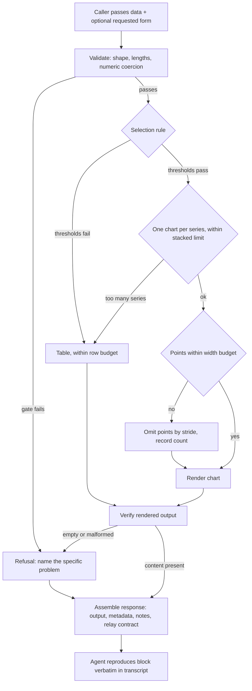

# Data Presentation Skill - Plan

## Goal Capsule

- **Objective:** a person reading a chat transcript can see what a set of numbers does, and can trust that what they see is what the data says. Nothing is invented to fill a gap, nothing is flattened into a misleading shape, and the presentation never claims more than the data supports.
- **Means:** a Python adapter over a vendored copy of `asciichartpy`, with a Markdown table as the default form and a chart reserved for data that earns one (KTD1, KTD3).
- **Authority hierarchy:** an R-ID wins on behaviour. A KTD wins on mechanism inside the R-IDs it cites. A unit overrides neither.
- **Stop conditions:** stop and ask when the skill would have to choose a meaning for missing data that the caller did not state. Stop and refuse when input fails a validation gate; do not render a degraded chart instead.
- **Execution profile:** one plugin, six units, no external service, no network at runtime.
- **Tail ownership:** the plugin is registered in this repository's own marketplace manifest, which is what makes it installable locally (R16). Publishing that manifest outward is a separate act and is out of scope for this plan.

---

## Product Contract

### Summary

Add a `data-presentation` plugin holding one skill. An agent that already has structured data calls the skill, and gets back a rendered block plus metadata describing what was rendered and what was left out. The skill picks the presentation form, validates the values, renders, checks the render, and returns. The agent then reproduces the block in the transcript.

The default form is a Markdown table. A line chart is used when the data is genuinely chart-shaped. The skill does not fetch data and does not interpret what the numbers mean.

### Problem Frame

Agents hand-roll chart rendering when they want to show a trend or compare categories. The result is inconsistent between sessions and easy to get subtly wrong: an axis that hides magnitude, a gap that reads as a zero, a series silently dropped. The missing piece is not a renderer, since good ones exist. It is the judgement that sits in front of one, deciding whether a picture helps at all, what the values must survive, and what has to be said alongside the output.

### Key Decisions

- Presentation defaults to a table, and a chart must earn its place against an explicit rule. A transcript reader is served better by exact numbers than by a small ASCII picture at low point counts, and a rule that can be checked is testable where taste is not. Governs R1, R2, R3.
- A missing value is never replaced by a substitute. The skill omits the point, renders a gap, uses zero only when the caller states zero is meaningful, or asks. Governs R6, R7, R8.

### Requirements

**Presentation selection**

- R1. The skill selects between a table and a line chart using a rule with fixed numeric thresholds, not a judgement call at call time.
- R2. A chart is selected only when every threshold in R1 passes; any failure falls back to a table.
- R3. The caller may request a form explicitly. When the requested form fails an R1 threshold, the skill renders the fallback form and states in the notes which form was requested and why it was not used.

**Data integrity**

- R4. Every series is checked to have the same length as the x dimension before anything renders.
- R5. Numeric strings are converted to numbers. A value that cannot be converted is a validation failure, not a dropped point. A value that converts to a non-finite number is also a validation failure, because such values pass numeric coercion and then poison the spread test and the axis.
- R6. A missing value is represented as an explicit gap in a chart and as an explicit empty marker in a table. It is never rendered as zero unless the caller declared zero meaningful for that series.
- R7. The response states which x positions carried missing values and how they were treated, indexed against the caller's original x list. Reduction retains every missing position, so a reported gap is always a visible gap.
- R8. When the skill reduces a series to fit a width budget, it omits points and never derives new ones. The response states how many points were omitted, and the minimum and maximum of the full unreduced series.
- R19. The rendered block opens with a caption line carrying the title, the units, and any supplied source metadata such as a date range or segment. It sits inside the block, because that is the only part the skill can expect to survive being relayed.
- R18. Caller-supplied text is validated, escaped, and length-limited before it is rendered. A table delimiter, a newline, or a code fence inside a title, series name, unit, or x label must not be able to break the rendered block.

**Honest rendering**

- R9. A chart preserves the real magnitude of every plotted value on a labelled y-axis.
- R10. A chart carries exactly one series. Several series render as one labelled chart each, stacked, or as a table.
- R11. Rendered output contains no ANSI escape sequences by default.
- R12. Rendered output never exceeds a fixed column budget, in every form. Long x labels and series names are truncated to hold it, and the response reports the truncation.
- R17. Rendered table output never exceeds a fixed row budget. Above it the skill omits rows by the same rule as R8 and reports the count, or refuses.

**Failure behaviour**

- R13. The skill refuses, with a message naming the specific problem, rather than returning an empty or degenerate render.
- R14. The skill verifies its own rendered output before returning it, and does not treat a completed call as proof that anything was drawn.

**Packaging**

- R15. The plugin runs with no install step, no virtual environment, and no third-party package on the host.
- R16. The plugin is registered so it is installable from the marketplace.

### Acceptance Examples

- AE1. Covers R2, R3. **Given** four x labels and one series whose values are all `7`, **when** the caller requests a line chart, **then** a table is rendered and the notes state that the series has no variation to plot.
- AE2. Covers R10. **Given** two series and a chart request, **when** the skill renders, **then** it produces two separately labelled single-series charts rather than one combined chart, and each carries its own axis range.
- AE3. Covers R6, R7. **Given** a nine-point series whose third value is missing, **when** a chart is rendered, **then** the line shows a break at that position and the notes name position three as missing.
- AE4. Covers R4, R13. **Given** five x labels and a series of four values, **when** the skill is called, **then** it refuses and the message names both lengths.
- AE5. Covers R8. **Given** a series of 400 points, **when** a chart is rendered, **then** the chart fits the column budget and the notes state how many points were omitted and that no values were averaged.

### Scope Boundaries

**Deferred for later**

- SVG export. The chosen renderer produces no SVG, and adding one means carrying a second engine.
- Cohort and heatmap matrices. Same reason.
- Amplitude-specific query metadata. The response carries a generic source-metadata block instead, which an Amplitude caller can fill.
- The sparkline form. The vendored renderer offers only `plot`, so a compact single-line form would be hand-rolled, and it carries its own honesty question because it shows no axis and no magnitude.

**Outside this product's identity**

- Fetching data from any source.
- Judging whether a metric is significant, or reading cause from a chart's shape.
- Any interactive or persistent terminal interface.
- Publishing the marketplace manifest outward. Registering the plugin locally is in scope and is what R16 covers.

### Sources

- `docs/handoff.md` — the origin spec for this work.
- `docs/solutions/logic-errors/a-tally-keyed-on-exit-status-reports-work-that-never-happened.md` — the repo's own rule that a clean exit is not proof of work. It is the reason R14 exists.
- `docs/solutions/logic-errors/a-test-can-pass-because-it-cannot-fail.md` — the mutation requirement in the Definition of Done.
- `plugins/reflect/scripts/qmd-reconcile-collections.sh` — the established shape for handling an absent optional dependency.
- `plugins/reflect/tests/harness.sh` — the test harness shape this plugin follows.

---

## Planning Contract

### Key Technical Decisions

- KTD1. **Render charts with `asciichartpy`.** (session-settled: user-directed — chosen over `chartli`: `chartli` declares a proprietary licence with no licence text published anywhere, has had no commits in six months, normalises multi-series values onto a 0-to-1 axis so real magnitudes are lost, and exits cleanly on malformed input.) Verified directly: `asciichartpy` preserves real y-axis values across multiple series, which is what R9 requires.

- KTD2. **Vendor the renderer as a single file rather than depending on it.** The library is one 214-line `__init__.py`, MIT licensed, importing only `math`. There is one counter-precedent in this repo: `plugins/claude-modes/lib/cascade-engine.py` imports `yaml` behind a try/except and pins `/usr/bin/python3` because Apple's interpreter ships PyYAML. That approach works for a package the operating system happens to bundle. `asciichartpy` is bundled nowhere, so the same trick would make the plugin depend on a `pip install` the user has to perform. Vendoring a single dependency-free MIT file avoids that and keeps R15 true on any Python 3. Pin the version in a header comment on the vendored file.

- KTD3. **Write the adapter in Python.** (session-settled: user-directed — chosen over shell and TypeScript: the renderer is a Python library, the repo holds roughly 107 Python scripts against three JavaScript files, and no Node runtime appears anywhere in `plugins/`.)

- KTD4. **Colour is off, and one chart carries one series.** The library's colour constants are raw ANSI escape sequences, which render as literal characters inside a fenced code block. Colour cannot be used, and colour is the only thing that distinguishes series: reading the library source shows `symbols` is read once from config, outside the per-series loop, while `color` varies per series. Two series on one chart therefore draw in identical glyphs and cannot be told apart. Several series render as one labelled chart each, stacked, or as a table. Governs R10, R11.

- KTD9. **Verify the vendored file by checksum, not by assertion.** The Definition of Done claims the vendored renderer is unmodified from upstream. A recorded SHA-256 of the pinned release body, asserted by a test, is the only way that claim survives a later edit. The check needs no network access, so R15 holds. Governs R15.

- KTD5. **Fit the width budget by omitting points, never by averaging them.** The renderer has no width option; rendered width is the point count plus the widest y-axis label plus roughly five columns. Above the budget, keep every k-th point along with the first and last, and report the count omitted. Bucket-averaging was rejected because a bucket mean is a value that was never measured, which the Key Decision on missing data forbids. Governs R8, R12.

- KTD6. **Validate by asserting the required shape, not by excluding known-bad shapes.** An exclusion list silently accepts the next malformed shape nobody enumerated. One validation function owns every gate, and the render path cannot reach a renderer without passing through it. Governs R4, R5, R13.

- KTD7. **Check the rendered string, not the call.** Two inputs make the renderer return an empty string and raise nothing: an empty list, and a series where every value is missing. Both are rejected before the renderer is called, and the returned string is then checked for content and for the axis glyph as a backstop. Governs R14.

- KTD8. **Treat the relay instruction as reinforcement, not enforcement.** The rendered block reaches the reader only if the calling agent reproduces it. Nothing the skill returns can compel that, because the reader of the instruction is the same kind of actor that produces the failure. Two things raise the odds: an imperative field in the response, sitting next to the payload the agent is about to relay, and the same instruction in the skill body. Both say what not to do, not what to do in general. Paraphrase remains an accepted risk.

### Fixed thresholds

These are the constants the selection rule and the budgets are built on. They are named here so a test can pin them and a mutation can move them. Each carries its reason, because a bare number invites a reviewer to accept it without judging it.

| Constant | Value | Reason | Governs |
|---|---|---|---|
| Minimum points for a chart | 8 | Below this a table shows every exact value in comparable vertical space and loses nothing. A chart earns its place by showing shape, not by being smaller. | R1, R2 |
| Maximum series per chart | 1 | Series are indistinguishable without colour, and colour is unavailable (KTD4). | R10 |
| Maximum stacked charts | 3 | Beyond three single-series charts a table compares them better. | R1, R2 |
| Flatness rule | max == min | The only case the renderer actually draws flat. It scales to the observed range, so a series varying half a percent still draws at full height with visible shape. A percentage floor was rejected because it refuses low-volatility series people genuinely chart, such as conversion rate, latency, and uptime. | R1, R2 |
| Chart column budget | 72 | Fits a narrow chat pane without wrapping, which would destroy the character grid. A judgement, not a measurement. | R12 |
| Chart row budget | 12 | The renderer defaults its height to the data's numeric interval, so a series spanning 0 to 100000 renders 100001 lines unless a height is passed. Twelve rows reads well in a scrolling transcript. | R12 |
| Table row budget | 40 | Beyond this the table stops being readable in a scrolling transcript. | R17 |
| Large-number abbreviation threshold | 10000 | Where an SI suffix first shortens a significant-digits label rather than lengthening it. | R12 |

Flatness is `max == min` over the present values. There is no percentage floor and no denominator, so the zero-crossing and all-negative cases that break a ratio form do not arise.

### High-Level Technical Design

The pipeline has one entry, four gates, and two terminal states. Every path out, including refusal, leaves through the same response assembly, so a refusal is relayed the same way a chart is.



### Output Structure

```text
plugins/data-presentation/
├── .claude-plugin/
│   └── plugin.json
├── README.md
├── skills/
│   └── data-presentation/
│       └── SKILL.md
├── scripts/
│   ├── present.py
│   ├── constants.py
│   ├── validate.py
│   ├── select.py
│   ├── render.py
│   └── vendor/
│       └── asciichartpy.py
└── tests/
    ├── harness.sh
    ├── vendor_test.py
    ├── validate_test.py
    ├── select_test.py
    ├── render_test.py
    └── present_test.py
```

### Assumptions

- The caller passes data as JSON on stdin and receives JSON on stdout. This matches how existing plugin scripts are invoked from a skill body.
- Terminal width is not discovered at runtime. Output goes to a transcript, not a live terminal, so a fixed column budget is the honest choice.
- Box-drawing characters render correctly in this harness. They are far more widely supported than the braille and dense-unicode forms the rejected engine offered. Where that assumption fails, the table form is the fallback the Risks section names.

### Risks and Dependencies

- **Relay paraphrase — accepted, no mitigation exists.** The calling agent may restate or summarise the block instead of reproducing it. Nothing the skill returns can prevent that, because the instruction and the failure share an actor. KTD8 raises the odds, it does not close the risk. Do not read KTD8 as a solution.
- **Fence mangling — mitigated.** A language tag on the fence invites syntax highlighting that reflows the character grid. U6 pins the exact fence in the worked example.
- **Truncation of a long block — mitigated for both forms.** The chart column budget and the table row budget exist for this. Before R17 the table form was the unbounded path, reached by every chart rejection.
- **Monospace rendering is unverified — accepted, and named for the caller.** The skill cannot see the destination. Box-drawing output assumes a monospace grid, which not every transcript surface provides. U6 tells the agent to prefer the table form when it is unsure. An explicit destination hint in the input contract is a known gap, deliberately not built now.
- **The vendored renderer receives no upstream fixes.** It is pinned at 1.5.25 and will not update itself. The trigger for a manual diff against upstream is a suspected renderer bug, before patching the local copy. KTD9's checksum test keeps a local edit from passing as an unmodified vendor copy.
- **Dependency: none at runtime.** No network, no service, no third-party package. The only external dependency is a Python 3 interpreter.

### Open Questions

- Open, non-blocking: category comparison. The Problem Frame names comparing categories as motivating pain, but no requirement serves it. Either add a Markdown block-character bar form, which needs no second renderer, or drop the claim from the Problem Frame and record the cut in Scope Boundaries.
- Open, non-blocking: whether the Objective should describe what the skill returns rather than what a reader ends up seeing. Every gate measures the payload and none measures the transcript, so the Objective is currently broader than the Definition of Done can prove. The counter-argument is that scoping a goal to what is easy to measure drops the part worth having.
- Deferred, non-blocking: whether the input contract should carry a destination-rendering hint, so the skill can pick a form suited to a surface it cannot see. Resolve when a caller renders into something other than a terminal transcript.

---

## Implementation Units

### U1. Plugin scaffold, vendored renderer, and registration

**Goal:** the plugin exists, is registered, and its vendored renderer imports.

**Requirements:** R15, R16

**Dependencies:** none

**Files:**
- `plugins/data-presentation/.claude-plugin/plugin.json`
- `plugins/data-presentation/README.md`
- `plugins/data-presentation/scripts/vendor/asciichartpy.py`
- `plugins/data-presentation/tests/vendor_test.py`
- `.claude-plugin/marketplace.json`

**Approach:**
1. Create the plugin manifest with `name`, `description`, `version`, `author`, `keywords`, and `skills`, matching the shape in `plugins/comment-cut/.claude-plugin/plugin.json`.
2. Copy `asciichartpy` version 1.5.25 into `scripts/vendor/asciichartpy.py` byte-identical to the published release. Record the version, upstream URL, and licence in a sibling `scripts/vendor/VENDOR.md` instead of editing the file, so the checksum can cover the whole file.
3. Add an entry to the marketplace registry with `source` pointing at the plugin directory.
4. Write the README on the model of `plugins/comment-cut/README.md`.
5. Record the SHA-256 of the published 1.5.25 release file as a constant in its test, alongside the upstream URL it came from, per KTD9.

**Patterns to follow:** `plugins/reflect` for a Python-script plugin; `plugins/comment-cut/.claude-plugin/plugin.json` for the manifest; `plugins/comment-cut/tests/surfaces_test.sh` for testing a manifest mechanically.

**Test scenarios:**
- The vendored module imports from the plugin's script directory with the interpreter's path scrubbed to the standard library, proving no third-party package is required.
- The vendored file's checksum matches the recorded constant, so a later edit to it fails rather than passing quietly.
- The plugin manifest parses as JSON and declares the keys the plugin relies on.
- No test inside the plugin reads the repository root. Registry entry and version sync belong to the publish step, because a root-reading test cannot pass from an installed copy and would read as a regression. This mirrors the header note in `plugins/comment-cut/tests/surfaces_test.sh`.

**Verification:** the plugin resolves from the marketplace registry, and the vendored module imports with no third-party package present.

---

### U2. Input contract and the validation gate

**Goal:** one function decides whether input is renderable, and nothing reaches a renderer without passing it.

**Requirements:** R4, R5, R6, R13

**Dependencies:** U1

**Files:**
- `plugins/data-presentation/scripts/validate.py`
- `plugins/data-presentation/tests/validate_test.py`

**Approach:**
1. Define the accepted input: a title, an optional requested form, an x list, a mapping of series name to value list, and optional units, source metadata, and a per-series flag declaring zero meaningful.
2. Assert the required shape per KTD6. Require each value to be a number, a numeric string, or an explicit null meaning missing.
3. Coerce numeric strings. A value that coerces to nothing is a failure naming the series and position.
4. Reject, with a specific message: zero x values; any series whose length differs from the x length; any series where every value is missing; any non-coercible value.
5. Convert a missing value to the renderer's gap representation only after all gates pass, and record the positions that were missing.

**Execution note:** write the refusal cases first and watch each one fail before the gate exists. The gates are the unit's whole product.

**Test scenarios:**
- An input with five x labels and a four-value series is refused, and the message contains both lengths. Covers AE4.
- An input with zero x values is refused.
- A series whose values are all missing is refused rather than passed through.
- A series containing the string `"42"` is accepted and the value becomes the number 42.
- A series containing the string `"n/a"` is refused, and the message names the series and the position.
- A series with one missing value in the middle passes, and the recorded missing positions contain exactly that index.
- A series with a missing value at position zero and at the last position passes, and both positions are recorded.
- A series of all zeros passes when the caller declared zero meaningful, and the recorded missing positions are empty.
- An empty series list is refused.

**Verification:** every refusal path returns a message naming the specific problem, and no refusal path returns a rendered string.

---

### U3. Presentation selection rule

**Goal:** the choice between a table and a chart is a checkable rule with fixed thresholds.

**Requirements:** R1, R2, R3, R10

**Dependencies:** U2

**Files:**
- `plugins/data-presentation/scripts/select.py`
- `plugins/data-presentation/tests/select_test.py`

**Approach:**
1. The thresholds from the Planning Contract table live in one module, `scripts/constants.py`, which both this unit and the renderer import. A restated constant is what the mutation sweep would half-cover.
2. A series is flat when its maximum equals its minimum, computed over the present values only. A missing value is held as NaN by then, and NaN propagates through min and max, so including it would make every gapped series read as flat.
3. A chart is selected when the point count is at least the minimum and the series count is at most the stacked limit. Flatness is then applied per series: a varying series renders as its own chart, and a flat one falls to a table alongside them, with the notes naming which series were demoted and why.
4. A selected chart is always one series. Several series become that many stacked single-series charts, per R10.
5. When the caller requested a form that fails a threshold, return the fallback form together with the reason, so the response can state it per R3.
6. Every failure returns a table.

**Test scenarios:**
- Seven points select a table even when a chart was requested; eight with real variation select a chart.
- A series where every value is identical selects a table, and the reason names the absent variation. Covers AE1.
- A series whose values are all identical selects a table; the same series with one value changed selects a chart.
- A series varying by well under one percent of its magnitude, such as 100.0 to 100.5 across nine points, still selects a chart.
- An all-zero series declared meaningful is flat and selects a table.
- Two series with enough points select two stacked single-series charts, never one combined chart. Covers AE2.
- Four series select a table, and the reason names the series count.
- A request for a form this version does not provide is refused by name and falls back to a table.

**Verification:** for every rejection the returned reason names which threshold failed, and no path returns a chart without all thresholds passing.

---

### U4. Table and chart renderers

**Goal:** each form renders honestly and within its budget.

**Requirements:** R6, R8, R9, R10, R11, R12, R17

**Dependencies:** U2, U3

**Files:**
- `plugins/data-presentation/scripts/render.py`
- `plugins/data-presentation/tests/render_test.py`

**Approach:**
1. Number formatting is one function. Both the table cells and the chart axis labels go through it. The renderer's own format option takes a template string rather than a callable, so the function cannot be handed to it: apply it to the axis labels by rewriting the rendered label column after the call. The width budget then subtracts the rewritten label width, not the renderer's default.
2. Formatting rule: an SI suffix at or above the abbreviation threshold, otherwise four significant digits. Fixed decimals were rejected because two of them render 0.001, 0.002 and 0.003 as three identical cells reading `0.00`, which is exactly the silent falsification the Objective forbids.
3. Table: emit a Markdown table with the x dimension as the first column and one column per series. Render a missing value as an explicit empty marker per R6, never as zero or a blank cell that reads as zero. Apply the row budget per R17.
4. Chart: one series per chart per R10. Pass the chart row budget as the renderer's height on every chart call. The renderer otherwise defaults its height to the data's numeric interval, which produces one output line per unit of range. Compute the y-axis minimum and maximum from the real data so negatives are not clipped. Pass no colour configuration per KTD4. Label each chart with its series name and range, since the library emits neither.
5. Width: compute the budget as the column budget minus the widest formatted axis label minus the gutter allowance. Above it, select points by stride keeping the first and last, and return the omitted count per KTD5.
6. There is no sparkline form in this version. See Scope Boundaries.

**Test scenarios:**
- A chart renders a y-axis whose labels span the real minimum and maximum of the series, not a normalised range.
- Two series produce two separately labelled charts, and neither chart contains both series.
- Each stacked chart carries its own series name and range in its label.
- A series containing negative values renders an axis whose minimum is at or below the most negative value.
- A missing value in the middle renders a visible break in the line. Covers AE3.
- A missing value at the first position and at the last position each render a break rather than being dropped.
- A 400-point series renders within the column budget, and the reported omitted count plus the rendered count equals 400. Covers AE5.
- Reduction keeps the first and last points of the original series.
- A table of 200 rows is reduced to the row budget, and the omitted count is reported.
- No rendered output for any form contains the escape character.
- A table with a missing value shows the empty marker, and a table for a series with zero declared meaningful shows `0`.
- A value of 1200000 formats identically in a table cell and in a chart axis label, and both come from the same function.
- The values 0.001, 0.002 and 0.003 render as three distinguishable cells, not three identical ones.

**Verification:** rendered chart width never exceeds the column budget and rendered table height never exceeds the row budget for any test input, and no rendered output contains an ANSI escape.

---

### U5. Output verification and response assembly

**Goal:** nothing is returned as a success unless something was actually drawn, and the response carries what the reader needs to judge it.

**Requirements:** R3, R7, R8, R13, R14

**Dependencies:** U4

**Files:**
- `plugins/data-presentation/scripts/present.py`
- `plugins/data-presentation/tests/present_test.py`

**Approach:**
1. After rendering, check the output is non-empty and, for a chart, contains the axis glyph. Failure becomes a refusal, not an empty success, per KTD7.
2. Assemble the response: the rendered block, the form used, the title, series names, units, generic source metadata, and notes. The caption required by R19 is part of the block itself, not only a response field.
3. Notes carry, when each applies: the missing positions and their treatment, the omitted point count with a statement that no values were averaged, the requested form and why it was not used, and the scale-ratio reason.
4. Carry the relay contract field per KTD8, naming verbatim reproduction inside a fenced code block.
5. Read input as JSON on stdin, write the response as JSON on stdout, and exit non-zero only on an internal fault, never on a refusal, which is a normal response.

**Execution note:** prove the verification step is load-bearing by making the renderer return an empty string and confirming the response becomes a refusal.

**Test scenarios:**
- A renderer forced to return an empty string produces a refusal, not a success carrying an empty block.
- A renderer forced to return a string without the axis glyph produces a refusal.
- A response for a reduced series carries the omitted count and the statement that no values were averaged.
- A response for a series with missing values names each missing position.
- A response where the requested form was overridden names both the requested and the used form.
- A refusal response carries the relay contract field, so a refusal is relayed like any other result.
- A refusal exits zero, and only an internal fault exits non-zero.
- A response with no units omits the unit entirely rather than emitting a placeholder string.

**Verification:** no input produces a success response whose rendered block is empty, and a refusal is distinguishable from a fault by exit status.

---

### U6. Skill instructions and the relay contract

**Goal:** the calling agent uses the skill correctly and reproduces the output faithfully.

**Requirements:** R3, R7, R11

**Dependencies:** U5

**Files:**
- `plugins/data-presentation/skills/data-presentation/SKILL.md`
- `plugins/data-presentation/tests/harness.sh`

**Approach:**
1. Write the frontmatter with `name`, a `description` stating when to use the skill and that it does not fetch data, and `allowed-tools` limited to what the skill needs.
2. Document the input contract and show one worked invocation calling the script through the plugin root variable, following the pattern in `plugins/reflect/skills/reflect/SKILL.md`.
3. State the relay rule plainly: reproduce the returned block verbatim inside a fenced code block, never retype, summarise, or describe it in place of showing it.
4. Pin the fence in the worked example as a plain triple-backtick fence with no language tag. A language tag invites syntax highlighting, which reflows the character grid the chart depends on.
5. State when not to call the skill at all: a single value, two or three numbers that belong in a sentence, or data the agent is not about to show a human.
6. State the presentation rules the response cannot enforce: put the block before any explanation, keep the interpretation short and separate, and never read cause from a chart's shape.
7. State that a refusal is relayed to the reader with its reason, never replaced by an improvised rendering.
8. State that when the agent is not confident the destination renders a monospace grid, it should ask for the table form, which does not depend on character alignment.
9. Add the plugin's test harness following the `ok`/`bad`/`check` shape. It shells out to an explicit list of expected test files and tallies the results. It must not discover files by scanning the directory, because a deleted file would then vanish from the list rather than fail.

**Test scenarios:**
- The harness runs every test file on its expected-file list and reports a tally naming passes and failures.
- The harness exits non-zero when any Python test file reports a failure.
- The harness exits non-zero when a Python test file is missing, rather than reporting a clean pass over a file it never ran.
- The worked example in the skill body uses a fence with no language tag.

**Verification:** running the harness from the plugin directory reports a tally, and deleting a test file makes it fail rather than pass quietly.

---

## Verification Contract

| Gate | Command | Applies to |
|---|---|---|
| Plugin tests | `bash plugins/data-presentation/tests/harness.sh` | U1 through U6 |

This repository has no continuous integration and no test framework. Tests are hand-rolled shell and Python scripts run directly, following `plugins/reflect/tests/harness.sh`. There is no lint gate for Python here, so the harness is the only automated proof.

The width and escape-sequence checks in U4 are assertions inside `render_test.py`, not a separate gate.

---

## Definition of Done

**Global**

- The harness passes from a clean checkout with no `pip install` and no virtual environment.
- Every assertion covering a validation gate, an output-verification check, or a threshold constant has been shown to fail when the line it pins is mutated. A green run alone does not satisfy this. Record the mutation and its observed failure in a comment on the assertion, following the convention in `plugins/reflect/tests/harness.sh`. The bar is scoped to those assertions rather than all of them because the cited precedent carries one such comment in over 1300 lines, and a bar nobody can meet is one nobody applies.
- Every row of the Fixed thresholds table has at least one test that fails when that row's value or rule is changed.
- The relay is observed once end to end: invoke the skill from a real session, then diff the block as it appears in the transcript against the block the script returned. A paraphrased or reformatted block is a failure, not a pass.
- No abandoned or experimental code remains in the diff.
- No rendered output in any test contains an ANSI escape sequence.
- The vendored renderer matches its recorded checksum, proved by a test rather than asserted.
- No module the plugin ships imports a third-party package, checked across the plugin's own scripts and not only the vendored file.

**Per unit**

| Unit | Done when |
|---|---|
| U1 | The plugin is registered, the vendored module imports with no third-party package present, and its checksum test passes. |
| U2 | Every refusal case returns a message naming the specific problem, and the gate cannot be bypassed. |
| U3 | Each threshold has a passing and a failing test on either side of it. |
| U4 | Chart output preserves real magnitudes, carries one series per chart, respects every budget, and reduction omits without averaging. |
| U5 | A forced empty render becomes a refusal rather than an empty success. |
| U6 | The harness fails when a test file is absent. |
