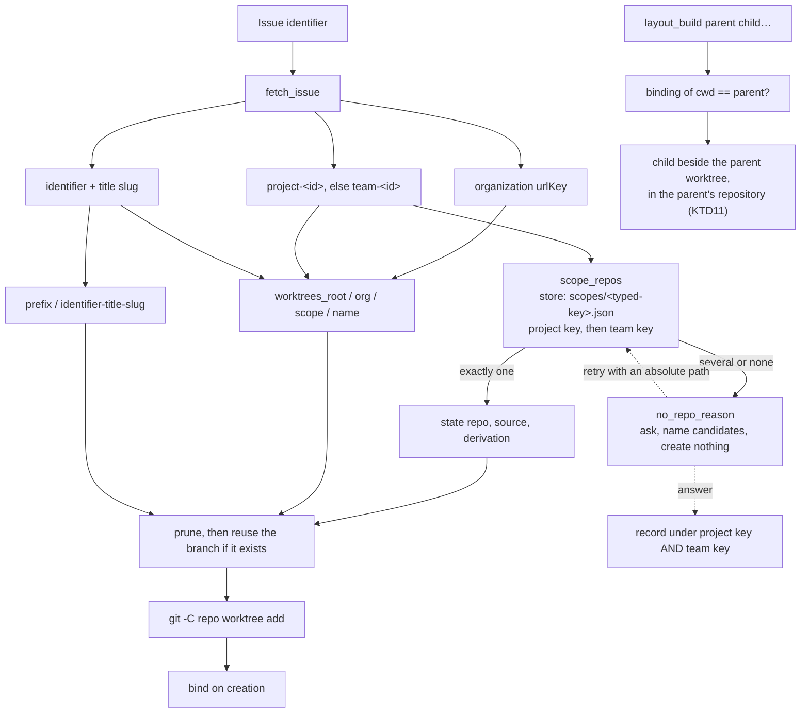

# Ticket-Derived Worktree Location - Plan

## Goal Capsule

- **Objective:** Work started from a ticket lands somewhere that belongs to the ticket, and the person is told which repository it will use and why. Deleting the ephemeral worktrees tree loses only the uncommitted work inside it, and starting the same ticket again afterwards succeeds.
- **Means:** Derive the worktree path from the issue's organisation, scope and identifier instead of the caller's directory, and resolve the repository through a learned one-to-many record that mirrors the existing team rubric (KTD3, KTD5).
- **Product authority:** Shawn. On product behaviour the R-IDs win; on implementation mechanism the KTDs win inside their cited R constraints.
- **Execution profile:** Shell (bash) plugin plus skill prose. This repository has no CI. `plugins/work/tests/run-tests.sh` is the whole automated verification contract.
- **Stop conditions:** Stop and report rather than proceed if `herdr_linear::consent_gate` stops making an unanswered write shadow, if the suite's `self_check` phase stops failing on its deliberately-failing fixture, or if any new test cannot be seen to fail before it passes.
- **Open blockers:** None.

---

## Product Contract

### Summary

`herdr_linear::start_from_issue` places a new worktree under the project of the directory the caller stands in. The location moves to `<worktrees-root>/<org>/<scope>/<TICKET-slug>`, derived from the issue. The repository the worktree is made from becomes a separate, learned, one-to-many fact: resolved and stated when exactly one is known, asked with every candidate named when more than one is, and recorded once answered. The layout command, which is the second site that builds a worktree from the caller's directory, resolves its children as siblings inside the parent's own worktree instead. Containment stops meaning "under the projects root" alone, so the plugin's hooks stay awake in the worktrees it creates.

### Problem Frame

Filing a `WEB-` ticket while standing in the `shrimpshack` plugin repository creates the worktree inside `shrimpshack`. The ticket does not belong to `shrimpshack`. `herdr_linear::_worktree_root` reads `herdr_linear::worktree_project "$from"`, and `start_from_issue` runs `git worktree add` in `herdr_linear::worktree_repo "$from"`. Both answers come from where the person is standing, and neither is a fact about the ticket.

The location and the repository were one decision because they came from one reader. They are two different facts. A worktree does not have to live inside its repository — this was verified by creating one at an unrelated path. And one Linear project touches several repositories, so the repository is often a choice rather than a fact.

The caller's directory decides a worktree's repository in a second place too. `herdr_linear::layout_build` composes its children's paths from `worktree_project`, and `herdr_linear::_make_worktree` calls `worktree_repo` with no argument, so it resolves `$PWD`. Fixing only the first site would leave the same defect standing in the second.

Three further defects follow from the layout change itself. `herdr_linear::contains` recognises only the projects root, so a worktree under the new root reads as `outside` and `hooks/ground.sh` and `hooks/reconcile.sh` both exit 0 — the plugin would go silent in the worktrees it just created. `herdr_linear::worktree_project` truncates at the first `worktrees` path segment, so a path under the new root answers with the home directory. And a branch outlives the worktree that carried it, so once the ephemeral tree is deleted the deterministic path is free but `git worktree add -b` refuses the branch, and both streams are suppressed — the restart fails with nothing printed.

### Key Decisions

- **Worktrees live in a separate ephemeral root, keyed by organisation and scope.** (session-settled: user-directed — chosen over keeping the worktree inside the resolved repository: `~/projects` holds canonical repositories, these worktrees are short-lived, and deleting the whole ephemeral root must always be safe.) Governs R1, R2, R13.
- **The directory name leads with the identifier.** (session-settled: user-directed — chosen over the short human name the code produces today: the identifier makes the directory self-describing and shares a string with the branch.) Governs R3, R14.
- **A Linear project maps to many repositories, not one.** (session-settled: user-directed — chosen over a one-to-one mapping and over deriving the repository from the caller's directory: the real workspace spans several repositories per project, and directory-derivation is the defect being removed.) Governs R5, R6, R7.
- **Linear labels are not the repository mechanism.** (session-settled: user-approved — chosen over the `repo/…` label family the conventions document defines: a real ticket, `WEB-3354`, carries no labels at all, so a label-driven mechanism resolves nothing in practice.) Governs R5.
- **Herdr state follows the Linear model: a space is a project, a tab is a piece of work, a pane is a session.** (session-settled: user-directed — Shawn named this a central premise of the plugin, not a new feature. Chosen over opening the session beside whatever pane is focused, which is today's behaviour and places work in the wrong space.) Governs R17–R20.
- **A space's binding is learned from use, never inferred from its label.** (session-settled: user-directed — "if they dont map ask". Chosen over matching a space to a project by label, which is wrong on Shawn's own machine: the only bound space is labelled `AI-Editor` and carries the project `Cue MVP Launch`.) Governs R18, R19.

### Actors

- A1. The session agent — resolves what it can, states what it resolved, asks when the answer is a choice.
- A2. Shawn — answers the repository question.
- A3. Linear — holds the organisation, the project, the team and the issue.

### Requirements

**Where the worktree goes**

- R1. A worktree started from an issue is created at `<worktrees-root>/<org>/<scope>/<name>`, where `<org>` is the Linear organisation's URL key, `<scope>` is the segment R5a defines, and `<name>` is the directory name R3 defines. No segment is derived from the caller's directory.
- R2. The worktrees root is a configuration surface with its own environment seam, separate from the projects root, and defaults to `$HOME/worktrees`.
- R13. The plugin refuses to create a worktree when the worktrees root resolves empty, resolves to `/` or to the home directory, or equals, contains, or sits inside the projects root. The delete-safety promise the Objective makes is false under any of those, so the plugin does not act under them.
- R3. The worktree directory is named `<IDENTIFIER>-<title-slug>`, hyphen-separated, identifier first, case preserved on the identifier.
- R14. The directory name is always derived from the issue. No caller supplies it.
- R4. The branch carries the repository's branch-prefix convention in front of the same string: `<prefix>/<IDENTIFIER>-<title-slug>`.
- R15. Starting an issue whose worktree directory was deleted succeeds and returns a working worktree. Neither the surviving branch nor the stale registration git kept for the removed path may make it fail.

**Which repository it is made from**

- R5. The repository a worktree is made from is read from a recorded set keyed by the issue's scope. Linear labels may be read as an optimisation and are never the mechanism.
- R5a. Scope is the issue's project when it has one and its team when it does not. The recorded key carries which of the two it is, so a project key and a team key can never collide. A project-keyed lookup that finds nothing falls back to the issue's team key.
- R6. When exactly one repository is recorded for the scope, the plugin resolves it and states the fact, the source it was read from, and the derivation, before it acts.
- R7. When more than one repository is recorded, or none is, the plugin asks, names every candidate, and creates nothing until answered. The caller's own directory is never a tiebreaker; naming it as one of the candidates is allowed.
- R7a. A repository supplied in answer to that question is an absolute path. A relative one is refused before anything is recorded or created, because resolving it would make the caller's directory decide the answer again.
- R8. An answered repository question is recorded against the scope, under both the project key and the team key when the issue has both, so the set accumulates as projects are worked.
- R9. The repository readers mirror the shape and naming of the existing team readers — one verb for every candidate, one verb for the only answer, one verb for why there is no single answer — so the codebase holds one rubric, not two.

**The layout command**

- R16. A layout creates its children beside the parent's own worktree, in the parent's repository. This is a fact about a bound parent, not a choice, so the R7 question never arises for a layout child. The layout verifies that the directory it runs in is bound to the parent issue and refuses otherwise.

**Keeping the plugin awake**

- R10. The containment signal answers `inside` for a path under the worktrees root as well as one under the projects root, so the plugin's hooks run in the worktrees it creates. Each root is resolved independently: an absent projects root must not make every worktrees-root path read `outside`.
- R11. The reader that answers "which project directory is this worktree in" gives a correct answer for a path under the worktrees root, and every site that builds a worktree path from it is changed with it.

**Verification**

- R12. Every behaviour above is covered by a test in `plugins/work/tests/unit/`, and no test writes outside its own temporary directory.

**Session placement** (added after the plan was first written; the premise was settled in session but not recorded, and was lost once when the building agent was restarted)

- R17. A session for an issue opens in the herdr space bound to that issue's project, never beside whatever pane happens to be focused. `herdr_linear::open_session` and the layout builder both split today with no pane, workspace or tab target; both change.
- R18. When the space the person is working from has no binding, the plugin proposes binding it to the issue's project and records the person's answer. The evidence is the pairing it already holds at that moment: `herdr_linear::workspace_id` and the issue's project. `workspace_propose` and `workspace_confirm` in `lib/binding.sh` already exist, nonce-gated, and are unused on this path.
- R19. When the space is bound to a different project, that is the `Misplaced` state `CONCEPTS.md` already defines: report it, offer to move either side, never pick which one was wrong. A space is never matched to a project by its label.
- R20. Within the resolved space, a ticket with no tab gets a new tab, and a ticket that already has one gets a pane inside it. The tab a ticket owns is recorded, not inferred from the tab's label, which is prose. `herdr_linear::tab_id`, `tab_of_pane` and `panes_in_tab` in `lib/herdr-read.sh` already exist.
- R21. No hook binds a space or chooses a tab. A hook has nobody to ask; it records what it would have proposed and surfaces it at the next session start, the same rule the deferred-write notice follows.

### Scope Boundaries

In scope: `plugins/work/lib/contain.sh`, `start.sh`, `linear.sh`, `herdr-write.sh`, a new repository-record module, the fake Linear fixture, the affected suites, the shared test isolation file, the test runner's suite-file floor, and the `start` and `layout` skill prose plus `commands/work.md` where they describe where a worktree is created.

#### Deferred to Follow-Up Work

- A verb that removes a recorded repository. The recovery is deleting the scope's record file, which the `start` skill states; a verb for it is not needed to ship this.
- Migrating worktrees that already exist under `<project>/worktrees/`. Existing bindings are keyed by resolved path and keep working where they are.
- A `repo/…` label reader as an optimisation ahead of the recorded set. R5 permits it; nothing in this plan needs it.
- Retiring `herdr_linear::worktree_project` entirely. R11 hardens it; removing it is a wider refactor.

#### Outside this change

- The `wt`, `wtl` and `wtc` shell helpers and the `~/projects/<project>/worktrees/` convention they implement. They live outside this repository, and they will not see the new root. This is a real consequence of the move and is named here rather than hidden.

### Acceptance Examples

- AE1. **Covers R1, R3.** Given issue `WEB-3318` in an organisation whose URL key is `acme`, project `AI Canvas Tools`, when a worktree is started for it from an unrelated directory, then the worktree is at `<worktrees-root>/acme/ai-canvas-tools/WEB-3318-ai-tools-drawer-is-blank…` and no path segment came from the caller's directory.
- AE2. **Covers R1, R5a.** Given an issue with no project and team key `WEB`, when a worktree is started for it, then the scope segment is `web` and the recorded repository set for that issue is keyed under the team.
- AE3. **Covers R6.** Given exactly one repository recorded for the scope, when a worktree is started, then it is created from that repository and the run states the repository, the record it was read from, and that it was the only one recorded.
- AE4. **Covers R7.** Given three repositories recorded for the scope, when a worktree is started, then nothing is created, and the reason names all three.
- AE5. **Covers R7.** Given three repositories recorded for the scope and the caller standing inside one of them, when a worktree is started, then nothing is created and the question is still asked.
- AE6. **Covers R7, R8.** Given no repository recorded for the scope, when a worktree is started, then nothing is created and the reason says so; when the answer is supplied and the start is retried, the worktree is created and the repository is recorded.
- AE7. **Covers R10.** Given a path under the worktrees root, when the containment signal is read, then it answers `inside` — including when the projects root does not exist.
- AE8. **Covers R4.** Given issue `WEB-3318`, when a worktree is started with the default prefix, then the branch is `feature/WEB-3318-…` and the directory is `WEB-3318-…`.
- AE9. **Covers R15.** Given a worktree that was created and then deleted from disk, when the same issue is started again, then a working worktree is returned on the same branch.
- AE10. **Covers R13.** Given a worktrees root set equal to the projects root, when a worktree is started, then nothing is created and the reason names the overlap.
- AE11. **Covers R16.** Given a layout run from a worktree bound to parent `WEB-2870`, when children `WEB-3318` and `WEB-3317` are laid out, then both worktrees sit beside the parent's own worktree and are made from the parent's repository, whatever repository the recorded set holds.
- AE12. **Covers R5a, R8.** Given a repository answered for an issue that has both a project and a team, when a later issue in that team but with no project is started, then the recorded repository resolves without asking again.

---

## Planning Contract

### Key Technical Decisions

- KTD1. **The branch keeps its prefix; the directory does not carry one.** The branch is `feature/WEB-3354-phantom-picker-rows` and the directory is `WEB-3354-phantom-picker-rows`. This trades away the strict property that the branch and the directory are one identical string. It is taken because the repository's branch convention (`feature/`, `task/`, `bugfix/`, `hotfix/`) is a standing rule, `HERDR_LINEAR_BRANCH_PREFIX` is an existing seam, and the identifier still appears in both strings so branch matching still finds the worktree. Setting the prefix to empty produces the identical-string form without a code change. Governs R3, R4.
- KTD2. **Both strings are built from `identifier + title-slug`, not from Linear's `branchName`.** Linear's `branchName` is lowercase (`web-3318-…`), so a directory derived from it cannot lead with an uppercase identifier. `herdr_linear::slug` preserves case, so an identifier survives slugging when the string is composed locally. Governs R3, R4.
- KTD3. **The scope key is typed, and a project lookup falls back to the team.** The record key is `project-<id>` or `team-<id>` — hyphen rather than colon, because `herdr_linear::is_safe_identifier` rejects a colon and the key becomes a filename. Typing the key keeps project ids and team ids out of one collision space. The fallback and the double-record in R8 are what stop a triaged issue from re-asking a question the plugin already holds the answer to: without them a team-keyed answer is invisible to every issue in that team that later gains a project. Governs R5, R5a, R8.
- KTD4. **The worktrees root is its own reader with its own seam, containment accepts either root, and an overlapping root is refused.** `herdr_linear::worktrees_root` mirrors `herdr_linear::projects_root`; `herdr_linear::contains` resolves each root independently and returns true for a path at or under either, so an absent projects root cannot make every worktrees-root path read `outside`. A root that overlaps the projects root, or is `/` or the home directory, is refused outright per R13 — the delete-safety promise is a property of the configuration, not of the default. Leaving containment alone was the alternative; it makes the plugin silent in every worktree it creates, because `hooks/ground.sh` and `hooks/reconcile.sh` exit 0 on an `outside` signal. Governs R2, R10, R13.
- KTD5. **The repository readers are a three-verb mirror of the team readers.** `herdr_linear::scope_repos` prints every candidate one per line and fails only on a real error; `herdr_linear::scope_repo` prints the only candidate or nothing, succeeding either way; `herdr_linear::no_repo_reason` says why there is no single answer and names the candidates. This is the shape `project_teams` / `project_team` / `no_team_reason` already use in `plugins/work/lib/context.sh`. Governs R6, R7, R9.
- KTD6. **The repository record is a new schema in the existing store, sharing the lock and the atomic-save discipline.** Records live at `$HERDR_LINEAR_STORE_DIR/scopes/<typed-key>.json` beside `bindings/` and `workspaces/`, and reuse `herdr_linear::_lock` / `_unlock` and the same write-temp-in-the-same-directory-then-rename technique. They do not reuse the binding record's own reader: that reader validates a five-value state enum and requires `worktree_path`, and a set of repository paths has neither. The workspace record already strains that schema by carrying a project id in `issue_identifier`; repeating the strain would be worse than one extra schema over one shared lock. Governs R5, R8.
- KTD7. **`start_from_issue` gains an ask outcome and an optional absolute repository argument, and `start_new` passes both through.** A distinct exit value means "the repository is a choice" and the reason goes to stderr; the caller supplies the answer on the retry, and a supplied answer is recorded. `start_new` must propagate the ask value rather than collapsing it into a flat failure — it has already filed a real issue by then, and a flat failure leaves the person with a ticket, no worktree, and no question to answer. No `lib/` verb prompts: the ask lives in the skill, which is where the person is. Governs R7, R7a, R8.
- KTD8. **The organisation URL key is a new query with its own fixture arm, and the fixture's key is brand-neutral.** `plugins/work/lib/linear.sh` has no organisation query and `plugins/work/tests/fixtures/fake-linear.sh` has no organisation arm. The fixture routes by request-body content before mode, and its `*'project(id:'*` arm is the precedent to follow. The fixture answers `acme`, not the real organisation's key: `brand_scan` in `run-tests.sh` walks the whole plugin tree including `tests/fixtures/`, so the real key in a fixture turns the suite red. Governs R1.
- KTD9. **The worktrees-root seam is added to the shared test isolation file before any other change.** `plugins/work/tests/unit/setup_common.bash` points every seam back inside the test's own directory. Without the seam there first, every `start_from_issue` test writes into the real `$HOME/worktrees`. A disk-filling incident already happened in this repository when a runner resolved its root to `/`. Governs R12.
- KTD10. **A restart after deletion prunes, then reuses the branch.** Before `git worktree add`, the resolved repository is pruned and the derived branch is checked; when the branch already exists the worktree is added onto it without `-b`. The branch lives in the repository, not the worktree, so it survives the delete the Objective calls safe, and git also keeps a registration for the removed path. Without both steps the deterministic path is free, `add -b` refuses, and `start.sh` suppresses both streams — the documented "just run it again" recovery fails silently. Governs R15.
- KTD11. **A layout child is a sibling of its parent, in the parent's repository.** The layout puts each child at `<parent-worktree-parent-dir>/<CHILD>-<title-slug>` and runs `git worktree add` in `herdr_linear::worktree_repo "<parent worktree>"`. This closes the caller-directory defect at the layout site without giving layout an ask flow of its own: a bound parent's repository is a fact, so R6 applies and R7 never fires, and a mid-loop question that the journal has already partly recorded never arises. It also needs no organisation or scope lookup, and works whether the parent sits at the old per-project layout or the new root. `herdr_linear::layout_build` takes the parent identifier and not a path, so the parent worktree is the directory the layout runs in, verified by comparing its binding to the parent identifier and refused when they disagree. That is identity verification, which `bind` already does, not repository derivation. Governs R16, R11.
- KTD12. **One resolution rule, not four copies.** Team, repository, space and tab are four instances of one rule: exactly one known answer — resolve it and state the fact and its source (R4 of the parent plan); more than one — ask and name every candidate; none — ask and record the answer. `project_team` / `project_teams` / `no_team_reason` are the reference shape. Writing that logic a third or fourth time is the signal to factor it; each site then supplies only its candidate reader and its record. Governs R5–R7, R17–R20.
- KTD13. **The binding record is the only authority for a space or a tab.** Labels are prose and drift. Live state on Shawn's machine proves it: four spaces, one bound, and that one's label names a different project than its record. Governs R18–R20.
- KTD14. **The current directory's repository is a candidate, never an answer.** When the worktree the person stands in is itself bound to an issue in the same project, its repository is a strong default to offer inside the ask. Otherwise it is meaningless and using it is the defect this plan removes. A unit that proposed passing `worktree_repo "$wt"` as the answer was corrected on exactly this point. Governs R5–R7.

### High-Level Technical Design



The separation that makes this work: the **path** is a fact about the ticket, and the **repository** is a fact about the scope that may not be settled yet. Today one reader answers both from the caller's directory. The layout is the exception that proves the rule — its repository is a fact about the parent, so it resolves without asking.

### Assumptions

- The organisation URL key is stable enough to key a path. It is the value that appears in Linear URLs. A workspace rename gives new worktrees a new parent directory; existing bindings resolve by path and keep working.
- The project **name** is the path segment while the project **id** is the record key, so renaming a project in Linear puts that project's later worktrees under a second parent directory. Nothing breaks — leaf names lead with the identifier, so no two collide, and the record stays whole.
- Re-triaging an issue into a project after its worktree exists changes the scope segment, so the next start for that issue derives a different path. The existing worktree stays bound where it is. No migration is built for this.
- Recording the repository as a resolved absolute path is sufficient. A repository that moves is re-asked and re-recorded, which is the same behaviour as a candidate that no longer exists.
- `brand_scan` walks the whole plugin tree, tests and fixtures included, so the prohibition on the organisation's name covers fixture data as well as shipped code. The org segment itself is read from Linear at run time and is never a literal in the tree.
- `herdr_linear::binding_propose` overwrites an existing bound record at the same path key rather than refusing it, so a worktree deleted and recreated at the same path rebinds without an unbind step. Verified in the record writer's `propose` branch.

### Sequencing

U1 first and alone: the test seam must exist before any test can exercise a worktree-creating path. U2 and U3 are independent of each other. U4 depends on U2 and U3. U5 depends on U4. U6 depends on U4 and U5.

---

## Implementation Units

### U1. The worktrees root, its seam, containment, and the disjointness rule

- **Goal:** A second root exists, is configurable, is pointed inside the sandbox by every test, reads as `inside`, and is refused when it overlaps the projects root.
- **Requirements:** R2, R10, R13, R12
- **Dependencies:** none
- **Files:** `plugins/work/lib/contain.sh`, `plugins/work/tests/unit/setup_common.bash`, `plugins/work/tests/unit/contain.bats`
- **Approach:**
  1. Add `HERDR_LINEAR_WORKTREES_ROOT` to `setup_common.bash`, pointing at `$sandbox/worktrees`, before anything else in this plan is written (KTD9).
  2. Add `herdr_linear::worktrees_root`, mirroring `herdr_linear::projects_root`, defaulting to `$HOME/worktrees`.
  3. Change `herdr_linear::contains` to resolve each root independently and answer true when the path is at or under either. An unresolvable root must skip that root and still let the other one answer — the current single-root form returns early on an unresolvable root, which would make every worktrees-root path read `outside` whenever the projects root is absent.
  4. Add a reader that says whether the worktrees root is usable, refusing an empty value, `/`, the home directory, and any root that equals, contains, or sits inside the projects root (R13). It answers; the caller refuses.
- **Patterns to follow:** `herdr_linear::projects_root` and `herdr_linear::contains` in the same file, including the resolve-both-operands and trailing-separator discipline the file's header explains. Do not copy the deprecated-name warning block — there is no old spelling for this seam.
- **Test scenarios:**
  - Covers AE7. A path under the worktrees root answers `inside`.
  - Covers AE7. A path under the worktrees root still answers `inside` when the projects root does not exist on disk.
  - A path under the projects root still answers `inside` when the worktrees root does not exist on disk.
  - A path under neither answers `outside`.
  - A sibling directory whose name begins with the worktrees root's path (`worktreesOther`) answers `outside`.
  - A symlink under the worktrees root pointing outside it answers `outside`.
  - The worktrees root itself answers `inside`.
  - With the seam unset, the reader answers `$HOME/worktrees`.
  - The usability reader refuses an empty root, `/`, the home directory, a root equal to the projects root, a root containing the projects root, and a root inside the projects root; it accepts a disjoint root.
- **Verification:** The suite passes, and the new containment tests fail when the second root is removed from `contains`.

### U2. The scope repository record and its readers

- **Goal:** A learned, recorded, one-to-many set of repositories per typed scope, read through three verbs shaped like the team readers.
- **Requirements:** R5, R5a, R6, R7, R8, R9, R12
- **Dependencies:** U1
- **Files:** `plugins/work/lib/repos.sh` (new), `plugins/work/tests/unit/repos.bats` (new), `plugins/work/tests/run-tests.sh`
- **Approach:**
  1. Create `lib/repos.sh` holding the record path helper (`$HERDR_LINEAR_STORE_DIR/scopes/<typed-key>.json`), a python reader and writer, and `herdr_linear::record_scope_repo`. Reuse `herdr_linear::_lock` / `_unlock` and the write-temp-then-rename discipline per KTD6.
  2. Build the typed key as `project-<id>` or `team-<id>` per KTD3, and validate it as a safe identifier before it becomes a path segment, the way `herdr_linear::_workspace_record_path` already does. `lib/repos.sh` carries the source guard for `sanitize.sh` so the runner's identifier-path check is satisfied.
  3. Add `herdr_linear::scope_repos`, `herdr_linear::scope_repo` and `herdr_linear::no_repo_reason` to `lib/repos.sh` per KTD5. `scope_repo` prints nothing and succeeds when the set holds none or several — "cannot tell" is the answer, not an error. `scope_repos` takes the project key and the team key and falls back from the first to the second (R5a).
  4. `record_scope_repo` refuses a relative path (R7a), records a path resolved with `pwd -P`, de-duplicates on write, and records under both the project key and the team key when both are given (R8).
  5. Bump `HERDR_LINEAR_MIN_SUITES` in `run-tests.sh` from 18 to 19 for the new suite file, and say why in the commit.
- **Patterns to follow:** `herdr_linear::project_teams` / `project_team` / `no_team_reason` in `lib/context.sh` for the verb shapes and the line contract. `herdr_linear::_workspace_record_path` in `lib/binding.sh` for the store-subdirectory and identifier-validation pattern.
- **Test scenarios:**
  - An unrecorded scope: `scope_repos` prints nothing and succeeds; `scope_repo` prints nothing and succeeds; `no_repo_reason` says none is known and says to ask.
  - One recorded repository: `scope_repo` prints it.
  - Three recorded repositories: `scope_repos` prints three lines; `scope_repo` prints nothing and succeeds; `no_repo_reason` names all three.
  - Covers AE12. A repository recorded with both keys resolves from the team key alone when the project key holds nothing.
  - A project key and a team key carrying the same underlying id are two different records, not one.
  - Recording the same repository twice leaves exactly one entry.
  - Recording a relative path is refused and writes nothing.
  - A scope key containing a path traversal is refused and writes no file outside the store.
  - A truncated or non-JSON record file reads as empty rather than crashing the caller.
  - Two concurrent writers recording different repositories for one scope both survive, and the record holds both.
- **Verification:** The suite passes with 19 suite files. Removing the de-duplication makes the duplicate test red; removing the identifier validation makes the traversal test red; removing the team fallback makes AE12 red.

### U3. Organisation key, typed scope, and the two derived strings

- **Goal:** The organisation URL key is readable, scope is typed, and the path name and branch name are both built from the identifier and the title with no caller override.
- **Requirements:** R1, R3, R4, R5a, R14, R12
- **Dependencies:** U1
- **Files:** `plugins/work/lib/linear.sh`, `plugins/work/lib/start.sh`, `plugins/work/tests/fixtures/fake-linear.sh`, `plugins/work/tests/unit/linear.bats`, `plugins/work/tests/unit/fake-linear.bats`, `plugins/work/tests/unit/start.bats`
- **Approach:**
  1. Add `herdr_linear::organization_key` to `lib/linear.sh`, querying `organization { urlKey }`.
  2. Add an `organization` arm to `fake-linear.sh`, routed by request-body content, placed so it cannot be captured by an existing arm. It answers `acme`, never the real organisation's key (KTD8). Give it a controllable empty-answer mode so the caller's failure path is testable.
  3. Replace `herdr_linear::start_default_name` with a name built from the issue's identifier and title: `<IDENTIFIER>-<title-slug>`, with the title lowercased and the identifier's case preserved, cut at a bounded length on a word boundary the way the current function does.
  4. Retire the caller-supplied worktree-name parameter from `herdr_linear::start_from_issue` and `herdr_linear::start_new` (R14). A supplied name can drop the identifier, which is the property KTD1 leans on when it trades the identical-string form away.
  5. Change `herdr_linear::start_branch_name` to compose `<prefix>/<the same string>` rather than slugging Linear's `branchName` (KTD1, KTD2).
  6. Add a scope reader that returns the typed key — `project-<id>` when the issue has a project and `team-<id>` when it does not — plus the team key alongside it, and the matching path segment: project name lowercased and slugged, else the team key lowercased (KTD3).
- **Patterns to follow:** `HERDR_LINEAR_ISSUE_FIELDS` and `herdr_linear::fetch_issue` for query shape. `herdr_linear::slug` for every string that becomes a path segment. The existing word-boundary cut in `start_default_name`.
- **Test scenarios:**
  - Covers AE8. `WEB-3318` with the default prefix yields branch `feature/WEB-3318-ai-tools-drawer-is-blank…` and name `WEB-3318-ai-tools-drawer-is-blank…`, and the branch is the name with the prefix in front.
  - An empty `HERDR_LINEAR_BRANCH_PREFIX` yields a branch identical to the directory name.
  - A title long enough to be cut loses the severed remnant, and a short title keeps its last word.
  - An issue whose identifier is a traversal (`../escaped`) produces no name and no path.
  - An issue whose title carries terminal escape bytes produces a name holding none of them.
  - The organisation reader returns `acme` from the fixture, and returns nothing without crashing when the fixture answers empty.
  - Covers AE2. An issue with a null project resolves its typed key to `team-<id>` and its segment to the lowercased team key.
  - An issue with a project resolves its typed key to `project-<id>`, returns the team key alongside, and resolves its segment to the slugged, lowercased project name.
- **Verification:** The suite passes, including the wire smoke phase's brand scan. Reverting the branch composition to Linear's `branchName` makes the identifier-case test red; putting the real organisation key back in the fixture makes the brand scan red.

### U4. Start from an issue at the ticket-derived path, in the resolved repository

- **Goal:** `start_from_issue` derives its path from the issue and its repository from the recorded set, states what it resolved, asks when the answer is a choice, and survives a deleted worktree.
- **Requirements:** R1, R5, R6, R7, R7a, R8, R13, R15, R12
- **Dependencies:** U2, U3
- **Files:** `plugins/work/lib/start.sh`, `plugins/work/tests/unit/start.bats`
- **Approach:**
  1. Replace `herdr_linear::_worktree_root` with a reader that composes `<worktrees_root>/<org>/<scope-segment>` and takes no directory argument. Refuse before composing when U1's usability reader rejects the root (R13).
  2. Add an ask exit value and an optional repository argument to `start_from_issue` (KTD7). When the repository is a choice, print `no_repo_reason` to stderr, create nothing, and return the ask value. Refuse a relative repository argument outright (R7a).
  3. When a repository is supplied by the caller, record it for the scope — under both keys per R8 — before creating the worktree.
  4. When exactly one repository is recorded, print the R6 sentence to stderr before `git worktree add` — the repository, the record file it was read from, and that it was the only one recorded. Stdout stays the worktree path alone; the existing comment in this file records what happened the last time something else reached stdout.
  5. Prune the resolved repository, then check whether the derived branch already exists; add the worktree onto the existing branch rather than creating it when it does (KTD10).
  6. Run `git worktree add` in the resolved repository, not in `herdr_linear::worktree_repo "$from"`.
  7. Propagate the ask exit value out of `herdr_linear::start_new` instead of collapsing it into the failed value, and give `start_new` the same optional repository argument (KTD7). The created identifier must still reach stderr so the person can retry.
  8. Keep the existing already-exists, wrong-owner and rebind branches unchanged; only the path they test moves.
- **Patterns to follow:** The existing exit-value enum at the top of `lib/start.sh`. The existing `>/dev/null 2>&1` on `git worktree add` and the reason given for it.
- **Test scenarios:**
  - Covers AE1, AE3. One recorded repository, caller standing in an unrelated directory: the worktree is created under the worktrees root at the org, scope and identifier-led name; stdout is the path alone; stderr names the repository, its source, and the derivation.
  - Covers AE4. Three recorded repositories: nothing is created, the ask value is returned, and stderr names all three.
  - Covers AE5. Three recorded repositories with the caller standing inside one: still nothing created, still asked.
  - Covers AE6. No recorded repository: nothing created and the ask value returned; supplying an absolute repository on a retry creates the worktree and records it under both keys.
  - Covers AE9. A worktree created, then removed from disk, then started again: a working worktree comes back on the same branch.
  - Covers AE10. A worktrees root set equal to the projects root: nothing is created and the reason names the overlap.
  - A relative repository argument is refused, and nothing is recorded or created.
  - A from-nothing start against a multi-candidate scope returns the ask value, not the failed value, and names the identifier it created on stderr.
  - The created worktree is bound to the issue.
  - A second start for the same issue with a bound worktree already present returns the existing path and creates nothing.
  - A directory already at the target path that belongs to a different issue returns the exists value.
  - The path contains no segment from the caller's directory, asserted by starting the same issue from two different directories and getting one path.
  - An unreachable organisation query returns the failed value and creates no worktree at a path with an empty segment.
  - A failing `git worktree add` returns the failed value and leaves no binding.
- **Verification:** The suite passes. Restoring the caller-directory root makes the two-callers-one-path test red; removing the several-candidates branch makes the ask tests red; removing the prune-and-reuse step makes AE9 red.

### U5. The layout site, and the reader it shares

- **Goal:** The layout creates its children beside the parent, in the parent's repository, and `worktree_project` answers correctly under the new root.
- **Requirements:** R11, R16, R12
- **Dependencies:** U4
- **Files:** `plugins/work/lib/contain.sh`, `plugins/work/lib/herdr-write.sh`, `plugins/work/lib/linear.sh`, `plugins/work/tests/unit/contain.bats`, `plugins/work/tests/unit/herdr-write.bats`
- **Approach:**
  1. Change `herdr_linear::worktree_project` to test the worktrees root before its `*/worktrees/*` case, so a path under the ephemeral root answers with the repository the worktree was made from rather than the segment above the first `worktrees` directory.
  2. In `herdr_linear::layout_build`, verify that the directory the layout runs in is bound to the parent identifier, and refuse with the bad-name or a named refusal value when it is not (KTD11). The verb takes the parent identifier, not a path, so this is the only way it can know which worktree is the parent's.
  3. Compose each child's path as a sibling of that parent worktree, named per R3 — which needs each child's title, so fetch each child issue. A child whose fetch fails refuses the layout rather than composing a path with an empty segment.
  4. Give `herdr_linear::_make_worktree` an explicit repository parameter and pass the parent worktree's repository into it, replacing its argument-less `herdr_linear::worktree_repo` call. That call is the layout's copy of the defect this plan removes.
- **Patterns to follow:** The reader ordering already used in `worktree_project`'s `case` block. `herdr_linear::binding_identifier` for the parent check, as `bind` uses it. Replace the comment in `herdr-write.sh` that explains the old layout path with the new reason; do not stack a second explanation on top.
- **Test scenarios:**
  - Covers R11. `worktree_project` on a path under the worktrees root answers the repository it was made from, not the home directory.
  - `worktree_project` on `<project>/worktrees/<feature>` still answers the project.
  - `worktree_project` on a plain checkout still answers the checkout.
  - Covers AE11. A layout for two child issues run from the parent's worktree creates both beside it, from the parent's repository, even when the recorded set for the scope names a different repository.
  - A layout run from a directory not bound to the parent issue refuses and creates nothing — no tab, no worktree, no pane.
  - A layout run from a directory bound to a different issue refuses.
  - A child issue whose fetch fails refuses the layout rather than creating a worktree with an empty path segment.
  - A layout retry finds the existing worktrees through the journal and creates nothing a second time.
- **Verification:** The suite passes. Restoring `_make_worktree`'s argument-less repository read makes the parent-repository assertion in AE11 red; removing the parent check makes the wrong-directory tests red.

### U6. The skills say where the worktree goes and ask the repository question

- **Goal:** The person reading the skill learns the new location rule, is told to ask with candidates named when the repository is a choice, and the wire checks still pass.
- **Requirements:** R6, R7, R14, R16
- **Dependencies:** U4, U5
- **Files:** `plugins/work/skills/start/SKILL.md`, `plugins/work/skills/layout/SKILL.md`, `plugins/work/commands/work.md`, `plugins/work/tests/unit/wire.bats`
- **Approach:**
  1. Replace the `start` skill's description and body text about "the project's own worktrees directory" with the ticket-derived rule, and remove its guidance to ask for a short name and its example that passes one (R14).
  2. Add the repository fence: read the candidates, state the resolution when there is one, ask and name every candidate when there is not, and pass an absolute path back on the retry. The ask stays in the skill — no `lib/` verb prompts.
  3. Add `lib/repos.sh` and anything it transitively needs to the `start` skill's bash source fence, and add the ask exit value as a row in both of that skill's exit tables. The runner's skill-to-lib check fails the whole suite when a fence names a verb whose defining file it does not source.
  4. State the recovery for a wrongly recorded repository: delete the scope's record file under the store's `scopes/` directory. The verb for it is deferred.
  5. Update the `layout` skill to say that children are created beside the parent's worktree in the parent's repository, and that the layout must be run from the parent's worktree.
  6. Update `commands/work.md` where it says starting from an issue creates the worktree, so it says the run may instead come back asking which repository to use.
- **Patterns to follow:** The act-or-ask rubric these skills already carry, and the `no_team_reason` question they already ask about teams. Match that question's shape so a reader sees one pattern.
- **Test scenarios:**
  - The `start` skill cites the repository readers by name, mirroring the existing `propose.bats` assertion that the `bind` skill cites `herdr_linear::path_signal`. The assertion lives in `wire.bats`, beside the other skill-fence checks.
  - The `start` skill's exit table carries a row for the ask value.
- **Verification:** The suite passes, including the wire smoke, skill-to-lib, brand scan and secret scan phases.

---

### U7. The session opens in the project's space, in the ticket's tab

- **Goal:** Placement follows the Linear model. A session lands in the space bound to the issue's project, in the tab that ticket owns or a new one, and a space with no binding is asked about and recorded rather than guessed.
- **Requirements:** R17, R18, R19, R20, R21.
- **Dependencies:** U4 (the resolved worktree path), U5 (the layout site).
- **Files:** `plugins/work/lib/herdr-write.sh` (`open_session`, the layout builder), `plugins/work/lib/herdr-read.sh`, `plugins/work/lib/binding.sh` (only if the tab record needs a home), the write skills' fences, and their suites.
- **Approach:** Read `herdr pane split --help` and the `herdr workspace`, `herdr tab` and `herdr pane` vocabulary first; the tool accepts a target and the plugin has never passed one. Resolve space, then tab, through the one rule in KTD12. Record the tab a ticket owns alongside its existing binding before inventing a second store. Extend the single-caller check in `run-tests.sh` to cover `workspace_confirm` if it is not already covered, because a space binding is a person's answer exactly as consent is.
- **Test scenarios:** a bound space receives the session and the focused space does not; an unbound space proposes a binding and records only on a person's answer; a space bound to a different project reports misplaced and moves nothing; a ticket with a tab gets a pane in it, a ticket without one gets a new tab; a hook proposes nothing and records what it would have proposed; a space whose label names the project but whose record does not is treated as unbound.
- **Verification:** no real mutation of Shawn's herdr layout while testing. The herdr binary is faked the way `fake-linear.sh` fakes the tracker.

---

## Verification Contract

This repository has no CI. Run the suite only through the honest-run wrapper, and read the `verdict:` line:

```
bash ~/.claude/tools/honest-run/run.sh --expect "PASS" -- bash plugins/work/tests/run-tests.sh
```

No `verdict:` line means the run did not finish. An empty or quiet log is not a pass.

Gates:

- The suite's `self_check` phase must still report its deliberately-failing fixture as failing.
- `run_suite` must find at least `HERDR_LINEAR_MIN_SUITES` suite files.
- `brand_scan` must stay clean. It walks the whole plugin tree, fixtures included.
- Every new test must be seen to fail before the code that satisfies it is written. Exit 127 or "command not found" is not a red — it proves absence, not a failing assertion.
- Finished code is mutation-tested in a throwaway copy under the session scratchpad. Assert the copy is the plugin before anything recursive, and remove it afterwards. A mutation that reddens no test is a finding, not reassurance.
- No test may write outside its own temporary directory. `setup_common.bash` is the enforcement point.

## Definition of Done

Global:

- The suite passes through the honest-run wrapper with a `verdict:` line, at the raised suite-file count.
- Each new assertion has been observed failing against the unmodified code, and each finished verb has been mutation-tested.
- No abandoned or experimental code remains in the diff.
- `docs/handoff.md` is neither staged nor edited.
- No write reached the real Linear tracker; any exercise of a write path is shown to have stayed shadow.

Per unit:

- U1: containment answers `inside` under both roots independently, an overlapping worktrees root is refused, and every suite runs against a sandboxed worktrees root.
- U2: the three repository readers answer an unrecorded, a single and a multiple scope correctly, a team-keyed answer resolves for a project-carrying issue, and the record survives a concurrent write.
- U3: the directory name leads with the identifier in its original case, no caller can override it, the branch is that name behind the prefix, and the brand scan is clean.
- U4: the worktree path is identical when started from two different directories, a multi-candidate scope creates nothing, and a start after the directory was deleted returns a working worktree.
- U5: the layout creates children beside the parent from the parent's repository, refuses when not run from the parent's worktree, and `worktree_project` answers correctly under the new root.
- U6: the `start` skill states the location rule, the repository question and the record-file recovery, and every wire check passes.
