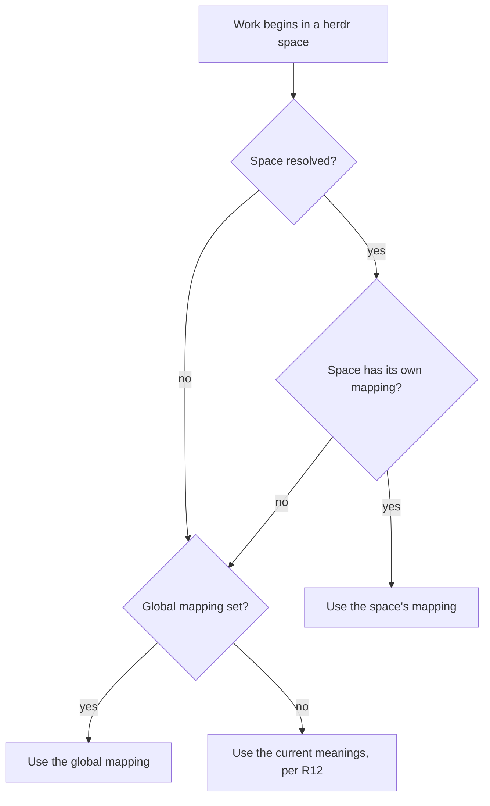
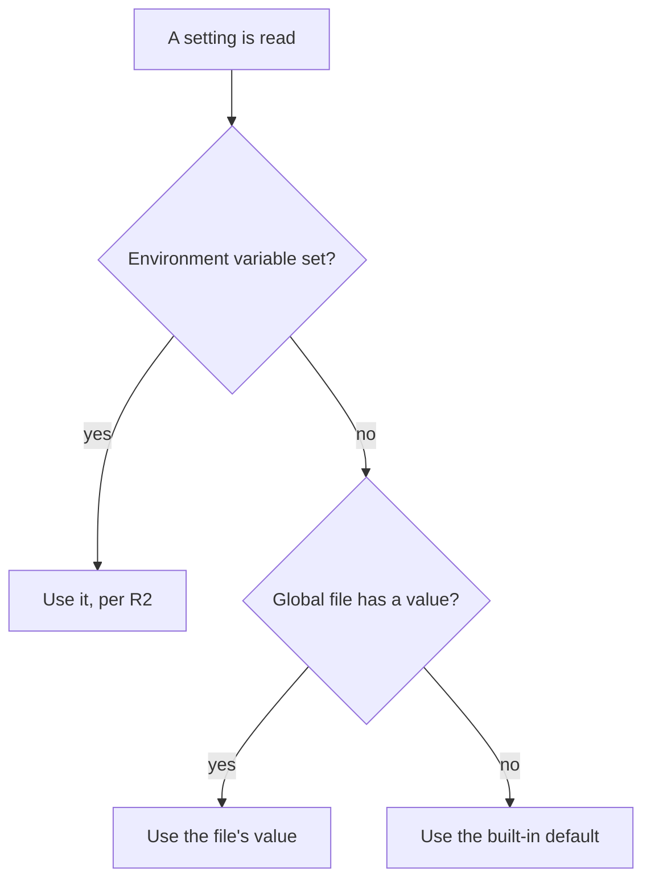

# Work Plugin Configuration - Plan

## Goal Capsule

- **Objective:** A person can change the conventions the `work` plugin follows — where worktrees live, how things are named, which rulebook it reads, and what a herdr space and tab mean — without editing shell — by hand, or by asking the agent — and the plugin holds no setting that names a particular person or company.
- **Means:** Two sequenced parts (KTD1). Settings that fit a single value stay environment variables and become discoverable. The herdr mapping, which is a relation rather than a value, moves into a configuration file that is set globally and overridable per space.
- **Product authority:** This plan owns both parts. They are sequenced by choice, not dependency — Part A ships without Part B, and either could have been planned alone.
- **Open blockers:** None. Every question that blocked planning is resolved and recorded below.

---

## Product Contract

### Summary

Make the `work` plugin's conventions settable. Part A documents the settings that already exist, adds named schemes for how things are named, a settable conventions-document path, and a switch for whether starting work opens a herdr session. Part B introduces a configuration file that lets a herdr space, tab, and pane mean something other than project, piece of work, and session — set globally, overridable per space.

### Problem Frame

The plugin has accumulated a lot of opinion, and all of it is settled in code. It derives a worktree's location from the ticket, places a session in the herdr space bound to the ticket's project, and picks or creates a tab for it. Each of those encodes a convention that belongs to one person.

The conventions are also uneven in how reachable they are. About a dozen settings already work as environment variables, but they are documented only at the line that reads them, so they cannot be found by someone looking for them — including the person who wrote them. That cost has already been paid once: renaming `HERDR_LINEAR_SLATE_ROOT` to `HERDR_LINEAR_PROJECTS_ROOT` silently orphaned a setting that was in use, which is why a deprecation warning now exists at `plugins/work/lib/contain.sh:45`.

Other conventions have no seam at all. The worktree name shape and its length caps are fixed in `plugins/work/lib/start.sh`. There is no notion of a Scheme anywhere: a name is either what one shell function returns or a hardcoded literal, and neither can be chosen. A tab is labelled with the ticket identifier at two sites that reach it by different routes, and nothing lets a person ask for anything else.

### Key Decisions

- **Portable by construction, without onboarding.** Nothing in the configuration surface names a person, company, or account, but no first-run flow, validation experience, or documentation is built for anyone other than the author. (session-settled: user-directed — chosen over building for anyone who installs the plugin: portability is a property of the file, not a product commitment.) Governs R3.
- **Environment variables for everything a single value can express.** A configuration file is introduced only where a setting is a relation rather than a value. (session-settled: user-directed — chosen over adopting the `routes.json` file pattern for all settings: three of the named knobs already exist as environment variables and work.) Governs R1, R2, R10.
- **A fixed set of named schemes, rendered by the plugin.** Naming is chosen from an enumerated set rather than a template or placeholder syntax. (session-settled: user-directed — chosen over template placeholders and over skill prose reading a raw setting: an enumeration is testable and cannot grow into a language.) Governs R4, R5, R6.
- **The herdr mapping becomes configurable.** What a space, tab, and pane correspond to is stated rather than assumed, despite the current meanings being treated as a premise rather than a setting in `docs/plans/2026-09-11-0753-refactor-ticket-derived-worktree-location-plan.md`. That plan's KTD13 — a binding, never a label, is the only authority for a space or tab — is not overturned and constrains this work. (session-settled: user-directed — chosen over making only session placement configurable: the cost to the existing vocabulary was stated and accepted.) Governs R10, R14.
- **A mapping is scoped to a herdr space, with a global default.** Redefinition is opt-in per space rather than a single global change. (session-settled: user-directed — chosen over a single global mapping: opt-in per space means no existing binding has to migrate.) Governs R11, R12, R13.
- **An unresolvable space falls back to the global mapping.** Work proceeds rather than stopping when the space cannot be determined. (session-settled: user-directed — chosen over refusing, and over refusing only when some space overrides: a machine with no herdr running must still be able to work.) Governs R16.
- **Disagreement between spaces is the feature, not a fault.** Reconciliation judges a worktree under its own space's mapping and says nothing about how that compares to another space's placement. (session-settled: user-directed — chosen over reporting the difference as output and over treating it as a finding: per-space override is deliberate, so its normal state must not read as a problem.) Governs R17.
- **The agent writes the configuration, not only the person.** A verb sets a value and a skill fronts it, so a convention can be changed by asking rather than by editing JSON. (session-settled: user-directed — chosen over a hand-edited file the plugin only reads: stating a convention in conversation is the point of the plugin having one.) Governs R18, R19, R20.
- **"Change the doc repository" means where conventions are read from.** The destination of published documents stays Linear. (session-settled: user-directed — chosen over making the publish destination settable: the itch is editing the rulebook, not moving the output.) Governs R9.

### Requirements

**Discoverable settings**

- R1. Every setting a person may change is listed in one document, with its name, its default, and what changes when it is set.
- R2. Settings that work today keep their current names, defaults, and the distinction between a value that is unset and a value that is set to empty.
- R3. No default value names a person, company, or account. Where a value must name an owner, it is resolved from the Linear organization at read time rather than written into the setting.

**Naming**

- R4. The name given to a worktree, branch, tab, space, and pane is each chosen from a fixed set of named schemes, settable per name kind.
- R5. The plugin renders a name from its scheme and returns it. A skill asks for the name rather than describing how to compose one.
- R6. A scheme name that is not recognised is refused, and the refusal names the schemes that are valid.
- R7. Every worktree and branch scheme carries the ticket identifier, so a worktree stays findable from its branch.

**Behaviour switches**

- R8. Whether work opens a herdr session is settable across both paths. Unset leaves each path as it behaves today; false opens no session on either; true opens one on both.
- R9. The path to the conventions document the plugin follows when writing Linear titles and descriptions is settable by environment variable only, never through the configuration file.

**The herdr mapping**

- R10. What a herdr space, tab, and pane each correspond to is stated in a configuration file rather than fixed in code.
- R11. A mapping is set globally and may be overridden for an individual herdr space.
- R12. A space with no mapping of its own uses the current meanings: a space is a project, a tab is a piece of work, a pane is a session.
- R13. Bindings recorded before this change stay valid and are not migrated.
- R14. Vocabulary that names the current meanings is restated in terms of the mapping that applies, so a definition does not contradict a space that has redefined a level.
- R15. A configuration file that cannot be read or understood is refused, naming the file and the fault. The plugin does not continue on defaults.
- R16. When the current space cannot be resolved, the global mapping applies and work proceeds, falling to the current meanings when no global mapping is set.
- R17. A worktree is reconciled under the mapping of the space it sits in, and a difference between two spaces is never itself reported.
- R21. A mapping level takes one of an enumerated set of values, and space, tab and pane are pairwise distinct.

**Configuration is writable**

- R18. A verb sets a configuration value, validating before it writes and refusing rather than coercing.
- R19. A per-space mapping can be set for a named space without binding that space to a Linear project.
- R20. A write that would leave the configuration unreadable is refused, and the file already on disk is left as it was.

The mapping that applies to a piece of work resolves in one direction, and the space is known before the mapping is consulted:



### Acceptance Examples

- AE1. **Covers R8.** **Given** the switch is unset, **when** work starts through either path, **then** each keeps today's behaviour — `/work:new` opens a session and `/work:start` does not; set true both open, set false neither does.
- AE2. **Covers R6.** **Given** a tab scheme is set to a name that does not exist, **when** a tab is about to be named, **then** the plugin refuses and lists the schemes that are valid, and no tab is created.
- AE3. **Covers R11, R12.** **Given** one space carries its own mapping and another carries none, **when** work starts in each, **then** the first uses its own mapping and the second uses the current meanings.
- AE4. **Covers R13.** **Given** a binding recorded before any mapping was configured, **when** the plugin reads it, **then** it is honoured under the current meanings without being rewritten.
- AE5. **Covers R15.** **Given** a configuration file that is malformed, **when** any command reads it, **then** the command refuses and names the file and the fault, and no worktree, space, or tab is created.
- AE6. **Covers R3.** **Given** a fresh account with a different Linear organization, **when** a worktree path is derived, **then** the path carries that organization and no value from the author's machine.
- AE7. **Covers R16.** **Given** herdr is not running, **when** work starts, **then** the global mapping applies and the work is not refused for want of a space.
- AE8. **Covers R17.** **Given** a worktree in a space whose mapping differs from the global one, **when** it is reconciled, **then** its placement is judged under its own space's mapping and no cross-space difference is reported.
- AE9. **Covers R18, R20.** **Given** a set that would make the file unreadable, **when** it is applied, **then** it is refused and the file on disk is unchanged.
- AE10. **Covers R19.** **Given** a space with no Linear project bound to it, **when** a mapping is set for that space, **then** it is recorded and no binding is created.

### Scope Boundaries

- Shadow mode stays on by default and does not become a switch. `plugins/work/lib/reconcile.sh:4` defends the default in place.
- Horizontal splits are not built. The layout makes columns only, so a choice of orientation has nothing to choose between yet.
- No first-run experience, no validation written for a stranger, and no documentation aimed at anyone other than the author.
- The destination of published documents stays Linear.
- Settings that exist to serve tests or name an executable are not part of the documented surface.

### Dependencies / Assumptions

- The herdr space a session sits in is knowable without consulting the mapping. `herdr_linear::workspace_id` at `plugins/work/lib/herdr-read.sh:167` resolves it from the environment or by asking herdr.
- A per-space record already has a home. `plugins/work/lib/binding.sh:736` stores one file per workspace under the plugin's store.
- There is no continuous integration in this repository, so `plugins/work/tests/run-tests.sh` is the whole automated contract for anything added here.
- The repository's existing check for brand names in the plugin carries an exemption list that a new configuration surface has to account for.
- Routing the tab label through the resolver narrowed which identifiers are accepted: `herdr_linear::slug` accepts a leading underscore and `herdr_linear::is_safe_identifier` does not, so `_foo` was previously labellable and now is not. Verified by running both validators, not read off their source. It is unreachable — `layout_build` refuses unless the parent equals a binding identifier, which has already passed `is_safe_identifier` — and the stricter side is the safer one, so it is recorded rather than reverted.
- R16 accepts a known cost: where the unresolved space had its own mapping, the global one is applied instead and the substitution is silent. This was weighed against refusing and chosen so that a machine without herdr stays usable.

### Outstanding Questions

**Raised by document review, deferred to implementation.** Six reviewers ran; four blocking findings were fixed in place. These are the rest, each to be settled by the unit that owns it rather than before work starts.

- U6 — the loader does not check ownership or mode before parsing, while `workspace_read` gates on `herdr_linear::_mode_ok` first. Decide whether a mode fault takes the refusal path or the absent path.
- U9 — the set verb lives in `lib/config.sh`, so any sourcing skill or hook can call it; KTD4's guarantee rests on the skill document's frontmatter alone. Consider adding it to `placement_caller_check`'s banned list so the guarantee is checkable.
- U9 — a written value can be shadowed by an exported environment variable and the set verb has no obligation to say so, which is the silent-orphan failure the Problem Frame already cites once.
- U9 — setting a mapping on a space that already holds worktrees re-judges all of them at once; R13 covers only bindings written before the feature existed.
- U8 — with herdr unreachable, R16's fallback reaches `check_placement`, which can mark a worktree misplaced and suspend automatic writes. Today `states.sh:25-41` returns unknown on an empty workspace id; decide whether placement keeps that protection.
- U5 — the helper's refusal message should name the configured path, and siting the helper in `lib/documents.sh` obliges six skills to declare a new source.
- U7 — `_workspace_record_path` already validates the space id, so the new work is the mapping field rather than a new path builder.
- U4 — `/work:new` also opens a session from `skills/new/SKILL.md:144`, not only from `create.sh:109`; both call sites need the switch.
- U2 — extending the scheme enum is a code change carrying a new test and a suite-floor bump. Say so in the refusal text so it reads as a request to file rather than a dead end.
- A space mapped to a level other than project leaves the workspace record's project field without a stated meaning under the parent plan's KTD13.
- Nothing reports which mapping a given worktree was judged under, and R17 guarantees no cross-space difference is ever reported.

**Deferred to Planning**

- Which named schemes exist for each name kind, and what each renders.
- Where the configuration file lives and what shape it takes, given the two existing patterns in this repository.
- Whether an environment variable continues to win over a value in the file, and how that precedence is stated to a reader.

### Sources / Research

- `plugins/work/lib/contain.sh:45` — the deprecation warning that exists because a rename silently orphaned a setting in use.
- `plugins/work/lib/start.sh:185` — the organization segment of a worktree path is already read from Linear rather than written down.
- `plugins/work/lib/herdr-write.sh:248` — names reach the layout as arguments; the shell validates them and does not choose them.
- `plugins/work/skills/layout/SKILL.md:95` — the agent is told to name the tab and the columns.
- `plugins/work/skills/start/SKILL.md:60` — the worktree path shape is stated as prose as well as implemented in shell.
- `docs/plans/2026-09-11-0753-refactor-ticket-derived-worktree-location-plan.md` — the plan behind the current behaviour; KTD13 (a binding is the only authority for a space or tab) constrains the mapping work.
- `plugins/work/skills/start/SKILL.md:67-71` — the identifier appears in both the directory and the branch, which is what makes a worktree findable from its branch.
- `CONCEPTS.md` — defines Misplaced in terms of a herdr workspace corresponding to a Linear project, which R14 has to restate.
- `plugins/lint-router/tools/lint-router/registry.py:35-44` — one file at a known path, an environment variable overriding it, a seed copied only when absent, and a loader that refuses malformed input.
- `plugins/token-bridge/token-bridge.config.json` — the second pattern in this repository: every field documented in place by an adjacent comment key.

---

## Planning Contract

**Product Contract preservation:** changed — R17 restated at the altitude the code has (reconciliation is per-worktree; no per-space loop exists), AE1 rewritten because it asserted behaviour that already holds, and R18-R20 plus AE9-AE10 added for the agent-write capability settled this session. Problem Frame corrected: `layout_build` already slugs its own tab label, so naming is fixed in shell rather than chosen by the agent. No requirement was weakened and no ID was reused. After document review: R8 restated as tri-state because one boolean cannot preserve both paths' current behaviour, R9 narrowed to environment-only so an agent-writable value cannot name the document seven skills read as instructions, and R21 added because R15 already obliged the loader to reject a value outside its enum while nothing said what the enum was.

### Key Technical Decisions

- KTD1. **Part A and Part B land as two pull requests, both based on `feature/work-plugin-initiative`.** Part A introduces no file and can ship alone; Part B depends on U6 only. (session-settled: user-directed — chosen over two separate brainstorms: one plan, sequenced delivery.) Governs R1-R9 then R10-R20.
- KTD2. **The configuration loader is one python3 implementation modelled on the binding record's validator.** `plugins/work/lib/binding.sh:120-165` rejects a record whose required field is missing, whose enum value is unknown, or whose `version` exceeds the code's own; that file records abandoning a parallel `jq` path after it diverged on boolean handling. The config loader copies both properties. Governs R15.
- KTD3. **Configuration writes take no consent gate.** `consent_mutation_check` derives its expected list from the `herdr_linear::consent_gate` call sites under `lib/`, so a verb that does not call it is compliant rather than exempted. Consent exists to protect writes to Linear and to a person's directories; the configuration is the person's own machine state. Adding a gate here would oblige a named mutation test and protect nothing. Governs R18.
- KTD4. **`/work:config` carries `disable-model-invocation: true`.** Every write-bearing skill in this plugin already does. The agent edits the configuration when asked and never on its own initiative. Governs R18, R19.
- KTD5. **The default scheme renders byte-identical names to today's.** A scheme set whose default changes any existing name silently re-homes every future worktree and breaks the identifier-in-both-places property. Characterization coverage pins the current output before U3 routes it. Governs R4, R7.
- KTD6. **A per-space mapping is a field on the existing workspace record, under its own version constant.** The record at `$HERDR_LINEAR_STORE_DIR/workspaces/<id>.json` already exists and is already per-space. `plugins/work/lib/repos.sh:32` sets the precedent that an independent record family carries its own `_RECORD_VERSION` rather than overloading the binding one. Governs R11, R13.
- KTD7. **The mapping is read, never inferred.** A space with no recorded mapping uses the current meanings; the plugin never guesses a mapping from a space's label or contents. This applies the rule the parent plan records as its own KTD13 (`docs/plans/2026-09-11-0753-refactor-ticket-derived-worktree-location-plan.md`, "The binding record is the only authority for a space or a tab") to the mapping as well. Governs R12, R16.

### High-Level Technical Design

The configuration file's shape, directional rather than specified — field names are the implementer's call, the structure is not:

```json
{
  "version": 1,
  "schemes": { "worktree": "identifier-title", "branch": "prefix-worktree", "tab": "identifier" },
  "mapping": { "space": "project", "tab": "work", "pane": "session" },
  "open_session_on_start": null
}
```

Per-space overrides do not live here. They are a `mapping` field on the workspace record the plugin already keeps, so a space that has never been configured has no new file and nothing to migrate.

Resolution order for a setting, once the file exists. Only the mapping has a per-space step; schemes, the conventions path, and the session switch have no per-space form, and the Product Contract's diagram owns where the mapping's override enters:



An environment variable wins over the file. That answers the last Deferred to Planning question and keeps R2 true: every knob that works today keeps working with no file present, and the file cannot silently override something a person exported.

### Implementation Constraints

These are harness obligations, not design choices. Each one fails `run-tests.sh` if missed.

- `HERDR_LINEAR_MIN_SUITES` at `plugins/work/tests/run-tests.sh:41` is 20, and exactly 20 `.bats` files exist. Every new suite raises the floor in the same commit, with the reason in the commit message.
- `brand_scan` walks the whole plugin tree and exempts the literal `HERDR_LINEAR_SLATE_ROOT` only at `run-tests.sh:264`. The settings document in U1 must point at `lib/contain.sh` for the deprecated name rather than spell it.
- `skill_lib_sync_check` derives each document's required `source` lines from the call graph and owns nine documents — the eight skills plus `commands/work.md`. A new `lib/*.sh` file needs a `source` line in every document that reaches it; three skills (`new`, `new-project`, `new-sub-issue`) declare their libs through a `for f in ...` loop rather than a hand-list.
- `identifier_path_check` requires any function building a path segment from a variable to call `is_safe_identifier` first, or to be added to its allowlist with a justifying comment.
- Every new `.bats` file under `tests/unit/` carries a `load setup_common` line, or `suite_setup_check` fails the smoke phase.
- `skill_lib_sync_check` reads a `herdr_linear::` name written inside a **comment** as a real call. Naming a function in a new file's header prose invents a dependency on the file that defines it, and every skill reaching the new file must then declare libs it never uses. Name files in comments, not functions. Found while routing `schemes.sh`, which appeared to depend on `herdr-write.sh` for exactly this reason.
- `hooks/` is outside `skill_lib_sync_check` entirely — it globs `skills/` and `commands/` only. A hook's source list is maintained by hand, so a lib a hook reaches must be added to both hooks' loops manually. A missing one gives exit 127, which a hook's `||` branch reads as a refusal, and nothing turns red.
- `setup_common.bash:16-19` clears the whole `HERDR_|LINEAR_` namespace before every suite, so a new variable is isolated automatically — but a suite needing a real configuration file must export its path explicitly, as the existing `*_DIR` lines do.

### Assumptions

- The per-space mapping is read through the same workspace record the binding flow writes, so a space that was never bound can still carry a mapping (R19). If the record's propose/confirm machinery turns out to refuse a record with no project, U9 grows a separate write path.
- Reconciliation stays per-worktree. Nothing in this plan builds an enumeration over spaces.
- `docs/handoff.md` is this work's own brief and is superseded by this plan once Part A lands.

### Sequencing

U1 and U2 are independent and can run in parallel. U3 depends on U2. U4 and U5 are independent of everything in Part A. U6 opens Part B; U7 depends on U6; U8 depends on U7; U9 depends on U6 and U7.

---

## Implementation Units

### U1. The settings inventory

- **Goal:** Every setting a person may change is findable in one place, and the list cannot drift from the code without a test going red.
- **Requirements:** R1, R2, R3
- **Dependencies:** none
- **Files:** `plugins/work/docs/settings.md` (new), `plugins/work/tests/unit/settings-doc.bats` (new)
- **Approach:**
  1. One row per knob: name, default, defining file, and whether an empty value differs from an unset one.
  2. Record the empty-versus-unset behaviour per knob rather than uniformly — `HERDR_LINEAR_BRANCH_PREFIX` (`start.sh:28`) and `HERDR_LINEAR_BIN_PATHS` (`herdr-read.sh:60`) use `${X-d}` deliberately; the root knobs use `${X:-d}`.
  3. Exclude the test and executable-naming seams, per the Product Contract's scope boundary.
  4. Reference the deprecated root alias by pointing at `lib/contain.sh`, never by spelling it.
- **Patterns to follow:** the table shape in `plugins/work/docs/linear-conventions.md`.
- **Test scenarios:**
  - Every setting named in the document resolves to a real environment read under `lib/`.
  - Every user-settable knob under `lib/` appears in the document — the direction that catches a knob added later without documenting it.
  - A knob documented as distinguishing empty from unset is read with `${X-d}` in its defining file, and one documented as not is read with `${X:-d}`.
  - The document contains no string the brand scan rejects.
- **Verification:** `brand_scan` passes with the new document present, and deleting a row from the document turns the inventory test red.

### U2. The scheme resolver

- **Goal:** A name is produced by asking for it by scheme, and an unknown scheme is refused rather than guessed.
- **Requirements:** R4, R5, R6, R7
- **Dependencies:** none
- **Files:** `plugins/work/lib/schemes.sh` (new), `plugins/work/tests/unit/schemes.bats` (new)
- **Approach:**
  1. One resolver taking a name kind and the facts a name can be built from, returning the rendered name.
  2. A fixed enum per name kind. Every worktree and branch scheme includes the identifier (R7) — enforce that in the resolver, not by convention.
  3. Refuse an unrecognised scheme with the valid list on stderr and a distinct exit code, following the plugin's existing outcome-constant style.
  4. Reuse `herdr_linear::slug` and its caps rather than reimplementing them.
- **Execution note:** Write the resolver test-first — the refusal path and the identifier guarantee are the reason this unit exists, and both are easy to leave unreachable.
- **Patterns to follow:** the outcome-constant and stderr-reason shape in `plugins/work/lib/start.sh:37-45`; `herdr_linear::slug` at `lib/linear.sh:396`.
- **Test scenarios:**
  - Covers AE2. An unknown scheme name is refused, the valid names appear on stderr, and nothing is created.
  - Every worktree scheme in the enum renders a name containing the ticket identifier.
  - Every branch scheme renders a name containing the ticket identifier.
  - A title long enough to hit the 40-character cap is trimmed at a word boundary, matching today's output exactly.
  - A title that slugs to empty is refused rather than producing a bare identifier with a trailing separator.
  - An unset scheme setting renders the default scheme.
- **Verification:** the resolver's default output for a sample of real tickets is byte-identical to what `start_worktree_name` and `start_branch_name` return today.

### U3. Route the naming sites through the resolver

- **Goal:** Every name the plugin sets comes from the resolver, so changing a scheme changes the name everywhere.
- **Requirements:** R4, R5
- **Dependencies:** U2
- **Files:** `plugins/work/lib/start.sh`, `plugins/work/lib/herdr-write.sh`, `plugins/work/skills/start/SKILL.md`, `plugins/work/skills/layout/SKILL.md`, `plugins/work/skills/new/SKILL.md`, `plugins/work/skills/new-project/SKILL.md`, `plugins/work/skills/new-sub-issue/SKILL.md`, `plugins/work/tests/unit/start.bats`, `plugins/work/tests/unit/herdr-write.bats`
- **Approach:**
  1. Pin the current output of `start_worktree_name`, `start_branch_name`, and both tab-label sites before changing any of them.
  2. Route `start_worktree_name` and `start_branch_name` through the resolver.
  3. Route `layout_build`'s label (`herdr-write.sh:265`) and `open_session`'s label (`herdr-write.sh:229`) through it. One calls `slug` and the other does not, but both are passed an identifier and `slug` neither lowercases nor alters `[A-Za-z0-9._-]`, so the two already render the same label. Routing them is behaviour-preserving; the default tab scheme renders the identifier. Do not "fix" the difference — there is no output difference to fix.
  4. Resolve the scheme before `layout_build`'s existing name-validation block (`herdr-write.sh:264-269`), which already validates every child name ahead of creating anything. A scheme resolved inside the creation loop would leave a half-built tab and fail AE2 in the way that looks like a pass.
  5. Add the `source` line for `lib/schemes.sh` to every skill document that now reaches it.
- **Execution note:** Characterization coverage first. The proof this unit worked is that the pinned names did not move, so the pins must exist before the routing does.
- **Test scenarios:**
  - Worktree and branch names for a set of representative tickets are unchanged from the pinned values.
  - Setting a non-default worktree scheme changes the worktree name and the branch name together.
  - Both tab-label sites produce the same name for the same issue.
  - `skill_lib_sync_check` passes with the new `source` lines.
  - Covers AE6. With a different Linear organization, the derived worktree path carries that organization and no value from the author's machine.
- **Verification:** `run-tests.sh smoke` passes, and the characterization pins from step 1 are still green.

### U4. The session switch

- **Goal:** Whether starting work also opens a session is a setting rather than a property of which command was used.
- **Requirements:** R8
- **Dependencies:** none
- **Files:** `plugins/work/lib/start.sh`, `plugins/work/lib/create.sh`, `plugins/work/skills/start/SKILL.md`, `plugins/work/skills/new/SKILL.md`, `plugins/work/tests/unit/start.bats`, `plugins/work/tests/unit/create.bats`
- **Approach:**
  1. `/work:start` does not open a session today; `create.sh:109` does, on the `/work:new` path. The switch has two halves.
  2. Gate the existing open in `create.sh` on the setting.
  3. Add the opt-in open to the start path.
  4. The setting is tri-state, not boolean. `/work:new` opens today and `/work:start` does not, so one flag cannot preserve both: unset means each path keeps its current behaviour, false gates both, true opens on both.
- **Patterns to follow:** `herdr_linear::open_session` at `lib/herdr-write.sh:208`; the caller restrictions enforced by `placement_caller_check` — a hook must never place a session.
- **Test scenarios:**
  - Covers AE1. With the switch on, starting work on a ticket opens a session for it.
  - With the switch unset, starting work creates and binds the worktree and places nothing — the current behaviour.
  - With the switch off, the `/work:new` path creates the issue and the worktree and places nothing.
  - With herdr unreachable and the switch on, the worktree is still created and bound and the failure to place is reported, not fatal.
- **Verification:** `placement_caller_check` still passes — the new call site is in `lib/`, reached from a skill, never from a hook.

### U5. The conventions document path

- **Goal:** The rulebook the plugin follows can live somewhere other than inside the plugin.
- **Requirements:** R9
- **Dependencies:** none
- **Files:** `plugins/work/lib/documents.sh`, `plugins/work/skills/layout/SKILL.md`, `plugins/work/skills/describe/SKILL.md`, `plugins/work/skills/new-project/SKILL.md`, `plugins/work/skills/new/SKILL.md`, `plugins/work/skills/doc/SKILL.md`, `plugins/work/skills/new-sub-issue/SKILL.md`, `plugins/work/skills/bind/SKILL.md`, `plugins/work/tests/unit/documents.bats`, `plugins/work/tests/unit/propose.bats`
- **Approach:**
  1. Add one helper returning the conventions path from an environment variable, defaulting to the current in-plugin location. It is deliberately not a configuration-file field: seven skills read that file as instructions and it governs what the plugin writes to Linear, so an agent-writable path would let a written setting steer those writes.
  2. Replace the hardcoded `cat` target in all seven skill documents with the helper.
  3. Update the two test files that pin the literal path string — `documents.bats:210,220,224` and `propose.bats:285-288`.
- **Test scenarios:**
  - Unset, the helper returns the in-plugin path and the file is readable there.
  - Set to a readable file elsewhere, the helper returns it and the skills read that file.
  - Set to a path that does not exist, the read is refused with the path named rather than silently falling back to the bundled copy.
- **Verification:** all seven skills read the configured file; no occurrence of the hardcoded path remains outside the default.

### U6. Load and validate the configuration file

- **Goal:** The configuration is read once, validated whole, and refused loudly when it is wrong.
- **Requirements:** R10, R15, R21
- **Dependencies:** none
- **Files:** `plugins/work/lib/config.sh` (new), `plugins/work/tests/unit/config.bats` (new)
- **Approach:**
  1. Read `$HERDR_LINEAR_STORE_DIR/config.json`; absent is a valid state meaning "every default".
  2. Validate the whole shape, not just that it parsed: reject a non-object, an unknown key, a value outside its enum, and a `version` above the code's own.
  3. Refuse with the file path and the fault named. Never fall back to defaults on a malformed file — an unreadable configuration and an absent one are different states.
  4. One implementation, python3, for both read and write.
- **Patterns to follow:** `plugins/work/lib/binding.sh:120-165` — the validator this mirrors, including its reason for rejecting a future version.
- **Test scenarios:**
  - Covers AE5. A malformed file is refused, the path and fault are named, and nothing is created.
  - An absent file yields every default and no warning.
  - A file whose `version` exceeds the code's own is refused rather than read best-effort.
  - An unknown key is refused, so a typo is not silently ignored.
  - A value outside a scheme enum is refused with the valid values named.
  - An empty file, and a file containing only `{}`, are distinguished from an absent one and handled without crashing.
  - A mapping naming a level value outside the enumerated set is refused with the legal values named. Covers R21.
  - A mapping giving two levels the same value is refused.
- **Verification:** every refusal path names the file; no code path reaches a default after a failed parse.

### U7. Resolve the mapping

- **Goal:** What a space, tab, and pane mean is answered by a lookup with a stated order rather than by assumption.
- **Requirements:** R11, R12, R16
- **Dependencies:** U6
- **Files:** `plugins/work/lib/config.sh`, `plugins/work/lib/binding.sh`, `plugins/work/tests/unit/config.bats`, `plugins/work/tests/unit/binding.bats`
- **Approach:**
  1. Add the mapping field to the workspace record under its own record-version constant.
  2. Resolve in the order the Product Contract's diagram states: the space's own mapping, then the global one, then the current meanings.
  3. When the space cannot be resolved, use the global mapping and proceed — per R16 and its recorded cost.
  4. Validate the space id with `is_safe_identifier` before it becomes a path segment.
- **Test scenarios:**
  - Covers AE3. A space with its own mapping resolves to it; a space without resolves to the global one.
  - Covers AE7. With no space resolvable, the global mapping applies and nothing is refused.
  - With no space resolvable and no global mapping set, the current meanings apply.
  - A space id that is not a safe identifier is refused before any file is opened.
  - A workspace record written before this change resolves to the current meanings and is not rewritten.
- **Verification:** `identifier_path_check` passes with the new path-building function.

### U8. Make the mapping-dependent readers read it

- **Goal:** The functions that assume a space is a project ask the mapping instead, and the vocabulary stops contradicting a space that has redefined a level.
- **Requirements:** R13, R14, R17
- **Dependencies:** U7
- **Files:** `plugins/work/lib/herdr-write.sh`, `plugins/work/lib/states.sh`, `plugins/work/hooks/reconcile.sh`, `plugins/work/hooks/ground.sh`, `CONCEPTS.md`, `plugins/work/tests/unit/states.bats`, `plugins/work/tests/unit/herdr-write.bats`
- **Approach:**
  1. Route `project_space`, `_issue_space`, and `no_space_reason` (`herdr-write.sh:102-183`) through the resolved mapping.
  2. Route `check_placement` (`states.sh:25-65`) through it — this is where R17 lands, since it is the per-worktree placement judgement.
  3. Restate `no_space_reason`'s message, which currently hardcodes "no herdr space is bound to project" in user-facing text.
  4. Update the Misplaced entry in `CONCEPTS.md`, which defines the fault in terms of a Linear project.
  5. Add `config.sh` to the source loop in both hooks. `skill_lib_sync_check` globs `skills/` and `commands/` only, so it never sees `hooks/` — once `states.sh` reaches the resolver, a hook that has not sourced it gets exit 127, which its `||` branch reads as a refusal and nothing turns red.
- **Test scenarios:**
  - Covers AE8. A worktree in a space with a non-default mapping is judged under that mapping, and no cross-space difference is reported.
  - Covers AE4. A binding written before any mapping existed is read under the current meanings and is not migrated.
  - A worktree correctly placed under its space's mapping is not reported Misplaced even though it would be under the global one.
  - The reason text names the level the space's mapping actually uses.
  - The reconcile hook runs with the resolver reached and does not report a refusal.
  - The ground hook runs with the resolver reached and grounds normally.
- **Verification:** no user-facing string names a project as the meaning of a space except where the resolved mapping says so.

### U9. Write the configuration

- **Goal:** A convention can be changed by asking, and a bad change is refused before it reaches disk.
- **Requirements:** R18, R19, R20
- **Dependencies:** U6, U7
- **Files:** `plugins/work/lib/config.sh`, `plugins/work/skills/config/SKILL.md` (new), `plugins/work/commands/work.md`, `plugins/work/tests/unit/config.bats`
- **Approach:**
  1. Add a set verb that validates the resulting document before writing, then writes atomically.
  2. Add a per-space set that records a mapping on the workspace record without binding that space to a project (R19).
  3. Add the `/work:config` skill, `disable-model-invocation: true` per KTD4, following the act-or-ask rubric every other skill carries.
  4. No consent gate, per KTD3.
- **Patterns to follow:** the atomic-write and lock handling in `plugins/work/lib/binding.sh`; the `## Act or ask` block, which `rubric_sync_check` requires to be byte-identical across skills.
- **Test scenarios:**
  - Covers AE9. A set whose result would fail validation is refused and the file on disk is byte-unchanged.
  - Covers AE10. A mapping set for a space with no project bound records the mapping and creates no binding.
  - A set on an absent configuration file creates it with only that value and the version.
  - A set naming an unknown scheme is refused with the valid values named.
  - Two sets in sequence preserve the first value.
  - `rubric_sync_check` passes with the new skill document.
- **Verification:** `consent_mutation_check` still passes and the new verb is absent from its derived list, confirming KTD3 rather than assuming it.

---

## Verification Contract

There is no CI in this repository. `plugins/work/tests/run-tests.sh` is the entire gate, and a run that is killed leaves output indistinguishable from a pass — so run it through the honest-run wrapper and read the verdict line, never the absence of errors.

| Gate | Command | Applies to |
|---|---|---|
| Whole suite | `bash ~/.claude/tools/honest-run/run.sh --expect "PASS" -- bash plugins/work/tests/run-tests.sh all` | every unit |
| Unit suites | `bash plugins/work/tests/run-tests.sh unit` | U1-U9 |
| Structural checks | `bash plugins/work/tests/run-tests.sh smoke` | U1-U9 |
| Consent mutation | `bash plugins/work/tests/run-tests.sh mutation` | U9 |

Standing obligations:

- `PASS` is printed only by `main` (`run-tests.sh:815`) after every selected phase has returned, which is why it is the marker. An earlier phase's own success line — `every write verb turns red`, for one — is emitted mid-run and would read as a pass on a run killed afterwards.
- Raise `HERDR_LINEAR_MIN_SUITES` (`run-tests.sh:41`) in the commit that adds a suite, with the reason in the message. Twenty suites exist and the floor is 20. This plan adds three — `settings-doc.bats` (U1), `schemes.bats` (U2), `config.bats` (U6) — so the floor ends at 23. Every other suite the units touch already exists.
- A new test must be seen to fail once before it is trusted. `run_suite`'s own `self_check` proves bats can fail; it does not prove a new assertion can.
- `assertion_lint` refuses `!`-negated bats assertions because they cannot fail their test. Do not add one.

## Definition of Done

Global:

- `run-tests.sh all` passes through the honest-run wrapper, with the verdict line read.
- Every requirement R1-R20 is either implemented or named in Scope Boundaries; none is silently dropped.
- No setting default names a person, company, or account, and `brand_scan` passes.
- `CONCEPTS.md` matches the behaviour that shipped — Mapping, Scheme, and the restated Misplaced.
- Abandoned approaches are removed from the diff. A long run accumulates dead ends; they do not ship.

Per unit:

- U1 — the inventory test fails when a row is removed and when a knob is added to `lib/` without a row.
- U2 — every scheme in the enum renders a name carrying the identifier, and an unknown scheme is refused with the valid list.
- U3 — the characterization pins taken before routing are unchanged after it, and both tab-label sites agree.
- U4 — the switch unset reproduces today's behaviour on both the start and new paths.
- U5 — all seven skill documents read the configured conventions path and the two pinning tests are updated.
- U6 — a malformed file is refused with the path and fault named, and no path reaches a default after a failed parse.
- U7 — resolution follows the stated order, and an unresolvable space uses the global mapping without refusing.
- U8 — a pre-existing binding is read unmigrated, and no user-facing string asserts a meaning the resolved mapping contradicts.
- U9 — a refused write leaves the file byte-unchanged, and the new verb does not appear in `consent_mutation_check`'s derived list.
