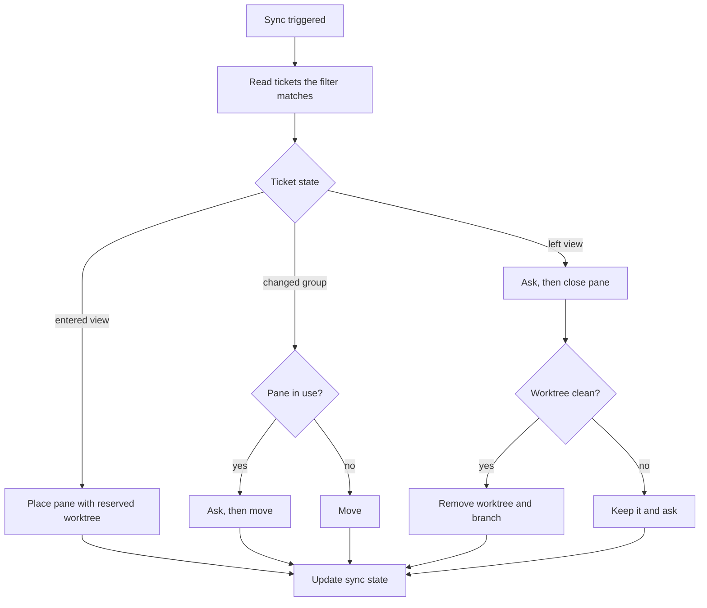
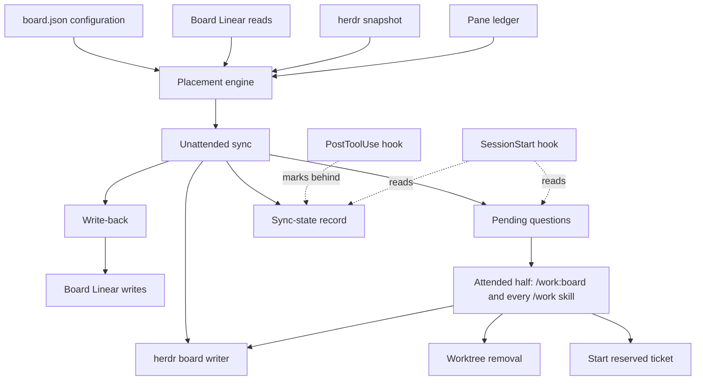
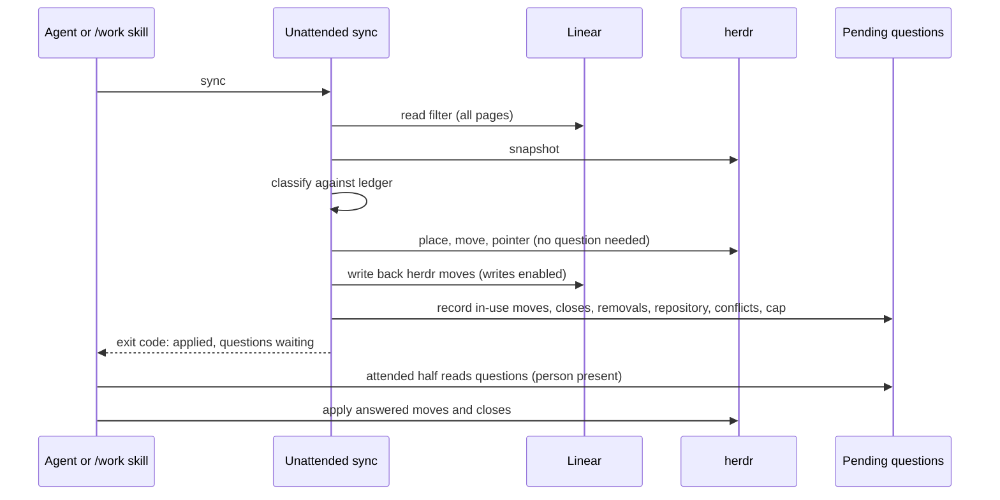
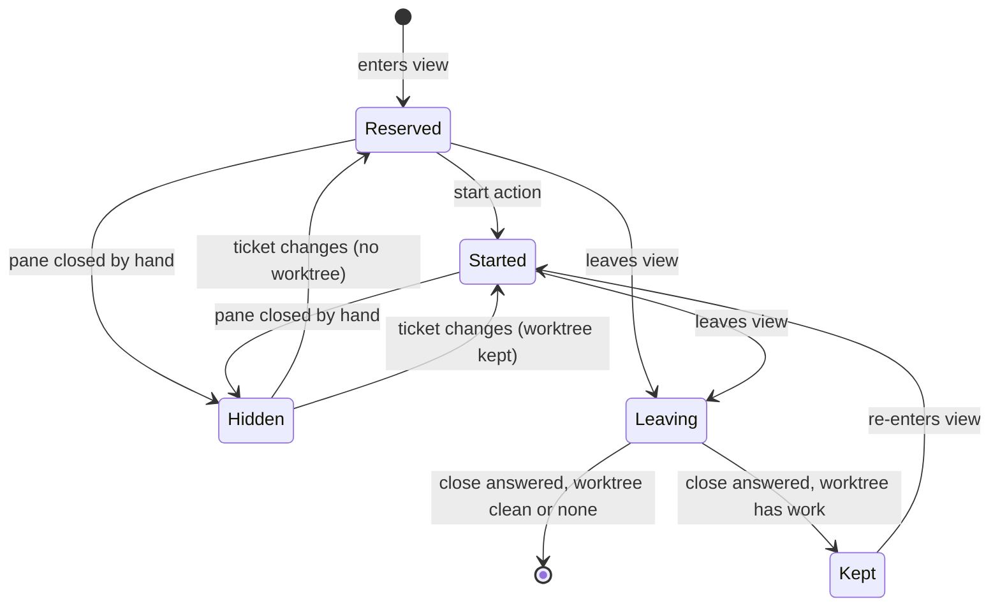
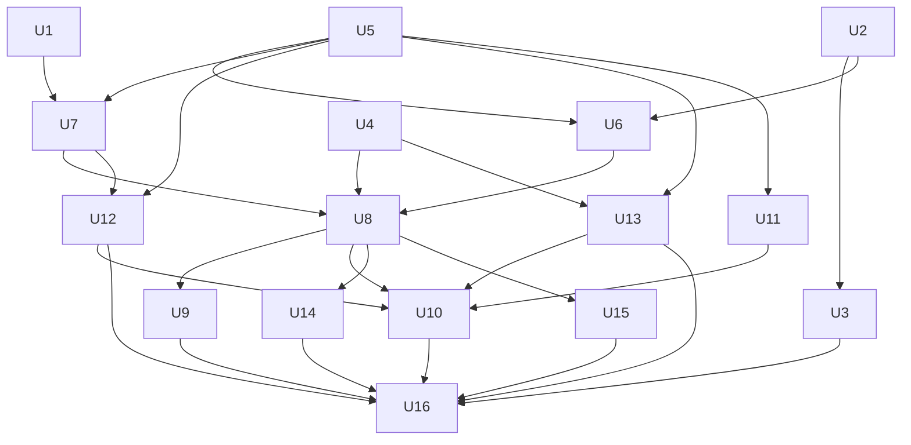

# Herdr Linear Board - Plan

## Goal Capsule

- **Objective:** A person sees their Linear work laid out in herdr, can tell at a glance whether herdr and Linear agree, and can set, pick and complete work from herdr without opening Linear.
- **Means:** A board configuration of up to four herdr levels plus a ticket filter, a sync split into an unattended half and an attended half (KTD2), reserved worktrees for unstarted tickets, and write-back when a pane is moved (KTD8).
- **Product authority:** This plan owns Part B of the work plugin configuration. It supersedes Part B (R10-R21, U6-U9) of `docs/plans/2026-09-13-1146-feat-work-plugin-config-plan.md`; Part A shipped separately as draft PR #83 and is not active scope here.
- **Authority hierarchy:** Requirements own product behaviour. Key Technical Decisions own mechanism inside those requirements. Units override neither.
- **Stop conditions:** Stop and report if U1 shows that herdr cannot place or move a pane without killing its process, that a sync cannot read a complete filter result within Linear's rate limits, or that column and row membership cannot be read from herdr's layout without ambiguity. Each invalidates a decision (KTD5, KTD9, or two-way column and row levels) rather than a single unit.
- **Execution profile:** One plugin, `plugins/work/`, on branch `feature/work-plugin-board` cut from Part A's tip. A separate session changes shared plugin files for an independent read-only board view; coordination rules are in Implementation Constraints.
- **Finishes and ships:** Shawn reviews the pull request. The board is verified in a throwaway herdr session against real Linear, read only, before the pull request leaves draft.
- **Open blockers:** None.

---

## Product Contract

### Summary

herdr becomes a two-way board for Linear. A board configuration sets what a space, tab, split column and split row each group by, and a filter chooses which tickets appear. The sync has two halves: one an agent can run, which never asks and saves its questions, and one inside a `/work` command, which asks them. Placement keys on Linear's issue id, reserved tickets and pane history live in their own records, and existing records keep their version.

### Problem Frame

The work plugin fixes one layout: a space is a project, a tab is a piece of work, a pane is a session. A person who organises work by team, assignee, milestone or label has no way to see that arrangement in herdr, so they keep Linear open beside it to find, move and close work.

Placement is decided by a record the plugin stored when work began. When Linear moves on, the record disagrees with it, the worktree is marked misplaced, and automatic writes pause until someone intervenes by hand. Nothing notices a change in Linear on its own: the plugin's hooks run only when a Claude session starts and ends.

The plugin can write a ticket's description and state, and nothing else. Reassigning a ticket, moving it to another project or milestone, or relabelling it always means leaving herdr.

### Key Decisions

- **Linear is the authority for placement; herdr is a live mirror of it.** A stored binding still says which worktree is a ticket's, but no longer where its pane belongs, which replaces the parent plan's KTD13 for spaces and tabs on the board. (session-settled: user-directed — chosen over a layout built once with drift reported and over a layout rebuilt only on request: herdr should read like a Linear board.) Governs R16, R22.
- **Two-way: a move in herdr is a change in Linear, for every level field.** Parent and team are included. (session-settled: user-directed — chosen over treating layout moves as never meaningful, over asking at the next sync, and over keeping parent and team one-way: every level is two-way.) Governs R25, R28.
- **Two-way needs Linear writes enabled.** (session-settled: user-directed — chosen over putting a moved pane straight back with a note and over holding it as pending: in shadow mode the board stays one-way.) Governs R26.
- **Sync runs on commands and on grouping-changing agent activity, not continuously.** (session-settled: user-directed — chosen over a background watcher and over the session start and end hooks: predictable, with agents able to catch the board up as they work.) Governs R17, R35.
- **Under shadow mode a sync follows Linear as it is.** (session-settled: user-directed — chosen over applying the intended change and over shadowing the moves too: herdr never shows a state Linear lacks.) Governs R18.
- **The board holds every ticket the filter matches, started or not.** (session-settled: user-directed — chosen over only started work and over started work plus its parents: like a Linear board.) Governs R9.
- **The filter lives in the board configuration.** (session-settled: user-directed — chosen over a saved Linear view and over letting the top level's value act as the filter.) Governs R4.
- **Triage and backlog are hidden by default.** A mapping's filter may include them. (session-settled: user-directed — the person's own proposal, confirmed over never showing them whatever the filter says: the default board holds active work, and a triage space stays possible.) Governs R32.
- **A level is typed by Linear's schema.** A level is one single-valued field or one named label group, never labels in general. (session-settled: user-directed — the person's own rule, replacing the offered label group, first-label-in-order and every-label options: placement is single by construction.) Governs R2.
- **Unstarted tickets get reserved worktrees, named by ticket identifier.** (session-settled: user-directed — the person's own proposal, revising their first pick of creating every worktree up front; also chosen over a ticket card started on demand and an idle shell in the repository: no disk cost until work starts.) Governs R11.
- **Work starts through a plugin action.** (session-settled: user-directed — chosen over creating the worktree on any agent launch and over an in-pane prompt: a shell cannot start inside a directory that does not exist yet.) Governs R14, R15.
- **A new scope's repository is asked once and remembered.** (session-settled: user-directed — chosen over stopping the sync to ask and over stating the repository in the configuration.) Governs R12.
- **Ask before moving a pane in use, and "in use" is wide.** The pane running the command, the focused pane, and any pane with a live agent all count. (session-settled: user-directed — chosen over deferring that pane, over moving it anyway, over only the invoking pane, and over any pane with a started worktree: an agent-triggered sync never moves the pane a person is typing in.) Governs R19.
- **A ticket leaving the view is closed, after asking.** (session-settled: user-directed — the person corrected their first pick of parking panes in a done tab; also chosen over keeping the pane until its session ends.) Governs R20.
- **Clean worktrees are removed with their pane.** (session-settled: user-directed — chosen over always keeping them and over asking every time.) Governs R21.
- **A pane closed by hand hides its ticket.** (session-settled: user-directed — chosen over recreating the pane every sync and over asking once: the worktree is kept, never removed.) Governs R33.
- **Nothing on the board is misplaced any more.** (session-settled: user-directed — chosen over reporting drift while writing and over pausing automatic writes as today: the layout is only behind, and the next sync repairs it.) Governs R22.
- **The global mapping is the default, and a space's own mapping fully replaces it.** An override may set its own space level and filter. (session-settled: user-directed — chosen over a single global mapping, over overrides that only rearrange levels inside a space, and over overrides that keep the global filter.) Governs R5.
- **A ticket claimed by more than one mapping has one home and pointer panes elsewhere.** (session-settled: user-directed — chosen over a single home with the double claim only reported, and over overrides that cannot claim a ticket twice: one worktree and one session per ticket, visible from every space that claims it.) Governs R31.
- **A ticket filed from herdr starts unstarted.** (session-settled: user-directed — chosen over filing with the team default and letting the ticket leave the board, and over asking each time: a ticket filed from herdr stays where it was put.) Governs R34.
- **A mapping change on a space in use shows what changes, then asks.** (session-settled: user-directed — chosen over writing and then reporting, and over refusing on a space in use.) Governs R23.
- **One plan, delivered together.** (session-settled: user-directed — chosen over a staged delivery with the one-way mirror first and over a narrow write-back-first board: no half-built board in between.)

### Requirements

**The board configuration**

- R1. A mapping names up to four levels — space, tab, split column and split row — and may use fewer.
- R2. Each level is set to one Linear field that holds a single value per ticket, to one named label group, or to the ticket or sub-ticket itself; a level set to labels in general is refused, naming what is allowed.
- R3. The levels of one mapping are pairwise distinct.
- R4. A mapping states the filter that selects which tickets are on the board.
- R5. The global mapping is the default; a herdr space that carries its own mapping uses it in place of the global one, including its own space level and filter.
- R6. The configuration file holds only mappings, their filters, and its version.
- R7. A configuration file that cannot be read or understood, or whose owner or mode is wrong, is refused, naming the file and the fault, and the plugin does not continue on defaults.
- R8. With no mapping configured, the plugin behaves as it does today and existing bindings are read without migration.
- R32. Tickets in triage or backlog are left off the board unless a mapping's filter includes them.

**The board**

- R9. Every ticket the filter matches has a pane, placed by that ticket's value at each level.
- R10. A ticket with no value at a level is placed in a "No <level>" group, as Linear's board does.
- R11. A pane for a ticket nobody has started holds a reserved worktree: its name and branch are fixed by the ticket identifier, and nothing is created on disk.
- R12. A ticket whose project or team has no recorded repository, or several, still gets its pane, marked repository-unknown; the plugin asks once for that project or team, records the answer, and does not ask again for later tickets there.
- R13. The board never moves or closes a pane it did not create.
- R31. A ticket that more than one mapping claims has one home pane, in the space the global mapping picks, and a pointer pane in every other claiming space that leads to the home pane.
- R33. A board pane closed by hand, or moved into a tab or space the board did not render, hides its ticket until the ticket changes or is reopened through the plugin; the pane is left where it is and its worktree is kept.

**Starting work**

- R14. Work on a reserved ticket starts through a plugin start action, which creates the worktree, gives the ticket a shell inside it, and starts the agent there.
- R15. An agent session started by hand in a reserved pane is told to start work through the plugin.

**Sync from Linear**

- R16. A sync brings herdr in line with Linear: it places tickets that entered the view, moves panes whose ticket changed group, and handles tickets that left the view.
- R17. A sync runs when a `/work` command runs, and when an agent's Linear read or write changes a ticket's grouping.
- R35. A sync an agent starts never asks: it applies every change that needs no answer and leaves each question for the next `/work` command, which asks it.
- R18. A sync reads Linear as it is, so a write held back by shadow mode moves nothing.
- R19. A sync asks before moving a pane in use — the pane running the command, the focused pane, or any pane with a live agent; every other move proceeds without asking.
- R20. When a ticket leaves the view, its pane is closed after asking.
- R21. When a pane closes, its worktree and branch are removed if they hold no uncommitted or unpushed work; otherwise they are kept and the person is asked.
- R22. No board pane or worktree is ever judged misplaced: between syncs a pane in the wrong place is out of date, and automatic writes continue.
- R23. A mapping change that would move or close panes lists what would change and applies only after a yes.
- R24. From herdr, a person can see whether herdr matches Linear, and what is behind when it does not.

**Working from herdr**

- R25. Moving a pane into another group changes that ticket's field in Linear to the group's value, and the next sync confirms it.
- R26. Write-back happens only with Linear writes enabled; with shadow mode on, the board is one-way and a move made in herdr is undone by the next sync.
- R27. Every write-back passes the plugin's consent rule, including for a ticket that has no worktree yet.
- R28. Setting, picking and completing work are each possible from herdr: filing a ticket into a group, starting a reserved ticket, and completing a ticket.
- R34. A ticket filed into a group from herdr starts in its team's first unstarted state.

**Changing the configuration**

- R29. A verb sets a mapping or filter, validating before it writes and refusing rather than coercing, and a refused write leaves the file on disk unchanged.
- R30. The configuration write verb cannot be called from a hook.

### Key Flows

- F1. Sync
  - **Trigger:** A `/work` command runs, or an agent's Linear activity changes a ticket's grouping.
  - **Steps:** Read the tickets the filter matches; place tickets that entered the view with reserved worktrees; move panes whose ticket changed group, asking first for a pane in use; ask before closing panes whose ticket left the view, removing clean worktrees; update the visible sync state. When an agent started the sync, each question waits for the next `/work` command.
  - **Covered by:** R9-R12, R16-R21, R24, R35
- F2. Start work
  - **Trigger:** A person or agent starts a reserved ticket through the plugin.
  - **Steps:** Ask for the repository if its scope has none recorded; create the worktree under the reserved name; give the ticket a shell inside it; start the agent.
  - **Covered by:** R11, R12, R14
- F3. Write back
  - **Trigger:** A person moves a pane into another group in herdr.
  - **Steps:** With writes enabled and consent given, change the ticket's field in Linear; the next sync confirms the placement. With shadow mode on, write nothing; the next sync moves the pane back.
  - **Covered by:** R25-R27

### Acceptance Examples

- AE1. **Covers R2.** **Given** a mapping whose tab level is set to labels in general, **when** it is saved, **then** it is refused and the refusal names single-valued fields, label groups, ticket and sub-ticket as the allowed kinds.
- AE2. **Covers R9, R10.** **Given** a tab level of assignee and an unassigned ticket the filter matches, **when** a sync runs, **then** the ticket's pane sits in a "No assignee" tab.
- AE3. **Covers R11, R14.** **Given** a ticket nobody has started, **when** it enters the view, **then** its pane exists and no worktree exists on disk; **when** work starts on it through the plugin, **then** the worktree is created under the reserved name and the agent runs inside it.
- AE4. **Covers R12.** **Given** two tickets in a project with no recorded repository, **when** both enter the view, **then** both panes appear marked repository-unknown and the person is asked once; after the answer, neither ticket prompts again.
- AE5. **Covers R17, R19.** **Given** writes enabled and an agent that reassigns the ticket it is working on, **when** the resulting sync runs, **then** every other affected pane moves and the agent's own pane does not move until a person answers.
- AE6. **Covers R18, R26.** **Given** shadow mode on, **when** a person moves a pane into another assignee's column, **then** nothing is written to Linear and the next sync returns the pane to its column.
- AE7. **Covers R20, R21.** **Given** a ticket completed in Linear, **when** a sync runs, **then** the person is asked before its pane closes; a clean worktree is then removed with its branch, and a worktree holding unpushed work is kept and the person is asked.
- AE8. **Covers R22.** **Given** a board ticket moved to another project in Linear and no sync yet, **when** the plugin next considers an automatic write for that ticket, **then** the write is not paused and no misplaced state is recorded.
- AE9. **Covers R8.** **Given** no mapping configured, **when** work starts, **then** the plugin places it exactly as it does today and existing bindings are read unchanged.
- AE10. **Covers R7.** **Given** a configuration file writable by another user, **when** any command reads it, **then** the command refuses and names the file and the fault.
- AE11. **Covers R31.** **Given** a global mapping grouping spaces by team and a second space whose own mapping claims every ticket assigned to the person, **when** a sync runs, **then** a ticket matched by both has its home pane in its team's space and a pointer pane in the second space, and both lead to the same worktree.
- AE12. **Covers R32.** **Given** a filter that names no states, **when** a sync runs, **then** tickets in triage and backlog have no panes; **given** a filter that includes backlog, **then** backlog tickets appear.
- AE13. **Covers R33.** **Given** a person closes a board pane by hand, **when** the next sync runs with the ticket unchanged, **then** no pane is recreated and the worktree is still on disk.
- AE14. **Covers R35.** **Given** an agent runs a sync in which one ticket left the view, **when** the sync finishes, **then** the leaving pane is still open, the sync reports one question waiting, and the next `/work` command asks it.
- AE15. **Covers R34.** **Given** a team whose default state is triage, **when** a person files a ticket into a board column from herdr, **then** the ticket is created in the team's first unstarted state and its pane appears in that column.

### Scope Boundaries

- A background process that watches Linear continuously.
- Levels that can hold several values for one ticket, such as labels in general.
- Write-back while shadow mode is on.
- Moving or closing panes the board did not create.
- The destination of published documents, which stays Linear.
- A staged delivery; the board ships as one piece of work.
- The read-only Linear board view planned separately in `herdr-linear-board`, which shows a Linear view's issues without changing Linear or the layout. It is an independent feature: neither depends on the other, and only shared plugin files are coordinated.
- Changing how placement works when no mapping is configured (R8).

#### Deferred to Follow-Up Work

- Consuming herdr's socket events to notice pane moves as they happen, instead of comparing layouts at sync time (KTD4).
- Answering pending questions automatically from a standing rule.
- Routing an agent's direct Linear tool writes through the plugin's consent rule; this plan only marks the board behind after them (KTD15).

### Dependencies / Assumptions

- Linear allows at most one label from a label group on a ticket (Linear's label documentation). Whether the API also rejects a second label from the same group is unverified; U1 checks it.
- The plugin reads a ticket's parent, project, team, assignee, up to ten labels and state, and no milestone, cycle or label group (`plugins/work/lib/linear.sh`, `HERDR_LINEAR_ISSUE_FIELDS`).
- The plugin writes only a ticket's description (`plugins/work/lib/description.sh`) and state (`plugins/work/lib/reconcile.sh`); every other write-back field is new.
- herdr 0.9.0 is installed. `herdr pane move` keeps a pane's process across tab and space moves, and the old pane id remains an alias. herdr's socket offers `layout.apply`, `layout.export`, `events.wait` and a `pane.moved` event, none of them on the command line. The plugin never moves or closes a pane today.
- The layout builds columns only (`plugins/work/lib/herdr-write.sh`), so rows are new.
- A worktree's path is computed before `git worktree add` creates it (`plugins/work/lib/start.sh`), which is what makes a reservation free.
- A ticket's repository comes from the scope repository record keyed by project, then team (`plugins/work/lib/repos.sh`), and the plugin asks when none or several are recorded.
- The plugin's only hooks run at session start (`plugins/work/hooks/ground.sh`) and session end (`plugins/work/hooks/reconcile.sh`). Every skill is `disable-model-invocation: true`, which is the plugin's only proof that a person is present.
- Shadow mode is the default (`plugins/work/lib/reconcile.sh`): there is no global writes flag, only recorded consent.
- The consent rule and the write bound are keyed on a worktree directory (`plugins/work/lib/binding.sh` `consent_gate`, `plugins/work/lib/linear.sh` `write_allowed`), so a ticket with no worktree has no consent scope today.
- Linear allows 2,500 requests and 3,000,000 complexity points an hour per API key, and 10,000 points per query.

### Sources / Research

- `docs/plans/2026-09-13-1146-feat-work-plugin-config-plan.md` — the Part B this plan supersedes, and the Part A settings it builds on.
- `docs/plans/2026-09-11-0753-refactor-ticket-derived-worktree-location-plan.md` — KTD13, a binding as the only authority for a space or tab, which this plan narrows to boardless use.
- `docs/solutions/logic-errors/a-tally-keyed-on-exit-status-reports-work-that-never-happened.md` — count observed effects in the sync status (KTD16).
- `docs/solutions/logic-errors/default-allow-regex-projection-gate-silently-drops-nudges.md` — default-deny configuration validation (KTD6).
- `docs/solutions/logic-errors/exporting-an-empty-credential-is-worse-than-exporting-none.md` — never send an empty field value to Linear (KTD10).
- `docs/solutions/logic-errors/a-test-can-pass-because-it-cannot-fail.md` — assertion shapes for the new suites.
- `docs/solutions/best-practices/pgrep-pkill-by-shared-script-name-is-unsound-across-worktrees.md` — ownership by resolved path before removing a worktree (KTD12).
- `docs/solutions/architecture-patterns/command-and-skill-sharing-a-name.md` — the new skill must not share a name with a command.
- Linear API: [label groups](https://linear.app/docs/labels), [rate limiting](https://linear.app/developers/graphql), [deprecations](https://linear.app/developers/deprecations).
- herdr 0.9.0: `herdr pane move --help`, `herdr api schema --json` (`layout.apply`, `events.wait`, `pane.moved`).

---

## Planning Contract

**Product Contract preservation:** changed — R2 gains the ticket and sub-ticket levels from the person's own layout examples; R5 widened to full replacement; R11 fixes the reserved name and branch rather than the full path, because the project segment and repository resolve at start (KTD13); R14 says "gives the ticket a shell inside it" rather than "moves the pane's shell", because start opens a fresh shell (KTD13); R19 defines "in use"; R22 narrowed to board panes and worktrees so R8 holds; R31-R35 added for pointer panes, the triage and backlog default, hand-closed panes, filing unstarted, and an agent-started sync that never asks; R33 widened in document review, with the person's approval, to panes moved into a tab or space the board did not render; AE11-AE15 added; Deferred to Planning questions resolved by KTDs and removed. Every change was decided with the person in this session except the R2 ticket levels, R11, R14 and R22 wording, which resolve internal contradictions without changing intent.

### Key Technical Decisions

- KTD1. **Identity is Linear's issue id.** Reservations, the pane ledger, pending questions and journal keys use the issue id; the identifier is display only. A team move that renumbers a ticket keeps its pane and worktree, and existing worktree paths and branches never rename.
- KTD2. **The sync has an unattended half and an attended half, and hooks run neither.** The unattended half is a lib verb an agent may call from its own shell: it applies every change needing no answer, records each question as a pending question, and exits with a distinct code. The attended half runs only inside a person-typed skill, asks pending questions and applies answers. A hook may only mark the board behind, because `placement_caller_check` forbids pane creation from hooks and a paginated Linear read does not fit a hook's time budget. Instantiates R17, R35.
- KTD3. **"In use" is computed from herdr state at the moment of the move.** A pane is in use when it is `$HERDR_PANE_ID` of the process running the sync, the focused pane in the live snapshot, or a pane with any detected agent, whatever its status (idle, working, blocked, done or unknown). (session-settled: user-directed — chosen over only the invoking pane and over any pane with a started worktree: an agent-triggered sync never moves the pane a person is typing in.) Instantiates R19.
- KTD4. **A move made in herdr is detected by comparing the live layout with a pane ledger.** The ledger records, per board pane, its issue id, role (home or pointer), and group values at the last completed sync. Ledger and Linear agreeing while herdr differs is a herdr move; ledger and herdr agreeing while Linear differs is a Linear change; both differing is a conflict and becomes a pending question. herdr's socket events are deferred: comparison needs no socket client and works after a herdr restart. A ticket's ledger group values change only after its pane is observed in the new group: a move left as a pending question keeps the old values and marks a Linear change pending, which is never read as a herdr move. A column or row change in a tab that lost a pane since the last sync is a conflict question, never a write-back, because a collapsing split moves neighbouring panes.
- KTD5. **A tab's layout is built with `layout.apply` if U1 proves it places existing panes without killing them; otherwise with chained `pane move --split --target-pane` calls.** Either way the board computes the whole desired tree for a tab first, so the choice changes only the apply step in U7. Chosen over always chaining moves, which is proven but needs one call per pane, and over always applying layouts, which is unproven for live panes. The `layout.apply` branch adds a python3 Unix-socket client with an injectable socket path, tested against a fake socket server fixture that records requests and updates the fake snapshot.
- KTD6. **The board configuration is one file in the plugin store, validated default-deny.** It lives at `$HERDR_LINEAR_STORE_DIR/board.json`, holds the global mapping, per-space mappings each keyed by the space name the override declares, their filters and a version. A space the global mapping renders is named by its group value; an override may declare a space the global mapping does not render. Unknown keys, unknown level kinds, duplicate levels and malformed filters refuse the whole file, and an invalid override refuses too. Per-space mappings stay out of the workspace record, so its schema and `HERDR_LINEAR_RECORD_VERSION` never change. Chosen over storing overrides on the workspace record, which is keyed by herdr ids the board creates and closes and which the separate session also edits, and over default-allow validation, which past learnings show leaks one unenumerated case per review. Instantiates R1-R7, R32.
- KTD7. **Board state lives in its own record family.** Reservations, the pane ledger, pending questions, space consent and the sync-state record each get their own file under the store, their own record-version constant, and the existing lock and atomic-write discipline. `misplaced` stays a valid stored state in the binding record. Chosen over new keys on the binding record, which cannot hold a ticket with no worktree because the binding key hashes an existing directory, and over removing `misplaced` from the valid states, which would read every stored misplaced binding as unbound.
- KTD8. **Write-back consent is recorded per space name and field, and the board has its own write bound.** A write-back is allowed when the ticket appeared in the most recent complete filter read, the space's consent covers that field, and the target value is a group the board itself rendered. `write_allowed` is not widened; a board-scoped sibling states why a filter-matched re-parent is allowed and is tested for it. (session-settled: user-directed — chosen over keeping parent and team one-way: every level is two-way.) Instantiates R25-R27.
- KTD9. **Only a complete read changes membership, and a move is journalled before it is made.** A filter read that did not finish every page never produces a leaving ticket. An intended move is recorded before the herdr call and cleared once the ledger is updated, so an interrupted move is never read as a person's move. A herdr action whose effect cannot be read back counts as unknown.
- KTD10. **Board Linear calls live in a new lib file with their own selection set.** Queries and the field write helper live in `plugins/work/lib/board-linear.sh`, leaving `HERDR_LINEAR_ISSUE_FIELDS` untouched. Every write-back goes through one helper that never sends an empty string, swaps a label group with `addedLabelIds`/`removedLabelIds`, and reads `success`. Chosen over widening the shared field string, which changes every existing read and collides with the separate session, and over a full `labelIds` replace, which can drop labels under a concurrent edit.
- KTD11. **The unattended half caps how many panes one sync creates.** Tickets beyond the cap are recorded as one pending question to place the rest.
- KTD12. **A worktree is removed only when it is clean, delivered, and unused.** Removal requires no uncommitted changes, every commit on a remote or in a merged pull request, and no live process whose working directory is inside it; anything else keeps the worktree and asks. A squash merge that deleted the remote branch counts as delivered. The removal verb acts only on an answered pending question whose nonce and preconditions still hold (U5), is banned from hooks, and is called only from person-typed skills; nothing at runtime tells an agent's shell from a skill's, so the nonce is the guard. Chosen over a git-status check alone: a clean worktree can still hold a running agent, and a commit that exists only locally is lost on removal.
- KTD13. **A reservation fixes the worktree name and branch; start opens a fresh shell.** The project segment and repository resolve at start. A reserved pane shows the ticket without a shell in a worktree; starting creates the worktree, opens a new pane in it at the reserved pane's place, starts the agent, records the ticket as started, and only then closes the reserved pane. Nothing is typed into an existing pane. Chosen over freezing the full path, which puts a worktree under a stale project and repository after a project change, and over sending `cd` into the reserved pane, which can type into a running program.
- KTD14. **Placement judgement is skipped for board-managed worktrees and unchanged without a mapping.** `check_placement` returns ok for a worktree the board ledger owns; boardless worktrees keep today's misplaced behaviour. Instantiates R8, R22.
- KTD15. **Agent Linear tool writes only mark the board behind.** A `PostToolUse` hook matched on Linear write tools records that the board is behind and adds context telling the agent to run the unattended sync. It never places, moves or closes. Linear writes made outside the matched tools and the plugin's own verbs are not detected.
- KTD16. **The sync-state record is the source of truth; herdr shows a copy.** The record holds when the last complete sync ran, observed counts, unknown counts, and pending questions. herdr's `report-metadata` shows it on board panes, and the session-start hook summarises it. An early stage that fails reports the failure, never "0 changes". The status shows possibly behind when the last complete sync is older than the most recent recorded plugin Linear write.
- KTD17. **A pointer pane is board-created, holds no worktree or session, and focuses the home pane.** It is never a write-back source and closes when its claim ends. The ledger marks it with the pointer role, and it targets its home pane by issue id, so a start that replaces the home pane or a herdr restart does not break it. Among overrides that claim a ticket the global mapping does not, the first space in the configuration file's order is the home. Instantiates R31.
- KTD18. **Filing into a group sets the group's fields and the team's first unstarted state in one create call.** Instantiates R34.
- KTD19. **The attended half is a new `/work:board` skill, and every other `/work` skill runs it first.** The skill owns configuration writes, pending questions, and an explicit sync; other skills call the attended sync before their own work.

### High-Level Technical Design

Components and their direction of dependency:

One sync, from trigger to answered questions:

Classifying one ticket at sync time:

| Linear vs ledger | herdr vs ledger | Complete read | Outcome |
|---|---|---|---|
| ticket newly matches | no pane | yes | place pane with reservation (cap applies) |
| no longer matches | pane present | yes | question: close pane |
| no longer matches | pane present | no | nothing; status reports an incomplete read |
| group changed | unchanged | any | move pane (question if in use) |
| unchanged | group changed | any | write-back, or restore in shadow mode |
| changed | changed, same value | any | agreement; update ledger |
| changed | changed, different values | any | question: conflict |
| any | home pane missing by id, alias and board label | any | hide ticket (R33) |
| any | every ledger pane in a space missing | any | treat the space as rebuilt: re-place, hide and close nothing |
| any | pointer pane missing | any | recreate the pointer; the ticket stays visible |
| any | board pane moved into a tab or space the board did not render | any | hide ticket, leave the pane in place, write nothing (R33) |

A board ticket's lifecycle:

### Implementation Constraints

- Never bump `HERDR_LINEAR_RECORD_VERSION`; `plugins/work/lib/binding.sh` reads a newer record as absent, which unbinds every space.
- Coordinate with the separate read-only board session: it adds `plugins/work/lib/views.sh`, `plugins/work/bin/work-snapshot.sh`, `view` and `created_views` binding keys, view queries in `plugins/work/lib/linear.sh`, arms in `plugins/work/tests/fixtures/fake-linear.sh`, and raises `HERDR_LINEAR_MIN_SUITES`. Whichever pull request lands second rebases, re-bumps the suite floor and the plugin version. This plan keeps its Linear code in `plugins/work/lib/board-linear.sh` and adds no binding-record keys.
- No publish of the plugin before the other session's pull request merges.
- Never modify `docs/handoff.md`. No Linear writes during development or verification; shadow mode stays on.
- The full suite runs alone, never beside other heavy work.
- Every new hook sources its libs in its own loop; `skill_lib_sync_check` does not see `plugins/work/hooks/`.
- Every new consent check — a `consent_gate` call or a board consent gate call — needs a named red test in `consent_mutation_check`.
- A new skill must not share a name with a command.

### Assumptions

- A sync is interactive-fast only for filters of a few hundred tickets; the pane cap (KTD11) bounds creation, not reads.
- herdr pane ids are not relied on across a herdr restart: the ledger resolves a missing pane by its old id as an alias, then by the label the board writes with `pane rename`, before treating it as closed.

### System-Wide Impact

- **Every `/work` skill gains a sync step.** All nine skills run the attended half before their own work (KTD19). A slow or failing Linear read now precedes every command, so the attended fence must report and continue, never block the command's own job.
- **Agent parity.** Agents can run the unattended sync, read the sync state and board configuration, start a reserved ticket, write back one field, file into a group and complete a ticket, each behind consent. Only a person can move a pane in use, close a pane, remove a worktree, answer the repository question, or write the configuration. Those verbs join `HOOK_BANNED` and are called only from person-typed skills, and the destructive ones act only on an answered pending question's nonce; the plugin cannot stop an agent that calls a lib verb directly, so the nonce is the guard.
- **Untrusted text.** Ticket titles reach pane labels, `report-metadata` tokens, pending-question text and session context. Every path uses `sanitize_stream` and the session-start hook's existing untrusted-value wrapper.
- **Persistent data.** Worktree and branch removal is the only destructive action the board takes, gated by KTD12 and a person's answer. New store files carry their own version constant; the binding record is untouched.
- **Shared plugin files.** The separate read-only board session edits `plugins/work/lib/binding.sh`, `plugins/work/lib/linear.sh`, `plugins/work/tests/fixtures/fake-linear.sh`, `plugins/work/tests/run-tests.sh` and `CONCEPTS.md`. This plan keeps its code in new files and limits shared-file edits to fixture arms, harness lists and glossary entries.

### Risks & Dependencies

| Risk | Mitigation |
|---|---|
| A partial Linear read closes tickets that never left | Only a complete read changes membership (KTD9); an incomplete read reports itself in sync state |
| An interrupted move is written back as a person's move | Moves are journalled before the herdr call and cleared after the ledger update (KTD9) |
| A worktree with work in it is deleted | Removal needs clean, delivered and unused, plus a person's yes (KTD12, U11) |
| A pane a person is using moves or closes | "In use" covers the invoking pane, the focused pane and any pane with an agent (KTD3); closes always ask (R20) |
| Linear rate limits under frequent agent-triggered syncs | Narrow filters, explicit page sizes and the pane cap (KTD11), with U1 measuring a real read against the hourly limit; the triage and backlog default shrinks reads (R32) |
| `layout.apply` does not keep live panes | U1 decides; KTD5 falls back to chained `pane move` calls, which keep processes |
| herdr ids change after a restart | The ledger resolves a missing pane by alias, then by its board label; a space whose panes all vanish is re-placed, never hidden |
| A drag re-parents or moves a ticket's team by accident | Write-back only for filter-matched tickets into board-rendered groups (KTD8); team moves keep identity by issue id (KTD1) |
| Agent writes through Linear tools skip consent | Recorded as deferred follow-up; this plan only marks the board behind (KTD15) |
| Merge conflicts with the read-only board session | New files for board code; the second pull request rebases and re-bumps the suite floor and version |

### Open Questions

**Deferred to Implementation**

- Whether `layout.apply` keeps an existing pane's process and what it does to unnamed panes (U1, KTD5).
- Whether herdr workspace, tab and pane ids survive a server restart (U1).
- Whether Linear's API refuses a second label from one group, a cross-project milestone, or silently renumbers an identifier on a team move (U1); until known, the write helper applies the defensive rule U1 records.
### Sequencing

U1 runs first because KTD5 and parts of U7 depend on its answers. Then:

Parallelism:

| Wave | Units | Runs in parallel? | Shared-file hazard |
|---|---|---|---|
| 0 | U1 | alone | none |
| 1 | U2, U4, U5 | yes | U2 and U5 both add store paths; `identifier_path_check` sees both — land one before the other rebases |
| 2 | U3, U6, U7, U11 | yes | U3, U7 and U11 all edit `tests/run-tests.sh` `HOOK_BANNED`; serialise those edits |
| 3 | U8 | alone | none |
| 4 | U9, U10, U12, U13, U14, U15 | U9, U13, U14, U15 in parallel; U10 after U12 and U13 | U10, U12 and U13 all edit `plugins/work/skills/start/SKILL.md` or `plugins/work/skills/new/SKILL.md`; U9 and U14 edit `tests/run-tests.sh` |
| 5 | U16 | alone | owns the suite floor, plugin version and final harness edits |

---

## Implementation Units

| U-ID | Title | Key files | Depends on |
|---|---|---|---|
| U1 | Spike herdr and Linear facts | `plugins/work/docs/board-spikes.md` | — |
| U2 | Board configuration: load and validate | `plugins/work/lib/board-config.sh` | — |
| U3 | Board configuration: write and `/work:board` skill | `plugins/work/lib/board-config.sh`, `plugins/work/skills/board/SKILL.md` | U2 |
| U4 | Board Linear reads and writes | `plugins/work/lib/board-linear.sh` | — |
| U5 | Board records | `plugins/work/lib/board-store.sh` | — |
| U6 | Placement engine and classifier | `plugins/work/lib/board-plan.sh` | U2, U5 |
| U7 | herdr board writer | `plugins/work/lib/board-herdr.sh`, `plugins/work/tests/fixtures/fake-herdr.sh` | U1, U5 |
| U8 | Unattended sync | `plugins/work/lib/board-sync.sh` | U4, U6, U7 |
| U9 | Write-back from herdr moves | `plugins/work/lib/board-sync.sh` | U8 |
| U10 | Attended half in every `/work` skill | `plugins/work/skills/*/SKILL.md` | U8, U11, U12, U13 |
| U11 | Worktree removal | `plugins/work/lib/worktree-remove.sh` | U5 |
| U12 | Start a reserved ticket | `plugins/work/lib/start.sh`, `plugins/work/lib/board-herdr.sh` | U5, U7 |
| U13 | File and complete from herdr | `plugins/work/lib/create.sh`, `plugins/work/lib/board-linear.sh` | U4, U5 |
| U14 | Hooks: session notices and board-behind | `plugins/work/hooks/ground.sh`, `plugins/work/hooks/board-behind.sh` | U8 |
| U15 | Placement judgement off the board | `plugins/work/lib/states.sh` | U8 |
| U16 | Harness, docs and version | `plugins/work/tests/run-tests.sh`, `CONCEPTS.md` | U3, U9, U10, U12-U15 |

### U1. Spike herdr and Linear facts

- **Goal:** Settle the external behaviour the design depends on before code relies on it.
- **Requirements:** R14, R19, R25, R31; KTD4, KTD5, KTD8, KTD13
- **Dependencies:** none
- **Files:** `plugins/work/docs/board-spikes.md` (new)
- **Approach:**
  1. In a throwaway herdr session (`herdr --session`), check whether `layout.apply` with an existing `pane_id` keeps that pane's process and `HERDR_PANE_ID`, and what it does to panes the tree does not name.
  2. Check that `pane move` across tabs and spaces keeps a running agent's process and working directory.
  3. Check whether workspace, tab and pane ids survive `herdr server stop` and restart.
  4. Check how the focused pane and each agent status (idle, working, blocked, done) appear in `herdr api snapshot`.
  5. Build a two-column, two-row tab and read column and row membership from `herdr pane layout` and the snapshot after a drag, after a resize, and after closing one pane so a split collapses; record whether membership is read without ambiguity.
  6. Run one read-only paginated read of a real filter and record pages, requests, complexity points and duration; extrapolate to one sync per `/work` command and per Linear write across a working day, and set KTD11's pane cap from it.
  7. Against real Linear, read only: introspect `IssueUpdateInput` and `IssueFilter`, confirm `projectMilestoneId`, `cycleId`, `addedLabelIds` and `removedLabelIds`, and read the current deprecations page.
  8. Record what cannot be checked without a write (a second label from one group, a cross-project milestone, a team move renumbering an identifier) as open, with the defensive rule the code applies instead.
- **Execution note:** Read-only against Linear. herdr checks run only in a session created for the spike and closed afterwards.
- **Test expectation:** none -- this unit produces findings, not behaviour.
- **Verification:** The spikes document records a yes-or-no answer with evidence for each Goal Capsule stop condition, KTD5's branch is chosen, and KTD11's cap has a measured value.

### U2. Board configuration: load and validate

- **Goal:** The board configuration is read once, validated whole, and refused loudly when wrong.
- **Requirements:** R1-R7, R32; KTD6
- **Dependencies:** none
- **Files:** `plugins/work/lib/board-config.sh` (new), `plugins/work/tests/unit/board-config.bats` (new), `plugins/work/docs/settings.md`
- **Approach:**
  1. Read `$HERDR_LINEAR_STORE_DIR/board.json`; absent means no mapping (R8).
  2. Refuse a file that fails `_mode_ok` with a named refusal, not the silent absent path other records use.
  3. Validate in one python3 pass: allowed top-level keys, a version not above the code's, level kinds from a closed enum (single-valued fields, `label-group:<name>`, `ticket`, `sub-ticket`), pairwise-distinct levels, a filter built only from known keys.
  4. Apply the triage and backlog default when a filter names no states (R32).
  5. Expose a resolver that returns the mapping for a space name, falling back to the global mapping (R5), and a read verb an agent can call to learn whether a field is a board level.
- **Patterns to follow:** `plugins/work/lib/schemes.sh` refusal wording and printable-value guard; `plugins/work/lib/binding.sh` `_py` and `_mode_ok`.
- **Test scenarios:**
  - Covers AE10. A file writable by group is refused, naming the file and the mode fault.
  - Covers AE1. A level of labels in general is refused, naming the allowed kinds.
  - A malformed JSON file is refused with the parse fault; nothing falls back to defaults.
  - An absent file yields no mapping and no warning.
  - An unknown top-level key is refused.
  - Two levels with the same kind are refused.
  - A version above the code's is refused.
  - An invalid per-space mapping refuses the whole file, not only that space.
  - Covers AE12. A filter with no states excludes triage and backlog; a filter naming backlog includes it.
  - A space name with its own mapping resolves to it; an unknown name resolves to the global mapping.
  - An empty string filter value is refused, not treated as absent.
- **Verification:** `settings-doc.bats` passes with any new setting documented, and every refusal path names the file.

### U3. Board configuration: write and `/work:board` skill

- **Goal:** A mapping or filter can be changed by asking, and a bad change never reaches disk.
- **Requirements:** R23, R29, R30; KTD6, KTD19
- **Dependencies:** U2
- **Files:** `plugins/work/lib/board-config.sh`, `plugins/work/skills/board/SKILL.md` (new), `plugins/work/commands/work.md`, `plugins/work/tests/unit/board-config.bats`, `plugins/work/tests/run-tests.sh`, `plugins/work/tests/unit/wire.bats`
- **Approach:**
  1. Add a set verb that builds the resulting document, validates it with U2's validator, and writes atomically under the store lock, always at mode 0600 owned by the running user.
  2. Add a preview verb that lists the panes a changed mapping would move or close, using U6 once available; until then it lists affected spaces (R23).
  3. Add `skills/board/SKILL.md` with `disable-model-invocation: true` and the byte-identical Act or ask rubric; the skill previews, asks, then sets.
  4. Add the set verb to `HOOK_BANNED` in `placement_caller_check`, with a red test in `wire.bats`.
- **Patterns to follow:** `plugins/work/skills/layout/SKILL.md` exit-code table; `wire.bats` hook-ban tests.
- **Test scenarios:**
  - A set that would fail validation is refused and the file on disk is byte-unchanged.
  - A set on an absent file creates it with only that mapping and the version.
  - Two sets in sequence keep the first value.
  - A file written by the set verb passes U2's owner and mode check.
  - A hook script calling the set verb turns `placement_caller_check` red.
  - `rubric_sync_check` and `skill_lib_sync_check` pass with the new skill.
- **Verification:** The set verb is absent from `consent_mutation_check`'s derived list, and the skill name does not match any command.

### U4. Board Linear reads and writes

- **Goal:** The board can read every ticket a filter matches and write one field back safely.
- **Requirements:** R9, R16, R18, R25, R32, R34; KTD9, KTD10
- **Dependencies:** none
- **Files:** `plugins/work/lib/board-linear.sh` (new), `plugins/work/tests/unit/board-linear.bats` (new), `plugins/work/tests/fixtures/fake-linear.sh`
- **Approach:**
  1. Build an `issues(first:, after:, filter:)` query from the resolved filter, with a board selection set: id, identifier, title, state type, team, project, project milestone, cycle, assignee, priority, parent, and labels with their group parent.
  2. Page until done, returning the tickets plus a flag that says whether every page was read (KTD9).
  3. Add one field write helper for `stateId`, `assigneeId`, `projectId`, `projectMilestoneId`, `cycleId`, `priority`, `parentId`, `teamId`, and the label-group swap; send an explicit null for a "No <level>" target on a nullable field and remove only the current label for a label-group level; refuse an empty string; read `success`.
  4. Add a first-unstarted-state lookup per team.
  5. Add a fake-linear arm for paginated issue lists, placed so it does not shadow `teams(` or the other session's view arms.
- **Patterns to follow:** `plugins/work/lib/propose.sh` `_candidate_query`; `plugins/work/lib/reconcile.sh` `write_state`; `plugins/work/lib/linear.sh` `query` error mapping.
- **Test scenarios:**
  - A three-page result returns every ticket and the complete flag set.
  - A rate limit on page two returns the first page with the complete flag unset.
  - The request body carries an explicit `first` and the filter keys from the configuration.
  - A label-group write sends `addedLabelIds` and `removedLabelIds` and never `labelIds`.
  - An empty target value is refused before any request is sent.
  - A response with `success: false` is reported as a failed write.
  - The first-unstarted-state lookup picks the lowest-position unstarted state.
- **Verification:** `fake-linear.bats` and `linear.bats` still pass, and the existing field string is unchanged.

### U5. Board records

- **Goal:** Reservations, pane history, questions, consent and sync state have durable, versioned homes.
- **Requirements:** R11, R12, R24, R27, R33, R35; KTD1, KTD7, KTD8, KTD16
- **Dependencies:** none
- **Files:** `plugins/work/lib/board-store.sh` (new), `plugins/work/tests/unit/board-store.bats` (new)
- **Approach:**
  1. Add record families under the store: reservation per issue id (identifier, frozen worktree name and branch, repository-unknown flag), pane ledger per space (pane id, issue id, role, group values, board-created, hidden), pending questions (kind, preconditions, nonce, declined), space consent per space name and field, and the sync-state record.
  2. Give the family its own record-version constant and reuse the store lock, atomic write and mode rules.
  3. Validate every id with `is_safe_identifier` before it becomes a path segment.
  4. Make answering a question check its nonce and preconditions, and keep a decline until the preconditions change.
  5. Add a board consent gate: it allows a write only when the space's consent record covers the field and the ticket is in the last complete filter read, moving into a group the board rendered (KTD8), and it writes a shadow log line when it refuses.
- **Patterns to follow:** `plugins/work/lib/repos.sh` (a second record family over the same store); `plugins/work/lib/binding.sh` pending slots.
- **Test scenarios:**
  - A reservation survives a title change: the stored name does not change.
  - Answering a question with a stale nonce is refused and the question stays.
  - Answering a question whose preconditions no longer hold is refused.
  - A declined question is not returned again until its preconditions change.
  - A record with a future version reads as absent and is not overwritten.
  - An unsafe issue id is refused before any file is opened.
  - The binding record version constant is unchanged.
  - The board consent gate refuses a field its space has not consented to and writes one shadow log line.
- **Verification:** `identifier_path_check` passes with the new path builders.

### U6. Placement engine and classifier

- **Goal:** Given the configuration, tickets, the snapshot and the ledger, the board knows the layout it wants and what changed.
- **Requirements:** R1-R3, R5, R9, R10, R13, R16, R31, R32, R33; KTD1, KTD4, KTD9, KTD17
- **Dependencies:** U2, U5
- **Files:** `plugins/work/lib/board-plan.sh` (new), `plugins/work/tests/unit/board-plan.bats` (new), `plugins/work/tests/fixtures/board/` (new snapshot and ticket fixtures)
- **Approach:**
  1. Resolve each ticket's home space by the global mapping and its pointer spaces by overrides (KTD17).
  2. Group within a space by the mapping's levels, adding "No <level>" groups and nesting sub-tickets as rows under their parent ticket's column.
  3. Produce a desired tree per tab (splits and pane leaves) and a stable group ordering.
  4. Classify each ticket per the table in High-Level Technical Design, ignoring panes the ledger does not mark board-created (R13).
  5. Keep the engine pure: inputs are files or stdin, output is JSON; no herdr or Linear calls.
- **Execution note:** Implement test-first against fixture snapshots; this is the decision core.
- **Test scenarios:**
  - Covers AE2. An unassigned ticket under an assignee tab level lands in "No assignee".
  - Covers AE11. A ticket claimed by the global mapping and one override gets a home pane in the global space and a pointer pane in the override space.
  - A ticket claimed only by two overrides takes its home in the first space in configuration order.
  - Ledger and Linear agree, herdr differs: classified as a herdr move.
  - Ledger and herdr agree, Linear differs: classified as a Linear change.
  - Both differ to the same value: classified as agreement.
  - Both differ to different values: classified as a conflict.
  - An incomplete read never classifies a ticket as leaving.
  - Covers AE13. A home pane missing from the snapshot by id, alias and board label hides its ticket.
  - Every ledger pane in a space missing from the snapshot re-places the space and hides no ticket.
  - A missing pointer pane is recreated and its ticket stays visible.
  - A column change in a tab that lost a pane since the last sync is classified as a conflict, not a herdr move.
  - A board pane moved into a tab the board did not render hides its ticket, is not moved back, and produces no write-back.
  - A pane not marked board-created is never in a move or close.
  - A sub-ticket level nests a child as a row under its parent's column, and a parent outside the view still gets a column.
- **Verification:** The same inputs always produce the same tree and classification.

### U7. herdr board writer

- **Goal:** The board can create, move, close and label its own panes, and nothing else.
- **Requirements:** R9, R13, R19, R24, R31; KTD3, KTD5, KTD16, KTD17
- **Dependencies:** U1, U5
- **Files:** `plugins/work/lib/board-herdr.sh` (new), `plugins/work/tests/unit/board-herdr.bats` (new), `plugins/work/tests/fixtures/fake-herdr.sh`, `plugins/work/tests/run-tests.sh`, `plugins/work/tests/fixtures/fake-herdr-socket.py` (new, only if KTD5 selects `layout.apply`)
- **Approach:**
  1. Apply a desired tab tree with the KTD5 branch U1 selected.
  2. Create reserved panes without a worktree shell and pointer panes that focus their home pane; label every board pane with `pane rename` so the ledger can find it after its id changes.
  3. Close only panes the ledger marks board-created.
  4. Compute "in use" for a pane from the snapshot and `$HERDR_PANE_ID` (KTD3).
  5. Show sync state with `report-metadata` on board panes.
  6. Extend fake-herdr with arms for `pane move`, `pane close`, `pane rename` and `report-metadata`, updating the recorded snapshot so tests observe effects; if KTD5 selects `layout.apply`, add the fake socket server fixture instead of a CLI arm.
  7. Add the close and move-in-use verbs to `HOOK_BANNED`.
- **Patterns to follow:** `plugins/work/lib/herdr-write.sh` `layout_build` journal and `await_pane`; `plugins/work/lib/herdr-read.sh` gone-versus-unknown distinction.
- **Test scenarios:**
  - A desired two-column, two-row tree produces that geometry in the fake snapshot.
  - A close on a pane the ledger does not own is refused.
  - The invoking pane, the focused pane, a working-agent pane and an idle-agent pane are each reported in use; an unfocused pane with no agent is not.
  - A move whose effect cannot be read back is reported unknown.
  - A hook calling the close verb turns `placement_caller_check` red.
- **Verification:** `herdr-read.bats` still passes its mutating-verb boundary check.

### U8. Unattended sync

- **Goal:** One call brings the board in line with Linear as far as it can without asking anyone.
- **Requirements:** R16-R19, R22, R24, R35; KTD2, KTD9, KTD11, KTD16
- **Dependencies:** U4, U6, U7
- **Files:** `plugins/work/lib/board-sync.sh` (new), `plugins/work/tests/unit/board-sync.bats` (new)
- **Approach:**
  1. Take the board lock, recording the holder's process id; take over a lock whose holder is no longer running, and refuse one whose holder is alive, however old.
  2. Read the configuration, the full filter from its first page (no resume cursor is kept between syncs), the snapshot and the ledger. Reconcile each uncleared journal entry first: a pane already in its intended place updates the ledger, and any other entry is cleared and counted unknown.
  3. Run the engine; journal each intended move before calling herdr, then update the ledger once the pane is observed in its new group. A deferred move leaves the ledger at its old values with a Linear change marked pending (KTD4).
  4. Apply placements up to the cap, moves of panes not in use, and pointer panes.
  5. Record questions for in-use moves, closes, conflicts, repository-unknown scopes and the cap surplus.
  6. Write the sync-state record from observed effects, and exit with distinct codes for clean, questions waiting, incomplete read, and refused configuration.
- **Execution note:** Start with an integration test that interrupts the sync after the second of five moves and re-runs it.
- **Patterns to follow:** `plugins/work/lib/herdr-write.sh` `layout_build` resumable journal.
- **Test scenarios:**
  - Covers AE14. A sync run from an agent's shell with one leaving ticket leaves the pane open, records one close question, and exits with the questions-waiting code.
  - Covers AE5. The agent's own pane is not moved; other affected panes are.
  - After an in-use move is deferred, a second unattended sync with writes enabled sends no `issueUpdate` for that ticket.
  - An interrupted sync re-run produces no duplicate panes and the same ledger as a clean run.
  - A refused configuration exits with its own code and a sync state that names the refusal, not zero changes.
  - A filter matching more tickets than the cap places the cap and records one question for the rest.
  - Two syncs started together: the second waits or refuses; neither corrupts the ledger.
  - A lock left by a process that is no longer running is taken by the next sync.
  - A journal entry left by a crash after the herdr call is reconciled on the next sync and never written back to Linear.
  - Covers AE8. A Linear project change on a board ticket moves its pane and records no misplaced state.
- **Verification:** The sync never calls a verb on `HOOK_BANNED` that asks or closes.

### U9. Write-back from herdr moves

- **Goal:** Moving a pane changes the ticket in Linear when writes are enabled, and is undone when they are not.
- **Requirements:** R25-R27; KTD8, KTD10
- **Dependencies:** U8
- **Files:** `plugins/work/lib/board-sync.sh`, `plugins/work/tests/unit/board-write.bats` (new), `plugins/work/tests/run-tests.sh`
- **Approach:**
  1. For each herdr move from the classifier, check the board write bound and the space's consent for that field. A parent write-back whose target is the moved ticket itself or one of its descendants is refused.
  2. Send the write through U4's helper behind U5's board consent gate, then confirm by re-reading the ticket. `consent_gate` and `write_state` stay unchanged for bound worktrees; they cannot serve a ticket with no worktree or a target other than the bound issue.
  3. Without consent, log in the shadow log and restore the pane at this sync; a move made while writes were off is never replayed later.
  4. Skip pointer panes as write-back sources.
  5. Extend `consent_mutation_check` so forcing the board consent gate's reader true turns a named `board-write.bats` test red, beside the existing forced `consent_ok`.
- **Patterns to follow:** `plugins/work/lib/reconcile.sh` `write_state` guard order.
- **Test scenarios:**
  - Covers AE6. In shadow mode a moved pane produces no `issueUpdate` and is restored.
  - With space consent, a move into another assignee's column writes `assigneeId` and the next sync confirms placement.
  - A move into a parent ticket's column writes `parentId` only for a ticket in the last complete read.
  - A move into a group the board did not render is refused.
  - A move of a pointer pane writes nothing.
  - A move into "No assignee" sends a null assignee, and the next sync confirms placement.
  - A move under one of the ticket's own sub-tickets writes nothing and is refused.
  - Forcing the board consent gate's reader true turns the shadow-mode test red.
- **Verification:** `consent_mutation_check` passes with the new entries.

### U10. Attended half in every `/work` skill

- **Goal:** A person running any `/work` command sees the board caught up and answers what is waiting.
- **Requirements:** R12, R17, R19-R21, R23, R35; KTD2, KTD19
- **Dependencies:** U8, U11, U12, U13
- **Files:** `plugins/work/skills/board/SKILL.md`, `plugins/work/skills/bind/SKILL.md`, `plugins/work/skills/describe/SKILL.md`, `plugins/work/skills/doc/SKILL.md`, `plugins/work/skills/layout/SKILL.md`, `plugins/work/skills/new/SKILL.md`, `plugins/work/skills/new-project/SKILL.md`, `plugins/work/skills/new-sub-issue/SKILL.md`, `plugins/work/skills/start/SKILL.md`, `plugins/work/commands/work.md`, `plugins/work/tests/unit/wire.bats`
- **Approach:**
  1. Add an attended-sync fence at the top of every skill: run the unattended sync under a time bound, report a timeout or failure and continue with the skill's own work, then list pending questions.
  2. Give each question kind an ask-and-apply step: move in use, close, remove worktree (U11), repository (existing scope record), conflict, place more, and write-back consent, asked the first time a field is written back in a space and recorded for that field only.
  3. Apply an answer only through U5's nonce and precondition check; record a decline.
  4. Keep the fence a no-op when no mapping is configured (R8).
- **Patterns to follow:** `plugins/work/skills/start/SKILL.md` repository question; `plugins/work/skills/layout/SKILL.md` exit table.
- **Test scenarios:**
  - Covers AE7. A close question answered yes closes the pane and removes a clean worktree; a worktree with unpushed commits is kept and asked about.
  - Covers AE4. Two repository-unknown tickets in one project produce one repository question.
  - A skill run with no mapping configured shows no board output.
  - A sync that times out reports it, and the skill's own work still runs.
  - The first write-back of a field in a space asks for consent for that field only.
  - `skill_lib_sync_check` passes for every skill that now sources the board libs.
- **Verification:** Every skill still passes `rubric_sync_check`, and the attended fence appears in all nine skills.

### U11. Worktree removal

- **Goal:** A worktree and its branch are removed only when nothing would be lost.
- **Requirements:** R21; KTD12
- **Dependencies:** U5
- **Files:** `plugins/work/lib/worktree-remove.sh` (new), `plugins/work/tests/unit/worktree-remove.bats` (new), `plugins/work/tests/run-tests.sh`
- **Approach:**
  1. Refuse a path outside the worktrees root or equal to a main checkout.
  2. Check uncommitted changes, commits that are neither on a remote nor part of a merged pull request (`gh pr view` when `gh` is available; without it only commits on a remote count), and live processes whose working directory resolves inside the worktree.
  3. Remove the worktree, then delete the branch only if its commits are delivered by the same rule.
  4. Require an answered pending question's nonce (U5) before removing, and add the verb to `HOOK_BANNED`.
- **Patterns to follow:** `plugins/work/lib/contain.sh` `contains`; `plugins/work/lib/reconcile.sh` `repo_signals`; `plugins/clawcrush/scripts/crush.sh` `owner_worktree_of`.
- **Test scenarios:**
  - A clean worktree whose commits are all on a remote is removed with its branch.
  - A worktree with an uncommitted file is kept and the refusal names the reason.
  - A worktree whose commits exist on no remote and in no merged pull request is kept.
  - A squash-merged branch whose remote branch was deleted is removed without a question.
  - A removal without an answered question's nonce is refused.
  - A worktree with a process running inside it is kept.
  - A path outside the worktrees root is refused.
  - An unresolvable process working directory counts as in use.
- **Verification:** A hook calling the verb turns `placement_caller_check` red.

### U12. Start a reserved ticket

- **Goal:** Starting a reserved ticket gives it a worktree and a running agent without disturbing any live pane.
- **Requirements:** R11, R12, R14, R15; KTD13
- **Dependencies:** U5, U7
- **Files:** `plugins/work/lib/start.sh`, `plugins/work/lib/board-herdr.sh`, `plugins/work/skills/start/SKILL.md`, `plugins/work/tests/unit/start.bats`, `plugins/work/tests/unit/board-herdr.bats`
- **Approach:**
  1. Resolve the project segment and repository at start, using the reservation's frozen name and branch.
  2. Create the worktree with the existing start path, under the board lock.
  3. Open a new pane in the worktree at the reserved pane's place and start the agent there with `herdr agent start`.
  4. Update the ledger and reservation to started.
  5. Close the reserved pane last; when the start runs inside the reserved pane, close it with a separate herdr call that does not depend on the caller surviving.
  5. When no mapping is configured, keep today's start and session placement unchanged.
- **Test scenarios:**
  - Covers AE3. Before start no worktree exists; after start the worktree exists under the reserved name and the new pane's working directory is inside it.
  - A title changed between reservation and start keeps the reserved name.
  - A project changed between reservation and start places the worktree under the new project's segment and repository.
  - A start while a sync holds the board lock waits and does not duplicate the pane.
  - A start invoked from inside the reserved pane leaves the ticket started, not hidden.
  - Starting with no mapping configured behaves exactly as today.
- **Verification:** `start.bats` passes unchanged for the boardless tests.

### U13. File and complete from herdr

- **Goal:** Work can be filed into a group and completed without opening Linear.
- **Requirements:** R28, R34; KTD18
- **Dependencies:** U4, U5
- **Files:** `plugins/work/lib/create.sh`, `plugins/work/lib/board-linear.sh`, `plugins/work/skills/new/SKILL.md`, `plugins/work/tests/unit/create.bats`, `plugins/work/tests/unit/board-linear.bats`
- **Approach:**
  1. Accept a target group from the board and set that group's fields plus the team's first unstarted state in the create call.
  2. Add a complete action that writes the team's completed state through U4's helper behind U5's board consent gate, so completing works for a ticket with no worktree.
  3. Filing keeps the existing `consent_gate`; the complete action's board consent gate call gets a named red test in `consent_mutation_check`.
- **Test scenarios:**
  - Covers AE15. Filing into an assignee column on a triage-default team creates the ticket unstarted with that assignee.
  - Filing without a board target behaves as today.
  - Completing a ticket in shadow mode logs and writes nothing.
  - A group whose value is "No <level>" creates the ticket with that field left unset, never an empty string.
- **Verification:** `consent_mutation_check` passes with any added entries.

### U14. Hooks: session notices and board-behind

- **Goal:** A session learns about the board when it starts, and agent Linear edits mark the board behind.
- **Requirements:** R15, R17, R24; KTD15, KTD16
- **Dependencies:** U8
- **Files:** `plugins/work/hooks/ground.sh`, `plugins/work/hooks/board-behind.sh` (new), `plugins/work/hooks/hooks.json`, `plugins/work/hooks/reconcile.sh`, `plugins/work/tests/unit/ground.bats`, `plugins/work/tests/unit/board-behind.bats` (new), `plugins/work/tests/run-tests.sh`
- **Approach:**
  1. In the session-start hook, tell a session in a reserved pane to start through the plugin, and summarise the sync state and pending question count inside the existing untrusted-value wrapper.
  2. Add a `PostToolUse` hook matched on Linear write tools that only records the board as behind and adds context naming the unattended sync.
  3. Source the board libs in each hook's own loop; every path exits 0.
  4. Make every plugin Linear write — the session-end state write, U9 write-back, and U13 filing and completion — mark the board behind in the sync-state record.
- **Test scenarios:**
  - A session whose pane is a reserved board pane receives the start notice.
  - A session outside the board receives no board text.
  - A Linear write tool call marks the board behind and creates or moves no pane.
  - A hook with an unreadable store still exits 0.
  - A state write at session end marks the board behind.
- **Verification:** `hook_source_stderr_check` passes for both hooks.

### U15. Placement judgement off the board

- **Goal:** Board worktrees are never judged misplaced, and boardless worktrees behave as today.
- **Requirements:** R8, R22; KTD14
- **Dependencies:** U8
- **Files:** `plugins/work/lib/states.sh`, `plugins/work/tests/unit/states.bats`, `CONCEPTS.md`
- **Approach:**
  1. In `check_placement`, return ok for a worktree the board ledger owns.
  2. Leave every existing misplaced path, message and skill rubric line in place for boardless worktrees.
  3. Keep the Misplaced and Mapping entries in `CONCEPTS.md` true to what was built; they already describe the board-scoped meaning.
- **Test scenarios:**
  - A board-owned worktree in a space bound to a different project reports ok, not misplaced.
  - A boardless worktree in the same situation still reports misplaced.
  - A binding stored as misplaced before this change still reads as a valid record.
- **Verification:** Every existing `states.bats` and `placement.bats` test passes unchanged.

### U16. Harness, docs and version

- **Goal:** The suite, the documentation and the plugin version reflect the board.
- **Requirements:** R1-R35 (integration)
- **Dependencies:** U3, U9, U10, U12, U13, U14, U15
- **Files:** `plugins/work/tests/run-tests.sh`, `plugins/work/docs/settings.md`, `plugins/work/.claude-plugin/plugin.json`, `CONCEPTS.md`
- **Approach:**
  1. Raise `HERDR_LINEAR_MIN_SUITES` to count the new suites.
  2. Extend `consent_caller_check` if a new consent confirm verb exists.
  3. Correct the Board, Reservation and Pointer pane entries in `CONCEPTS.md` wherever the built behaviour differs from them.
  4. Bump the plugin version after the other session's pull request merges.
- **Test expectation:** none -- harness and documentation wiring; the full suite is the proof.
- **Verification:** The full suite passes with the new floor.

---

## Verification Contract

| Gate | Command | Proves |
|---|---|---|
| Unit suite per unit | `bats plugins/work/tests/unit/<suite>.bats` | The unit's scenarios |
| Structural checks | `bash -c 'source plugins/work/tests/run-tests.sh; placement_caller_check'` (and `skill_lib_sync_check`, `consent_mutation_check`, `identifier_path_check`, `rubric_sync_check`) | Hook bans, skill sourcing, consent coverage, safe paths, identical rubric |
| Full suite | `bash ~/.claude/tools/honest-run/run.sh --expect "PASS" -- bash plugins/work/tests/run-tests.sh all`, run alone | Everything, with a read verdict line |
| Mutation proofs | Remove each ask, consent, complete-read and clean-removal guard in a copy; its named test turns red | Guards are load-bearing |
| Live verification | A throwaway herdr session against real Linear, shadow mode on, a scratch store and worktrees root | F1-F3 and AE2, AE3, AE6, AE11-AE14 behave in real herdr |

## Definition of Done

- Every unit's verification holds and U1's findings are recorded.
- The full suite prints a PASS verdict with the raised suite floor.
- Each guard named in the Verification Contract has a mutation proof.
- Live verification shows placement, moves, pointer panes, reserved start, shadow restore and pending questions working in a real herdr session, with the real store and repository registry byte-identical afterwards.
- No record-version constant for bindings changed, and the other session's shared files merge cleanly or are rebased.
- No abandoned-attempt code, spike scaffolding or unused fixture remains in the diff.
- `docs/handoff.md` is unchanged.
