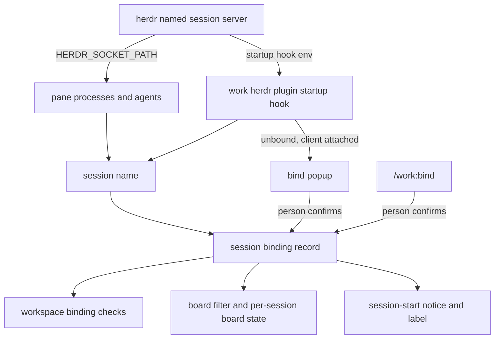
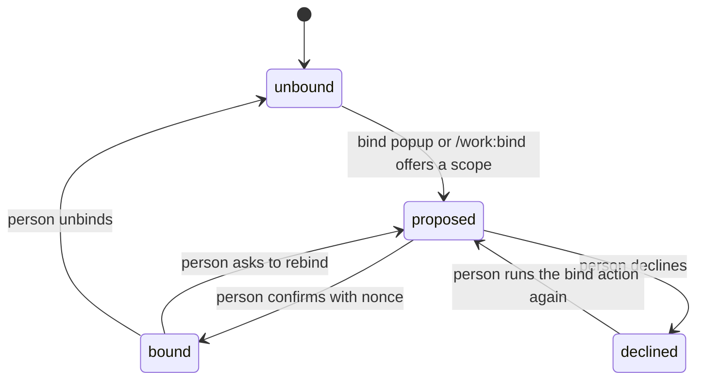

# Herdr Session Binding - Plan

## Goal Capsule

- **Objective:** A person who runs one herdr named session per slice of their Linear work (an organization, a team, a project or an initiative) sees that session hold only that slice: its workspaces, worktrees, board and notices stay inside the bound scope, and anything outside it is reported instead of silently mixed in.
- **Means:** a session binding record keyed by the herdr session name (KTD1, KTD2), asked for at session start through a herdr plugin (KTD6) and by `/work:bind`, with every existing per-server record namespaced by session (KTD3).
- **Authority:** the Product Contract's requirements win on behaviour; Key Technical Decisions win on mechanism; units override neither.
- **Stop conditions:** stop and report after U1 if a herdr plugin startup hook cannot tell which session it runs in, if a fresh `herdr --session <name>` start never runs the startup hook with a client attached, or if Linear's API cannot answer whether a project or issue belongs to a team or initiative.
- **Execution profile:** bash libraries and bats suites in `plugins/work/`, built on branch `feature/work-plugin-board` after that branch's board work is committed. No Linear writes during development or verification; herdr checks run only in throwaway `herdr --session` servers.
- **Who finishes:** `ce-work` implements and verifies; the person decides merge.

---

## Product Contract

### Summary

A herdr named session gains a binding of its own to one Linear scope: the organization, one team, one project or one initiative. The binding is asked for when a session starts and can be added, changed or removed later. It scopes what the work plugin does inside that session: which projects its workspaces may bind to, which tickets its board shows, and which placements count as out of place. Herdr cannot rename a session, so a later binding is recorded against the session's existing name and shown as a label.

### Problem Frame

The work plugin binds a worktree to an issue and a herdr workspace to a project, but it treats every herdr server as one shared world. Herdr ids are scoped to one server, so two named sessions both have a workspace `w1`; today the plugin's workspace records and board ledger are keyed by those ids and shared across sessions. A person who keeps `herdr --session canvas-tools` and `herdr --session brand-foundry` side by side gets bindings and board state from one session applied in the other. There is also no way to say what a whole session is for, so nothing keeps a team's session from filling with another team's work.

### Key Decisions

- **The unit is a herdr named session.** (session-settled: user-directed — chosen over an agent session in a pane and over a herdr tab: the person runs one herdr session per slice of work.) Governs R1, R2.
- **A session binds to an organization, a team, a project or an initiative.** (session-settled: user-directed — chosen over a single fixed kind: different sessions are cut at different levels.) Governs R3.
- **Ask at session start through a herdr plugin.** (session-settled: user-approved — chosen over waiting for the next `/work` command: the question lands when the session opens.) Governs R7.
- **Inside a project session, a workspace is a sub-grouping, not a second project.** (session-settled: user-approved — chosen over keeping every workspace a project binding: a project session already names its project.) Governs R11.
- **The session's scope narrows the board inside it.** (session-settled: user-approved — chosen over a global board that only reports mismatches: a team session's board shows that team.) Governs R14.

### Requirements

**Session identity and binding**

- R1. The plugin knows which herdr session it runs in, for every pane, hook and plugin command, and treats the unnamed default server as the session named `default`.
- R2. A session binding links one session name to one Linear scope and records its kind, the scope's id and its display name.
- R3. The scope kind is one of organization, team, project or initiative.
- R4. A binding exists only once a person confirms it; a proposal alone changes nothing, as for worktree bindings.
- R5. A binding can be changed or removed later, and each change shows its effect before it is written.
- R6. A binding made after a session was created is recorded against the session's current name; the session is never renamed.

**Asking and showing**

- R7. When a session starts unbound, the person is asked to bind it; an unbound session keeps working and is never blocked.
- R8. A declined ask is not repeated for that session until the person runs the bind action again.
- R9. A bound session shows its scope where the person looks: herdr's window title or tab bar, and the session-start notice agent sessions receive.

**Nesting**

- R10. Inside an organization, team or initiative session, a workspace binds to a project, and only to a project inside the session's scope.
- R11. Inside a project session, a workspace binds to a milestone or an issue of that project, not to a project.
- R12. A worktree binding whose issue lies outside the session's scope is reported as outside the session, the way a misplaced binding is reported today, and nothing is moved.
- R13. A session with no binding behaves exactly as today, with no scope checks.

**Board**

- R14. Inside a bound session, the board shows only tickets inside the session's scope, in addition to the mapping's own filter.
- R15. Each session keeps its own board ledger, questions, lock and sync state; a sync never reads or changes another session's panes.

**Isolation of existing records**

- R16. Workspace bindings and every other record keyed by a herdr id are kept per session, so a binding made in one session never applies in another.
- R17. Records written before this change stay readable and keep applying to the session they were made in, which is the default session.

### Acceptance Examples

- AE1. **Covers R1, R16.** **Given** a workspace `w1` bound to project A in the default session, **when** a named session `web` also has a workspace `w1`, **then** `w1` in `web` reads as unbound.
- AE2. **Covers R7, R8.** **Given** a new session `canvas` with no binding, **when** it starts with a client attached, **then** the person is asked to bind it; **when** they decline, **then** later starts of `canvas` do not ask again.
- AE3. **Covers R10, R12.** **Given** a session bound to team WEB, **when** a worktree is bound to an issue of team OPS, **then** the worktree is reported as outside the session and its binding stays in place.
- AE4. **Covers R11.** **Given** a session bound to project AI Canvas Tools, **when** a person binds a workspace inside it, **then** they choose a milestone or issue of that project, and a different project is refused.
- AE5. **Covers R14, R15.** **Given** a global board mapping filtered to "assigned to me" and a session bound to team WEB, **when** the board syncs in that session, **then** only WEB tickets assigned to me get panes, and the default session's board is untouched.
- AE6. **Covers R5.** **Given** a session bound to team WEB with a workspace bound to a WEB project, **when** the person rebinds the session to team OPS, **then** the preview names that workspace as falling outside the new scope before anything is written.

### Scope Boundaries

- Renaming, moving or merging herdr sessions.
- Bindings that span herdr servers on other machines (`herdr --remote`).
- A per-session board mapping; the board keeps one global mapping, narrowed per session (R14).
- Writing to Linear from a session binding; binding a session writes nothing to Linear.

#### Deferred to Follow-Up Work

- Opening the board branch's draft pull request, which comes first and is separate from this plan.
- Linking the work plugin's herdr plugin into the separate read-only board plugin (`herdr-board`); the two stay unlinked.

### Dependencies

- herdr 0.9.0 plugin manifests (`[[startup]]`, `[[actions]]`, `[[panes]]` with `placement = "popup"`).
- The board work on `feature/work-plugin-board` (board store, sync, attended fence).

### Sources

- herdr plugin documentation, v0.9.0: `docs/next/website/src/content/docs/plugins.mdx` in `herdrdev/herdr` (startup hooks, event hooks, runtime environment, popup panes).
- `herdr api schema --json` (0.9.0): no session rename request; `pane.rename`, `tab.rename`, `workspace.rename`, `agent.rename` and `client.window_title.set` exist; event kinds include `pane_agent_detected` and `workspace_created`.
- The herdr agent skill (`herdr --skill`): ids and live agent names are scoped to one server.
- `herdr-board` derives a session name from its socket path (`paths::session_name_from_socket` in `/Users/shawnroos/projects/herdr-linear-board`), which is precedent for KTD1.

---

## Planning Contract

### Key Technical Decisions

- KTD1. **A session is named by its socket path.** Panes carry `HERDR_SOCKET_PATH`: the default server's socket is `~/.config/herdr/herdr.sock` and a named session's is `~/.config/herdr/sessions/<name>/herdr.sock`. The plugin derives the name from that path and checks it against `herdr session list`; outside a pane it uses the socket line of `herdr status`. Chosen over asking herdr for the name at every call, which has no request of its own. Instantiates R1.
- KTD2. **The binding is a new record family keyed by session name.** `sessions/<name>/binding.json` under `HERDR_LINEAR_STORE_DIR` holds kind, scope id, display name, state and nonce, with a version of its own. `HERDR_LINEAR_RECORD_VERSION` is not bumped. Session names pass the plugin's safe-identifier check before they become a path. Instantiates R2-R6, per KD "The unit is a herdr named session" (governs R1, R2).
- KTD3. **Every per-server record moves under the session, and the default session keeps today's paths.** Named sessions store workspace records and board state under `sessions/<name>/`. The default session keeps reading and writing the current flat paths, so existing records need no migration. With no session (outside herdr, or a socket that fails KTD1), workspace records and board state are neither read nor written: reads answer absent and writes refuse, while worktree bindings, keyed by worktree path, keep working. One store-root helper returns the flat root for `default` and `sessions/<name>/` otherwise, and every site that builds a workspace or board path goes through it. Chosen over moving every record into `sessions/default/`, which would need a one-time move of live records and a lock across it. Instantiates R15-R17.
- KTD4. **Scope membership is read from Linear, not inferred from names.** A project belongs to a team or an initiative by its Linear relations; an issue belongs by its team, its project, and that project's initiatives. The organization contains everything. Reads are cached per sync the way board reads are. Instantiates R10-R12, R14.
- KTD5. **The board filter gains one scope clause per session.** The session's scope travels beside the resolved filter as its own clause (kind and id) that the board read joins to the mapping's filter clauses with AND. It is never merged into the mapping's `team` or `project` keys, and an initiative is expressed only through this clause. An organization session adds no clause. Board configuration stays one file. Chosen over per-session mappings (Scope Boundaries). Instantiates R14, per KD "The session's scope narrows the board inside it" (governs R14).
- KTD6. **A herdr plugin asks; a startup hook never answers.** The work plugin ships a herdr plugin manifest with a startup hook, a bind action and a popup pane. At start, the hook reads the session's binding. If it is unbound and not declined, the hook opens the bind popup when a client is attached, and otherwise sets the unbound label; herdr 0.9.0 has no client-attach event, so the ask then waits for the bind action or `/work:bind`. Only the popup (a person typing) and `/work:bind` confirm a binding. (session-settled: user-approved — chosen over waiting for the next `/work` command: the question lands when the session opens.) Instantiates R7-R9.
- KTD7. **The label is a tab bar command entry, with the window title as fallback.** herdr's `tab_bar_right` `command` entries resolve on each server, so one entry running the plugin's label command shows each session its own scope. When U1 shows command entries cannot tell which session they run in, the startup hook sets `client.window_title` instead. Instantiates R9.
- KTD8. **A project session's workspaces bind to a milestone or issue through the existing workspace record.** The record's existing project field keeps the session's project id, so every current reader of a workspace's project (placement, context, candidates, space lookup) keeps a correct answer unchanged. Two new fields carry the sub-grouping: its kind (milestone or issue) and its id, read only by the new nesting check. (session-settled: user-approved — chosen over keeping every workspace a project binding: a project session already names its project.) Instantiates R10, R11.

### High-Level Technical Design

Where session identity comes from, and what reads the binding:

Binding lifecycle for one session name:

What a workspace may bind to, by session kind:

| Session bound to | A workspace binds to | A worktree's issue counts as inside when |
|---|---|---|
| nothing | a project, as today | always |
| organization | a project | always |
| team | a project of that team | its team is that team |
| initiative | a project in that initiative | its project is in that initiative |
| project | a milestone or issue of that project | its project is that project |

### Assumptions

- A herdr plugin startup hook receives `HERDR_SOCKET_PATH` for the server that ran it (per the plugin docs); U1 proves it for a named session.
- A popup pane opened with no client attached fails without harming the server, so the hook can try and fall back.
- Linear exposes a project's teams and initiatives, and an issue filter can select by initiative; U1 confirms both read-only.

### Implementation Constraints

- No Linear writes during development or verification; U1's Linear checks are read-only.
- herdr checks run only in throwaway `herdr --session` servers, never against `~/.config/herdr/herdr.sock`. The spike's test plugin uses a disposable id and is unlinked afterwards, because linked plugins are shared by every session.
- Do not bump `HERDR_LINEAR_RECORD_VERSION`.
- Hooks and the herdr startup hook never confirm a binding; `placement_caller_check` and `consent_caller_check` enforce it (U11).

### System-Wide Impact

- **Agent parity:** an agent can read a session's binding and scope, from the session-start notice and the library, but cannot confirm one; binding stays a person's act, like worktree bindings and board answers (U11).
- **Plugin reach:** a linked herdr plugin is registered for every session of the user, so the startup hook runs in each session's server start, including the default server's next restart.
- **Existing board users:** the default session keeps today's paths (KTD3), so a board already in use needs no migration, and an unbound default session sees no change (R13).
- **Session lifecycle:** herdr sends no event when a session is deleted, so a binding outlives its session and applies again if a session is later recreated under the same name.

### Risks

| Risk | Mitigation |
|---|---|
| A startup hook runs before any client attaches, so the popup cannot show | The hook falls back to the label, and the ask moves to the bind action and `/work:bind` (KTD6); U1 measures both cases |
| A recreated session silently inherits an old binding | `/work:bind` and the session-start notice always name the bound scope, so an inherited binding is visible on first use |
| Scope reads add Linear requests to every sync and placement check | Membership answers are cached per sync (KTD4), and an unknown answer never marks anything outside |
| herdr changes session socket paths in a later version | KTD1 checks the derived name against `herdr session list`, and a mismatch reads as no session rather than a wrong one |
| The separate `herdr-board` plugin also acts per session | The two plugins keep separate ids, state and actions and never call each other |

### Sequencing

U1 first; it gates everything. U2 and U4 can then run in parallel. U3 needs U2. U5 needs U2 and U3. U6 and U7 need U3, U4 and U5. U8 needs U6. U9 and U10 need U3. U11 runs last.

---

## Implementation Units

### U1. Spike herdr session and Linear scope facts

- **Goal:** Answer the stop conditions and the Assumptions with evidence before building.
- **Requirements:** R1, R7, R9, R10, R14
- **Dependencies:** none
- **Files:** `plugins/work/docs/session-spikes.md` (new)
- **Approach:**
  1. In two throwaway named sessions, read `HERDR_SOCKET_PATH` and `herdr status` from a pane and confirm the socket-to-name rule (KTD1) against `herdr session list`.
  2. Link a disposable test plugin with a startup hook that records its environment. Start a throwaway session with and without a client attached, confirm which session the hook sees, and try opening a popup in both cases. Unlink the plugin afterwards.
  3. Check whether a `tab_bar_right` command entry learns its session, and whether `client.window_title.set` persists across detach (KTD7).
  4. Read-only against Linear: fetch a project's teams and initiatives, an issue's project initiatives, and test an issue filter by initiative (KTD4, KTD5).
  5. Record each answer as yes or no with its evidence, and name which stop condition, if any, holds.
- **Test expectation:** none -- a spike that records facts; no shipped behaviour.
- **Verification:** `session-spikes.md` answers every question above, and no test plugin, session or socket is left behind.

### U2. Session identity

- **Goal:** Every caller can name the session it runs in.
- **Requirements:** R1
- **Dependencies:** U1
- **Files:** `plugins/work/lib/session.sh` (new), `plugins/work/tests/unit/session.bats` (new), `plugins/work/tests/fixtures/fake-herdr.sh`
- **Approach:**
  1. Derive the name from `HERDR_SOCKET_PATH` per KTD1, falling back to the probe's socket line.
  2. Map the default socket to `default`.
  3. Refuse a name that fails the safe-identifier check, and treat an unreadable socket as no session rather than `default`.
- **Patterns to follow:** `plugins/work/lib/herdr-read.sh` `probe` and `_resolve_position`.
- **Test scenarios:**
  - A pane in the default server reports `default`.
  - A pane whose socket is `~/.config/herdr/sessions/canvas/herdr.sock` reports `canvas`.
  - Outside herdr, with no socket and no server, the answer is no session.
  - A socket path with an unsafe segment is refused, never used as a path.
  - A socket path under an unexpected directory is refused rather than guessed.
- **Verification:** `session.bats` passes, and a pane in U1's throwaway sessions names each correctly.

### U3. Session binding record

- **Goal:** A session name can be proposed, confirmed, declined, changed and removed as a binding.
- **Requirements:** R2-R6, R8
- **Dependencies:** U2
- **Files:** `plugins/work/lib/session-binding.sh` (new), `plugins/work/tests/unit/session-binding.bats` (new)
- **Approach:**
  1. Store the record per KTD2 with atomic 0600 writes and the owner and mode check on read.
  2. Mirror the worktree binding's propose and confirm nonce protocol, plus decline and unbind.
  3. Keep a declined flag that suppresses the start-time ask (R8) and is cleared only by an explicit bind action.
- **Patterns to follow:** `plugins/work/lib/binding.sh` `binding_propose` and `binding_confirm`; `plugins/work/lib/board-store.sh` `_board_mutate`.
- **Test scenarios:**
  - A proposal without confirmation leaves the session unbound.
  - Confirming with the proposal's nonce binds; a wrong nonce is refused and changes nothing.
  - Each of the four kinds binds with its id and display name.
  - A fifth kind is refused.
  - Rebinding a bound session replaces the scope only after confirmation.
  - Unbinding removes the binding and the session reads as unbound.
  - A declined session reports declined until a new proposal is made.
  - A record another user could write is refused, not read.
- **Verification:** `session-binding.bats` passes and each guard is mutation-proven.

### U4. Linear scope reads

- **Goal:** Resolve scope candidates and answer whether a project or issue lies inside a scope.
- **Requirements:** R3, R10, R12, R14
- **Dependencies:** U1
- **Files:** `plugins/work/lib/scope-linear.sh` (new), `plugins/work/tests/unit/scope-linear.bats` (new), `plugins/work/tests/fixtures/fake-linear.sh`
- **Approach:**
  1. List candidates per kind: the organization, teams, projects and initiatives.
  2. Answer membership per KTD4 for a project and for an issue, returning inside, outside or unknown.
  3. Treat a failed or partial read as unknown, never as outside.
- **Patterns to follow:** `plugins/work/lib/board-linear.sh` paginated reads and exit codes; `plugins/work/lib/linear.sh` `query`.
- **Test scenarios:**
  - A project of team WEB is inside a WEB session and outside an OPS session.
  - A project with two initiatives is inside a session bound to either.
  - An issue with no project is outside an initiative session and inside its team's session.
  - Everything is inside an organization session.
  - A rate-limited read answers unknown and marks nothing outside.
- **Verification:** `scope-linear.bats` passes against fake Linear; U1's read-only answers agree with the fixture shapes.

### U5. Per-session records

- **Goal:** Workspace records and board state are kept per session, and existing records keep working.
- **Requirements:** R15, R16, R17
- **Dependencies:** U2, U3
- **Files:** `plugins/work/lib/session.sh`, `plugins/work/lib/binding.sh`, `plugins/work/lib/board-store.sh`, `plugins/work/lib/board-sync.sh`, `plugins/work/lib/board-herdr.sh`, `plugins/work/lib/herdr-write.sh`, `plugins/work/lib/states.sh`, `plugins/work/hooks/board-behind.sh`, `plugins/work/tests/unit/propose.bats`, `plugins/work/tests/unit/board-store.bats`, `plugins/work/tests/unit/board-sync.bats`, `plugins/work/tests/unit/board-herdr.bats`, `plugins/work/tests/unit/board-behind.bats`
- **Approach:**
  1. Add the store-root helper per KTD3 and route every workspace and board path through it: record, sync-state and question paths, the sync lock and the sync driver's board root, the ledger scan and placeholders, the reservations glob, the workspaces glob and the layout journal directory.
  2. Keep the default session on today's paths, and refuse workspace and board reads and writes with no session.
  3. Store a worktree binding's saved herdr tab per session, and read only the current session's entry.
  4. Mark every session's board behind on a Linear write, since a ticket can sit on several sessions' boards.
- **Patterns to follow:** `plugins/work/lib/board-store.sh` `_board_path`.
- **Test scenarios:**
  - Covers AE1. A workspace `w1` bound in the default session reads unbound in session `web`.
  - A board sync in session `web` ignores the default session's ledger and lock.
  - Records written before this change are read unchanged in the default session.
  - Two sessions syncing at once each take their own lock and neither waits on the other.
  - The space lookup in session `web` ignores a default-session workspace record with the same id.
  - A tab id saved for a worktree in the default session is not reused in session `web`.
  - A pane whose socket fails the naming rule reads no workspace record or board ledger and writes neither.
  - A Linear write from session `web` marks the default session's board behind too.
- **Verification:** the existing `propose.bats`, `board-store.bats` and `board-sync.bats` suites pass unchanged for the default session, plus the new scenarios.

### U6. Nesting checks

- **Goal:** Workspace and worktree bindings respect the session's scope.
- **Requirements:** R10, R11, R12, R13
- **Dependencies:** U3, U4, U5
- **Files:** `plugins/work/lib/binding.sh`, `plugins/work/lib/states.sh`, `plugins/work/tests/unit/states.bats`, `plugins/work/tests/unit/start.bats`
- **Approach:**
  1. Refuse a workspace binding outside the session's scope, and in a project session accept only a milestone or issue per KTD8.
  2. Add an outside-session report to placement, beside misplaced, and suspend nothing new.
- **Patterns to follow:** `plugins/work/lib/states.sh` `check_placement`.
- **Test scenarios:**
  - Covers AE3. A worktree bound to an OPS issue in a WEB session is reported outside the session, and its binding is unchanged.
  - Covers AE4. In a project session a workspace binds to a milestone, and a different project is refused.
  - In an unbound session every existing placement answer is unchanged.
  - An unknown membership answer reports nothing and refuses nothing.
  - In a project session, a worktree bound to an issue of that project, in a workspace bound to a milestone of that project, is not reported misplaced and `/work:start` finds that workspace.
- **Verification:** `states.bats` and `start.bats` pass, including every existing test unchanged.

### U7. Board narrowing

- **Goal:** A bound session's board shows only its scope.
- **Requirements:** R14, R15
- **Dependencies:** U3, U4, U5
- **Files:** `plugins/work/lib/board-config.sh`, `plugins/work/lib/board-linear.sh`, `plugins/work/lib/board-sync.sh`, `plugins/work/tests/unit/board-config.bats`, `plugins/work/tests/unit/board-linear.bats`, `plugins/work/tests/unit/board-sync.bats`
- **Approach:**
  1. Carry the session's scope clause beside every mapping's resolved filter in that session, per KTD5.
  2. Join it to the filter with AND in the board read, supporting team, project and initiative.
  3. Keep the configuration file unchanged.
- **Patterns to follow:** `plugins/work/lib/board-config.sh` resolved filter and `state-type-not` default.
- **Test scenarios:**
  - Covers AE5. A WEB session's sync requests WEB tickets only, and the default session's board is untouched.
  - An organization session's resolved filter equals the mapping's filter.
  - An initiative session's read selects by initiative.
  - A mapping whose own filter already names another team yields an empty board, not an error.
- **Verification:** the board suites pass, including every existing test unchanged for unbound sessions.

### U8. Bind skill session flow

- **Goal:** A person can see, bind, rebind and unbind the session from `/work:bind`.
- **Requirements:** R4, R5, R6, R8
- **Dependencies:** U6
- **Files:** `plugins/work/skills/bind/SKILL.md`, `plugins/work/tests/unit/wire.bats`
- **Approach:**
  1. Show the session name and its binding first.
  2. Offer candidates by kind, preview what falls outside the new scope, then ask and confirm with the nonce.
  3. Keep the shared rubric text identical to the other skills.
- **Patterns to follow:** `plugins/work/skills/board/SKILL.md` preview-ask-set steps.
- **Test scenarios:**
  - Covers AE6. The rebind preview names each workspace and worktree that falls outside the new scope before anything is written.
  - The skill's fence sources every library it calls (`skill_lib_sync_check`).
- **Verification:** `wire.bats`, `skill_lib_sync_check` and `rubric_sync_check` pass.

### U9. herdr plugin: ask at start and label

- **Goal:** A session is asked to bind when it opens, and shows its scope.
- **Requirements:** R7, R8, R9
- **Dependencies:** U3
- **Files:** `plugins/work/herdr/herdr-plugin.toml` (new), `plugins/work/bin/session-start.sh` (new), `plugins/work/bin/session-bind.sh` (new), `plugins/work/bin/session-label.sh` (new), `plugins/work/tests/unit/herdr-plugin.bats` (new), `plugins/work/docs/settings.md`
- **Approach:**
  1. Declare the startup hook, the bind action and the popup pane in the manifest.
  2. Follow KTD6 in the startup hook: read the binding, then open the popup or set the label.
  3. In the popup, list candidates, show the preview and confirm or decline through U3.
  4. Print the scope, or `unbound`, from the label command for KTD7.
- **Patterns to follow:** `/Users/shawnroos/projects/herdr-linear-board/herdr-plugin.toml` manifest shape; `plugins/work/lib/board-attended.sh` detached-process handling.
- **Test scenarios:**
  - Covers AE2. An unbound session with a client attached opens the bind popup once.
  - A declined session's start opens nothing and sets the unbound label.
  - A start with no client attached sets the label and exits 0.
  - The startup hook never writes a confirmed binding, whatever the popup does.
  - A bound session's label command prints the scope's display name.
  - An unreadable store makes the hook exit 0 without asking.
- **Verification:** `herdr-plugin.bats` passes against the fake herdr, and U1's throwaway session shows the popup and label live.

### U10. Session-start notice for agent sessions

- **Goal:** An agent session learns which herdr session it runs in and its scope.
- **Requirements:** R9, R13
- **Dependencies:** U3
- **Files:** `plugins/work/hooks/ground.sh`, `plugins/work/tests/unit/ground.bats`
- **Approach:**
  1. Add the session name and scope, or an unbound line naming `/work:bind`, inside the existing untrusted-value wrapper.
  2. Leave the default unbound session's notice unchanged.
- **Patterns to follow:** `plugins/work/hooks/ground.sh` board summary lines.
- **Test scenarios:**
  - A pane in a WEB session receives the session name and team WEB.
  - A pane in an unbound named session receives the unbound line.
  - A pane in the unbound default session receives today's notice unchanged.
  - A scope display name containing markup is neutralised by the wrapper.
- **Verification:** `ground.bats` and `hook_source_stderr_check` pass.

### U11. Harness, concepts and settings

- **Goal:** The checks and documents cover session binding.
- **Requirements:** R1-R17 (integration)
- **Dependencies:** U2-U10
- **Files:** `plugins/work/tests/run-tests.sh`, `plugins/work/tests/unit/wire.bats`, `plugins/work/docs/settings.md`, `CONCEPTS.md`
- **Approach:**
  1. Extend `consent_caller_check` so only `/work:bind` and the bind popup script confirm a session binding.
  2. Extend `placement_caller_check` so hooks and the startup hook never confirm one.
  3. Raise the suite floor, add setting rows, and correct the Session binding entry in `CONCEPTS.md` wherever the built behaviour differs from it.
- **Test scenarios:**
  - A hook that confirms a session binding turns the placement check red.
  - A library caller of the session confirm verb, outside the popup script, turns the consent caller check red.
- **Verification:** the full suite passes with the new floor through `honest-run` with a PASS verdict.

---

## Verification Contract

| Gate | Command | Proves |
|---|---|---|
| Unit suites | `bats plugins/work/tests/unit/<suite>.bats` | each unit's scenarios |
| Static checks | `bash -c '. plugins/work/tests/run-tests.sh; placement_caller_check; consent_caller_check; skill_lib_sync_check; rubric_sync_check; identifier_path_check'` | hooks never bind; only person-typed surfaces confirm; skills source what they call; safe paths |
| Full suite | `bash ~/.claude/tools/honest-run/run.sh --expect "PASS" -- bash plugins/work/tests/run-tests.sh all`, run alone; on memory pressure run the suites in slices and the `self-check`, `smoke` and `mutation` modes separately | everything, with a read verdict |
| Mutation proofs | break each binding guard, scope check and caller check in a scratch copy; its named test turns red | guards are load-bearing |
| Live verification | two throwaway named sessions with a linked test build of the herdr plugin, read-only Linear, a scratch store | AE1, AE2, AE5 behave in real herdr |

## Definition of Done

- U1's findings are recorded and no stop condition holds, or the run stopped and reported which one did.
- Every unit's verification holds, and the full suite passes with the raised floor.
- AE1 through AE6 each have a passing test, and AE1, AE2 and AE5 were seen live in throwaway sessions.
- No throwaway session, linked test plugin, socket or scratch store is left behind, and no code from abandoned approaches remains in the diff.
- No Linear write was sent and `HERDR_LINEAR_RECORD_VERSION` is unchanged.
