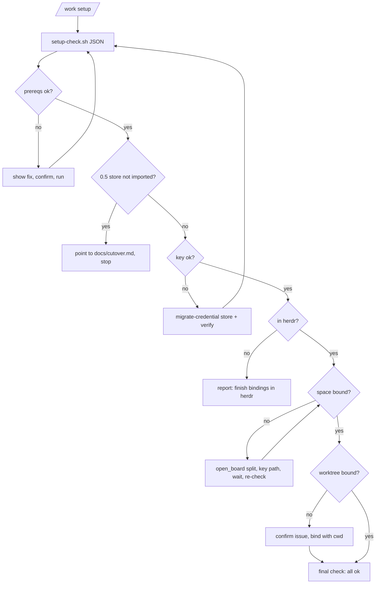

# Work Guided Setup - Plan

---

## Goal Capsule

- **Objective:** a person who installs the work plugin can get from nothing to a working board in one guided session. At the end, the herdr board is installed, the agent tools are registered, the Linear key works, their herdr space shows a Linear project, and their current worktree is bound to an issue.
- **Means:** a re-runnable `setup` skill reached through `/work setup` (KTD1). It checks each prerequisite with a tested check script (KTD2), offers the fix for each missing one, and runs a fix only after the person confirms it.
- **Authority:** this plan's Requirements set behavior and its KTDs set mechanism. The work plugin 0.6.0 decision record in herdr-board (`docs/board-owns-the-store.md`) sets what the board owns.
- **Stop conditions:**
  - Stop and report if a board verb or JSON field named in Sources behaves differently from what this plan relies on.
  - Never write `~/.claude/work`, call the Linear API outside `bin/migrate-credential.sh`, or move existing herdr panes (the 0.6.0 contract).
- **Execution profile:** shell plus Markdown skills, tested with bats through `plugins/work/tests/run-tests.sh all`. There is no CI in this repo.
- **Who finishes:** `ce-work` implements and verifies. The live run on a fresh machine is a manual check.

---

## Product Contract

### Summary

`/work setup` walks a person through every piece the work plugin needs, in order:
1. Check the tools the install needs.
2. Install or register the herdr board.
3. Start its daemon.
4. Register `board mcp`.
5. Detect a 0.5 store that still needs importing.
6. Store and verify the Linear key.
7. Open the board beside the person so they can bind the space to a Linear project.
8. Bind the current worktree to an issue.

Each step first reports what it found. Every fix that changes the machine is run only after the person says yes, and running setup again skips what is already done.

### Problem Frame

Work 0.6.0 depends on the `board` binary, its daemon, the `board mcp` server, a Linear key in the Keychain, and a bound herdr space. Installing the plugin installs none of these. `/work` can report what is missing, but nothing walks a new user through fixing it. Some steps are easy to get wrong:
- The board's own docs point at the upstream repo, which lacks Linear mode.
- macOS has no release binary, so the board has to be built with cargo.
- Binding a space happens only in the board's TUI.

Research also found that `migrate-credential.sh store` has never worked, so the key-storing step it offers is broken today.

### Requirements

**Checks and fixes**
- R1. Setup reports the state of every prerequisite before changing anything: git, cargo, python3, herdr 0.9.x on protocol 22, `~/.local/bin` on PATH, board installed and its version, daemon, herdr plugin registered, `board mcp` registered, Linear key present and accepted, a duplicate report hook, the import state, the space binding, and the worktree binding.
- R2. Every fix that changes the machine is shown as the exact command and runs only after the person confirms it. A declined fix is reported and setup moves on where it can.
- R3. Running setup again changes nothing that is already in place.

**Board install**
- R4. With no board, or a board older than 0.18.0, setup installs the board from `shawnroos/herdr-linear-board` at the release tag, never from upstream.
- R5. With a board that is new enough but not registered as a herdr plugin, setup registers the existing install instead of rebuilding it.

**Credentials**
- R6. Setup can store the Linear key in the Keychain item the board reads, and confirms the board accepts it.

**Migration**
- R7. When a 0.5 store exists and has not been imported, setup points to `docs/cutover.md` and does not run a fresh-install flow over it.

**First binding**
- R8. In herdr, setup opens the board beside the person, without stealing focus, and tells them the keys to bind the space to a project. It then confirms that the space is bound.
- R9. Setup binds the current worktree to an issue the person confirms, through `board mcp` `bind`, with an explicit `cwd`.
- R10. Outside herdr, setup does everything except the two binding steps and says how to finish them in herdr.

### Key Decisions

- **Binding a space to a project stays person-only, done from the board TUI.** (session-settled: user-approved — chosen over an agent tool that binds spaces: the space binding decides what the whole board shows.) Governs R8.
- **Agents write Linear only through Linear's MCP.** Setup verifies the key through the board and stores it through the plugin's own credential helper. (session-settled: user-directed — chosen over a plugin-side gated write path: one write path to the tracker.) Governs R6.
- **The plugin never moves existing panes and never takes focus.** (session-settled: user-approved — chosen over the board moving panes.) Governs R8.
- **Approval comes from the person confirming each fix, plus Claude Code's tool permissions.** (session-settled: user-directed — chosen over a TUI confirm step.) Governs R2.

### Scope Boundaries

- Changing the board repo is out of scope. This covers its README and install docs pointing at upstream, and its unbound hint naming the retired `/work:bind`.
- Adding a herdr keybinding for the board is out of scope. Setup prints the line to add rather than editing `~/.config/herdr/config.toml`.
- Linux is out of scope. Setup targets macOS, where the board's Keychain read lives. It says so when the platform is not macOS.

#### Deferred to Follow-Up Work

These are herdr-board changes:
- The README and `docs/install.md` should name `shawnroos/herdr-linear-board`.
- The unbound hint should say "bind this space here (s)" instead of `/work:bind`.
- A CLI verb for the space binding would let setup confirm it without the TUI.

### Sources

- `/tmp` research dossier, 2026-10-06. These findings are restated here because the dossier is not kept:
  - `herdr plugin install` runs the board's `scripts/build.sh` and then `scripts/install-cli.sh`.
  - `install-cli.sh` copies `board` into `~/.local/bin` and writes a `.herdr-board-cli-managed` marker. It refuses to overwrite an unmanaged `board`, symlinks included (`install-cli.sh:102-106`).
  - `scripts/install.sh --yes` is the local-dev path. It runs `herdr plugin link <repo>` and creates the `~/.local/bin/board` symlink.
- Detection, all in herdr-board v0.18.0:
  - `board version --json` returns `cli_version` and `daemon_version`, and does not start the daemon.
  - `board linear session --json` returns `space_bound`, and does not start the daemon.
  - `board import work-store --dry-run --json` returns `present` and `imported[]`.
  - `board linear project list --json` returns `status: "unavailable"` when the key is missing or refused.
  - `herdr plugin list --json` lists `plugin_id == "herdr-board"`.
  - The Keychain item is service `work-linear`, account `linear-api-key`.
- The `board mcp` tool `open_board` takes `placement` `split` (the default) or `tab`, and never focuses. It needs the herdr plugin registered and the caller in a herdr pane.
- To bind a space in the TUI: press `s`, choose the space, Enter, "Choose a project", Enter, then optionally `v` for "Choose a view". Source: herdr-board `crates/board-tui` linear screens.
- `bin/migrate-credential.sh:94` calls `prompt_secret` with one argument. `lib/secrets.sh:240` reads `$2` under `set -u`, so `store` always exits 1 with "cancelled; nothing was stored". Reproduced.

---

## Planning Contract

### Key Technical Decisions

- KTD1. **A `setup` skill, reached through `/work setup`.**
  - The skill is `skills/setup/SKILL.md` with `disable-model-invocation: true`, the plugin's convention for user-invoked flows.
  - `commands/work.md` gains a "With `setup`" section that reads that file and follows it, the same way `/work <ID>` reaches `start`.
  - This keeps `/work`'s report path unchanged and gives the long flow its own file.
- KTD2. **One tested check script carries all detection.**
  - `bin/setup-check.sh` prints one JSON object, with one entry per R1 prerequisite: `{state: ok|missing|old|unknown|needs_import, detail, fix, fix_kind: command|instruction|null}`.
  - The skill runs `fix` only when `fix_kind` is `command`, and only after a yes. An `instruction` is printed for the person to do, such as removing a duplicate settings hook or moving an unmanaged binary aside.
  - The skill runs it before and after each fix and decides from its output, not from prose.
  - Rationale: detection logic in skill prose would be untestable, and the check needs fakes for `board`, `herdr`, `security` and `claude`. The plugin's test fixtures already supply most of those.
  - `/work`'s health block keeps its own lines. The two must agree on the overlapping checks, and a wire test pins that.
- KTD3. **Install path by state.**

  | State | Fix offered |
  |---|---|
  | No `board`, a managed board older than 0.18.0, or a managed board ≥ 0.18.0 with no `herdr-board` plugin | `herdr plugin install shawnroos/herdr-linear-board --ref v0.18.0 --yes` |
  | `board` is new enough but the herdr plugin is not registered, and `~/.local/bin/board` is a symlink into a checkout that holds `herdr-plugin.toml` | `herdr plugin link <that checkout>` |
  | An unmanaged `board` symlink older than 0.18.0 | `git -C <checkout> fetch --tags && git -C <checkout> checkout v0.18.0 && cargo build --release -p board-cli --manifest-path <checkout>/Cargo.toml` (command), with "or move it aside and take the first row" as `detail`. Setup never overwrites it |
| An unmanaged non-symlink `board` with no `herdr-board` plugin | instruction only: move it aside, then take the first row |

  Rationale: `install-cli.sh` refuses an unmanaged board, so blindly running `herdr plugin install` fails on dev machines, including Shawn's. `--yes` skips herdr's interactive trust preview, which the agent's shell cannot answer; the person's confirmation in setup is that approval.
- KTD4. **The space binding happens in the TUI, opened by the agent, and is confirmed by polling.**
  - The agent calls `board mcp` `open_board` with placement `split`, then prints the key path (`s` → space → Enter → project → Enter, then optionally `v` for a view).
  - It asks the person to say when they are done, then re-runs the check and reads `space_bound`. A failed `open_board` falls back to printing `herdr plugin action invoke open-board --plugin herdr-board`.
  - It ends with `close_board` on the pane it opened.
- KTD5. **The worktree binding takes the issue from the branch name and asks the person to confirm it.**
  - The skill reads the current branch. When it contains an issue identifier, the skill proposes that issue. Otherwise it asks for one.
  - It never creates an issue. Creating one is the `start` skill's job.
  - It then calls `bind` with `issue`, `cwd` (the worktree top-level) and `branch`. A worktree that is already bound is reported and left alone.
- KTD6. **The key is stored through the fixed credential helper.**
  - U1 fixes `migrate-credential.sh store`.
  - Setup runs `bin/migrate-credential.sh store`, then `verify`, then re-checks with the board (`board linear project list --json` must not report `unavailable`).
  - The key is never echoed, never passed in argv, and never written to a file.

### High-Level Technical Design

### Assumptions

- `herdr plugin install <owner>/<repo> --ref <tag>` runs the manifest's `[[build]]` steps on a clean machine. This was observed for other GitHub plugins, not run for this one.
- `herdr plugin link <checkout>` registers the plugin without running the manifest's build steps (scripts/install.sh builds before it links, which suggests so; unverified). If it does build, install-cli.sh refuses the unmanaged symlink and the implementer must make row 2 move the symlink aside first.
- Installing the fork over an already-registered upstream `herdr-board` plugin may be refused by herdr; the implementer verifies on a disposable plugin dir and adds an uninstall-first step if so.
- The board TUI's space-binding keys are as listed in Sources. The skill prints them as guidance, and the poll of `space_bound` is what the skill actually decides on.

### Sequencing

- U1 and U2 are independent.
- U3 needs U1 and U2.
- U4 needs U3.

---

## Implementation Units

### U1. Fix storing the Linear key

- **Goal:** `bin/migrate-credential.sh store` saves a key the board can read.
- **Requirements:** R6.
- **Dependencies:** none.
- **Files:** `plugins/work/bin/migrate-credential.sh`, `plugins/work/lib/secrets.sh` (only if its contract is the defect), `plugins/work/tests/unit/migrate.bats`.
- **Approach:**
  1. Pass `prompt_secret` the arguments its contract requires, by reading `secrets.sh` around line 240.
  2. Keep the key on stdin with the trailing `-w`, never in argv.
- **Execution note:** write the failing `store` test first. It must fail today with "cancelled; nothing was stored".
- **Test scenarios:**
  - `store` with the fake security binary, a fake prompt that returns a key, and `HERDR_LINEAR_CURL_BIN` pointed at `tests/fixtures/fake-linear.sh` answering a viewer: exit 0, and the fake Keychain holds the key under `work-linear` / `linear-api-key`.
  - `store` when the prompt is cancelled: non-zero exit, and nothing is stored.
  - `store` never puts the key in argv. The fake security binary records its argv and asserts that the key is absent.
- **Verification:** `migrate.bats` passes, and the new `store` test was seen red first.

### U2. Setup check script

- **Goal:** one command reports every prerequisite's state as JSON, with the fix for each.
- **Requirements:** R1, R3, R4, R5, R7, R10.
- **Dependencies:** none.
- **Files:** `plugins/work/bin/setup-check.sh` (new), `plugins/work/tests/unit/setup-check.bats` (new), `plugins/work/tests/fixtures/fake-herdr.sh` and `fake-board.sh` (extend as needed), `plugins/work/tests/run-tests.sh` (raise `HERDR_LINEAR_MIN_SUITES` to 12), `plugins/work/docs/settings.md` (any new setting).
- **Approach:**
  1. Check each prerequisite with the read-only probes in Sources. Two probes start the daemon: the import dry run and the key check. The script runs them only when the daemon entry is already `ok`, and otherwise reports them `unknown` with the detail "start the daemon first".
  2. Print one JSON object keyed by check name.
  3. Choose the install fix per KTD3 by looking at the `~/.local/bin/board` symlink target, the `.herdr-board-cli-managed` marker, and `herdr plugin list --json`.
  4. Report import state from `board import work-store --dry-run --json`. Only the import writes the `board.json` global grouping, so that row is the marker of a finished cut-over. When the old store has a `board.json` (a row with `kind` `grouping` and `key` `global` in `imported[]` or `skipped[]`), the entry is `ok` only when `skipped[]` holds that row with the reason "already in the board"; otherwise it is `needs_import` while `imported[]` is not empty. A row someone bound by hand before importing does not count. When the old store has no `board.json`, any `skipped[]` row "already in the board" means `ok`. An `ok` entry names the rule that applied and how many old-store rows would still import, and points at `docs/cutover.md` steps 8 and 9. Old rows reappear because cut-over step 9 unbinds them and the old store is never deleted.
  5. Read `HERDR_WORKSPACE_ID` and `HERDR_PANE_ID` to tell "in herdr" from "outside".
- **Execution note:** test-first, one test per state, using fakes on PATH.
- **Test scenarios:**
  - Fresh machine (no board, no herdr plugin, no key): every relevant entry is `missing`, and the board fix is the fork install command with `--yes`.
  - Board 0.17.0, managed: the board entry is `old`, with the install fix.
  - Board 0.18.0 as an unmanaged symlink into a checkout, not registered: the plugin entry is `missing`, with a `herdr plugin link <checkout>` fix.
  - Board 0.17.0 as an unmanaged symlink: the fix is the rebuild command, never the install.
  - herdr 0.8.x or protocol 21: the herdr entry is `old`, and the board install is not offered.
  - A `board linear report` hook in settings: the duplicate-hook entry is `missing`, with `fix_kind: instruction` and the removal guidance as text.
  - Import dry run shows the store present with no board rows: `needs_import`.
  - Import dry run shows some rows already on the board and some that would import (a completed cut-over): `ok`, with the count in detail.
  - Fake board reports no `daemon_version`: the import and key probes are never called, and both entries are `unknown`.
  - Outside herdr: both binding entries are `unknown` and say "run in herdr".
  - Healthy machine: every entry is `ok`, and running the script twice gives the same output.
  - The script makes no write. The test lists the sandboxed `HOME` before and after.
- **Verification:** `setup-check.bats` passes, and every test was seen red before the script existed.

### U3. The setup skill

- **Goal:** a person can run `/work setup` and be walked to a working first binding.
- **Requirements:** R2, R3, R6, R7, R8, R9, R10.
- **Dependencies:** U1, U2.
- **Files:** `plugins/work/skills/setup/SKILL.md` (new), `plugins/work/tests/unit/wire.bats`.
- **Approach:**
  1. Write the steps in the order of the High-Level Technical Design.
  2. Each step runs `setup-check.sh` and reads its entry.
  3. A fix is shown as its command and run only after a yes (KTD3, KTD6). A no is reported, and setup continues where it can.
  4. Space binding per KTD4, worktree binding per KTD5.
  5. Load the `linear-rules` skill before the binding steps.
  6. Finish by running the `/work` health block and printing its result.
  7. Bash fences may source only the kept libraries, `contain.sh`, `sanitize.sh` and `secrets.sh`, and may call `bin/setup-check.sh` and `bin/migrate-credential.sh`.
- **Test scenarios:**
  - The skill is `disable-model-invocation: true` and is not named `work`.
  - Its fences source only kept libraries and name no retired `/work:<skill>`.
  - It calls `bind` with a backticked `cwd`, and calls `open_board` with placement `split`.
  - It runs no command that edits `~/.config/herdr/config.toml`, and no `herdr plugin install` from `nelsonPires5`.
- **Verification:** run manually on this machine. The first run offers `herdr plugin link /Users/shawnroos/projects/herdr-linear-board` (KTD3 row 2). After the person accepts it and binds the space, a second run in a bound herdr pane reports everything `ok` and changes nothing.

### U4. Wire `/work setup`, document, release 0.6.1

- **Goal:** the person can find and run setup, and the release reaches installs.
- **Requirements:** R1, R10.
- **Dependencies:** U3.
- **Files:**
  - `plugins/work/commands/work.md`
  - `plugins/work/.claude-plugin/plugin.json`
  - `.claude-plugin/marketplace.json`
  - `README.md` (the work row)
  - `plugins/work/docs/cutover.md` (one line pointing fresh installs at `/work setup`)
  - `plugins/work/tests/unit/wire.bats`
- **Approach:**
  1. Add a "With `setup`" section to `/work` that reads `${CLAUDE_PLUGIN_ROOT}/skills/setup/SKILL.md` and follows it.
  2. Have `/work`'s health lines end with "run `/work setup`" when anything fails.
  3. Bump to 0.6.1 in both manifests, and mention `/work setup` in the descriptions.
- **Test scenarios:**
  - `/work` names `setup` and the skill path.
  - For each check both surfaces run (board installed, daemon answering and matching the CLI version, `board mcp` registered, duplicate report hook), a fake that fails it makes both `/work`'s health block and `setup-check.sh` report it failing.
  - `version_sync_check` passes at 0.6.1.
  - `scripts/check-version-bumped.sh origin/main` passes.
- **Verification:** `run-tests.sh all` passes.

---

## Verification Contract

| Check | Command | Applies to |
|---|---|---|
| Full harness | `bash plugins/work/tests/run-tests.sh all` | every unit |
| Version bump | `bash scripts/check-version-bumped.sh origin/main` | U4 |
| Manual, on this machine | first `/work setup` offers the plugin link; after it and the space binding, a second run reports everything ok and changes nothing | U3 |
| Manual, fresh state | in a scratch HOME with a fake board, setup offers the fork install command first | U2, U3 |

## Definition of Done

1. `run-tests.sh all` passes, with the new suite counted.
2. `migrate-credential.sh store` stores a key in a test, and that test was red before U1.
3. `setup-check.sh` reports every R1 prerequisite as JSON and writes nothing.
4. On this machine, a second `/work setup` after the offered fixes reports everything ok and makes no change.
5. Both manifests say 0.6.1.
6. No stub, debug output or abandoned code remains in the diff.
