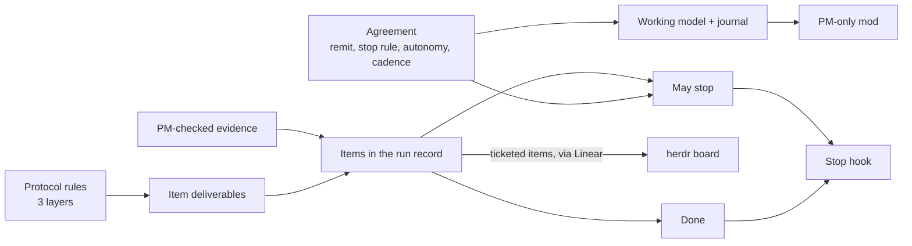
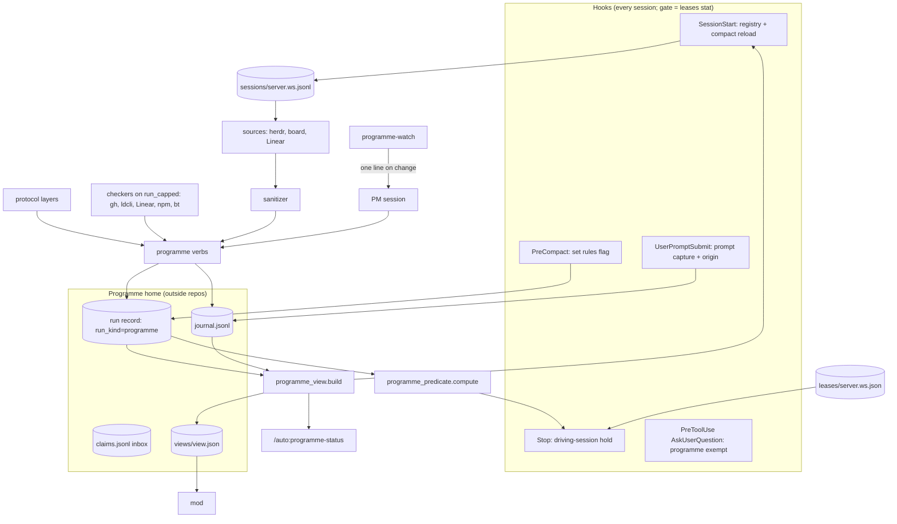
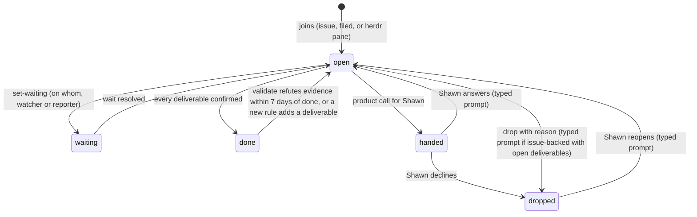
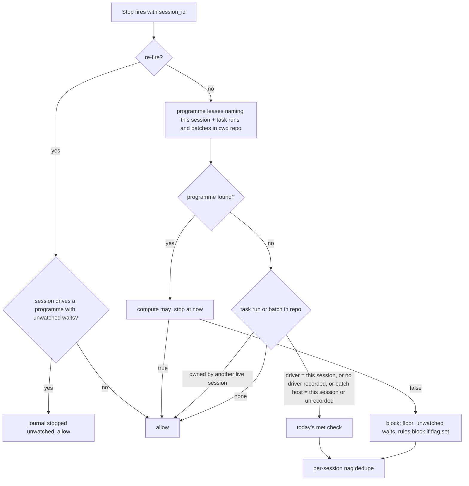
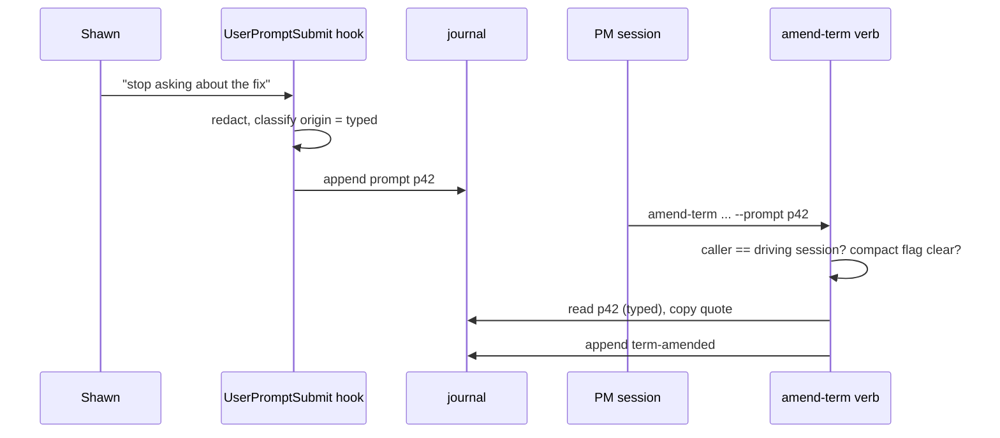
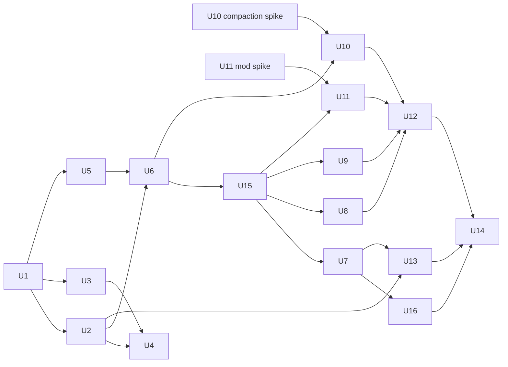

# Auto programme runs - Plan

## Goal Capsule

- **Objective:** A person running a PM agent in a herdr space knows exactly where every piece of work stands, can see the PM's plan, queue and the rules it is operating under at any moment, and can trust that "done" and "may stop" reflect checked evidence. They no longer re-ask settled questions, lose rules to compaction, or fight a goal that never closes.
- **Means:** auto gains a `programme` run kind (`/auto:programme`) beside its task runs. It shares and improves auto's run record, exit predicate and Stop hook, so both kinds of run benefit.
- **Product authority:** Shawn. This plan covers V1 of programme runs: programme state, done and may-stop, the agreement, the protocol, the working-model mod, and driving worker sessions through herdr. Recipe skills (merge, flag, release, eval gate, stage check, ticket, trace) and the decision-record format are later work, not active scope.
- **Open blockers:** none. The herdr board's store migration and the `/work` rework are in progress elsewhere. V1 reads them through an adapter with a direct herdr and Linear fallback (R31).
- **Execution profile:** plugin code in the shrimpshack repo (`plugins/auto`, plus one flag in `plugins/spinoff`). Python and bash, tested with auto's bash harness. Two spikes run first: the mod (U11) and the compaction hook (U10).
- **Stop conditions:** stop and ask Shawn if a spike shows a settled decision cannot work (for example, the mod cannot render a live per-session pane), or if a change would alter a task run's "done" (AE7).
- **Who finishes:** the implementing agent lands every unit and the Verification Contract. Shawn runs the live replay in a real herdr space (Definition of Done).

---

## Product Contract

### Summary

`/auto:programme` starts a PM agent that manages a **programme**: every item of work within a **remit** (by default, one herdr space). Each item carries deliverables chosen by **protocol** rules, and evidence the PM has checked itself. The run operates under an **agreement** settled at start and amended in plain chat. Code computes "done" and "may stop" from the run record. The PM starts and drives worker sessions through herdr. You see items on the herdr board, and the PM's working model in a Claude Code mod shown only for programme runs.

### Problem Frame

On 5–6 Oct 2026, a PM session ran the Slate reframe and shot-kinds work across about a dozen herdr panes. The work got done, but the harness around it failed in repeatable ways:
- The goal was a prose doc bound with native `/goal`. A stateless model judge reread it on every stop, its evidence lived in other systems and was lost to compaction, and its scope kept growing. It re-prompted "goal not met" for hours, and only `/goal clear` could end it.
- Shawn's mid-run instructions ("stop asking about the fix", "skip full eval", "merge #17 now") lived only in chat and were lost on compaction.
- The loop checked one tab, not the remit. Sessions in other tabs were checked only when asked.
- Watchers reported false greens. A wait with no watcher sat overnight.
- A forked session inherited the PM's name and received its messages.
- Shawn could not see the PM's plan, queue, waits or active rules anywhere. The herdr board shows Linear items, but the PM's working model does not fit a ticket.

### Actors

- A1. **Shawn**, the human owner. He sets the agreement, approves protocol rules, answers handed decisions, and watches the board and the mod.
- A2. **The PM agent**, the programme run's driving Claude Code session. It owns the programme state, writes evidence, and drives workers.
- A3. **Worker sessions**: Claude Code sessions in the remit, each working an item. Each may run its own auto task loop.
- A4. **External systems**: herdr, the herdr Linear board, Linear, GitHub, LaunchDarkly, the package registry and Braintrust, which supply evidence.

### Key Decisions

- **Evolve auto in place, with a `programme` run kind beside task runs.** Shared improvements land once and help both. Governs R1, R22–R24, R32. (session-settled: user-directed — chosen over forking auto or a separate `pm` plugin: "evolve and improve so the tide lifts both boats")
- **A PM manages a programme; auto manages a task.** A programme is a collection of items, of a different kind from a task's steps. Governs R1, R22. (session-settled: user-directed — chosen over "project": "a better level of abstraction")
- **The remit defaults to the herdr space.** A programme spans whatever Linear projects its items belong to. Governs R2, R3. (session-settled: user-directed — chosen over a per-goal scope)
- **Two views: items on the herdr board, the working model in a PM-only Claude Code mod.** Governs R27, R28. (session-settled: user-directed — the board tracks Linear, and "the agent's plan, to-do list, working model doesn't fit into a ticket")
- **Deliverables come from protocol rules, not per-item picks.** Governs R18, R20. (session-settled: user-directed — chosen over PM-picks or per-goal lists: "to prevent micromanaging")
- **The stop rule and other run behaviours are terms of an agreement.** Governs R13, R14, R23. (session-settled: user-directed — "a set of options that form part of the agreement")
- **Agreement terms are amended in plain chat, then recorded.** Governs R15. (session-settled: user-approved — chosen over a command-only or confirm-first flow)
- **Only the PM writes evidence, after checking a worker's claim.** Governs R8. (session-settled: user-approved — chosen over workers writing directly, or scripts only)
- **State lives in auto's run record, plus a light journal.** Governs R22–R26. (session-settled: user-approved — chosen over a separate PM file, or a journal as the source of truth)
- **V1 drives workers through herdr.** Governs R29–R31. (session-settled: user-directed — "PM has herdr so it can issue commands, start and drive. It must for V1")
- **State is in the PM's own record for now, not the board's database.** Governs R28, R31. (session-settled: user-directed — the board store work is in progress)

### Requirements

**Programme and remit**
- R1. `/auto:programme` starts a run of kind `programme`, alongside auto's existing task runs.
- R2. A programme's remit defaults to the herdr space it starts in. It can be narrowed or widened (for example to specific tabs, or extra spaces) as an agreement term.
- R3. Each remit has at most one live programme, enforced by a lease at the remit level. A second programme whose remit overlaps is refused unless the programme is handed over explicitly. A forked or restarted session never becomes the PM automatically.
- R4. At start, the PM reads the shape of the herdr space (tabs, panes, sessions, worktrees, the bound Linear project) and uses it to propose the remit, the items to adopt, and the agreement defaults.

**Items**
- R5. Every item has a namespaced identifier `source:key` within its programme, for example `linear:AI-753`, `gh:web-app#6495` or `herdr:w2/p26`. When a PR or session gains a ticket, the item takes the ticket's identifier and keeps the old one as an alias.
- R6. Every item has the same fields: identifier, title, state, owner pane, the Claude Code sessions that have worked it, deliverables with evidence, waiting-on, linked task runs, and history.
- R7. An item's state is one of: open, waiting (with who it waits on), done (every deliverable has evidence), handed (a decision sits with Shawn), or dropped (with a reason). Done, handed and dropped count as finished.
- R8. Only the PM writes evidence into a deliverable, and only after its own check confirms a worker's claim. A worker saying "done" never closes a deliverable. V1 ships one read-only evidence check per default deliverable: merged (merge SHA, head pinned, merge state CLEAN, no unresolved threads, a build that actually ran); flagged (the served value per environment, read back); verified (R9); released (the registry version and checksum match the tested build, plus an eval experiment or a named waiver); recorded (ticket state and a root-cause comment).
- R9. "Verified" requires runtime proof: a build that provably contains the fix, exercised at runtime, with the trace or job identifier posted on the ticket. Unit tests and CI never count.
- R10. A ticket in the remit joins as an item automatically when a session in the remit is working it or the PM filed it. A pane in the remit with no ticket becomes an item with a `herdr:` identifier. It counts toward "done" and "may stop" until the PM tickets it, merges it into another item, or drops it with a reason.
- R11. An item records every session that worked it (session identifier, herdr pane, name). The latest is the owner. A fork or restart never inherits ownership automatically; the PM confirms the handover and records it in the journal.
- R12. When Shawn answers a handed item, the item reopens with the deliverables his choice implies, or is dropped if he declined. It leaves the "decisions for you" list. When the PM hands an item, it notifies Shawn once, through the board's needs-you mark or a herdr notification when that is unavailable, and journals the notification.

**Agreement**
- R13. Every programme has an agreement with four built-in terms: remit, stop rule, autonomy, and cadence and budget. Each has options and a default.
- R14. Defaults:
  - **remit:** the herdr space;
  - **stop rule:** "nothing it can act on". The options are: nothing it can act on, only when done, until a set time, and never stop;
  - **autonomy:** per R19. This term wins over a protocol rule's own autonomy level, which is only that rule's default;
  - **cadence and budget:** wake on change with an hourly fallback; eval spend over $25 per day needs Shawn's OK; no quiet hours.
- R15. Shawn amends any term in plain chat. The PM records the change with when, why and his words quoted, and follows it from then on. An instruction that is not a term change (for example "skip full eval" or "merge #17 now") is recorded as an instruction: his words quoted, when, what it applies to (one item or the whole programme), and until when. It is journaled and stays in force until it is fulfilled or withdrawn.
- R16. New agreement terms use a required format: key, options, default, current value, and set-by / when / why.
- R17. The rules in force are the agreement terms, the adopted protocol rules, and the active instructions. They are reloaded into the PM's context at session start and after every compaction, not only displayed.

**Protocol**
- R18. The protocol is the set of rules that map a kind of change to its required deliverables and evidence bar. It loads in three layers: plugin defaults, Shawn's personal layer, and a project layer. A more specific layer may add rules and narrow an autonomy level, but never widen one; widening needs Shawn's explicit yes (R21). Otherwise the more specific layer wins on a conflict.
- R19. Every protocol rule uses a required format: id, applies-when, requires (deliverables), evidence bar, caveat, autonomy level, and added-by / when / why. Autonomy levels are act, act and tell, propose, and never. The default autonomy mapping is:
  - **act:** merges at the gate, prod-off flags, tickets;
  - **act and tell:** eval-backed prereleases, worker session approvals;
  - **propose:** prod deploys, full releases, eval waivers, spend over the cap, product calls;
  - **never:** fixing another team's code, merging around a gate.
- R20. The plugin ships these default deliverable rules:
  - code behind a flag → merged, flagged, verified, recorded;
  - code that only stops broken behaviour → merged, verified, recorded;
  - a shared-package change → adds released, with an eval experiment or a named waiver;
  - evals or docs only → merged, recorded;
  - a product question → handed;
  - a blocker held by another team, or shared by two or more items → the PM debugs it at runtime and records the trace or job identifier before those items count as waiting.

  Each rule's evidence bar is the R8 check for each deliverable, and its autonomy follows R19. An item that no rule matches cannot reach "done": the PM proposes a rule (R21) and the item waits on Shawn.
- R21. An agent may propose a new protocol rule in the required format. It takes effect only on Shawn's explicit yes.

**Done and may-stop**
- R22. Code computes a programme's "done" from its items: done when every item is done, handed or dropped. Reaching "done" does not end a programme: it is a standing PM for its remit, and the run ends only when Shawn ends it. Items that join after start are marked new in the mod, so scope growth stays visible. A task run's "done" keeps today's step rule.
- R23. Code computes "may stop" from the agreement's stop rule, with one check per option: **only when done** allows the stop only when the programme is done (R22); **until a set time** refuses it before that time and applies the default after; **never stop** always refuses it (re-fire still allows it, per R24). A chat change that fits none of the options is recorded as an instruction (R15), not a stop rule. Under the default (**nothing it can act on**), the PM may stop when it has no next action of its own and every unfinished item (not done, handed or dropped) is waiting on someone else. A waiting item with neither a live watcher nor a named person to report back blocks the stop, and shows as an "unwatched wait". A watcher counts as live only when the run record holds its process or task identifier and a heartbeat newer than the cadence term; a missing or stale heartbeat counts as no watcher. An item waiting on a blocker the PM has not yet debugged (R20) counts as a next action of the PM's own.
- R24. The Stop hook reads "done" and "may stop" from the run record for both kinds of run, keeps today's carve-outs (a manual pause, a stale chain, allow on re-fire, nag dedupe), and never relies on native `/goal`. For both kinds of run, the Stop hook holds only the run's driving session; other sessions in the same directory, forks included, are never held by another session's run. A task run armed before sessions were recorded (no driving session) keeps today's hold on every session in its directory. When a stop is allowed on re-fire while a wait is still unwatched, the hook journals it as "stopped unwatched", and the mod shows it as needing Shawn.

**Working model and journal**
- R25. A programme keeps a working model with seven parts: what it is doing now, its queue of next actions, what it is watching and why, who is waiting on whom, decisions waiting on Shawn, what it just did, and the rules in force.
- R26. A short append-only journal records the PM's actions and amendments: items joining, evidence checked, terms amended, rules adopted, decisions handed and answered, merges, and ownership changes. It feeds "just did" and the history of each rule.
- R27. A Claude Code mod shows the working model, live, only in a programme run's session. Shawn opens it with a command, so it shows at any pane width.
- R28. The PM uses herdr and the herdr board as any user would, with no programme-specific board changes. Ticketed items appear on the board as their Linear tickets do today. Each item's deliverables, evidence and owning pane show in the mod.

**Driving workers**
- R29. The PM starts worker sessions through the existing spinoff flow (worktree, brief, transcript link, herdr placement) and drives them with herdr prompts. A worker may run its own auto task loop; when it does, the item links that task run and the PM reads its progress. The PM addresses every herdr prompt by the item's recorded session identifier and pane, never by session name. A forked or restarted session gets its own name at start.
- R30. The PM sweeps the whole remit: every tab and pane, every item and its deliverables. It wakes on change, with the cadence term as a fallback.
- R31. The PM reads herdr, the board and Linear through one adapter. When the board's newer commands are unavailable, the adapter falls back to reading herdr and Linear directly.

**Shared improvements for task runs**
- R32. Evidence-checked deliverables and the journal are available to ordinary auto task runs too. The agreement, items, protocol, remit and the working-model mod stay programme-only. In a task run, the run's own driving session checks and writes evidence under the R8 rule; those deliverables are informational and do not change the task run's "done" (R22).

### Key Flows

- F1. Start a programme
  - **Trigger:** Shawn runs `/auto:programme` in a herdr space.
  - **Actors:** A1, A2, A3
  - **Steps:**
    1. The PM takes the remit lease and reads the space's shape.
    2. It shows the agreement on one screen: the four terms with proposed values, plus the protocol layers it loaded.
    3. Shawn accepts it, or changes terms in plain words.
    4. The PM adopts ticketed sessions as items, and unticketed panes as `herdr:` items.
    5. It offers the mod command and starts the sweep.
  - **Covered by:** R2–R4, R10, R13–R14, R27, R30
- F2. Close a deliverable
  - **Trigger:** A worker reports evidence, for example "merged, trace abc posted".
  - **Actors:** A2, A3, A4
  - **Steps:**
    1. The PM checks the claim against the source system.
    2. It writes the evidence, or records the claim as unconfirmed.
    3. It journals the action and recomputes "done".
  - **Covered by:** R8, R9, R22, R26
- F3. Amend the agreement mid-run
  - **Trigger:** Shawn says, for example, "stop asking about the fix".
  - **Actors:** A1, A2
  - **Steps:**
    1. The PM records the term change with his words quoted.
    2. The mod shows it under rules in force.
    3. It is reloaded after the next compaction.
  - **Covered by:** R15, R17, R25–R27
- F4. Stop or idle
  - **Trigger:** The PM finishes a sweep.
  - **Actors:** A2
  - **Steps:** The Stop hook reads "may stop". The PM stops only if every unfinished item waits on someone with a watcher or a named reporter, and it has no next action of its own.
  - **Covered by:** R23, R24

### Acceptance Examples

- AE1. Covers R23, R24. **Given** every item is done, handed, or waiting with a live watcher, **when** the PM tries to stop, **then** the Stop hook allows it on the first attempt, with no nag.
- AE2. Covers R23, R24. **Given** one item waits on another team with no watcher and no named reporter, **when** the PM tries to stop, **then** the first stop attempt is refused and the mod shows "unwatched wait" for that item; if the PM stops on the re-fire, the wait is journaled as "stopped unwatched" and shown as needing Shawn.
- AE3. Covers R15, R17. **Given** Shawn said "don't fix other teams' breaks" earlier, **when** the session compacts, **then** the PM still lists that rule in force and still follows it.
- AE4. Covers R8. **Given** a worker reports "merged", **when** the PM's check does not find the merge SHA at CLEAN with 0 open threads, **then** the deliverable stays open, and the claim is journaled as unconfirmed.
- AE5. Covers R3, R11, R24, R29. **Given** a session is forked from the PM, **when** the fork starts, **then** it is an ordinary session with its own name: it holds no lease, owns no items, receives none of the PM's messages, and its own stops are never held.
- AE6. Covers R21. **Given** a worker proposes a protocol rule, **when** Shawn has not yet said yes, **then** the rule is listed as proposed and does not affect any deliverable.
- AE7. Covers R22, R32. **Given** an ordinary auto task run, **when** its steps all finish with no gating findings, **then** it ends exactly as it does today.

### Success Criteria

- Replaying the 5–6 Oct reframe work, Shawn can answer "where is everything, what is the PM doing, and under which rules?" from the board and the mod alone, without asking the PM.
- The Stop hook never re-prompts on a programme whose items are all finished or watched waits.
- No rule Shawn stated in chat is lost to compaction.

### Scope Boundaries

**Deferred for later**
- Recipe skills that perform merges, flags, releases, eval gates, stage checks, tickets and traces, as protocol rules plus skills. V1 only checks their evidence (R8).
- The decision-record format (options, recommendation, answer mark) for handed items, beyond the handed state and its listing.

**Outside this work**
- Changing native `/goal`. Programme runs do not use it.
- Fixing or reworking `/work` and the herdr board store; that is in progress separately.
- Programme-specific changes to the herdr board. The PM uses it as any user would (R28).

**Deferred to follow-up work**
- Code enforcement of autonomy levels beyond ownership, approval and evidence: denying `gh pr merge` around a gate and prod flag toggles in the action backstop, for programme runs, without pausing the run.
- Enforcing the eval spend cap from a Braintrust spend read.
- Approving a handed item or a rule by a press in the mod, as a second channel beside chat.

<!-- ce-section: work-relationships -->
### How This Work Fits Together

This plan covers V1 of programme runs: state, done and may-stop, agreement, protocol, the mod, and driving workers. The breakdown below is the current understanding, not a committed roadmap.

- Recipe skills: **depend on** this plan's protocol rule format and autonomy levels.
- The decision-record format: **depends on** the handed state (R7, R12); **still to decide** its shape.

### Dependencies / Assumptions

- herdr's agent, pane, tab and `api snapshot` commands are available to the PM session.
- The spinoff flow remains the way to start a worker in a worktree.
- The herdr board's snapshot, marks and notify commands are the target interface. Until they land, R31's fallback is required.

### Sources / Research

- Design inputs: `plugins/auto/docs/research/2026-10-06-pm-harness-inputs.md`.
- auto's run record and predicate: `plugins/auto/lib/run_record_core.py`, `plugins/auto/lib/run_record_predicate.py`. Today's "done" also covers the plan phase (no open gaps) and pending iterations.
- The Stop hook and its carve-outs: `plugins/auto/lib/on-stop.py`.
- Verification criteria types: `plugins/auto/lib/verification.py`, `plugins/auto/lib/workflow_validate.py`.
- Goal docs bound with native `/goal`, which auto can't arm or clear: `plugins/auto/skills/auto-author-goal/SKILL.md`.
- "ledger" is a retired term guarded by `plugins/auto/tests/unit/vocabulary-audit.test.sh`, so the plan uses "item".
- compound-engineering 3.29.0: `ce-babysit-pr` (snapshot-only truth, watcher, decision records), `ce-sweep` (single-writer state, evidence-gated closing).
- herdr Linear board: the store migration design `docs/board-owns-the-store.md` and the snapshot schema in `crates/board-core/src/protocol.rs` (the herdr-linear-board repo).
- herdr's live state: `herdr api snapshot` returns workspaces, tabs, panes and agents with `pane_id`, `workspace_id`, `cwd`, `agent_status` and `state_change_seq`. It carries a pane's agent session as `agent_session` once a session reports it with `herdr pane report-agent-session` (KTD10).
- Claude Code hooks and mods: Stop input carries `session_id` and `stop_hook_active`; `/branch` and `--fork-session` create a new session id; a mod opens from a slash command, refreshes through `ui.invalidate`, and can watch a file; CronCreate jobs survive resume, while Monitor and ScheduleWakeup are per active session. The `compact` SessionStart source is not documented, hence the U10 spike.
- Reusable code: `lib/_bootstrap.py::session_membership`, `lib/on-pretooluse-askuser.py::_read_session_id`, `lib/verification.py::evaluate_programmatic`, `plugins/work/lib/herdr-read.sh`, `plugins/work/lib/repos.sh` (scope lock), `plugins/work/hooks/ground.sh` (context injection).
- Learnings applied: `docs/solutions/logic-errors/one-answer-recorded-under-two-keys-answers-for-scopes-nobody-asked-about.md` (lease keyed by space), `plugins/auto/docs/research/2026-07-21-stop-hook-blocks-on-rules-json.md` (sidecars read as runs), `plugins/auto/docs/research/native-goal-mechanism-spike.md` (warn on an active `/goal`), `docs/solutions/logic-errors/a-test-can-pass-because-it-cannot-fail.md` (mutation proofs).

---

## Planning Contract

**Product Contract preservation:** changed: R24 — task runs also hold only their driving session (Shawn's choice at planning, 2026-10-06). KTD6 reads a batch sidecar with no recorded host as R24's "no driving session" case. The "Deferred to Planning" questions are answered by KTD1–KTD18 below. The mod dependency moved to Risks.

**Vocabulary in code:** `tests/unit/vocabulary-audit.test.sh` rejects, case-insensitively, any word starting with orchestrator, emitter, adapter, tick, seam, unit, recipe or ledger. It scans `lib/`, `skills/`, `commands/`, `tests/`, `workflows/`, `presets/`, `.claude/hooks/`, `docs/` (except plans, brainstorms and research), `README.md`, `CONCEPTS.md` and `.claude-plugin/`. Code and docs therefore say "issue" where the Product Contract says "ticket", "source" where research said "adapter", and "action skills" for the deferred recipe skills.

### Key Technical Decisions

- KTD1. **Each programme has its own home outside every repo.** The home is `<data dir>/programmes/<run-id>/`. The data dir is fixed at `~/.claude/plugins/data/auto-shrimpshack`; one test-only override (`CLAUDE_AUTO_DATA_DIR`) exists. Hooks and verbs use the same resolver and never read `CLAUDE_PLUGIN_DATA`, because a dev install and a marketplace install get different values and would split the state. The home holds a `.claude/auto/` folder, so every run-record primitive (`_atomic_write`, `_with_locked_run_record`, `init_run_record`) works unchanged with the home as its `repo_root`. The resolver refuses a data dir under `~/.claude/shared`, `~/.claude/skills`, the memory dir or `~/.claude/auto/`. Folders are 0700 and files 0600.
- KTD2. **The remit lease is one file per herdr space.** `<data dir>/programmes/leases/<server>.<workspace-id>.json` names the run id, the home and the driving session. The herdr server name is part of the key, because one machine can run several herdr servers whose workspace ids collide (`plugins/work/lib/herdr-read.sh`). A lease is created under a flock, and only when none exists or the existing lease's run has ended. A widened remit adds one lease per extra space. A lease is orphaned when its run's driver beat is older than two cadence periods. A corrupt lease, or one that names a missing home, reads as orphaned. Only the human-typed takeover (U12) replaces an orphaned lease. A live lease moves only by a handover that Shawn types in the driving session, `/auto:programme-handover <session>`, which transfers the lease and the driving session (R3; Shawn's choice at review, 2026-10-06). A programme whose agreement stays unaccepted for one cadence period ends automatically: its run ends and its lease is released, so a later `/auto:programme` creates a new lease without takeover. `/auto-resume`'s automatic ownership transfer is never used for programmes (R3). Shape follows `plugins/work/lib/repos.sh` (`herdr_linear::_scope_lock`). Every id that becomes a path segment passes one strict check (`[A-Za-z0-9._-]`, no leading dot), and the resolved path must stay inside the data dir.
- KTD3. **A `run_kind` field selects the predicate.** An absent field means `task`, so existing records keep today's behaviour (AE7). `recompute_predicate` hands programme records to a new `programme_predicate.compute(record, now, inbox_size)`. That function returns `done`, `may_stop`, the list of reasons the stop is refused, and the unwatched waits. Programme records store these under a `programme_status` key and never write `met`, because `auto-status`, `auto-resume`, `watch_tree` and SessionStart surfacing read `met` as "task finished". `compute` reads only the record plus the inbox size: each item stores its matched rule and deliverables, and the record stores an inbox read offset.
- KTD4. **"May stop" is computed again at read time.** Watcher heartbeats age and "until a set time" passes with no write, so a stored value goes stale. The Stop hook and the read model call `compute` with `now`. The value stored by `_atomic_write` is a display copy only. The Stop hook path never calls herdr or the network.
- KTD5. **Code builds a floor of next actions the PM cannot clear.** "No next action of its own" (R23) is the PM's queue plus a floor that code computes from `open` items only:
  - an open item with no owner pane and no queued worker start;
  - an open item waiting on a blocker with no recorded trace or job id (R20);
  - an open item that no rule matches and for which no rule is proposed. Once a rule is proposed, the item waits on Shawn as its named reporter (R20);
  - unread worker claims;
  - a source (herdr, board, Linear) unavailable for less than two cadence periods.

  After two periods, an outage becomes a programme-level wait on that system, with a retry watcher. A failed read never reads as "no items".
- KTD6. **One ownership test: the driving session.** The Stop hold, evidence writes and approval verbs compare the caller's `session_id` (hook input) or `CLAUDE_CODE_SESSION_ID` (verbs, as `driver_session.driving_session_id()` already reads) with `driving_session_id`. `agent_session_ids` never counts here, because any session can join it through `register-session`. Takeover is the only writer of `driving_session_id` on a programme. Two existing task-run holds are kept explicitly:
  - a task run with no driving session holds every session in its repo, as today. A batch sidecar without `host_session_id` is the same case (R24's "no driving session") and keeps today's repo-wide hold;
  - a batch sidecar gains `host_session_id` at commit, and the sidecar walk holds only that session.

  A run resumed from another session needs no special hold: `/auto-resume` already re-records `driving_session_id` to the resuming session.
- KTD7. **Approvals cite a typed prompt, and other Claude sessions cannot type into the PM's pane.** A `UserPromptSubmit` hook journals each prompt in a programme's driving session with an id and an origin: `cron` when the text matches a cron prompt the PM armed, otherwise `typed`. The hook returns the id and origin to the PM as `additionalContext` in auto's own data tag, so the PM can cite it. Approval verbs accept only `typed` prompts and copy the quote from the journal, not from their own argument:
  - accept the agreement;
  - amend a term;
  - record or withdraw an instruction;
  - adopt a rule;
  - answer a handed item;
  - drop an issue-backed item with open deliverables, or reopen a dropped item.

  Sends from other Claude sessions are stopped at the source. auto's `Bash|Write` PreToolUse hook gains the KTD15 leases gate. In every session, it denies a `herdr agent prompt`, `agent send`, `pane send-text` or `pane send-keys` call, or the equivalent `herdr api` call, whose target is a pane a lease names as a driver's pane, and journals `blocked_driver_send` in that programme's home. In any session, a prompt that starts `/auto:programme-takeover`, `/auto:programme-handover` or `/auto:programme-end` is journaled as a request into the home of the lease for that session's space. Takeover is accepted only on an orphaned lease. Handover is accepted only from a typed request in the driving session. End is accepted only from a typed request in the driving session, or on an orphaned lease. The proof covers "these words entered the PM's input and no Claude session sent them"; Assumptions states the limit.
- KTD8. **Evidence comes only from the checker the verb runs.** `check-deliverable` runs the checker for the deliverable and stores `confirmed`, `refuted` or `unknown` with parsed fields. No verb accepts "confirmed" as an argument. The checkers run on a new `verification.run_capped(argv, cwd, timeout, env)`, extracted from `evaluate_programmatic`. That function returns `ran`, the exit code, stdout, stderr and a truncation flag, and `evaluate_programmatic` keeps its behaviour on top of it. Mapping:
  - did not run, timed out, truncated, or failed to parse → `unknown`;
  - parsed effect meets the bar → `confirmed`;
  - parsed effect misses the bar → `refuted`.

  `unknown` keeps the deliverable open and journals the claim as unconfirmed (AE4). Credentials are read from `~/.secrets` in Python, and only the one needed key passes to the child, through its environment. Children get a minimal environment. Raw output is scrubbed of token patterns before any is kept. The merged check reads GitHub's own record, so it works when a worker merged. It requires:
  - the PR is merged, with a merge commit;
  - at least one required check completed successfully on the merged head, and none was cancelled or skipped;
  - 0 unresolved review threads.

  That is how the "merge state CLEAN" bar (R8, AE4) is read after a merge. When the PM merged, its journaled pin is compared as well. The released check compares against a tested-build shasum that the `record-tested-build` verb journals.
- KTD9. **Protocol layers are JSON files read fail-closed.** Three layers:
  - plugin: `plugins/auto/protocol/defaults.json`;
  - personal: `~/.claude/shared/auto/protocol.json`, which Syncthing already syncs between Shawn's machines;
  - project: `<repo>/.claude/auto-protocol.json`, committed with the repo.

  The project layer for an item is read from its repo's default branch as committed, through the fetched remote ref, never from a worker's working tree. A missing field, an unknown key, an unknown deliverable or an unknown autonomy level rejects that rule and reports it. Besides rules, a layer may carry a `checks` block, keyed by repo in the personal layer, with argv templates for `verified.lookup` and `verified.deployed_sha`. It is validated fail-closed, beside the rules. A command loads only when `adopt-rule` on this machine recorded its hash, so a worker cannot supply the command that checks its own claim.

  A personal or project rule or command loads only with an adoption record: machine, run id, prompt id, a redacted quote and a hash. `adopt-rule` writes that record and the file atomically (temp file and rename). For a record that names this machine, the loader checks that the prompt exists in that run's journal with origin `typed` and that the hash matches; a mismatch rejects it as `adoption_unverified`. A record from another machine loads, and status and the mod show it as "adopted on <machine>". The loader ignores `*.sync-conflict-*` files and reports that they exist. An autonomy level wider than the less specific layer's loads only when its adoption record marks a widening (R18).
- KTD10. **Every interactive Claude session records its pane.** auto's SessionStart shim calls `lib/session_registry.py` before its presence gate. That script resolves the pane, workspace and server with one bounded `herdr pane get`, because a moved pane keeps a stale `HERDR_PANE_ID`. For interactive sessions it also reports the session to herdr with `herdr pane report-agent-session --source auto --agent claude --agent-session-id <id>`, so herdr's snapshot carries the owner as `agent_session` and keeps it current when the pane moves. It writes what herdr does not store (start source, cwd, interactive or headless) to `<data dir>/sessions/<server>.<workspace-id>.jsonl`. The shim exits before Python when `HERDR_PANE_ID` is unset. Headless `claude -p` children are marked and never count as a pane's owner. The file keeps the last 50 lines per pane. The source layer reads a pane's owner from the snapshot's `agent_session` first; registry lines are hints checked against the live snapshot. spinoff gains `--session-id`, so the PM mints a worker's id before launch. `prompt-item` resolves the item's pane, checks that an agent is live in it right before sending, and refuses when the pane's reported owner names a different session than the item's owner (AE5). A pane with no entry is "session unknown"; it may be prompted by pane and shows that state in the mod.
- KTD11. **The PM is woken by a watcher that costs no model tokens, plus a cron fallback.** `programme-watch` polls cheap signals and prints one line when anything changes, which wakes the PM through Monitor:
  - herdr's `api snapshot` (pane set, `state_change_seq`);
  - the claims inbox size;
  - the remit's Linear issues (`updatedAt` high-water mark);
  - waits that are due.

  The PM re-arms it each sweep; a second watcher for the same programme sees the recorded watcher id and exits. An item mode, `programme-watch --item <id> -- <argv>`, runs a watch command (for example `gh run watch`) and beats that item's watcher each interval until the command exits. The sweep skill uses it for every PM-side wait, so "watched" always means a live heartbeat. A recurring CronCreate prompt at the cadence term (default hourly) is the fallback and survives resume. Under "never stop" the PM keeps both armed. Re-fire still lets a stop through (R24).
- KTD12. **Rules in force are rebuilt from the record, never recalled from memory.**
  - **Primary:** SessionStart with source `compact` emits `additionalContext` built by the read model. The U10 spike confirms the source first.
  - **Always:** a `PreCompact` hook sets a flag in the home. While the flag is set, the PM's write verbs and `prompt-item` refuse and print the rules-in-force block, until the PM runs `programme rules --ack`. `claim` (from workers) and `watcher-beat` (from watchers) are exempt. This covers the rest of a turn that auto-compacted.

  The block is built only from fields that verbs wrote. It uses a distinct tag from work's `<work-context>`, and is framed as data.
- KTD13. **One read model feeds three surfaces.** `programme_view.build(record, journal, now)` produces the seven-part working model plus items with deliverables. The mod, `/auto:programme-status` and the compaction text all render from it. Every programme write refreshes `views/view.json` in the home. If the U11 spike shows a mod cannot render a live per-session pane, the status command is the V1 surface and the mod moves to Deferred (stop condition).
- KTD14. **Programme files stay out of the run sweeps.** The journal is `journal.jsonl` and the inbox is `claims.jsonl`. Leases, sessions and views sit in subfolders. No non-run file carries `run_id`, `loop` or `loop_phase`. Per-session nag files use a dot prefix. The `programme` block and any task-run evidence block are added to `format_compat._OPAQUE_KEY_CONTAINERS`, because item ids and term names are runtime-chosen keys. Records and leases carry a `programme_format` stamp. A reader that finds a newer stamp holds nothing and reports "programme written by a newer auto".
- KTD15. **Hooks find programme runs through one shared gate.** `programme_home.leases_for_session(session_id)` runs before the cwd walk in the Stop, UserPromptSubmit, SessionStart (compact), PreCompact and PreToolUse action hooks. In bash, the gate is one `stat` of the leases folder; when it is empty, no Python runs.
- KTD16. **All outside text goes through one sanitizer.** That covers pane output, Linear and GitHub text, claim payloads and registry names. The sanitizer:
  - strips control and escape sequences;
  - caps the length;
  - wraps the result as data before it reaches the PM's context, a journal quote, the mod or a herdr prompt.

  Worker claims are structured: item, deliverable, and a reference. Free text is never stored as a claim.
- KTD17. **Prompt capture redacts before the first write and keeps only what is cited.** Before journaling, token patterns and any value found in `~/.secrets` are replaced with `[redacted]`. Captured prompts that no journal entry cites are pruned after 7 days.
- KTD18. **The programme verbs reuse the run-record CLI machinery.** `lib/programme.py` imports `run_record.py`'s `_Verb` and `_cli` dispatch rather than copying them. The agent-tool-surface fence test is extended to enumerate `programme.py describe`, with its own anti-vacuity floor.

### High-Level Technical Design

Components and data flow:

Item states (R7, R12, with reopen):

A lost or stale watcher keeps the item waiting and marks it an unwatched wait (R23).

Stop hook decision for one stopping session:

Approval write (KTD7):

### System-Wide Impact

- **Every Claude session on the machine:**
  - SessionStart runs the registry write when `HERDR_PANE_ID` is set; the shim exits in bash otherwise.
  - UserPromptSubmit is a new auto hook on every prompt; it is one `stat` when no lease exists.
  - Stop gains the leases gate.

  All three exit 0 on any error, emit nothing on failure, and set a `timeout` in `hooks.json`. Other plugins already run on the same events (claude-modes on UserPromptSubmit, reflect on PreCompact, work's `ground.sh` on SessionStart). auto depends on none of them and uses its own context tag.
- **Task runs:** which sessions a task run holds changes (R24, KTD6). Nag state moves to per-session dot files. Batch sidecars gain `host_session_id`. Task-run evidence (U13) lives in `.claude/auto/journal/` and an opaque record block, and never reaches `recompute_predicate`.
- **Spinoff plugin:** `--session-id` is a new flag on a script other skills call. Behaviour without the flag is unchanged. spinoff gets its own version bump.
- **Synced directories:** only the personal protocol layer is synced. Leases, the registry, journals and homes must never sit under `~/.claude/shared`, `~/.claude/skills` or the memory dir (KTD1 enforces this). An older auto on another machine rejects newer rule fields fail-closed, and status shows the rejection.
- **Mixed plugin versions:** hooks run from the installed plugin, and verbs from the command's plugin root. The `programme_format` stamp (KTD14) makes an older reader hold nothing rather than misread.
- **Unchanged invariants:**
  - every hook exits 0;
  - a malformed home never blocks a stop;
  - native `/goal` is untouched;
  - a task run with no `run_kind` computes `met` exactly as today (AE7).

### Assumptions

- **Resume vs restart:** `claude --resume` of the PM session keeps its session id, so it continues without takeover. A new session needs takeover.
- **Unknown evidence:** after two consecutive `unknown` checks, the item becomes waiting on that external system, with a retry watcher, so a down system cannot pin the PM awake.
- **Alias merge:** when a `herdr:` item gains an issue that is already an item, the issue item survives. Evidence and sessions are combined, the latest owner wins, and the merge is journaled.
- **Adoption filter:** shells with no agent, the PM's own pane and the board's pane never become items.
- **Pane id reuse:** herdr may reuse a pane id after the pane closes. An item records the pane's terminal id, and a pane whose terminal id changed is "session unknown", never the owner.
- **Autonomy and spend:** in V1 the PM follows autonomy levels and the spend cap on trust. Code enforces only the ownership, approval and evidence rules above.
- **Tamper limits:** the driver-pane guard and approval binding stop accidents and casual misuse. They do not stop a determined process running as the same user: it can still forge journal rows, or type into the pane by means the guard can't see: a pane id built at run time (shell variables such as `${P}p1` or `$HERDR_PANE_ID`, command substitution such as `$(cat file)`, brace expansion), the short pane id behind an indirect herdr call, a script file or another language, an agent addressed by its name, and a raw shell outside Claude Code. Any session with Bash can also edit the run record or a protocol file directly. The journal, adoption checks and the validate pass make such edits visible; they do not prevent them. An adoption synced from another machine may narrow autonomy but never widen it.

### Sequencing and Parallelism

- **First, with no dependencies:** the U10 compaction spike and the U11 mod spike. They run before U1, so a stop condition fires before build work it could change.
- **Parallel-safe:**
  - U2, U3 and U5 after U1;
  - U7, U8, U9 and the U11 build after U15;
  - U10's build after U6 and its spike;
  - U16 after U7.
- **Sequential:** U4 after U2 and U3; U6 after U2 and U5; U15 after U6. U12 integrates everything. U14 is last.
- **Shared files:**
  - `.claude/hooks/hooks.json` and `lib/on-pretooluse-action.py`: U2 and U10;
  - `docs/contracts/agent-tool-surface.md`: U6 and U15;
  - `docs/contracts/run-record-schema.md`: U6 and U14;
  - `lib/on-stop.py`: U4 only;
  - `lib/verification.py`: U7 only.

  Run units that share a file in sequence, or merge with care.

---

## Implementation Units

| U-ID | Title | Key files | Depends on |
|---|---|---|---|
| U1 | Programme home, lease and run kind | `lib/programme_home.py`, `lib/run_record_core.py` | — |
| U2 | Journal, prompt capture, session registry | `lib/programme_journal.py`, `lib/on-user-prompt.py`, `lib/session_registry.py` | U1 |
| U3 | Programme predicate | `lib/programme_predicate.py` | U1 |
| U4 | Session-scoped Stop hook | `lib/on-stop.py`, `.claude/hooks/on-stop.sh` | U2, U3 |
| U5 | Protocol layers | `lib/programme_protocol.py`, `protocol/defaults.json` | U1 |
| U6 | Programme CLI and approval verbs | `lib/programme.py` | U2, U5 |
| U15 | Item, wait, inbox and working-model verbs | `lib/programme_record.py` | U6 |
| U7 | Evidence runner, merged and recorded checks, validate pass | `lib/programme_evidence.py`, `lib/verification.py` | U15 |
| U16 | Flagged, verified and released checks | `lib/programme_evidence.py` | U7 |
| U8 | herdr sources and worker driving | `lib/programme_sources.py`, spinoff `--session-id` | U15 |
| U9 | Wake watcher and cadence fallback | `lib/programme-watch.py` | U15 |
| U10 | Rules-in-force reload after compaction | `lib/on-session-start.py`, `lib/on-pre-compact.py` | U6; spike first, no dependencies |
| U11 | Read model, status command, mod | `lib/programme_view.py`, mod | U15; spike first, no dependencies |
| U12 | Commands and the sweep skill | `commands/programme*.md`, `skills/programme-sweep/` | U8–U11 |
| U13 | Journal and evidence for task runs | `lib/run_record_evidence.py` | U2, U7 |
| U14 | Contracts, vocabulary and README | `docs/contracts/*`, `CONCEPTS.md` | U12, U13, U16 |

All paths below are under `plugins/auto/` unless they start with `plugins/`. Every unit that adds a `lib/*.py` declares its import-topology edges and an existence assert in `tests/unit/import-topology.test.sh`. New modules read the loop phase through `phase-grammar.current_phase`, never by the `"loop_phase"` literal. They also never use the bare `"decision"` literal (`tests/unit/iteration-ast-lint.test.sh`). Every programme test sets `CLAUDE_AUTO_DATA_DIR` and the personal-layer override to temp dirs, because `tests/run.sh` fails any run that changes `$HOME`.

### U1. Programme home, lease and run kind

- **Goal:** A programme run can be created with its own home and a remit lease, and existing task runs are untouched.
- **Requirements:** R1, R2, R3; KTD1, KTD2, KTD3, KTD14.
- **Dependencies:** none.
- **Files:**
  - create `lib/programme_home.py`;
  - modify `lib/run_record_core.py` (accept `run_kind`), `lib/run_record_mutators.py` (`set_loop` allows a programme driver; a small change, as the file is at 916 of its 1000-line budget), `lib/format_compat.py` (opaque blocks), `lib/_bootstrap.py` (iterate programme homes);
  - test `tests/unit/programme-home.test.sh`, `tests/unit/format-compat.test.sh`.
- **Approach:**
  1. `programme_home` holds the single data-dir resolver, the path-segment check, and lease create, read and orphan detection under a flock.
  2. `init_run_record` accepts `run_kind="programme"` with an empty steps list, `loop_phase="work"` and `driver="self"`, and stamps `programme_format`. Its existing checks stay as they are for task runs.
  3. Define the record shape for items (id, title, state, owner pane and terminal id, sessions, matched rule, deliverables with evidence, waiting-on, linked task runs with repo path and run id), the agreement, instructions, the working model, watchers and the inbox offset. U3 and U15 build on this shape.
  4. Add `leases_for_session(session_id)` and an iterator over programme homes, beside `iter_worktree_run_records`.
- **Patterns to follow:** `herdr_linear::_scope_lock` (`plugins/work/lib/repos.sh`); `init_run_record`'s flock-guarded check-then-create.
- **Test scenarios:**
  - Create a programme for `default.w2`: the lease names the run, home and session, and the record has `run_kind: programme` and a `programme_format`.
  - Two concurrent creates for `default.w2`: exactly one wins.
  - A second create for `default.w2` while the first run beats is refused, naming the holder.
  - A create after the first run's beat is older than two cadence periods reports "orphaned, takeover needed" and still refuses.
  - A corrupt lease file, or one naming a missing home: reads as orphaned, no crash.
  - Server `s2` with workspace `w2` does not collide with `default.w2`.
  - A widened remit `w2+w5` writes two leases; a create for `w5` alone is refused.
  - A workspace id of `../x`: refused by the path check.
  - With `CLAUDE_AUTO_DATA_DIR` pointing under `~/.claude/shared`: the resolver refuses.
  - A home holding only `journal.jsonl`, `claims.jsonl` and `views/`, next to a `programmes/leases/` folder, yields zero task runs from `iter_worktree_run_records`, and the programme-home iterator skips `leases`.
  - A programme whose agreement stays unaccepted for one cadence period: its run ends and its lease is released, and a new create succeeds without takeover.
  - A record with no `run_kind` reads as `task` and recomputes exactly as before (AE7 baseline).
  - Item keys `linear:AI-753` and `herdr:w2/p26`, and a term named `units`, survive `upgrade_run_record` unchanged.
- **Verification:** programme records can be created and refused per space, and all existing run-record tests stay green.

### U2. Journal, prompt capture and session registry

- **Goal:** The programme has an append-only journal holding Shawn's real prompts, redacted and classified, and every interactive session records its pane.
- **Requirements:** R11, R15, R26, R29; KTD6, KTD7, KTD10, KTD15, KTD17.
- **Dependencies:** U1.
- **Files:**
  - create `lib/programme_journal.py`, `lib/on-user-prompt.py`, `.claude/hooks/on-user-prompt.sh` and `lib/session_registry.py`;
  - modify `.claude/hooks/on-session-start.sh` (call the registry before the presence gate), `.claude/hooks/hooks.json` (`UserPromptSubmit`, with a timeout), and `lib/on-pretooluse-action.py` with `.claude/hooks/on-pretooluse-action.sh` (leases gate; deny herdr sends to driver panes, KTD7);
  - test `tests/unit/programme-journal.test.sh`, `tests/integration/programme-hooks.test.sh`.
- **Approach:**
  1. Journal entries are JSON lines with `kind`, `at`, `session_id` and a payload. Appends hold a flock, and kinds are whitelisted, as in `append_advisor_audit`.
  2. The prompt shim gates on the leases stat (KTD15). The Python side:
     - finds the programme this session drives;
     - redacts the prompt (KTD17) and classifies its origin (KTD7);
     - appends it, and returns the id and origin as `additionalContext`.

     A takeover or end request is journaled into the home of the lease for the caller's space, from any session.
  3. `session_registry.py` resolves pane, workspace and server with a bounded `herdr pane get`. For interactive sessions it calls `herdr pane report-agent-session`. It marks headless sessions and trims each pane to its last 50 lines.
  4. The action hook denies herdr sends whose target is a driver's pane, in every session, and journals `blocked_driver_send`.
  5. Add a caller-identity helper that compares `CLAUDE_CODE_SESSION_ID` with the run's driving session. U6 uses it.
  6. Add a pruning step for uncited prompts older than 7 days, run at sweep start.
- **Patterns to follow:** `run_record_mutators.append_advisor_audit`; the shims in `.claude/hooks/`; `plugins/work/hooks/ground.sh` for stdin parsing; `herdr_linear::_resolve_position` in `plugins/work/lib/herdr-read.sh`.
- **Test scenarios:**
  - A prompt in the driving session is appended with a new id and origin `typed`.
  - The same prompt in another session in the same cwd appends nothing.
  - A prompt containing a value from a fixture secrets file is journaled with `[redacted]` in its place.
  - The hook's `additionalContext` names the same id and origin that it journaled.
  - A worker session runs `herdr agent prompt <pm-pane> "adopt rule"`: the action hook denies it and journals `blocked_driver_send`. The same command to a worker pane is allowed.
  - An interactive SessionStart reports the session to herdr; a headless one does not.
  - A prompt matching the armed cron prompt is classified `cron`.
  - `/auto:programme-takeover` typed in a new session in space `w2`: journaled as a takeover request in w2's programme home.
  - Two concurrent appends both land as whole lines.
  - An unknown journal kind is refused.
  - A machine with no leases: the prompt shim runs no Python.
  - The data dir is missing, unreadable, or a file: the hook exits 0 with no output, within its timeout.
  - SessionStart in a pane whose env says `p26` while `pane get` says `p31`: the registry records `p31`.
  - A headless `claude -p` child in a worker pane: its line is marked headless.
  - With no herdr env: nothing is written and the shim exits in bash.
  - The caller helper returns false for a session that is only in `agent_session_ids`.
  - The journal file is created 0600 in a 0700 folder.
- **Verification:** prompt capture and the registry work in a real session (U12 replay), and the hooks never fail or delay a session.

### U3. Programme predicate

- **Goal:** Code computes "done" and "may stop" for a programme from its record at a given time.
- **Requirements:** R7, R10, R20, R22, R23; KTD3, KTD4, KTD5.
- **Dependencies:** U1.
- **Files:**
  - create `lib/programme_predicate.py`;
  - modify `lib/run_record_predicate.py` (dispatch on `run_kind`; a lazy edge, declared in the import topology);
  - test `tests/unit/programme-predicate.test.sh`.
- **Approach:**
  1. Write `compute(record, now, inbox_size)` as a pure function that loads only `run_record_core` and `phase-grammar`. Done: every item is done, handed or dropped.
  2. For each stop-rule option, compute `may_stop` per R23. Under the default, use the KTD5 floor, the PM's queue, waits and watcher liveness (heartbeat age compared with the cadence term).
  3. Return the refusal reasons as typed entries, for example `unwatched_wait`, `undebugged_blocker`, `no_rule_proposed`, `unread_claim` and `source_unavailable`, so the Stop hook and the mod can render them.
  4. Add a `CLAUDE_AUTO_TEST_NO_*` switch per conjunct, so a mutation test can prove each conjunct is able to fail.
- **Execution note:** write this test-first. Each conjunct gets a failing case before code.
- **Patterns to follow:** `run_record_predicate._evaluate_met` and its staleness switch `CLAUDE_AUTO_TEST_NO_STALENESS_CHECK`.
- **Test scenarios:**
  - Covers AE1. Items done, handed, or waiting with a heartbeat younger than the cadence: may stop is true, with no reasons.
  - Covers AE2. One item waits on another team with no watcher and no reporter: may stop is false, with `unwatched_wait` for that item.
  - A waiting item whose watcher heartbeat is 61 minutes old under an hourly cadence: `unwatched_wait`.
  - A waiting item whose worker pane closed, with a live watcher: may stop is true.
  - An open item waiting on a blocker with no recorded trace id: `undebugged_blocker`.
  - An open item no rule matches and no rule proposed: `no_rule_proposed`, and done stays false.
  - The same item after a rule is proposed (waiting on Shawn): may stop is true.
  - Inbox size above the read offset: `unread_claim`.
  - A source unavailable for 20 minutes: `source_unavailable`. Unavailable for 3 hours: may stop is true, and the waits list carries the system.
  - "Only when done" with one open item: false. With all items finished: true.
  - "Until a set time" of 18:00: false at 17:59 with no other blockers; at 18:01 it falls back to the default.
  - "Never stop": always false.
  - A `herdr:` item still open: done is false.
  - Done is true while a new item joins: done becomes false, and the item is marked new.
  - A record with no `run_kind` returns the old predicate unchanged, and a programme record carries no `met`.
  - Each `CLAUDE_AUTO_TEST_NO_*` switch flips its conjunct, and the run's tally shows the tests ran.
- **Verification:** every R23 option and every floor entry has a passing test and a mutation that turns it red.

### U4. Session-scoped Stop hook

- **Goal:** A stop is held only for the session that owns the run, for both kinds of run, without losing any hold that exists today.
- **Requirements:** R24, AE5, AE7; KTD4, KTD6, KTD15.
- **Dependencies:** U2, U3.
- **Files:**
  - modify `lib/on-stop.py`, `.claude/hooks/on-stop.sh` (leases gate before the cwd walk), `lib/on-pretooluse-askuser.py` (programme runs exempt), `lib/auto-spawn.py` (write `host_session_id` on batch commit), `docs/contracts/batch-sidecar-schema.md`;
  - test `tests/unit/stop-session-scope.test.sh`, `tests/unit/stop-nag-dedup.test.sh`, `tests/unit/batch-stop-discovery.test.sh`, `tests/integration/hooks.test.sh`.
- **Approach:**
  1. `decide` reads `session_id` from stdin. It finds programme leases naming the session, then task runs and batch sidecars in the cwd repo, and applies the KTD6 ownership rules.
  2. For a programme, it calls `compute` at `now`. If the compact flag is set, the block reason includes the rules-in-force block.
  3. Nag dedupe state becomes per session, in dot files.
  4. On re-fire, when the session drives a programme with unwatched waits, it journals `stopped_unwatched` (wrapped in try) and allows the stop.
  5. Programme runs are exempt from the AskUserQuestion redirect; autonomy (R19) governs questions instead.
- **Patterns to follow:** `on-pretooluse-askuser._read_session_id` and `_bootstrap.session_membership`; the existing `_reason_for`, `_terse_reason_for` and `_nag_signature`.
- **Test scenarios:**
  - Covers AE5. A fork, with a new session id and the same cwd, stops while the PM's programme has an unwatched wait: allowed, no nag.
  - A fork that ran `register-session` stops: still allowed.
  - A task run's driving session stops with steps open: blocked as today.
  - Another session in the same repo stops during that live task run: allowed.
  - A legacy task run with no driving session: any session in the repo is blocked, as today.
  - After `/auto-resume continue` from session B, B is held and the original session A is not.
  - A batch with `host_session_id` and an unmet sub-run owned by a child session: the host is blocked, another session is not.
  - A batch sidecar without `host_session_id`: today's repo-wide hold.
  - Covers AE1. The PM stops with all waits watched: allowed on the first attempt, no nag.
  - Covers AE2. The PM stops with an unwatched wait: blocked. On re-fire it is allowed, and the journal gains `stopped_unwatched`.
  - Two sessions blocked by different runs keep separate nag alternation.
  - A malformed home, or one with a newer `programme_format`: never blocks.
  - The PM calls AskUserQuestion during a live programme: not redirected. A task run's driver is still redirected.
  - The compact flag set in a fixture home, with a stub rules block: the block reason contains the stub.
- **Verification:** the hook suite is green, including the fork, register-session, batch and resumed-run cases. The end-to-end and cross-session cases run in U12, where every verb and hook exists.

### U5. Protocol layers

- **Goal:** The PM loads protocol rules from three layers, fail-closed, and matches each item to its deliverables.
- **Requirements:** R18, R19, R20, R21, AE6; KTD9.
- **Dependencies:** U1.
- **Files:**
  - create `lib/programme_protocol.py` and `protocol/defaults.json`;
  - create `docs/contracts/programme-protocol-format.md`;
  - test `tests/unit/programme-protocol.test.sh`.
- **Approach:**
  1. The loader reads the plugin layer, then the personal layer (path overridable for tests), then the project layer for the item's repo.
  2. It validates each rule against the R19 format and puts invalid or unadopted rules in a `rejected` list with a reason.
  3. It applies R18 narrowing: a wider autonomy level loads only when its adoption record marks a widening.
  4. Matching maps an item's change kind to a rule id and deliverables. The verbs store the result on the item (KTD3). No match produces "no matching rule".
  5. Proposed rules are stored in the programme record, never in a layer file, until adopted.
  6. The defaults file holds the six R20 rules, including the shared-blocker rule, and the R19 autonomy mapping.
- **Execution note:** write the parser test-first, starting with malformed and unknown-value inputs.
- **Patterns to follow:** `lib/workflow_validate.py` (fail-closed validation with reasons); `docs/solutions/best-practices/default-deny-for-an-unattended-agent.md`.
- **Test scenarios:**
  - The default layer alone: code behind a flag maps to merged, flagged, verified and recorded.
  - A personal rule with a well-formed adoption record adds a deliverable to docs-only changes.
  - A personal rule with no adoption record: rejected, reason `not_adopted`.
  - A project rule that widens "fixing another team's code" from never to act with no widening mark: rejected (R18). The same rule with a widening adoption record: loaded.
  - An unknown autonomy level `sometimes`: rejected. An unknown deliverable `shipped`: rejected.
  - A missing personal file: loads the plugin and project layers, with no error.
  - An unparseable project file: that layer is rejected; the others load.
  - A `protocol.sync-conflict-20261006.json` beside the personal file: ignored and reported.
  - Covers AE6. A proposed rule exists in the record: no item's deliverables change.
  - An item kind no rule matches: "no matching rule".
  - The personal-layer override is used; the real `~/.claude/shared` is untouched.
  - A valid `checks` block for a repo loads; an unknown command key rejects the block.
  - A worker edits `.claude/auto-protocol.json` in its worktree: the loader still reads the default branch's committed copy.
  - A `checks` command with no local adoption hash is not loaded.
  - A same-machine adoption record citing a prompt that is missing, not `typed`, or hash-mismatched: rejected as `adoption_unverified`. A record from another machine loads, marked with its machine.
- **Verification:** every R19 field is enforced, and every rejection names its reason.

### U6. Programme CLI and approval verbs

- **Goal:** The PM changes the agreement, instructions and rules only through verbs that check the caller, cite a typed prompt and journal.
- **Requirements:** R13–R17, R21; KTD6, KTD7, KTD12, KTD18.
- **Dependencies:** U2, U5.
- **Files:**
  - create `lib/programme.py` and `lib/programme.sh`;
  - modify `docs/contracts/agent-tool-surface.md`, `docs/contracts/run-record-schema.md`, `tests/unit/doc-fence-agent-tool-surface.test.sh` (enumerate `programme.py describe`);
  - test `tests/unit/programme-verbs.test.sh`.
- **Approach:**
  1. The facade reuses `run_record.py`'s `_Verb` and `_cli` (KTD18).
  2. Verbs: `propose-agreement`, `accept-agreement`, `amend-term`, `record-instruction`, `close-instruction`, `propose-rule`, `adopt-rule`, `rules`.
  3. Every write verb runs the caller check, refuses while the compact flag is set (KTD12), and journals. The KTD7 approval verbs, including `accept-agreement`, require `--prompt` with a `typed` origin.
  4. Term values must be one of the term's declared options (R16). The stop rule accepts only the four options; other wording goes to `record-instruction`.
- **Patterns to follow:** `lib/run_record.py` (`_Verb`, `_describe_surface`); `run_record_steering.py` (revalidate under the flock).
- **Test scenarios:**
  - `amend-term stop_rule only_when_done --prompt p3`, where p3 exists and is typed: the term changes, and the journal quote equals p3's text, not the argument.
  - The same verb citing an unknown id: refused, nothing written.
  - Citing a `cron` prompt: refused.
  - `accept-agreement` with no typed prompt: refused.
  - Run from a non-driving session: refused.
  - With the compact flag set: refused, and the rules block is printed. After `rules --ack`, accepted.
  - `amend-term stop_rule "until Shawn is back"`: refused as not an option. `record-instruction` with that wording and a typed prompt: accepted.
  - `record-instruction` for item `linear:AI-753`, until "merged": listed in rules in force while the item is open.
  - `adopt-rule` writes the personal file atomically, with a redacted quote and a hash.
  - The fence test lists every `programme.py describe` verb in `agent-tool-surface.md`, and a deliberately missing verb turns it red.
- **Verification:** the verb suite and the extended fence are green, and no approval is possible without a typed prompt.

### U15. Item, wait, inbox and working-model verbs

- **Goal:** The PM manages items, waits, watchers, worker claims and its working model through validated, journaled verbs.
- **Requirements:** R5–R7, R10–R12, R25, R26; KTD5, KTD16.
- **Dependencies:** U6.
- **Files:**
  - create `lib/programme_record.py`;
  - modify `lib/programme.py` (register the verbs) and `docs/contracts/agent-tool-surface.md`;
  - test `tests/unit/programme-items.test.sh`.
- **Approach:**
  1. Verbs:
     - items: `add-item`, `alias-item`, `merge-item`, `drop-item`, `reopen-item`;
     - waits and watchers: `set-waiting`, `watcher-beat`;
     - handing: `hand-item`, `answer-handed`;
     - worker inbox: `claim`;
     - releases: `record-tested-build` (the tested tarball's shasum, for the released check);
     - working model: `set-now`, `queue`, `mark-read`.
  2. Item ids are validated as `source:key` and never used raw as a path segment. Adding or sweeping an item stores its matched rule and deliverables.
  3. `claim` is open to any session. It takes a structured item, deliverable and reference, and appends to `claims.jsonl`; it never touches evidence.
  4. `drop-item`, `reopen-item` (for a dropped item) and `answer-handed` follow KTD7 for prompts. `hand-item` notifies once through the board's needs-you mark, or herdr when the board is unavailable, and journals the call's exit status.
  5. `done` has no setter.
- **Patterns to follow:** `run_record_mutators.append_advisor_audit`; `run_record_steering.py`.
- **Test scenarios:**
  - `alias-item herdr:w2/p26 linear:AI-800`, when `linear:AI-800` exists: merged, sessions and evidence combined, journaled.
  - `drop-item` on an issue-backed item with an open deliverable and no prompt: refused. On a `herdr:` item with a reason: allowed and journaled.
  - `claim` from a worker session with a structured payload: appended; the deliverable is unchanged.
  - `claim` with free text only: refused.
  - `hand-item`, then `answer-handed --prompt p7` choosing ship: the item reopens with the deliverables its rule implies.
  - `hand-item` when the board command fails: the herdr notification is used, and the journal records both exit statuses.
  - `set-waiting` with a watcher id, then `watcher-beat`: the heartbeat updates. A beat for an unknown watcher is refused.
  - An item id containing `..` or a newline: refused.
  - `reopen-item` on a dropped item with no typed prompt: refused.
  - `record-tested-build` stores the shasum and journals it.
  - Any verb from a non-driving session, except `claim`: refused.
- **Verification:** every R7 transition in the state diagram has a passing test, and no verb sets an item to done.

### U7. Evidence runner, merged and recorded checks, validate pass

- **Goal:** Evidence is written only from a checker's three-state result, starting with the merged and recorded deliverables.
- **Requirements:** R8, R9, AE4, F2; KTD8.
- **Dependencies:** U15.
- **Files:**
  - create `lib/programme_evidence.py`;
  - modify `lib/verification.py` (extract `run_capped`; `evaluate_programmatic` unchanged in behaviour);
  - test `tests/unit/programme-evidence.test.sh`, `tests/unit/verification.test.sh`, with fakes under `tests/helpers/`.
- **Approach:**
  1. `check-deliverable <item> <deliverable>` selects a checker, runs it on `run_capped` with a minimal environment and one credential, maps the result (KTD8), stores parsed fields, and journals.
  2. **merged** (`gh pr view` plus a GraphQL review-thread read): the KTD8 merged bar, read from GitHub's own record. The PM's journaled pin is compared only when the PM merged.
  3. **recorded:** the Linear state is in the project's done set, and the root-cause comment's author is not a worker session's bot account. Otherwise the result is `unknown`.
  4. A validate pass at sweep start re-runs checks for confirmed evidence older than one cadence, on open items and on items done less than 7 days ago. A refutation reopens the item. Flag evidence is frozen when its item reaches done, because a normal rollout to prod changes it. After 7 days a done item's evidence is final (Shawn's choice at review, 2026-10-06).
  5. Linear reads use the board CLI when present, otherwise direct GraphQL. Filters go inside the query, never after the page limit.
- **Execution note:** each checker gets one real read against a live PR or issue before the unit is done. Captured refusals become fake cases.
- **Patterns to follow:** extend `lib/verification.py`, do not wrap it; `docs/solutions/logic-errors/a-filter-applied-after-the-page-limit-reports-nothing-found.md`; `docs/solutions/logic-errors/a-fake-api-cannot-refuse-a-wrong-graphql-variable-type.md`.
- **Test scenarios:**
  - Covers AE4. The fake gh reports MERGED with 1 unresolved thread: `refuted`. The deliverable stays open, and the claim is journaled unconfirmed.
  - The fake gh reports a check CANCELLED on the merged head: `refuted`.
  - The fake gh reports a merged PR with no required check run on the merged head: `refuted`.
  - A PR merged by a worker, with no journaled pin, and every check green: `confirmed`.
  - gh exits 0 with empty output: `unknown`.
  - gh is not on PATH: `unknown`, not `refuted`.
  - gh times out: `unknown`.
  - A Linear page full of other-team issues, with the target beyond the first page: found.
  - The credential reaches the child through its environment and never appears in its argv or in stored output.
  - Validate pass: a confirmed merged entry whose PR is now reverted, on an item done 2 days ago, is refuted and the item reopens with a journal entry.
  - The same revert on an item done 8 days ago: not re-checked.
  - A done item whose flag has since rolled out to prod: its flagged evidence is not re-checked.
  - Two `unknown` results in a row: the item becomes waiting on the system, with a retry watcher.
  - `evaluate_programmatic` gives the same results as before the extraction (existing verification tests).
- **Verification:** both checkers have fake-backed tests plus one recorded real read, and no path maps `unknown` to `confirmed`.

### U16. Flagged, verified and released checks

- **Goal:** The remaining default deliverables have checkers on the U7 runner.
- **Requirements:** R8, R9, R20; KTD8.
- **Dependencies:** U7.
- **Files:**
  - modify `lib/programme_evidence.py`;
  - test `tests/unit/programme-evidence-more.test.sh`, with fakes under `tests/helpers/`.
- **Approach:**
  - **flagged** (`ldcli`): the served value per environment, resolved from `on`, fallthrough and off variation, matched against the rule's bar (prod off; stage and dev on).
  - **verified:** the trace or job id named on the issue is looked up in its own system with the repo's adopted `verified.lookup` command (KTD9). That run's build sha must contain the merge commit, checked with the adopted `verified.deployed_sha` command. A comment alone, or a repo with no adopted commands, gives `unknown` (R8: a worker's claim never closes a deliverable).
  - **released:** the `npm view` version and shasum equal the shasum journaled by `record-tested-build`. A `bt` experiment must also exist, or a waiver instruction be active.
- **Execution note:** one real read per checker before done.
- **Test scenarios:**
  - The fake ldcli has the flag on, fallthrough serving true in stage, and prod `on=false` with off variation false: confirmed against the default bar.
  - The fake ldcli has prod on: refuted.
  - Verified with a trace id whose lookup shows a build sha that contains the merge: confirmed.
  - The lookup shows an older sha: refuted.
  - A comment with a trace-shaped string but no adopted lookup command: `unknown`.
  - A lookup command present only in a worker's worktree copy of the project layer: not run, `unknown`.
  - Released with a shasum mismatch: refuted.
  - A match with no experiment and no waiver: refuted.
  - A match with an active waiver instruction: confirmed.
- **Verification:** each checker has fake-backed tests plus one recorded real read.

### U8. herdr sources and worker driving

- **Goal:** The PM sweeps the whole remit, starts workers with known session ids, and prompts them safely.
- **Requirements:** R4, R10, R11, R29, R30, R31, AE5; KTD10, KTD16.
- **Dependencies:** U15.
- **Files:**
  - create `lib/programme_sources.py` and the sanitizer in `lib/programme_sanitize.py`;
  - modify `plugins/spinoff/skills/spinoff/scripts/spinoff.sh` (add `--session-id`, passed to `claude`) and spinoff's plugin version;
  - test `tests/unit/programme-sources.test.sh`, `plugins/spinoff/skills/spinoff/scripts/session-id-passthrough.test.sh`.
- **Approach:**
  1. The sweep snapshot reads `herdr api snapshot` for the remit's workspaces, the session registry (checked against the snapshot), and the board snapshot, falling back to Linear.
  2. It returns panes, agents, issues, and an `unavailable` flag per source. The PM records those flags for U3.
  3. Issue detection reads the pane's branch, terminal title and registry name. Adoption applies the filter in Assumptions.
  4. `start-worker` mints a session id, calls spinoff with `--session-id`, and records the pane, terminal id and session on the item. It then verifies the start with `herdr agent list`, because spinoff can exit 0 with a bare shell.
  5. `prompt-item`:
     - refuses driver panes and a mismatched owner (KTD10);
     - checks a live agent right before sending;
     - sends with `herdr agent prompt` and journals the send.
  6. All pane text passes through the sanitizer.
- **Patterns to follow:** `herdr_linear::_bounded` and `herdr_linear::probe` in `plugins/work/lib/herdr-read.sh`, reimplemented in Python with no runtime dependency on the work plugin; spinoff's herdr launcher functions.
- **Test scenarios:**
  - A snapshot fixture with 6 panes (2 shells, the PM, the board, an agent on branch `ai-753-…`, and an agent with no branch): two items proposed, `linear:AI-753` and `herdr:w2/p31`.
  - herdr times out: the source is flagged unavailable, never empty.
  - A board error falls back to Linear and marks the source `linear-direct`.
  - Covers AE5. `prompt-item` where the pane's reported owner (`agent_session`) names a different session than the item's owner: refused and journaled.
  - `prompt-item` to the PM's own pane: refused.
  - `prompt-item` on a pane whose agent has exited: refused, not typed into the shell.
  - `prompt-item` on a pane with no registry entry: sent, and marked "session unknown".
  - A registry line naming a pane absent from the live snapshot: ignored.
  - Pane text containing an escape sequence: stripped before it is stored or shown.
  - spinoff with `--session-id X` launches `claude --session-id X`; without the flag, behaviour is unchanged.
  - `start-worker`, where spinoff exits 0 but no agent appears: the item records a failed start.
- **Verification:** the source tests pass, and one real sweep of a test herdr space lists the expected panes.

### U9. Wake watcher and cadence fallback

- **Goal:** A stopped PM wakes when its remit changes, and at the cadence, without spending model tokens.
- **Requirements:** R14 (cadence), R23, R30; KTD11.
- **Dependencies:** U15.
- **Files:**
  - create `lib/programme-watch.py` and `lib/programme-watch.sh`;
  - test `tests/unit/programme-watch.test.sh`.
- **Approach:**
  1. The watcher polls the KTD11 signals on an interval. On change it prints one line naming what changed and exits. While polling, it calls `watcher-beat` for the remit watcher.
  2. Item mode (`--item <id> -- <argv>`) runs the watch command and beats that item's watcher each interval until the command exits, then prints one line with the command's exit status.
  3. On start, it compares its id with the recorded remit-watcher id and exits if another watcher is current.
  4. The sweep skill (U12) re-arms it each sweep and creates or keeps the CronCreate fallback.
- **Patterns to follow:** the `loop.last_beat_at` staleness pattern; `docs/solutions/best-practices/pgrep-pkill-by-shared-script-name-is-unsound-across-worktrees.md`.
- **Test scenarios:**
  - A fake snapshot whose sequence moves from 41 to 42: prints `remit-changed`, exits 0.
  - A claim appended to the inbox: prints `claim`.
  - Nothing changes for 3 intervals: no output, and the heartbeat updates each interval.
  - herdr unavailable: prints `source-unavailable` once and keeps polling.
  - A wait that comes due: prints `wait-due <item>`.
  - A second watcher started for the same programme: exits, and the first keeps beating.
  - Item mode with a command that runs for 3 intervals: 3 beats for that item, then one line with the exit status.
  - Item mode whose command is killed: the beats stop, and the predicate reports `unwatched_wait` after the cadence passes.
- **Verification:** each wake source is proven with a fake, and the heartbeat ages correctly in the predicate (U3).

### U10. Rules-in-force reload after compaction

- **Goal:** After compaction the PM has the agreement, adopted rules and active instructions back, rebuilt from the record, before it can write again.
- **Requirements:** R17, AE3; KTD12, KTD13.
- **Dependencies:** U6.
- **Files:**
  - modify `lib/on-session-start.py` (driving session plus `compact` source: emit `additionalContext`) and `.claude/hooks/hooks.json` (`PreCompact`, with a timeout);
  - create `lib/on-pre-compact.py` and `.claude/hooks/on-pre-compact.sh`;
  - test `tests/integration/programme-compact.test.sh`.
- **Approach:**
  1. **Spike first:** in a real session, record the SessionStart payload after `/compact` and confirm the `compact` source. Record the result in the unit's commit.
  2. If the source is confirmed, the hook emits the rules-in-force block for the driving session only.
  3. Either way, `PreCompact` sets the flag, and U6's write verbs refuse until `rules --ack`.
- **Execution note:** spike before writing tests.
- **Patterns to follow:** `plugins/work/hooks/ground.sh` (`additionalContext`, data framing).
- **Test scenarios:**
  - Covers AE3. A record with the instruction "don't fix other teams' breaks": after a simulated compact, the injected text contains that instruction verbatim from the record.
  - A non-driving session compacts: nothing is injected and no flag is set.
  - The flag is set: `amend-term` refuses and prints the block. After `rules --ack` it is accepted.
  - The flag is set: a worker's `claim` and the watcher's `watcher-beat` both succeed.
  - The flag is set and the next Stop is blocked: the reason contains the block.
  - An instruction closed before compaction: absent from the block.
- **Verification:** a real `/compact` in a PM session shows the rules in force on the next turn, and write verbs wait for the acknowledgement.

### U11. Read model, status command and mod

- **Goal:** Shawn sees the working model, items and deliverables live, from one read model.
- **Requirements:** R25, R27, R28, Success Criteria 1; KTD13.
- **Dependencies:** U1 for the spike; U15 for the build.
- **Files:**
  - create `lib/programme_view.py`, `commands/programme-status.md`, and the mod files under `mods/programme-view/` (layout set by the spike);
  - test `tests/unit/programme-view.test.sh`.
- **Approach:**
  1. **Spike:** build the smallest plugin mod that the user opens with a slash command and that refreshes from a watched file in one session. Use the framework research in Sources: command registration, `ui.invalidate`, the FileChanged event.
  2. `build(record, journal, now)` returns the seven parts plus items. Each item shows its deliverables, evidence state, owner pane and session state ("session unknown"), plus the "new" and "stopped unwatched" marks.
  3. Every programme write refreshes `views/view.json`.
  4. The status command prints the same model as text. All text passes through the sanitizer.
- **Execution note:** spike first. If the mod cannot render a live per-session pane, stop and ask Shawn (Goal Capsule stop condition).
- **Patterns to follow:** `lib/watch_tree.py::render_agent_tree` (a render-only module with no side effects).
- **Test scenarios:**
  - A fixture with 3 items (one done, one waiting unwatched, one handed): the model has all seven parts. Waiting shows `unwatched`, and decisions-for-you lists the handed item.
  - Mod and status parity: both renderings, from the same fixture, list the same items in the same states.
  - An empty programme: renders "no items" with the rules in force.
  - A "stopped unwatched" journal entry shows on its item as needing Shawn.
  - An item title containing an escape sequence renders as plain text.
- **Verification:** in a real PM pane, the mod opens from its command and updates within a few seconds of a verb write.

### U12. Commands and the sweep skill

- **Goal:** Shawn starts, watches, takes over and ends a programme with commands, and the PM runs its sweep loop from a skill.
- **Requirements:** R1–R4, R12, R30, F1–F4; KTD2, KTD7, KTD11.
- **Dependencies:** U8, U9, U10, U11.
- **Files:**
  - create `commands/programme.md`, `commands/programme-takeover.md`, `commands/programme-handover.md`, `commands/programme-end.md`, and `skills/programme-sweep/SKILL.md` with `references/`;
  - modify `.claude-plugin/plugin.json` (version);
  - test `tests/integration/programme-flow.test.sh`.
- **Approach:**
  1. `/auto:programme`:
     - takes the lease before anything else;
     - warns if a native `/goal` is active;
     - reads the space;
     - shows the agreement and loaded layers on one screen;
     - after a typed acceptance, adopts items and offers the mod command;
     - arms the watcher and the cron fallback;
     - loads the sweep skill.
  2. The skill states the sweep loop:
     - validate pass, prompt pruning, snapshot, inbox, checks, prompts, working-model updates;
     - re-arm wakes, then stop.

     It also states:
     - every PM-side wait runs through `programme-watch --item`;
     - every programme verb runs in the PM's own Bash tool, never from a dispatched Agent (a sub-agent has its own session id and is refused);
     - the worker brief clauses "record before any long background wait" and "never prompt the PM's pane; use `claim`".
  3. Takeover and end cite their journaled request prompt and follow KTD7's acceptance rules. Takeover rewrites the lease and `driving_session_id`, journals both ids, prints the rules in force, and lists waits to re-arm. Handover, typed in the driving session, names the new session and transfers the lease and `driving_session_id`; both ids are journaled. End releases the lease, sets `loop_phase` to `done` (shown as "ended", apart from `programme_status.done`) and removes the cron fallback.
  4. No command shares a name with a skill.
- **Patterns to follow:** `commands/auto.md` (frontmatter, `allowed-tools`); `docs/solutions/architecture-patterns/command-and-skill-sharing-a-name.md`.
- **Test scenarios:**
  - Covers F1. Start in a fixture space: the lease is created before the agreement is shown. After acceptance, items are adopted and the journal holds the start entries in order.
  - Start in a space with a live lease: refused, naming the holder.
  - Takeover on an orphaned lease from a new session cites that session's journaled request. The lease and driving session are rewritten, both ids are journaled, and the old session's stops are no longer held.
  - Takeover on a live lease: refused.
  - Takeover with no journaled request: refused.
  - Handover typed in the driving session to session B: the lease and driving session move to B, both ids are journaled, and A's stops are no longer held.
  - A handover request from a worker session: refused and journaled.
  - End from a typed request in the driving session: the lease is released, the run shows "ended", and the cron fallback is removed.
  - An end request from a worker session on a live lease: refused and journaled.
  - End to end: a record built only through `programme.py` verbs, then a Stop with the PM's session id, is blocked with the expected reasons.
  - Cross-session: one home, three sessions (the PM, a fork, a headless child in a worker pane). All hooks run with each session's stdin. Only the PM is held, journaled and given injected text.
- **Verification:** the flow test passes, and a live start in a test herdr space completes F1 end to end.

### U13. Journal and evidence for task runs

- **Goal:** Ordinary task runs can journal and check evidence, with no change to how they finish.
- **Requirements:** R32, AE7; KTD8.
- **Dependencies:** U2, U7.
- **Files:**
  - create `lib/run_record_evidence.py` (keeps `run_record_mutators.py` within its budget);
  - modify `lib/run_record.py` (expose `check-deliverable` and journal read for task runs; declare the `run_record → programme_evidence` edge, and make sure `programme_evidence` never loads `run_record` or `programme`);
  - test `tests/unit/task-run-evidence.test.sh`.
- **Approach:** a task run's driving session may call `check-deliverable` on a named deliverable. The result is stored in an opaque block on the run, never read by `recompute_predicate`, and journaled under `.claude/auto/journal/<run-id>.jsonl`.
- **Test scenarios:**
  - Covers AE7. A task run with all steps terminal and no gating findings, plus one refuted deliverable: `met` is true and the run ends as today.
  - A non-driving session calls `check-deliverable` on the task run: refused.
  - The journal file sits in a subfolder: `iter_worktree_run_records` still finds exactly one run.
- **Verification:** all existing task-run tests are green, and the new evidence block has no effect on `met`.

### U14. Contracts, vocabulary and README

- **Goal:** The docs and the vocabulary match the shipped code.
- **Requirements:** all; KTD14.
- **Dependencies:** U12, U13, U16.
- **Files:**
  - modify `docs/contracts/run-record-schema.md` (re-lock with `run_kind`, `programme_status`, the `programme` block and journal kinds), `CONCEPTS.md` (session registry; claim, the worker inbox), `README.md` (programme runs section);
  - test `tests/unit/doc-fence-run-record-schema.test.sh`, `tests/unit/vocabulary-audit.test.sh`.
- **Approach:** update each fence list with the new fields and verbs. Use no retired term, and no word starting `tick` or `adapter`.
- **Test expectation:** none. These are documentation edits, checked by the existing fence and vocabulary tests.
- **Verification:** the doc fences pass. The vocabulary audit shows no new failure and no new whitelist entry beyond the existing field-notes baseline.

---

## Verification Contract

| Gate | Command or check | Proves |
|---|---|---|
| Suites | `bash plugins/auto/tests/run.sh all` through `~/.claude/tools/honest-run/run.sh --expect 'TOTAL: [0-9]+ passed, 0 failed'` | All tests pass and the run finished |
| Per-file tally | Each new test file's `<name>.test.sh: N passed` line appears with N above 0 | No new file exited before its summary |
| Mutation proofs | Each `CLAUDE_AUTO_TEST_NO_*` switch added in U3 turns its test red, and the tally shows the tests ran | Every done and may-stop conjunct can fail |
| Mechanical lints | `size-budget`, `import-topology`, `phase-grammar-ast-lint`, `iteration-ast-lint` and both doc fences, all in the suite | New modules stay under budget, and new edges, fields and verbs are declared |
| Vocabulary | `tests/unit/vocabulary-audit.test.sh` | No new failure and no new whitelist entry beyond the field-notes baseline |
| Spinoff | `plugins/spinoff/skills/spinoff/scripts/session-id-passthrough.test.sh` | The new flag works, and nothing changes without it |
| Real reads | One live read per checker (U7, U16) and one real sweep (U8) | Fakes match the real gh, ldcli, Linear, npm and bt responses |
| Spikes | U10 compact source and U11 mod, each recorded in its commit | The primary paths exist, or the fallback is chosen |
| Live replay | Shawn starts a programme in a test herdr space with 3 workers | Success Criteria 1–3, F1–F4 and AE1–AE5 hold in a real session |

---

## Definition of Done

- Every unit's test scenarios pass under the Verification Contract, and each acceptance example (AE1–AE7) has a named passing test.
- Both spikes are recorded. If either fallback was taken, its KTD is updated in place.
- The live replay shows:
  - the agreement on one screen;
  - items from every tab;
  - a refused stop on an unwatched wait;
  - a fork that is neither held nor messaged;
  - rules in force surviving `/compact`;
  - the mod (or status command) answering "where is everything, what is the PM doing, under which rules".
- Task runs keep every hold they have today: legacy runs with no driver, runs resumed from another session, and batch hosts. A fork of a live driver is no longer held (R24).
- No prompt, credential or raw checker output appears unredacted in the journal, a view file or the personal layer.
- Abandoned spike code and unused fallback paths are removed from the diff.
- `plugin.json` for auto and spinoff are bumped, and the contracts and `CONCEPTS.md` are updated.

---

## Risks

| Risk | Effect | Mitigation |
|---|---|---|
| Claude Code mods cannot render a live per-session pane | R27 has no surface | U11 spike first; fallback to the status command, stop condition asks Shawn |
| SessionStart gives no `compact` source | Rules not reloaded at the right moment | KTD12: the compact flag makes write verbs wait for an acknowledgement |
| A Monitor watcher expires or is not restored on resume | PM stays idle after a change | Re-arm each sweep, plus a CronCreate fallback that survives resume |
| Sessions started before V1 have no registry entry | AE5 cannot be checked for them | "session unknown" state; full protection after their next restart |
| Pasted secrets captured by prompt capture | Tokens in the journal or the synced personal layer | KTD17 redaction before the first write, 0600 files, hashed adoption records, pruning |
| Credentials leak through checker argv or output | Tokens in process lists or the journal | KTD8: one credential through the child's environment, minimal environment, scrubbed output |
| A worker types into the PM's pane | A forged approval | KTD7: the action hook denies herdr sends to driver panes in every Claude session; only raw shells remain, stated as a tamper limit |
| A worker supplies the command that checks its own claim | A false "verified" | KTD9: project layer read from the default branch; commands need a local adoption hash |
| Outside text carries instructions or escape codes | PM manipulated, terminal corrupted | KTD16 sanitizer; structured claims only |
| Mixed auto versions across installs | A newer programme misread | `programme_format` stamp; older readers hold nothing |
| Stop scoping change for task runs | A run could lose its hold | KTD6 keeps the legacy and batch-host holds, and `/auto-resume` re-records the driver; each is tested |
| Hooks now run in every session | Startup or prompt latency | Bash-level gates (one `stat`); Python only when a lease or herdr env exists |
