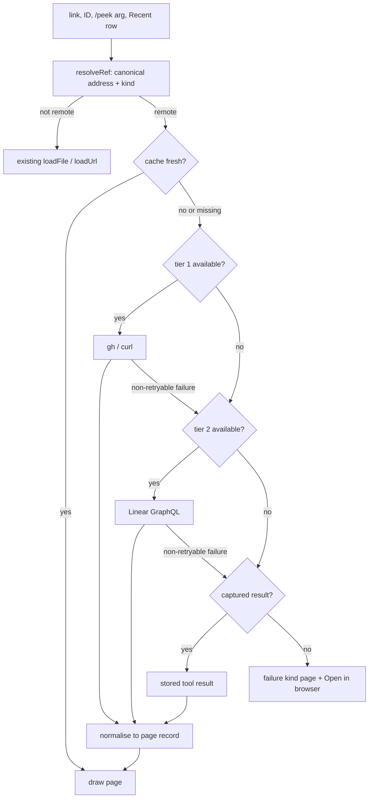
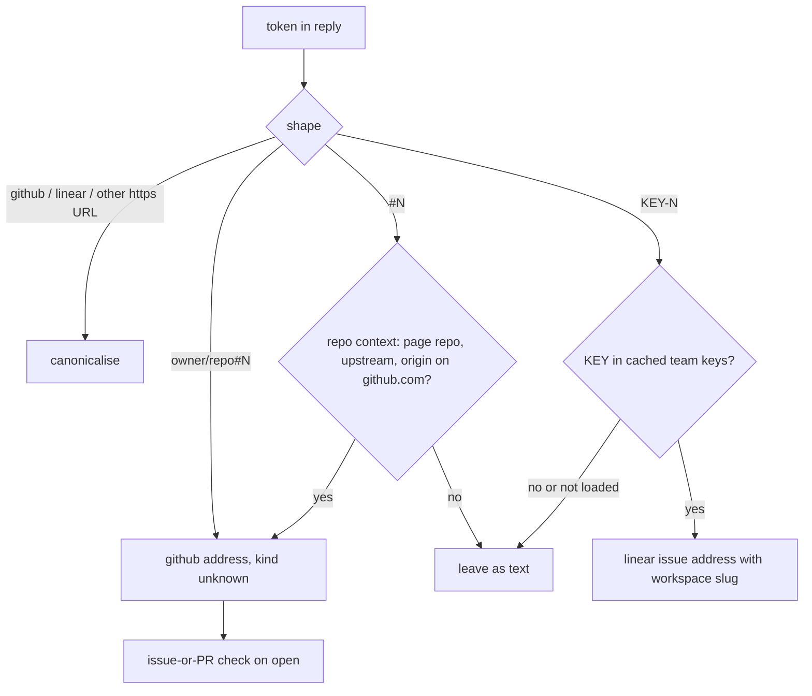
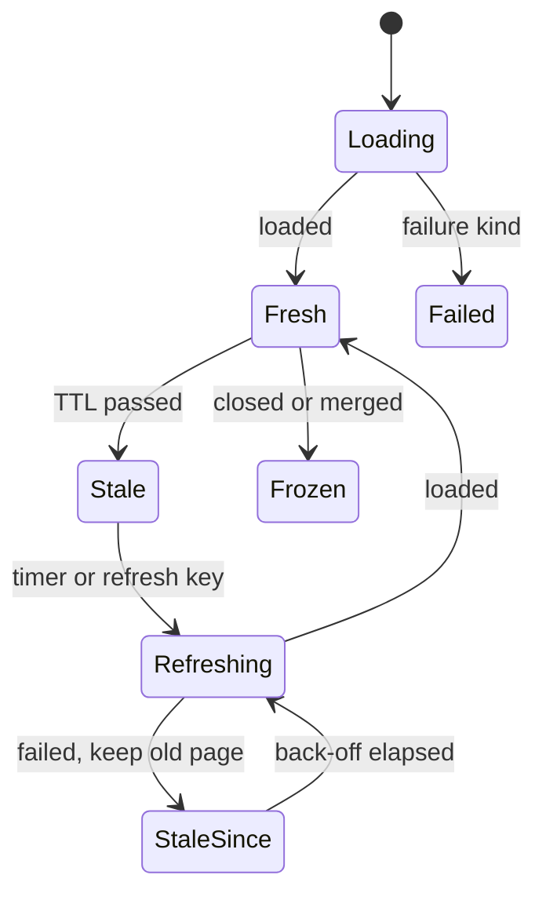
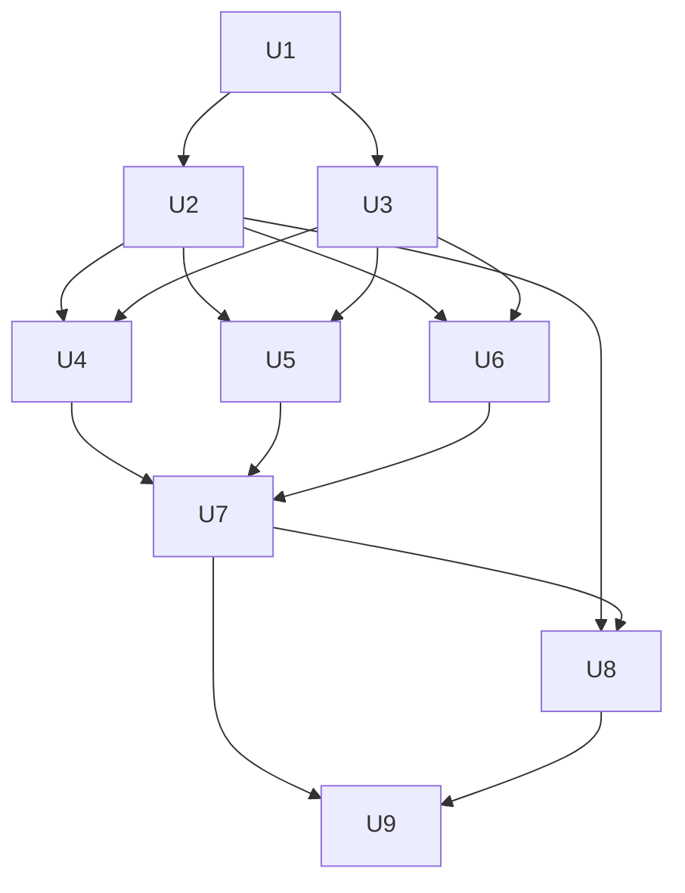

# Peek Remote Pages - Plan

**Target repo:** `~/.claude` (the live development copy at `mods/peek/`). All paths below are relative to that repo. The published snapshot at `plugins/peek` in this repo (shrimpshack) is older and is synced on release; do not plan against it.

---

## Goal Capsule

- **Objective:** when Linear issues and projects, GitHub repos, issues and pull requests, or any web page come up in a Claude session, the person can open each one in the peek pane and read its current state, details and discussion without leaving the terminal.
- **Means:** a three-tier data route — command-line tool, then API key, then data captured from the session's own tool calls (KTD1, KTD2) — feeding doc-style pages drawn by peek's existing page frame (KTD10).
- **Authority:** this plan's Requirements set behavior; its KTDs set mechanism. The engine API types at `mods/peek/.claude-plugin/types/claude-code/index.d.ts` are the authority on what a mod can do; where this plan and the types disagree, stop and report.
- **Stop conditions:**
  - Stop and report if `$.process.run` cannot run `gh` in the terminal session, or if `$.mcp.call` or the `tool.call` result shape behaves differently from what KTD2 and KTD3 rely on.
  - Never put a Linear key or GitHub token in command arguments, error text, the transcript or `$.store` (R16).
  - No write actions to Linear or GitHub (R18).
- **Execution profile:** TypeScript mod; pure logic in `tests/lib.test.ts`, pane behavior in `tests/pane.test.ts`, run with `claude plugin test`. Each new query and command also runs once against the real service before its unit is done.
- **Who finishes:** `ce-work` implements and verifies. The desktop-app check and the live API checks are manual steps in the Verification Contract.

---

## Product Contract

### Summary

Peek opens Linear issues and projects, GitHub repos, issues and pull requests, and any web page as doc-style pages: a header trail, a metadata block, the body as markdown, and a comment thread. Pull requests add line counts, files changed and a CI summary; web pages show their Open Graph details and use the site's favicon as their icon. Data comes from a command-line tool, else an API key, else what the session's own tool calls already fetched, and open issues and pull requests refresh on a timer.

### Problem Frame

Peek exists to surface the files and artifacts an agent session produces and touches. Today that covers local files only. A session's most important artifacts are often remote: the Linear issue being worked, the pull request just opened, the CI run that failed, the docs page Claude cited. Clicking one of those today either opens a browser or, inside peek, scrapes the raw HTML of a JavaScript app into an empty page. The person loses the thread of the session every time they leave the terminal to check an issue's status or a pull request's checks, and a stale status read from memory is worse than none.

### Requirements

**Opening items**

- R1. A Linear issue or project, a GitHub repo, issue or pull request, or any `http`/`https` page opens in the peek pane as a page.
- R2. Items open from links and IDs in Claude's replies, from `/peek <id or url>`, from Recent, Gallery and stars, and from links inside another opened page.
- R3. Bare references in replies become clickable: GitHub `owner/repo#123`, `#123` when the session's repo is known, and Linear IDs like `WEB-2757` only when the prefix is a real team key in the person's workspace.
- R4. A `#123` or issue URL that is really a pull request opens as a pull request.
- R5. Each item has one canonical address, so a link, an ID and a URL with a slug or anchor all open, count and star as the same item.

**Page content**

- R6. Every page shows a header trail for its context (`team ◢ project ◢ issue`, `owner ◢ repo ◢ #123`, `site ◢ page`), a metadata block, the body as markdown, and comments where the item has them.
- R7. Issue metadata shows state, assignee, labels, priority (Linear), milestone or project, and created and updated dates.
- R8. Pull request metadata adds draft, merged or closed state, review decision, merge state, lines added and removed, files changed, and a CI summary with counts per outcome (passed, failed, pending, cancelled, skipped).
- R9. The CI summary never reads as passing when nothing ran: an empty check list, a conflicting pull request and a still-computing merge state each get their own wording.
- R10. Comments show the newest 50, drawn oldest first with author and time, under a "showing latest 50 of M" line; Linear replies are indented one level; pull requests interleave conversation comments and review bodies and count inline review comments.
- R11. Repo pages show the README plus open pull requests and open issues; Linear project pages show the project description, status, lead, dates and progress plus its open issues. Each list opens its items.
- R12. Web pages show Open Graph title, description, site name and preview image above the page's readable text.
- R13. A site's favicon is its icon in the header, Recent and Gallery, falling back to a type icon when it has none.

**Data access and freshness**

- R14. Data comes from the best available tier, in order: a command-line tool, an API with a key, then data captured from this session's tool calls (governed by KTD1, KTD2).
- R15. The footer shows which tier a page came from and its age ("via gh · 40s ago", "from this session · 12 min ago").
- R16. Credentials never appear in command arguments, error text, toasts, the transcript or persisted state.
- R17. Each failure has its own page state with a next action, and Open in browser always works.

**Refresh**

- R19. An open issue or pull request on screen refreshes every 60 seconds; open issues and pull requests in Recent or stars refresh every 5 minutes in the background; closed or merged items refresh once on open; web pages, repos and projects refresh on open or on the refresh key.
- R20. Background refresh is capped per cycle, pauses while the session is idle, and backs off on rate limits, showing "stale since…" instead of retrying hard.
- R21. Refresh uses the best tier available at that moment, including repeating a captured MCP call when no tool or key is available.

**Read-only**

- R18. Peek never changes anything in Linear or GitHub.

### Key Decisions

- **Three data tiers, command-line tool first.** (session-settled: user-directed — chosen over using the MCP connectors as the main route: CLIs are stateless and the connectors have been unreliable.) Governs R14, R21.
- **Session capture instead of asking an agent.** (session-settled: user-directed — chosen over spawning an agent to fetch through MCP: the agent has usually fetched the item already, so peek captures that result rather than spending a model call.) Governs R14, R15.
- **Periodic refresh of open issues and pull requests.** (session-settled: user-directed — chosen over keeping captured data as a fixed snapshot: status and CI go stale fast.) Governs R19, R20, R21.
- **Pull requests show stats and discussion, not the code.** (session-settled: user-directed — chosen over including the file diff and CI logs.) Governs R8.
- **Read-only in this version.** (session-settled: user-approved — chosen over commenting and status changes from peek.) Governs R18.
- **Favicons and preview images draw as real pictures.** (session-settled: user-directed — the showcase run confirmed images draw in the pane.) Governs R12, R13.

### Acceptance Examples

- AE1. Covers R4. **Given** `#142` in a reply inside a repo where 142 is a pull request, **when** the person clicks it, **then** the page shows pull request stats and CI, not an issue page.
- AE2. Covers R3. **Given** a reply containing `UTF-8`, `SHA-256` and `WEB-2757`, and `WEB` is a team key, **then** only `WEB-2757` becomes a link.
- AE3. Covers R9. **Given** an open pull request with merge conflicts and no checks, **then** the CI line reads "checks not running: merge conflict", never green.
- AE4. Covers R14, R15. **Given** no Linear key is available and the agent earlier called the Linear MCP connector for `WEB-2757`, **when** the person opens `WEB-2757`, **then** the page draws from the captured result and the footer says "from this session" with its age.
- AE5. Covers R21. **Given** AE4's situation and the item is open on screen, **when** 60 seconds pass, **then** peek repeats the captured MCP call itself and the page updates without the agent doing anything.
- AE6. Covers R17. **Given** `gh` is not logged in, **when** the person opens a pull request, **then** the page says to run `gh auth login`, offers Open in browser, and shows no raw error text.

### Scope Boundaries

- GitHub Enterprise and non-github.com hosts fall through to the web page loader.
- Linear workspaces other than the one the key belongs to show "not found, or no access".

#### Deferred to Follow-Up Work

- The pull request file diff (peek can already draw diffs) and CI job logs.
- Commenting, status changes, assigning and any other write action.
- Showing a repo's open pull requests inside the worktree and repo scopes of Recent and Gallery.
- A Linear command-line tool tier: no official one exists, and third-party ones use the same key and API (Sources).

---

## Planning Contract

### Key Technical Decisions

- KTD1. **Tier resolution per item kind, decided at load time.** GitHub items: `gh` (tier 1) when `gh auth status` succeeds; web pages: `curl` (tier 1), else `$.http.fetch`; Linear: the GraphQL API with a key (tier 2), since no Linear CLI exists. Any item falls back to session capture (tier 3) when its higher tiers are unavailable or fail with a non-retryable state. Tool presence and login are probed once per session and cached. (session-settled: user-directed — chosen over MCP connectors as the main route: CLIs are stateless and the connectors have been unreliable.) Governs R14.
- KTD2. **Capture through a `tool.call` hook that awaits the result, read tools only.** Peek hooks `tool.call`, lets the call run, and records it only when the tool reads: a Linear or GitHub MCP tool whose name (after the server) starts with `get_`, `list_` or `search_`, or is `issue_read` / `pull_request_read`; `WebFetch`; or a `Bash` call running `gh` with a read subcommand (`view`, `list`, or `api` without `-X`/`--method`) and `--json` or `api`. Every other Linear or GitHub tool, such as `save_comment` or `merge_pull_request`, is never stored, so it can never be replayed (R18). A capture becomes a page source only for the addresses in the call's arguments, the item the call was about; addresses that appear only in the result become Recent mentions, not page sources. Normalising raw results into page records happens in the source modules (U4–U6), so capture stays a thin recorder. (session-settled: user-directed — chosen over spawning an agent to fetch through MCP.) Covers R14, R15.
- KTD3. **Refresh by repeating the captured call.** When tier 1 and 2 are unavailable, refresh calls `$.mcp.call(server, tool, args)` with the recorded server, tool and arguments. The engine runs plugin MCP calls with no permission prompt, and no model is involved, so replay re-checks the KTD2 read-only rule and refuses any entry that fails it. (session-settled: user-directed — periodic refresh chosen over fixed snapshots.) Covers R21.
- KTD4. **Canonical addresses are real https URLs.** The engine's Markdown draws only `https:`, `http:` and `file:` links, so every linkified ID points at `https://github.com/<o>/<r>/pull/<n>`, `https://github.com/<o>/<r>/issues/<n>`, `https://github.com/<o>/<r>`, `https://linear.app/<ws>/issue/<KEY-N>` or `https://linear.app/<ws>/project/<slug-id>`. For GitHub and Linear addresses, slugs, `/files`, query strings and comment anchors are stripped on entry; other web URLs keep their query string and drop only the `#fragment`. Covers R5.
- KTD5. **Linear GraphQL over `$.http.fetch`, pinned endpoint, key never on the command line.** POST to exactly `https://api.linear.app/graphql` with the raw key in `Authorization` (no `Bearer`), as herdr-board's client does. The key is looked up in the same order as that client: macOS Keychain through `/usr/bin/security find-generic-password -w` (never `-g`), then `LINEAR_API_KEY`, then the `LINEAR_API_KEY=` line in `~/.secrets`. `$.http.fetch` cannot disable redirects, so the risk of a redirect forwarding the key is accepted and recorded (Risks); the endpoint is never built from input. Covers R16.
- KTD6. **Issue-or-PR check before loading a GitHub number.** A bare number resolves through `gh api repos/<o>/<r>/issues/<n>` and the presence of its `pull_request` key, cached per address. `gh issue view` succeeds on a PR number, so it cannot be used for this. Covers R4.
- KTD7. **Failures are a fixed set of kinds, rendered from the kind only.** Loaders return one of: `cli-missing`, `cli-unauthed`, `key-missing`, `key-refused`, `not-found-or-no-access`, `rate-limited`, `offline`, `query-bug`, `fetch-blocked`, `process-unavailable`. The page text comes from the kind, never from stderr, response bodies or exception messages. Not-found and no-access stay merged because neither `gh` nor Linear separates them. Covers R16, R17.
- KTD8. **Linear IDs link only against a team-key allowlist.** At session start peek loads `viewer { organization { urlKey } }` and `teams { nodes { key } }` once, caches them in `$.store`, and links `KEY-N` only when `KEY` is in the list. When the API is unavailable, the workspace slug and team keys are seeded instead from captured Linear results: the `url` field (`linear.app/<ws>/issue/<KEY>-<N>`) of each captured issue adds its slug and key. Until either source loads, IDs stay as text; the reply redraws when the list grows. Linkify stays synchronous and reads the cached list, as it already does with the `exists` path cache. Covers R3, AE4.
- KTD9. **Repo context for `#123`.** Inside an opened GitHub page, `#123` resolves against that page's repo. In a reply it resolves against the session folder's `upstream` remote, then `origin`, when either points at github.com; otherwise it stays text. Covers R3.
- KTD10. **New source modules; `register.tsx` only dispatches and draws.** `register.tsx` is ~1,900 lines. Resolution, sources, capture, refresh and each loader live in new files under `mods/peek/hooks/`; `register.tsx` gains one dispatch branch in `show`, one branch in `refresh`, and a page renderer for remote items reusing `crumbs`, `embed` and `frame`. Covers R6.
- KTD11. **Item cache in memory, titles in the store.** Page records live in a module-level map with `fetchedAt` and `tier`, following the `scopeCache` pattern (cached value or null, background load once, then `$.ui.invalidate`). A small `{title, kind, status, favicon}` map keyed by canonical address persists in `$.store`, capped at 500 entries, so Recent and stars label remote items properly across sessions. Covers R5, R13.
- KTD12. **One scheduler for all timed refresh.** A single `$.clock.every` loop owns refresh: the on-screen open issue or pull request every 60 s, a rotating batch of at most 20 open issues and pull requests from Recent and stars every 5 min, nothing while the session has been idle for 10 min, and exponential back-off per source after a rate limit. A late response for an address that is no longer current never replaces the visible page. A refresh replaces the record in place: scroll offset, current section and focused row are kept, so a timed refresh never moves the reader. Covers R19, R20.
- KTD13. **Web pages: `curl` first, Open Graph from the head, favicon through the existing image path.** Peek fetches the page HTML with `curl -sL --max-time` (tier 1) or `$.http.fetch`, reads `og:*`, `twitter:*`, `<title>` and `<link rel=icon>` from the HTML head, falls back to `/favicon.ico`, and converts icons and preview images to PNG through the existing `toPng` path (`sips` handles `.ico`). Image bytes download only through `curl -o` to the scratch folder: `$.http.fetch` returns text only, so without `curl` the page shows the type icon and no preview image. Every URL handed to `curl` must parse as `http:` or `https:` first, and `curl` always runs with `--proto =http,https --proto-redir =http,https`, because the page's author chooses the icon and image URLs. Preview images and favicons are not fetched when their host is `localhost` or resolves to a loopback, link-local or private address; pages the person opens themselves are unaffected. Readable text keeps today's `htmlToMarkdown`. Covers R12, R13.

### High-Level Technical Design

Opening an item:

Resolving a bare reference in a reply:

Item freshness:

### Assumptions

- `$.process.run` can run `gh`, `curl`, `security` and `sips` in the terminal session (peek already runs `git`, `sips` and `open` this way). Whether it can in the desktop app is unverified; the plan handles both (U2, Verification Contract).
- The Linear and GitHub MCP tools the agent uses return JSON text that contains the fields the normalisers need; U4 and U5 normalisers tolerate missing fields and treat every field as optional.

---

## Implementation Units

U4, U5 and U6 can run in parallel once U2 and U3 land.

### U1. Item addresses and reference resolver

**Goal:** turn any link, ID or URL into one canonical address plus a kind, and recognise references in reply text.

**Requirements:** R3, R4, R5; KTD4, KTD8, KTD9.

**Dependencies:** none.

**Files:**
- `mods/peek/hooks/refs.ts` (new): `parseRef`, `canonicalAddress`, reply-text recognisers.
- `mods/peek/hooks/lib.ts`: extend `linkify` with a second pass for references inside the same protected-segment walk (fences, links and code spans keep their current rules).
- `mods/peek/types/index.d.ts`: add the remote item kinds and the page-record shape to `View`.
- `mods/peek/tests/refs.test.ts` (new).

**Approach:**
1. Kinds: `gh-repo`, `gh-issue`, `gh-pr`, `gh-number` (issue or PR, not yet known), `linear-issue`, `linear-project`, `web`.
2. Canonicalise per KTD4. A `gh-number` stays unresolved until opened; KTD6 settles it in U4.
3. Reply recognisers take the cached team-key list and repo context as plain inputs, so the pure function stays testable.

**Patterns to follow:** `pathCandidates` and `linkify` in `mods/peek/hooks/lib.ts`; the `lib.test.ts` cases for them.

**Test scenarios:**
- `https://github.com/o/r/pull/12/files#discussion_r1` canonicalises to `https://github.com/o/r/pull/12`.
- `https://linear.app/acme/issue/WEB-2757/fix-the-thing` canonicalises to `https://linear.app/acme/issue/WEB-2757`.
- `o/r#12` becomes a `gh-number` address on `o/r`.
- `#12` with repo context `o/r` links; with no context it stays text.
- Covers AE2. `UTF-8 SHA-256 WEB-2757` with team keys `[WEB]` links only `WEB-2757`.
- A team-key list that has not loaded links no Linear IDs.
- References inside fenced code stay text; a code span holding only `o/r#12` links.
- A reply already containing `[text](https://github.com/o/r/pull/12)` is left unchanged.

**Verification:** every reference form above maps to the expected address, and the existing path-linkify tests still pass.

### U2. Source tiers, credentials and failure kinds

**Goal:** decide which tier can load an item, fetch Linear data safely, and turn every failure into one of the KTD7 kinds.

**Requirements:** R14, R16, R17; KTD1, KTD5, KTD7.

**Dependencies:** U1.

**Files:**
- `mods/peek/hooks/sources.ts` (new): capability probe, Linear key chain, Linear GraphQL client, `gh` runner, failure-kind mapping.
- `mods/peek/tests/sources.test.ts` (new).
- `mods/peek/tests/pane.test.ts`: make the `env.get` fake switch on the variable name (it returns `/home` for every name today) and add an `http.fetch` fake.

**Approach:**
1. Capability probe once per session: `gh auth status` (exit code only), `command -v curl` equivalent through `$.process.run`, and a key-chain lookup that records only whether a key was found. A rejected `$.process.run` maps to `process-unavailable`.
2. The `gh` runner always passes `--json` with an explicit field list, a timeout, and never echoes stderr upward.
3. The GraphQL client pins the endpoint, pages 50 per request up to 10 pages with a `partial` flag, retries once on rate limit after `retry-after` (max 5 s), and maps GraphQL error codes to KTD7 kinds as herdr-board's client does.

**Execution note:** start with the planted-key leak test: plant a fake key and assert it never appears in any page, toast, log line or error the module produces.

**Patterns to follow:** herdr-board `crates/board-daemon/src/linear/client.rs`, `queries.rs` and `credential.rs` for the endpoint, header, pagination, error mapping and key order; `runOrThrow` and `scopeCache` in `mods/peek/hooks/register.tsx`.

**Test scenarios:**
- Keychain empty, `LINEAR_API_KEY` unset, `~/.secrets` has `LINEAR_API_KEY="abc"` → the key is found with quotes stripped.
- No key anywhere → `key-missing`.
- Linear answers 401 or `AUTHENTICATION_ERROR` → `key-refused`.
- Linear answers `RATELIMITED` with `retry-after: 1` → one retry, then `rate-limited` if it repeats.
- A GraphQL validation error → `query-bug`, not `offline`.
- `gh auth status` exits non-zero → `cli-unauthed`.
- `gh` missing from PATH → `cli-missing`.
- `$.process.run` rejects outright → `process-unavailable`.
- `$.http.fetch` refused by policy → `fetch-blocked`.
- Planted-key leak test passes for every failure kind above.
- The key never appears in any `$.process.run` argument list recorded by the fake.

**Verification:** each failure kind is produced by exactly one fake condition, and the leak test fails when a deliberate leak is introduced.

### U3. Session capture

**Goal:** record the results of the agent's own Linear, GitHub and web tool calls so peek can draw and refresh items with no tool or key of its own.

**Requirements:** R14, R15, R21; KTD2, KTD3.

**Dependencies:** U1.

**Files:**
- `mods/peek/hooks/capture.ts` (new): the `tool.call` recorder and the capture store.
- `mods/peek/hooks/register.tsx`: register the hook; feed captured addresses into `mentions` as artifacts.
- `mods/peek/tests/capture.test.ts` (new).

**Approach:**
1. Match tools per the KTD2 read-only rule: Linear and GitHub MCP read tools, `WebFetch`, and read-only `gh` commands run through `Bash`.
2. Await `next(e)`, then store `{server, tool, args, result, at}` as a page source under the canonical addresses U1 finds in the arguments; record addresses found only in the result as Recent mentions. Store `args` without the engine's own keys (`tool`, `tool_use_id`, `agentId`, `consent`). Store nothing when the call errored.
3. When a captured Linear result carries an issue `url`, add its workspace slug and team key to the KTD8 allowlist and redraw replies.
4. Cap the store at 200 entries and 2 MB of result text, oldest first out, in memory only.
5. Expose `replay(address)` that repeats the stored call with `$.mcp.call(server, tool, args)` for MCP entries (KTD3), refusing any entry that fails the read-only rule. `Bash` and `WebFetch` entries are not replayed.
6. Expose `lookup(address)`; an unresolved `gh-number` looks under both its `/pull/<n>` and `/issues/<n>` addresses, and the matching capture's kind settles issue or PR when `gh` cannot run.

**Patterns to follow:** the existing `tool.call` and `session.append` hooks in `mods/peek/hooks/register.tsx`; `noteMentions` for artifact recording.

**Test scenarios:**
- A `mcp__claude_ai_Linear__get_issue` call with `{id: "WEB-2757"}` returning JSON is stored under `https://linear.app/<ws>/issue/WEB-2757`.
- A `Bash` call `gh pr view 12 --repo o/r --json title,state` is stored under the PR address.
- A tool call that returns `isError` stores nothing.
- A `mcp__claude_ai_Linear__save_comment` call and a `mcp__claude_ai_Github__merge_pull_request` call store nothing, and a hand-planted write entry is refused by `replay`.
- A `Bash` call `gh api -X POST repos/o/r/issues` stores nothing.
- A `list_issues` result naming 30 issues creates no page sources for them and does not evict an earlier `get_issue` capture.
- With no Linear key, capturing a `get_issue` result for WEB-2757 makes `/peek WEB-2757` and a bare `WEB-2757` in a later reply resolve to it.
- With `gh` unavailable and a captured `gh pr view 142 --json` result, `#142` opens as a pull request from the capture.
- `replay` of a stored MCP entry calls `$.mcp.call` with the same server, tool and arguments, and none of the engine's reserved keys.
- `replay` of a `WebFetch` entry returns nothing (not replayable).
- The store evicts the oldest entry past 200.
- A captured address appears in Recent as an artifact.

**Verification:** a captured call can be found by address, replayed, and is never stored on error.

### U4. GitHub loaders

**Goal:** load GitHub repos, issues and pull requests into page records, from `gh` or from a captured result.

**Requirements:** R4, R6, R7, R8, R9, R10, R11; KTD6.

**Dependencies:** U2, U3.

**Files:**
- `mods/peek/hooks/github.ts` (new): issue-or-PR check, `loadPr`, `loadIssue`, `loadRepo`, normalisers for `gh` JSON and for captured GitHub MCP results.
- `mods/peek/tests/github.test.ts` (new), with JSON fixtures under `mods/peek/tests/fixtures/github/`.

**Approach:**
1. Pull request fields: `number,title,state,isDraft,author,assignees,labels,milestone,createdAt,updatedAt,mergedAt,body,additions,deletions,changedFiles,reviewDecision,mergeable,mergeStateStatus,statusCheckRollup,comments,reviews,headRefName,baseRefName,url`.
2. CI buckets from `statusCheckRollup`: CheckRun `conclusion`/`status` and StatusContext `state` both map into passed, failed, pending, cancelled, skipped. Empty rollup → "no checks reported". Only for an open PR: `mergeable = CONFLICTING` with an empty rollup → "checks not running: merge conflict", and `mergeable = UNKNOWN` → "computing". Merged and closed PRs always draw their rollup buckets, because GitHub reports `UNKNOWN` or `CONFLICTING` for many merged PRs.
3. Comments: conversation comments plus non-empty review bodies, interleaved by time, keeping the newest 50 and drawing them oldest first (R10); inline review comments counted through `gh api repos/<o>/<r>/pulls/<n>/comments` and shown as a count with Open in browser.
4. Repo: `gh repo view --json nameWithOwner,description,defaultBranchRef,primaryLanguage,stargazerCount,updatedAt,url`, README through `gh api repos/<o>/<r>/readme` with the raw accept header, and open pull requests and issues (30 each, newest update first) through `gh pr list` and `gh issue list`.

**Patterns to follow:** the `gh --json` field lists recorded in Sources; the CI pitfalls in Sources.

**Test scenarios:**
- Covers AE1. A `gh-number` whose issues-API response has a `pull_request` key loads as a PR.
- A PR with 12 successful, 1 failed, 2 in-progress and 1 cancelled check reads `12 passed · 1 failed · 2 pending · 1 cancelled`.
- Covers AE3. `mergeable: CONFLICTING` with an empty rollup reads "checks not running: merge conflict".
- An empty rollup on a mergeable PR reads "no checks reported", not passed.
- A merged PR shows its merged date and refreshes once (R19).
- A merged PR with `mergeable: UNKNOWN` and 30 successful checks reads "30 passed", not "computing".
- A PR with 214 comments shows comments 165–214, oldest of those first, under "showing latest 50 of 214".
- A captured GitHub MCP result with missing `labels` and `milestone` still normalises.
- `gh` exits with "Could not resolve to a PullRequest" → `not-found-or-no-access`.
- A repo with no README draws its metadata and lists with no body.

**Verification:** each fixture produces the expected page record; one real `gh` call per loader succeeds against a public repo.

### U5. Linear loaders

**Goal:** load Linear issues and projects, and the workspace slug and team keys, from the API or from a captured result.

**Requirements:** R3, R6, R7, R10, R11; KTD5, KTD8.

**Dependencies:** U2, U3.

**Files:**
- `mods/peek/hooks/linear.ts` (new): workspace bootstrap, `loadLinearIssue`, `loadLinearProject`, normalisers for API JSON and captured Linear MCP results.
- `mods/peek/tests/linear.test.ts` (new), fixtures under `mods/peek/tests/fixtures/linear/`.

**Approach:**
1. Bootstrap at session start: `viewer { organization { urlKey } }` and `teams { nodes { key } }`, cached in `$.store` with a one-day TTL. With no key, the allowlist fills from captures instead (KTD8, U3).
2. Issue query reuses herdr-board's detail field set (`issue(id:)` accepts the identifier) with comments fetched as the newest 50 (`comments(last: 50)`) with `parent { id }` for one level of nesting.
3. Project query is new: `project(id:)` with name, `content`, status, lead, `startDate`, `targetDate`, `progress`, and its open issues filtered on the server (`state: { type: { nin: ["completed", "canceled"] } }`), 50 per page.

**Execution note:** run each query once against the real API before marking the unit done; fixtures have missed a wrong variable type before (Sources).

**Patterns to follow:** herdr-board `queries.rs` field sets; the pagination and error mapping from U2.

**Test scenarios:**
- An issue with a project and parent draws the trail `team ◢ project ◢ WEB-2757`.
- An issue with no project draws `team ◢ WEB-2757`.
- A reply comment draws one level under its parent.
- A project with 120 open issues pages to all 120 within the 10-page cap and marks `partial` only past it.
- A captured Linear MCP issue result with null `assignee` and no `labels` normalises.
- Bootstrap failure with no captures leaves the team-key list empty, so no IDs link (R3).
- An ID from another workspace → `not-found-or-no-access`.

**Verification:** fixtures produce the expected records; one real issue and one real project load against the live API.

### U6. Web pages with Open Graph and favicons

**Goal:** load any web page with its Open Graph details, preview image and favicon.

**Requirements:** R1, R6, R12, R13; KTD13.

**Dependencies:** U2, U3.

**Files:**
- `mods/peek/hooks/web.ts` (new): fetch through `curl` or `$.http.fetch`, head parser, favicon resolution.
- `mods/peek/hooks/register.tsx`: route generic `http`/`https` loads here instead of today's `loadUrl`.
- `mods/peek/tests/web.test.ts` (new), HTML fixtures under `mods/peek/tests/fixtures/web/`.

**Approach:**
1. Parse `og:title`, `og:description`, `og:site_name`, `og:image`, then `twitter:*` and `<title>` / `<meta name=description>` as fallbacks. Resolve relative image and icon URLs against the final page URL.
2. Favicon order: `<link rel="icon">` (largest declared size), `apple-touch-icon`, then `/favicon.ico`. Download with `curl` under the KTD13 scheme rule to the existing scratch folder and convert with `toPng`; cache per host.
3. A captured `WebFetch` result is used when the page cannot be fetched; it has no head tags, so the page shows its text with the type icon.

**Patterns to follow:** `toPng`, `pixels` and `converted` in `mods/peek/hooks/register.tsx`; `htmlToMarkdown` in `mods/peek/hooks/lib.ts`.

**Test scenarios:**
- A page with full Open Graph tags shows title, site name, description and preview image.
- A page with only `<title>` and a description meta still fills the block.
- `<link rel="icon" href="/static/icon.png">` resolves to the absolute URL.
- No icon link falls back to `/favicon.ico`; a 404 there falls back to the type icon.
- An `.ico` favicon converts to PNG before drawing.
- A page larger than 4 MB is cut, not failed.
- A page whose `og:image` is `file:///etc/passwd` and whose icon is `gopher://127.0.0.1:6379/` fetches neither and draws the type icon.
- A public page whose `og:image` is `http://192.168.1.1/x.png` or `http://localhost:8080/a.png` does not fetch it.
- With `curl` unavailable, the page draws from `$.http.fetch` with the type icon and no preview image.

**Verification:** fixtures produce the expected block; a real page with Open Graph tags and a real page without them both draw.

### U7. Remote page rendering

**Goal:** draw page records as doc-style pages in peek's existing frame, plus every failure state.

**Requirements:** R6, R7, R8, R9, R10, R11, R12, R13, R15, R17.

**Dependencies:** U4, U5, U6.

**Files:**
- `mods/peek/hooks/register.tsx`: a remote branch in the pane renderer next to the markdown, table, dir, code and image branches.
- `mods/peek/hooks/theme.ts`: icons and colours for the new kinds and states.
- `mods/peek/tests/pane.test.ts`: remote page mounts.

**Approach:**
1. Header trail through `crumbs`; favicon or type icon on the title piece.
2. Metadata block and the PR stats and CI strip through `embed` frames, so they match code and diagram frames.
3. Body and each comment as Markdown blocks recorded with `note(rows, heading)`, so `j`/`k` jumps and the `§` position keep working.
4. Lists through the existing focusable row pattern, so `hjkl`, Tab and Enter work as in Recent. A repo page orders metadata, Pull requests, Issues, then README; a project page orders metadata, description, then Issues. Each is a `note(rows, heading)` section so `j`/`k` jump between them, and a capped list ends with a "showing 30 of M, Open in browser for the rest" row (a Linear `partial` result says so).
5. Footer info adds the tier and age (R15); a failure draws its kind's message and the Open in browser key.
6. Remote pages add a Refresh key, `u` (unused today), to the footer and the command menu; it is shown only on remote pages.

**Patterns to follow:** the doc page branch and `embed` in `mods/peek/hooks/register.tsx`; the list row buttons added for keyboard navigation.

**Test scenarios:**
- A PR record draws title, state chip, CI line and comments, on terminal and desktop surfaces.
- Each KTD7 failure kind draws its own message and an Open in browser key.
- Covers AE6. `cli-unauthed` says to run `gh auth login`.
- Pressing `j` on a long issue jumps between comments.
- A repo page's PR list opens a PR on Enter.
- The footer reads "via gh · 40s ago" for a tier-1 record and "from this session · 12 min ago" for a tier-3 one.
- A record with a favicon draws it on the title piece; one without draws the type icon.
- With the menu open, the remote page dims like a doc page.
- Pressing `u` on a remote page reloads it; `u` is absent from the footer on a doc page.
- A repo page with 45 open PRs shows 30 and a "showing 30 of 45" row, and `j` jumps from Pull requests to Issues.

**Verification:** every record kind and failure kind mounts on both surfaces with no refused tree.

### U8. Cache and refresh scheduler

**Goal:** keep open issues and pull requests current without hammering any source.

**Requirements:** R19, R20, R21; KTD11, KTD12.

**Dependencies:** U2, U7.

**Files:**
- `mods/peek/hooks/refresh.ts` (new): item cache, title store, scheduler, back-off.
- `mods/peek/hooks/register.tsx`: start the scheduler at session start; the refresh key and the `refresh` branch for remote addresses.
- `mods/peek/tests/refresh.test.ts` (new), using the test kit's mocked clock.

**Approach:**
1. Cache entries hold `{record, tier, fetchedAt, state}` with the states in the freshness diagram.
2. The scheduler ticks every 15 s and decides due work from the R19 intervals; background batches rotate through eligible items, at most 20 per 5-minute cycle.
3. Idle means no `prompt.submit` or tool call for 10 minutes; the scheduler skips background work while idle.
4. A rate-limited source doubles its wait up to 30 minutes; the page shows "stale since…".

**Patterns to follow:** `scopeCache` / `scopeLoading` and `$.ui.invalidate` in `mods/peek/hooks/register.tsx`.

**Test scenarios:**
- Covers AE5. An open issue on screen reloads after 60 s of mocked time.
- A merged PR does not reload after its first load.
- 30 open items in Recent produce at most 20 loads per 5-minute cycle.
- No background loads run after 10 minutes with no activity; activity resumes them.
- A rate-limited source waits twice as long each time and the page shows "stale since…".
- A response for an address no longer on screen updates the cache but not the visible page.
- Scrolled to comment 20 of an open PR, a 60-second refresh leaves the scroll offset and section unchanged.
- Pressing refresh twice quickly sends one request.
- A tier-3 item refreshes through `replay` (U3).

**Verification:** with a mocked clock, request counts match the intervals and caps exactly.

### U9. Flow wiring and Recent labels

**Goal:** every entry point opens remote items, and Recent, Gallery and stars label them properly.

**Requirements:** R2, R5, R13; KTD10, KTD11.

**Dependencies:** U7, U8.

**Files:**
- `mods/peek/hooks/register.tsx`: `show` dispatch, `toHref` and the `/peek` command resolve references before `guess`, the `star` tool resolves references, the AssistantMessage hook passes team keys and repo context to `linkify`, and Recent and Gallery read titles, kinds, status and favicons from the title store.
- `mods/peek/hooks/lib.ts`: `typeOf` and entry descriptions for remote kinds (status chip instead of size).
- `mods/peek/tests/pane.test.ts`.

**Approach:**
1. `show` checks `parseRef` before `parseHref`; remote addresses go to the U2 tier resolution, everything else keeps today's path.
2. `/peek WEB-2757` resolves without spending a model call; `guess` only runs when no resolver matches.
3. Recent rows for remote items show title, `owner/repo` or `TEAM · project` as the folder line, and a status chip.
4. A short in-memory back stack (up to 20 pages) records each page opened from inside another page; a Back key, `b` (unused today), restores the previous page and its scroll position.

**Test scenarios:**
- `/peek WEB-2757` opens the Linear issue and never calls `$.model.fork`.
- `/peek o/r#12` opens the PR.
- Starring `https://github.com/o/r/pull/12/files` and then `o/r#12` leaves one star.
- A PR in Recent shows its title, `o/r` and an "open" chip, not "12 · 0 B".
- A link inside an opened PR's description (`#45`) opens against that PR's repo.
- Opening a PR from a repo page's list, then pressing `b`, returns to the repo page at the same scroll position.
- Existing file and doc behaviors are unchanged (the existing pane tests pass).

**Verification:** every entry point in R2 opens a remote item in the pane tests; no existing test changes behavior.

---

## Risks

| Risk | Mitigation |
|---|---|
| A redirect from the Linear endpoint forwards the key to another host; `$.http.fetch` cannot disable redirects | Endpoint pinned to `https://api.linear.app/graphql` and never built from input. `$.http.fetch` follows redirects before peek sees the response, so a redirect cannot be detected; this risk is accepted on the pinned first-party host |
| `gh` cannot run in the desktop app | U2 maps it to `process-unavailable`; Linear and tier 3 still work there; the desktop check is a manual verification step |
| A captured MCP result's shape differs from what a normaliser expects | Every field optional; a result that normalises to no title falls through to the next tier rather than drawing an empty page |
| Background refresh spends GitHub or Linear quota | KTD12 caps, idle pause and back-off; closed items never refresh |
| `register.tsx` keeps growing | KTD10: sources and loaders live in new modules; `register.tsx` only dispatches and draws |
| Two Claude sessions edit `mods/peek` at once (this happened during design) | One session owns implementation; run the full test suite before each commit |

---

## Sources

- herdr-board Linear client: `crates/board-daemon/src/linear/{client.rs,queries.rs,credential.rs}` in `~/projects/herdr-linear-board` (endpoint, raw key header, 50×10 paging, error mapping, key order).
- `gh` 2.101.0 `--json` fields verified on this machine for `pr view`, `issue view` and `repo view`; `repo view` has no README field.
- `gh issue view <n>` succeeds on a PR number (probed), hence KTD6.
- Memory `reference_gh_conflicting_blocks_ci_silently`: a conflicting PR runs zero workflows, so no red checks is not a pass.
- Memory `reference_linear_api_key_fallback`: the key works against `https://api.linear.app/graphql` with `Authorization: <key>`, no `Bearer`.
- Memory `reference_statusline_linear_ticket_cache`: Linear has no official CLI.
- Engine types (`mods/peek/.claude-plugin/types/claude-code/index.d.ts`): Markdown links only `https`/`http`/`file`; `$.mcp.call` runs with no permission prompt; `$.process` is documented as CLI only; `$.http.fetch` has no redirect option.

---

## Verification Contract

| Check | Command or step | Applies to |
|---|---|---|
| Manifest and hooks validate | `claude plugin validate mods/peek` | every unit |
| Type-check | `npx -y -p typescript@5.6 tsc -p mods/peek` (a clean run prints nothing; read the exit code) | every unit |
| Tests | `claude plugin test mods/peek` | every unit |
| Leak test | the planted-key test in `tests/sources.test.ts` passes, and fails when a leak is introduced | U2 |
| Live GitHub | one PR, one issue and one repo load from a real public repo | U4 |
| Live Linear | one issue and one project load from the real workspace | U5 |
| Live web | one page with Open Graph tags and one without | U6 |
| Desktop app | open a PR and a Linear issue in the Claude desktop app's Code tab; record whether `gh` ran or `process-unavailable` showed | U2, U7 |
| Manual pane check | open each item kind in the terminal pane and confirm the page, `j`/`k`, refresh key and Open in browser | U7, U9 |

---

## Definition of Done

- Every requirement R1–R21 is met and every acceptance example AE1–AE6 has a passing test.
- Validation, type-check and the full test suite pass; the leak test passes and fails on a deliberate leak.
- The live checks in the Verification Contract have run and their results are recorded in the pull request description.
- No credential appears in any test snapshot, log or drawn frame.
- No code from abandoned approaches remains in the diff.
- `mods/peek/README.md` describes remote pages, the three tiers and the refresh rules.
