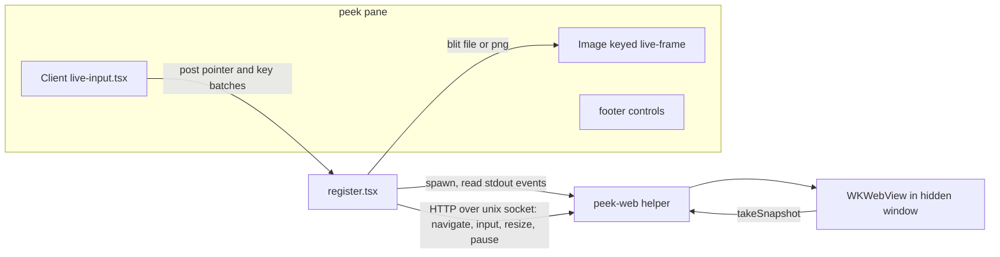
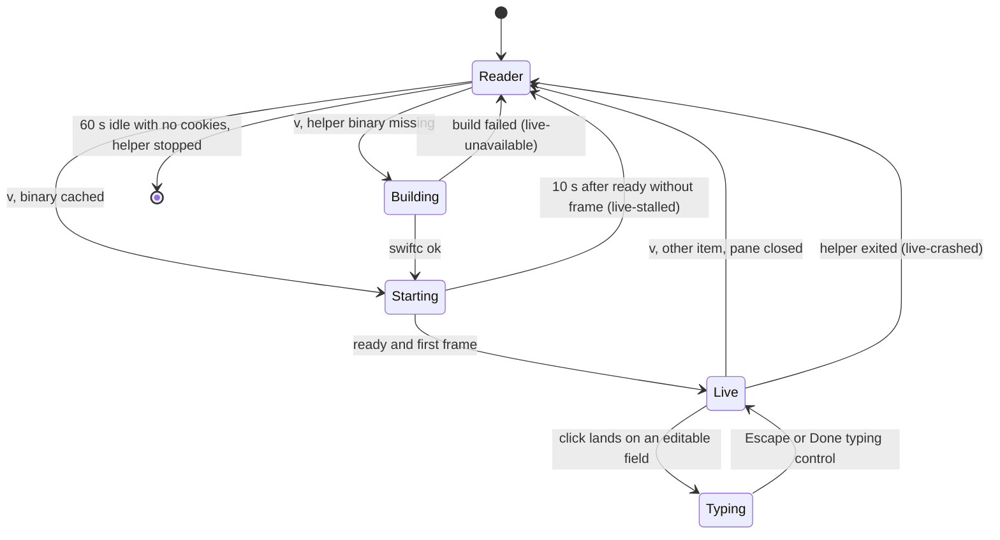
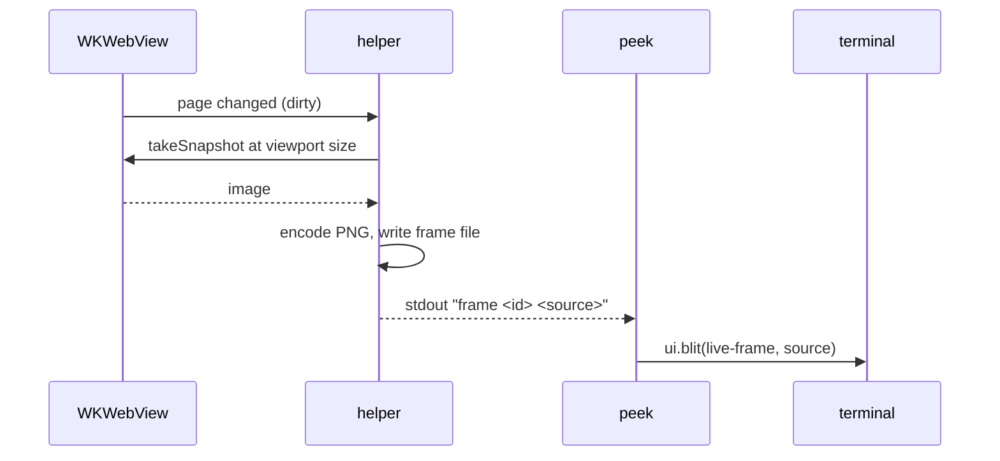
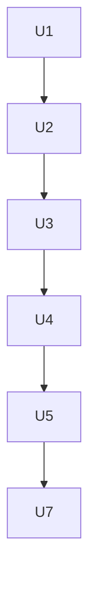

# Peek Live Browser - Plan

**Target repo:** shrimpshack. All paths are relative to the repo root. The live development copy at `~/.claude/mods/peek` mirrors `plugins/peek` and is synced after each unit.

---

## Goal Capsule

- **Objective:** a person reading a web page in the peek pane can switch it to the real, working page — rendered by WebKit, scrollable, clickable and typeable — without leaving the terminal.
- **Means:** a small native macOS helper renders the page off-screen in WebKit; peek streams its frames into the pane and forwards input back (KTD1, KTD2).
- **Authority:** this plan's Requirements set behavior; KTDs set mechanism. The engine types at `plugins/peek/.claude-plugin/types/claude-code/index.d.ts` are the authority on what a mod can do; where this plan and the types disagree, stop and report.
- **Stop conditions:**
  - Stop after U1 and report if sustained end-to-end frames (snapshot to drawn image, for the transport that draws) run under 5 per second at a full pane, or no frame format draws in the pane under herdr and Ghostty.
  - Stop after U1 and report if no layout lets pointer clicks reach the live view; live view needs pointer input (R8).
  - Never load a non-`http`/`https` URL in the helper, and never persist cookies or site data to disk (R12, R13).
  - Never kill or touch processes the helper did not start.
- **Execution profile:** TypeScript mod plus one Swift source file. Pure logic in `plugins/peek/tests/*.test.ts`, pane behavior in `plugins/peek/tests/live-pane.test.ts` with faked `process.spawn` and `http.fetch`, run with `claude plugin test`. The helper is verified by a manual smoke run; U1 is a measured spike.
- **Who finishes:** `ce-work` implements and verifies. The live pane check under herdr and Ghostty is a manual step in the Verification Contract.

---

## Product Contract

### Summary

Web pages in peek keep opening as the fast reader page. Pressing `v` switches the page to a live view: a WebKit rendering of the actual site drawn inside the pane, updating as the page changes. The wheel scrolls it, clicks follow links and press buttons, and typing reaches form fields. Back and reload work, and `v` returns to the reader page.

### Problem Frame

Peek's reader page shows a site's Open Graph details and its text, which works for articles and docs but not for anything interactive: dashboards, web apps, pages that need a click or a search box. Today the person presses `o` and leaves the terminal for a browser, losing the session's side-by-side view. The terminal can draw images, and the Claude Code mod engine can swap an image's frame in place many times a second, so a real page can be shown where the reader page is.

### Requirements

**Opening and leaving live view**

- R1. On a web page in peek, `v` switches between the reader page and the live view of the same URL.
- R2. Web links still open as the reader page by default; live view is never started without the person asking.
- R3. Leaving the live view (pressing `v`, opening another item, or closing the pane) stops showing frames. While the live page holds cookies the helper keeps running, so logins survive until peek unloads; otherwise it is shut down when nothing has shown live view for 60 seconds. It is always shut down when peek unloads.

**Showing the page**

- R4. The live view fills the page area of the pane at the pane's current size and redraws when the pane is resized.
- R5. The view updates while the page changes (loading, animations, typing) at a rate the person reads as live, at least 5 frames a second and up to the pane's frame limit, and stops sending frames while nothing changes.
- R6. The header shows the page's current title and site; the footer shows load state (loading, ready, failed) and the current URL's host.

**Interacting**

- R7. The mouse wheel over the live view scrolls the page at that point.
- R8. A click on the live view clicks the page at the matching point.
- R9. After a click on an editable field, typed characters, Enter, Backspace, Tab and arrow keys reach the page; Escape or the Done typing control returns the keys to peek.
- R11. Back and reload act on the live page; `o`, `c` and `f` act on the live page's current URL.

**Safety**

- R12. Cookies and site data live only in memory for the helper's lifetime; nothing is written to disk.
- R13. The helper loads only `http` and `https` pages; other schemes, downloads, popups to new windows and JavaScript dialogs are refused or kept inside the one view.

**Failure**

- R14. If the helper cannot be built, cannot start, crashes, or shows no frame within 10 seconds, peek falls back to the reader page with a one-line reason, and `v` can try again.

### Key Decisions

- **Live view renders inside peek's pane.** (session-settled: user-directed — chosen over handing off to the installed `terminal-browser` (Electron/Chromium) in a split pane: "we're building it".) Governs R1, R4, R5.
- **WebKit, not Chromium.** (session-settled: user-directed — the request named WebKit; Chromium via Playwright was offered by research for faster frames and not taken.) Governs R4, R5.
- **Reader page stays the default; live is opt-in per page.** Live costs a helper process and frames; most links read fine as text. Governs R1, R2.
- **No persisted logins.** Cookies are kept only while the helper runs, so peek never holds a person's site sessions on disk. Governs R12.
- **A page renderer with input, not a browser.** (session-settled: user-directed — "doesn't need to be a full functional browser, just capable of rendering a web page and handling input".) Live view renders one page and takes scroll, clicks and typing; browser features beyond back and reload are out. Governs R1, R7, R8, R9, R11.
- **Logins last for the session.** (session-settled: user-directed — chosen over a fixed 60-second shutdown and over stopping on leave: dashboards need logins that survive a minute away.) A helper whose page holds cookies runs until peek unloads. Governs R3.

### Acceptance Examples

- AE1. Covers R1, R5. **Given** the reader page of `https://news.ycombinator.com`, **when** the person presses `v`, **then** within 3 seconds the pane shows the real front page and the footer reads "live · news.ycombinator.com".
- AE2. Covers R8, R11. **Given** a live view, **when** the person clicks a story link and then presses `b`, **then** the page navigates to the story and back to the front page, and `o` opens the story's URL while it is showing.
- AE3. Covers R9. **Given** a live view of a search page, **when** the person clicks the search box and types "webkit" then Enter, **then** results load, and clicking the "Done typing" control returns `j`/`k` to peek.
- AE4. Covers R14. **Given** Xcode command-line tools are missing, **when** the person presses `v`, **then** the reader page stays and says live view needs the command-line tools, with the install command.

### Scope Boundaries

- macOS terminal only. The desktop app's Code tab and other surfaces cannot draw images, so they keep the reader page and do not offer `v`.
- One live page at a time per session; no tabs.
- Live view needs a terminal that reports pointer clicks; there is no keyboard-only clicking or typing path.
- No bookmarks, downloads, devtools, file uploads, printing, or video/audio playback guarantees (WebKit snapshots may miss video, per research).
- GitHub and Linear pages keep their structured pages and do not offer `v`.

#### Deferred to Follow-Up Work

- Persisted logins (an opt-in on-disk data store per site).
- Link hints and keyboard-only typing for terminals without pointer input.
- A forward key and other browser chrome.
- Hover effects and cursor shape; text selection and copy from the page.
- Horizontal scrolling and pinch zoom.

---

## Planning Contract

### Key Technical Decisions

- KTD1. **A native helper process renders the page; peek only draws frames and forwards input.** A mod cannot host a browser engine, but `$.process.spawn` keeps a child alive for the session and the engine kills it when the module unloads (types L3489-3525). (session-settled: user-directed — chosen over the `terminal-browser` split-pane handoff: the person asked to build it in peek.) Governs R1, R4, R5.
- KTD2. **Helper is one Swift source file, compiled on first use with `swiftc` and cached.** Source ships in the plugin; the binary is built into `~/.cache/claude-peek/bin/` keyed by the source hash and ad-hoc signed. `swift file.swift` re-typechecks on every launch (1-3 s); a compiled binary starts in about 0.1-0.3 s. Needs Xcode command-line tools, otherwise R14's message.
- KTD3. **WebKit setup: a `WKWebView` in a borderless window ordered behind all others at near-zero alpha, in an accessory-policy app, using `WKWebsiteDataStore.nonPersistent()`, with WebKit occlusion detection turned off.** U1 measured that a hidden window renders only ~4 fresh frames a second (under the 5/s stop line) whether behind or off-screen, with or without an App Nap assertion. Calling the private `_setWindowOcclusionDetectionEnabled:` with false gives 60 of 60 fresh frames at 2-3 ms per snapshot. The helper calls it when the selector exists and otherwise reports `live view throttled` in the status line. No App Nap assertion (no measured effect). The window ignores real mouse events and never becomes key or main. Governs R5, R12.
- KTD4. **Frames come from `takeSnapshot`, sent only when the page changed, one request in flight, stale frames dropped.** `CALayer` and `cacheDisplay` capture blank or stale output for WKWebView; ScreenCaptureKit needs Screen Recording permission and an on-screen window. The helper marks the page dirty on navigation, input and resize, and on change reports from an injected user script that watches DOM mutations and running animations (a mutation observer plus the page's animation list, posted through a script message handler), so script-driven pages such as dashboards keep updating. KTD13's cap still applies.
- KTD5. **Frame transport: a PNG file blitted with the `file` source; base64 `png` through `$` as the fallback setting.** U1 under herdr: png, file and shm all draw. png and file blits were never refused (60 of 60, three runs). shm refused 22-30 of 38 frames with "the surface has not written its last frames"; that is the engine's flow control for a burst, not a fault, but shm needs frame-drop and unlink bookkeeping, and its gain (no PNG encode) does not matter once frames are small (KTD7). It is dropped to keep the helper simple. `file` keeps the frame bytes out of the plugin process (no read and base64 per frame) and has no 2 MiB cap. The helper writes each frame to a new file in its 0700 run directory, peek blits it by path, and the helper deletes frame files older than one second except the newest, because the terminal reads each file after the blit returns and a redraw may read the shown frame again. The helper keeps frames under the KTD7 byte budget: it holds a frame that would pass about 1 MB in the last second, then lowers the frame rate and then the scale while frames keep waiting. Plain Ghostty outside herdr is not yet checked; the fallback setting covers a terminal that drops path images. Governs R5.
- KTD6. **Control channel: a tiny HTTP server on a Unix socket; event channel: the helper's stdout.** `$.http.fetch` takes `socketPath` (types L3451-3460, L5200-5212); the helper's stdin is written once and closed, so it cannot carry commands. The socket lives in a new `0700` directory under the user's temp dir. Stdout lines report `ready`, `frame`, `nav` (url, title, can-go-back/forward), `load` state and `error`.
- KTD7. **Frames stay under a byte budget of about 1 MB a second (session-settled, user-directed 2026-10-09).** U1 streamed full-pane frames to the pane under herdr: 470 KB frames were choppy even at 5/s (2.4 MB/s); 120 KB frames at 10/s (1.2 MB/s) were smooth; 120 KB at 30/s (3.6 MB/s) were choppy. The limit is bytes a second through Claude Code, herdr and the terminal, not snapshot speed. So the web view lays the page out at a small CSS viewport (start at 600×400, never above the pane's cell box × an assumed cell size) at 1×, so text keeps its normal size, like a narrow window, rather than shrinking a large render. Frames are sent only when the page changed (KTD4), and the helper tracks bytes sent over the last second: when the next frame would pass the budget it waits, and when frames keep waiting it lowers the frame rate first and then the scale. No API reports cell pixel size (types L10317-10337); peek already assumes a 2.1 cell aspect in `imageBox`. Pointer mapping: page x = (cell x + 0.5) / columns × viewport width. Governs R4, R5, R8.
- KTD8. **Input.** Wheel: the pane's `ui.scroll` event carries the pointer cell, forwarded as scroll-at-point. Clicks and keys: a `Client` module laid over the frame (`position: "absolute"`), posting events to peek through `ui.message`. U1 under herdr: the stacked Client received every click and key, and the picture under it stayed visible. Clicks arrive as cell coordinates only (no fine positions under herdr), so peek maps a click to the centre of its cell in page pixels. The helper delivers every synthesized click, scroll and key only to its own window (`window.sendEvent`, and `insertText` for text); U1 showed both work without the window becoming key and without changing the frontmost app. It never posts system-wide events and needs no Accessibility permission. After each click the helper reports whether an editable element has focus. Governs R7, R8, R9.
- KTD9. **Keyboard scrolling.** While live and not typing, `j`/`k` and the page keys scroll the live page at the viewport centre, alongside the wheel (R7). Governs R7.
- KTD10. **Keys:** `v` live/reader; `b` page back while live (falls through to peek's own back stack when the page has no history); `u` reload (the existing refresh key). `l` is taken by "move right" and is not used. A focused Client receives every key; Escape is never delivered to it because the engine returns focus to the pane on Escape (types L1401-1418). Escape therefore leaves typing mode, and the "Done typing" footer control is the pointer exit; Escape can never be forwarded to the page. Peek clears its typing state on the first peek key, pane press or scroll it receives while typing is set. While the focused page element is not editable, the Client forwards the live keys above to peek as commands and drops other keys; only while an editable element has focus do keys go to the page. Governs R9, R11.
- KTD11. **One helper per session, reused across live pages.** Opening live on another page navigates the running helper. After live view stops, a 60-second idle timer shuts it down unless the helper reports that its data store holds cookies, in which case it runs until unload (R3); module unload kills it (engine); the helper also exits on its own when its parent process is gone, checked with a kqueue watch on the parent pid, so a crashed Claude Code never leaves an orphan.
- KTD12. **New failure kinds** `live-unavailable` (no `swiftc`, build failed, not macOS or not the terminal), `live-crashed` (helper exited), `live-stalled` (no frame in 10 s) join the fixed set rendered by `failureText`; the reader page shows them as a one-line notice. Governs R14.
- KTD13. **Snapshot budget.** The helper takes at most 30 snapshots a second and none while peek reports live view is not on screen (another item open, menu-less pane hidden, or the pane closed); peek sends pause and resume on those transitions. Governs R3, R5.
- KTD14. **Live view is a person's view; agents keep `agent-browser`.** The agent gets no new tool to drive the live view in this plan: driving pages is what `agent-browser` already does, and a second agent-controlled browser would duplicate it. The `star` tool and links in replies still open pages as before, and a page the agent links can be switched to live by the person.

### High-Level Technical Design

Components and channels:

Live view lifecycle:

One frame:

### Assumptions

- The person runs Claude Code in a terminal that draws images (Ghostty, kitty, WezTerm, iTerm2) with `CLAUDE_CODE_FORCE_TERMINAL_IMAGES=1` under herdr, as peek already requires for pictures.
- Xcode command-line tools are present on machines that want live view; peek does not install them.
- `takeSnapshot` at about 1200×800 runs in tens of milliseconds on Apple Silicon (research estimate, unmeasured; U1 measures it).

### Sources & Research

- Engine API findings with line references: research dossier on `$.process.spawn`, `$.http.fetch` `socketPath`, `$.ui.blit` sources, `onPointer`/`onKey`, `ui.scroll` pointer, `ClientElements` excluding `Image` (types L1399), absolute stacking (types L921-924).
- WebKit findings: occluded-window throttling (https://bugs.webkit.org/show_bug.cgi?id=107494); offscreen capture returning white except `takeSnapshot` (https://developer.apple.com/forums/thread/90732); `takeSnapshot` white after navigation (https://bugs.webkit.org/show_bug.cgi?id=190529); `WKWebsiteDataStore.nonPersistent()`.
- Existing patterns: `toPng`, `pixels`, `imageBox` and the `ui.scroll` hook in `plugins/peek/hooks/register.tsx`; Client modules `plugins/peek/hooks/rows.tsx` and `tasks.tsx`; the io-port pattern in `plugins/peek/hooks/sources.ts` (`$` cannot cross an import).

---

## Implementation Units

### U1. Spike: frames, transport and input under herdr and Ghostty

**Goal:** measure the three unknowns that decide KTD3, KTD5 and KTD8 before anything is built on them.

**Requirements:** R5, R8, R9; KTD3, KTD5, KTD8.

**Dependencies:** none.

**Files:**
- `plugins/peek/helper/spike/` (scratch; deleted at the end of U2)
- `docs/plans/2026-10-09-1605-feat-peek-live-browser-plan.md` (record results under Planning Contract › Assumptions and the affected KTDs)

**Approach:**
1. A throwaway Swift program loads a page in a hidden window and loops `takeSnapshot`, reporting p50/p95 time and whether frames change during a CSS animation, for two window states (behind all windows at near-zero alpha; off-screen coordinates). Also time cold start to the first drawn page (helper launch, page load, first frame) against AE1's 3 seconds. Repeat each with the terminal full screen on its own Space, with the helper window fully covered, and with and without an App Nap activity assertion.
2. In the same program, send a synthesized click, scroll and key event targeted at the helper's own window with the window not key; record which work, whether the terminal loses focus, and confirm a synthesized key never reaches the frontmost app.
3. A throwaway peek command draws one `Image` from an `shm` source, one from a `file`, and one from base64 PNG, and blits a sustained 10-second stream of real page snapshots at a full-pane viewport for each, under herdr and under Ghostty alone; record end-to-end fps and PNG frame size and encode time for a text page and an image-heavy page.
4. A throwaway pane lays a `Client` over an `Image` with `position: "absolute"` and records whether the picture stays visible and whether the Client receives `onPointer`.

**Execution note:** this is measurement, not product code; record numbers in the plan and delete the spike code.

**Test expectation:** none -- spike; its output is the measurements recorded in the plan.

**Verification:** the plan records snapshot p50/p95, end-to-end fps per transport, PNG sizes, the window state and App Nap setting that keep rendering, which input paths work without leaking to the frontmost app, which frame sources draw under herdr and Ghostty, and whether the stacked Client receives pointer events. A stop condition in the Goal Capsule is checked against these numbers.

**U1 results (2026-10-09).** Snapshot 2-3 ms with occlusion detection off (60/60 fresh), ~4 fresh/s without it. Cold start to first page 1.4-1.5 s; first helper build 38 s. Hacker News PNG at 1x 1200x800: 548 KB, ~38 ms encode. Under herdr: png, file and shm draw; png and file blits never refused, shm refused 22-30 of 38; the stacked Client gets clicks (cell resolution) and keys, picture stays visible. Not checked: plain Ghostty outside herdr. Full-pane stream under herdr (471 KB PNG frames from files): choppy at 5/s and 10/s; 119 KB frames smooth at 10/s, choppy at 30/s; every blit sent on time and none refused, so the limit sits after peek. Stop conditions: the frame-rate condition fires for full-size frames; the user chose to continue with a ~1 MB/s byte budget and a small CSS viewport (KTD7) instead of stopping. Pointer clicks reach the layer, so the input condition does not fire.

### U2. Helper: hidden WebKit view with socket control and frame output

**Goal:** a helper binary that renders one page off-screen, streams frames, and takes commands.

**Requirements:** R4, R5, R6, R12, R13; KTD2, KTD3, KTD4, KTD6, KTD11.

**Dependencies:** U1.

**Files:**
- `plugins/peek/helper/peek-web.swift` (new)
- `plugins/peek/hooks/live.ts` (new): build-on-first-use and source-hash cache path
- `plugins/peek/tests/live.test.ts` (new)

**Approach:**
1. The helper starts with a viewport size and a socket directory, sets the accessory policy, creates the hidden window (state from U1) and a `WKWebView` with a non-persistent data store, and prints `ready <socket path>`.
2. Endpoints: navigate, back, reload, resize, input (batched pointer, wheel and text), pause, resume, quit. The navigation delegate refuses non-`http`/`https` schemes on every navigation path (commands, server redirects, and navigations started by page scripts) and refuses downloads, keeps `target=_blank` navigations in the one view, and suppresses JavaScript dialogs (R13).
3. Frames follow KTD4 (including the injected change-report script) and are written as PNG files in the run directory (KTD5); each prints `frame <id> <path> <w> <h>`, and the helper deletes frame files older than one second except the newest, because the terminal reads each file after the blit returns and a redraw may read the shown frame again. The helper keeps frames under the KTD7 byte budget: it holds a frame that would pass about 1 MB in the last second, then lowers the frame rate and then the scale while frames keep waiting.
4. The helper exits when its parent pid goes away (KTD11) and on `quit`, removing its run directory (socket and frame files). After each click it prints `focus editable` or `focus none`.
5. `live.ts` builds the binary with `swiftc -O` into the cache when missing or stale, ad-hoc signs it, and reports `live-unavailable` when `swiftc` is absent or the build fails.

**Patterns to follow:** the io-port pattern in `plugins/peek/hooks/sources.ts`; `runOrThrow` for one-shot process calls.

**Test scenarios:**
- The cache path changes when the helper source changes, and stays the same otherwise.
- Building with a fake `swiftc` that exits non-zero yields `live-unavailable` and no binary path.
- A missing `swiftc` yields `live-unavailable` without running anything else.
- An existing cached binary for the current hash skips the build.
- Stdout lines `ready`, `frame`, `nav`, `load`, `error` parse into typed events; a malformed line is ignored, not thrown.

**Verification:** a manual smoke run of the built helper loads `https://example.com`, prints `ready` and frames, keeps sending frames for a page with a timer-driven counter and no input, navigates on command, and leaves no run directory after `quit` or after its parent is killed (checked against the real spawn parent from U3, not only a shell).

### U3. Helper manager in peek

**Goal:** peek starts, reuses and stops one helper per session and turns its events into state.

**Requirements:** R3, R14; KTD6, KTD11, KTD12, KTD13.

**Dependencies:** U2.

**Files:**
- `plugins/peek/hooks/live.ts` (extend): session helper state, command client over the socket, idle shutdown
- `plugins/peek/hooks/register.tsx`: top-level `liveIoOf($)` adapter (spawn, socket fetch, clock)
- `plugins/peek/hooks/sources.ts`: the three new failure kinds in `failureText`
- `plugins/peek/types/index.d.ts`: `FailureKind` additions and a `live` field on `View`
- `plugins/peek/tests/live.test.ts`

**Approach:**
1. `startLive(io, url, viewport)` spawns the helper if none runs, waits for `ready`, then navigates; a second call reuses the helper and only navigates.
2. Events update a module-level live state (frame id and source, URL, title, load state, history flags); a `frame` event triggers the blit in U4.
3. No frame within 10 s of the helper's `ready` → `live-stalled` (build time does not count); helper exit while live → `live-crashed`; both stop the helper and return to the reader page (R14).
4. Leaving live view sends pause (KTD13) and starts the 60 s idle timer only when the helper's last `cookies` report says the store is empty (R3); entering live view again cancels the timer and sends resume. The helper prints `cookies present|none` when that changes.

**Patterns to follow:** the refresh scheduler's lazy timer start in `plugins/peek/hooks/register.tsx` (`isTicking`); `failureText` in `plugins/peek/hooks/sources.ts`.

**Test scenarios:**
- Starting live spawns once and sends navigate after `ready`; starting live on a second URL does not spawn again.
- No `frame` within 10 s after `ready` of mocked time yields `live-stalled` and a quit command; a slow build before `ready` does not.
- The spawned stream ending while live yields `live-crashed` and the reader page.
- Leaving live view with no cookies and advancing 60 s sends quit; re-entering at 30 s cancels it.
- Leaving live view after a `cookies present` report and advancing 10 minutes sends no quit; unload still kills the helper.
- Leaving live view sends pause before anything else; re-entering sends resume before the next frame is drawn.
- Commands never include a URL whose scheme is not `http`/`https` (the manager refuses before sending).
- Each new failure kind renders its own `failureText` title and hint.

**Verification:** with faked `process.spawn` and socket `http.fetch`, the full lifecycle in the state diagram runs in tests with mocked time.

### U4. Live view in the pane

**Goal:** the page area shows the live frame, swapped in place, with live header and footer.

**Requirements:** R1, R2, R4, R5, R6; KTD5, KTD7, KTD10.

**Dependencies:** U3.

**Files:**
- `plugins/peek/hooks/register.tsx`: `v` key, live branch in the pane renderer, blit on frame events, resize handling
- `plugins/peek/tests/live-pane.test.ts` (new)

**Approach:**
1. `v` on a web page whose surface is the terminal toggles live; GitHub, Linear and non-terminal surfaces do not offer it (Scope Boundaries).
2. The live branch draws one keyed `Image` sized to the page area; each frame event calls `$.ui.blit` on it rather than redrawing the pane (render invalidation is capped at 30/s).
3. A pane size change sends a resize to the helper with the KTD7 viewport and redraws once.
4. Header crumbs show the site and live title; the footer shows load state and host (R6). Until the first frame the reader page stays visible with a footer status of "building live view" or "starting live view". On a page load failure the last frame stays and the footer reads "failed · <host>" with the reload key.

**Patterns to follow:** the image branch and `imageBox` in `plugins/peek/hooks/register.tsx`; remote page crumbs.

**Test scenarios:**
- The reader page stays drawn with "starting live view" in the footer between pressing `v` and the first frame.
- Covers AE1. Pressing `v` on a web reader page starts live and, after a faked `ready` and `frame`, mounts the live `Image` with the frame source and a footer reading "live · <host>".
- Pressing `v` again returns to the reader page and starts the idle timer.
- A GitHub PR page and a desktop-surface mount show no `v` key.
- A frame event calls `ui.blit` and does not invalidate the pane.
- Resizing the pane sends one resize command with the new KTD7 viewport.
- With the menu open, the live view dims like other pages and frames keep updating.

**Verification:** pane tests mount the live view on the terminal surface with faked helper events; the manual check shows a real page under herdr.

### U5. Pointer, wheel and typing

**Goal:** scrolling, clicking and typing reach the page.

**Requirements:** R7, R8, R9; KTD7, KTD8, KTD9, KTD10.

**Dependencies:** U4.

**Files:**
- `plugins/peek/hooks/live-input.tsx` (new Client module)
- `plugins/peek/hooks/register.tsx`: `ui.scroll` forwarding while live, `ui.message` handling for input batches, "Done typing" footer control
- `plugins/peek/hooks/live.ts`: input batching and pointer-to-page mapping
- `plugins/peek/tests/live.test.ts`, `plugins/peek/tests/live-pane.test.ts`

**Approach:**
1. While live, `ui.scroll` with a pointer cell inside the frame is forwarded as scroll-at-point and consumed; scroll keys without a pointer still scroll the pane.
2. The Client (if U1 confirmed layering) reports down/up with fine positions; peek maps them per KTD7 and sends a click.
3. After a click the Client follows KTD10: when the helper reports an editable element, keys go to the page in batches (one post per frame, so batching is required) and the footer shows "Done typing"; otherwise the live keys go to peek as commands. Escape or "Done typing" ends typing.
4. While live and not typing, `j`/`k` and the page keys scroll the live page (KTD9).
5. If U1 found layering unusable, the plan has already stopped (Goal Capsule); the Client path is not optional.

**Patterns to follow:** `plugins/peek/hooks/tasks.tsx` (pointer handling in a Client); the existing `ui.scroll` hook.

**Test scenarios:**
- Pointer mapping: a click in cell 40 of 80 columns on a 600-pixel viewport maps to page x 303.
- A wheel tick over the frame sends one scroll with the page point and is consumed; a wheel tick outside the frame scrolls the pane.
- Covers AE3. After a click, typed "webkit" and Enter arrive at the helper as one or more text batches in order, then Enter.
- Two key events in one frame are both delivered (batched, not replaced).
- Pressing "Done typing" stops forwarding, and `j` then scrolls the live page.
- Covers AE2. After a click on a link (helper reports `focus none`), `b` sends a back command, not text.
- Escape while typing clears the typing state on the next peek key, and the footer drops "Done typing".
- While not typing, `j` sends a scroll at the viewport centre.
- Manual: text typed in live view never appears in the terminal or another app.

**Verification:** tests drive the Client through `ui.pointer` and keys; the manual check clicks a link and types into a search box under Ghostty.

### U7. Navigation keys, live URL, failures and docs

**Goal:** back, reload, open and star act on the live page, failures read cleanly, and the README describes live view.

**Requirements:** R3, R11, R14; KTD10, KTD12.

**Dependencies:** U5.

**Files:**
- `plugins/peek/hooks/register.tsx`: `b`, `u`, `o`, `c`, `f` while live; menu entries; fallback notice
- `plugins/peek/README.md`
- `plugins/peek/tests/live-pane.test.ts`

**Approach:**
1. While live, `b` sends back when the page can go back, else falls through to peek's back stack; `u` reloads.
2. `o`, `c` and `f` use the live page's current URL from the last `nav` event.
3. A live failure returns to the reader page with the failure's one-line notice above the page, and `v` retries.
4. The README gains a Live view section: the key, requirements (macOS terminal with images, command-line tools), what persists (nothing) and the keys.

**Test scenarios:**
- Covers AE2. After a `nav` event to a story URL, `o` opens the story URL and `b` sends a back command; with no page history `b` restores the previous peek page.
- `f` stars the live page's current URL, not the URL the view opened with.
- Covers AE4. `live-unavailable` on `v` keeps the reader page and shows the notice with the install command; pressing `v` again retries.
- The command menu lists Live view and Back only while they apply.

**Verification:** pane tests cover the keys and fallback; the README describes live view.

---

## Risks

| Risk | Mitigation |
|---|---|
| `takeSnapshot` is too slow or returns stale frames in a hidden window | U1 measures first and stops the plan below 5 fps; snapshot only when dirty at pane pixel size |
| A terminal drops `file` images (plain Ghostty unchecked) | Base64 PNG transport setting (KTD5) under the same byte budget (KTD7); frames stay far below its 2 MiB cap |
| The layered Client hides the frame or gets no pointer events | U1 measures it first; the plan stops rather than ship live view without clicks |
| Typing needs the helper window to be key, stealing focus from the terminal | `insertText` on the focused element as the typing path (KTD8); U1 decides |
| A crashed Claude Code leaves a helper running | Parent-pid watch in the helper (KTD11) plus engine kill on unload |
| Hostile pages | Non-persistent store, http/https only, no downloads or dialogs, one view (R12, R13) |
| A page that animates forever keeps the helper snapshotting and burns CPU | KTD13 caps snapshots and pauses them whenever live view is not on screen |

---

## Verification Contract

| Check | Command or step | Applies to |
|---|---|---|
| Manifest and hooks validate | `claude plugin validate plugins/peek` | U2-U7 |
| Type-check | `npx -y -p typescript@5.6 tsc -p plugins/peek` (a clean run prints nothing; read the exit code) | U2-U7 |
| Tests | `claude plugin test plugins/peek` | U2-U7 |
| Spike numbers recorded | snapshot p50/p95 and fps, frame sources that draw under herdr and Ghostty, layering result | U1 |
| Helper smoke | build the helper, load a page, navigate, quit; kill its parent and confirm it exits and removes its socket directory | U2, U3 |
| Manual pane check | under herdr and Ghostty: AE1-AE3 by hand | U4-U7 |

---

## Definition of Done

- Every requirement (R1-R9, R11-R14) is met and AE1-AE4 have passing tests (AE1-AE3 also checked by hand).
- U1's measurements are recorded in this plan and the spike code is deleted.
- Validation, type-check and the full test suite pass.
- No helper process or run directory remains after closing the pane, unloading peek, or killing Claude Code.
- No code from abandoned approaches remains in the diff (for example the losing frame transport if U1 rules one out).
- `plugins/peek/README.md` describes live view, and the live copy at `~/.claude/mods/peek` matches `plugins/peek`.
