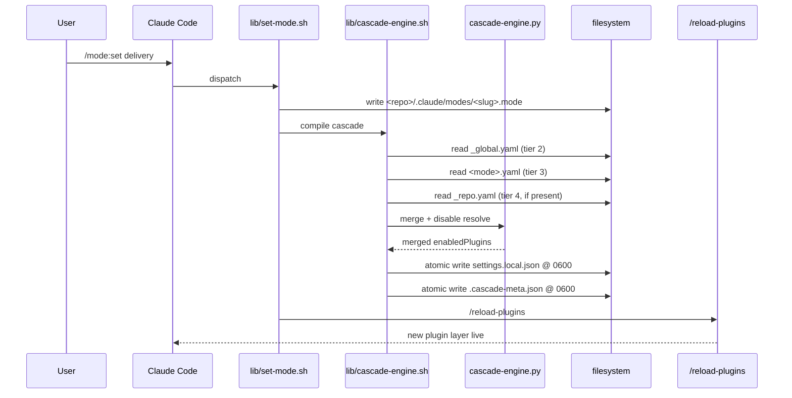

# claude-modes V2 — Architecture

> Companion to the [V2 plan](plans/2026-05-18-001-feat-modal-harness-v2-plan.md)
> and the [V2 brainstorm](brainstorms/2026-05-17-v2-modal-harness-requirements.md).
> Those documents are the source of truth; this file is the diagrammatic
> overview a new contributor reads first.

## Hook surface

V2 attaches to exactly three hook points. Each has a single
responsibility and a fail-open posture (an unexpected error in plugin
code MUST NOT block the user's prompt or fail the session).

| Hook              | Script                          | Purpose                                                                    | Requirement |
|-------------------|---------------------------------|----------------------------------------------------------------------------|-------------|
| UserPromptSubmit  | `scripts/on-prompt-submit.sh`   | Prose injection of active-mode framing into the `<system-reminder>` block | R25         |
| SessionStart      | `scripts/on-session-start.sh`   | Worktree reconciliation (R27) + foreign `_repo.yaml` scan (R20)            | R27, R20    |
| PostToolUse Write | `scripts/on-post-tool-use.sh`   | Consent prompt when a Write tool call lands a file in the user catalog     | R20         |

Dropped from V1: `PreToolUse`. The previous design used PreToolUse for
a delegation gate against the active mode; V2 absorbs that
responsibility into the cascade output's `enabledPlugins` map, so a
runtime gate is no longer needed.

## Cascade flow (end-to-end)

```
                       /mode:set delivery
                              │
                              ▼
                  ┌────────────────────────┐
                  │ lib/set-mode.sh        │ writes <repo>/.claude/modes/<slug>.mode
                  └────────────────────────┘
                              │
                              ▼
                  ┌────────────────────────┐
                  │ lib/cascade-engine.sh  │
                  └────────────────────────┘
                              │
       ┌──────────────────────┼──────────────────────┐
       │                      │                      │
       ▼                      ▼                      ▼
  Tier 2 read           Tier 3 read           Tier 4 read
  _global.yaml          <mode>.yaml           _repo.yaml          ← trust gate fires here
                                                                    on first-touch / hash-change
       │                      │                      │
       └──────────────────────┼──────────────────────┘
                              │
                              ▼
                  ┌────────────────────────┐
                  │ cascade-engine.py      │ additive merge + disable: subtraction
                  └────────────────────────┘
                              │
                              ▼
                  ┌────────────────────────────────────────────────┐
                  │ atomic write: <repo>/.claude/settings.local.json │
                  │ atomic write: <repo>/.claude/modes/.cascade-meta.json │
                  │ (both born at mode 0600)                       │
                  └────────────────────────────────────────────────┘
                              │
                              ▼
                       /reload-plugins   (in-session, no restart)
                              │
                              ▼
                    new enabledPlugins live
```

### Tier list

| Tier | Source                                            | Cardinality                 | Cascade-managed |
|------|---------------------------------------------------|-----------------------------|-----------------|
| 1    | `~/.claude/settings.json`                         | one per machine             | NO — user-owned |
| 2    | `~/.claude/modes/_global.yaml`                    | one per machine             | YES             |
| 3    | `~/.claude/modes/<mode>.yaml`                     | one per active mode         | YES             |
| 4    | `<repo>/.claude/modes/_repo.yaml`                 | zero or one per repo        | YES             |
| 5    | (reserved)                                        | —                           | —               |
| 6    | `<repo>/.claude/modes/<slug>.mode`                | one pointer per branch slug | YES             |

Only tiers 2–4 contribute payload. Tier 6 is the pointer that selects
which tier-3 mode is active. Tier 1 is read-only — the plugin never
writes to it.

### Cascade payload scope

| Field         | V2.0 in cascade? | Reason                                                                    |
|---------------|------------------|---------------------------------------------------------------------------|
| enabledPlugins| YES              | `/reload-plugins` hot-reloads this in-session (binary-verified 2.1.143)   |
| hooks         | NO               | Settings-level; requires restart; in-cascade would mislead users          |
| env           | NO               | Process env captured at startup; not hot-reloadable                       |
| permissions   | NO               | Not refreshed by `/reload-plugins`                                        |
| mcpServers    | NO (non-plugin)  | Non-plugin MCP servers require restart                                    |

This is the V2.0 scope cut — see the [plan's V2.0 Scope Cut Summary][cut]
section for the binary-inspection finding that drove it.

[cut]: plans/2026-05-18-001-feat-modal-harness-v2-plan.md#v20-scope-cut-summary-post-binary-verification-2026-05-18

### Mermaid sequence (alternative view)



## Trust gate (foreign `_repo.yaml`)

On first encounter of a `_repo.yaml` whose content hash is not in
`~/.claude/modes/.trusted-repos.txt`, the cascade engine pauses,
surfaces a named diff of what the file's `enabledPlugins` would
change, and asks the user to trust by repo path. The hash is
recorded; re-edits re-prompt.

Inspired by direnv's `.envrc` allow mechanism.

## Hook contract self-test posture

V1 left the PreToolUse hook contract change as documentation-only
mitigation (no runtime self-test). V2 drops PreToolUse and shifts
responsibility into the cascade — so the contract-change risk
narrows to UserPromptSubmit, SessionStart, and PostToolUse Write
shapes only.

A formal hook-contract self-test (U13/U14 in the original V1 plan)
is deferred to V2.0.1+. For now: the three V2 hook scripts have
explicit comments naming the Claude Code event JSON shape they
parse, so a future contract change surfaces as a parse error in
testing.

## Where to look next

- Source of truth on requirements: the [V2 brainstorm](brainstorms/2026-05-17-v2-modal-harness-requirements.md).
- Source of truth on unit boundaries and test scenarios: the [V2
  plan](plans/2026-05-18-001-feat-modal-harness-v2-plan.md), unit
  list U1–U13.
- V1 substrate (predecessor surface): git tag `v0.1.0-experiment`.
- Learnings captured during V2 build: `docs/solutions/` (seeded
  empty by U13).
