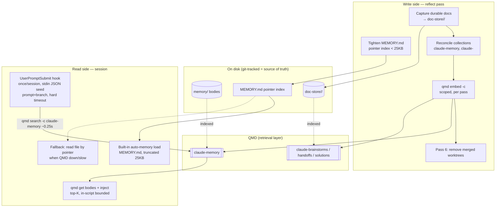

# feat: Reflect as a QMD-backed memory + document store

## Summary

Make `/reflect` the engine for a QMD-backed memory + document store. Tighten
`MEMORY.md` to a budgeted pointer index, stand up correctly-pointed Claude-owned
QMD collections via a programmatic reconciler (memory + one per doc-type),
capture durable docs into a type-segmented central store before worktrees are
cleaned up, and add a once-per-session seeded auto-recall hook that surfaces the
most relevant memory bodies on demand.

---

## Problem Frame

`MEMORY.md` is the only memory artifact Claude Code auto-loads each session, and
the binary truncates it at ~25 KB / 200 lines. It is currently ~55 KB / 264
lines, so its tail is silently dropped — memories below the cutoff are invisible.
The index is already pointer-shaped (`## heading` + `- See [file.md] — hook` per
entry); it overflows because each hook is multi-sentence. Meanwhile the documents
agentic coding generates — brainstorms, handoffs, `docs/solutions/` — scatter
across repos and worktrees, and worktrees get removed after their PR merges, so
those artifacts vanish.

QMD (`qmd` CLI, local markdown search) is the natural backing store, but research
found its existing `memory-dir`/`memory-root` collections point at
`~/.openclaw/workspace`, not the Claude memory dir — so QMD does not index Claude
memory at all today, and embedding is manual (`qmd embed`, no watch). The work is
to make the index small enough to load fully, move the verbose recall signal into
QMD-searchable bodies, back that with correctly-pointed collections kept fresh by
reflect, and capture durable docs centrally before cleanup.

---

## Key Technical Decisions

- **QMD is the retrieval layer; git-tracked files on disk are the source of
  truth.** Memory bodies and captured docs stay as `.md` files that QMD indexes.
  A stale or unavailable QMD degrades recall but never loses anything; the agent
  falls back to reading the file a pointer names (see origin: R2, R10).

- **`MEMORY.md` stays a pointer index, tightened to fit the 25 KB budget.** The
  format is already pointer-shaped; the change is collapsing each entry to one
  concise line and relocating the long hooks into the body files. Safe only
  because seeded recall (U5) backfills the signal the shortened hooks lose. The
  ~25 KB / 200-line truncation is a Claude Code built-in and cannot be enlarged —
  keeping the index small is the only lever.

- **One QMD collection per doc-type, defined programmatically.** A reconciler
  derives `claude-<type>` collections from the doc-store's subdirectory layout
  (plus `claude-memory`), ensures each exists and is embedded, and is idempotent.
  No hand-editing `index.yml`; new doc-types auto-register (see origin: R5a).

- **Reflect re-embeds with collection-scoped `qmd embed -c <name>`.** Scoping
  avoids the ~24.8 k-doc global backlog. Reflect is the freshness engine; there
  is no watch/daemon (see origin: R9).

- **Seeded recall fires from a `UserPromptSubmit` hook, once per session.** The
  built-in auto-memory load happens before any hook and can't be intercepted, and
  `SessionStart` can't see the user's prompt — so `UserPromptSubmit` (seeded by
  the first prompt + branch, guarded by a per-session flag) is the richest
  available injection point. The hook reads the prompt + session id from **stdin
  JSON** (not positional args) and injects via stdout-on-exit-0 (see origin: R3).

- **Seeded recall uses `qmd search` (BM25), not `qmd query`, on the prompt path.**
  `qmd query` loads three models (expansion + embed + rerank) and was measured at
  ~18–31s cold — unacceptable in a synchronous `UserPromptSubmit` hook that blocks
  the first prompt. `qmd search` is BM25-only (~0.25s cold) and is the right
  cost/latency point for a once-per-session lexical seed. The hook wraps the call
  in a hard timeout and degrades to nothing on timeout/error. Semantic (`vsearch`/
  `query`) recall stays available for explicit mid-session lookups, which are not
  on the blocking prompt path.

- **The hook does its own result bounding and body retrieval.** `qmd` silently
  swallows unknown flags, so `-n`/`--min-score` are not trusted as budget
  guarantees; the hook truncates to top-K and applies the score floor in-script.
  Search returns snippets + `qmd://` pointers, so the hook fetches each body with
  `qmd get` before injecting (it does not inject raw snippets).

- **Capture runs before worktree cleanup, inside reflect.** Durable-doc capture
  is ordered ahead of reflect's existing worktree-removal pass so worktree-
  authored docs are copied out before their worktree is deleted (see origin: R6).

- **Durable vs ephemeral is reflect's heuristic, no author marker.** Brainstorms,
  handoffs, `docs/solutions/` are durable; scratch plans, working notes, review
  logs age out in place (see origin: R7, R8).

- **Activation is automatic, not manual.** The two live-config edits that can't be
  done from an unmerged branch (wiring the hook into `settings.json`, patching
  `CLAUDE.md`) self-apply via reflect Pass 0, which runs an idempotent, version-
  marker-guarded `setup.sh` on its first run after install/update and self-wires a
  `SessionStart` re-check. This rides the already-wired reflect trigger, so there is
  no settings.json bootstrap chicken-and-egg. Collections are handled by Pass 8.

---

## High-Level Technical Design

Two sides meet at QMD: reflect writes (index hygiene, capture, embed); a hook
reads (seeded recall). Files on disk are authoritative throughout.



---

## Output Structure

```
~/.claude/  (repo root)
  doc-store/
    brainstorms/        → collection claude-brainstorms
    handoffs/           → collection claude-handoffs
    solutions/          → collection claude-solutions
  scripts/
    qmd-reconcile-collections.sh   (new — programmatic collection reconciler)
    memory-index-lint.sh           (new — index byte + line + parity check)
    migrate-memory-index.py        (new — one-time index migration)
    setup.sh                       (new — idempotent auto-activation orchestrator)
    apply-memory-protocol.sh       (new — idempotent CLAUDE.md section patch)
    install-seeded-recall-hook.sh  (new — idempotent settings.json hook wiring)
    test/
      harness.sh                   (new — pre-merge tests, isolated config)
  hooks/
    seeded-recall.sh               (new — UserPromptSubmit seeded recall, qmd search)
  skills/reflect/SKILL.md          (rewritten — write-side passes, renumbered)
  CLAUDE.md                        (Memory Protocol update)
  settings.json                    (wire UserPromptSubmit hook)
```

The per-unit Files sections are authoritative; the implementer may adjust layout.

---

## Requirements

> Note: requirements are numbered R1–R9 **locally**. Origin requirements are cited
> as `origin: R-ID` in Key Technical Decisions and use a separate numbering — the
> two schemes do not overlap.

**Memory index and recall**

- R1. `MEMORY.md` is a one-line-per-entry pointer index under 25 KB; bodies stay
  as on-disk files, none lost in migration.
- R2. A `UserPromptSubmit` hook performs seeded recall once per session, scoped to
  the Claude memory collection, injecting top-K bodies as added context.
- R3. Recall degrades gracefully: when QMD is unavailable, the agent can still
  reach a body by the file path its pointer names.

**QMD collections and freshness**

- R4. A programmatic, idempotent reconciler maintains Claude-owned collections —
  `claude-memory` pointed at the real memory dir, and one `claude-<type>` per
  doc-type subdirectory — without touching openclaw or global collections.
- R5. Reflect re-embeds the affected collections with scoped `qmd embed -c <name>`
  at the end of each pass.

**Document store**

- R6. A type-segmented `doc-store/{brainstorms,handoffs,solutions,…}/` exists,
  git-tracked.
- R7. Reflect captures durable docs into the matching doc-store subdirectory
  before its worktree-cleanup pass runs; ephemeral docs are not captured.
- R8. Reflect classifies durable vs ephemeral by heuristic, with no author marker.

**Protocol**

- R9. `CLAUDE.md`'s Memory Protocol documents the pointer-index discipline, the
  save shape (write body file + add a one-line pointer), and QMD as the recall
  layer.

---

## Implementation Units

### U1. Tighten and migrate MEMORY.md to a budgeted pointer index

- **Goal:** `MEMORY.md` loads in full (< 25 KB) with one concise pointer line per
  memory; verbose hooks relocated to body files (where the recall signal lives).
- **Requirements:** R1
- **Dependencies:** U5 (seeded recall must exist before the verbose hooks are
  shortened — shortening removes recall signal from the only auto-loaded file, and
  U5 is what backfills it; sequencing U1 after U5 closes the regression window).
- **Files:** `projects/-Users-shawnroos/memory/MEMORY.md` (migrate),
  `scripts/memory-index-lint.sh` (new — size + line + parity check)
- **Approach:** Define the index line contract: `- [Title](file.md) — ≤1-line
  hook`, no per-entry `##` heading. Migrate all current entries to it, parity-
  checked against the body files in the memory dir (no entry dropped, every body
  still referenced). The long hooks are not deleted — their content already lives
  in the body files that QMD will index. `memory-index-lint.sh` asserts BOTH
  budget limits (the truncation is `~25 KB` *and* `200 lines` — bytes alone is
  insufficient, since entry growth can hit the line cap before the byte cap) plus
  entry/body parity, so future drift is caught. Because bodies are git-tracked the
  migration is reversible; if post-merge U5 proves inadequate, revert is clean.
- **Patterns to follow:** the existing `- See [file.md](file.md) — hook` shape in
  `MEMORY.md`; the index-pointer convention documented in `CLAUDE.md`.
- **Test scenarios:**
  - Covers R1. After migration, `wc -c MEMORY.md` < 25600 AND `wc -l MEMORY.md` ≤ 200.
  - Entry count equals body-file count in the memory dir (no memory lost).
  - Every `[file.md]` pointer resolves to an existing file.
  - `memory-index-lint.sh` exits non-zero on an over-budget fixture (one exceeding
    bytes, one exceeding lines) and zero on the migrated index.
- **Verification:** index under both limits, lint passes, all bodies still pointed to.

### U2. Programmatic QMD collection reconciler

- **Goal:** an idempotent script that ensures Claude-owned QMD collections exist,
  are correctly pointed, and are embedded — `claude-memory` plus one per doc-type
  subdirectory — leaving openclaw and global collections untouched.
- **Requirements:** R4, R5
- **Dependencies:** U3 (doc-store dirs must exist to derive per-type collections)
- **Files:** `scripts/qmd-reconcile-collections.sh` (new)
- **Approach:** Enumerate the memory dir and each `doc-store/<type>/` subdir. For
  each, ensure a collection named `claude-memory` / `claude-<type>` exists in
  `~/.config/qmd/index.yml` pointing at the correct absolute path with pattern
  `**/*.md`. **A guarded YAML upsert is the primary mechanism** — `qmd collection
  add <dir>` derives the collection name from the directory basename (yielding
  `brainstorms`, not `claude-brainstorms`) and eagerly indexes, so it cannot meet
  the `claude-`-prefixed naming contract the ownership scheme depends on. The
  upsert MUST: preserve existing key order, write atomically (temp file + rename),
  and never read or rewrite any collection whose name does not start with
  `claude-`. Re-running makes no duplicate entries and is a no-op when the owned
  collections already match. Then `qmd embed -c <name>` each owned collection.
  Print a summary of created/updated/embedded collections.
- **Patterns to follow:** `qmd embed -c <name>`, `qmd status`, `qmd collection
  list` (verified); the YAML shape of `~/.config/qmd/index.yml`; atomic-write
  (temp+rename) idiom.
- **Test scenarios (run against an ISOLATED config, never the live one — use a
  temp dir with its own `.qmd` via `qmd init`, or redirect `XDG_CONFIG_HOME`; the
  live `~/.config/qmd/index.yml` is shared with openclaw/Slate and must not be a
  test target):**
  - Covers R4. First run creates `claude-memory` + one collection per doc-type
    subdir, each pointing at the right absolute path, all `claude-`-prefixed.
  - Idempotency: a second run adds no duplicate entries and changes nothing.
  - Foreign safety: pre-seed the isolated config with a non-`claude-` collection
    (mimicking `memory-dir`); after a run it is byte-for-byte unchanged.
  - Adding a new `doc-store/<newtype>/` then re-running creates exactly one new
    `claude-<newtype>` collection.
  - Covers R5. After a run, `qmd search -c claude-memory` returns hits from a
    seeded memory file in the isolated index.
- **Verification:** collections correct in `qmd status`; reruns are no-ops; foreign
  collections untouched; no test mutates the operator's live qmd config.

### U3. Type-segmented doc-store scaffold

- **Goal:** `doc-store/{brainstorms,handoffs,solutions}/` exists and is git-tracked.
- **Requirements:** R6
- **Dependencies:** none
- **Files:** `doc-store/brainstorms/.gitkeep`, `doc-store/handoffs/.gitkeep`,
  `doc-store/solutions/.gitkeep`, `doc-store/README.md`
- **Approach:** Create the subdirectories with `.gitkeep`. `README.md` states the
  one-collection-per-subdir convention so the mapping is discoverable and adding a
  type is obvious.
- **Test scenarios:** `Test expectation: none — scaffolding/docs only.` (covered
  behaviorally by U2's per-type collection test and U4's capture tests.)
- **Verification:** the three subdirs exist and are tracked.

### U4. Reflect write-side passes (index hygiene, capture, embed)

- **Goal:** the reflect skill maintains the index budget, captures durable docs
  into the right doc-store subdir before worktree cleanup, and re-embeds via the
  reconciler — without breaking its silent 7-pass contract.
- **Requirements:** R5, R7, R8
- **Dependencies:** U1, U2, U3
- **Files:** `skills/reflect/SKILL.md`
- **Approach:** Insert new passes with an EXPLICIT renumber (the current skill is a
  fixed 7-pass sequence ending Pass 6 = worktree-cleanup, Pass 7 = log; "add passes
  before Pass 6" necessarily renumbers — do it deliberately, don't claim the
  numbering is preserved). New ordering: keep Passes 1–5; add **Pass 6 = index-
  budget** (run the U1 lint, tighten `MEMORY.md` on drift), **Pass 7 = durable-doc
  capture** (classify by the heuristic — brainstorms / handoffs / `docs/solutions/`
  = durable — copy durable ones into `doc-store/<type>/`), **Pass 8 = reconcile +
  scoped embed** (invoke `qmd-reconcile-collections.sh`); the old worktree-cleanup
  becomes **Pass 9** and log becomes **Pass 10**. Capture + embed therefore run
  before worktree-cleanup, so worktree-authored docs are copied out before removal.
  Keep silent-mode. The REFLECT.log tally line has a fixed field set
  (`updated/saved/merged/pruned/compounded/worktrees_removed`) that parsers key on —
  extend it additively with `captured=` and `embedded=` counts; document the schema
  change so any REFLECT.log reader is updated.
- **Execution note:** edit the skill prose precisely; this is a spec doc, not code
  — update every pass-number cross-reference and anchor consistently, and preserve
  the exception-conditions contract.
- **Patterns to follow:** the current 7-pass structure and REFLECT.log tally line
  in `skills/reflect/SKILL.md`; the worktree-cleanup rule it already encodes.
- **Test scenarios:**
  - Covers R7. A brainstorm authored under a worktree's `docs/brainstorms/` is
    copied to `doc-store/brainstorms/` during the pass, before worktree removal.
  - Covers R8. A scratch working note is classified ephemeral and not copied.
  - Covers R5. The pass invokes scoped embedding for the touched collections.
  - Ordering: capture provably precedes the worktree-cleanup pass.
  - The REFLECT.log tally still emits and now carries capture/embed counts.
- **Verification:** durable docs survive worktree removal; ephemeral ones don't;
  embed scoped; silent contract intact.

### U5. UserPromptSubmit seeded-recall hook

- **Goal:** once per session, surface the most relevant memory bodies by searching
  the Claude memory collection seeded by the first prompt + branch — fast enough
  not to stall the first prompt.
- **Requirements:** R2, R3
- **Dependencies:** U2 (the `claude-memory` collection must exist)
- **Files:** `hooks/seeded-recall.sh` (new), `settings.json` (wire UserPromptSubmit)
- **Approach:** A `UserPromptSubmit` hook that reads its input from **stdin JSON**
  (`.prompt`, `.session_id` via `jq`) — NOT positional args. A per-session flag
  file keyed on `session_id` guards it so it fires only on the first prompt. It
  builds a lexical query from the prompt + git branch and runs `qmd search -c
  claude-memory` (BM25, ~0.25s — NOT `qmd query`, which loads three models and
  stalls ~18–31s on the blocking prompt path), wrapped in a hard `timeout`. It
  does its OWN bounding in-script (truncate to top-K, apply a score floor) because
  `qmd` silently swallows unknown flags, so `-n`/`--min-score` are not trusted as
  guarantees. Search returns snippets + `qmd://` pointers, so the hook fetches each
  body with `qmd get` before emitting them as added context (stdout on exit 0).
  Staleness visibility: if `qmd status` reports pending embeddings for
  `claude-memory`, append a one-line "recall may be stale (N pending embed)" note
  to the injected context. If `qmd` is absent, errors, or times out, the hook exits
  0 silently — recall degrades to the manual pointer-index fallback, nothing breaks.
- **Patterns to follow:** existing hook wiring in `settings.json` (the
  `UserPromptSubmit` block already exists) and the once-per-session flag-file
  *guard* (not the `$1` input model) from `hooks/reflect-trigger.sh`; QMD JSON
  output shape and timings from U2's research.
- **Test scenarios (driven by invoking `seeded-recall.sh` directly with a fixture
  stdin JSON + a seeded isolated `claude-test` collection — see U7):**
  - Covers R2. First prompt of a session triggers one `qmd search` scoped to the
    memory collection; a fixture memory relevant to the prompt appears (as a fetched
    body, not a raw snippet) in the emitted context.
  - Once-per-session: a second invocation with the same `session_id` does not
    re-search (flag-file guard).
  - Bounding: with more than K matching fixtures seeded, at most K bodies are
    emitted and below-floor scores are dropped — verified by the script, not by
    trusting qmd flags.
  - Latency: the search path completes well under the timeout; the timeout path
    degrades to no output.
  - Covers R3. With `qmd` unavailable, the hook exits 0 and emits nothing; the
    pointer-index file path remains the manual fallback.
- **Verification:** fires once, scoped, fast (sub-second), self-bounded, fails safe.

### U6. CLAUDE.md Memory Protocol update

- **Goal:** document the new storage/recall model so the save convention agents
  follow stays correct.
- **Requirements:** R9
- **Dependencies:** U1, U2, U5
- **Files:** `CLAUDE.md`
- **Approach:** Update the Memory Protocol section: the index is a strict
  one-line-per-memory pointer list under budget; saving means write the body file
  then add a pointer line; QMD is the recall layer and reflect keeps it fresh;
  note the seeded-recall hook so the behavior is discoverable. Keep memory types
  unchanged.
- **Test scenarios:** `Test expectation: none — documentation. Verified by review
  for accuracy against U1/U2/U5 behavior.`
- **Verification:** protocol matches implemented behavior; no contradiction with
  the reflect skill.

### U7. Pre-merge test harness for the hook and reconciler

- **Goal:** make the value-carrying behaviors testable BEFORE merge, since the
  dev-loop caveat means the live `/reflect` and hooks can't be exercised in-
  worktree. Without this, U2/U5's behavioral assertions reduce to artifact
  inspection and ship on faith.
- **Requirements:** R2, R4, R5 (verification of)
- **Dependencies:** U2, U5
- **Files:** `scripts/test/harness.sh` (new), fixtures under `scripts/test/fixtures/`
- **Approach:** A self-contained harness that runs entirely against a throwaway,
  isolated qmd config (temp dir + `qmd init` or `XDG_CONFIG_HOME` redirection) and
  a seeded `claude-test` collection — never the live `~/.claude/` or
  `~/.config/qmd/`. It drives `seeded-recall.sh` directly with crafted stdin JSON
  (asserting: exactly one search per session id, top-K + score-floor bounding,
  bodies-not-snippets, timeout degradation, fail-safe on missing qmd) and drives
  `qmd-reconcile-collections.sh` (asserting: `claude-`-prefixed creation,
  idempotency, foreign-collection untouched, new-subdir auto-register). Empirically
  pins the qmd flag/latency facts the review flagged as unverified (which flags are
  honored on which subcommand) so they can't silently regress.
- **Execution note:** Start by writing the harness assertions as failing checks,
  then implement U2/U5 against them — this is the only pre-merge signal for the
  runtime behavior.
- **Patterns to follow:** the isolated-config approach verified in U2's research
  (`qmd init` shadows the global index); existing repo script conventions.
- **Test scenarios:** the harness IS the test surface; it must exit non-zero on any
  failed assertion and zero on a clean run. CI-style single entry point.
- **Verification:** `scripts/test/harness.sh` passes against the isolated config and
  leaves the operator's live qmd config untouched.

### U8. Automatic activation (setup + reflect Pass 0)

- **Goal:** the live-config changes self-apply after install/update — no manual
  install step.
- **Requirements:** R9 (activation of), R2, R4 (activation of)
- **Dependencies:** U4, U5, U6
- **Files:** `scripts/setup.sh` (new), `scripts/apply-memory-protocol.sh` (new),
  `skills/reflect/SKILL.md` (Pass 0)
- **Approach:** `setup.sh` is idempotent and version-marker-guarded (instant no-op
  once applied). On first run it: wires the seeded-recall `UserPromptSubmit` hook
  (reuses `install-seeded-recall-hook.sh`); self-wires a `SessionStart` hook that
  re-runs `setup.sh` (so activation stays applied automatically, hook-level);
  applies the Memory Protocol update to `CLAUDE.md` via `apply-memory-protocol.sh`
  (conservative section-splice — backs up, skips on ambiguous structure). Reflect
  Pass 0 runs `setup.sh`, riding the already-wired reflect trigger so there's no
  settings.json bootstrap chicken-and-egg. The marker is written only on full
  success, so a partial failure retries next run. Collections stay in Pass 8.
- **Patterns to follow:** the idempotent-installer + atomic-write idiom from
  `install-seeded-recall-hook.sh`; existing `settings.json` hook-group shape.
- **Test scenarios:** (harness, isolated `CLAUDE_HOME`)
  - setup wires the UserPromptSubmit seeded-recall hook and the SessionStart
    self-check into an isolated `settings.json`.
  - setup patches an isolated `CLAUDE.md`'s Memory Protocol section and preserves
    the following section.
  - setup writes the version marker; a second run is a no-op with no duplicate hook.
  - an ambiguous `CLAUDE.md` (zero/multiple Memory Protocol headings) is left
    untouched for manual application.
- **Verification:** activation is automatic and idempotent; nothing runs against
  live config during tests.

---

## Scope Boundaries

- The ~24.8 k-doc global QMD embedding backlog is left untouched; only Claude-owned
  collections are embedded.
- The existing openclaw collections (`memory-dir`, `memory-root`, `memory-alt`) are
  not modified or repointed.
- The memory-type taxonomy and reflect's prune/merge rules are unchanged.

### Deferred to Follow-Up Work

- Capturing additional doc-types beyond brainstorms / handoffs / solutions (e.g.
  plans, review artifacts) — the reconciler auto-registers any new subdir, so this
  is additive later.
- Tuning K / min-score for seeded recall against real usage.

---

## Risks & Dependencies

- **Dev-loop caveat (origin assumption).** The live `/reflect` and hooks load from
  the real `~/.claude/`, not this worktree, so end-to-end runtime behavior (cross-
  session recall, an actual reflect-triggered capture) cannot be exercised in-
  worktree — it goes live only after merge to `main`. Units are verified by
  artifact state, scoped script runs, and review; full runtime validation is
  post-merge.
- **Shared mutable config.** The reconciler (U2) writes the real
  `~/.config/qmd/index.yml`. It must match Claude-owned collections by `claude-`
  name prefix and never rewrite foreign entries; the idempotency + foreign-
  untouched tests are load-bearing.
- **Manual embedding.** No QMD watch/daemon exists; freshness depends on reflect
  running. Acceptable — reflect is trigger-driven and frequent.
- **Built-in truncation is immovable.** If the tightened index ever exceeds 25 KB
  or 200 lines again, the tail silently drops; the U1 lint (both checks) is the
  guardrail.
- **First-prompt latency.** Seeded recall is on the synchronous `UserPromptSubmit`
  path; `qmd query` (3-model, ~18–31s cold) would stall every first prompt.
  Mitigated by using `qmd search` (BM25, ~0.25s) + a hard timeout (U5). Accepted
  tradeoff: lexical-only seeding (semantic lookups stay available off the blocking
  path).
- **qmd silently swallows unknown flags.** `-n`/`--min-score` may be inert on a
  given subcommand, so they are NOT trusted for budget bounding; U5 bounds in-script
  and U7 pins which flags are actually honored. Re-confirm before relying on any
  qmd flag.
- **Stale-embed silent degradation.** A memory saved but not yet embedded is absent
  from seeded recall with no signal. Mitigated by U5 surfacing pending-embed count
  in the injected context; full mitigation is reflect embedding promptly (R5).

---

## Sources / Research

- `skills/reflect/SKILL.md` — current silent 7-pass skill (no budget, no QMD).
- `CLAUDE.md` Memory Protocol; `projects/-Users-shawnroos/memory/MEMORY.md`
  (~55 KB, already pointer-shaped) and the ~132 body files.
- `settings.json` — SessionStart/PostToolUse/PreToolUse hook wiring;
  `hooks/reflect-trigger.sh` — the `.reflect-pending` flag pattern.
- QMD CLI behavior, probed live during plan review (qmd 2.5.3):
  - `qmd embed -c <name>` (collection-scoped) and `qmd status` — confirmed.
  - `qmd collection add <dir>` exists but names the collection from the directory
    **basename** (no prefix) and eagerly indexes — so it CANNOT produce
    `claude-<type>` names; the reconciler uses a guarded YAML upsert instead.
  - Retrieval latency (cold, every new session): `qmd query` ~18–31s (loads 3
    models); `qmd vsearch` ~32s (loads embed model); `qmd search` (BM25) ~0.25s.
    Seeded recall must use `qmd search`.
  - `qmd` **silently swallows unknown flags** (exits 0, returns results), so
    "exit 0 with output" is NOT proof a flag is honored — `-n`/`--min-score` must
    be re-confirmed per subcommand (U7) or replaced by in-script bounding.
  - `qmd search`/`qmd query` return snippets + `qmd://` pointers; full bodies need
    `qmd get qmd://…`. `--format json` emits clean JSON on stdout (diagnostics →
    stderr).
  - Config at `~/.config/qmd/index.yml`; embedding is manual (no watch); a project-
    local `.qmd` (via `qmd init`) or `XDG_CONFIG_HOME` shadows the global config —
    the isolation path for tests.
  - The existing `memory-dir`/`memory-root`/`memory-alt` collections point at
    `~/.openclaw/workspace`, not the Claude memory dir.
- MEMORY.md auto-load + ~25 KB/200-line truncation are Claude Code built-ins
  (injected before hooks; not user-controllable).
- origin: `docs/brainstorms/2026-06-23-reflect-qmd-store-requirements.md`.
