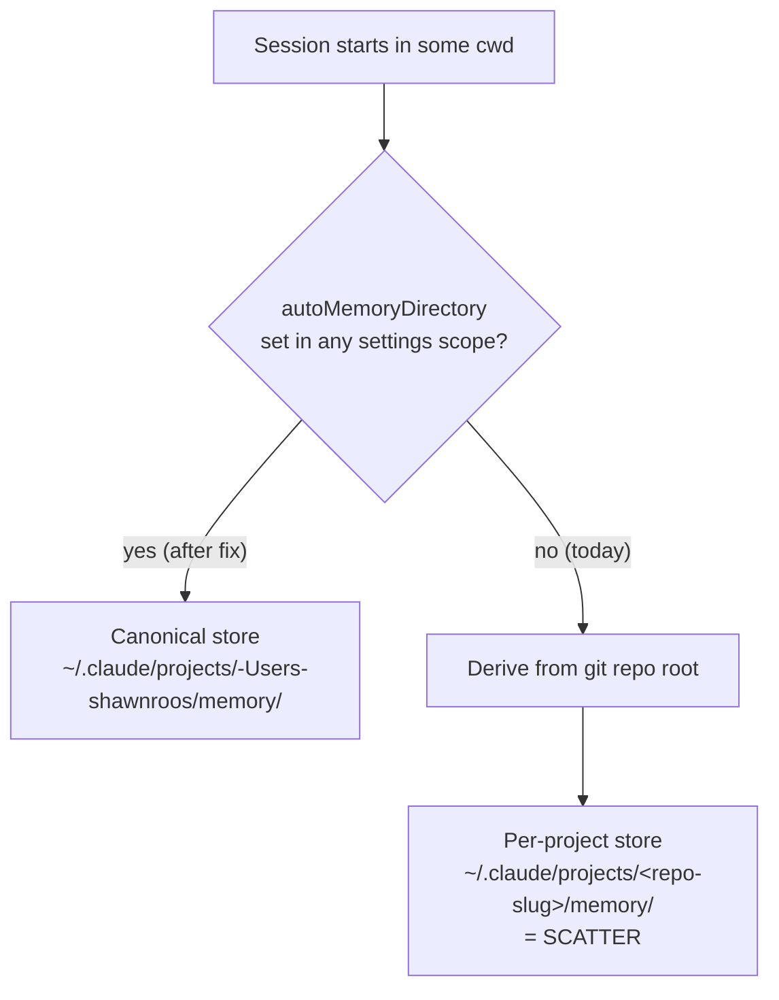

# fix: Pin native auto-memory directory to the canonical store

## Summary

Claude Code's built-in **auto-memory** feature derives its write directory from
the **git repository root**, so a session started inside any project repo writes
new memories to a per-project store (`~/.claude/projects/<repo-slug>/memory/`)
instead of the canonical reflect store (`~/.claude/projects/-Users-shawnroos/memory/`,
~135 files, indexed by `MEMORY.md`, embedded in the qmd `claude-memory`
collection). Memories scatter and never become recallable next session.

The fix is a **deterministic settings key**: Claude Code reads
`autoMemoryDirectory` from `settings.json` (any scope) and pins the auto-memory
directory to a fixed path regardless of cwd or git root. We write that key from
reflect's `scripts/setup.sh` — which already derives the canonical store path
from `$HOME` — so the pin is portable, idempotent, and re-runnable. We also fix
one misleading doc line and remove the stale empty split directory left by the
original misroute.

This **supersedes the originating handoff's approach.** The handoff proposed a
`SessionStart` hook plus a CLAUDE.md sentence — both *soft* prompt nudges that
would sit alongside the native pointer, not reliably override it. Verifying the
handoff's own "the native injection is in the binary/settings — verify, don't
take on faith" instruction surfaced the first-class config lever, which makes the
hook unnecessary. See **Key Technical Decisions → KTD1**.

---

## Problem Frame

**What's broken.** New memories written during a session land in a cwd/git-derived
per-project store rather than the single canonical store the reflect plugin
standardizes on. Confirmed live: this planning session (cwd = a worktree at
`~/projects/reflect/worktrees/memory-path-pin`) was handed the auto-memory path
`~/.claude/projects/-Users-shawnroos-projects-reflect/memory/` — the **main repo
root** slugified, not the canonical `-Users-shawnroos` store.

**Why it's the native feature, not reflect's scripts.** Per the official Claude
Code memory docs, auto-memory stores each project's notes at
`~/.claude/projects/<project>/memory/`, where `<project>` is "derived from the git
repository, so all worktrees and subdirectories within the same repo share one
auto memory directory." Every path-deriving script in reflect computes its slug
from `$HOME`, so reflect always resolves canonical regardless of cwd — those
scripts are correct and are **not** touched by this plan (see Scope Boundaries).
The misroute is entirely the native feature's git-root derivation.

**The lever.** The same docs state: "To store auto memory in a different location,
set `autoMemoryDirectory` in your `settings.json`. It is read from any settings
scope: user, project, local, policy, or `--settings`. The value must be an
absolute path or start with `~/`." This is a first-class, deterministic override —
exactly the canonical pin we need.

**Why now.** A real memory (`right-size-orchestration`) already misrouted to a
split dir and was recovered by hand. The mechanism is still live and will
re-scatter the next memory. This plan fixes the mechanism so the manual recovery
never has to repeat.

---

## Requirements

- **R1.** After the fix is applied, a Claude Code session started in **any**
  directory (home, an arbitrary project repo, or a git worktree) resolves its
  auto-memory directory to the canonical store
  `~/.claude/projects/-Users-shawnroos/memory/`.
- **R2.** The pin is written by `scripts/setup.sh` and is **portable** — both the
  derivation (from `$HOME`, honoring the existing `REFLECT_MEMORY_DIR` override)
  and the **stored value** stay machine-portable: when the target is under `$HOME`
  the key is written in `~/`-prefixed form (not a hardcoded-username absolute
  string), so a copied/synced `settings.json` does not silently point at a foreign
  path.
- **R3.** The pin is **idempotent and conservative** — re-running setup is a no-op
  when already pinned, and it never clobbers a pre-existing `autoMemoryDirectory`
  set to a different value (mirrors setup.sh's existing opt-in/back-up posture).
- **R4.** Writing the key **preserves** all other content of
  `~/.claude/settings.json` (e.g. `$schema`, `permissions`, `hooks`).
- **R5.** The misleading memory-path documentation in `skills/reflect/SKILL.md`
  names the canonical store and the pin, not a generic per-project `<project-slug>`.
- **R6.** The stale split directory
  `~/.claude/projects/-Users-shawnroos-projects-slate-plugins-work/` is confirmed
  gone. (Verified during planning: it no longer exists — already removed after the
  original hand-recovery. So this is a verify-absent check, not a deletion; only
  remove if it has unexpectedly reappeared and is empty.)
- **R7.** Setup's output never implies a fix that isn't active. The
  `autoMemoryDirectory` key only takes effect on Claude Code **≥ 2.1.74** (the key
  shipped after the auto-memory feature). `setup.sh` therefore prints an
  **unconditional** caveat line whenever it writes/confirms the pin — e.g. `pinned
  auto-memory dir <path>; effective on Claude Code >= 2.1.74` — so the operator is
  never told it's "done" without the version condition. No runtime version
  *detection* is required or attempted (see KTD7); the caveat is always shown.

---

## High-Level Technical Design

The pin short-circuits the native git-root derivation for every cwd at once —
that's why one settings key replaces the per-session hook the handoff imagined.



`scripts/setup.sh` already computes the canonical path:

```text
_slug="-${HOME#/}"; _slug="${_slug%/}"; _slug="${_slug//\//-}"
MEMDIR="${REFLECT_MEMORY_DIR:-$LIVE/projects/$_slug/memory}"
```

The new step writes `autoMemoryDirectory = $MEMDIR` into `$LIVE/settings.json`
(where `LIVE="${CLAUDE_HOME:-$HOME/.claude}"`, `setup.sh:22`). The key's value is
the **leaf** memory directory (docs: "The directory contains a `MEMORY.md`
entrypoint"), so `$MEMDIR` — which already ends in `/memory` — is the correct
value; there is no nested `/memory/memory/` risk. Directional only — exact merge
code is left to implementation.

---

## Key Technical Decisions

- **KTD1 — Use the `autoMemoryDirectory` settings key; drop the SessionStart
  hook.** The key is deterministic and first-class; a hook (or CLAUDE.md sentence)
  is a prompt nudge competing with the native pointer and cannot reliably win.
  Confirmed with the user (2026-06-26): drop the hook entirely, no CLAUDE.md
  routing nudge. (Supersedes `docs/handoff.md` open question #1 and #2 — the
  empirical "does additionalContext override the native pointer?" test is moot
  because we no longer rely on prompt-level override.)
- **KTD2 — `scripts/setup.sh` is the writer.** setup.sh already performs opt-in,
  backed-up, idempotent live edits to `~/.claude` (doc-store scaffold, CLAUDE.md
  protocol patch, qmd collections) and already derives `$MEMDIR` from `$HOME`.
  Adding the pin there keeps it portable and re-runnable, and it's invoked via the
  existing `/reflect-setup` command. A plugin can't ship a value into a user's
  global `settings.json`, so a setup-time write is the correct portable mechanism.
- **KTD3 — Pin to the *existing* canonical store**, not a new fixed path. The 135
  files, `MEMORY.md` index, and qmd `claude-memory` embeddings already live at
  `-Users-shawnroos/memory`. Targeting `$MEMDIR` (the same path setup.sh computes)
  means zero re-migration and no re-embedding.
- **KTD4 — Write at user scope, targeting `$LIVE/settings.json` (not a hardcoded
  `$HOME/.claude`).** User scope applies to all projects machine-wide (what R1
  demands) and is **not** subject to the workspace-trust-dialog gate the docs note
  for project/local scope, so the pin takes effect without a per-folder trust
  prompt. **Critically, the write target must be the `$LIVE` variable**
  (`LIVE="${CLAUDE_HOME:-$HOME/.claude}"`, `setup.sh:22`), not the literal home
  path — every other live edit in setup anchors to `$LIVE`, and `tests/harness.sh`
  achieves isolation **solely** by overriding `CLAUDE_HOME`. A helper that
  hardcodes `$HOME/.claude/settings.json` would be unreachable by the harness and
  would read-modify-write the operator's **real** config on every test run.
- **KTD5 — Use `python3` for a safe read-modify-write merge.** setup.sh already
  depends on `python3` (step 2). A JSON parse/merge/serialize preserves existing
  keys and avoids the fragility of text munging. Back up before writing, mirroring
  the `.bak` convention used elsewhere in setup. The merge must (a) treat
  parse-failure **and** valid-but-non-object JSON (`null`, `[]`, scalar) as "skip
  with warning, do not overwrite"; (b) treat an **empty/whitespace-only** file as
  the missing case (start from `{}` and add the key), since a 0-byte file is not
  valid JSON but is not a deliberate user config either.
- **KTD6 — Store the `~/`-prefixed form and compare *normalized* paths.** When the
  target is under `$HOME`, write the `~/`-prefixed value (docs permit it) so the
  stored artifact stays portable (R2). For the no-clobber check, compare
  **resolved/normalized** paths (expand `~`, strip trailing slash) rather than raw
  strings — otherwise a prior `~/`-form value and a freshly computed absolute form
  resolve to the same directory but mismatch as strings, making setup warn and
  refuse to reconcile on every future run. Out-of-`$HOME` `REFLECT_MEMORY_DIR`
  overrides fall back to the absolute form.
- **KTD7 — Unconditional version caveat, not runtime version detection.** R7's goal
  ("success output never implies an inactive fix") is met by *always* printing the
  `>= 2.1.74` caveat line, not by branching on a detected version. Runtime
  detection was rejected: `setup.sh` has no version-detection precedent; the obvious
  `claude --version` reports the binary on `PATH`, which is not necessarily the
  in-session client (multiple installs, wrapper invocation, running from inside a
  session); "probe for key support" is unbuildable from a shell without starting a
  session; and a failed or false-negative detection would *suppress* the warning
  precisely on an affected client — recreating the silent re-scatter R7 exists to
  prevent. The unconditional caveat has zero false-negatives and is trivially
  assertable in the harness.

---

## Implementation Units

### U1. Pin `autoMemoryDirectory` from setup.sh

**Goal:** Add an idempotent, conservative step to `scripts/setup.sh` that writes
`autoMemoryDirectory = $MEMDIR` into `~/.claude/settings.json`, plus harness
coverage proving the behavior.

**Requirements:** R1, R2, R3, R4, R7.

**Dependencies:** none.

**Files:**
- `scripts/setup.sh` (add the new step; reuse the existing `$MEMDIR` / `$LIVE`
  variables and the back-up + opt-in idiom)
- `tests/harness.sh` (add a `== autoMemoryDirectory pin ==` section)
- Optionally a small helper invoked by setup (e.g. `scripts/pin-auto-memory-dir.py`
  or an inline `python3 - <<'PY'` heredoc) — implementer's call; keep it consistent
  with how step 2 shells into `migrate-memory-index.py`.

**Approach:**
- Compute the target from the already-derived `$MEMDIR` (honors
  `REFLECT_MEMORY_DIR`). Write it in `~/`-prefixed form when it is under `$HOME`,
  else absolute (KTD6) — both are valid per the docs.
- Write target is `$LIVE/settings.json` (the `$LIVE` variable, `setup.sh:22`), and
  the helper must accept that path as a parameter/env var so the harness can point
  it at an isolated `CLAUDE_HOME` (KTD4). Never hardcode `$HOME/.claude`.
- Read `$LIVE/settings.json`. Cases: **missing or empty/whitespace-only** → start
  from `{}` and add the key; **valid JSON object** → merge the key; **parse error
  or valid-but-non-object JSON** (`null`, `[]`, scalar) → skip with a warning,
  never overwrite (KTD5).
- Set `autoMemoryDirectory` only when **absent** or already **equal to the target
  after normalization** (expand `~`, strip trailing slash — KTD6). If present and
  normalizes **different**, leave it unchanged and emit a warning (no-clobber — a
  deliberate user choice wins).
- Back up the file before the first modification, and preserve all existing keys.
- Write with the same fail-open tone as the rest of setup (a failure here prints a
  recoverable message and does not abort the run).
- **Version caveat (R7, KTD7):** whenever the pin is written or confirmed, print an
  **unconditional** caveat line (e.g. `pinned auto-memory dir <path>; effective on
  Claude Code >= 2.1.74`). Do **not** branch on a detected version — the
  auto-memory *feature* shipped at 2.1.59 but the `autoMemoryDirectory` *key* only
  at 2.1.74, and unreliable shell-side detection would suppress the caveat on
  exactly the affected clients (see R-risk2, KTD7).

**Patterns to follow:**
- `scripts/setup.sh:34-43` — the step-2 pattern: guard on file existence, shell
  into a `python3` helper, print a skip/fail message on non-zero, never abort.
- `scripts/setup.sh:22-26` — `$LIVE` / `$_slug` / `$MEMDIR` derivation (reuse, do
  not recompute).
- The conservative "back up, skip on ambiguous structure" posture of step 3
  (`apply-memory-protocol.sh`).

**Test scenarios** (add to `tests/harness.sh`, run against an isolated
`CLAUDE_HOME` temp dir so the live config is never touched — mirror the harness's
existing isolation). Note: scenarios asserting a **warning** must capture stderr
(e.g. `out=$(... 2>&1)`); the existing `run_setup` helper (`harness.sh:196`)
discards stdout+stderr, so reusing it would make the warning unassertable.
- **Writes when key absent:** settings.json exists with other keys but no
  `autoMemoryDirectory` → after setup, key is present and normalizes to `$MEMDIR`,
  and the pre-existing keys are still present.
- **Creates file when missing:** no `settings.json` at all → after setup, file
  exists as valid JSON containing the pin.
- **Empty file treated as missing:** a 0-byte / whitespace-only `settings.json` →
  after setup, file is valid JSON with the pin present (NOT skipped as malformed).
- **Idempotent:** running setup twice → second run makes no change (no duplicate,
  no spurious warning, no error).
- **No-clobber (foreign value):** settings.json pre-set with `autoMemoryDirectory`
  = a path that normalizes **different** → value unchanged, warning emitted
  (assert via captured stderr).
- **Normalized equality (no false clobber):** pre-set with the `~/`-form of the
  same target while setup computes the absolute form (or vice versa) → treated as
  equal, no warning, no rewrite.
- **Honors override:** with `REFLECT_MEMORY_DIR` exported to a custom path → the
  written value resolves to that custom path, not the default `$HOME`-slug path.
- **Preserves structure:** a settings.json containing `$schema`, `permissions`, and
  `hooks` → after setup, all three keys survive intact alongside the new key.
- **Malformed / non-object JSON safety:** settings.json is invalid JSON, OR valid
  but a non-object (`null`, `[]`, a scalar) → setup leaves it unchanged and warns
  (assert via captured stderr); does not crash.
- **Live config untouched:** during the whole run, assert no file is created or
  modified under the real `$HOME/.claude` (isolation proof — verifies the harness's
  `CLAUDE_HOME` override actually redirects the write).
- **Version caveat always emitted:** any run that writes or confirms the pin prints
  the `>= 2.1.74` caveat line (assert via captured stdout) — unconditional, so it
  is assertable regardless of the test client's version.

**Verification:** `tests/harness.sh` passes the new section. Scope note: this
section proves the **writer** (setup.sh merges the key correctly and safely) — it
does **not** prove the key changes Claude Code's runtime behavior. That is the
deferred e2e checklist below.

---

### U2. Fix the misleading memory-path doc line

**Goal:** Replace the generic per-project `<project-slug>` phrasing with the
canonical store and a one-line note that the pin makes it cwd-independent.

**Requirements:** R5.

**Dependencies:** none (parallel-safe with U1).

**Files:**
- `skills/reflect/SKILL.md` (line 8 — the `REFLECT.log` location sentence)

**Approach:** Name the canonical store
(`~/.claude/projects/-Users-shawnroos/memory/`, or describe it as the
`$HOME`-derived canonical store to stay portable in prose) and note that reflect
pins the native auto-memory directory there via `autoMemoryDirectory`, so the path
is the same regardless of which project the session started in. `SKILL.md:8` is the
only code occurrence of the `<project-slug>` phrasing (the other hit is
`docs/handoff.md`, which is the source brief and is not a shipped doc).
`docs/memory-protocol-update.md` already names the canonical store correctly and
needs no change.

**Patterns to follow:** the existing canonical-store phrasing already used in
`docs/memory-protocol-update.md:51`.

**Test scenarios:** `Test expectation: none -- documentation-only change, no
behavioral surface. Verification is a re-grep (below).`

**Verification:** `grep -rn "project-slug" skills/` returns no matches; the edited
sentence reads correctly and names the canonical store.

---

### U3. Verify the stale split directory is gone

**Goal:** Confirm the leftover split store from the original misroute is absent.

**Requirements:** R6.

**Dependencies:** none (parallel-safe).

**Files:**
- `~/.claude/projects/-Users-shawnroos-projects-slate-plugins-work/` (live
  filesystem, outside the repo — not a tracked file)

**Approach:** This is a **verify-absent** check, not a deletion. Confirmed during
planning that the directory no longer exists (it was removed after the original
hand-recovery). So the action is: confirm absence; only if it has unexpectedly
reappeared **and** is empty, remove it; if it reappeared with contents, stop and
surface rather than deleting. One-time live-state check performed during `ce-work`,
not committed.

**Test scenarios:** `Test expectation: none -- one-time live-filesystem check, not
a code path.`

**Verification:** `ls ~/.claude/projects/ | grep slate-plugins-work` returns
nothing; the canonical store still has its ~135 files.

---

## Verification

Two layers, with distinct timing:

**Automated (in U1, runs in `ce-work`):** the harness proves only the **writer** —
that `setup.sh` merges the key safely. It does **not** prove the key changes Claude
Code's runtime behavior.

**Operator acceptance gate (run from the worktree, *before* merge):** the behavior
the entire pivot rests on is docs-asserted and must be confirmed at runtime. This
checklist is the real gate — a green harness alone must not be read as a working
fix. It is runnable pre-merge because `setup.sh` runs off this branch (no merge
required to exercise it):

1. **Apply the pin from the branch:** run `bash scripts/setup.sh` (or
   `/reflect-setup`) so `$LIVE/settings.json` gains `autoMemoryDirectory`. *This is
   a runtime action, not part of the diff — merging the code alone activates
   nothing (see Out-of-Repo Deliverable).*
2. **Version:** confirm the client is ≥ 2.1.74 (the key's version), not merely
   ≥ 2.1.59 (the feature's). Below 2.1.74 the pin is inert (R7 / R-risk2).
3. **Override semantics:** start a **fresh** session in a cwd that currently
   misroutes (e.g. this repo, which injected `-Users-shawnroos-projects-reflect/memory/`
   during planning) and confirm the injected auto-memory path is now the canonical
   store — i.e. the key actually overrides git-root derivation.
4. **User-scope read:** confirm the key set in user `settings.json` is honored with
   no workspace-trust prompt (KTD4).
5. **Granularity:** confirm new memory files land **directly** in `$MEMDIR`, not a
   nested `…/memory/memory/` or per-project subdir (docs indicate leaf semantics;
   verify empirically).

A pass here is deterministic — it does not depend on the model choosing to honor a
prompt instruction, which is the whole reason for preferring the settings key. But
the determinism is in the *mechanism*, not yet in our *evidence*: until this
checklist runs, items 2–5 are docs-asserted. Run it before treating the work as
done.

---

## Scope Boundaries

**In scope:** the `autoMemoryDirectory` pin via setup.sh + harness test (U1), the
SKILL.md doc fix (U2), and the split-dir cleanup (U3).

### Non-goals (out of this product's identity)
- **Do not edit the `$HOME`-slug derivation in any reflect script.** `setup.sh`,
  `memory-index-lint.sh`, `qmd-reconcile-collections.sh`, and
  `migrate-memory-index.py` all derive their slug from `$HOME` and are already
  correct. The handoff verified this; this plan does not touch them.
- **No SessionStart hook** and **no CLAUDE.md routing nudge.** Superseded by KTD1.
- **No change to the qmd collections, MEMORY.md format, or doc-store** — the pin
  points at the existing store, so none of that moves.

### Deferred to Follow-Up Work
- **Consistency sweep of `docs/memory-protocol-update.md`** to mention the
  `autoMemoryDirectory` pin alongside its canonical-store reference. It is already
  correct about the path, so this is a nice-to-have, not required for the fix.
- **Surfacing the pin in a README / setup output line** so operators see that
  setup pinned their auto-memory directory. Optional polish.
- **Upgrade nudge for already-installed users.** A user who installed reflect
  before this change gets the pin only when they next run `/reflect-setup`; nothing
  prompts them. A future enhancement (e.g. a session-start nudge when the pin is
  missing or stale) would close that gap. Out of scope for the single-operator fix
  here.

---

## Risks & Dependencies

- **R-risk1 — Editing live global `settings.json`.** setup.sh would
  read-modify-write the user's global config. Mitigation: JSON-parse merge (not
  text munging), back up first, no-clobber on a normalized-different existing
  value, skip on parse-error/non-object JSON, treat empty as missing, fail-open —
  and target `$LIVE` so the harness's `CLAUDE_HOME` isolation actually redirects
  the write (a hardcoded `$HOME/.claude` would corrupt live config on every test
  run). All covered by U1 test scenarios, including a "live config untouched"
  assertion.
- **R-risk2 — The `autoMemoryDirectory` key is newer than the auto-memory feature
  (the dangerous-window risk).** The feature shipped at **2.1.59**; the key only at
  **2.1.74** (verified against the Claude Code changelog). So a client in the
  **2.1.59–2.1.73** band actively scatters memory to git-root stores *while
  silently ignoring the pin*. This is **not** "harmless / no worse than today" —
  today the operator knows it's broken; post-fix they'd believe it's solved while
  it silently re-scatters. Mitigation (R7, KTD7): setup prints an **unconditional**
  `>= 2.1.74` caveat line whenever it writes the pin — no runtime version detection
  (which would be unreliable from a shell and could suppress the caveat on exactly
  the affected clients), just an always-present condition so success output never
  implies an inactive fix. (This machine is 2.1.193, so the fix works here; the
  risk is to R2 portability and any client/downgrade in that band.)
- **Dependency — `python3`** (already a setup.sh dependency) for the JSON merge.

---

## Out-of-Repo Deliverable (reviewer note)

The behavioral fix ultimately lives in the operator's global
`~/.claude/settings.json`, which is **not** part of this repo's git history. The PR
diff contains only `scripts/setup.sh` + `tests/harness.sh` + `skills/reflect/SKILL.md`.
The settings key lands when `setup.sh` / `/reflect-setup` runs, and the split-dir
check (U3) is a one-time live-filesystem action. A reviewer should understand the
diff is the *mechanism*; the runtime effect is applied at setup time, not by
merging the PR. That setup run is **not** optional cleanup — it is step 1 of the
Verification acceptance gate, which is run from the worktree **before** merge (the
script runs off the branch). Merging the code alone changes nothing until that run
happens.

---

## Open Questions / Deferred

- **Exact merge helper shape** (inline `python3` heredoc vs a new
  `scripts/pin-auto-memory-dir.py`) — implementer's call at execution, kept
  consistent with how step 2 shells into `migrate-memory-index.py`.
- **Whether to print the resolved pin path in setup output** — minor UX; decide
  during implementation.

---

## Sources & Research

- `docs/handoff.md` — originating brief (diagnosis + recovery context). This plan
  supersedes its hook-based approach per KTD1.
- Official Claude Code memory docs (`code.claude.com/docs/en/memory.md`) —
  "Storage location": git-root-derived `<project>` path; `autoMemoryDirectory`
  settings-key override; absolute-or-`~/` value rule; leaf-directory semantics
  ("contains a `MEMORY.md` entrypoint"); worktrees share one dir; user-scope reads
  bypass the workspace-trust gate.
- Claude Code changelog (`~/.claude/cache/changelog.md`) — auto-memory feature at
  **2.1.59**, worktree-shared auto-memory at 2.1.63, `autoMemoryDirectory` key at
  **2.1.74**. Establishes the 2.1.59–2.1.73 dangerous window (R-risk2 / R7).
- `scripts/setup.sh:22-26, 34-43` — `$MEMDIR` derivation and the step-2
  helper-shell pattern U1 mirrors.
- `tests/harness.sh` — isolated-`CLAUDE_HOME` test convention U1's scenarios follow.
- Live confirmation — this session's injected auto-memory path was
  `~/.claude/projects/-Users-shawnroos-projects-reflect/memory/` (main-repo-root
  derived), reproducing the scatter from a worktree cwd.
