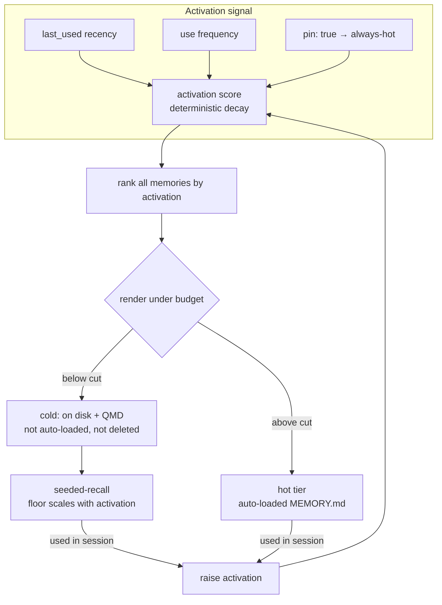

# Memory Index Self-Heal - Plan

**Product Contract preservation:** changed from the requirements-only origin. The capacity-driven prune (delete) is reframed as non-destructive accessibility decay; the recoverability requirement and its `.trash/`/git-track machinery are dropped (nothing is deleted for capacity). An activation-score model was added. Reframe steered and confirmed by the user mid-planning.

## Goal Capsule

- **Objective:** Keep the auto-loaded memory index (`MEMORY.md`) under the native load budget on its own, so the "compact MEMORY.md" nag never fires and no memory is lost — by rendering the index as the highest-activation memories that fit, and letting the rest fade in accessibility rather than be deleted.
- **Product authority:** Shawn (sole user of this memory system).
- **Stop conditions / gating:** The accessibility system (Phase C) does not ship until the Phase B spike proves cold-tier recall is reliable. Demotion is non-destructive, but a memory that can't be recalled is effectively unreachable until the recall path is fixed.
- **Execution profile:** Phased. Phase A (foundation) and Phase B (spike) are independent; Phase C is gated on Phase B's data.

---

## Product Contract

### Summary

Make the reflect memory index self-managing by modeling accessibility the way memory does: a memory's reachability decays with disuse and is restored by use, instead of being deleted. The auto-loaded `MEMORY.md` becomes a projection — the highest-activation memories that fit the budget. Everything below the cut stays on disk and in QMD, reachable by recall, just not auto-loaded. The nag stops because the hot tier is bounded by construction, regardless of total memory count.

### Problem Frame

`MEMORY.md` is the only memory artifact Claude Code auto-loads each session, and the binary silently truncates it past ~24.4 KB. The index is already over that cutoff (152 entries, ~25 KB), so the lowest-listed memories risk dropping out of recall with no signal. The cost is invisible: a memory that exists on disk but never loads.

The index grows linearly with memory count, and the existing levers don't bound it. Index-tighten (Pass 6) only shrinks per-line hooks — at ~150 entries the scaffold alone busts the target, so tightening bought ~4 KB and the nag returned. The deterministic prune (Pass 4) would shrink the index by deleting, but deletion is both unsafe (the memory dir is git-untracked, so deletions are unrecoverable) and *wrong as a default* — it judges staleness on `last_used`, which is absent for ~25 entries because they were never cited, not because they're stale. Deleting those loses real knowledge.

The reframe: capacity pressure shouldn't cause deletion at all. A memory that hasn't been used in months isn't worthless — it's just less reachable. Model that directly.

### Key Decisions

- **Accessibility decays; memories aren't deleted for capacity.** The default lifecycle is fade, not delete. A memory below the hot cut stays on disk and in QMD; it costs nothing until retrieved. This dissolves the safe-deletion problem entirely — no `.trash/`, no git-tracking, no recoverability question — because demotion is non-destructive and self-reversing.

- **`MEMORY.md` is a projection, not a maintained list.** The hot tier is the budget-truncated ranking of memories by activation. There is no explicit "demote" operation — a memory is hot iff its activation puts it above the budget cut. Re-accessing it raises activation, so it re-enters on the next render.

- **Activation is a deterministic decay function.** Reachability is computed from recency of `last_used`, use frequency, and `pin` — inspectable arithmetic, not an ML score. `pin: true` means always-hot. This keeps the system auditable ("why is this memory here?") and tunable.

- **The "more intention to reach" proxy is a recall floor that scales with activation.** A faded memory needs a stronger, more specific cue to surface than a fresh one. Fresh memories surface on a loose match; faded ones only on a strong match or a deliberate search. The exact curve is tuned by the spike.

- **Recall quality gates the system.** Today's recall surfaces cold memories 0/10 on realistic prompts (BM25 over the full prompt is AND-over-content-terms). The accessibility system cannot ship until the spike proves a recall path that works — otherwise fading a memory makes it unreachable.

- **Deletion narrows to correctness, not capacity.** A contradicted or duplicate memory is merged or retired so it can't resurface and mislead. That's the only deletion path, and it's rare.

### Requirements

**Accessibility model**

- R1. Each memory carries a deterministic activation score computed from recency of `last_used`, use frequency, and `pin` status. No ML; `pin: true` is always-hot.
- R2. `MEMORY.md` renders the highest-activation memories that fit within the recalibrated budget. The hot tier is this budget-truncated ranking, not a hand-maintained list.
- R3. Memories below the hot cut stay on disk and in QMD ("cold") and are never deleted for capacity. Being cold is the absence of a hot slot, not an operation on the file.
- R4. Re-accessing a cold memory raises its activation so it re-enters the hot tier on the next render. Accessibility is self-reversing.
- R5. A faded memory requires a stronger retrieval cue to surface than a fresh one — the recall floor scales with activation. (Exact curve set by the spike.)

**Recall (prerequisite)**

- R6. Cold-tier recall surfaces a relevant memory from a realistic, paraphrased prompt — not today's full-prompt BM25, which recalls 0/10. This gates the accessibility system: no aggressive fading until recall is proven.

**Activation signal**

- R7. `last_used` reflects actual use, not just use observed at a reflect trigger boundary. Absent `last_used` is treated as "unknown" — a neutral activation seed — never as maximally stale.

**Budget guardrail**

- R8. The lint budget (`scripts/memory-index-lint.sh`) matches the real native load cutoff, measured against the hot tier, so a passing lint guarantees the nag will not fire.
- R9. The index self-heals silently — reflect (and a save-time pass) re-render the hot tier under budget without surfacing the nag.
- R10. The render stays current enough that the index can't blow past budget between reflect trigger boundaries.

**Correctness retirement**

- R11. Contradicted or duplicate memories are merged or retired so they can't resurface and mislead. This is the only deletion path, driven by correctness, not capacity.

### Acceptance Examples

- AE1. **Covers R2, R3.** **Given** 300 total memories, **when** a session starts, **then** `MEMORY.md` loads only the highest-activation set that fits the budget, and the rest stay on disk and findable via QMD, absent from the auto-loaded index.
- AE2. **Covers R4.** **Given** a cold memory that hasn't loaded in months, **when** it's recalled and used in a session, **then** its activation rises and it appears in the hot tier on the next render.
- AE3. **Covers R7.** **Given** a memory used several times but whose `last_used` was never written, **when** activation is computed, **then** it gets a neutral seed and is not treated as maximally faded.
- AE4. **Covers R5.** **Given** a fresh memory and a faded memory that both loosely match a prompt, **when** recall runs, **then** the fresh one surfaces on the loose match while the faded one surfaces only on a stronger, more specific cue.
- AE5. **Covers R8, R9.** **Given** the hot tier grows to the native cutoff, **when** reflect runs, **then** it re-renders under budget silently and the native nag never appears.
- AE6. **Covers R1.** **Given** a `pin: true` memory last used a year ago, **when** activation is computed, **then** it stays in the hot tier regardless of decay.

### Scope Boundaries

**Deferred for later**
- Backfill of `last_used` for existing entries from `MEMORY_USE.log` history to seed activation more accurately on the legacy set.
- Spreading activation (a recalled memory boosting topically-linked neighbors via `[[wikilinks]]`). The mind analogy extends here, but it's a refinement, not v1.

**Outside this scope**
- Capacity-driven deletion and its recoverability machinery (`.trash/`, git-tracking the memory dir). The reframe removes the need.
- Muting the native nag from reflect — confirmed impossible (binary-emitted). The only lever is keeping the hot tier small.
- The "where memories get written" problem — owned by the sibling `feature/memory-path-pin` / canonical-store work.

### Dependencies / Assumptions

- **Seeded-recall is the cold-tier recall path, and its current retrieval is inadequate.** `hooks/seeded-recall.sh` runs once per session (UserPromptSubmit) and feeds the full user prompt to `qmd search` (BM25). The spike (2026-06-28) showed 0/10 recall on realistic prompts; `qmd vsearch` (vector) recalled the same targets in top-3 but takes ~4.6–5.9s (the hook avoids `qmd query` because it stalls ~18-31s). The recall path must change (R6), under that latency constraint.
- **`pin: true` is a real, honored frontmatter field** — read by Pass 4 today; reused as the always-hot escape hatch.
- **QMD is the recall layer for cold bodies** and must be embedded/current for vector recall (if the spike picks a vector path). When QMD is unavailable, cold memories are reachable only by direct file path — acceptable degradation.
- **`migrate-memory-index.py` already owns the index render + parity** (shrink loop, drops dead links, adds orphans). The activation-ranked render extends this machinery rather than replacing it.

### Outstanding Questions

**Resolve via the Phase B spike**
- Q1. Which cold-tier retrieval mechanism satisfies R6 under the hook's latency budget — `qmd vsearch` + bumped timeout, a warm `qmd mcp --http --daemon`, or prompt keyword-extraction feeding BM25? Measured on recall@k and latency.
- Q2. Is accessibility a continuous activation score or discrete bands (hot/warm/deep)? Measured on recall/precision at budget. Plan both as candidates.
- Q3. The decay curve and the activation→recall-floor mapping (half-life, weights on recency vs frequency, floor shape). Tuned against the labeled eval set.

**Deferred to implementation**
- Q4. Cadence mechanism for R10: a lightweight save-time render pass vs tightening the existing reflect trigger set.

### Sources / Research

- `skills/reflect/SKILL.md:70-87` — Pass 4 prune rule (reframed by this plan: capacity deletion → accessibility decay).
- `skills/reflect/SKILL.md:96-102` — Pass 6 index-tighten (calls lint, tightens hooks only).
- `skills/reflect/SKILL.md:54-60` — Pass 2 use-tracking (writes `last_used` + `MEMORY_USE.log` at trigger boundaries only).
- `scripts/memory-index-lint.sh:52-58` — budget enforcement (`MAX_BYTES=25600`, `MAX_LINES=200`); exit codes.
- `scripts/migrate-memory-index.py:143-147` — index render + shrink loop (cap 200→30); parity at lines 106-130.
- `hooks/seeded-recall.sh:114-141` — query = full prompt + branch fed to `qmd search` (BM25); the recall path R6 must change.
- `.claude/hooks/hooks.json:15-48` — reflect trigger cadence (PR / ExitPlanMode / TodoWrite-all-done).
- Seeded-recall spike (2026-06-28): 10 paraphrased prompts, live `claude-memory` collection. `qmd search` recalled 0/10; `qmd vsearch` recalled targets in top-3; `qmd vsearch` ~4.6–5.9s, `qmd query` ~19.5s. Confirms BM25 AND-over-content-terms (`crop overlay zxqw` → 0).
- Activation/decay model analogue: ACT-R base-level activation (reachability as a decaying function of recency + frequency, restored by use). Used as a design frame, not a literal implementation.

---

## Planning Contract

### Key Technical Decisions

- KTD1. **Decay, not delete.** Capacity pressure demotes by ranking, never by removing a file. Demotion is non-destructive and self-reversing on recall. This removes the recoverability blocker that stalled the original plan. Deletion survives only as a rare correctness operation (R11).
- KTD2. **The index is a pure projection of activation.** `render(memories sorted by activation, truncated at budget)`. No stored hot/cold state to drift; the hot set is recomputed each pass. Re-access changes the score, the next render reflects it. Stateless and auditable.
- KTD3. **Spike-first on two axes.** Recall mechanism (Q1) and accessibility granularity + decay curve (Q2, Q3) are decided by the Phase B eval harness on real data, not chosen up front. BM25's 0/10 result is why nothing is committed before measurement.
- KTD4. **Recall lands before fading.** Phase C demotes memories only after Phase B's recall path is wired and verified (R6). A non-destructive demotion is still a recall problem if the memory can't be surfaced.
- KTD5. **Activation is deterministic arithmetic.** A computed function of `last_used` recency, use count, and `pin` — no model inference. Absent `last_used` seeds a neutral value (R7), not a maximal-decay value, so never-cited-but-valuable memories don't sink purely from missing telemetry.
- KTD6. **Phased delivery.** Foundation (budget recalibration, trustworthy activation signal) and the spike are independent of the accessibility system and land first. Phase C is one coherent change gated on the spike.

### Assumptions

- The native nag-trigger threshold is discoverable (grep the Claude Code binary, per the `native-commands-live-in-the-binary` learning). If it isn't, the lint budget is set conservatively under the observed ~24.4 KB truncation point with margin.
- The labeled eval set built in the spike (realistic paraphrased prompt → expected memory) is representative enough to tune decay and floor parameters. It extends the 10-case probe already run.

### Sequencing

Phase A (U1, U2) and Phase B (U3) run independently. Phase C (U4–U8) is gated on U3's recommendation. Within Phase C: recall path (U4) → activation-ranked render (U5) → rising floor (U6) → cadence (U7); correctness retirement (U8) is independent of the others.

---

## High-Level Technical Design

The system is a loop: activation scores rank memories, the ranking renders the budgeted index, recall surfaces cold memories with a floor that rises as activation falls, and using a memory feeds activation back up.

The Phase B spike measures the two undecided pieces — which recall mechanism powers the `seeded-recall` box (Q1), and whether activation is continuous or banded plus its decay/floor curve (Q2, Q3) — before Phase C builds them.

---

## Implementation Units

### Phase A — Foundation (independent)

### U1. Recalibrate the budget guardrail

- **Goal:** A passing lint guarantees the native nag won't fire.
- **Requirements:** R8.
- **Dependencies:** none.
- **Files:** `scripts/memory-index-lint.sh`, `skills/reflect/SKILL.md` (Pass 6 wording), test fixtures for the lint script if present.
- **Approach:** Determine the real nag-trigger threshold (grep the Claude Code binary for the memory-load limit strings; the nag observed firing at ~24.7 KB and cites a 24.4 KB read limit / 17.1 KB compact target). Set `MAX_BYTES` below the trigger with margin so the lint fails before the binary nags. Once the activation render lands (U5), the budget is measured against the hot tier; pre-U5 it's the whole index.
- **Patterns to follow:** existing `MAX_BYTES`/`MAX_LINES` env-overridable defaults in the lint script.
- **Test scenarios:**
  - Index one byte under the threshold → lint exits 0.
  - Index at/over the threshold → lint exits 1 with the budget message.
  - Line count over `MAX_LINES` → lint exits 1.
  - `Covers AE5.` Hot tier at the cutoff → lint fails, signaling a re-render is due.
- **Verification:** lint fails at a size strictly below where the native nag was observed firing.

### U2. Trustworthy activation signal

- **Goal:** `last_used` reflects real use; absent `last_used` is a neutral seed, not maximal decay.
- **Requirements:** R1 (signal groundwork), R7.
- **Dependencies:** none.
- **Files:** `skills/reflect/SKILL.md` (Pass 2 use-tracking, Pass 4 reframing), a new activation helper (e.g., `scripts/memory-activation.py`), `MEMORY_USE.log` handling.
- **Approach:** Two parts. (a) Define the deterministic activation function as a standalone, testable helper: `activation(last_used, mtime, use_count, pin)` → score, with absent `last_used` seeding a neutral mid-low value rather than zero. (b) Tighten when `last_used` is written so it's not only at reflect boundaries — fold a use-write into the recall path (a memory surfaced and used updates `last_used`), or a save-time pass. The exact half-life/weights are placeholders here; U3 tunes them.
- **Patterns to follow:** Pass 2's existing dual write (frontmatter `last_used:` + `MEMORY_USE.log` line).
- **Test scenarios:**
  - `Covers AE3.` Memory with absent `last_used` and recent mtime → neutral-seed activation, not bottom-ranked.
  - Memory used today vs used 200 days ago → today's ranks strictly higher.
  - `pin: true` → activation sorts always-hot regardless of recency.
  - Frequency: two memories same recency, different use counts → higher count ranks higher.
- **Execution note:** Implement the activation helper test-first — it's pure arithmetic and the whole system rides on it.
- **Verification:** the helper is deterministic and unit-tested across recency/frequency/pin/absent-signal cases.

### Phase B — Spike (gates Phase C)

### U3. Accessibility spike harness

- **Goal:** Decide the recall mechanism and accessibility granularity with data.
- **Requirements:** R5, R6 (decision inputs); resolves Q1, Q2, Q3.
- **Dependencies:** U2 (activation helper, to score the eval set).
- **Files:** a spike harness (e.g., `scripts/spikes/recall-eval.py`), a labeled fixture (`scripts/spikes/recall-fixture.jsonl` — paraphrased prompt → expected memory), a results writeup.
- **Approach:** Extend the 10-case probe into a labeled eval set (~25–40 realistic paraphrased prompts mapped to expected memories across the live collection). Measure recall@1/@3 and wall latency for each recall mechanism: `qmd vsearch` + bumped budget, warm `qmd mcp --http --daemon`, keyword-extract→`qmd search`. Then measure recall/precision at budget for the two accessibility shapes (continuous activation vs discrete bands) and sweep decay/floor parameters. Output a comparison table and a recommendation that names the winning mechanism, the granularity, and concrete decay/floor values.
- **Test scenarios:** `Test expectation: none — this is a measurement harness; its deliverable is the comparison table + recommendation, not shipped behavior.` Sanity check: the harness reproduces the known result (BM25 full-prompt ≈ 0 recall; vsearch top-3 on the same cases).
- **Execution note:** Measurement spike. It commits no production recall code; it produces the decision Phase C implements.
- **Verification:** a results doc with per-mechanism recall@k + latency and a single recommended configuration.

### Phase C — Accessibility system (gated on U3)

### U4. Wire the chosen cold-tier recall path

- **Goal:** seeded-recall reliably surfaces cold memories using U3's winner.
- **Requirements:** R6.
- **Dependencies:** U3.
- **Files:** `hooks/seeded-recall.sh` (query construction / search command / timeout budget), related env config.
- **Approach:** Replace the full-prompt BM25 query with U3's chosen mechanism — swap to `qmd vsearch` and raise the budget, or query the warm daemon, or extract keywords before `qmd search` — keeping the once-per-session, fail-open contract intact (any failure exits 0 with no output).
- **Patterns to follow:** the existing bounded-`run()` wall-budget pattern and `out_nothing()` fail-open path in `seeded-recall.sh`.
- **Test scenarios:**
  - `Covers AE1.` A demoted (cold) memory surfaces for a realistic paraphrased prompt that matches it.
  - Recall stays within the hook's wall budget (no overrun of the settings-level hook timeout).
  - qmd unavailable → hook exits 0 with no output (fail-open preserved).
  - Leading-dash prompt can't inject a flag (the `--` guard still holds).
- **Verification:** the spike's recall@3 result reproduces through the live hook path, within budget.

### U5. Activation-ranked index render

- **Goal:** `MEMORY.md` becomes the budget-truncated activation ranking; cold is the remainder, non-destructive; re-access re-promotes.
- **Requirements:** R2, R3, R4.
- **Dependencies:** U4 (recall must work before fading is safe), U1 (budget target), U2 (activation helper).
- **Files:** `scripts/migrate-memory-index.py` (render by activation, partition at budget), `skills/reflect/SKILL.md` (Pass 6 becomes activation render), `scripts/memory-index-lint.sh` (measure hot tier).
- **Approach:** Replace the render so the index lists memories in descending activation, truncated at the recalibrated budget. Memories below the cut keep their body files and QMD presence; they're simply absent from `MEMORY.md`. No move, no delete. On each render, a memory whose activation rose (via U2/U4 use-bump) re-enters above the cut. Preserve existing parity behavior (drop dead links, add orphans) but never drop a cold body as a dead link.
- **Patterns to follow:** the existing `render(cap)` + shrink loop and `orphan_hook()` in `migrate-memory-index.py`.
- **Test scenarios:**
  - `Covers AE1.` 300 memories → index renders only the top-by-activation that fit budget; the rest remain on disk and in QMD.
  - `Covers AE2.` A cold memory's activation is bumped → next render includes it; some lower memory drops below the cut.
  - `Covers AE6.` `pin: true` memory always renders regardless of decay.
  - A cold memory is never treated as a dead link or removed by the render.
  - Render output passes the lint budget (hot tier under threshold).
- **Verification:** rendering against the live store produces an under-budget index and leaves every cold body file in place.

### U6. Rising recall floor by activation

- **Goal:** A faded memory needs a stronger cue to surface than a fresh one — the "more intention to reach" proxy.
- **Requirements:** R5.
- **Dependencies:** U4, U3 (tuned curve).
- **Files:** `hooks/seeded-recall.sh` (per-result score floor as a function of the memory's activation), the activation helper.
- **Approach:** Apply U3's tuned mapping so a result's required match score scales inversely with its activation: fresh memories clear a low floor, faded ones only a high floor. Reuse the existing in-script score-floor machinery rather than adding a new gate.
- **Patterns to follow:** the existing `min_score` / `SEEDED_RECALL_REPO_MIN_SCORE` floor logic in `seeded-recall.sh`.
- **Test scenarios:**
  - `Covers AE4.` Fresh and faded memory both loosely match → fresh surfaces, faded does not.
  - Faded memory on a strong, specific cue → surfaces.
  - Floor mapping degrades gracefully (a memory with no activation data uses the neutral seed's floor).
- **Verification:** recall behavior matches the spike's tuned floor curve on the eval set.

### U7. Silent self-heal cadence

- **Goal:** The index re-renders under budget without ever surfacing the nag, and stays current between reflect boundaries.
- **Requirements:** R9, R10; resolves Q4.
- **Dependencies:** U5.
- **Files:** `skills/reflect/SKILL.md` (Pass 6 = enforce-budget via activation render), `.claude/hooks/hooks.json` (optional save-time render trigger), `hooks/`.
- **Approach:** Make the budget pass re-render the activation ranking and re-run the lint until it passes, silently (log only). Add a lightweight cadence so a long session can't blow past budget between PR/ExitPlanMode/TodoWrite boundaries — Q4's choice between a save-time hook on memory-dir writes and a tightened trigger set, kept deterministic.
- **Patterns to follow:** the existing Pass 6 lint-then-tighten loop and REFLECT.log tally fields.
- **Test scenarios:**
  - `Covers AE5.` Hot tier pushed to the cutoff → reflect re-renders under budget with no user-visible output.
  - A save between reflect boundaries that grows the index → cadence re-renders before the next session load.
  - Re-render is idempotent when already under budget (no churn).
- **Verification:** repeated saves never leave the index over the lint budget at session start.

### U8. Correctness retirement (independent)

- **Goal:** Contradicted or duplicate memories are merged or retired so they can't resurface and mislead.
- **Requirements:** R11.
- **Dependencies:** none (independent of U4–U7).
- **Files:** `skills/reflect/SKILL.md` (merge/retire pass), the memory dir.
- **Approach:** Keep the existing overlap-merge behavior and add a narrow retire path for a memory directly contradicted by a newer one (prefer the newer). Retire by deleting the file, the same way Pass 3 deletes an absorbed memory — archiving inside the store would leave it QMD-indexed and able to resurface in recall, which is what retirement prevents. This is correctness hygiene, not the capacity machinery the reframe removed.
- **Patterns to follow:** the contradiction-and-recency logic already described in Pass 4.
- **Test scenarios:**
  - Two memories, one explicitly contradicting the other with a newer `last_used` → older retired, newer kept.
  - Duplicate memories → merged into one, no content lost.
  - A merely-old, uncontradicted memory → never retired (it fades via activation instead).
- **Verification:** retirement fires only on contradiction/duplication, never on age alone.

---

## Verification Contract

- **Activation helper unit tests** (U2): deterministic across recency, frequency, pin, and absent-signal cases. This is the load-bearing arithmetic — it must be covered before the render rides on it.
- **Lint budget** (`scripts/memory-index-lint.sh`, U1): fails at a size strictly below the observed native nag-trigger point; run against the rendered hot tier.
- **Recall reproduction** (U3 → U4): the spike's recommended configuration reproduces its recall@3 through the live `seeded-recall.sh` path, within the hook wall budget.
- **Render correctness** (U5): rendering against the live store yields an under-budget index and leaves every cold body file present and QMD-indexed (no body dropped as a dead link).
- **Self-heal** (U7): repeated saves never leave the index over budget at the next session load; re-render produces no user-visible output.
- **No capacity deletion**: across the whole change, no code path deletes a memory file for capacity reasons; the only file-removal path is U8's correctness retirement (archive-on-retire).

## Definition of Done

- The index renders as the activation-ranked, budget-truncated hot tier; cold memories persist on disk and in QMD.
- Cold-tier recall surfaces relevant memories from realistic prompts at the spike-verified rate, within the hook budget.
- `last_used` is trustworthy enough that activation reflects real use; absent `last_used` does not sink a memory.
- The lint budget matches the real native cutoff and reflect self-heals silently — a full session of saves never produces the native nag.
- No capacity-driven deletion exists anywhere in the change; deletion is limited to U8 correctness retirement.
- The Phase B spike's results doc and recommended configuration are committed alongside the implementation.
- Abandoned spike scaffolding and any dead experimental code are removed from the final diff.
