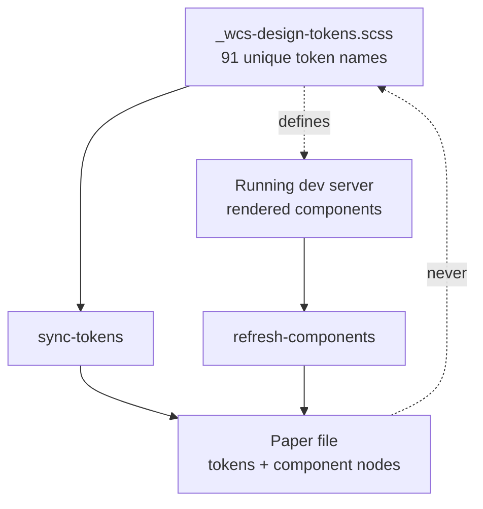
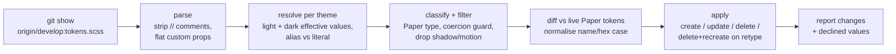
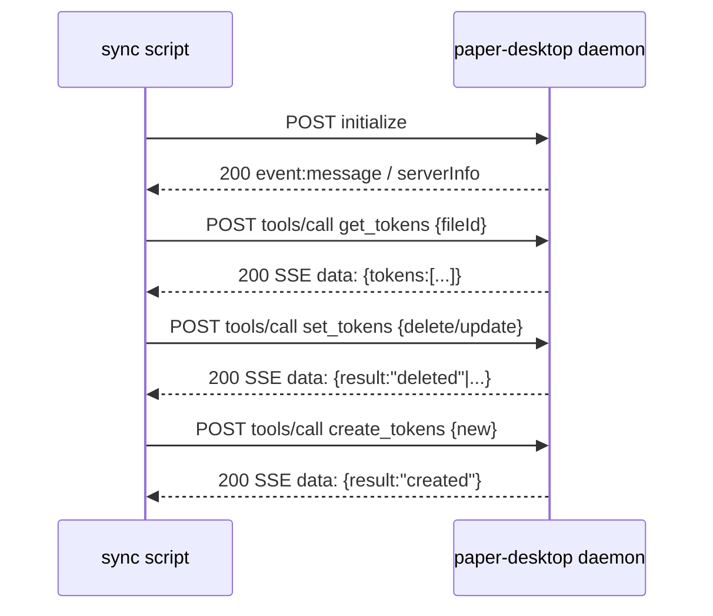
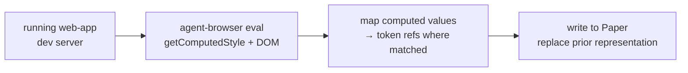

# WCS Design System to Paper - Plan

## Goal Capsule

- **Objective:** A slate-plugins plugin that mirrors the WCS design system into Paper and keeps it honest — one command syncs tokens from the merged `develop` SCSS, another refreshes components by harvesting them from a running dev server.
- **Product authority:** Shawn — sole user of the Paper file today.
- **Authority hierarchy:** This plan governs. Where it leaves a detail open (per-component canonical state, light/dark token naming), the implementer decides and records the choice. Repo conventions of `slateteams/claude-code-plugins` override the plan on packaging shape.
- **Execution profile:** Build in the `slateteams/claude-code-plugins` worktree at `~/projects/Slate/worktrees/wcs-paper` on branch `feature/wcs-paper-plugin`. `slateteams/web-app` is a read-only input. Token sync is verifiable offline; component harvest needs a running web-app dev server and the Paper daemon.
- **Stop conditions:** Stop and surface a blocker if the Paper daemon's token API shape has changed from what Sources/Research recorded, if the token SCSS is absent from `origin/develop`, or if computed-value→token mapping (R11) proves intractable on a real component.
- **Tail ownership:** Open a PR into `claude-code-plugins` `main`. No CI parity work is in scope beyond the plugin's own bats suite.
- **Open blockers:** None.

**Product Contract preservation:** changed R1 and R3 — R1's token source is the merged `develop` git ref rather than a working-tree path (research found the working checkout may not contain the file); R3 names the theme-varying set precisely (the 38 redeclared tokens plus 5 light-only aliases whose referents flip). Both are mechanism clarifications discovered in research, not product-scope changes. All other Product Contract text and every R/AE/F ID are unchanged.

---

## Product Contract

### Summary

Build a plugin that generates the WCS design language into Paper from code, so mockups of new AI tools are built against values that are true. Tokens ship first because that is how a mockup starts; component harvesting follows once the token model has been proven against a real mock.

### Problem Frame

The web editor redesign shipped to prod, so `--wcs-*` is the editor's real design language — but it exists only in SCSS. Mocking a new AI tool in Paper therefore means reaching for values by hand.

That has already failed once, expensively. A previous session built a set of Paper artboards against a lime accent (`#88c82e`) while shipped prod had moved to `#00b72b`. Nothing detected it; a merge surfaced it, and every dark screenshot from that work was wrong. The same session also wrote nine tokens at the wrong Paper type and had to hand-delete them.

The cost shape is silent and delayed. A hand-copied value looks right at the moment it is written and rots without a signal, and the more complete the Paper file looks, the more it gets trusted at exactly the point it is least trustworthy. Mocking is upstream of building, so a wrong value propagates into design decisions before anyone can catch it.

### Key Decisions

- **Paper is derived from code, never authored in.** Sync is one-way. Nothing in Paper is a source of truth, and nothing flows back into the repo. This invariant is what makes refresh safe, and it decides several requirements below.

- **Generated, not hand-built.** A hand-made Paper library is a snapshot, and snapshots rot into the `#00b72b` bug with a different hex. Generation is what makes the artifact durable rather than a second thing to maintain.

- **Settledness is not a selection criterion.** "Only translate settled components" is a workaround for translation being expensive. Cheap refresh removes the reason to prefer stable components, so the ai-primitives are in scope despite landing on 2026-07-07 — they are the vocabulary new AI tools are assembled from.

- **The Tier-1/Tier-2 structure is preserved through aliasing.** Paper stores `var(--wcs-neutral-800)` without flattening it, verified live. Tier-2 semantic tokens alias Tier-1 primitives in Paper exactly as they do in SCSS, carrying the token file's own "never raw hex" rule across.

- **Shadows are component styles; motion is dropped.** `box-shadow` renders correctly as a style but silently coerces to `#000000` as a token. `transition` is discarded entirely — even as a style — so motion cannot be represented in Paper at all. This is a fact about Paper, not a choice.

- **Light and dark are two token sets.** Paper has no mode or theme concept anywhere in its API, so the single SCSS token name that carries both values becomes two names in Paper.

- **Typography arrives via harvested components.** WCS has no typography token layer to translate — the type scale is hardcoded across six Angular components. Minting Paper-only typography tokens would create tokens with no SCSS counterpart that refresh could never reconcile, reintroducing drift. The scale comes across as computed styles instead.

The source-of-truth relationship the plugin maintains:

### Requirements

**Token sync**

- R1. A command reads the WCS token SCSS from the merged `develop` ref (not a working-tree checkout) and writes its Tier-1 and Tier-2 tokens into the Paper file. The source path on that ref is `src/styles/themes/_wcs-design-tokens.scss` in `slateteams/web-app`.
- R2. Tier-2 semantic tokens are written as aliases of their Tier-1 primitive rather than resolved to literals.
- R3. Light and dark values are written as two separate token sets. The dark set covers every token whose effective value differs by theme — the tokens redeclared in the dark block, plus the light-only aliases whose referent is redeclared (so their resolved value flips even though the alias itself is not). Mode-invariant tokens (spacing, radii) stay single.
- R4. Re-running sync reconciles rather than appends: tokens absent from source are deleted, changed values updated, and a token whose type changed is deleted and recreated.
- R5. Shadow, transition, and easing tokens are excluded from the token set.
- R6. The typography tokens that do exist — `--wcs-panel-title-size`, `--wcs-panel-title-weight`, and `--font-family` from `src/styles/_general.scss` — are written with their native Paper types.
- R7. Sync normalises token-name case and hex case, so an unchanged source produces no writes.
- R8. Sync reports what it changed, and reports any value it declined to write rather than writing it silently.

**Component harvest**

- R9. A command captures a named WCS component from a running dev server and writes it into the Paper file.
- R10. Harvest sources computed styles rather than authored CSS, so `currentColor` resolves to a literal before reaching Paper.
- R11. Harvested components reference token variables wherever a computed value matches a known token.
- R12. The uikit typography components are in the first harvest batch — they carry the type scale that has no token representation.
- R13. Re-running harvest for a component replaces its previous representation rather than duplicating it.

**Packaging**

- R14. Ships as a plugin at `plugins/wcs-paper/` in the slate-plugins marketplace, registered in `.claude-plugin/marketplace.json`.
- R15. Exposes a token-sync command and a component-refresh command.
- R16. Skill documentation is written for a reader who is not the author.

### Acceptance Examples

- AE1. Token deleted at source
  - **Covers R4.**
  - **Given:** `--wcs-lasso-fill` exists in Paper and is removed from the SCSS.
  - **When:** sync runs.
  - **Then:** the token is deleted from Paper, and the deletion is reported.

- AE2. Token changes type
  - **Covers R4.**
  - **Given:** a token exists in Paper as `spacing` and its source value becomes a colour.
  - **When:** sync runs.
  - **Then:** the token is deleted and recreated as `color`, because Paper cannot retype in place.

- AE3. Shadow token encountered
  - **Covers R5, R8.**
  - **Given:** `--wcs-panel-shadow: 0 1px 3px rgba(0,0,0,0.1)` in source.
  - **When:** sync runs.
  - **Then:** no token is written, and the skip is reported. Writing it as a colour would store `#000000` with no error.

- AE4. Component using currentColor
  - **Covers R10.**
  - **Given:** a component whose border is `2px solid currentColor` under `color: #00b72b`.
  - **When:** harvest runs.
  - **Then:** the border reaches Paper as `#00b72b`. Passing the authored CSS would store a transparent border.

- AE5. Unchanged source
  - **Covers R7.**
  - **Given:** Paper is in sync and the SCSS has not changed.
  - **When:** sync runs.
  - **Then:** no writes occur and the report is empty.

- AE6. Light-only alias whose referent flips
  - **Covers R3.**
  - **Given:** `--wcs-timeline-playhead: var(--wcs-accent)` is declared only in the light block, but `--wcs-accent` is redeclared in the dark block (`#37d895` light, `#00b72b` dark).
  - **When:** sync runs.
  - **Then:** the token gets a dark representation, because its resolved value differs by theme. Treating "declared only in light" as "theme-invariant" would leave it green in dark.

### Key Flows

- F1. Sync tokens
  - **Trigger:** The token-sync command is invoked.
  - **Steps:** Parse the SCSS token file; classify each token to a Paper type; read current Paper tokens; diff against source with case normalised; apply creates, updates, deletes, and delete-then-recreate for type changes; report the changes.
  - **Outcome:** Paper's tokens match the SCSS, and anything not representable is reported.
  - **Covered by:** R1–R8.

- F2. Refresh a component
  - **Trigger:** The component-refresh command is invoked for one or more named components.
  - **Steps:** Reach the component on a running dev server; read its rendered structure and computed styles; map computed values back to token references where they match; write into Paper, replacing any prior representation.
  - **Outcome:** The component in Paper reflects the component in code.
  - **Covered by:** R9–R13.

### Success Criteria

- A mockup built in Paper never disagrees with merged `develop` (the deploy source) about a value that Paper is capable of representing.
- Refreshing after an SCSS change is a single command, so staying current does not depend on remembering to check.
- A component that changes in code can be brought back into line without hand-editing Paper.

### Scope Boundaries

- Automatic sync — no hook, CI job, or watcher. Refresh is invoked.
- Paper-to-code — designs authored in Paper do not flow back into the repo.
- Motion — not deferred, but impossible; Paper discards `transition` entirely.
- A typography token layer in SCSS — a real gap, but a separate code change with its own review and regression surface.
- The `var(--wcs-token, #hex)` fallbacks at call sites — they exist only for the flag-off path and WEB-2899 ("Retire the wcs-editor-redesign flag now the redesign has shipped") will remove them.

### Dependencies / Assumptions

- **Two repos.** This plugin is built in `slateteams/claude-code-plugins` (this repo). Every `src/...` path in this document belongs to `slateteams/web-app`, checked out at `~/projects/Slate/web-app` — a read-only input, never written to.
- Component harvest needs a running web-app dev server; token sync needs only the SCSS file.
- Paper's daemon is reachable at `http://127.0.0.1:29979/mcp`. Drive it with `urllib` from a script file rather than `curl`, which buffers and times out on screenshots.
- The uikit (38 components) and ai-primitives (21 components) are independent families — ai-primitives import nothing from the uikit.
- Assumed: mapping a computed value back to a token reference (R11) is tractable by matching resolved values against the known token set. Unverified.
- Assumed: harvest can reach a representative state of each component. Angular components have inputs and states, and which state is canonical is unresolved per-component.

### Outstanding Questions

**Resolve before planning**

- None.

**Deferred to planning**

- Naming for the two light/dark token sets.
- Which components beyond the typography set are in the first harvest batch, and in what order.
- Which rendered state of a stateful component is captured, and whether more than one is worth capturing.
- Whether `display: grid` and `margin` — both of which Paper stores and renders correctly, but its own guide advises against — should be passed through as-is or converted to flex and padding on the way in.

### Sources / Research

Findings below were verified live against Paper on 2026-07-17 in a scratch file, not inferred from documentation.

| Claim                                             | Verdict                                                                                                               |
| ------------------------------------------------- | --------------------------------------------------------------------------------------------------------------------- |
| A mistyped token cannot be deleted via API        | **False.** `set_tokens` supports `delete: true`; returned `"deleted"`.                                                |
| `position: absolute; inset: 0` collapses to 360×0 | **False.** Survives and renders correctly when the parent is sized.                                                   |
| `color-mix()` is dropped                          | True of Paper, **irrelevant here** — zero occurrences in the token file or either component tree.                     |
| A font-weight became `#660000`                    | **Caller error**, not a Paper limit. `fontWeight: 600` creates cleanly.                                               |
| Paper cannot use `display: grid` or `margin`      | **Style guidance, not a limit.** Both survive and render. Grid appears in 9 of 94 SCSS files; 70 margin declarations. |
| Shadow-as-token corrupts                          | **True.** `0 1px 3px rgba(0,0,0,0.1)` silently stored as `#000000`.                                                   |
| `currentColor` corrupts                           | **True.** Resolves to `#00000000`. Used in 74 files.                                                                  |
| Paper has a mode/theme concept                    | **False.** Nothing in the API.                                                                                        |
| Token aliasing survives                           | **True.** `var(--wcs-neutral-800)` stored unflattened.                                                                |

Paper's coercion rule, established by probe: a value that _partially_ parses as a colour is silently coerced (shadows begin with something colour-ish and rot to black); a value that cannot parse at all is rejected with an error (`150ms ease` threw). This explains the exact mix of corruption in the prior session.

Other anchors:

- `src/styles/themes/_wcs-design-tokens.scss` — 129 declarations, 91 unique names. The dark block redeclares existing names rather than adding new ones. Its header states the tier model and dark-mode scoping.
- Dark accent is `#00b72b` (line 208). The lime `#88c82e` appears nowhere.
- Token usage ranking: `--wcs-text-primary` 231, `--wcs-text-secondary` 191, `--wcs-accent` 189, `--wcs-surface` 113, `--wcs-brand-secondary` 106. Note the `--wcs-text-*` family are colours, not typography.
- Component usage: `app-wc-icon` 224, `app-wc-dropdown-item` 107, `app-wc-overlay` 91 (uikit) against `app-ai-section-header` 18, `app-ai-action-button` 8 (ai-primitives).
- ai-primitives landed 2026-07-07 in `d76aa2381c` (PR #4212, "AI Tools Drawer + Lighting Tools + Analysis Tools", WEB-2585).
- Paper's native token namespaces follow Tailwind v4 (`--color-*`, `--radius-*`, `--text-*`), but `type` is independent of name, so `--wcs-*` names with explicit types are accepted.
- Paper token types: `breakpoint, color, container, fontFamily, fontSize, fontWeight, letterSpacing, lineHeight, radius, spacing`. No shadow, filter, easing, or transition type.
- Paper daemon speaks JSON-RPC 2.0 over HTTP with SSE-framed responses (`event: message\ndata: {...}`). Verified from a plain `urllib` script: `initialize` → `tools/list` → `tools/call` all return 200 with real data, no auth, localhost only. Server is `paper-desktop v0.4.4`.
- Structural template is `plugins/slate-devs`: `${CLAUDE_PLUGIN_ROOT}` anchor for script paths, deterministic script emits JSON on stdout with diagnostics on stderr, fail-soft contract (empty result is a success path with an explanatory note, not an error), config read from a file via `jq` rather than hardcoded. Test harness pattern (bats + `run-tests.sh` + `fixtures/`) from `plugins/slate-calls/tests`.
- The SCSS is flat plain-CSS custom properties — no `$vars`, mixins, nesting, or interpolation. A parser only strips `//` comments. No `var()` fallbacks anywhere; no forward references; the dark block is all literals (zero `var()`). 38 names redeclared in dark, 0 dark-only.
- The five light-only aliases whose referent flips under dark: `--wcs-timeline-playhead`, `--wcs-timeline-track-bg`, `--wcs-timeline-item-selected-border`, `--wcs-nav-item-active-bg`, `--wcs-nav-item-active-fg`. Contrast `--wcs-warn-text: var(--wcs-amber-text)` — its referent is never redeclared, so it genuinely does not move.
- `agent-browser eval <js> --json` runs JavaScript in the page and returns JSON — the harvest path for pulling `getComputedStyle` + DOM. Computed styles resolve `color-mix()` and `currentColor` to literals before they reach Paper, dodging two of the three mangling landmines for free.

---

## Planning Contract

### Key Technical Decisions

- KTD1. **Token sources are read from the merged `develop` ref via `git show origin/develop:<path>` — never a working-tree file.** The main web-app checkout can sit on any branch, and research confirmed the token file is absent from the currently-checked-out branch's tree while present on `origin/develop`. Reading the merged ref makes "Paper matches merged develop" structural rather than a matter of which branch happens to be out. There are **two** source paths: `src/styles/themes/_wcs-design-tokens.scss` (the 91 `--wcs-*` tokens) and `src/styles/_general.scss` (the app-wide `--font-family: 'Inter', sans-serif`, R6). The command fetches/updates the ref first, then reads both.

- KTD2. **Token sync is a fully deterministic Python script driving the Paper daemon directly over HTTP; the model never touches the 91 tokens.** The idempotent-reconcile requirement (R4, R7) can only be _guaranteed_ by code, not prompted. The script speaks JSON-RPC 2.0 to `http://127.0.0.1:29979/mcp` and parses the SSE framing. There is no in-repo precedent for scripting an MCP server (every plugin leaves MCP to the model), so this is a new pattern for the marketplace — justified because reconcile correctness is the whole point of the tool.

- KTD3. **The plugin follows the `slate-devs` deterministic-script contract.** Scripts live under `lib/`, resolved from skills via `${CLAUDE_PLUGIN_ROOT}`. Each emits JSON on stdout, diagnostics on stderr, and fails soft: an empty diff or a downed daemon returns a valid envelope with an explanatory note, not a crash. Skills stay thin — they invoke the script and relay its report. This keeps the model out of the deterministic path and matches a pattern the repo already documents.

- KTD4. **The parser resolves each token to an effective light value and an effective dark value, tracking alias-vs-literal per theme.** This is the one subtle part of parsing. A token's dark representation is needed whenever its effective value differs by theme — which includes the five light-only aliases whose referent flips (KTD-adjacent to R3/AE6). Resolution is single-pass top-to-bottom (no forward refs exist); dark lookups check the dark block first and fall through to light on miss.

- KTD5. **A representability filter with a coercion guard decides what reaches Paper.** Shadow, transition, and easing tokens are excluded (R5). More generally, the script never writes a value that only partially parses as a color at a non-color type — that is the silent-`#000000` trap. Anything filtered is reported (R8), never dropped silently. Typography tokens that do exist are written at their native Paper type (R6).

- KTD6. **Harvest extracts computed styles via `agent-browser eval`, not authored CSS.** `getComputedStyle` resolves `color-mix()` and `currentColor` to literals in the browser, so the two mangling landmines never reach Paper (R10, AE4). The extractor pulls a component's DOM structure plus per-node computed styles as JSON, which the writer turns into Paper nodes.

- KTD7. **Python for the deterministic scripts; bats for tests.** Python matches the repo's structured-data precedent (`plugins/slate-product-feedback/scripts`) and handles the JSON-RPC/SSE client and the diff cleanly. Tests use bats + committed fixtures against the scripts' JSON contracts, following `plugins/slate-calls/tests`.

### High-Level Technical Design

**Token-sync pipeline** — five deterministic stages, source to Paper:

**Paper daemon interaction** — the client wraps the SSE-framed JSON-RPC handshake:

**Component-harvest pipeline:**

### Assumptions

- Mapping a computed value back to a token reference (R11) is tractable by matching resolved values against the known token set. Unverified against a real component — a stop condition if it proves otherwise.
- Harvest can reach a representative state of each component. Which rendered state is canonical is left to the implementer per-component, defaulting to the default state.
- The Paper daemon token API shape (from Sources/Research) holds at build time. `paper-desktop` versions independently; a shape change is a stop condition.

### Sequencing

Three phases, each landable and reviewable on its own. Phase B (token sync) is the priority — it is the value floor and is fully offline-verifiable. Phase C (harvest) builds on the same client and config but is independent of the sync diff logic.

- **Phase A — Packaging & shared infra:** U1, U2
- **Phase B — Token sync:** U3, U4, U5
- **Phase C — Component harvest:** U6, U7, U8

---

## Implementation Units

### U1. Plugin scaffold and marketplace registration

- **Goal:** A registered, discoverable `wcs-paper` plugin skeleton.
- **Requirements:** R14, R15, R16
- **Dependencies:** none
- **Files:** `plugins/wcs-paper/.claude-plugin/plugin.json`, `plugins/wcs-paper/commands/sync-tokens.md`, `plugins/wcs-paper/commands/refresh-components.md`, `plugins/wcs-paper/skills/sync-tokens/SKILL.md`, `plugins/wcs-paper/skills/refresh-components/SKILL.md`, `plugins/wcs-paper/README.md`, `plugins/wcs-paper/tests/run-tests.sh`, `plugins/wcs-paper/wcs-paper.config.json`, `.claude-plugin/marketplace.json`
- **Approach:** Mirror `plugins/slate-devs` layout. `plugin.json` carries `name`, `version` (`1.0.0`), `description`, `author`, `keywords`. Thin `commands/*.md` delegate to the matching skill (the `plugins/dogfood-prep` two-file pattern). The two `SKILL.md` files are created here as thin stubs; U5 and U8 fill in the sync and refresh skill bodies respectively. Register the plugin in `marketplace.json` and bump `metadata.version` — the registry entry is a required second step, not optional. Include the shared bats runner `tests/run-tests.sh` (mirror `plugins/slate-calls/tests/run-tests.sh`, taking `[unit|integration|all]`) and `wcs-paper.config.json` (the shared config carrying the target Paper `fileId`, `slate-devs` `devs.json` pattern) here in the scaffold — both are shared infra with no lib dependency, consumed by later units. The config ships with an empty `fileId` so the destructive-reconcile refuse-path (U5, U8) holds until the user fills it. README follows the `slate-devs` skeleton including a "Honest about what it doesn't do" section (no motion, no Paper-to-code, harvest needs a live server).
- **Patterns to follow:** `plugins/slate-devs/.claude-plugin/plugin.json`, `plugins/dogfood-prep/commands/dogfood-prep.md`, `plugins/slate-devs/README.md`.
- **Test scenarios:** `Test expectation: none — scaffolding.` Verified structurally in U-level Verification (plugin validates, marketplace parses).
- **Verification:** `/plugin validate .` passes; `marketplace.json` parses and lists `wcs-paper`; both commands resolve.

### U2. Paper daemon client

- **Goal:** A reusable Python client for the Paper daemon's JSON-RPC/SSE interface, covering the tool surface both sync (U5) and harvest (U8) consume.
- **Requirements:** R1, R4, R9, R13 (infrastructure — the token ops serve sync, the write/find/delete ops serve harvest)
- **Dependencies:** U1
- **Files:** `plugins/wcs-paper/lib/paper_client.py`, `plugins/wcs-paper/tests/unit/paper_client.bats`, `plugins/wcs-paper/tests/fixtures/sse_get_tokens.txt`
- **Approach:** `urllib`-based (never `curl` — it buffers and times out on screenshots). POST JSON-RPC 2.0 to `http://127.0.0.1:29979/mcp`; parse the SSE framing (`event: message\ndata: {...}`) to extract the JSON payload. Wrap the tools the two commands need: `initialize`, `get_tokens`, `set_tokens`, `create_tokens` (sync, U5), plus `write_html`, `find_nodes`, `delete_nodes` (harvest write/replace, U8). Fail soft: a connection error returns an envelope with a `daemon_unreachable` note, not a traceback.
- **Execution note:** The SSE parse is the fragile bit — start with a fixture of a real recorded SSE response and unit-test the parser against it before touching the live daemon.
- **Patterns to follow:** `plugins/slate-product-feedback/scripts/fetch-requests.sh` for HTTP-code checks and actionable stderr; `plugins/slate-devs/lib/_common.sh` for the fail-soft envelope shape.
- **Test scenarios:**
  - Happy path: SSE response with one `data:` line parses to the inner JSON payload.
  - Edge: multi-line / chunked SSE framing yields the complete payload.
  - Error: connection refused returns the `daemon_unreachable` envelope with exit code distinct from a bad-args failure.
  - Error: a JSON-RPC `error` object in the response is surfaced, not swallowed as success.
- **Verification:** Unit tests pass against the fixture; a manual smoke `get_tokens` against the live daemon returns the token list.

### U3. SCSS parser and per-theme resolver

- **Goal:** Turn the token SCSS into a normalized per-theme token model.
- **Requirements:** R1, R2, R3, R6, R7
- **Dependencies:** U1
- **Files:** `plugins/wcs-paper/lib/parse_tokens.py`, `plugins/wcs-paper/tests/unit/parse_tokens.bats`, `plugins/wcs-paper/tests/fixtures/tokens_sample.scss`, `plugins/wcs-paper/tests/fixtures/general_sample.scss`, `plugins/wcs-paper/tests/fixtures/tokens_expected.json`
- **Approach:** Read the SCSS text (the caller supplies it via `git show`, per KTD1 — the parser takes text, not a path, so it is testable against a fixture). The main entry point strips `//` comments and parses flat `--wcs-*: value;` declarations within the two known selector blocks, resolving each token to an effective light and dark value (alias-vs-literal tracked per theme). A **second entry point** (`parse_general(text)`) extracts exactly `--font-family` from `_general.scss` — that file is full nested SCSS (imports, keyframes, `html, body` rules), so this is a targeted single-property extraction, not the flat-block parse; it emits one theme-invariant record entering the pipeline at classify (R6). Emit JSON: one record per token with `name`, `light`, `dark` (null when theme-invariant), and alias metadata. Normalize name case (lowercase) and hex case (uppercase) so an unchanged source yields byte-identical output (R7).
- **Execution note:** Build the fixture from the real file's hard cases — the 8-digit hex, the `rgba()` with internal commas, the multi-part box-shadows, and at least two of the five flipping aliases — so the resolver is exercised on what it will actually face.
- **Test scenarios:**
  - Happy path: a light+dark redeclared token resolves to distinct light/dark values.
  - Covers AE6. A light-only alias (`--wcs-timeline-playhead`) whose referent is redeclared resolves to a theme-varying value with a non-null `dark`.
  - Edge: a light-only alias whose referent is NOT redeclared (`--wcs-warn-text`) resolves theme-invariant (`dark` null).
  - Edge: a mode-invariant primitive (`--wcs-space-2`) resolves with `dark` null.
  - Edge: `rgba(55, 216, 149, 0.18)` — internal commas do not corrupt the parse.
  - Edge: `//` comment stripping does not eat a `//` inside a string or URL (none exist today, but guard it).
  - Covers R6. `parse_general` extracts `--font-family: 'Inter', sans-serif` from a nested-SCSS `html, body` fixture and ignores the surrounding imports/keyframes/rules.
  - Idempotency: parsing the same input twice yields byte-identical JSON; name/hex case is normalized.
- **Verification:** Unit tests pass; parsing the real `origin/develop` token file produces 91 token records, of which 43 are theme-varying (the 38 dark-redeclared tokens plus the 5 flipping aliases), with those 5 specifically flagged as referent-flips; `parse_general` adds the `--font-family` record for 92 total entering classify.

### U4. Token → Paper-type classifier and representability filter

- **Goal:** Decide each token's Paper type, and which tokens are safe to write.
- **Requirements:** R5, R6, R8
- **Dependencies:** U3
- **Files:** `plugins/wcs-paper/lib/classify_tokens.py`, `plugins/wcs-paper/tests/unit/classify_tokens.bats`
- **Approach:** Map each resolved token to a Paper type (`color`, `radius`, `spacing`, `fontWeight`, `fontFamily`, etc.). Exclude shadow/transition/easing tokens entirely (R5). Apply the coercion guard: never assign a non-color type to a value that would partially color-parse, and never assign `color` to a multi-part value — those are the silent-`#000000` cases. Emit each excluded token with a reason so the sync command can report it (R8). Typography tokens that exist (`--wcs-panel-title-size`, `--wcs-panel-title-weight`, `--font-family`) get their native types (R6).
- **Test scenarios:**
  - Happy path: `#37d895` → `color`; `8px` → `spacing`/`radius` per name; `600` → `fontWeight`.
  - Covers AE3. A shadow token is excluded with a `not-representable` reason.
  - Edge: a transition/easing value is excluded (motion has no Paper type).
  - Edge: an 8-digit hex (`#00B72B1A`) classifies as `color` and is not mangled.
  - Error guard: a multi-part value is never emitted at type `color`.
  - Covers R6. `--wcs-panel-title-size`, `--wcs-panel-title-weight`, and `--font-family` classify at their native Paper types (`fontSize`, `fontWeight`, `fontFamily`).
- **Verification:** Unit tests pass; running against the resolved real token set yields the expected count of writable tokens and a reported exclusion list containing the shadow/motion names.

### U5. Reconcile-diff engine and sync command

- **Goal:** The end-to-end idempotent token-sync command.
- **Requirements:** R1, R2, R3, R4, R6, R7, R8
- **Dependencies:** U2, U3, U4
- **Files:** `plugins/wcs-paper/lib/sync_tokens.py`, `plugins/wcs-paper/skills/sync-tokens/SKILL.md` (fills the U1 stub), `plugins/wcs-paper/tests/unit/reconcile.bats`, `plugins/wcs-paper/tests/fixtures/paper_state_before.json`
- **Approach:** Orchestrate: `git show origin/develop:<path>` for **both** source files (the token file and `_general.scss`, per KTD1) → parse (U3) → classify (U4) → read live Paper tokens (U2) → diff → apply → report. The diff computes creates, updates, deletes, and delete-then-recreate for type changes (Paper cannot retype in place). Tier-2 tokens are written as `var()` aliases, not resolved literals (R2) — the diff compares and the apply writes the alias reference; a dark-set alias references its same-set (dark) counterpart's name, not the light name (relevant once the light/dark naming scheme is settled). Writes both light and dark sets per R3, and the `--font-family` token at type `fontFamily` (R6). Normalized comparison means an unchanged source produces an empty diff and zero writes (R7, AE5). The report names every change and every declined value (R8). The SKILL.md stays thin — it runs the script and relays the JSON report.
- **Target-file safety:** Reconcile is destructive (R4 deletes tokens absent from source), so the command must never guess which Paper file to write. The target Paper `fileId` is read from `wcs-paper.config.json` (created in U1) and passed explicitly on every daemon call. If the config is absent or carries no `fileId`, the command refuses with an actionable error rather than defaulting to whatever file is currently open.
- **Execution note:** Test the diff engine as a pure function against a `paper_state_before.json` fixture and a resolved-token fixture — the apply step needs the live daemon, but the decision logic does not, and that is where the correctness lives.
- **Test scenarios:**
  - Covers AE5. Source unchanged vs current Paper state → empty diff, zero writes, empty report.
  - Covers AE1. A token present in Paper but absent from source → a delete in the diff, reported.
  - Covers AE2. A token whose type changed → a delete-then-recreate pair, not an in-place update.
  - Covers R2. A Tier-2 alias token produces a create/update whose written value is the `var(--wcs-*)` reference, not the resolved hex.
  - Covers R6. `--font-family` from `_general.scss` appears in the write set at type `fontFamily`.
  - Happy path: a changed hex value → a single update.
  - Happy path: a new theme-varying token → creates in both light and dark sets.
  - Edge: a declined (shadow) token appears in the report's declined list, never in the write set.
  - Safety: with no `fileId` in config, the command refuses and writes nothing, rather than targeting the open file.
  - Idempotency: applying, then re-running against the resulting state → empty diff.
- **Verification:** Unit tests pass; a live run against the scratch Paper file writes the expected token set, and an immediate second run reports zero changes.

### U6. Computed-style harvester

- **Goal:** Extract a component's rendered structure and computed styles from a running dev server, given a way to get that component on screen.
- **Requirements:** R9, R10
- **Dependencies:** U1
- **Files:** `plugins/wcs-paper/lib/harvest_extract.js`, `plugins/wcs-paper/lib/harvest.py`, `plugins/wcs-paper/lib/harvest_batch.json`, `plugins/wcs-paper/tests/unit/harvest.bats`
- **Approach:** Drive `agent-browser eval` with a page script that, given a component's root selector, walks its DOM and records per-node tag, text, `getComputedStyle` output, and the page's active theme (`body.wcs-theme.wcs-dark` present or not) as JSON. Computed styles resolve `color-mix()` and `currentColor` to literals in the browser (R10, AE4), so the mangling landmines never reach Paper. `harvest.py` wraps the `agent-browser` invocation and returns the JSON.
- **Reach strategy:** The WCS editor requires auth and a loaded project before any `app-wc-*`/`app-ai-*` component renders — a bare selector will not be on screen. Harvest runs in a logged-in, persistent `agent-browser --profile` session (login flow + project-open preconditions per memory `reference_wcs_agent_browser_verification`). Each entry in `harvest_batch.json` (shared with U8) carries the component's `selector`, a `route`, and any `trigger` steps needed to make it render (e.g. open a drawer). U6 owns getting the component visible; the deferred "which state is canonical" question is downstream of that.
- **Execution note:** This needs a running web-app dev server and a logged-in profile; verify by extracting one real uikit component and confirming a `currentColor` border comes back as a literal hex.
- **Test scenarios:**
  - Covers AE4. A node with `border: 2px solid currentColor` under `color: #00b72b` reports the border color as the resolved literal.
  - Happy path: a component subtree yields one record per node with computed styles and the active theme.
  - Error: an unreachable dev server returns a `server_unreachable` envelope, not a hang.
  - Error: a selector that never renders (bad route or missing trigger) returns a `component_not_found` envelope, not an empty-but-successful result.
- **Verification:** Extracting a real component returns structured JSON with literal color values and the active theme recorded; no `currentColor`/`color-mix()` tokens survive in the output. The two envelope error paths are unit-testable and covered in `harvest.bats`.

### U7. Computed-value → token-reference mapper

- **Goal:** Rewrite harvested literal values back to token references where they match a known token.
- **Requirements:** R11
- **Dependencies:** U3, U6
- **Files:** `plugins/wcs-paper/lib/map_to_tokens.py`, `plugins/wcs-paper/tests/unit/map_to_tokens.bats`
- **Approach:** Given the harvested computed values and the resolved token set (U3), replace a literal with a `var(--wcs-*)` reference when it matches a known token's effective value. Match against the effective values **for the theme the component was harvested in** (recorded by U6) — a dark-rendered `#00b72b` matches the dark-effective `--wcs-accent`, not the light one. Match by normalized color/spacing equivalence, not string identity (`#ccc` == `rgb(204,204,204)`); a match found only in the other theme is reported as a near-miss rather than silently applied. This is the R11 assumption made concrete — if a real component's values map cleanly, the assumption holds; if not, it is a stop condition per the Goal Capsule.
- **Test scenarios:**
  - Happy path: a computed `#37d895` in a light-harvested component maps to `var(--wcs-accent)`.
  - Covers theme-correctness: a `#00b72b` in a dark-harvested component maps to `--wcs-accent` (dark-effective), not left unmapped by comparing against light values.
  - Edge: a value with no matching token stays a literal.
  - Edge: color-equivalent forms (`rgb()` vs hex) match the same token.
  - Ambiguity: a value matching multiple tokens resolves deterministically (documented tie-break) rather than arbitrarily.
- **Verification:** Unit tests pass; running against a real harvested component maps a meaningful fraction of values to tokens and leaves the rest as literals.

### U8. Harvest → Paper writer and refresh command

- **Goal:** The end-to-end component-refresh command, typography components first.
- **Requirements:** R9, R12, R13
- **Dependencies:** U2, U6, U7
- **Files:** `plugins/wcs-paper/lib/write_component.py`, `plugins/wcs-paper/skills/refresh-components/SKILL.md` (fills the U1 stub), `plugins/wcs-paper/tests/unit/write_component.bats`
- **Approach:** Turn the mapped component tree (U7) into Paper nodes via the daemon client's write surface (`write_html`, `find_nodes`, `delete_nodes` — all from U2), reading the component list from `harvest_batch.json` (created in U6) and writing to the `fileId` in `wcs-paper.config.json` (created in U1) with the same target-file safety as U5 — refuse rather than target the open file. Re-running for a component replaces its prior representation rather than duplicating it (R13) — `find_nodes` locates the existing subtree by a stable layer name, `delete_nodes` removes it, then `write_html` writes the fresh one. The first batch (`harvest_batch.json`, config-driven per the `slate-devs` `devs.json` pattern) is the uikit typography components, which carry the type scale that has no token representation (R12). Which rendered state is captured is the implementer's per-component call, defaulting to the default state.
- **Execution note:** Needs the dev server and the Paper daemon. Verify the six typography components land and re-running replaces rather than duplicates.
- **Test scenarios:**
  - Covers R13 (unit). The replace path issues `find_nodes` → `delete_nodes` → `write_html` for an already-present layer name, not a bare append — testable against a faked client without a live daemon.
  - Safety (unit): with no `fileId` in config, refresh refuses and writes nothing.
  - Covers R13 (smoke). Refreshing an already-present component leaves node count unchanged against the live daemon.
  - Covers R12 (smoke). The typography batch produces the six type-scale components in Paper.
  - Happy path (smoke): a harvested component with mapped token refs renders in Paper with `var(--wcs-*)` values intact.
- **Verification:** The typography batch lands in the scratch Paper file; a second refresh of one component leaves node count unchanged.

---

## Verification Contract

| Gate                         | Command                                                      | Applies to | Done signal                                                                                                                                                                                                                       |
| ---------------------------- | ------------------------------------------------------------ | ---------- | --------------------------------------------------------------------------------------------------------------------------------------------------------------------------------------------------------------------------------- |
| Unit tests                   | `plugins/wcs-paper/tests/run-tests.sh unit`                  | U2–U8      | All bats tests green                                                                                                                                                                                                              |
| Plugin validation            | `/plugin validate .` (repo root)                             | U1         | Plugin + marketplace parse and resolve                                                                                                                                                                                            |
| Token-sync idempotency smoke | Run sync twice against the scratch Paper file                | U5         | First run writes; second run reports zero changes                                                                                                                                                                                 |
| Harvest smoke                | Refresh the typography batch against a running dev server    | U6, U8     | Six components land; re-run does not duplicate                                                                                                                                                                                    |
| Parser ground-truth          | Parse the real `origin/develop` token file + `_general.scss` | U3, U4     | 91 token records; 43 theme-varying (38 dark-redeclared + the 5 flipping aliases, those 5 flagged as referent-flips); `parse_general` yields the `--font-family` record (92 entering classify); shadow/motion in the declined list |

Karma/CI note: this plugin repo has no Angular CI; the bats suite plus the two live smokes are the proof. The live smokes need the Paper daemon (both) and a running web-app dev server (harvest).

---

## Definition of Done

**Global**

- The plugin is registered in `.claude-plugin/marketplace.json` and validates.
- `sync-tokens` is idempotent against the merged `develop` ref: a second consecutive run reports zero changes.
- Every value Paper cannot represent (shadows, motion) is reported, never written silently.
- Both `sync-tokens` and `refresh-components` refuse to run without a target `fileId` in config — a destructive reconcile never falls back to whatever Paper file is open.
- `refresh-components` lands the typography batch and is re-runnable without duplication.
- The bats suite is green and its fixtures include the real file's hard cases (8-digit hex, internal-comma `rgba`, a flipping alias).
- No dead-end or experimental code remains in the diff — abandoned approaches are removed.
- README states the real limitations (no motion, no Paper-to-code, harvest needs a live server).

**Per-unit:** each unit's Verification line is satisfied.

**Cleanup:** the scratch Paper file `WCS Paper Capability Probe` used during research is the user's to delete (no delete-file API); note it in the PR rather than leaving it dangling silently.
