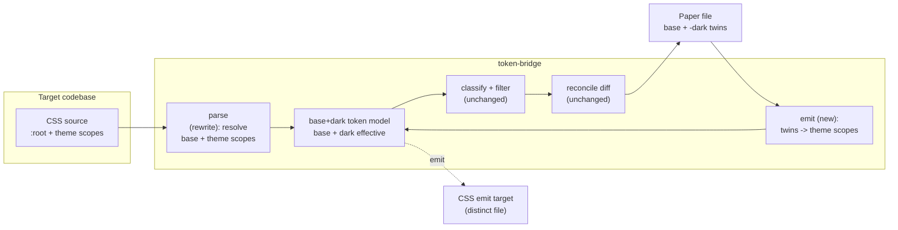
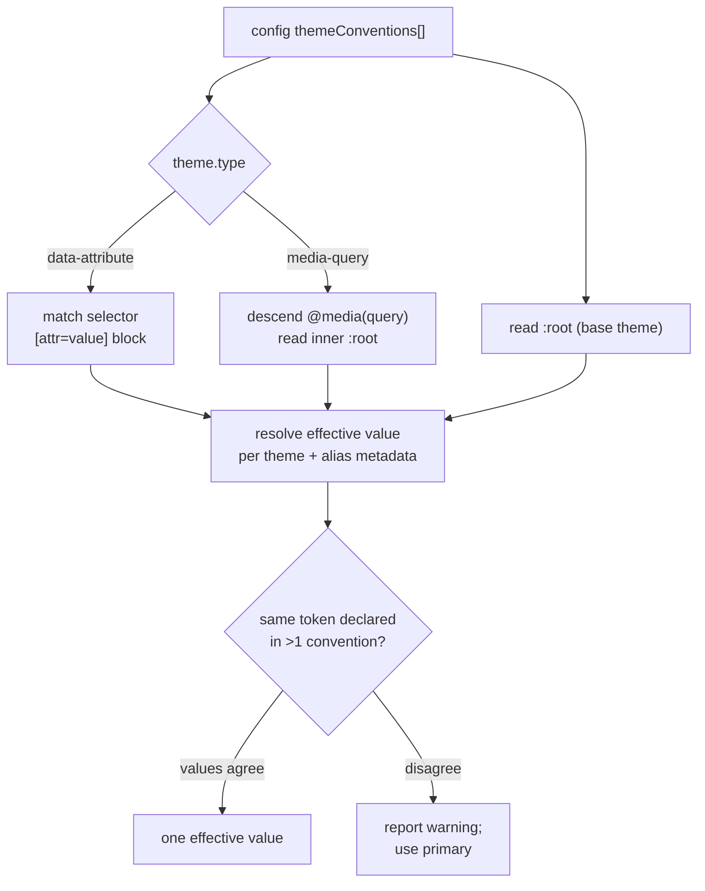

# Token Bridge - Plan

## Goal Capsule

- **Objective:** Reshape the `wcs-paper` plugin into **`token-bridge`** — a config-driven, bidirectional bridge between one codebase's CSS design tokens and one Paper file. Tokens flow both ways; components harvest one way.
- **Product authority:** Shawn — personal tool (nobody on the Slate team uses Paper).
- **Execution profile:** In-place reshape of `plugins/wcs-paper/` in `shawnroos/shrimpshack` (renamed to `plugins/token-bridge/`). Most existing scripts carry over; the parser is rewritten and one new emitter is added. Reads a target codebase's CSS as a read-only source; writes to one Paper file and one CSS emit target. Live paths (sync apply, harvest, emit) need the Paper daemon and, for harvest, a running dev server — the deterministic parse/classify/diff/emit logic is offline-testable.
- **Stop conditions:** Stop and surface a blocker if a target codebase's theme CSS can't be resolved to base + dark scope by the config model, or if the Paper→CSS round-trip can't be made stable (R5) against Paper's on-store re-serialization.
- **Tail ownership:** Commit on a branch in shrimpshack; keep local (no push) per prior instruction.
- **Open blockers:** None.

**Product Contract preservation:** changed R5 — reworded from "byte-identical CSS to the source" to a token-model fixed point (emit → parse → diff = empty). The byte form is unachievable because Paper re-serializes values on store; R5's intent (a stable, no-churn round-trip) is preserved. All other R-IDs and product scope are carried as-is. This run adds the Planning Contract, Implementation Units, Verification Contract, and Definition of Done, and resolves the three brainstorm "deferred to planning" questions (both-conventions, config location, emit target) as Key Technical Decisions.

---

## Product Contract

### Summary

Generalize the WCS-specific Paper plugin into `token-bridge`: a bridge between any one codebase's CSS custom-property design tokens and one Paper file, driven by a codebase-local config rather than hardcoded Slate paths. Sync tokens code → Paper (the existing flow, de-WCS'd) and Paper → CSS (new). Harvest components code → Paper (existing, generalized). Everything Slate-specific is removed or moved into config.

### Problem Frame

The current plugin is hardwired to Slate's Web Creation Studio: a fixed `origin/develop` SCSS path, the `--wcs-*` prefix, the two `body.wcs-theme` scoped blocks, the `app-wc-*` component selectors, and a strictly one-way (code → Paper) flow. But its value was never WCS-specific — it is "keep a codebase's tokens and a Paper file in agreement," and it is a personal tool since the team doesn't use Paper.

Two things follow. Generalizing off the WCS specifics lets it point at any of the frontends Shawn actually works in. And adding the reverse direction closes the loop: tokens tweaked in Paper can flow back into code, instead of Paper being a dead-end mirror.

### Key Decisions

- **Config-driven, no hardcoding.** Build for Shawn's own frontends now, but structure the config so nothing is WCS-shaped — clean seams so it can generalize to others later without rework.

- **One codebase ↔ one Paper file.** The config binds a single codebase to a single Paper `fileId`. No many codebases into one file, no one codebase fanning out to several files. This keeps the reconcile and the reverse-emit unambiguous.

- **Bidirectional tokens, one-way components.** Tokens round-trip (code ↔ Paper). Components only harvest (code → Paper). Paper → component code-gen is out — faithful code-gen from a canvas is fuzzy and fights the "Paper is the derived side" invariant the sync rests on.

- **Theme model is config-declared: data-attribute + media-query.** The v1 conventions are `[data-theme="dark"]` and `@media (prefers-color-scheme: dark)`. Scoped-class (`.dark {}` / the WCS `body.wcs-theme.wcs-dark`) is dropped — the cheapest convention to restore when generalizing, but not needed for Shawn's frontends now.

- **Named `token-bridge`.** WCS is no longer the subject, so the plugin is renamed and the `--wcs-*` assumptions leave the code.

### Requirements

**Token sync (code → Paper)**

- R1. Read tokens from a configured CSS/SCSS source path (not a hardcoded WCS file), including only custom properties matching a configured prefix (or all of them).
- R2. Resolve themes from the configured conventions (data-attribute, media-query) into Paper's flat base+dark token set — the existing base + `-dark`-twin scheme, but produced from the configured theme scopes rather than the two hardcoded WCS blocks.
- R3. Preserve the existing reconcile guarantees, de-WCS'd: idempotent create/update/delete/retype, Tier-2 aliases kept as `var()`, non-representable values (shadows, motion) declined with a reason, and the refuse-without-`fileId` safety guard.

**Token emit (Paper → code) — new**

- R4. Read the configured Paper file's tokens and emit a CSS file: a base `:root { --x: … }` block plus theme-scoped overrides, re-expanding the `-dark` twins back into the configured theme convention.
- R5. The round-trip is stable — CSS emitted from a Paper file that is already in sync with the source, when parsed back, yields a token model identical to the source's (no churn). The fixed point is at the token-model level, not the CSS string, because Paper re-serializes values on store — so this is emit → parse → diff = empty, not a byte compare.

**Component harvest (code → Paper)**

- R6. Harvest generalizes off WCS: the component selectors and the live theme signal (currently `body.wcs-dark`) come from config, not hardcoded `app-wc-*` / WCS class names.

**Packaging**

- R7. The plugin is renamed `token-bridge` and re-registered; one codebase ↔ one Paper file via a codebase-local config.
- R8. Slate/WCS specifics are removed from code — the source path, the `--wcs-*` prefix, the `body.wcs-theme` selectors, and the `app-wc-*` harvest defaults become config or go away.

### Scope Boundaries

**Deferred for later**

- Scoped-class themes (`.dark {}`) — re-addable, just not in Shawn's current frontends.
- Multi-file theme inputs (`light.css` / `dark.css`).
- More than one Paper file per codebase.

**Outside this tool's identity**

- Paper → component code-gen. The reverse direction is tokens only; components stay a one-way harvest.
- The WCS editor as a target, and any Slate-specific coupling.

### Dependencies / Assumptions

- The existing deterministic scripts are the base and mostly carry over **behaviorally**, but "carries over unchanged" means the _logic_ is unchanged — every carried module still needs a WCS-identifier scrub (below), so no module is literally untouched. The **parser** is the real logic rewrite; the **emitter** is genuinely new; classify / value-mapper / reconcile-diff / Paper-client / component-writer keep their logic.
- **Classifier caveat.** `classify_tokens` is convention-agnostic, not fully framework-agnostic: it disambiguates length types by English name substrings (`radius`, `space`/`margin`/`padding`/`gap`/`inset`, `weight`, `size`, `font-family`) and excludes motion by `shadow`/`transition`/`ease`. A codebase whose tokens lack those hints (`--sp-2`, `--r-md`) falls through to "no Paper type" and is silently declined. v1 accepts this limitation; making the name→type hints config-extensible is deferred.
- **Reserved `-dark` suffix caveat.** The frozen twin scheme reserves the `-dark` property suffix: emit partitions Paper tokens into base vs. dark twins by that suffix (KTD4). A source token whose name genuinely ends in `-dark` (e.g. `--border-dark`) therefore round-trips lossily — emit misreads it as the dark twin of `--border`. v1 accepts this as a limitation (mirrors the classifier caveat); the parser/emit may warn when a de-suffixed twin name collides with an existing base token, but does not support `-dark`-named base tokens.
- **WCS-identifier scrub.** Beyond pulling defaults into config, the carried modules hold WCS identifiers in _code_ that the No-WCS grep gate forbids: `paper_client` sets `clientInfo.name = "wcs-paper-client"`; `sync_tokens.py` / `harvest.py` / `write_component.py` use the `WCS_PAPER_*` env prefix and the `origin/develop:` source defaults (`sync_tokens.py` is the primary `git show origin/develop:<path>` consumer); `write_component.py` stamps a `data-wcs-component` layer attribute; `map_to_tokens`'s CLI help says `--wcs-*`. Each carried module gets an identifier scrub in the unit that owns it (U1 for the client, U3 for sync, U5 for harvest + writer + mapper CLI). The grep gate targets these code identifiers and the hardcoded defaults; provenance comments are swept in U6.
- Reads a codebase's CSS as a read-only source; writes to one Paper file, and for emit, one CSS file (a distinct `emitTarget`, per KTD7).
- Paper's live behaviors established for the WCS build still hold and are reused: SSE JSON-RPC daemon, alias-create ordering, on-store value re-serialization, inline-SVG/`` capture. (See the prior plan's Sources.)

### Outstanding Questions

**Resolve before planning**

- None.

**Deferred to planning**

- **Both-conventions round-trip.** When a codebase declares both data-attribute and media-query dark themes, what does Paper → CSS emit — both blocks, or a configured primary? (Forward parsing must also decide which wins if they disagree.)
- **Config location and schema.** Where the codebase↔Paper config lives (in the codebase repo vs. the plugin) and its exact shape — source path, prefix, theme conventions, Paper `fileId`, harvest batch.
- **Emit target.** Whether Paper → CSS writes a new file or updates an existing token file in place.
- **Rename mechanics.** Whether `token-bridge` is a rename-in-place of `wcs-paper` or a fresh plugin that supersedes it.

### Sources / Research

- The plugin being reshaped: `plugins/wcs-paper/` in `shawnroos/shrimpshack` (8 units, 93 tests, live-proven end-to-end). Its prior requirements→implementation plan is at `plugins/wcs-paper/docs/plans/2026-07-17-001-feat-wcs-tokens-to-paper-plan.md` — the WCS-specific decisions there (two-block theme parsing, `--wcs-*`, `-dark` twins, the reconcile guarantees, the live Paper daemon behaviors) are the baseline this reframe generalizes.
- What carries over vs. what changes (from a read of the existing `lib/`): `classify_tokens.py` (value-shape based) and `map_to_tokens.py` (value-equivalence) are already framework-agnostic — no change. `paper_client.py` (SSE JSON-RPC, `read_config`), `sync_tokens.py` (reconcile diff, alias/serialization handling), and `write_component.py` carry over with their WCS defaults pulled into config. `parse_tokens.py` is the real rewrite. `harvest_extract.js`/`harvest.py` need their theme signal + selectors de-hardcoded.

---

## Planning Contract

### Key Technical Decisions

- KTD1. **Config lives in the target codebase, not the plugin.** One codebase ↔ one Paper file means each bridged codebase carries its own config file (e.g. `token-bridge.config.json` at its root) declaring: the CSS source path, the token prefix (or "all custom properties"), the theme conventions in use, the Paper `fileId`, the emit target path, and the harvest batch. The plugin reads that file from the codebase it's pointed at. This replaces the current plugin-local `wcs-paper.config.json`.

- KTD2. **v1 is base + one "dark" theme; the config declares only the dark scope's _convention_, not a set of named themes.** This is the keystone decision. The existing `light`/`dark` two-field token model — and every downstream module that hardcodes it (`classify_tokens`, `sync_tokens.build_desired`/`_light_value`/`_dark_value`/`_alias_ref`/`DARK_SUFFIX`, `map_to_tokens`'s `light`/`dark` index) — is **frozen and genuinely unchanged**. What generalizes is only _how the parser finds the dark scope_: config declares the dark theme's convention(s) rather than the hardcoded `body.wcs-theme.wcs-dark` block. A data-attribute convention is `{type: "data-attribute", attr: "data-theme", value: "dark"}` (parser matches selector `[data-theme="dark"]`); a media-query convention is `{type: "media-query", query: "(prefers-color-scheme: dark)"}` (parser descends the `@media` block and reads its inner `:root`). The base is the top-level unscoped `:root`. The parser emits the same `{name, light, dark, light_alias, dark_alias}` record shape as today. **Multiple named themes (beyond base + dark) are deferred** — they would require widening that record shape and rewriting classify/sync/map, which v1 explicitly does not do.

- KTD3. **Both-conventions: when the dark scope is declared via _both_ data-attribute and media-query, config names one `primary`.** Common in real projects. Forward parse reads the primary convention's dark scope; if both are present and their dark values disagree, parse reports a warning (not a silent pick). Reverse emit writes only the primary convention's block. This keeps the round-trip deterministic without trying to reconstruct a dual-convention source. (See KTD7 for the in-place-emit lossiness this implies.)

- KTD4. **Reverse emit is the exact inverse of sync's `-dark` twin + alias scheme.** `sync_tokens` writes the dark value under a `--x-dark` twin name, and a dark _alias_ as a reference to the dark twin (`var(--wcs-accent)` → `var(--wcs-accent-dark)` via `_dark_value`/`_alias_ref`). So `emit` must invert **both**: inside the dark scope, rename each `--x-dark` property back to `--x`, **and** strip the `-dark` suffix from alias referents (`var(--accent-dark)` → `var(--accent)`) — otherwise the emitted CSS references a `--x-dark` property that does not exist in source, U2 resolves it to null, and the round-trip diff is non-empty. Stability (R5) is proven by an emit → parse → diff round-trip in tests (parse the emitted CSS back, diff against the Paper token set, expect empty) — a token-model fixed point, not a byte compare, because Paper re-serializes values on store (`rgba()`→`rgb( / %)`, `0`→`0px`, `transparent`→`#00000000`). Because emit inverts a scheme defined in `sync_tokens` (U3), U4 depends on U3.

- KTD5. **Rename in place, preserving history.** `git mv plugins/wcs-paper plugins/token-bridge`, update `plugin.json` `name`, the two command/skill names, the marketplace entry, and internal path/name references. No fresh plugin. The `--wcs-*` prefix, the `origin/develop` source path, and the `body.wcs-theme`/`app-wc-*` defaults leave the code — they become config values or go away.

- KTD6. **Source read is a plain file path by default; the git-ref read is an optional config mode.** The current sync hardcodes `git show origin/develop:<path>`. Generalized: config's source is a working-tree path read directly; an optional `{ref: "origin/develop"}` preserves the "read the merged ref" behavior for codebases that want it. Both feed the parser the same text.

- KTD7. **Emit writes to a distinct `emitTarget` file; in-place emit onto the source is disallowed when the source is dual-convention.** The config `emitTarget` is a separate output path by default (not an in-place rewrite of the source token file). In-place emit is permitted only when the source declares a single convention — writing the primary-only block back over a dual-convention source (KTD3) would silently drop the other convention's block, which is data loss. When `emitTarget` equals a dual-convention source, emit refuses with an actionable error.

- KTD8. **The tool is pointed at a codebase by an explicit `--repo <path>` argument.** `read_config` loads `<path>/token-bridge.config.json`; the config's source and `emitTarget` paths resolve relative to `<path>`. This defines the bootstrap the shipped code lacks (it hardcodes `DEFAULT_REPO`/a plugin-local config): the repo root is given on the command line, the config is found under it, and everything the config names is relative to it.

### High-Level Technical Design

**Bidirectional token flow** — the parser and emitter are inverses across the same base+dark token model:

**Theme-scope resolution** — the parser's new core, one path per configured convention:

### Assumptions

- The theme conventions in scope (data-attribute, media-query) cover a base `:root` plus the dark override scope that the parser can find by selector match or `@media` descent. Nested/compound selectors beyond the declared convention are out of scope (deferred).
- Paper's live behaviors from the WCS build hold and are reused unchanged: SSE JSON-RPC, alias-create ordering, on-store re-serialization, inline-SVG/`` capture, `get_children`-based replace. This plan does not re-verify them.
- The existing test harness (bats + fixtures) and the deterministic-script contract (JSON on stdout, fail-soft envelopes, `${CLAUDE_PLUGIN_ROOT}` anchor) are kept.

### Sequencing

- **Phase A — Rename + config + invocation contract:** U1 (unblocks everything; defines the config shape and the `--repo` invocation).
- **Phase B — Generalize the read/write paths:** U2 (parser rewrite) and U5 (de-WCS harvest + writer) are independent of each other and both depend only on U1; U3 (de-WCS sync) depends on U1 **and U2** (it feeds the rewritten parser), so it follows U2 rather than running beside it.
- **Phase C — New reverse direction:** U4 (emit) depends on U2's token model, U3's twin/alias scheme (which it inverts), and U1's config.
- **Phase D — Docs + provenance-comment sweep:** U6 depends on the rest.

---

## Implementation Units

### U1. Rename to token-bridge + target-codebase config

- **Goal:** The plugin is `token-bridge`, and its behavior is driven by a config that lives in the target codebase.
- **Requirements:** R7, R8, R1 (config source), R6 (config selectors/signal)
- **Dependencies:** none
- **Files:** `plugins/token-bridge/**` (renamed from `plugins/wcs-paper/**`), `plugins/token-bridge/.claude-plugin/plugin.json`, `plugins/token-bridge/lib/paper_client.py` (the `read_config` helper), `.claude-plugin/marketplace.json`, `plugins/token-bridge/tests/fixtures/token-bridge.config.json`, `plugins/token-bridge/tests/unit/paper_client.bats`
- **Approach:** `git mv` the plugin dir; update `plugin.json` name/description, the marketplace entry, the two command + skill names, and README references. Define the config schema (source path + optional `ref`, prefix, `themeConventions[]` with `{type, attr/value or query, primary}`, `fileId`, `emitTarget`, harvest batch). Define the **invocation contract (KTD8):** commands take `--repo <path>`; `read_config` loads `<path>/token-bridge.config.json`, and the config's source + `emitTarget` resolve relative to `<path>`. This replaces the shipped `DEFAULT_REPO`/plugin-local-config bootstrap. Keep the refuse-without-`fileId` guard. Scrub the client's WCS identifier: `clientInfo.name` `"wcs-paper-client"` → `"token-bridge-client"`. Remove `--wcs-*`/`origin/develop` hardcoded defaults — they become config values (the `body.wcs-theme` selector is a parser literal, removed in U2, not a config default).
- **Patterns to follow:** the existing `wcs-paper.config.json` + `read_config` in `paper_client.py`; the marketplace entry shape used by sibling shrimpshack plugins.
- **Test scenarios:**
  - Happy path: `read_config` loads `<repo>/token-bridge.config.json` given `--repo <path>` and returns the config with source/`emitTarget` resolved relative to `<path>`.
  - Covers the safety guard: a config with an empty/absent `fileId` yields the `no_target_file` refuse envelope.
  - Edge: a non-string prefix or malformed `themeConventions[]` is rejected with an actionable error, not a traceback.
  - Edge: `--repo` pointing at a dir with no config file returns a `no_config` envelope, not a crash.
- **Verification:** `/plugin validate .` passes for `token-bridge`; the marketplace lists it; the config-loading + `--repo` tests pass; no `--wcs-*`/`wcs-theme`/`origin/develop`/`wcs-paper-client` code identifiers remain outside tests/fixtures (grep clean).

### U2. Generalize the parser (theme-scope resolver)

- **Goal:** Parse any configured CSS source into the base+dark token model, replacing the two-block WCS assumption.
- **Requirements:** R1, R2
- **Dependencies:** U1
- **Files:** `plugins/token-bridge/lib/parse_tokens.py`, `plugins/token-bridge/tests/unit/parse_tokens.bats`, `plugins/token-bridge/tests/fixtures/tokens_dataattr.css`, `plugins/token-bridge/tests/fixtures/tokens_mediaquery.css`, `plugins/token-bridge/tests/fixtures/tokens_both.css`
- **Approach:** Replace the hardcoded `body.wcs-theme` / `body.wcs-theme.wcs-dark` block detection with a theme-scope resolver driven by the config's dark-theme convention(s) (KTD2 — v1 is base + one "dark" theme, so this resolves exactly one dark scope). The base is the **top-level, unscoped `:root`** (anchor to it explicitly — the current `_extract_block` grabs a `:root` with a `[^}]*` body that cannot survive a nested `@media`, and real sources also carry `:root[data-theme]` scopes that must not be mistaken for the base). A data-attribute convention resolves the `[attr="value"]` selector block; a media-query convention descends into the `@media (query)` block — which requires **brace-aware matching, not `[^}]*`** — and reads its inner `:root`. Filter custom properties by the configured prefix (or take all). Keep the existing effective-value resolution and the alias-vs-literal / alias-flip logic and the `{name, light, dark, light_alias, dark_alias}` output shape unchanged — only the block-finding changes.
- **Execution note:** This is a rewrite of a well-tested unit — write the new fixtures (data-attr, media-query, both) first and port the existing alias-flip and idempotency assertions onto them before deleting the WCS-block code, so the invariants that mattered for WCS carry to the general parser.
- **Patterns to follow:** the existing `parse_tokens.py` effective-value + alias resolution (keep it); its `_normalize_hex` normalization (keep it).
- **Test scenarios:**
  - Happy path (data-attribute): `:root` + `[data-theme="dark"]` resolve to distinct base/dark effective values.
  - Happy path (media-query): `:root` + `@media (prefers-color-scheme: dark) { :root { … } }` resolve to distinct base/dark values (parser descends the media block).
  - Edge (base anchoring): a source with a top-level `:root`, an inner `@media` `:root`, AND a `:root[data-theme="dark"]` resolves the base to the top-level `:root` only — the nested and attribute-scoped `:root`s are not mistaken for the base.
  - Edge (brace-aware descent): an `@media` block containing rules beyond `:root` (e.g. a `.foo {}` alongside the dark `:root`) is descended correctly and only its `:root` is read.
  - Covers alias-flip: a base alias whose referent is redeclared in the dark scope resolves theme-varying (the invariant carried from the WCS parser).
  - Covers R2 (both conventions): a source declaring the dark scope via both data-attr and media-query, with a token whose two dark values disagree, reports a warning and uses the `primary`.
  - Edge: a prefix filter includes only matching custom properties; "all custom properties" mode includes everything.
  - Idempotency: parsing the same input twice is byte-identical; name/hex normalization applied.
- **Verification:** the parser produces correct base/dark records for all fixtures — including the multi-`:root` / nested-`@media` cases; the ported alias-flip and idempotency tests pass; no `body.wcs-theme` literal remains in the parser.

### U3. De-WCS the sync command

- **Goal:** `sync-tokens` reads source, prefix, and themes from config — no Slate hardcoding.
- **Requirements:** R1, R2, R3
- **Dependencies:** U1, U2
- **Files:** `plugins/token-bridge/lib/sync_tokens.py`, `plugins/token-bridge/skills/sync-tokens/SKILL.md`, `plugins/token-bridge/tests/unit/reconcile.bats`
- **Approach:** Replace the hardcoded `git show origin/develop:<wcs path>` with a config-driven source read (KTD6: a working-tree path by default resolved under `--repo`, an optional `{ref}` for the git-ref mode). Feed the parser (U2) and classifier (unchanged). The `-dark` twin naming and the two-field light/dark model stay **as-is** (KTD2 freezes them — v1 is base + one dark theme, so twins are literally `-dark`; no `-<theme>` generalization). Scrub the sync module's WCS identifiers: the `WCS_PAPER_*` env prefix and the `origin/develop:`/web-app-dir defaults. Everything else — the reconcile diff, alias `var()` preservation, shadow/motion decline, on-store serialization canonicalization, target-file safety — carries over unchanged. Update the SKILL.md to describe the config-driven source and the `--repo` invocation.
- **Patterns to follow:** the existing `sync_tokens.py` reconcile/apply, `build_desired`/`_dark_value`, and `_same_value` canonicalization (keep them); the existing SKILL.md structure.
- **Test scenarios:**
  - Covers R3 idempotency: source unchanged vs current Paper state → empty diff, zero writes (against a Paper-serialized live fixture, as today).
  - Covers R1: source read resolves from the config path (working-tree, under `--repo`) and from the optional `{ref}` mode.
  - Covers R2: a theme-varying token creates a base token and a `-dark` twin (the frozen scheme); the dark twin carries the dark value and dark aliases reference the dark twin (`var(--x-dark)`), as today.
  - Edge: a declined (shadow) token is reported, never written (carried invariant).
  - Safety: empty `fileId` refuses, no daemon call (carried invariant).
- **Verification:** the reconcile tests pass against the config-driven source; a live smoke against a scratch Paper file is idempotent on the second run; no `WCS_PAPER_`/`origin/develop` identifiers remain in the sync module.

### U4. Paper → CSS emitter (new reverse direction)

- **Goal:** Emit a CSS file from the Paper file's tokens, inverting sync's twin + alias scheme back into base + dark scopes.
- **Requirements:** R4, R5
- **Dependencies:** U1, U2, U3
- **Files:** `plugins/token-bridge/lib/emit_tokens.py`, `plugins/token-bridge/commands/emit-tokens.md`, `plugins/token-bridge/skills/emit-tokens/SKILL.md`, `plugins/token-bridge/tests/unit/emit.bats`, `plugins/token-bridge/tests/fixtures/paper_tokens_for_emit.json`
- **Approach:** Read the configured Paper file's tokens via `paper_client` (`get_tokens`). Invert sync's `-dark` twin + alias scheme **exactly** (KTD4): partition base tokens from `--x-dark` twins by the suffix; the base block is the base tokens; the dark block is the twins with **the `-dark` suffix stripped from both the property name AND any `var(--…-dark)` alias referent** (`--accent-dark: var(--green-500-dark)` in Paper → `--accent: var(--green-500)` inside the dark scope) — miss the referent de-suffix and U2 parses a reference to a nonexistent `--…-dark` property and the round-trip diff is non-empty. Emit a base `:root { --x: … }` block plus the dark override block in the configured primary convention (data-attribute → `[attr="value"] { … }`; media-query → `@media (query) { :root { … } }`). Write to the config `emitTarget` (a distinct file, KTD7); refuse in-place emit onto a dual-convention source. Round-trip stability (R5, KTD4) is proven by parsing the emitted CSS back through U2 and diffing against the Paper token set (expect empty).
- **Execution note:** Build the pure emit function (tokens → CSS string) first and test it against a fixture Paper-token set; the daemon read and file write are thin wrappers around it. The round-trip test (emit → parse → diff) is the key R5 proof.
- **Patterns to follow:** the exact inverse of `sync_tokens.py`'s `_dark_value`/`_alias_ref`/`DARK_SUFFIX` (U3); the deterministic-script contract (JSON report on stdout, fail-soft) and the refuse-without-`fileId` guard from `sync_tokens.py`.
- **Test scenarios:**
  - Covers R4: a Paper token set with base + `-dark` twins emits `:root { … }` + the dark override block in the configured primary convention.
  - Covers R4 (media-query target): with a media-query primary, the dark block emits as `@media (prefers-color-scheme: dark) { :root { … } }`.
  - Covers KTD4 (alias de-suffix): a dark alias stored as `var(--accent-dark)` in Paper emits as `var(--accent)` inside the dark scope, not `var(--accent-dark)`.
  - Covers R5 round-trip: emit a CSS file, parse it back through U2, diff against the source Paper token set → empty diff (exercises the alias de-suffix — a missed referent makes this fail).
  - Covers R4 base aliases: a base token stored as `var(--x)` emits as `var(--x)`, not a resolved literal.
  - Safety: empty `fileId` refuses, writes nothing. Covers KTD7: `emitTarget` equal to a dual-convention source refuses with an actionable error.
  - Edge: a Paper token with no `-dark` twin is emitted as base-only.
- **Verification:** the emit tests pass including the alias-de-suffix round-trip; a live emit from the scratch Paper file produces valid CSS that re-parses to the same token set.

### U5. De-WCS the component harvest + writer + refresh command

- **Goal:** The whole harvest path — extract, map, write, and the refresh command — reads its selectors, theme signal, and config from config, with no WCS coupling. (This is the full `code → Paper` component pipeline the old plan split across three units.)
- **Requirements:** R6, R8
- **Dependencies:** U1
- **Files:** `plugins/token-bridge/lib/harvest_extract.js`, `plugins/token-bridge/lib/harvest.py`, `plugins/token-bridge/lib/write_component.py`, `plugins/token-bridge/lib/map_to_tokens.py`, `plugins/token-bridge/commands/refresh-components.md`, `plugins/token-bridge/skills/refresh-components/SKILL.md`, `plugins/token-bridge/tests/unit/harvest.bats`, `plugins/token-bridge/tests/unit/write_component.bats`
- **Approach:** Three carried modules plus command docs, all de-WCS'd:
  - **`harvest_extract.js` / `harvest.py`:** replace the hardcoded `body.wcs-dark` theme check with the configured theme signal (data-attribute → read the attribute on the scope element; media-query → `matchMedia`); replace the `app-wc-*` batch defaults with the config harvest batch (`name`/`selector`/`route`/`trigger` schema unchanged, sourced from config). Computed-style / SVG / `` capture logic unchanged.
  - **`write_component.py`:** this holds the heaviest WCS coupling. Scrub the `WCS_PAPER_*` env prefix, the `DEFAULT_CONFIG_PATH`/`WCS_PAPER_WEB_APP_DIR`/`WCS_PAPER_TOKENS_REF = origin/develop:…` defaults (source from config + `--repo` per U1/KTD8), and rename the `data-wcs-component` wrapper layer attribute to a neutral name (e.g. `data-tb-component`). The find→delete→write `get_children` replace logic is unchanged.
  - **`map_to_tokens.py`:** value-equivalence logic unchanged; scrub the `--wcs-*` reference in its CLI help/identifiers.
  - **`refresh-components` command + SKILL:** rename and update to the token-bridge config + `--repo` invocation.
- **Patterns to follow:** the existing extractor walk/capture, the `get_children`-based replace in `write_component.py`, and the value-equivalence matcher in `map_to_tokens.py` — keep all three; only their WCS identifiers/defaults change.
- **Test scenarios:**
  - Covers R6: the theme signal is read from config — a data-attribute theme reports the active theme from the attribute; a media-query theme from `matchMedia` (fake/injected in the unit test).
  - Happy path: a component subtree yields one record per node with computed styles + the active theme (carried).
  - Covers R8 (writer): the replace path reads its target `fileId` from config, stamps the neutral wrapper attribute (not `data-wcs-component`), and issues `get_children → delete → write` (carried invariants re-verified with the renamed attribute).
  - Error: unreachable server / non-rendering selector return `server_unreachable` / `component_not_found` (carried invariants).
- **Verification:** the harvest + write*component tests pass with config-driven selectors/theme/fileId; no `body.wcs-dark`/`app-wc-`/`WCS_PAPER*`/`data-wcs-component` identifiers remain across the harvest path outside fixtures.

### U6. Docs + test sweep

- **Goal:** README, SKILLs, and the test suite reflect token-bridge and the bidirectional shape.
- **Requirements:** R7, R8
- **Dependencies:** U1, U2, U3, U4, U5
- **Files:** `plugins/token-bridge/README.md`, `plugins/token-bridge/skills/*/SKILL.md`, `plugins/token-bridge/commands/*.md`, `plugins/token-bridge/tests/run-tests.sh`
- **Approach:** Rewrite the README for token-bridge: what it does (bidirectional token bridge, one codebase ↔ one Paper file), the config schema, the three conventions' status (data-attr + media-query supported; scoped-class deferred), and an honest "what it doesn't do" (no Paper→component code-gen, harvest needs a live server, one Paper file per codebase). Ensure the full test suite is green after the rename + rewrites.
- **Test scenarios:** `Test expectation: none — docs + suite aggregation.` Verified by the suite passing and the docs matching the shipped config/commands.
- **Verification:** `tests/run-tests.sh unit` is green across all units; the README config example matches the real `read_config` schema.

---

## Verification Contract

| Gate                   | Command                                                                                                                                       | Applies to     | Done signal                                                                                     |
| ---------------------- | --------------------------------------------------------------------------------------------------------------------------------------------- | -------------- | ----------------------------------------------------------------------------------------------- |
| Unit tests             | `plugins/token-bridge/tests/run-tests.sh unit`                                                                                                | U1–U6          | All bats green                                                                                  |
| Plugin validation      | `/plugin validate .` (shrimpshack root)                                                                                                       | U1             | `token-bridge` parses + registered                                                              |
| No-WCS grep            | search `lib/` code for `wcs`, `WCS_PAPER_`, `wcs-paper-client`, `origin/develop`, `body.wcs-theme`, `app-wc-`, `data-wcs-component`, `--wcs-` | U1, U2, U3, U5 | No matches outside tests/fixtures (code identifiers/defaults; provenance comments swept in U6)  |
| Parser ground-truth    | Parse the data-attr, media-query, and multi-`:root`/nested-`@media` fixtures                                                                  | U2             | Correct base/dark records; base anchored to top-level `:root`; alias-flip + idempotency carried |
| Round-trip stability   | emit → parse → diff against the Paper token set (incl. a `-dark` alias)                                                                       | U4             | Empty diff (R5); alias referents de-suffixed correctly                                          |
| Sync idempotency smoke | Run sync twice against a scratch Paper file                                                                                                   | U3             | First writes; second reports zero changes                                                       |

Note: the live paths (sync apply, harvest, emit write) need the Paper daemon; harvest also needs a running dev server for the target codebase. The deterministic parse/classify/diff/emit logic is the offline proof.

---

## Definition of Done

**Global**

- The plugin is renamed `token-bridge`, registered, validates, and carries no WCS code identifiers (`--wcs-*`, `WCS_PAPER_`, `wcs-paper-client`, `origin/develop`, `body.wcs-theme`, `app-wc-`, `data-wcs-component`) outside tests/fixtures.
- Behavior is driven by a target-codebase config found via `--repo <path>` (source, prefix, dark-theme convention(s), `fileId`, `emitTarget`, harvest batch).
- v1 is base + a single "dark" theme (its scope declared via the data-attribute and/or media-query convention); the two-field light/dark model and `-dark` twins are unchanged. Multiple named themes are explicitly out of v1.
- Token sync works for data-attribute and media-query dark scopes and is idempotent (second run zero changes).
- The new Paper → CSS emit is round-trip stable (emit → parse → diff is empty), inverting the `-dark` twin AND alias scheme; it writes a distinct `emitTarget` and refuses in-place emit onto a dual-convention source.
- Component harvest reads its theme signal, selectors, and target `fileId` from config; the writer uses a neutral wrapper attribute.
- The full bats suite is green; fixtures cover data-attr, media-query, and both-convention themes.
- No dead-end code from the reshape remains (the old WCS block-parsing is deleted, not left beside the general resolver).
- README is honest about scope (no scoped-class themes, no Paper→component code-gen, one Paper file per codebase, harvest needs a live server).

**Per-unit:** each unit's Verification line is satisfied.
