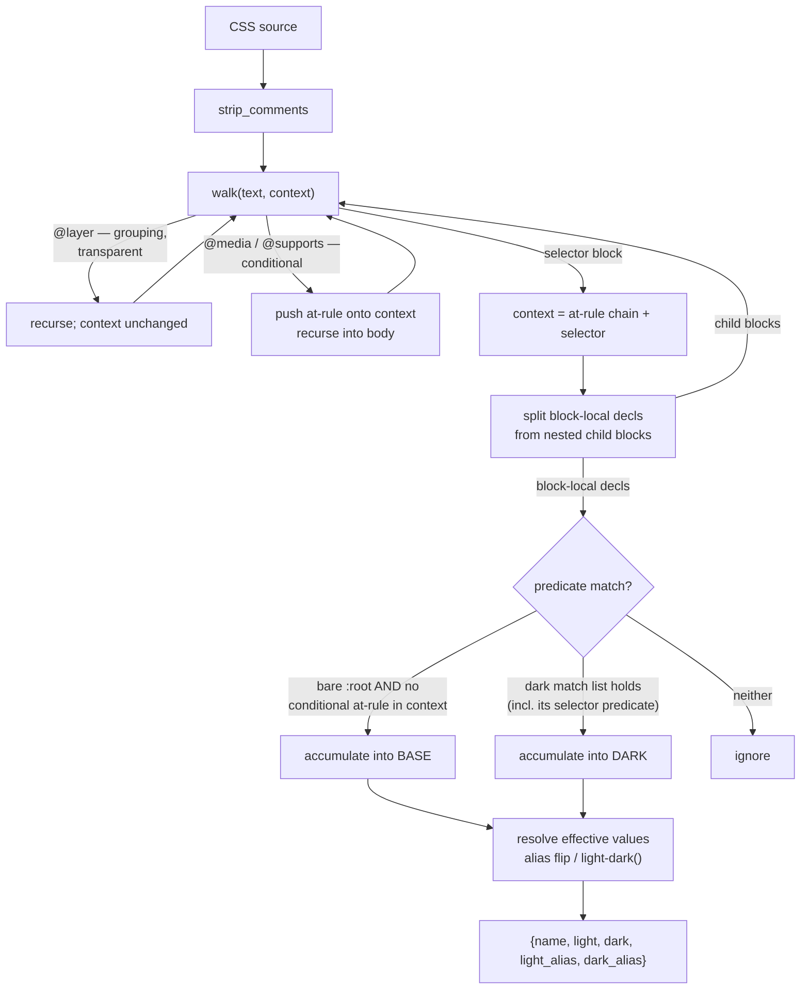

# Token Bridge - Scope Predicate Engine

## Goal Capsule

- **Objective:** Generalize how token-bridge locates a target repo's theme scopes. Replace the two hardcoded convention arms with a **context-predicate model**, close the parser gaps that silently produce wrong or empty token sets, and add a backstop so an unparseable source can never wipe a Paper file.
- **Product authority:** Shawn — personal tool.
- **Execution profile:** In-place change to `plugins/token-bridge/` in `shawnroos/shrimpshack`. Parser and emitter are restructured; the token record shape and every downstream module stay frozen. All work is offline-testable except the harvest theme signal, which needs a live page.
- **Stop conditions:** Stop and surface a blocker if the predicate model cannot express an existing config without breaking it (backward compatibility is non-negotiable — 1.0.0 is published), or if round-trip stability (R5 from the origin plan) cannot be held across the new scope shapes.
- **Tail ownership:** Branch `feature/token-bridge-class-selectors` in shrimpshack. Push = publish via marketplace autoUpdate, so the version bump lands with the work.
- **Open blockers:** None.

**Origin:** extends `plugins/token-bridge/docs/plans/2026-07-18-001-feat-token-bridge-plan.md`, which deliberately deferred scoped-class support (`:47`, `:77`) as "the cheapest convention to restore when generalizing." This is that restore, plus the gaps found while reproducing it.

---

## Problem Frame

A target repo's theme signal is class-scoped (`.wcs-dark`), which token-bridge cannot parse. Investigating that turned up a broader defect class: the parser assumes **every interesting block sits at brace-depth 0**, and it fails silently when that assumption breaks.

All of the following were reproduced against the current code, not inferred:

| Source shape | Result today | Severity |
|---|---|---|
| `@layer tokens { :root {…} }` | `[]` — zero tokens | Silent total loss |
| `:root { &[data-theme="dark"] {…} }` | `light: "#000"` — the **dark** value | Silent inversion |
| Two `:root` blocks | Second silently dropped | Silent partial loss |
| `@media` / `@supports` wrapping a dark scope | `dark: null` | Silent — reads as theme-invariant |
| `{"type":"class", …}` | `ValueError` at `parse_tokens.py:210` | Loud |

The failures escalate because `sync_tokens.run()` has no empty-parse guard. Confirmed directly:

```
EMPTY desired vs 2 live tokens →
  deletes: ['--brand-accent', '--brand-bg']
  => run(apply=True) at sync_tokens.py:486 would APPLY THE DELETES
```

So a repo using `@layer` — standard in Tailwind v4 and Open Props — does not get a parse error. It gets its Paper file wiped. `connect` writes `"prefix": null` by default (`connect.py:91`), which flips `_owns` (`sync_tokens.py:248-259`) to own the **entire** Paper file, making the default configuration the maximally destructive one.

**Frame:** this is one root cause (depth-0 assumption) with several surface symptoms, plus a missing safety net that converts each symptom into data loss.

---

## Requirements

- **R1.** A class-scoped dark theme parses correctly. `.wcs-dark` matches `.wcs-dark`, `html.wcs-dark`, `:root.wcs-dark`, `.wcs-dark:hover`; it must **not** match `.wcs-darker`.
- **R2.** Theme scopes are **internally** represented as composable predicates, with conjunction supported in the engine. The public config surface stays at the named types — see KTD2a.
- **R3.** Existing configs keep working unchanged. The named types desugar to predicates; no config migration.
- **R4.** Scopes are found at any nesting depth — inside `@layer`, `@media`, `@supports`, or a combination.
- **R5.** Declarations are read from the block that owns them. A nested child block's declarations never leak into the parent's.
- **R6.** All blocks matching a scope are accumulated, not just the first.
- **R7.** A non-empty source that parses to zero tokens refuses to sync rather than deleting live tokens.
- **R8.** Round-trip stability holds across every new scope shape: emit → parse → diff is empty.
- **R9.** Declaration parsing survives ordinary real-world CSS — missing trailing semicolons, minification, `!important`, `var()` fallbacks, semicolons inside values, underscores in names.
- **R10.** `light-dark(a, b)` resolves into the light/dark record.
- **R11.** The live-page harvest theme signal supports class, read off the same element the parser's scope implies.
- **R12.** Docs state what is actually supported. No advertised capability that silently produces wrong answers.
- **R13.** A newly scaffolded config owns only its own token namespace. `connect` no longer writes `"prefix": null`, which flips `_owns` to claim the entire Paper file. Existing configs are untouched.

**Frozen (explicitly out of scope):** the `{name, light, dark, light_alias, dark_alias}` record shape and every downstream consumer — `classify_tokens`, `sync_tokens.build_desired`, `map_to_tokens`. Per origin KTD2. This plan only widens *how the parser finds and reads scopes*.

---

## Key Technical Decisions

- **KTD1. A theme scope is a predicate over a declaration block's context.** The context is the chain of enclosing at-rules plus the block's own selector. A convention matches when its predicate holds for that context. This replaces the two-arm `if/elif` dispatch in `_scope_decls` with one mechanism.

- **KTD2. Predicates compose with AND; the conventions array composes with OR.** Within one convention, a `match` list is a conjunction — every predicate must hold. Across the array, any entry can identify the dark scope, with `primary` as the existing tiebreak (origin KTD3). Two clean levels; `body.wcs-theme.wcs-dark` is a two-element conjunction, not a new type.

- **KTD3. Named types stay as sugar.** `{type:'class', class:'wcs-dark'}` desugars to `{match:[{class:'wcs-dark'}]}`; `data-attribute` and `media-query` likewise. Desugaring happens once at config load. Everything downstream sees only predicates. This satisfies R3 without a 2.0.0 — token-bridge is published at 1.0.0.

- **KTD2a. The predicate model is the engine, not the config surface.** v1.1.0 accepts exactly three named types — `data-attribute`, `media-query`, `class`. The `match:[…]` form stays internal: it is what the named types desugar *to*, not something a user authors. Rationale: no config in evidence needs a conjunction (the driving repo uses a single `.wcs-dark`), and a published config form is frozen by the same backward-compat rule this plan calls non-negotiable — so exposing it now buys an untested permanent commitment. Conjunction machinery still ships and is exercised on every run, because `media-query` itself desugars to a two-predicate conjunction (KTD3). Widening the surface later is additive and cheap; narrowing it would not be.

  **Every match list must contain at least one selector-level predicate.** An at-rule predicate constrains only the enclosing chain, never which block inside it is selected, so `media-query` desugars to a **two**-predicate conjunction: `{type:'media-query', query:Q}` → `{match:[{media:Q},{selector:':root'}]}`. Without the `:root` anchor, every rule inside the dark `@media` matches — `tests/fixtures/tokens_mediaquery.css` carries a deliberate `.foo { --brand-accent: #ff0000; }` decoy inside that block precisely to catch this, and today's `_media_query_block` avoids it by returning `_base_block(body)`. The anchor preserves that behavior rather than assuming it.

- **KTD4. Class matching is boundary-anchored, not substring.** A class token ends at `.`, `:`, `[`, whitespace, `,`, a combinator, or end-of-selector. `.wcs-dark` must not match `.wcs-darker`. This is the one genuine correctness subtlety in the class predicate — the attribute predicate gets boundary safety for free from its brackets.

- **KTD5. Scope resolution is a recursive walk that accumulates — and at-rules split by conditionality.** Descend through every at-rule, carrying the at-rule chain as context; collect **all** blocks whose context satisfies the predicate and merge their declarations in source order. This closes R4, R6, and the wrapped-scope symptom together. `_match_brace` (`parse_tokens.py:98`) is already brace-aware and is reused as-is; only `_top_level_rules`' depth-0 restriction goes.

  **Grouping at-rules are transparent; conditional ones are not.** `@layer` (and other unconditional wrappers) do not change when a block applies — a bare `:root` inside one **is** the base. `@media`, `@supports`, and `@container` are conditional: they stay part of the context, and a bare `:root` inside one is **never** the base, only a dark-scope candidate when a media predicate matches. Losing this distinction is not a nitpick — `tests/fixtures/tokens_mediaquery.css` puts a bare `:root` inside `@media (prefers-color-scheme: dark)`, so an unconditional "any depth" rule would accumulate the dark value into the base and **reintroduce the exact light/dark inversion this plan exists to fix**, for every existing media-query user. `parse_tokens.bats:107` already asserts against it.

- **KTD6. Declaration parsing becomes block-local.** `_parse_decls` currently regex-scans a block body including its nested children, which is what inverts light and dark under CSS nesting. Excise nested blocks from the body before scanning declarations, and recurse into them as their own contexts. This is what makes nesting *supported* rather than merely refused.

- **KTD7. The empty-parse backstop is independent of every parser fix — and covers total loss only.** A guard in `sync_tokens.run()` — non-empty source text but zero parsed tokens → refuse with an actionable error, apply nothing. It lands first and stays valuable if a future parser gap appears. **Be honest about its reach:** three of the five reproduced failures (the light/dark inversion, the dropped second `:root`, `dark: null` under a wrapped scope) yield *non-empty* token sets and sail straight past this guard. It is a floor against catastrophic loss, not a safety net for correctness — the per-failure regression tests in U2 and U4 are the only real defense against partial or wrong results.

- **KTD8. Emit inverts a predicate to a selector.** A conjunction of class predicates renders `:root.wcs-theme.wcs-dark`; an attribute predicate renders `:root[attr="value"]`; an at-rule predicate wraps the block. Emit and parse are a coupled pair — only the round-trip test (R8) proves they agree, so every new scope shape needs one.

- **KTD9. `light-dark()` resolves at parse, not downstream.** `--x: light-dark(#fff, #000)` yields `light: "#FFF", dark: "#000"` from a single declaration in the base scope. The record shape is unchanged; this is purely a value-level read.

---

## High-Level Technical Design

The resolver walks the stylesheet once, carrying context, and tests each block against the desugared predicates.



The predicate model, and how the named types desugar onto it:

```
themeConventions: [                        # OR across entries (primary tiebreak)
  { type: 'class', class: 'wcs-dark' },    # sugar
  { match: [                               # explicit form
      { class: 'wcs-theme' },
      { class: 'wcs-dark'  } ] }           # AND within an entry
]

desugar:
  {type:'class',          class:C}         -> {match:[{class: C}]}
  {type:'data-attribute', attr:A, value:V} -> {match:[{attr: A, value: V}]}
  {type:'media-query',    query:Q}         -> {match:[{media: Q},
                                                      {selector: ':root'}]}   # anchor

predicate kinds:
  {class: C}          selector carries .C at a class boundary   (KTD4)
  {attr: A, value: V} selector carries [A="V"]
  {selector: S}       selector IS S (the :root anchor)
  {media: Q}          an enclosing @media matches Q  — at-rule only,
                      never selects a block alone (KTD3)

emit (inverse):
  [{class:'wcs-theme'},{class:'wcs-dark'}] -> :root.wcs-theme.wcs-dark
  [{attr:'data-theme',value:'dark'}]       -> :root[data-theme="dark"]
  [{media:'(prefers-color-scheme: dark)'}] -> @media (…) { :root { … } }
```

*Directional guidance for review — not implementation specification.*

---

## Implementation Units

### U1. Empty-parse backstop in sync

- **Goal:** A non-empty source that parses to zero tokens refuses to sync instead of deleting every live token.
- **Requirements:** R7
- **Dependencies:** none — lands first, independent of all parser work
- **Files:** `plugins/token-bridge/lib/sync_tokens.py`, `plugins/token-bridge/tests/unit/reconcile.bats`
- **Approach:** Guard in `run()` before the apply at `:486`. Refuse — return an error result, apply nothing, non-zero exit — whenever the parse yields **zero tokens and the live owned set is non-empty**. Message names the likely cause (unparseable scope shape, or a truncated/empty source) and the source path.

  **The trigger is "zero desired against non-empty live", NOT "non-empty source".** Gating on source-text emptiness leaves the worst case wide open: a blank or truncated source file also parses to zero tokens, and under the `connect` default `prefix: null` (whole-file ownership) that deletes every live token with `ok: true` and exit 0. "Don't error on an empty source" is not the same as "don't delete on an empty source" — conflating them is a data-loss hole. A blank source against an **empty** live set stays a genuine no-op; a blank source against a **populated** one refuses. If an operator genuinely wants to empty the Paper file, that needs an explicit opt-in flag, not silence. Note that `run()`'s docstring at `:434-436` already claims to cover destructive reconcile — this makes the claim true.
- **Execution note:** Write the failing test first — assert deletes are produced today, then that the guard refuses. This is the safety net for everything downstream; it needs to demonstrably bite.
- **Test scenarios:**
  - Non-empty source parsing to zero tokens + non-empty live set → refuses, applies nothing, non-zero exit, error names the source path.
  - Genuinely empty source file **against an empty live set** → no-op, exit zero, not an error.
  - **Blank/truncated source against a POPULATED live set → refuses, deletes nothing** (the data-loss case; assert zero deletes end-to-end, not just the pure guard's return value).
  - Comments-only source against a populated live set → refuses on the same rule.
  - Source parses to a *subset* of live (a real deletion) → still applies. The guard must not block legitimate deletes.
  - Comments-only source → treated as empty, no-op.
  - `@layer`-wrapped source against a populated Paper file → refuses (this is the exact reproduced wipe).
- **Verification:** The reproduced `@layer` wipe no longer deletes anything; legitimate deletions still apply.

### U2. Scope-context predicate engine

- **Goal:** Replace depth-0 rule scanning with a recursive, context-carrying walk that accumulates all matching blocks.
- **Requirements:** R1, R2, R4, R6
- **Dependencies:** none (U1 is independent; order is safety-first, not technical)
- **Files:** `plugins/token-bridge/lib/parse_tokens.py`, `plugins/token-bridge/tests/unit/parse_tokens.bats`, `plugins/token-bridge/tests/fixtures/tokens_class.css`, `plugins/token-bridge/tests/fixtures/tokens_multiroot.css`, `plugins/token-bridge/tests/fixtures/tokens_nested_scope.css`
- **Approach:** Introduce a walk that descends through at-rule blocks carrying the at-rule chain, replacing `_top_level_rules`' depth-0 restriction (`:118-139`). Reuse `_match_brace` (`:98`) unchanged. Split at-rules by conditionality per KTD5 — grouping at-rules are transparent, conditional ones stay in the context and disqualify a base match. Add predicate matchers: class (boundary-anchored per KTD4), attribute (the existing `_data_attribute_block` regex logic at `:171-183`, lifted to a predicate), selector-equals (the `:root` anchor), and media (the existing `_canon_media` exact-match at `:147-152`). **Include the desugaring function (KTD3) in this unit**, not U3 — retiring the `_scope_decls` if-elif (`:202-211`) without desugaring in the same commit would leave existing `{type:'data-attribute'}` configs with no predicate to evaluate, so U2 could not land green on its own. Retire `_data_attribute_block` / `_media_query_block` in favor of one predicate evaluation. Accumulate all matching blocks in source order rather than returning on first match — the fix for both `_base_block` (`:165-168`) and the dark-block equivalent. `_conv_label` (`:229`) renders a predicate conjunction for the origin plan's KTD3 disagreement warning.
- **Patterns to follow:** `_match_brace`'s brace-aware scanning; the existing `_canon_media` whitespace-insensitive exact comparison (a compound query must stay a distinct scope).
- **Execution note:** Reproduce each failure as a test before fixing — the `@layer` empty result and the dropped second `:root` are both already confirmed at the CLI. See each new test fail once.
- **Test scenarios:**
  - `.wcs-dark` resolves a dark scope; base is the bare `:root`.
  - **`.wcs-darker` does NOT match `.wcs-dark`** — the boundary case, KTD4. Also `.wcs-dark-alt`.
  - Compound-selector class forms match: `html.wcs-dark`, `:root.wcs-dark`, `.wcs-dark:hover`, `.wcs-dark, .other`.
  - Conjunction: `{match:[{class:'wcs-theme'},{class:'wcs-dark'}]}` matches `body.wcs-theme.wcs-dark`, does **not** match `body.wcs-theme` alone or `body.wcs-dark` alone.
  - `@layer tokens { :root {…} }` → base resolves (today: `[]`).
  - `@media (min-width: 800px) { .wcs-dark {…} }` → dark resolves.
  - `@supports` wrapping a dark scope → resolves.
  - Two `:root` blocks → both accumulate; later declaration wins on conflict.
  - Two matching dark blocks → both accumulate.
  - `@media` exactness preserved: `@media screen and (prefers-color-scheme: dark)` is NOT the bare dark query.
  - Base anchoring holds: `:root.wcs-dark` is not mistaken for the bare-`:root` base.
  - **Conditional-at-rule base guard:** with a top-level `:root { --a: #fff }` and `@media (prefers-color-scheme: dark) { :root { --a: #000 } }`, base resolves `#FFF` — not `#000`. Run against `tokens_multiroot.css` with both a data-attribute and a media-query convention; base must stay `#AAAAAA`.
  - **`:root` anchor holds under a media convention:** the `.foo { --brand-accent: #ff0000 }` decoy inside `tokens_mediaquery.css`'s dark `@media` is not picked up as the dark scope.
  - `@layer` is transparent: a bare `:root` inside `@layer tokens` **is** the base (contrast with the conditional case above).
  - Existing data-attribute and media-query fixtures parse to byte-identical token sets (**regression guard**).
- **Verification:** All previously-reproduced silent failures now return correct tokens; existing `parse_tokens.bats` passes unchanged.

### U3. Config validation for the widened convention surface

- **Goal:** The validator accepts the class type and the explicit predicate form, and rejects malformed ones. (Desugaring itself lands in U2 so that unit can be green on its own.)
- **Requirements:** R1, R2, R3
- **Dependencies:** U2
- **Files:** `plugins/token-bridge/lib/parse_tokens.py`, `plugins/token-bridge/lib/paper_client.py`, `plugins/token-bridge/tests/unit/paper_client.bats`
- **Approach:** Extend `_validate_config` (`paper_client.py:124-135`) — today it hard-rejects anything outside the two names, which is the first gate a class config hits (the `ValueError` at `parse_tokens.py:210` is only reachable by calling the parser directly). Accept `class` (non-empty string `class`) as the third named type and rewrite the else-branch error to enumerate all three. Per KTD2a the validator **rejects** a user-authored `match:[…]` — that form is internal-only, so accepting it here would publish it by accident. The rejection message names the three accepted types **and** names `match` as the key to remove; it must not document `match`'s shape or present it as a supported alternative. Withholding the word entirely is worse, not safer: routing this through the generic bad-type error produces `type must be … 'class', got 'class'` on `{"type":"class", "match":[…]}` — self-contradictory, and it points at the type when the fix is to delete `match`. Someone who wrote the key already knows it exists. Keep the existing `primary` rule (`:136-141`) untouched — it operates on entries, which is the OR level.
- **Test scenarios:**
  - `{type:'class', class:'wcs-dark'}` validates and desugars to a one-predicate match.
  - `{type:'class'}` with no `class` → rejected, message names the missing field.
  - `{type:'class', class:''}` → rejected.
  - A user-authored `{match:[…]}` is **rejected** (KTD2a — internal form must not become public by accepting it).
  - Existing data-attribute and media-query configs validate and desugar unchanged (**backward-compat regression guard**).
  - A `media-query` entry desugars to a two-predicate conjunction including the `:root` anchor (proves conjunction ships even though it is not user-authorable).
  - Two conventions without `primary` → still rejected by the existing rule.
- **Verification:** Every fixture config in `tests/fixtures/` still validates; a class config validates end-to-end into a parse.

### U4. Block-local, robust declaration parsing

- **Goal:** Declarations are read from the block that owns them, and survive ordinary real-world CSS.
- **Requirements:** R5, R9
- **Dependencies:** U2
- **Files:** `plugins/token-bridge/lib/parse_tokens.py`, `plugins/token-bridge/lib/emit_tokens.py`, `plugins/token-bridge/tests/unit/parse_tokens.bats`, `plugins/token-bridge/tests/unit/emit.bats`, `plugins/token-bridge/tests/fixtures/tokens_nested.css`
- **Approach:** Two coupled changes. **Block-local scanning (KTD6):** excise nested child blocks from a body before `_parse_decls` (`:242-247`) scans it, and hand those children back to the walk as their own contexts — this is what fixes the confirmed light/dark inversion and makes nesting genuinely supported. **Declaration robustness:** `_DECL` (`:62`) requires a trailing `;`, which drops the last declaration in a block and makes minified CSS parse to nothing; make the terminator optional at block end. Widen the name charset to include `_`. Handle semicolons inside quoted values and `url()` (data URIs currently truncate). Strip `!important` from the captured value so it does not leak into the token and get silently declined by `classify_tokens`. Widen `_VAR` (`:65`) to accept `var(--x, fallback)` — its "no fallbacks are used anywhere in the source" comment is a leftover assumption from the WCS-specific predecessor and is false for a generic repo. **`_VAR` is a shared seam, not a private regex:** `VAR_ALIAS_RE = _VAR` (`parse_tokens.py:294`) is consumed by `emit_tokens._strip_dark_alias` (`emit_tokens.py:76`), so widening it silently changes emit too — `var(--y-dark, #eee)` starts matching and re-emits as `var(--y)` with the fallback gone. On the forward path `sync_tokens._light_value` writes `var(--base)` and drops the fallback the same way. Dropping a fallback silently is the exact defect class this plan exists to close, so warn naming the discarded fallback rather than losing it quietly.
- **Execution note:** Each of these is a separately reproduced defect. Add one failing test per defect before the fix — the inversion case especially, since a wrong-value bug passes a naive smoke test.
- **Test scenarios:**
  - `:root { --a: #fff; &[data-theme="dark"] { --a: #000; } }` → `light: "#FFF", dark: "#000"` (today: `light: "#000"`, inverted).
  - Nested child declarations never appear in the parent's set.
  - Last declaration in a block with no trailing `;` is captured.
  - Fully minified single-line CSS parses to the same tokens as its pretty form.
  - `--brand_accent` (underscore) is captured.
  - `--icon: url("data:image/svg+xml;utf8,<svg/>")` captured whole, not truncated at the internal `;`.
  - `--a: #fff !important` → `light: "#FFF"`, classifies as a color.
  - `--a: var(--base, #eee)` recognized as an alias to `--base`; the alias-flip invariant holds.
  - A source using `var(--base, #eee)` warns that the fallback is discarded rather than dropping it silently.
  - Emit round-trip unaffected by the widened `_VAR`: a `--y-dark: var(--z-dark)` Paper token still emits `var(--z)` (**regression guard on the shared `VAR_ALIAS_RE` seam**).
  - Existing alias-flip and rgba fixtures still pass unchanged (**regression guard**).
- **Verification:** The nesting inversion is gone; `README.md:72`'s SCSS claim becomes true.

### U5. light-dark() value resolution

- **Goal:** `light-dark(a, b)` in a base declaration resolves into both record fields.
- **Requirements:** R10
- **Dependencies:** U4
- **Files:** `plugins/token-bridge/lib/parse_tokens.py`, `plugins/token-bridge/tests/unit/parse_tokens.bats`
- **Approach:** At effective-value resolution, detect `light-dark(A, B)` and split it into the light and dark fields for that token (KTD9). Argument splitting must be paren-aware — either side can itself be a function (`rgba(…)`, `var(…)`). A token whose base declaration is `light-dark()` needs no dark-scope entry; if a dark scope *also* declares it, the dark scope wins (it is the more specific signal) and parse warns rather than silently picking. Record shape unchanged.
- **Test scenarios:**
  - `--a: light-dark(#fff, #000)` → `light: "#FFF", dark: "#000"`, no dark scope needed.
  - Nested functions: `light-dark(rgba(0,0,0,.5), rgba(255,255,255,.5))` splits correctly on the top-level comma.
  - `light-dark(var(--x), var(--y))` → alias fields populated on both sides.
  - Token declared as `light-dark()` in base **and** overridden in a dark scope → dark scope wins, warning emitted.
  - Malformed `light-dark(#fff)` (one argument) → left as a literal value, warned, not crashed.
  - Whitespace variants: `light-dark( #fff , #000 )`.
- **Verification:** A source using only `light-dark()` for theming produces a complete two-theme token set with no dark scope declared.

### U6. Emit inversion from predicates

- **Goal:** Emit renders a predicate conjunction back to a CSS selector, and the round-trip closes for every new scope shape.
- **Requirements:** R8
- **Dependencies:** U2, U3
- **Files:** `plugins/token-bridge/lib/emit_tokens.py`, `plugins/token-bridge/tests/unit/emit.bats`
- **Approach:** Replace `_dark_block`'s type dispatch (`:90-100`) with predicate inversion (KTD8): class predicates append to the selector (`:root.wcs-theme.wcs-dark`), an attribute predicate appends `[attr="value"]`, a media predicate wraps the block in `@media`. A conjunction mixing selector predicates with a media predicate produces both — selector parts on the inner rule, media as the wrapper. The emitted selector and U2's matcher are a coupled pair; the round-trip test is the only thing that proves they agree. Indentation is **two spaces per nesting level**, which is what `_dark_block` already emits (2 inside `:root[…]`, 4 inside `@media { :root { … } }`) — the branches are not inconsistent, and new shapes follow the same rule so existing output stays byte-identical. Origin plan KTD7's dual-convention in-place refusal (`:174-193`) keys only on entry count and is unaffected.
- **Test scenarios:**
  - Class convention emits `:root.wcs-dark { … }`.
  - Media convention emits the `@media` wrapper with the `:root` anchor inside — i.e. the internal two-predicate conjunction inverts to today's byte-identical output.
  - An internal multi-class conjunction emits `:root.wcs-theme.wcs-dark { … }` (unit-level test on the inverter; not reachable from config per KTD2a).
  - **Round-trip for each config-authorable shape:** emit → parse → diff empty (data-attribute, media-query, class, `@layer`-wrapped source).
  - Existing data-attribute and media-query emit shapes are byte-unchanged (**regression guard** — these are published output).
  - Existing round-trip tests pass unchanged.
  - Dual-convention in-place emit still refuses.
- **Verification:** `emit_tokens.roundtrip` returns an empty diff for every convention shape in the test matrix.

### U7. Connect CLI and harvest class signal

- **Goal:** `connect` can scaffold a class config with safe default ownership, and the live page reports class-based dark correctly.
- **Requirements:** R1, R11, R13
- **Dependencies:** U3
- **Files:** `plugins/token-bridge/lib/connect.py`, `plugins/token-bridge/lib/harvest_extract.js`, `plugins/token-bridge/lib/harvest.py`, `plugins/token-bridge/tests/unit/connect.bats`, `plugins/token-bridge/tests/unit/harvest.bats`
- **Approach:** In `connect.py`: add `class` to `--convention` choices (`:212`), add a `--class` flag — note it must use `dest="class_name"` since `class` is a Python keyword — add the branch to `_convention` (`:58-70`) mirroring media-query's required-arg error, and add the branch to `_theme_signal` (`:79-83`). That last one is the silent trap: a class convention currently falls through to the data-attribute return and raises `KeyError: 'attr'` while writing the config. Give `_convention`'s new parameter a default so the positional call in `connect.bats:97-99` does not break.

  **Stop scaffolding whole-file ownership (R13).** `connect` writes `"prefix": null` today (`:91`), which flips `_owns` (`sync_tokens.py:248-259`) to claim the entire Paper file — the Problem Frame names this as what escalates any parse loss into total destruction, and U1's guard only covers the zero-token case. Derive a default prefix from the source's own custom properties (the dominant leading segment, e.g. `--brand-`) and write that; when no dominant prefix is inferable, refuse to scaffold a null prefix silently — require `--prefix` explicitly, or write it null only with a loud warning naming the whole-file-ownership consequence. **Scaffolding-time only:** existing configs are never rewritten, and a null prefix stays legal at read time so 1.0.0 configs keep working. In `harvest_extract.js`: add a `class` branch to the signal reader (`:109-120`) checking `classList.contains` on `documentElement` and `body`, mirroring the data-attribute html-or-body check. **This branch fails silently if missed** — `theme` stays `"light"` and every harvested component is mislabelled with no error anywhere. `_validate_config` does not check `harvest.themeSignal` today; adding that check is deferred (see Scope Boundaries) and is out of scope for this unit.
- **Execution note:** The harvest signal is the one path needing a live page. Verify it against a real class-toggled page, not only the unit test — a JS branch that never fires is exactly the silent failure being fixed.
- **Test scenarios:**
  - `connect --convention class --class wcs-dark` writes `themeConventions[0].type == "class"` and `.class == "wcs-dark"`.
  - Same invocation writes `harvest.themeSignal.type == "class"` (guards the `KeyError`).
  - `--convention class` with no `--class` → exit 2, actionable message.
  - Existing data-attribute default and media-query invocations write unchanged configs (**regression guard**).
  - `build_extract_js` injects a class signal into the JS payload.
  - Class signal against a DOM with the class on `<html>` → `theme: "dark"`; on `<body>` → `"dark"`; absent → `"light"`.
  - Class signal where the page has `.wcs-darker` but not `.wcs-dark` → `"light"` (boundary case reaches the live path too).
  - **R13:** `connect` against a source whose properties share a dominant prefix scaffolds that prefix, not null.
  - **R13:** `connect` against a source with no inferable dominant prefix does not silently write null — it requires `--prefix` or warns naming whole-file ownership.
  - **R13:** an existing config carrying `"prefix": null` still loads and syncs (**backward-compat guard** — the change is scaffolding-time only).
- **Verification:** A class-themed page harvests with the correct theme label against a running dev server.

### U8. Docs, honesty pass, and publish

- **Goal:** Documentation states what is actually supported; the plugin ships.
- **Requirements:** R12
- **Dependencies:** U1-U7
- **Files:** `plugins/token-bridge/README.md`, `plugins/token-bridge/token-bridge.config.json`, `plugins/token-bridge/skills/connect/SKILL.md`, `plugins/token-bridge/skills/normalize-to-code/SKILL.md`, `plugins/token-bridge/skills/normalize-to-design/SKILL.md`, `plugins/token-bridge/commands/connect.md`, `plugins/token-bridge/commands/normalize-to-design.md`, `plugins/token-bridge/.claude-plugin/plugin.json`, `.claude-plugin/marketplace.json`
- **Approach:** Flip the `scoped-class … deferred` row in the README conventions table (`:29-33`) to supported, and remove scoped-class from the deferred list (`:89`). Document the three named types as the config surface — **not** the internal predicate model or the `match` form (KTD2a; documenting it would publish it). Document the new `connect` prefix default and why whole-file ownership was the wrong default (R13). Update the two `_comment` schema strings in `token-bridge.config.json` (`:21`, `:30`) — these are the de-facto schema docs. Add the class invocation to `skills/connect/SKILL.md:21` and its exit-2 case at `:45`; update the convention enumerations in the two normalize skills and the two command files. Record the remaining honest limits: `@import` is not followed, multi-file sources and multiple named themes stay deferred, and the reserved `-dark` suffix still round-trips lossily for a genuine `--border-dark` (origin plan `:90` — unchanged here, but worth stating). Bump `plugin.json` and the marketplace entry `1.0.0` → `1.1.0` together.
- **Test scenarios:** *Test expectation: none — documentation and version metadata.* Verification is the full suite plus a manual read-through against the shipped behavior.
- **Verification:** `tests/run-tests.sh` fully green. No doc claims a capability the code does not have. `claude plugin validate token-bridge` passes.

---

## Verification Contract

- `plugins/token-bridge/tests/run-tests.sh` green in full.
- Every reproduced failure in the Problem Frame table has a test that fails before its fix and passes after.
- Backward compatibility: every existing fixture config validates, parses, and emits byte-identically. This is the single most important regression guard — 1.0.0 is published.
- Round-trip (R8) empty for every config-authorable shape: data-attribute, media-query, class, and an `@layer`-wrapped source.
- The config validator rejects a user-authored `match:[…]` (KTD2a — the internal form stays internal).
- A newly scaffolded `connect` config carries a non-null `prefix` (R13).
- The `@layer` wipe scenario refuses at U1's guard with a populated Paper file.
- Harvest class signal verified against a live class-toggled page, not only in unit tests.

## Definition of Done

All eight units landed, the Verification Contract holds, docs make no false capability claims, version bumped in both `plugin.json` and the marketplace entry, and the branch is pushed (which publishes).

---

## Scope Boundaries

**In scope:** scope-finding, scope-reading, and the safety net around them.

**Deferred to follow-up work:**
- Multi-file sources / `@import` following — needs a resolver and a file-graph model.
- Multiple named themes beyond base + dark — requires widening the frozen record shape and rewriting `classify_tokens`, `sync_tokens`, and `map_to_tokens` (origin KTD2).
- The reserved `-dark` suffix collision: a genuine `--border-dark` is silently reinterpreted as the dark twin of `--border` (`emit_tokens.py:119-125`). Origin plan `:90` says parse/emit "may warn"; no warning exists. Real, but a distinct defect class from scope resolution.
- `classify_tokens`' hardcoded English name hints (`:131-144`) — terse token names like `--sp-2` and `--r-md` are silently declined.
- Validating `harvest.themeSignal` in `_validate_config` — noted in U7, cheap, but not required by any requirement here.
- User-authored predicate conjunctions in config (`match:[…]`). The machinery ships and is exercised internally; only the public surface waits. Additive to add later — see KTD2a.

**Not doing:** any change to the token record shape or its downstream consumers.

---

## Risks

- **Backward-compatibility regression is the top risk.** The desugaring layer and the emit rewrite both sit under published behavior. Mitigation: byte-identical emit assertions and full fixture-config revalidation as explicit regression guards in U3 and U6.
- **Parse and emit drifting apart.** They are a coupled pair with no compile-time link. Mitigation: a round-trip test per scope shape (R8) is the only real proof; treat a missing round-trip test as an incomplete unit.
- **The recursive walk is the largest single change** and sits under everything. Mitigation: it lands as its own unit (U2) with each previously-reproduced failure as a test. Note the U1 backstop does **not** cover it — U1 fires only on a zero-token parse, while a walk regression typically yields a wrong-but-non-empty set (a swallowed dark value, a dropped twin) that passes the guard and still produces deletes. U2's regression tests are the sole guard here, so treat a missing one as an incomplete unit.
- **The conditional-vs-grouping at-rule distinction is the subtlest part of U2** and was a genuine near-miss in review: an unqualified "descend any depth" rule reintroduces the light/dark inversion for every media-query user. Mitigation: it is stated in KTD5 and pinned by three explicit U2 test scenarios against the existing fixtures.
- **Silent failures are the defining hazard of this codebase** — most defects here return `''` or `[]` rather than raising. Prefer a loud refusal over a plausible empty result anywhere new code makes this choice.

---

## Sources

- `plugins/token-bridge/docs/plans/2026-07-18-001-feat-token-bridge-plan.md` — origin plan; KTD2 (frozen record shape), KTD3 (primary convention), KTD7 (emit lossiness), the scoped-class deferral at `:47` and `:77`.
- `docs/handoff.md` — spinoff brief; touch-site starting points, since extended (it did not list `paper_client.py` validation or `emit_tokens.py`).
- Live reproduction against the current code — every Problem Frame table row, and the `sync_tokens.run()` delete escalation.
