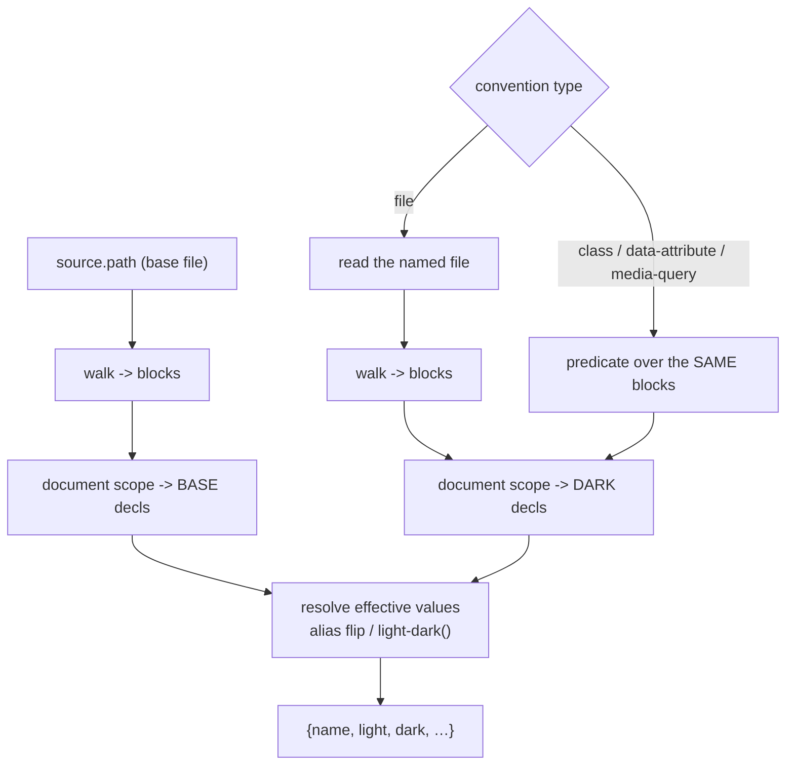

# File-as-theme convention + document-scope base

## Goal Capsule

- **Objective:** Let token-bridge read a codebase whose light and dark themes live in **separate files** rather than in two scopes of one file, and widen the base scope from `:root` to any document-level selector. Together these are what a real Angular/Bootstrap app needs.
- **Driver:** Slate's web-app is the first real use case. `src/styles/themes/light.scss` and `dark.scss` each declare `:root { … }`; 9 custom properties overlap. No selector predicate can distinguish them, because the distinguishing fact is the *filename*.
- **Execution profile:** `plugins/token-bridge/` in shrimpshack, on top of 1.2.0. Offline-testable throughout.
- **Stop conditions:** Stop if the round-trip fixed point (origin R5) cannot be preserved across a two-file emit.
- **Open blockers:** None.

---

## Problem Frame

Two independent gaps, found by pointing 1.2.0 at Slate's web-app.

**1. Base scope was `:root`-only.** Slate declares document-level properties on `html, body` and `html`. Those parsed to nothing. *(Already implemented on this branch; carried here for the record.)*

**2. Dark is a FILE, not a scope.** This is the real blocker:

```
themes/light.scss   :root { --primary-text-color: #21242e;      … }   25 props
themes/dark.scss    :root { --primary-text-color: #{$shade100}; … }   10 props, 9 overlapping
```

Every existing convention is a **predicate over a block's context** — a selector marker or an enclosing at-rule. Both files here use the *same* selector (`:root`). There is nothing in the block context to match on, so the predicate model cannot express this shape at all. It is the first convention that is not a selector predicate.

**Not solved here, and deliberately:** dark's values are Sass-interpolated (`#{$shade100}`). Those are build-time and will be **declined** at classify, per the existing compile-first stance. File-as-theme makes the *scope* readable; it does not make uncompiled Sass syncable. For Slate, 5 of the 9 overlapping tokens are literals and will sync; 4 are interpolated and will decline with a reason.

---

## Requirements

- **R1.** The base scope is any bare document-level selector — `:root`, `html`, or `body` — never a component selector, however many custom properties it declares.
- **R2.** A `file` convention resolves the dark scope from a **different file**: the document scope of the file it names.
- **R3.** The named file resolves relative to the repo root, like `source.path`, and honors `followImports` when set.
- **R4.** Existing configs are unchanged. `file` is a new type; the three predicate types keep working exactly as they do.
- **R5.** The round-trip fixed point holds: emit → parse → diff is empty for a file convention too.
- **R6.** Emit never silently writes a partial theme. If it cannot write both halves, it refuses with an actionable error rather than emitting base-only.
- **R7.** A missing or unreadable dark file is a loud refusal, never a silently empty dark scope — an empty dark scope reads as "no token varies by theme", which sync would apply as deletions of every `-dark` twin.

**Frozen:** the `{name, light, dark, light_alias, dark_alias}` record shape and all downstream modules (origin KTD2).

---

## Key Technical Decisions

- **KTD1. `file` is a convention type, not a new config section.** `{"type": "file", "path": "src/styles/themes/dark.scss"}` sits in `themeConventions` beside the others, so `primary`, the disagreement warning, and the emit selection all work unchanged. The alternative — a top-level `source.darkPath` — would have put theme information in two places.

- **KTD2. The dark scope inside the named file is its DOCUMENT scope.** Same rule as the base (R1), so the two halves are symmetric and there is one definition of "the scope of a theme file" rather than two. A file convention that *also* wanted an inner selector would be a predicate convention; that case is already covered.

- **KTD3. A file convention is resolved at load, not during the block walk.** The walk matches predicates over one text; a file convention names a *different* text. So `load_source` returns the base text and a per-convention map of dark texts, and the walk runs per-text. This keeps the predicate engine untouched — the file convention rides beside it rather than inside it.

- **KTD4. Emit writes both halves or refuses (R6).** `emitTarget` receives the base block. A file convention names its own `emitTarget`; without one, emit refuses. Writing only the base would leave the dark file stale and silently drift the two apart — the same silent-wrong-answer class this codebase keeps closing. The refusal message names the missing key.

- **KTD5. Round-trip is proven across the pair.** `roundtrip` emits both files, parses them back through the same two-file config, and diffs. A single-file fixed point would prove nothing about the shape that actually matters here.

---

## High-Level Technical Design



```
config:
  source:           { path: "themes/light.scss", prefix: "--", followImports: true }
  emitTarget:       "themes/light.generated.scss"
  themeConventions: [ { type: "file",
                        path: "themes/dark.scss",
                        emitTarget: "themes/dark.generated.scss",
                        primary: true } ]

parse:  base = document scope of source.path
        dark = document scope of convention.path
emit:   base block -> emitTarget
        dark block -> convention.emitTarget      (refuse if absent, KTD4)
```

*Directional guidance for review, not implementation specification.*

---

## Implementation Units

### U1. Document-scope base

- **Goal:** Base is `:root`, `html`, or `body`; never a component selector.
- **Requirements:** R1
- **Dependencies:** none — *already implemented on this branch*
- **Files:** `plugins/token-bridge/lib/parse_tokens.py`, `plugins/token-bridge/tests/unit/parse_tokens.bats`
- **Test scenarios:** `:root`/`html`/`body`/`html, body` are base; `html.dark`, `:root[data-theme="dark"]`, `body.theme-dark`, `.tooltip`, `html body` are not; a repo splitting tokens across `:root` and `html, body` merges both in source order; existing golden fixtures parse byte-identically.
- **Verification:** the golden regression guard stays green.

### U2. `file` convention — config surface and validation

- **Goal:** The type is accepted, well-formed, and rejected clearly when malformed.
- **Requirements:** R2, R4
- **Dependencies:** U1
- **Files:** `plugins/token-bridge/lib/paper_client.py`, `plugins/token-bridge/lib/parse_tokens.py`, `plugins/token-bridge/tests/unit/paper_client.bats`
- **Approach:** Extend `_validate_config` for `type: "file"` (non-empty string `path`; optional string `emitTarget`). `desugar_convention` must NOT try to turn it into predicates — it is resolved at load (KTD3), so it needs its own branch that keeps it whole. Update the rejection message to enumerate four types.
- **Test scenarios:** valid file convention accepted; missing/empty `path` rejected naming the field; `emitTarget` optional at validate time (emit enforces it, KTD4); the three predicate types still validate unchanged; a user-authored `match` is still rejected.

### U3. Two-text parse

- **Goal:** A file convention's dark scope is read from its own file.
- **Requirements:** R2, R3, R7
- **Dependencies:** U2
- **Files:** `plugins/token-bridge/lib/parse_tokens.py`, `plugins/token-bridge/tests/unit/parse_tokens.bats`, `plugins/token-bridge/tests/fixtures/theme_files/`
- **Approach:** `load_source` returns the base text plus a `{convention_index: dark_text}` map, honoring `followImports` for each. The walk runs per text; a file convention's dark decls come from its own blocks' document scope. A missing/unreadable file **raises** (R7) — never an empty dark scope, which sync would apply as deleting every `-dark` twin.
- **Execution note:** write the missing-file test first and watch it fail; the failure mode it guards is silent mass deletion.
- **Test scenarios:** light+dark files resolve to one merged record set; a property in light only → `dark: null`; in dark only → the orphan-twin shape; in both → both values; a missing dark file refuses loudly; `followImports` applies to the dark file; the dark file's document scope is used (a component selector inside it is ignored); interpolated values still decline rather than syncing.

### U4. Two-file emit + round-trip

- **Goal:** Emit writes both halves or refuses; the fixed point holds.
- **Requirements:** R5, R6
- **Dependencies:** U3
- **Files:** `plugins/token-bridge/lib/emit_tokens.py`, `plugins/token-bridge/tests/unit/emit.bats`
- **Approach:** For a primary file convention, write the base block to `emitTarget` and the dark block to the convention's `emitTarget`; refuse naming the missing key when absent (KTD4). Existing single-file emit paths are untouched — assert byte-identical output for the three predicate types.
- **Test scenarios:** both files written with the expected blocks; missing convention `emitTarget` → refuses, writes nothing; **round-trip across the pair is empty** (KTD5); existing data-attribute/media-query/class emit output byte-unchanged; the KTD7 dual-convention in-place refusal still fires.

### U5. Docs + version

- **Goal:** Documentation states what is true, including what file-as-theme does *not* fix.
- **Requirements:** R1-R7
- **Dependencies:** U1-U4
- **Files:** `plugins/token-bridge/README.md`, `plugins/token-bridge/token-bridge.config.json`, `plugins/token-bridge/skills/*/SKILL.md`, `plugins/token-bridge/commands/*.md`, `plugins/token-bridge/.claude-plugin/plugin.json`, `.claude-plugin/marketplace.json`
- **Approach:** Add `file` to the conventions table and the base-scope description. Remove multi-file from the deferred list. **State plainly that file-as-theme does not make uncompiled Sass syncable** — a repo whose dark file interpolates Sass still needs a compile step, and its interpolated tokens will decline. Bump 1.2.0 → 1.3.0 in both files.
- **Test scenarios:** *none — docs and metadata.*

---

## Verification Contract

- Full suite green; every reproduced gap has a test that fails before its fix.
- Backward compat: golden fixtures parse byte-identically; the three predicate types emit byte-identically.
- Round-trip empty for the file convention **across both files** (KTD5).
- A missing dark file refuses; it never yields an empty dark scope.
- Verified against Slate's real `themes/light.scss` + `dark.scss`: the literal-valued overlapping tokens resolve to light/dark pairs, and the interpolated ones decline with a reason rather than syncing.

## Definition of Done

All five units landed, the Verification Contract holds, docs make no false claims, version bumped in both files, reviewed via `ce-code-review`, merged.

---

## Scope Boundaries

**Deferred:**
- Compiling Sass. Uncompiled values still decline (see the README's Sass section).
- Sass load paths (`node_modules`, `loadPaths`) — still relative-only.
- More than two theme files / multiple named themes — the record shape is frozen at base + dark.

**Not doing:** any change to the token record shape or downstream modules.

---

## Risks

- **Emit asymmetry is the main new hazard.** Writing one half of a two-file theme silently drifts them apart. KTD4's refuse-or-write-both is the mitigation, and it needs a test asserting *nothing* is written on refusal — a partial write is worse than no write.
- **A missing dark file must never read as "no theme variance."** That would delete every `-dark` twin. R7 makes it a raise; the test is the guard.
- **Backward compat** on emit output for the three existing types — byte-identical assertions, as in the previous two rounds.
